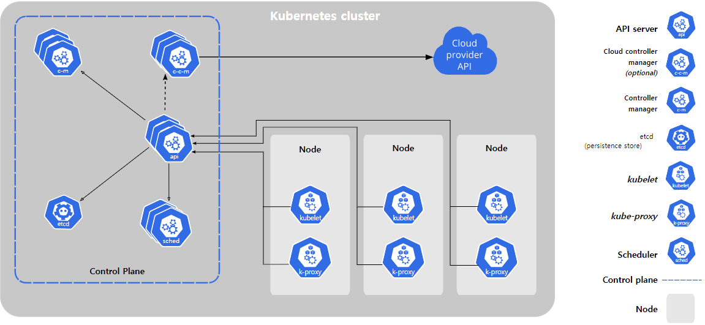

> [Home](/README.md)

# 0. 도커로 컨테이너 이미지 생성, 실행 공유
1. 환경 구축: 도커 설치, 컨테이너 실행
2. 애플리케이션 준비: 쿠버네티스에 배포할 간단한 Node.js 애플리케이션 생성
3. 패키징: 격리된 컨테이너로 실행하기 위해, 애플리케이션을 컨테이너 이미지로 패키징
4. 컨테이너 실행
5. 도커 허브에 이미지 푸시

## 0.1 도커 설치와 컨테이너 실행
- [도커 설치 위치](http://docs.docker.com/engine/installation/)
- busybox 를 run
```sh
$docker run bysybox echo "Hello world"
```
- 이미지 실행
    - `$ docker run <image>`
- 컨테이너 이미지에 버전 지정
    - `$ docker run <image>:<tag>`


[kubernetes.io](https://kubernetes.io/docs/concepts/overview/components/)

# 1. 쿠버네티스 구성 Components
- node: worker machine in Kubernetes. 
    - 워커 머신
    - run containerized applications
    - every cluster has at least one worker node
- pod: represents a set of running containers in your cluster. 
    - 클러스터 안에서 돌아가는 컨테이너들 세트
    - The worker nodes host the Pods that are the componets of the application workload. 
        - 노드들은 파드들을 호스트한다
- control plane: The container orchestration layer that exposes the API and interfaces to define/deploy/manage the lifecycle of containers
    - manages the worker nodes and the Pods in the cluster


## 1.1 Control Plane Components
### 1.1.1 kube-apiserver
- 쿠버네티스 API를 노출하는 쿠버네티스 control plane 컴포넌트
- API 서버는 컨트롤 플레인의 프론트 엔드

### 1.1.2 etcd
- 클러스터 데이터를 담는, 키-값 저장소

### 1.1.3 kube-scheduler
- Control plane component that watches for newly created Pods with no assigned node, and selects a node for then to run on

