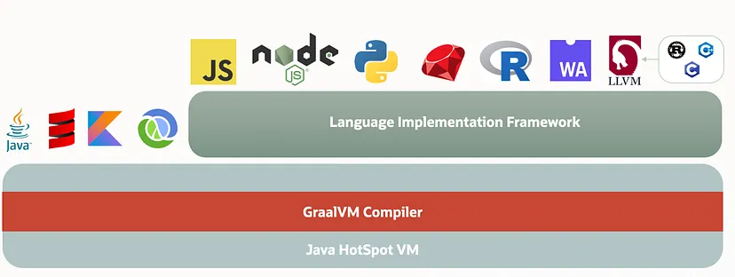

1. **GraalVM이란?**
2. **GraalVM 특징**
3. **네이티브 Java 코드 실행**
4. **GraalVM에서 Java 코드 실행 방식**
5. **GraalVM 아키텍처**
6. **AOT 컴파일**
7. **GraalVM vs JVM**

---

## 1. GraalVM이란?

- **GraalVM**은 **Ahead-Of-Time (AOT) 컴파일** 기능을 가진 고성능 JDK입니다.
- 기존 JIT 컴파일러를 대체하는 **Graal 컴파일러**를 통해 Java 애플리케이션의 성능을 크게 향상시킵니다.
- **애플리케이션 지연(latency)** 을 줄이고, **가비지 컬렉션 시간**을 단축하며, **최대 처리량**을 높입니다.

---

## 2. GraalVM 특징

- **낮은 리소스 사용**: 네이티브 이미지는 런타임 시 기존 JVM이 필요 없으므로 메모리와 CPU 사용량이 적습니다.
- **향상된 보안**: AOT 컴파일 시 정적 분석을 수행하여 런타임 클래스 로딩 및 리플렉션과 같은 공격 표면을 줄입니다.
- **빠른 시작**: 네이티브 바이너리는 바이트코드 해석이나 JIT 컴파일이 필요 없으므로 즉시 시작됩니다.
- **컴팩트한 패키징**: 네이티브 이미지는 필요한 애플리케이션 코드와 종속성만 포함하여 크기를 줄입니다.
- **프레임워크 지원**: Quarkus, Micronaut, Spring Boot와 통합되어 최적화된 애플리케이션 제작 가능.
- **클라우드 플랫폼 지원**: AWS Lambda, Google Cloud, Azure 등 주요 플랫폼에서 GraalVM을 지원.
- GraalVM은 **빠른 시작 시간**, **낮은 메모리 사용량**, **네이티브 이미지 생성**, **다중 언어 지원**을 제공하여 뛰어난 선택지로 자리 잡고 있습니다.

---

## 3. 네이티브 Java 코드 실행

- GraalVM의 개선점을 살펴보기 전에 **JDK**가 네이티브 Java 코드를 실행하는 방식을 이해해야 합니다.

### Java의 WORA 원칙

- **WORA**: 한 번 작성하면, 어디서나 실행 가능(Write Once, Run Anywhere).
- Java 코드는 한 번 작성하면, 기계 유형에 상관없이 호환 가능한 JVM에서 실행할 수 있습니다.

### 실행 프로세스

1. **소스 코드** → JDK가 이를 **바이트코드**로 컴파일.
2. **바이트코드** → JVM이 이를 실행.
3. JVM 내부 단계:
   - **클래스 로딩(Class Loading)**: 바이트코드를 로딩하여 실행 준비.
   - **바이트코드 검증(Byte Code Verification)**: 바이트코드가 안전한지 검증.
   - **JIT 컴파일(Just-In-Time Compilation)**: 런타임 시 바이트코드를 네이티브 코드로 변환하여 성능 최적화.

- **실행 흐름**:  
- `소스 코드 -> JDK -> 바이트코드 -> JVM`

---

## 4. GraalVM에서 Java 코드 실행 방식

- GraalVM은 Java의 기본 실행 방식을 따르지만, **Graal 컴파일러**를 통합하여 JIT 및 AOT 컴파일 성능을 향상시킵니다.
- 기존 JVM의 C2 컴파일러를 대체하여 **최적화된 컴파일** 및 **네이티브 이미지 생성**을 지원합니다.

---

## 5. GraalVM 아키텍처

### 1. **Java HotSpot VM**

- GraalVM의 기반 계층으로, 다음을 제공합니다:
  - **JIT 컴파일**
  - **가비지 컬렉션**
  - **스레드 관리**
- HotSpot VM은 Graal 컴파일러를 통합하여 기존 JVM보다 향상된 성능을 제공합니다.

### 2. **GraalVM 컴파일러 계층**

- **다중 언어 JIT 컴파일러**로, Java 및 기타 언어에 최적화된 컴파일을 제공합니다.
- **AOT 컴파일**을 지원하여 네이티브 이미지를 생성합니다.

### 3. **언어 구현 프레임워크 계층**

- GraalVM은 여러 프로그래밍 언어를 지원합니다.
- **Truffle 프레임워크**와 **LLVM 런타임**을 통해 다중 언어 런타임을 구축할 수 있습니다.

---

## 6. AOT 컴파일

- **AOT 컴파일(Ahead-Of-Time Compilation)**:
  - Java 애플리케이션을 런타임 이전에 네이티브 실행 파일로 변환.
  - **장점**:
    - 빠른 시작 시간.
    - 낮은 메모리 사용량.
    - 런타임 공격 표면 감소로 보안 강화.
  - Quarkus, Micronaut 같은 프레임워크에서 마이크로서비스를 최적화하는 데 사용됩니다.

---

## 7. GraalVM vs JVM

| **기능**             | **GraalVM**                       | **기존 JVM**                  |
| ------------------ | --------------------------------- | --------------------------- |
| **시작 시간**          | 매우 빠름 (AOT 네이티브 이미지)              | 느림 (JIT 컴파일 필요)             |
| **메모리 사용량**        | 적음 (네이티브 이미지)                     | 많음                          |
| **성능**             | 향상된 컴파일러로 최적화                     | JIT로 최적화되었지만 GraalVM보다는 낮음  |
| **언어 지원**          | 다중 언어 (Python, Ruby 등)            | Java 또는 JVM 언어 중심           |
| **애플리케이션 패키징**     | 컴팩트한 네이티브 실행 파일                   | JVM 런타임 필요                  |
| **클라우드 지원**        | AWS Lambda 등 주요 플랫폼 지원            | 제한적                         |
