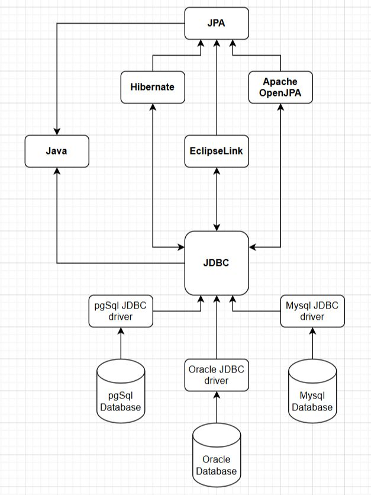
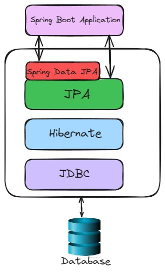

1. JDBC vs JPA
2. Spring Data JPA의 작동 방식
3. JPA와 ORM에 대한 베스트 프렉티스 가이드

## 1. JDBC vs JPA

- Java에서 관계형 데이터베이스를 사용할 때, **JDBC**(Java Database Connectivity)와 **JPA**(Java Persistence API)는 두 가지 대표적인 접근 방식입니다. 두 방식 모두 데이터 영속화를 목적으로 하지만, 작동 방식에는 큰 차이가 있습니다.



## **JDBC** (Java Database Connectivity)

- **정의**: 관계형 데이터베이스와 직접 상호작용하기 위한 Java의 저수준 API.
- **특징**:
  - 데이터베이스 연결 및 SQL 작업을 위한 범용 클래스와 인터페이스를 제공.
  - 데이터베이스와의 통신을 위해 특정 데이터베이스에 맞는 JDBC 드라이버가 필요.
  - 개발자가 직접 SQL 쿼리를 작성하고, 데이터베이스 연결 및 결과 처리를 수동으로 관리해야 함.
  - SQL 쿼리와 데이터베이스 작업을 완벽히 제어할 수 있지만, 코드가 장황하고 반복적일 가능성이 높음.
- **사용 사례**:
  - MySQL, PostgreSQL, Oracle 등에서 자체 JDBC 드라이버를 제공.

## **JPA** (Java Persistence API)

- **정의**: ORM(Object-Relational Mapping)을 사용하여 데이터베이스와의 상호작용을 관리하는 고수준 API.
- **특징**:
  - ORM을 위한 규칙, 인터페이스, 애너테이션을 정의하는 사양(Specification)으로, 런타임 구현체는 포함하지 않음.
  - Java 객체와 데이터베이스 테이블을 매핑하여 대부분의 SQL 작성을 제거, 데이터베이스 작업을 단순화.
  - 보일러플레이트 코드를 줄이고, 개발 속도를 높이며, 유지보수를 용이하게 하지만 성능 상의 오버헤드가 있을 수 있음.
- **대표 구현체**:
  - Hibernate (가장 인기 있음)
  - Apache OpenJPA
  - EclipseLink

## **JPA와 JDBC의 관계**

- JPA는 데이터베이스와 직접 상호작용할 수 없으며, 내부적으로 JDBC를 사용하여 데이터베이스와 통신함.
- 즉, JPA는 JDBC 위에서 동작하며, JDBC는 JPA의 기반이 됨.

---

## 2. Spring Data JPA의 작동 방식

- Spring Data JPA는 기본적인 CRUD 작업을 위한 구현을 제공하여 JPA 저장소 생성을 간소화하는 프레임워크입니다. 이는 Java Persistence API(JPA)를 기반으로 하며, 관계형 데이터베이스의 데이터 접근 계층 개발을 단순화합니다.



## 1. 엔티티 매핑

- 엔티티 클래스를 정의하고 `@Entity`, `@Table`, `@Column` 등의 JPA 애너테이션을 사용해 매핑합니다.
- 이러한 애너테이션은 엔티티 클래스를 데이터베이스의 테이블과 컬럼에 매핑합니다.

## 2. 리포지토리 인터페이스

- 각 엔티티에 대해 Spring Data JPA에서 제공하는 `JpaRepository` 인터페이스를 확장한 리포지토리 인터페이스를 생성합니다.
- 리포지토리 인터페이스는 `save`, `delete`, `findById`, `findAll` 등의 공통 데이터베이스 작업 메서드를 정의합니다.
- 이러한 메서드는 직접 구현하지 않아도 Spring이 기본적으로 제공하는 구현을 사용합니다.

## 3. 자동 생성된 구현

- Spring Data JPA는 런타임 시 리포지토리 인터페이스의 구현체를 자동으로 생성합니다.
- 공통 작업의 경우 `JpaRepository`에서 제공하는 기본 구현을 사용합니다.

## 4. 쿼리 메서드

- 기본 CRUD 메서드 외에도 리포지토리 인터페이스에서 사용자 정의 쿼리 메서드를 정의할 수 있습니다.
- Spring Data JPA는 메서드 이름 규칙에 따라 다양한 쿼리 생성 메서드를 지원합니다.
- 이러한 메서드는 런타임에 자동으로 구현됩니다.

## 5. QueryDSL 및 Specifications

- 더 복잡한 쿼리가 필요한 경우 **QueryDSL** 또는 **Specifications**를 사용할 수 있습니다:
  - **QueryDSL**: 플루언트 API를 사용하여 타입 안전한 쿼리를 작성할 수 있습니다.
  - **Specifications**: 재사용 가능한 쿼리 조건을 정의하는 방식을 제공합니다.

## 6. 트랜잭션 관리

- Spring Data JPA는 Spring의 트랜잭션 관리와 원활하게 통합됩니다.
- `@Transactional` 애너테이션을 서비스 또는 리포지토리 메서드에 사용하여 작업이 트랜잭션 내에서 실행되도록 보장합니다.

## 7. 의존성 주입

- 리포지토리 인터페이스는 `@Autowired` 애너테이션을 사용하여 서비스나 컨트롤러 클래스에 주입할 수 있습니다.
- Spring Data JPA는 리포지토리 구현체의 인스턴스화를 처리하고 런타임에 이를 주입합니다.

## 요약

- Spring Data JPA는 데이터 접근 계층 개발을 다음과 같은 방식으로 단순화합니다:
    1. CRUD 작업에 대한 기본 구현 제공.
    2. 런타임에 리포지토리 자동 생성.
    3. 메서드 이름 규칙을 통한 쿼리 생성 단순화.
    4. Spring의 트랜잭션 관리와 통합.
    5. QueryDSL 및 Specifications과 같은 고급 쿼리 옵션 지원.

---

## 3. JPA와 ORM에 대한 베스트 프렉티스 가이드

## JPA와 ORM 소개

- **Java Persistence API (JPA)** 는 Java 애플리케이션에서 객체-관계 매핑(ORM)을 위한 명세입니다.
- **ORM**은 Java 객체를 관계형 데이터베이스 테이블에 매핑하여 데이터 접근과 조작을 단순화하는 기술입니다.
- JPA는 이러한 매핑을 표준화된 방식으로 제공하여 개발자가 데이터베이스 작업 대신 비즈니스 로직에 집중할 수 있도록 도와줍니다.

---

## JPA의 핵심 개념

1. **엔티티 (Entities)**  
   - `@Entity`로 어노테이션된 Java 클래스는 데이터베이스 테이블을 나타냅니다.  
2. **엔티티 매니저 (Entity Manager)**  
   - 엔티티의 생명 주기를 관리하고 CRUD 작업을 처리하는 클래스입니다.
3. **영속성 컨텍스트 (Persistence Context)**  
   - 관리되는 엔티티 인스턴스의 집합을 유지하는 컨텍스트입니다.

---

## 기본 엔티티 클래스

```java
import javax.persistence.Entity;
import javax.persistence.Id;
import javax.persistence.GeneratedValue;
import javax.persistence.GenerationType;
import javax.persistence.Column;
import javax.persistence.Lob;

@Entity
public class User {
    @Id
    @GeneratedValue(strategy = GenerationType.IDENTITY)
    private Long id;

    @Column(length = 100, nullable = false)
    private String name;

    @Column(length = 500)
    private String email;

    @Lob
    private String postContent;

    // Getters and setters
}
```

- `User`는 데이터베이스 테이블에 매핑된 엔티티로, `id`, `name`, `email`, `postContent` 필드에 해당하는 컬럼을 갖습니다.

### JPA에서 문자열 데이터 관리

- 문자열 데이터를 효과적으로 관리하는 것은 다양한 텍스트 정보를 처리하는 애플리케이션에서 매우 중요합니다. JPA는 엔티티에서 문자열 데이터를 매핑하고 관리하기 위한 다양한 방법을 제공합니다.

- **`@Column` 애너테이션**
  - `@Column` 애너테이션은 문자열 필드에 대한 속성을 정의합니다:
    - **`name`**
      - 최대 길이: 100자
        - `null` 값 허용 안 함: `nullable = false`

- **`@Lob` 애너테이션**
  - 대량의 텍스트 콘텐츠(예: 5000자 분량의 블로그 포스트)를 저장할 경우
    - 이는 필드(`postContent`)가 대용량 객체로 처리되어 광범위한 텍스트나 바이너리 데이터를 저장하기에 적합함을 나타냅니다.

### 인코딩과 로컬라이제이션

- **문자 인코딩**
  - 데이터베이스와 애플리케이션이 일관된 문자 인코딩(예: **UTF-8**)을 사용하도록 설정하세요.
  - 이를 통해 특수 문자와 다국어 텍스트가 올바르게 처리됩니다.

- **로컬라이제이션**
  - 번역 및 로케일별 데이터를 관리하기 위해 라이브러리나 프레임워크를 사용하세요.
  - 이를 통해 다양한 언어와 형식을 지원할 수 있습니다.

---

## ORM 매핑 방법

- 객체-관계 매핑(ORM)은 Java 객체를 관계형 데이터베이스 테이블에 매핑하는 기술입니다. JPA는 엔터티 매핑과 관계 관리에 다양한 방법을 제공합니다.

### 기본 ORM 매핑

- **`@Entity` 애너테이션**: 클래스를 JPA 엔터티로 표시하며, 데이터베이스의 테이블을 나타냅니다.

```java
@Entity
public class User {
    @Id
    private Long id;
    private String name;
    private String email;

    // Getters and setters
}
```

- **`@Id`**: 엔터티의 기본 키를 정의합니다.
- **`@Column`**: 필드를 데이터베이스 컬럼에 매핑합니다. 컬럼 속성(예: 길이, `nullable` 제약 조건)을 커스터마이징할 수 있습니다.
- **`@Table`**: 엔터티의 테이블 이름과 스키마를 커스터마이징합니다.

### 관계 매핑

- JPA는 엔터티 간 관계를 정의하기 위한 애너테이션을 제공합니다

- **`@OneToOne`**: 엔터티 간 1:1 관계를 정의합니다.

```java
@Entity
public class Person {
    @Id
    private Long id;

    @OneToOne
    private Address address;

    // Getters and setters
}
```

- **`@OneToMany`**: 엔터티 간 1:N 관계를 정의합니다.

```java
@Entity
public class Author {
    @Id
    private Long id;

    @OneToMany(mappedBy = "author")
    private Set<Book> books;

    // Getters and setters
}
```

- **`@ManyToOne`**: 엔터티 간 N:1 관계를 정의합니다.

```java
@Entity
public class Book {
    @Id
    private Long id;

    @ManyToOne
    private Author author;

    // Getters and setters
}
```

- **`@ManyToMany`**: 엔터티 간 N:M 관계를 정의합니다.

```java
@Entity
public class Student {
    @Id
    private Long id;

    @ManyToMany
    private Set<Course> courses;

    // Getters and setters
}
```

### 고급 매핑 기법

- **`@MappedSuperclass`**: 하위 클래스에서 상속받을 수 있는 슈퍼클래스를 정의합니다.

```java
@MappedSuperclass
public abstract class BaseEntity {
    private Long id;

    // Common fields and methods
}
```

- **`@Embeddable`**: 다른 엔터티에 포함될 수 있는 클래스를 정의합니다.

```java
@Embeddable
public class Address {
    private String street;
    private String city;
    private String zipCode;

    // Getters and setters
}

```

- **`@Embedded`**: 엔터티 내에 `@Embeddable` 클래스를 포함시킵니다.

```java
@Entity
public class Customer {
    @Id
    private Long id;

    @Embedded
    private Address address;

    // Getters and setters
}
```

### ORM 매핑 커스터마이징

- **`@AttributeOverride`**: 포함된 클래스의 속성 매핑을 커스터마이징합니다.

```java
@Embeddable
public class Address {
    @Column(name = "street_name")
    private String street;

    @Column(name = "city_name")
    private String city;

    @Column(name = "postal_code")
    private String zipCode;

    // Getters and setters
}
```

- **`@JoinColumn`**: 엔터티 관계를 연결하는 데 사용할 컬럼을 지정합니다.

```java
@Entity
public class Order {
    @Id
    private Long id;

    @ManyToOne
    @JoinColumn(name = "customer_id")
    private Customer customer;

    // Getters and setters
}
```

- **`@JoinTable`**: N:M 관계에서 조인 테이블을 커스터마이징합니다.

```java
@Entity
public class Student {
    @Id
    private Long id;

    @ManyToMany
    @JoinTable(name = "student_course",
               joinColumns = @JoinColumn(name = "student_id"),
               inverseJoinColumns = @JoinColumn(name = "course_id"))
    private Set<Course> courses;

    // Getters and setters
}
```

---

## 기본 키 생성 전략

- JPA의 `GenerationType` 열거형은 기본 키 생성을 관리하기 위한 여러 전략을 제공합니다:

### 1. **`AUTO`**

- JPA가 데이터베이스에 따라 전략(`SEQUENCE`, `IDENTITY`, `TABLE`)을 자동으로 선택합니다.
- **장점**: 초보자에게 친숙하고 빠르게 구현할 수 있습니다.
- **단점**: 일부 상황에서 고유하지 않은 기본 키가 생성될 수 있습니다.
- **사용 사례**: 간단한 프로젝트나 프로토타입.

```java
@Entity
public class User {
    @Id
    @GeneratedValue(strategy = GenerationType.AUTO)
    private Long id;
}
```

### 2. **`IDENTITY`**

- 기본 키 생성을 위해 데이터베이스의 `AUTO_INCREMENT`를 사용합니다.
- **장점**: 간단하며 MySQL과 같은 데이터베이스에서 지원됩니다.
- **사용 사례**: MySQL 또는 네이티브 자동 증가를 지원하는 데이터베이스를 사용할 때.

```java
 @Entity
 public class User {
     @Id
     @GeneratedValue(strategy = GenerationType.IDENTITY)
     private Long id;
 }
```

### 3. **`SEQUENCE`**

- 데이터베이스 시퀀스를 사용해 고유한 기본 키를 생성하는 표준 방법으로 사용됩니다.
- **장점**: 표준적이고 신뢰성이 높으며 많은 RDBMS에서 널리 사용됩니다.
- **단점**: 데이터베이스에 시퀀스 객체를 정의해야 합니다.
- **사용 사례**: 확장 가능한 애플리케이션에서 권장됩니다.
- 아래 예시에서 generator 속성은 “my_seq”로 설정되어 있으며, @SequenceGenerator 애노테이션은 데이터베이스 내 “my_sequence”라는 시퀀스 객체를 이 기본 키 생성에 매핑하기 위해 사용되고 있습니다.

```java
 @Id
 @GeneratedValue(strategy = GenerationType.SEQUENCE, generator = "my_seq")
 @SequenceGenerator(name = "my_seq", sequenceName = "my_sequence", allocationSize = 1)
 private Long id;
```

### 4. **`TABLE`**

- 기본 키를 관리하기 위해 데이터베이스 테이블을 사용합니다.
- Table 방식은 모든 데이터베이스에서 작동하지만, 다른 전략에 비해 성능이 낮은 편입니다.
- **장점**: 모든 데이터베이스에서 작동합니다.
- **단점**: 다른 전략에 비해 성능이 느립니다.
- **사용 사례**: 데이터베이스 간 호환성이 우선일 때.

```java
 @Id
 @GeneratedValue(strategy = GenerationType.TABLE, generator = "my_table_gen")
 @TableGenerator(name = "my_table_gen", table = "my_table", pkColumnName = "gen_name", valueColumnName = "gen_value", pkColumnValue = "id_gen", allocationSize = 1)
 private Long id;
```

---

## JPA의 트랜잭션 관리

- 트랜잭션은 데이터의 무결성과 일관성을 유지하는 데 필수적입니다. JPA는 트랜잭션을 프로그래밍 방식과 선언적 방식으로 관리할 수 있는 메커니즘을 제공합니다.

### 트랜잭션 유형

#### 선언적 트랜잭션 (Declarative Transactions)

- 트랜잭션의 **시작, 커밋, 종료**, 및 **롤백** 로직을 스프링 프레임워크가 자동으로 처리하는 방식입니다.
- `@Transactional` 애노테이션은 Spring 애플리케이션에서 선언적으로 트랜잭션 경계를 정의하는 데 사용됩니다.

```java
import org.springframework.stereotype.Service;
import org.springframework.transaction.annotation.Transactional;

@Service
public class OrderService {

    @Transactional
    public void placeOrder(Order order) {
        // Business logic for placing an order
    }
}
```

- 이 예제에서 placeOrder 메서드는 트랜잭션 컨텍스트 내에서 실행됩니다. 예외가 발생하면 트랜잭션은 자동으로 롤백됩니다.

#### 프로그래밍 방식의 트랜잭션 (Programmatic Transactions)

- 개발자가 트랜잭션 관리 및 라이프사이클 로직을 명시적으로 작성하여 처리하는 방식입니다.
- 트랜잭션에 대한 더 많은 제어가 필요한 경우, JPA의 EntityTransaction을 사용하여 프로그래밍 방식으로 트랜잭션을 관리할 수 있습니다.

```java
import javax.persistence.EntityManager;
import javax.persistence.EntityTransaction;

public class OrderService {

    private EntityManager entityManager;

    public OrderService(EntityManager entityManager) {
        this.entityManager = entityManager;
    }

    public void placeOrder(Order order) {
        EntityTransaction transaction = entityManager.getTransaction();
        try {
            transaction.begin();
            // Business logic for placing an order
            transaction.commit();
        } catch (Exception e) {
            transaction.rollback();
            throw e;
        }
    }
}
```

- 프로그래밍 방식의 트랜잭션은 세부적인 제어가 가능하지만, 트랜잭션 경계와 예외 처리를 수동으로 관리해야 합니다.

### 트랜잭션 속성

- Spring과 JPA는 트랜잭션 동작을 최적화할 수 있는 다양한 속성을 제공합니다:
- 이러한 속성은 **데이터 무결성**, **일관성**, 및 애플리케이션 요구사항에 따른 **성능 최적화**를 보장하는 데 필수적입니다.

#### 격리 수준 (Isolation Levels)

- 트랜잭션 간 **격리 수준**을 정의합니다.
- 트랜잭션 간 상호작용을 제어하여 데이터 무결성을 보장합니다.
  - **READ_COMMITTED**
  - **SERIALIZABLE**

#### 전파 유형 (Propagation Types)

- 트랜잭션이 애플리케이션 내에서 **전파되는 방식**을 정의합니다.
- 트랜잭션 실행을 최적화하고, 트랜잭션 간 종속성을 효율적으로 관리합니다.
  - **REQUIRED**
  - **REQUIRES_NEW**

---

## 스프링과 JPA에서의 지연 로딩 (Lazy Loading)

### 지연 로딩이란?

- 지연 로딩은 **빈(bean)** 또는 **엔티티(entity)** 의 초기화를 실제로 필요할 때까지 연기하는 방식입니다. 이는 다음과 같은 이점을 통해 애플리케이션 성능을 개선할 수 있습니다:
  - **불필요한 데이터베이스 접근 감소**
  - **자원 사용 최적화**

### JPA에서의 지연 로딩

- 엔티티 간 연관 관계에서 주로 사용됩니다.
- 관련 데이터를 명시적으로 필요로 할 때만 가져와 초기 로딩 시간을 최소화합니다.

```java
import javax.persistence.Entity;
import javax.persistence.Id;
import javax.persistence.OneToMany;
import javax.persistence.FetchType;
import java.util.Set;

@Entity
public class Customer {
    @Id
    private Long id;

    @OneToMany(fetch = FetchType.LAZY, mappedBy = "customer")
    private Set<Order> orders;

    // Getters and setters
}
```

- 이 예제에서 `orders` 컬렉션은 지연 로딩(lazy loading) 방식으로 로드됩니다. 이는 데이터베이스에서 처음 접근할 때만 데이터를 가져오는 것을 의미합니다.

### 지연 로딩 관리

- 지연 로딩은 성능을 최적화할 수 있지만, 몇 가지 과제를 동반합니다:
    1. LazyInitializationException
      - 지연 로딩된 데이터를 접근하기 전에 세션이 닫히면 발생합니다.
      - 이를 방지하려면 세션이 열려 있도록 유지하거나 **페치 조인(fetch join)** 등의 기법을 사용해야 합니다.
    2. N+1 Select 문제
      - 컬렉션 엔티티를 지연 로딩 방식으로 접근할 때 다수의 SQL 쿼리가 발생하는 문제입니다.
      - **페치 조인(fetch join)** 또는 **배치 페칭(batch fetching)**을 사용하여 이 문제를 완화할 수 있습니다.

### 대안 전략

- **즉시 로딩 (Eager Loading)**
  - 연관된 엔티티를 초기 쿼리와 함께 즉시 가져오는 방식입니다.
  - **주의**: 과도하게 사용하면 성능 문제를 초래할 수 있습니다.

```java
@OneToMany(fetch = FetchType.EAGER, mappedBy = "customer")
private Set<Order> orders;
```

- **배치 페칭 (Batch Fetching)**
  - 단일 쿼리로 여러 엔티티를 가져와 데이터베이스 왕복 횟수를 줄이는 방식입니다.

```java
@BatchSize(size = 10)
@OneToMany(fetch = FetchType.LAZY, mappedBy = "customer")
private Set<Order> orders;
```

## 베스트프렉티스와 고려사항

### 성능 최적화

- **인덱스 사용**: 자주 사용되는 쿼리의 컬럼에 데이터베이스 인덱스를 적용하여 성능을 향상시키세요.
- **페치 전략 최적화**: 애플리케이션의 구체적인 요구 사항에 따라 즉시 로딩(eager loading)과 지연 로딩(lazy loading)을 선택하세요. 항상 필요한 것이 아닌 컬렉션에 대해 즉시 로딩을 피하세요.
- **SQL 쿼리 모니터링**: JPA가 생성한 SQL 쿼리를 모니터링하기 위해 로깅 및 프로파일링 도구를 사용하세요. 쿼리를 최적화하여 오버헤드를 줄이고 응답 시간을 개선하세요.

### 트랜잭션 효과적으로 관리하기

- **트랜잭션 경계 명확히 정의**: 트랜잭션 경계를 명확히 정의하여 부분 업데이트 및 불일치 상태를 방지하세요.
- **예외를 우아하게 처리**: 예외가 발생했을 때 데이터를 일관되게 유지하기 위해 예외를 적절히 처리하고 트랜잭션을 롤백하세요.
- **적절한 격리 수준 사용**: 애플리케이션의 일관성과 동시성 요구 사항에 맞는 격리 수준을 선택하세요.

### 효율적인 데이터 액세스

- **배치 처리**: 대량의 데이터를 효율적으로 처리하기 위해 배치 처리 기술을 사용하세요. 데이터베이스 상호작용 횟수를 줄이고 성능을 향상시킬 수 있습니다.
- **캐싱**: 데이터베이스 쿼리 수를 줄이고 응답 시간을 단축하기 위해 캐싱 전략을 구현하세요. Ehcache나 Redis와 같은 2차 캐시 제공자를 사용하세요.

## Advanced Topics

### Customizing Queries

- JPA는 JPQL(Java Persistence Query Language)과 Criteria API를 사용한 고급 쿼리 작성을 지원합니다.

#### JPQL

- JPA 엔티티에 대해 사용할 수 있는 강력한 쿼리 언어로, SQL과 유사하지만 엔티티와 그 속성에 대해 작동합니다.

```java
  @Query("SELECT u FROM User u WHERE u.email = :email")
  User findByEmail(@Param("email") String email);
```

#### Criteria API

- 쿼리를 프로그래밍 방식으로 생성할 수 있는 타입 안전한 방법입니다.

```java
  CriteriaBuilder cb = entityManager.getCriteriaBuilder();
  CriteriaQuery<User> query = cb.createQuery(User.class);
  Root<User> user = query.from(User.class);
  query.select(user).where(cb.equal(user.get("email"), email));
  TypedQuery<User> typedQuery = entityManager.createQuery(query);
  User result = typedQuery.getSingleResult();
```

### Database Schema Management

- 애플리케이션 개발에서 데이터베이스 스키마를 효율적으로 관리하는 것은 매우 중요합니다.

#### 스키마 생성

- JPA properties를 사용하여 스키마 생성을 제어할 수 있습니다.

```properties
  spring.jpa.hibernate.ddl-auto=update
```

### Handling Large Datasets

- 대규모 데이터 세트를 처리할 때는 다음과 같은 전략을 고려하세요.

#### 페이징

- 데이터를 청크 단위로 가져오기 위해 페이징을 사용하세요. 이를 통해 메모리 사용량을 줄이고 성능을 향상시킬 수 있습니다.

```java
  @Query("SELECT u FROM User u")
  List<User> findUsers(Pageable pageable);
```

#### 스트리밍

- 매우 큰 결과 세트를 처리할 때는 스트리밍을 사용하여 모든 데이터를 메모리에 로드하지 않고 처리하세요.

```java
  @Query("SELECT u FROM User u")
  Stream<User> streamAllUsers();
```
