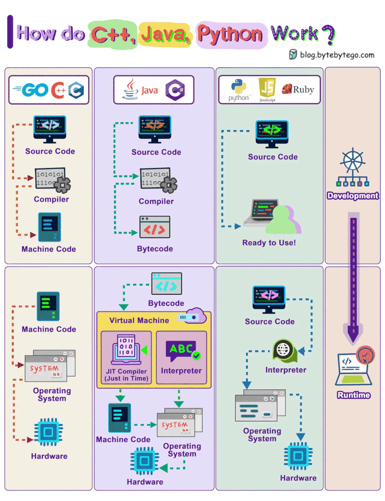
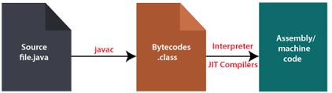
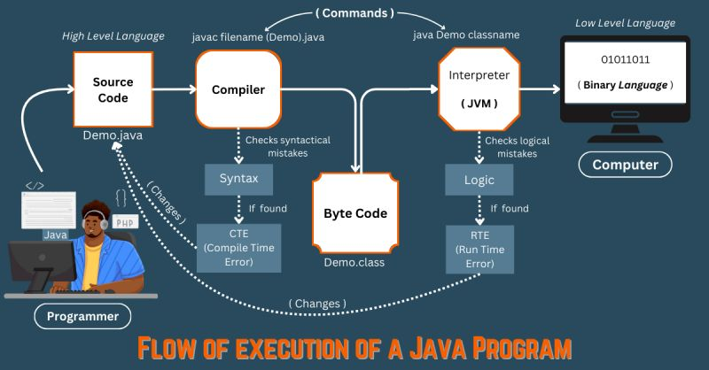
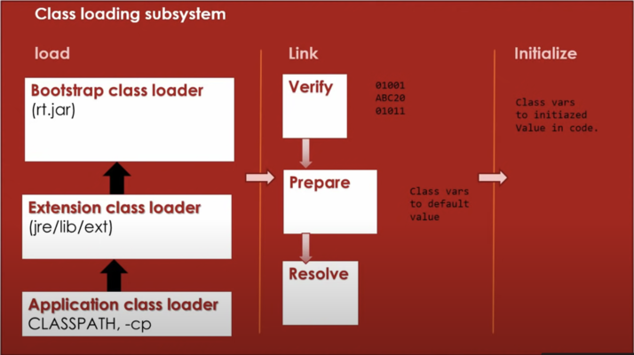
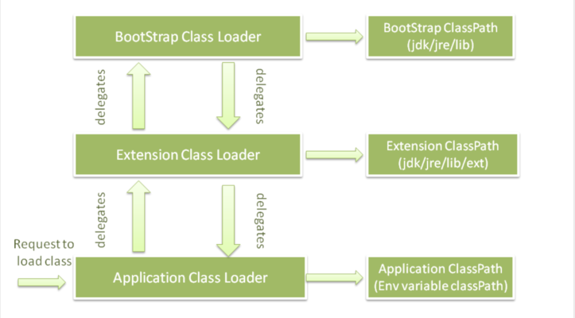

- Java는 모바일 애플리케이션부터 대규모 엔터프라이즈 시스템까지 다양한 영역에서 사용되는 세계적으로 널리 쓰이는 프로그래밍 언어입니다. 그러나 Java 프로그램을 작성하고 실행하며 동작시키기 위해서는 Java 생태계의 세 가지 핵심 구성 요소인 **JDK(Java Development Kit)**, **JRE(Java Runtime Environment)**, **JVM(Java Virtual Machine)** 를 이해하는 것이 중요합니다.  

---

## 주요 내용

- JVM이란?
- JRE란?
- JDK란?
- 이들이 Java 프로그램 실행에 어떻게 협력하는가?

---

## 1. JVM (Java Virtual Machine)란?

- **Java Virtual Machine(JVM)** 은 Java 프로그램을 실행할 수 있도록 해주는 **추상 컴퓨팅 머신** 입니다.  
- JVM은 **바이트코드(Java 컴파일러에 의해 생성된 Java 프로그램의 컴파일 형태)** 를 **기계어**로 해석하여 운영 체제가 실행할 수 있도록 합니다.

### JVM의 주요 역할

1. **플랫폼 독립성**:
   - Java의 핵심 기능 중 하나인 플랫폼 독립성은 JVM 덕분에 가능합니다.
   - Java 코드는 플랫폼 독립적인 바이트코드로 컴파일되며, JVM이 설치된 모든 시스템에서 실행될 수 있습니다.
2. **메모리 관리**:
   - JVM은 Java 프로그램의 메모리를 관리합니다.
   - 가비지 컬렉션을 통해 더 이상 사용되지 않는 메모리를 자동으로 회수합니다.
3. **보안**:
   - JVM은 위험한 코드를 방지하기 위한 보안 기능을 제공합니다.
   - 예를 들어, 바이트코드 검증(bytecode verification)을 통해 코드가 안전하게 실행될 수 있는지 확인합니다.

---

### JVM의 작동 방식

- Java 프로그램을 실행할 때, JVM은 컴파일러가 생성한 바이트코드를 네이티브 기계어로 변환합니다.  
- 이 변환 과정은 **런타임**에 이루어지며, JVM이 지원되는 플랫폼에서 Java 프로그램이 실행될 수 있도록 합니다.

### 예시

1. Java 소스 파일(`.java`)을 작성합니다.
2. Java 컴파일러(`javac`)를 통해 소스 파일을 바이트코드(`.class`)로 컴파일합니다.
3. JVM이 바이트코드를 해석하여 네이티브 기계어로 변환하고, 실행합니다.



---

## 2. JRE (Java Runtime Environment)란

- **Java Runtime Environment (JRE)** 는 Java 애플리케이션 실행에 필요한 모든 것을 제공하는 소프트웨어 패키지입니다.  
- JRE에는 JVM과 Java 애플리케이션 실행에 필요한 표준 라이브러리가 포함되어 있지만, 컴파일러나 디버거와 같은 개발 도구는 포함되어 있지 않습니다.

### JRE의 구성 요소

1. **JVM**: JRE의 핵심 요소로, 바이트코드를 해석하고 실행합니다.
2. **클래스 라이브러리**: Java 프로그램에서 입출력, 네트워킹, 데이터 구조와 같은 표준 기능을 수행할 때 사용하는 미리 컴파일된 라이브러리 및 클래스 모음입니다.
3. **Java 클래스 로더**: 실행 중에 Java 클래스 파일을 메모리로 로드하는 역할을 합니다.

### JRE의 사용 사례

- JRE는 Java 코드를 작성하거나 컴파일할 필요가 없는 최종 사용자에게 적합합니다.
- 예: Minecraft와 같은 Java 애플리케이션을 다운로드하여 실행하려면, 시스템에 JRE가 필요합니다.
  
---

## 3. JDK (Java Development Kit)란?

- **Java Development Kit (JDK)**는 Java 애플리케이션을 작성, 컴파일, 디버깅하기 위해 Java 개발자가 사용하는 소프트웨어 개발 키트입니다.  
- JDK에는 JRE뿐만 아니라 Java 컴파일러(`javac`), 디버거(`jdb`) 등 Java 애플리케이션 개발에 필요한 다양한 개발 도구가 포함되어 있습니다.

### JDK의 구성 요소

1. **JRE**: JDK는 JRE를 포함하고 있으므로, Java 프로그램 실행에 필요한 모든 것이 포함되어 있습니다.
2. **Java 컴파일러 (`javac`)**: Java 소스 코드(`.java` 파일)를 바이트코드(`.class` 파일)로 변환합니다. 이 바이트코드는 JVM에서 실행됩니다.
3. **개발 도구**: 디버거, 프로파일러, 문서 생성기와 같은 개발 및 최적화를 위한 도구가 포함됩니다.

### JDK의 사용 사례

- JDK는 Java 프로그램을 작성하고 컴파일해야 하는 개발자에게 필요합니다.
- 예: IntelliJ나 Eclipse와 같은 IDE(통합 개발 환경)에서 Java 코드를 개발할 때 JDK가 사용됩니다.  

---

## 4. JDK, JRE, JVM의 상호 작용

- **JDK, JRE, JVM**은 Java 애플리케이션을 개발, 컴파일, 실행하기 위해 유기적으로 협력합니다.  
- 다음은 이들 간의 상호작용 과정입니다:

### 1. 코드 작성 (JDK)

- 개발자는 Java 소스 코드를 작성하고 JDK의 컴파일러(`javac`)를 사용해 컴파일합니다.
- 컴파일러는 Java 소스 코드를 **플랫폼 독립적인 바이트코드**로 변환합니다.

### 2. 코드 실행 (JVM을 포함한 JRE)

- 컴파일된 바이트코드는 JRE의 일부인 JVM에 의해 실행됩니다.
- JVM은 바이트코드를 해석하여 운영 체제가 이해할 수 있는 기계어로 변환합니다.

### 3. 라이브러리 및 리소스 사용 (JRE)

- 실행 중 JVM은 JRE의 라이브러리를 사용하여 파일 읽기, 네트워크 통신, 그래픽 사용자 인터페이스 표시와 같은 작업을 수행합니다.  

---

## 5. 예시: 간단한 Java 프로그램에서의 작동 방식

### 코드 작성 (JDK)

```java
public class HelloWorld {
    public static void main(String[] args) {
        System.out.println("Hello, World!");
    }
}
```
  
### 코드 컴파일 (JDK)

javac 컴파일러가 Java 소스 코드(HelloWorld.java)를 바이트코드(HelloWorld.class)로 변환합니다:

```sh
javac HelloWorld.java
```
  
### 프로그램 실행 (JVM, JRE)

- JVM이 HelloWorld.class 파일을 실행하여 바이트코드를 해석하고 프로그램을 실행합니다. 결과는 다음과 같습니다:

```sh
java HelloWorld
output: Hello, World!
```

- 주요 구성 요소의 작동 과정:
  1. JDK: 소스 코드를 컴파일하여 바이트코드로 변환합니다.
  2. JVM (JRE 포함): 바이트코드를 해석하고 실행합니다.

---

## 4. 결론

- JDK, JRE, JVM의 역할을 이해하는 것은 Java를 효과적으로 다루는 데 필수적입니다.
- JDK: Java 프로그램을 작성, 컴파일, 디버깅하는 데 필요한 완전한 개발 키트입니다.
- JRE: JDK의 하위 집합으로, Java 애플리케이션 실행을 위한 환경을 제공합니다.
- JVM: Java의 “한 번 작성하면, 어디서든 실행” 철학의 핵심으로, 바이트코드를 해석하고 실행합니다. Java 애플리케이션을 실행하는 핵심 역할을 수행하며, JRE의 일부입니다.

---

# JVM 내부 동작

## JVM (Java Virtual Machine)

- JVM은 자바 애플리케이션을 실행하기 위한 런타임 환경을 제공하는 엔진입니다.
- `.java` 파일을 컴파일하여 생성된 바이트코드(`.class` 파일)를 기계어로 변환하는 역할을 담당합니다.
- JVM은 **Java Runtime Environment (JRE)**의 일부입니다.





### WORA (Write Once Run Anywhere)

- 자바 애플리케이션은 종종 **WORA**라고 불립니다.
- 한 시스템에서 작성된 자바 코드가 다른 자바 실행 환경에서 수정 없이 실행될 수 있음을 의미합니다.
- 이러한 이식성은 JVM 덕분에 가능합니다.

---

## JVM 아키텍처

- JVM은 다음의 세 가지 주요 서브시스템으로 구성됩니다:
    1. **클래스 로더 (ClassLoader)**
    2. **런타임 데이터 영역 (Runtime Data Area, 메모리 영역)**
    3. **실행 엔진 (Execution Engine)**


---

## 1. 클래스 로더 (ClassLoader)

- **클래스 로더**는 파일 시스템, 네트워크 또는 기타 소스에서 자바 클래스 파일을 동적으로 JVM에 로드하는 역할을 하는 JRE의 일부입니다.
- **주요 단계**:
  1. 로딩 (Loading)
  2. 연결 (Linking)
  3. 초기화 (Initialization)



### 1.1 로딩 (Loading)

- 바이트코드(`.class` 파일)를 다양한 자원(예: 파일 시스템, JAR 파일, 네트워크)에서 메모리로 로드하는 과정입니다.
- **클래스 로더 유형**:
  - **Bootstrap ClassLoader**: `rt.jar`에서 JDK 내부 클래스(예: `java.lang.*`)를 로드합니다.
  - **Extensions ClassLoader**: JDK 확장 디렉터리(`$JAVA_HOME/lib/ext`)에서 클래스를 로드합니다.
  - **Application ClassLoader**: 클래스 경로에서 클래스를 로드합니다. 클래스 경로는 `-cp` 또는 `-classpath` 옵션으로 설정할 수 있습니다.

#### 자바에서 클래스 로더 작동 방식

- JVM은 `java.lang.ClassLoader`의 `loadClass()` 메서드를 호출하며, 클래스의 완전한 이름을 전달합니다.
- **단계**:
  1. `findLoadedClass()`를 호출하여 클래스가 이미 로드되었는지 확인합니다.
  2. 부모 클래스 로더에 요청을 위임합니다.
  3. 클래스를 찾을 수 없으면 `findClass()`를 호출하여 파일 시스템에서 클래스를 찾습니다.



- **위임 예제**:
  - `Student.class`를 로드하려는 요청은 애플리케이션 클래스 로더(Application ClassLoader)에서 시작됩니다.
  - 애플리케이션 클래스 로더는 다음 순서로 요청을 위임합니다:
    - **확장 클래스 로더 (Extension ClassLoader)** → **부트스트랩 클래스 로더 (Bootstrap ClassLoader)**.
  - 부트스트랩 또는 확장 클래스 로더가 클래스를 로드하지 못할 경우, 애플리케이션 클래스 로더가 클래스 경로에서 로드합니다.

- **가시성 원칙 (Visibility Principle)**:
  - 자식 클래스 로더는 부모 클래스 로더가 로드한 클래스를 볼 수 있습니다.
  - 하지만 그 반대는 불가능합니다. 예를 들어:
    - `Student.class`가 애플리케이션 클래스 로더에 의해 로드되었다면, 확장 클래스 로더가 이를 명시적으로 로드하려고 하면 `ClassNotFoundException`이 발생합니다.  

### 1.2 연결 (Linking)

- 연결은 다음 세 가지 단계로 이루어집니다:
    1. **검증 (Verification)**:
       - `.class` 파일(바이트코드)의 정확성을 확인합니다.
       - 파일 형식, 컴파일러 유효성, JVM 클래스 사양과의 호환성을 검사합니다.
       - 검증 실패 시 `java.lang.VerifyError` 예외가 발생합니다.
    2. **준비 (Preparation)**:
       - 클래스 또는 인터페이스의 정적 필드를 생성하고 기본값으로 초기화합니다.
       - JVM 코드는 실행되지 않으며, 정적 필드의 명시적 초기화는 **초기화(Initialization)** 단계에서 수행됩니다.
    3. **해결 (Resolution)**:
   - 런타임 상수 풀에 있는 기호적 참조를 실제 값으로 동적으로 변환합니다.
   - JVM 명령어(예: `getfield`, `putstatic`, `invokevirtual`)는 기호적 참조를 사용하며, 이를 해결해야 실행할 수 있습니다.

### 1.3 초기화 (Initialization)

- 클래스 로딩의 마지막 단계입니다.
- 정적 변수에 원래 값을 할당하고 정적 블록을 실행합니다.

## 2. 런타임 데이터 영역 (Runtime Data Area)

### 2.1 메서드 영역 (Method Area)

- 메서드 영역은 모든 JVM 스레드가 공유하는 영역입니다.
- 전통적인 언어에서 컴파일된 코드 저장 공간 또는 운영 체제 프로세스의 "텍스트" 세그먼트에 해당합니다.
- 클래스별 구조(예: 런타임 상수 풀, 필드 및 메서드 데이터, 생성자 및 메서드 코드)를 저장합니다. 여기에는 클래스, 인스턴스, 인터페이스 초기화 시 사용되는 특별한 메서드도 포함됩니다.

#### 예외 상황:

- 메서드 영역에서 메모리 할당 요청을 충족할 수 없는 경우 JVM은 **`OutOfMemoryError`** 를 발생시킵니다.

---

### 2.2 힙 (Heap)

- 힙은 모든 JVM 스레드가 공유하는 영역입니다.
- 힙은 모든 클래스 인스턴스와 배열의 메모리가 할당되는 런타임 데이터 영역입니다.
- JVM이 시작될 때 생성되며, 객체의 메모리는 **Garbage Collector(가비지 수집기)**를 통해 자동으로 관리됩니다. 객체는 명시적으로 해제되지 않습니다.
- 힙의 크기는 고정적일 수도 있고, 계산 요구에 따라 확장 및 축소될 수도 있습니다.
- 힙 메모리는 연속적일 필요가 없습니다.
- JVM 구현에 따라 프로그래머 또는 사용자가 힙의 초기 크기, 최소 및 최대 크기를 제어할 수 있습니다.

#### 예외 상황:

- 자동 메모리 관리 시스템이 요구하는 힙 메모리를 제공할 수 없는 경우 JVM은 **`OutOfMemoryError`**를 발생시킵니다.

---

### 2.3 스택 (Stack)

- 각 JVM 스레드는 스레드가 생성될 때마다 개인적인 **JVM 스택**을 가집니다.
- JVM 스택은 **프레임(Frame)**을 저장하며, 이는 C 언어의 스택과 유사합니다.
  - 지역 변수와 중간 결과를 저장하고, 메서드 호출 및 반환에서 중요한 역할을 합니다.
  - JVM 스택은 직접적으로 조작되지 않으며, 프레임은 힙에 할당될 수 있습니다.
- JVM 스택의 메모리는 연속적일 필요가 없습니다.

#### 스택 크기 제어:

- JVM 스택은 고정 크기일 수도 있고, 계산 요구에 따라 동적으로 확장 및 축소될 수도 있습니다.
- 고정 크기의 스택인 경우, 각 스택의 크기는 독립적으로 설정할 수 있습니다.
- 동적 확장이 가능한 경우, 스택의 초기 크기, 최소 및 최대 크기를 제어할 수 있습니다.

#### 예외 상황:

1. 스레드의 계산이 허용된 JVM 스택 크기보다 더 큰 스택을 요구하는 경우, JVM은 **`StackOverflowError`**를 발생시킵니다.
2. JVM 스택이 동적으로 확장 가능한 경우:
   - 확장을 시도했으나 메모리가 부족한 경우.
   - 새로운 스레드의 초기 JVM 스택을 생성할 메모리가 부족한 경우.
   - 이러한 상황에서는 JVM이 **`OutOfMemoryError`**를 발생시킵니다.

---

### 2.4 PC 레지스터 (PC Register)

- 현재 실행 중인 명령어의 주소를 저장합니다.

---

### 2.5 네이티브 메서드 스택 (Native Method Stack)

- 네이티브 메서드 정보를 저장합니다.
- 각 스레드마다 별도의 네이티브 메서드 스택이 생성됩니다.

---
## 3. 실행 엔진 (Execution Engine)

- 실행 엔진은 각 클래스에 있는 코드를 실행합니다. 그러나 프로그램을 실행하기 전에 바이트코드를 기계어 명령어로 변환해야 합니다. JVM은 실행 엔진에서 **인터프리터(Interpreter)** 또는 **JIT 컴파일러**를 사용할 수 있습니다.


---

### 실행 엔진 구성 요소

- 실행 엔진은 다음 세 가지로 구성됩니다:
    1. 인터프리터 (Interpreter)
    2. JIT 컴파일러 (Just-In-Time Compiler)
    3. 가비지 컬렉터 (Garbage Collector)

### 3.1 인터프리터 (Interpreter)

- 인터프리터는 바이트코드 명령어를 **한 줄씩 읽고 실행**합니다.
- 이러한 줄 단위 실행 방식으로 인해 **속도가 느리다**는 단점이 있습니다.
- 또 다른 단점은 특정 메서드가 여러 번 호출될 경우, 매번 새로운 해석이 필요하다는 점입니다.

---

### 3.2 JIT 컴파일러 (Just-In-Time Compiler)

- **JIT 컴파일러**는 인터프리터의 효율성을 높이기 위해 사용됩니다.
- 바이트코드 전체를 **네이티브 코드로 변환**하여 인터프리터가 반복 호출되는 메서드를 재해석할 필요가 없도록 합니다.
- JIT 컴파일러는 자주 호출되는 코드에 대해 네이티브 코드를 제공함으로써 성능을 크게 개선합니다.

---

### 3.3 가비지 컬렉터 (Garbage Collector)

- **가비지 컬렉터**는 더 이상 참조되지 않는 객체를 제거합니다.

---

## Java Native Interface (JNI)

- **Java Native Interface (JNI)**는 네이티브 메서드 라이브러리와 상호작용하는 인터페이스입니다.
- 실행에 필요한 C/C++ 기반의 네이티브 라이브러리를 제공합니다.
- JVM이 C/C++ 라이브러리를 호출하거나, C/C++ 라이브러리가 JVM을 호출할 수 있도록 합니다. 이는 하드웨어에 특화된 기능 구현에 사용될 수 있습니다.

---

## 네이티브 메서드 라이브러리 (Native Method Libraries)

- 실행 엔진에서 필요한 **C/C++ 기반 네이티브 라이브러리**의 모음입니다.
