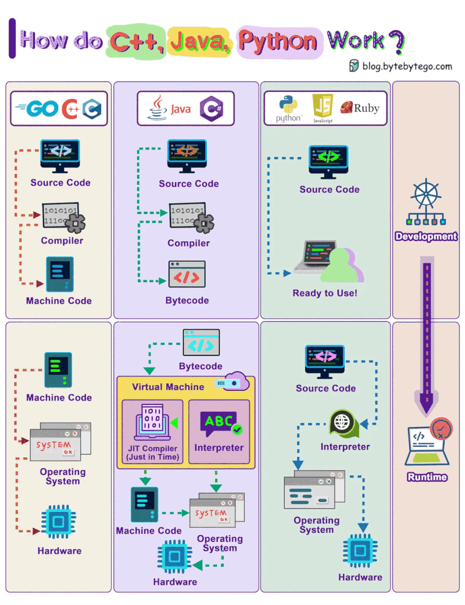
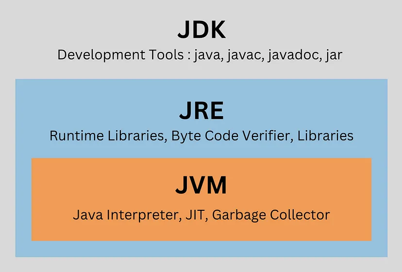
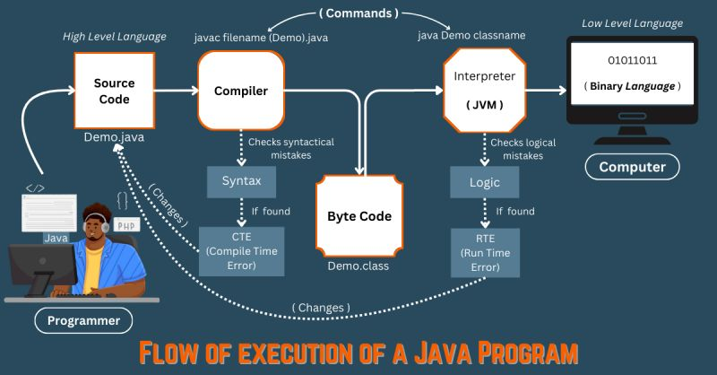
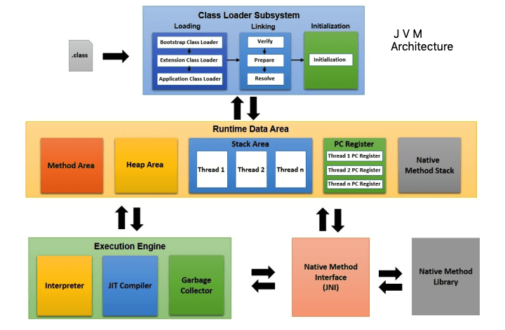
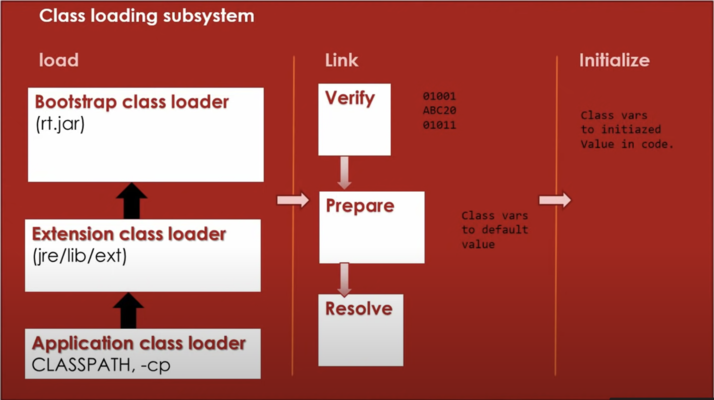
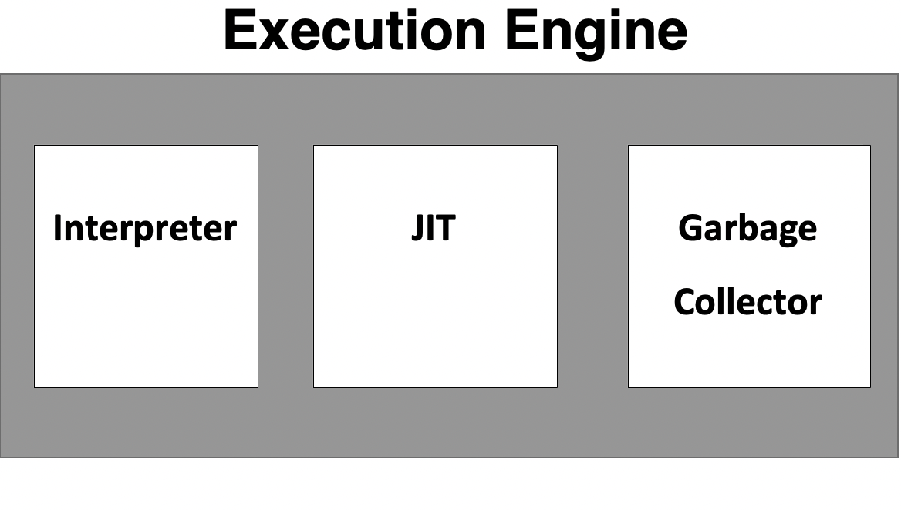

# 1. JVM

## 1.1. JDK 구성 요소

- JVM (Java Virtual Machine)
- JRE (Java Runtime Environment)
- JDK (Java Development Kit)

### 1.1.1. JVM (Java Virtual Machine)

- **Java Virtual Machine(JVM)** 은 Java 프로그램을 실행할 수 있도록 해주는 **가상 컴퓨팅 머신**
- JVM은 **바이트코드(Java 컴파일러에 의해 생성된 Java 프로그램의 컴파일 형태)** 를 **기계어**로 해석하여 운영 체제가 실행하도록 함

#### JVM의 주요 역할

- **플랫폼 독립성**:
  - WORA (Write Once Run Anywhere)
  - 플랫폼 독립성
  - Java 코드는 플랫폼 독립적인 바이트코드로 컴파일되며, JVM이 설치된 모든 시스템에서 실행 가능
- **메모리 관리**:
  - JVM은 Java 프로그램의 메모리를 관리합니다.
  - 가비지 컬렉션을 통해 더 이상 사용되지 않는 메모리를 자동으로 회수합니다.
- **보안**:
  - JVM은 위험한 코드를 방지하기 위한 보안 기능을 제공합니다.
  - 예를 들어, 바이트코드 검증(bytecode verification)을 통해 코드가 안전하게 실행될 수 있는지 확인합니다.

#### JVM의 작동 방식

- Java 프로그램 실행 시, 컴파일러가 생성한 바이트코드를 네이티브 기계어로 변환 
- 이 변환 과정을 **런타임** 이라고 한다.

#### 예시

1. Java 소스 파일(`.java`) 작성
2. Java 컴파일러(`javac`)를 통해 소스 파일을 바이트코드(`.class`)로 컴파일
3. JVM이 바이트코드를 해석하여 네이티브 기계어로 변환하고, 실행

---

### 1.1.2. JRE (Java Runtime Environment)란

- **Java Runtime Environment (JRE)** 는 Java 애플리케이션 실행에 필요한 모든 것을 제공하는 소프트웨어 패키지
- JRE에는 JVM과 Java 애플리케이션 실행에 필요한 표준 라이브러리가 포함되어 있지만, 컴파일러나 디버거와 같은 개발 도구는 포함되어 있지 않음

#### JRE의 구성 요소

1. **JVM**: JRE에 포함
2. **클래스 라이브러리**: Java 프로그램에서 입출력, 네트워킹, 데이터 구조와 같은 표준 기능을 수행할 때 사용하는 미리 컴파일된 라이브러리 및 클래스 모음
3. **Java Class Loader**: 실행 중에 Java 클래스 파일을 메모리로 로드하는 역할

#### JRE의 사용 사례

- JRE는 Java 코드를 작성하거나 컴파일할 필요가 없는 최종 사용자에게 적합합니다.
  - Minecraft와 같은 Java 애플리케이션을 다운로드하여 실행하려면, 시스템에 JRE가 필요합니다.

---

### 1.1.3. JDK (Java Development Kit)란?

- **Java Development Kit (JDK)** 는 Java 애플리케이션을 작성, 컴파일, 디버깅하기 위해 Java 개발자가 사용하는 소프트웨어 개발 키트
- JDK에는 JRE뿐만 아니라 Java 컴파일러(`javac`), 디버거(`jdb`) 등 Java 애플리케이션 개발에 필요한 다양한 개발 도구가 포함

#### JDK의 구성 요소

1. **JRE**: JDK는 JRE를 포함하고 있으므로, Java 프로그램 실행에 필요한 모든 것이 포함
2. **Java 컴파일러 (`javac`)**: Java 소스 코드(`.java` 파일)를 바이트코드(`.class` 파일)로 변환하고 JVM에서 실행
3. **개발 도구**: 디버거, 프로파일러, 문서 생성기와 같은 개발 및 최적화를 위한 도구

#### JDK의 사용 사례

- JDK는 Java 프로그램을 작성하고 컴파일해야 하는 개발자에게 필요
  - IntelliJ나 Eclipse와 같은 IDE(통합 개발 환경)에서 Java 코드를 개발할 때 JDK를 사용

---
### 1.1.4. 정리

- JDK
  - Java 프로그램을 작성, 컴파일, 디버깅하는 데 필요한 완전한 개발 키트
- JRE
  - JDK의 하위 집합으로, Java 애플리케이션 실행을 위한 환경을 제공
- JVM
  - Java의 "한 번 작성하면, 어디서든 실행" 철학의 핵심으로, 바이트코드를 해석하고 실행
  - Java 애플리케이션을 실행하는 핵심 역할을 수행하며, JRE의 일부

---

## 1.2. JVM 아키텍처

- JVM은 자바 애플리케이션을 실행하기 위한 런타임 환경을 제공하는 엔진
- `.java` 파일을 컴파일하여 생성된 바이트코드(`.class` 파일)를 기계어로 변환
- JVM은 **Java Runtime Environment (JRE)**의 일부

- JVM은 다음의 세 가지 주요 서브시스템으로 구성
  1. **클래스 로더 (ClassLoader)**
  2. **런타임 데이터 영역 (Runtime Data Area, 메모리 영역)**
  3. **실행 엔진 (Execution Engine)**

---

### 1.2.1. 클래스 로더 (ClassLoader)

- 파일 시스템, 네트워크 또는 기타 소스에서 자바 클래스 파일을 동적으로 JVM에 로드
  1. 로딩 (Loading)
    - 바이트코드(`.class` 파일)를 다양한 자원(예: 파일 시스템, JAR 파일, 네트워크)에서 메모리로 로드하는 과정
  2. 연결 (Linking)
    - verify, prepare, resolve 단계를 거친다.
      1. verify - `.class` 파일(바이트코드)의 정확성을 확인 (파일 형식, 컴파일러 유효성, JVM 사양 및 호환성 검사)
      2. prepare - 클래스, 인터페이스, 정적 필드들이 생성되며
      3. resolve - 런타임 상수 풀의 기호적 참조를 실제 값으로 동적으로 변환
  3. 초기화 (Initialization)
    - static 변수에 값을 할당하고, static 블록들을 실행

---

### 1.2.2. 런타임 데이터 영역 (Runtime Data Area)

#### 1.2.2.1. 메서드 영역 (Method Area)

- 메서드 영역은 모든 JVM 스레드가 공유
- 전통적인 언어에서 컴파일된 코드 저장 공간 또는 운영 체제 프로세스의 "컨텍스트" 세그먼트에 해당
- 클래스별 구조(예: 런타임 상수 풀, 필드 및 메서드 데이터, 생성자 및 메서드 코드)를 저장
  - 여기에는 클래스, 인스턴스, 인터페이스 초기화 시 사용되는 특별한 메서드도 포함
- 메서드 영역에서 메모리 할당 요청을 충족할 수 없는 경우 **`OutOfMemoryError`**

#### 1.2.2.2. 힙 (Heap)

- 힙은 모든 JVM 스레드가 공유
- 힙은 모든 클래스 인스턴스와 배열의 메모리가 할당되는 런타임 데이터 영역
- JVM이 시작될 때 생성되며, 객체의 메모리는 **Garbage Collector(가비지 수집기)**를 통해 자동으로 관리 
  - 객체는 명시적으로 메모리 해제되지 않으며, GC에 의해서만 해제
- 힙의 크기는 고정적일 수도 있고, 확장 및 축소될 수도 있음
- 힙 메모리는 연속적일 필요가 없음
  - JVM 구현에 따라 프로그래머 또는 사용자가 힙의 초기 크기, 최소 및 최대 크기를 제어할 수 있음

##### 예외

- 자동 메모리 관리 시스템이 요구하는 힙 메모리를 제공할 수 없는 경우 `OutOfMemoryError`

#### 1.2.2.3. 스택 (Stack)

- 각 JVM 스레드는 스레드가 생성될 때마다 개인적인 **JVM 스택**을 가짐
- JVM 스택은 **프레임(Frame)**을 저장하며, 이는 C 언어의 스택과 유사
  - 지역 변수와 중간 결과를 저장하고, 메서드 호출 및 반환을 처리
  - JVM 스택은 직접적으로 조작되지 않으며, 프레임은 힙에 할당될 수 있음
- JVM 스택의 메모리는 연속적일 필요가 없음

##### 스택 크기 제어

- JVM 스택은 고정 크기일 수도 있고, 동적으로 확장 및 축소될 수도 있음
- 고정 크기의 스택인 경우, 각 스택의 크기는 독립적으로 설정 가능
- 동적 확장이 가능한 경우, 스택의 초기 크기, 최소 및 최대 크기를 제어 가능

##### 예외

- 스레드의 계산이 허용된 JVM 스택 크기보다 더 큰 스택을 요구하는 경우 
  - => **`StackOverflowError`**
- JVM 스택이 동적으로 확장 가능할 때,
  - 확장을 시도했으나 메모리가 부족한 경우
  - 새로운 스레드의 초기 JVM 스택을 생성할 메모리가 부족한 경우
  - => **`OutOfMemoryError`**

#### 1.2.2.4. PC 레지스터 (PC Register)

- 현재 실행 중인 명령어의 주소를 저장

#### 1.2.2.5. 네이티브 메서드 스택 (Native Method Stack)

- 네이티브 메서드 정보를 저장
- 각 스레드마다 별도의 네이티브 메서드 스택이 생성

---

### 1.2.3. 실행 엔진 (Execution Engine)

- 실행 엔진은 각 클래스에 있는 코드를 실행
- 다만, 프로그램을 실행하기 전에 바이트코드(.class)를 기계어 명령어로 변환
  - JVM은 실행 엔진에서 **인터프리터(Interpreter)** 또는 **JIT 컴파일러**를 사용

- 실행 엔진은 다음 세 가지로 구성
  1. 인터프리터 (Interpreter)
  2. JIT 컴파일러 (Just-In-Time Compiler)
  3. 가비지 컬렉터 (Garbage Collector)

#### 1.2.3.1. 인터프리터 (Interpreter)

- 인터프리터는 바이트코드 명령어를 **한 줄씩 읽고 실행**
- 이러한 줄 단위 실행 방식으로 인해 **속도가 느리다**는 단점
- 또한 특정 메서드가 여러 번 호출될 경우, 매번 새로운 해석이 필요

#### 1.2.3.2. JIT 컴파일러 (Just-In-Time Compiler)

- **JIT 컴파일러**는 인터프리터의 효율성을 높이기 위해 사용
- 바이트코드 전체를 **네이티브 코드로 변환**하여 인터프리터가 반복 호출되는 메서드를 재해석할 필요가 없음
- JIT 컴파일러는 자주 호출되는 코드에 대해 네이티브 코드를 제공함으로써 성능을 크게 개선

#### 1.2.3.3. 가비지 컬렉터 (Garbage Collector)

- **가비지 컬렉터**는 더 이상 참조되지 않는 객체를 제거

---

### 1.2.4 기타

#### 1.2.4.1. Java Native Interface (JNI)

- **Java Native Interface (JNI)**는 네이티브 메서드 라이브러리와 상호작용하는 인터페이스
- 실행에 필요한 C/C++ 기반의 네이티브 라이브러리를 제공
- JVM이 C/C++ 라이브러리를 호출하거나, C/C++ 라이브러리가 JVM을 호출할 수 있게 함
- 하드웨어에 특화된 기능 구현에 사용될 수 있음

#### 1.2.4.2. 네이티브 메서드 라이브러리 (Native Method Libraries)

- 실행 엔진에서 필요한 **C/C++ 기반 네이티브 라이브러리**의 모음
