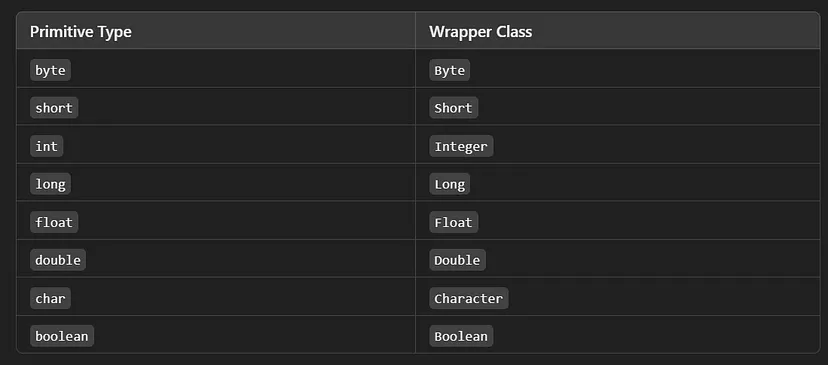
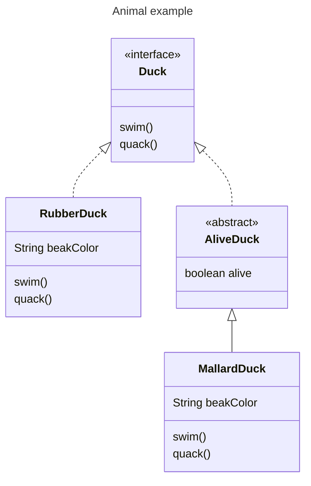
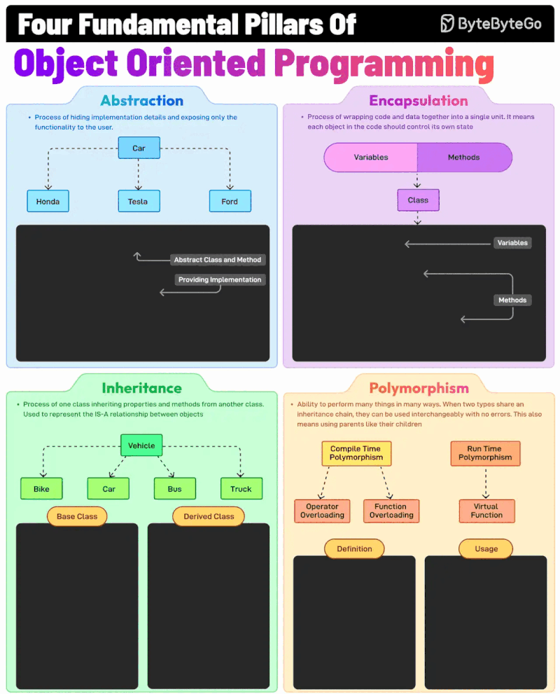
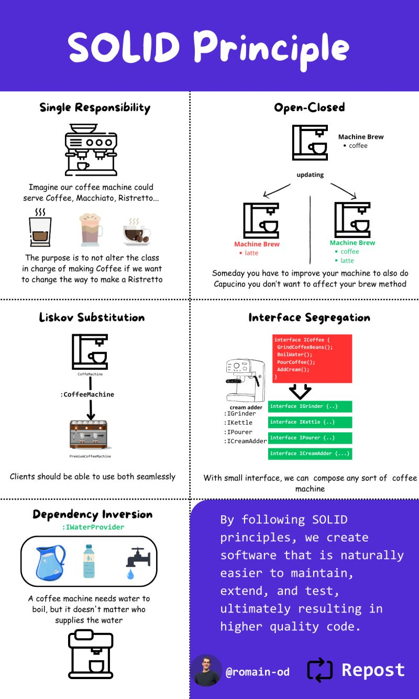

# 2. 자바 데이터 타입과 객체지향 설계 원칙

## 2.1. 타입

### 2.1.1. 원시 타입 (Primitive Types)

- **원시 타입(Primitive Types)**은 자바에서 객체가 아닌 가장 기본적인 데이터 유형입니다.
- 언어에 의해 미리 정의된 8개의 기본 타입이 있으며, 이는 자바 프로그램에서 데이터 조작의 기본 단위로 사용됩니다.
- **자바의 8가지 기본 타입**:
  - `byte`
  - `short`
  - `int`
  - `long`
  - `float`
  - `double`
  - `char`
  - `boolean`
- 객체와 달리, 기본 타입은 메모리에서 단순 값 자체를 저장하며, 객체 참조를 사용하지 않습니다.

#### 2.1.1.1. **byte**

- **크기**: 8비트 정수
- **범위**: -128 ~ 127
- **기본값**: 0
- **사용 사례**: 메모리 효율성이 중요한 큰 배열, 바이너리 데이터 처리, 파일 및 스트림 작업.

#### 2.1.1.2. **short**

- **크기**: 16비트 정수
- **범위**: -32,768 ~ 32,767
- **기본값**: 0
- **사용 사례**: 메모리를 절약해야 하지만 `byte` 범위가 부족한 경우.

#### 2.1.1.3. **int**

- **크기**: 32비트 정수
- **범위**: -2³¹ ~ 2³¹-1 (~-20억 ~ 20억)
- **기본값**: 0
- **사용 사례**: 일반적인 정수 데이터에 가장 많이 사용되는 타입.

#### 2.1.1.4. **long**

- **크기**: 64비트 정수
- **범위**: -2⁶³ ~ 2⁶³-1
- **기본값**: 0L
- **사용 사례**: 금융 계산, 타임스탬프, 고유 ID 등 `int`로 처리할 수 없는 큰 범위의 데이터.

#### 2.1.1.5. **float**

- **크기**: 32비트 부동소수점
- **범위**: ±3.40282347E+38F (소수점 약 6~7자리 정밀도)
- **기본값**: 0.0f
- **사용 사례**: 메모리 효율성이 중요한 부동소수점 배열, 정밀도가 덜 중요한 경우.

#### 2.1.1.6. **double**

- **크기**: 64비트 부동소수점
- **범위**: ±1.79769313486231570E+308 (소수점 약 15자리 정밀도)
- **기본값**: 0.0d
- **사용 사례**: 기본 소수점 타입으로, 조금 더 정밀도가 중요한 경우.
- 부동소수점 타입 사용시, 부동소수점의 한계를 조심하세요 

```java
double result = 0.1 + 0.2;
System.out.println(result); // 0.30000000000000004
```

#### 2.1.1.7. **char**

- **크기**: 16비트 유니코드 문자
- **범위**: 0 ~ 65,535 (유니코드 문자)
- **기본값**: `'\u0000'` (널 문자)
- **사용 사례**: 개별 문자나 유니코드 기호 저장.

#### 2.1.1.8. **boolean**

- **크기**: 1비트 (JVM에 따라 다름)
- **값**: `true` 또는 `false`
- **기본값**: `false`
- **사용 사례**: 논리 값 저장 및 조건문(`if`, `while` 등)에서 사용.

---

#### 기본 타입을 사용하는 이유

1. **효율성**:
   - 기본 타입은 값을 직접 저장하므로 메모리 할당 및 가비지 컬렉션의 오버헤드를 줄임.
2. **단순성**:
   - 간단한 문법과 연산을 제공.
3. **낮은 오버헤드**:
   - 숫자나 문자와 같은 간단한 값에 대해 객체보다 적은 메모리와 성능 비용.

#### 박싱(Boxing)과 언박싱(Unboxing)

- 자바에서는 각 기본 타입에 해당하는 **래퍼 클래스(Wrapper Class)**가 있습니다.  
  - 래퍼 클래스는 기본 타입을 객체처럼 다룰 수 있도록 합니다.
- **박싱(Boxing)**: 기본 타입을 해당 래퍼 클래스로 변환하는 과정.
- **언박싱(Unboxing)**: 래퍼 클래스를 다시 기본 타입으로 변환하는 과정.
- 객체의 유연성이 필요한 경우가 아니라면, 성능을 위해 기본 타입을 사용하는 것이 권장됩니다.



- 박싱시, 캐싱에 주의하세요

```java
Integer a = 127;
Integer b = 127;
System.out.println(a == b); // true (캐싱 범위 내)

Integer c = 128;
Integer d = 128;
System.out.println(c == d); // false (캐싱 범위 초과)
```

---

### 2.1.2. 참조 타입 (Reference Types)

- **참조 타입(Reference Types)**은 객체를 생성하거나 메모리에서 객체를 참조하는 데이터 유형입니다.
- **원시 타입과의 주요 차이점**:
  - 값 자체가 아니라 **메모리의 주소(참조값)**를 저장합니다.
  - 더 복잡한 데이터 구조(배열, 객체 등)를 표현할 수 있습니다.

#### 2.1.2.1. 배열 (Array)

- **정의**: 동일한 타입의 데이터를 연속된 메모리 공간에 저장하는 참조 타입.
- **특징**:
  - 고정된 크기를 가지며, 한 번 생성되면 크기를 변경할 수 없음.
  - 인덱스를 사용하여 요소에 접근하며, 인덱스는 0부터 시작.
- **주의점**:
  - 배열은 참조 타입이므로, 동일한 배열을 여러 변수가 참조할 수 있음.

```java
int[] numbers = {1, 2, 3, 4, 5};
System.out.println(numbers[0]); // 출력: 1
```

#### 2.1.2.2. 객체 (Object)

- **정의**: 상태(필드)와 동작(메서드)을 가지는 데이터 구조.
- **특징**:
  - 자바의 객체는 클래스의 인스턴스를 통해 생성되며, 모든 객체는 `java.lang.Object`를 상속받음.
  - 객체의 참조를 다른 변수에 할당하면, 같은 객체를 가리킴.
- **주의점**:
  - 동일한 객체를 여러 변수가 참조하면, 한 변수를 통해 객체를 변경할 경우 다른 변수에도 영향을 미침.

```java
class Person {
    String name;
    int age;

    Person(String name, int age) {
        this.name = name;
        this.age = age;
    }
}

Person person = new Person("Alice", 25);
System.out.println(person.name); // 출력: Alice

Person b = a;
b.name = "Bob";
System.out.println(a.name); // 출력: Bob
```

#### 2.1.2.3. Deep Copy vs Shallow Copy

##### Shallow Copy (얕은 복사)

- 객체의 참조값만 복사하여 원본과 복사본이 동일한 객체를 참조.
- 내부 객체의 변경은 복사본과 원본에 모두 영향을 미침.
- 빠른 복사가 필요하지만, 객체의 독립성이 중요하지 않은 경우.

```java
int[] original = {1, 2, 3};
int[] shallowCopy = original;
shallowCopy[0] = 100;
System.out.println(original[0]); // 출력: 100
```

##### Deep Copy (깊은 복사)

- 객체의 모든 데이터를 새로운 메모리에 복사하여 완전히 독립된 객체를 생성.
- 내부 객체의 변경은 원본에 영향을 미치지 않음.
- 객체 간의 완전한 독립성이 필요한 경우.

```java
int[] original = {1, 2, 3};
int[] deepCopy = original.clone();
deepCopy[0] = 100;
System.out.println(original[0]); // 출력: 1
```

#### 2.1.2.4. Immutable (불변 객체)

- 한 번 생성되면 그 상태를 변경할 수 없는 객체.
- **특징**:
  - 상태를 변경하는 메서드가 없음.
  - 멀티스레드 환경에서 안전하게 사용할 수 있음.
- **예시 클래스**:
  - 자바의 `String`, `Integer`, `BigDecimal` 등이 불변 객체로 구현되어 있음.
- **장점**:
  - 예측 가능한 동작을 보장하며, 프로그램의 안정성을 높임.
  - 변경 불가능한 객체를 공유해도 다른 스레드나 코드에서 영향을 미치지 않음.

```java
String str = "Hello";
String newStr = str.concat(" World");
System.out.println(str); // 출력: Hello
System.out.println(newStr); // 출력: Hello World
```

### 2.1.3. 기본 타입과 참조 타입의 차이점 요약

| **구분**     | **기본 타입 (Primitive Types)** | **참조 타입 (Reference Types)** |
| ---------- | --------------------------- | --------------------------- |
| **저장 값**   | 실제 데이터 값                    | 데이터가 저장된 메모리 주소             |
| **메모리 할당** | 스택(Stack)                   | 힙(Heap)                     |
| **변경 여부**  | 값 자체가 변경됨                   | 참조하는 객체의 값 변경 가능            |
| **사용 사례**  | 단순 데이터 (숫자, 문자 등)           | 복잡한 데이터 구조 (배열, 객체)         |

---

## 2.2. 클래스와 객체

### 2.2.1. 클래스 (Class)

- **정의**: 객체를 생성하기 위한 설계도 또는 템플릿.
- **특징**:
  - 객체의 속성(필드)과 동작(메서드)을 정의.
  - 실제 실행되지 않고, 객체를 생성하기 위한 청사진 역할.
- **구성 요소**:
  - **필드**: 클래스가 가지는 데이터 (상태).
  - **메서드**: 클래스가 수행하는 동작 (행위).
  - **생성자**: 객체 초기화를 담당.
- **사용 사례**:
  - 코드 재사용성을 높이고, 객체 지향 프로그래밍의 핵심을 구현.

### 2.2.2. 객체 (Object)

- **정의**: 클래스에 정의된 설계도를 기반으로 생성된 실제 사용 가능한 개체.
- **특징**:
  - 상태(필드 값)와 행동(메서드 호출)을 가짐.
  - 메모리에서 클래스의 인스턴스로 존재.
- **생성 방법**:
  - `new` 키워드를 사용하여 객체를 생성.
- **예시**:
  - 클래스 `Car`를 설계도로 삼아, `myCar`라는 객체를 생성.

### 2.2.3. 생성자 (Constructor)

- **정의**: 객체가 생성될 때 호출되는 메서드로, 객체의 초기화를 담당.
- **특징**:
  - 클래스 이름과 동일.
  - 반환값이 없으며, 명시하지 않으면 컴파일러가 기본 생성자를 제공.
  - 매개변수를 통해 초기 값을 설정할 수 있음.
- **생성자 오버로딩**:
  - 같은 이름의 생성자를 매개변수의 수나 타입을 다르게 정의.
- **사용 사례**:
  - 객체 생성 시 필요한 초기 설정.

### 2.2.4. 필드 (Field)

- **정의**: 클래스의 속성 또는 데이터.
- **특징**:
  - 객체의 상태를 저장하며, 클래스 내부에서 정의됨.
  - 필드의 접근 제한자는 `private`로 설정하고, 접근자(Getter)와 설정자(Setter)를 통해 제어하는 것이 일반적.
- **유형**:
  - **인스턴스 필드**: 각 객체가 독립적으로 가지는 값.
  - **클래스 필드 (static 필드)**: 모든 객체가 공유하는 값.

### 2.2.5. 메서드 (Method)

- **정의**: 클래스에 정의된 동작 또는 행동을 구현한 함수.
- **특징**:
  - 필드 값을 조작하거나, 특정 작업을 수행.
  - 접근 제한자와 반환 타입을 가짐.
- **유형**:
  - **인스턴스 메서드**: 객체를 통해 호출되며, 객체의 상태를 다룸.
  - **클래스 메서드 (static 메서드)**: 객체 생성 없이 클래스명으로 호출 가능.
- **메서드 오버로딩**:
  - 같은 이름의 메서드를 매개변수의 수나 타입에 따라 여러 개 정의.

### 2.2.6. 인터페이스와 추상 클래스

#### 2.2.6.1. 인터페이스 (Interface)

- **정의**: 클래스가 구현해야 할 메서드의 청사진을 제공하는 추상 타입.
- **특징**:
  - 모든 메서드는 암묵적으로 `public abstract`.
  - 필드는 `public static final`로 선언됨.
  - 다중 구현이 가능하며, 클래스에 행동 규약을 정의.
- **사용 사례**:
  - 다형성을 구현하거나, 클래스 간의 일관성을 유지.

#### 2.2.6.2. 추상 클래스 (Abstract Class)

- **정의**: 일부 메서드는 구현되지 않은 상태로 남겨둔, 공통 특성을 가진 클래스.
- **특징**:
  - `abstract` 키워드로 선언.
  - 객체를 직접 생성할 수 없음.
  - 추상 메서드와 일반 메서드를 모두 포함 가능.
- **사용 사례**:
  - 상속을 통해 공통된 동작을 재사용하면서, 일부 세부 구현을 자식 클래스에서 정의.

#### 비교: 인터페이스 vs 추상 클래스

| **구분**           | **인터페이스**                             | **추상 클래스**                      |
|---------------------|--------------------------------------------|---------------------------------------|
| **상속 관계**      | 다중 구현 가능                            | 단일 상속                            |
| **구성 요소**      | 추상 메서드, 디폴트 메서드, 정적 메서드 포함 | 필드, 추상 메서드, 일반 메서드 포함  |
| **사용 목적**      | 행동 규약 정의                            | 공통된 상태와 동작의 재사용          |
| **객체 생성 가능 여부** | 객체 생성 불가                          | 객체 생성 불가                        |



---

## 2.3. 메서드 시그니처

### 2.3.1. **메서드 구조**

- 자바의 메서드는 메서드 시그니처, 반환값, 제어자로 이루어져 있다.

#### 2.3.1.1 **메서드 시그니처 (Method Signature)**

- **메서드 시그니처**는 메서드를 고유하게 식별할 수 있는 요소로 구성됩니다.
- **구성 요소**:
  1. 메서드 이름
  2. 매개변수 목록(순서와 타입 포함)

#### 2.3.1.2 **반환값 (return type)**

- 메서드가 실행된 후 호출자에게 반환하는 값의 데이터 타입.
- 예: `int`, `String`, `void`(반환값 없음).

#### 2.3.1.3 **제어자 (Modifiers)**

- 메서드의 동작과 접근 권한을 정의하는 키워드.
- **주요 제어자**:
  1. **접근 제어자 (Access Modifier)**:
     - 메서드의 접근 범위를 지정합니다.
     - 종류: `public`, `protected`, `private`, (default, package-private).
  2. **static**:
     - 클래스 수준에서 메서드를 정의하며, 객체 생성 없이 호출 가능.
  3. **final**:
     - 메서드를 오버라이드할 수 없도록 제한.
  4. **volatile**:
     - 주로 멀티스레드 환경에서 변수 값을 바로 읽고 쓰도록 보장.
  5. **synchronized**:
     - 멀티스레드 환경에서 동기화된 방식으로 메서드를 실행.

---

### 2.3.2. **오버로딩 (Overloading)**

- **정의**: 같은 이름의 메서드가 **다른 매개변수 목록**(타입, 개수, 순서 등)으로 정의되는 경우.
- **특징**:
  1. 반환 타입은 오버로딩에 영향을 미치지 않음.
  2. 컴파일 시점에서 호출될 메서드가 결정됨(정적 바인딩).
- **목적**:
  - 메서드 이름 재사용으로 가독성과 유지보수성 향상.

```java

public class OverloadingExample {
    public void print(String message) {
        System.out.println("Message: " + message);
    }

    public void print(String message, int count) {
        for (int i = 0; i < count; i++) {
            System.out.println("Message: " + message);
        }
    }

    public static void main(String[] args) {
        OverloadingExample example = new OverloadingExample();
        example.print("Hello");          // 오버로딩 메서드 1 호출
        example.print("Hello", 3);      // 오버로딩 메서드 2 호출
    }
}
```

---

### 2.3.3. **오버라이딩 (Overriding)**

- **정의**: 부모 클래스의 메서드를 자식 클래스에서 재정의하여 **동작을 변경**하는 것.
- **조건**:
  1. 메서드 이름, 매개변수 목록, 반환 타입이 동일해야 함.
  2. 접근 제어자는 부모 메서드보다 더 좁아질 수 없음.
  3. 부모 메서드가 `final`로 선언되었다면 오버라이딩 불가.
- **특징**:
  - 런타임 시점에 호출될 메서드가 결정됨(동적 바인딩).
- **목적**:
  - 상속받은 메서드를 특정한 요구사항에 맞게 변경.

```java
class Parent {
    public void greet() {
        System.out.println("Hello from Parent!");
    }
}

class Child extends Parent {
    @Override
    public void greet() {
        System.out.println("Hello from Child!");
    }
}

public class OverridingExample {
    public static void main(String[] args) {
        Parent parent = new Parent();
        Parent child = new Child();

        parent.greet();  // Parent의 greet 호출
        child.greet();   // Child의 greet 호출 (동적 바인딩)
    }
}
```

---

## 2.4. 객체지향 (OOP)

### 2.4.1. 특징

1. 추상화
2. 캡슐화
3. 상속
4. 다형성



#### 2.4.1.1.  **추상화 (Abstraction)**

- **정의**: 객체의 **핵심 특징**만 보여주고, **구현 세부사항**은 숨기는 과정.
- **목적**: 불필요한 복잡성을 줄이고, 객체의 본질적인 기능에 집중.
- **예시**: `Vehicle` 클래스가 `stop`이라는 추상 메서드를 정의하고, 구체적인 구현은 하위 클래스에서 처리.

```java
  abstract class Vehicle {
      abstract void stop();
  }
  ```
  
#### 2.4.1.2. **캡슐화 (Encapsulation)**

- **정의**: 데이터(필드)와 메서드를 **하나의 단위(클래스)**로 묶고, 접근 제한자를 사용하여 외부로부터 보호.
- **목적**: 데이터 보호 및 제어된 접근 제공. 외부에서는 getter/setter를 통해서만 데이터 접근 가능.
- **예시**: `private` 필드를 사용하고, 이를 접근하는 `public` 메서드를 정의.

```java
class Vehicle {
    private String type;
    public String getType() {
        return type;
    }
    public void setType(String type) { 
        this.type = type;
    }
}
```
  
#### 2.4.1.3. **상속 (Inheritance)**

- **정의**: 기존 클래스(부모 클래스)의 속성과 메서드를 새로운 클래스(자식 클래스)가 물려받는 과정.
- **목적**: 코드 재사용성 증가 및 중복 코드 감소. 계층 구조를 통한 설계 개선.
- **예시**: `Car` 클래스가 `Vehicle` 클래스를 상속받아, 공통 기능을 재사용.

```java
class Vehicle {
    void start() {
        System.out.println("Vehicle is starting");
    }
}

class Car extends Vehicle {
    void drive() {
        System.out.println("Car is driving");
    }
}
```
  
#### 2.4.1.4. **다형성 (Polymorphism)**

- **정의**: **같은 이름의 메서드**가 객체에 따라 **다르게 동작**하는 기능.
- **목적**: 객체를 유연하게 처리하며, 동일한 인터페이스나 부모 클래스를 사용하는 여러 객체를 교환 가능하게 만듦.
- **예시**: 부모 클래스의 메서드를 재정의(오버라이딩)하여, 객체에 따라 다른 동작을 수행.

```java
class Vehicle {
    void stop() {
        System.out.println("Vehicle is stopping");
    }
}

class Car extends Vehicle {
    @Override
    void stop() {
        System.out.println("Car is stopping quickly");
    }
}

public class Main {
    public static void main(String[] args) {
        Vehicle myCar = new Car();
        myCar.stop();
    }
}
```

### 2.4.2. SOLID

- **SOLID 원칙**은 깨끗한 객체지향 프로그래밍(OOP)을 구현하기 위한 기본 가이드라인으로, Robert C. Martin이 제안했습니다.  
- SOLID 원칙은 완벽한 해결책은 아니지만, **효율적이고 이해하기 쉬우며 확장 가능한 코드**를 설계하는 데 필수적인 기준입니다.
  1. Single Responsibility
  2. Open-Closed
  3. Liscov Substitution
  4. Interface Segregation
  5. Dependency Inversion



#### 2.4.2.1. 단일 책임 원칙 (Single Responsibility Principle, SRP)

- **"클래스는 변경의 이유가 하나뿐이어야 한다."**
- **핵심 아이디어**: 클래스는 단 하나의 책임만 가져야 하며, 그 책임과 관련된 변경 사항만 영향을 받아야 합니다.
- **장점**: 모듈화를 통해 코드 유지보수가 쉬워지고, 변경이 다른 곳에 미치는 영향을 최소화할 수 있습니다.
- 예시: 데이터베이스 작업과 사용자 인터페이스 로직을 한 클래스에 함께 두지 말고, 각 작업을 별도의 클래스로 나눕니다.

#### 2.4.2.2. 개방-폐쇄 원칙 (Open/Closed Principle, OCP)

- **"소프트웨어 엔티티는 확장에는 열려 있어야 하지만, 수정에는 닫혀 있어야 한다."**
- **핵심 아이디어**: 기존 코드를 수정하지 않고도 새로운 기능을 추가할 수 있도록 설계합니다.
- **장점**: 코드 변경으로 인한 위험을 줄이고, 기능 확장을 유연하게 처리할 수 있습니다.
- 예시: 새로운 동작을 추가하기 위해 기존 코드를 수정하지 않고, 인터페이스를 구현하거나 기존 클래스를 상속받아 새로운 기능을 추가합니다.

#### 2.4.2.3. 리스코프 치환 원칙 (Liskov Substitution Principle, LSP)

- **"상위 클래스의 객체는 하위 클래스의 객체로 대체할 수 있어야 한다."**
- **핵심 아이디어**: 하위 클래스가 상위 클래스의 기대 동작을 깨지 않고 대체 가능해야 합니다.
- **장점**: 하위 클래스가 상위 클래스와 일관성을 유지하면, 코드의 유연성과 확장성이 향상됩니다.
- 예시: 상위 클래스의 메서드 동작을 변경하지 않고, 하위 클래스에서 이를 확장하거나 추가 동작을 구현합니다.

#### 2.4.2.4. 인터페이스 분리 원칙 (Interface Segregation Principle, ISP)

- **"클라이언트는 사용하지 않는 인터페이스에 의존하지 않아야 한다."**
- **핵심 아이디어**: 한 인터페이스에 너무 많은 기능을 담지 말고, **작고 명확한 역할**을 가진 인터페이스로 분리합니다.
- **장점**: 클라이언트가 불필요한 의존성을 피하고, 각 클라이언트에 적합한 인터페이스를 제공할 수 있습니다.
- 예시: "파일 읽기/쓰기" 인터페이스를 하나로 만들지 말고, `Readable`(읽기 전용)과 `Writable`(쓰기 전용) 인터페이스로 분리합니다.

#### 2.4.2.5. 의존 역전 원칙 (Dependency Inversion Principle, DIP)

- **"고수준 모듈은 저수준 모듈에 의존하지 않아야 하며, 둘 다 추상화에 의존해야 한다."**
- **핵심 아이디어**: 구체적인 구현이 아닌 추상화에 의존하여 유연성을 높입니다.
- **장점**: 코드가 특정 구현에 묶이는 것을 방지하고, 변경에 대한 적응성을 높입니다.
- 예시: 특정 데이터베이스 라이브러리 대신, 데이터 액세스를 위한 추상 인터페이스를 사용하고, 구현체를 의존성 주입(DI)으로 제공받습니다.

#### 결론: 왜 SOLID 원칙의 중요성

- SOLID 원칙은 **확장 가능하고 유지보수하기 쉬운 코드**를 작성하는 데 도움을 줍니다.
- 이 원칙들은 객체지향 설계를 단순화하고, 코드의 유연성과 재사용성을 향상시킵니다.
- SOLID 원칙을 준수하면, 변화하는 요구사항에 더 잘 대응할 수 있는 소프트웨어를 설계할 수 있습니다.
