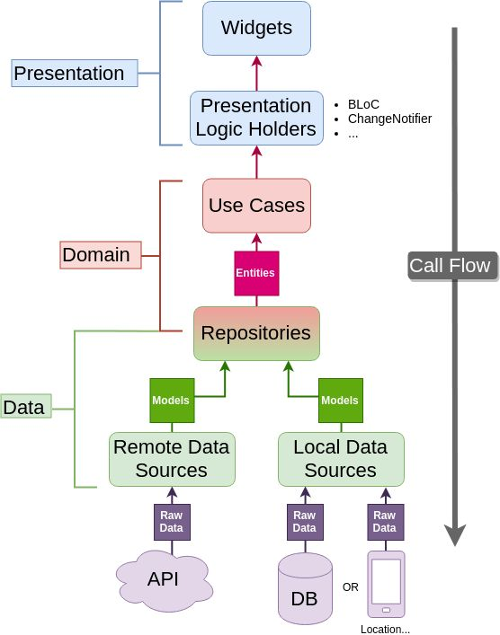
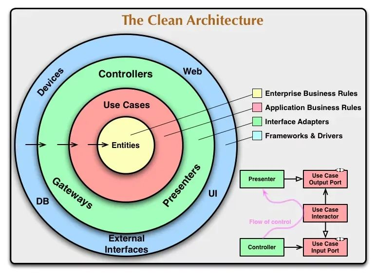

# _

## 1. **Presentation Layer (프레젠테이션 계층)**

- **역할**: 사용자 인터페이스(UI)와 사용자 상호작용을 처리.
- **형태**:
  - 웹 인터페이스
  - 모바일 애플리케이션
  - 데스크톱 애플리케이션

---

## 2. **Application Layer (애플리케이션 계층)**

- **역할**:
  - 비즈니스 로직을 처리.
  - 사용자 요청을 받아 이를 대응하는 작업으로 변환.
  - 조정 및 변환 로직을 포함.
- **기능**:
  - 사용자 요청 수신 및 처리.
  - 도메인 계층과 상호작용.

---

## 3. **Domain Layer (도메인 계층)**

- **역할**: 소프트웨어 시스템의 핵심 비즈니스 로직 및 도메인 모델을 포함.
- **기능**:
  - 비즈니스 엔티티, 규칙, 프로세스 캡슐화.
  - 소프트웨어의 "핵심" 역할 수행.

---

## 4. **Data Access Layer (데이터 접근 계층)**

- **역할**: 데이터 지속성 저장소(예: 데이터베이스)와 상호작용.
- **기능**:
  - 데이터 읽기, 쓰기, 업데이트 작업 처리.
  - 데이터를 접근하고 조작하기 위한 인터페이스 제공.

---

## 계층 분리의 중요성

- **도메인 모델과 비즈니스 로직을** 사용자 인터페이스(UI), 인프라, 애플리케이션 계층 로직과 분리하면 **의존성 감소** 및 **응집력 강화** 가능.
- 복잡한 시스템을 계층별로 나누면 각 계층이 높은 응집력을 유지하고, 하위 계층에만 의존하도록 설계 가능.

---

## **인프라 계층 (Infrastructure Layer)**

- **위치**: 계층 아키텍처의 최하단.
- **포함**:
  - 데이터 지속성 관리.
  - 메시징 메커니즘:
    - MQ 메시지
    - SMTP
    - SMS
- **특징**:
  - 애플리케이션의 저수준 서비스를 제공.
  - 상위 계층은 이 계층과 연결하여 기술적 인프라를 재사용.  

---

## **도메인 계층과 인프라 계층의 결합 방지**

- 핵심 도메인 모델 객체와 인프라 계층 간의 **직접적인 결합**은 피해야 함.
- 이를 통해 시스템의 유연성과 유지보수성을 높일 수 있음.

# 4계층 아키텍처의 개선

- DDD 스타트업 개발팀은 기존 4계층 아키텍처에서 **인프라스트럭처 계층**을 가장 아래에 두는 방식의 단점을 발견했습니다. 이러한 구조는 다음과 같은 문제를 초래할 수 있습니다:
- **계층형 아키텍처의 기본 원칙** 위배.
- **테스트 케이스 작성의 어려움**.

## 해결책: 의존성 역전 원칙

- **의존성 역전 원칙**을 적용하는 것이 해결책입니다:
- 낮은 수준의 서비스(예: 인프라스트럭처 계층)는 높은 수준의 컴포넌트(예: 사용자 인터페이스, 애플리케이션, 도메인 계층)가 제공하는 인터페이스에 의존해야 합니다.

### **의존성 역전 원칙(DIP)의 이해**

- 전통적인 개발 방식에서는 상위 모듈이 하위 모듈에 직접 의존하여 **강한 결합**을 초래합니다.
- DIP는 상위와 하위 모듈이 공통 **추상화(인터페이스)**에 의존하도록 하여 유연성과 유지보수를 용이하게 만듭니다.

- **실질적인 효과**:  
- 인프라스트럭처 계층이 아키텍처에서 **최상단**으로 이동하며, 다른 계층에서 정의한 인터페이스를 구현합니다.

### 의존성 역전에 대한 논쟁

- 일부는 DIP가 상위 계층과 하위 계층 간에만 적용되어, 상위 계층이 하위 계층이 정의한 인터페이스를 구현해야 한다고 주장합니다.
- 반면, 모든 계층(인프라스트럭처 계층 제외)이 **동일한 수준**에서 작동한다고 보는 시각도 있습니다.

---

# 계층 설명

## 사용자 인터페이스 계층

- **구성 요소**: 사용자 인터페이스, 웹 서비스.
- **책임**:
  - 사용자 화면 표시 및 요청 처리.
  - 입력 값 검증(도메인 검증과는 별개).
  - 프론트엔드와 백엔드 간 어댑터 역할 수행.
- **베스트 프랙티스**:
  - **프레젠테이션 모델**을 사용해 도메인 객체와 UI를 분리.
  - 외부 애플리케이션마다 입력/출력 파라미터가 다른 경우 **파사드 인터페이스**를 활용해 객체를 조합 및 변환.

---

## 애플리케이션 계층

- **구성 요소**: 애플리케이션 서비스.
- **책임**:
  - **서비스 오케스트레이션**: 애그리게이트와 도메인 객체를 조율.
  - **마이크로서비스 간 통신**: 서비스 조합 및 상호작용 지원.
  - API 게이트웨이를 통해 **코스 그레인 서비스** 제공.
  - **인증, 권한 확인**, **트랜잭션 제어** 수행.
- **설계 원칙**:
  - **비즈니스 로직**은 도메인 계층에 위치해야 하며, 애플리케이션 계층을 비대화시키지 말 것.  
    그렇지 않으면 마이크로서비스가 MVC 구조로 퇴화할 위험이 있습니다.

---

## 도메인 계층

- **구성 요소**: 애그리게이트 루트, 엔티티, 값 객체, 도메인 서비스.
- **책임**:
  - 핵심 비즈니스 로직 구현.
  - **비즈니스 개념, 규칙, 상태**를 정의.
  - 여러 엔티티나 값 객체가 연관된 경우, **도메인 서비스**를 통해 복잡한 로직 처리.
- **핵심 원칙**:
  - 엔티티는 단일 단위의 로직을 캡슐화하며, 도메인 서비스는 이를 결합하여 더 복잡한 기능을 제공합니다.

---

## 인프라스트럭처 계층

- **책임**: 주요 기술 인프라 서비스를 제공:
  - 드라이버, 메시지 큐, API 게이트웨이, 캐시, 데이터베이스 등.
- **효과**:
  - 의존성 역전을 통해 애플리케이션 및 도메인 계층과의 결합을 제거.
  - **데이터베이스 변경** 시 애플리케이션 계층 코드 수정 없이, DB 기초 서비스만 교체하면 되도록 설계.

### **의존성 역전의 예**

- 기존 MVC 구조에서는 데이터베이스가 변경되면 애플리케이션 계층의 코드를 대규모로 수정해야 하는 경우가 많습니다. 하지만 DIP를 적용하면 데이터베이스 서비스만 교체하면 되어, 변경 비용과 위험이 크게 줄어듭니다.
