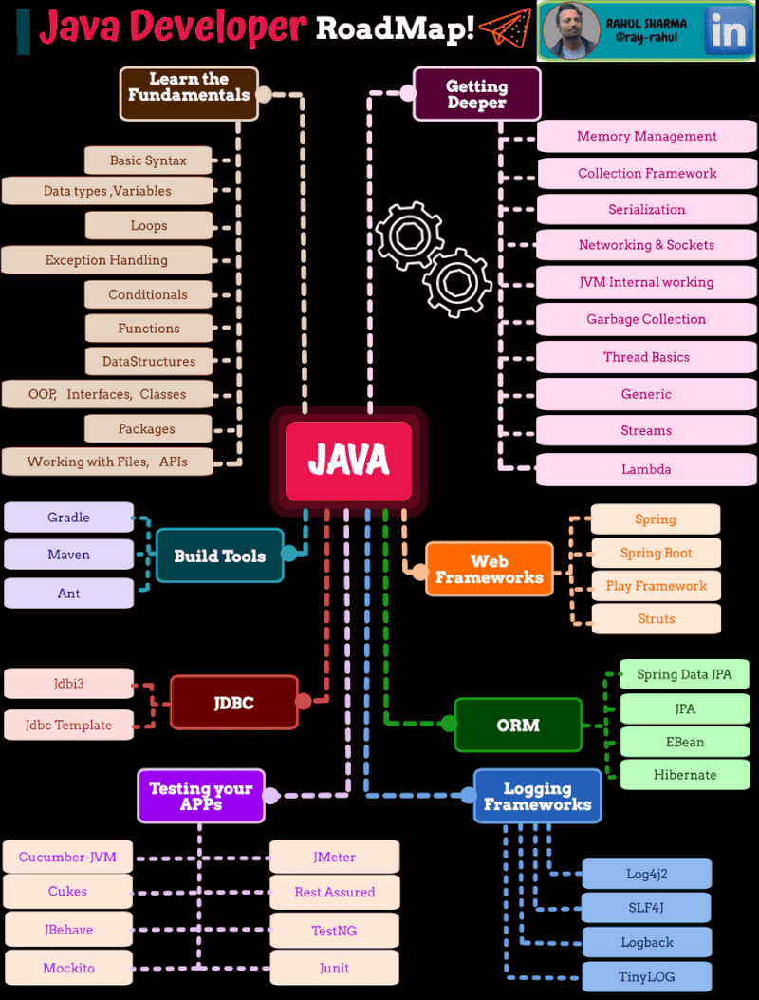

1. Java 환경
2. Java API
3. Layered Architecture
4. SpringBoot
5. Gradle
6. 테스트

---

1. 자바 - 핵심 동작 개념 jvm, class, gc, main 함수
	1. jvm
	2. 빌드, 컴파일
	4. 런타임, gc, 쓰레드
2. 자바 - 클래스와 객체 , 메서드 시그니처
	1. 클래스와 객체
		1. oop 특징
			1. 추상화(Abstraction), 상속(Inheritance), 다형성(Polymorphism), 캡슐화 (Encapsulation)
	2. 메서드 시그니처
	3. 원시 타입, 참조 타입, 불변
3. 스프링 부트 - 애플리케이션 레이어드 패턴
	1. presentation, domain,data access
4. 스프링 부트 - 핵심 동작 개념 IoC, 빈, di
	1. ApplicationContext SpringContatiner - Dependency Injection
	2. Bean - Singleton POJO
5. 스프링 부트 - 그래들과 설정 (+ jdbc, jpa)
	1. 그래들
		1. 동작 방식, 명령어
		2. 의존성, 메이븐
	2. application.yaml
6. 스프링 부트 - 테스트, 스프링 생태계
	1. 단위 테스트
	2. 스프링 부트 테스트
	3. 기타 생태계

