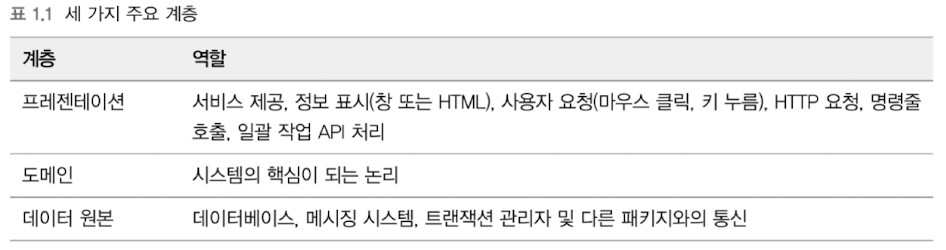
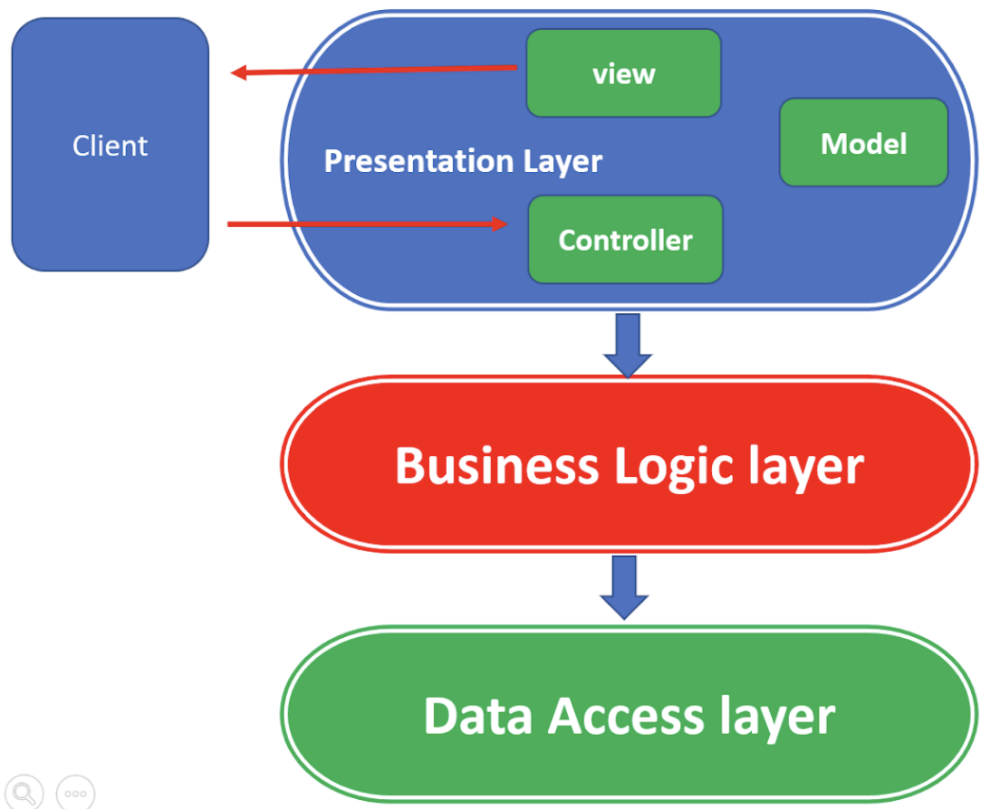
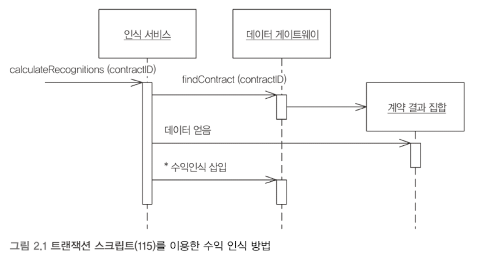
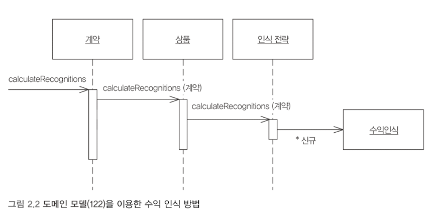
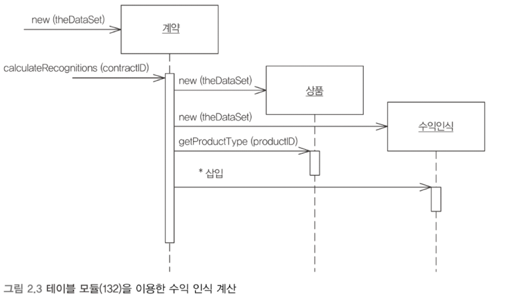
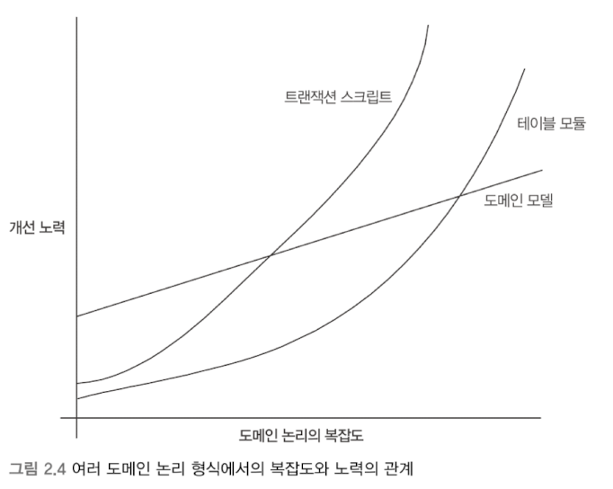
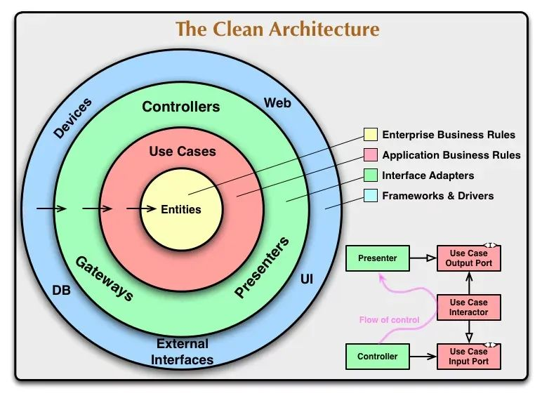

- **Martin Fowler의 "엔터프라이즈 애플리케이션 아키텍처 패턴"**에 따르면, 소프트웨어는 계층화된 구조를 통해 복잡성을 관리합니다.  
- **상위 계층**은 하위 계층의 서비스를 활용하지만, **하위 계층**은 상위 계층을 인식하지 않습니다.

---

## 3.1. 3계층 시스템의 구성

### 3.1.1. 3계층의 주요 구성

1. **프레젠테이션 계층 (Presentation layer)**  
   - 사용자 인터페이스를 담당하며, 애플리케이션의 기능과 데이터를 표시합니다.

```java
@RestController
@RequestMapping("/products")
public class ProductController {
	private final ProductService service
	
    @GetMapping("/{id}")
    public ProductDto getProduct(@PathVariable Long id) {
        return service.getProduct(id);
    }
}
```

2. **비즈니스 로직 계층 (Business logic layer)**  
   - 애플리케이션의 핵심 로직을 처리.  
   - 의사 결정, 계산, 데이터 처리 등을 포함.

```java
@Service
public class ProductService {
	private final ProductRepository repository;

    public ProductDto getProduct(Long id) {
        Product product = repository.getById(id);
        return ProductDto.from(product);
    }
}
```

3. **데이터 접근 계층 (Data access layer)**  
   - 데이터베이스와 상호작용하며 데이터를 저장하고 관리합니다.
   - Java의 경우, JPA 또는 Plain Query를 처리하는 레이어의 구현




---

## 3.2. MVC 패턴과 3계층 아키텍처의 비교

### 3.2.1. MVC 패턴  
- 사용자 인터페이스 설계에 중점을 둔 패턴으로, 다음 세 가지 구성 요소로 나뉩니다.  
  - **Model**: 비즈니스 로직과 애플리케이션 상태를 정의.  
  - **Controller**: 흐름 제어 및 검증 역할.  
  - **View**: 사용자에게 출력 데이터를 표시.



### 3.2.2. 3계층 아키텍처  
- 애플리케이션 전체의 코드 구조를 계층화하여 확장성과 유지보수성을 높이는 것을 목표로 합니다.

---

## 3.3. 도메인 계층의 설계 패턴

### 3.3.1. 트랜잭션 스크립트
- **특징**: 절차적 방식으로, 각 비즈니스 트랜잭션마다 별도의 스크립트를 작성.  
- **장점**: 단순하며 데이터 원본 계층과의 연동이 용이.  
- **단점**: 코드 중복 및 복잡성 증가 가능성.



---

### 3.3.2. 도메인 모델
- **특징**: 객체지향적인 접근으로, 각 객체가 관련된 논리를 담당.  
- **장점**: 복잡한 비즈니스 로직 처리에 적합.  
- **단점**: 객체 간의 상호작용 이해 및 설계 초기 비용이 높음.



---

### 3.3.3. 테이블 모듈
- **특징**: 레코드 집합과 연동되도록 설계되며, 데이터베이스와의 직접적인 연결에서 효과적.  
  - **차이점**:  
    - 도메인 모델은 각 계약마다 객체를 생성.  
    - 테이블 모듈은 인스턴스를 하나만 사용.





---

## 3.4. 클린 아키텍처와 헥사고날 아키텍처

### 3.4.1. 클린 아키텍처  
- 핵심 비즈니스 로직과 외부 종속성을 분리.

### 3.4.2. 헥사고날 아키텍처  
- 도메인 중심 설계와 유사하며, 애플리케이션의 입력/출력을 명확히 정의.


