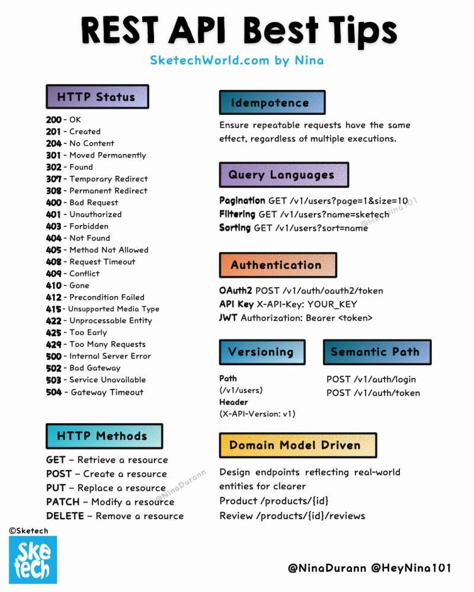

# 경험 많은 개발자가 숙지해야 할 10가지 REST API 핵심 개념

## 1. 리소스 상태 전이 메커니즘
- 진정한 무상태성은 각 요청이 완전한 컨텍스트를 포함해야 함.
- 서버는 요청 간 클라이언트 세션 상태를 유지하지 않음.
- 리소스 상태 전이가 애플리케이션 흐름을 주도함.

## 2. 하이퍼미디어 제어 (HATEOAS)
- 응답 링크를 통한 동적 리소스 탐색.
- API 상태 머신을 통한 클라이언트 탐색.
- API 변경에 대한 런타임 적응성 제공.

## 3. 캐싱 아키텍처
- ETag를 활용한 낙관적 동시성 제어.
- `If-Match`/`If-None-Match`를 활용한 조건부 요청.
- 리소스 수준의 캐시 무효화 전략.

## 4. 콘텐츠 협상 파이프라인
- `Accept` 헤더를 활용한 콘텐츠 타입 결정.
- 언어 및 인코딩 협상.
- 품질 매개변수(q-values)를 사용한 우선순위 가중치 지정.

## 5. 리소스 구성
- 복잡한 작업을 위한 집합 리소스 구성.
- 복합 리소스 패턴.
- 대량 작업 처리.

## 6. 멱등성 보장
- 네트워크 장애를 대비한 안전한 재시도 메커니즘.
- 요청 중복 제거 전략.
- 트랜잭션 경계 관리.

## 7. 인증 및 권한 컨텍스트
- 리소스 기반 접근 제어.
- 범위(scope) 기반 권한 모델.
- 세분화된 권한 규칙 설정.

## 8. 요청/응답 라이프사이클
- 연결 풀 최적화.
- Keep-Alive 관리.
- 요청 파이프라이닝 효율성 증대.

## 9. 리소스 버전 관리
- URI 기반 vs 헤더 기반 버전 관리의 장단점.
- Breaking vs Non-breaking 변경.
- 버전 협상 전략.

## 10. 에러 처리 프로토콜
- `RFC 7807` (Problem Details) 구현.
- 일관된 에러 응답.
- 일시적 실패 처리 패턴.
