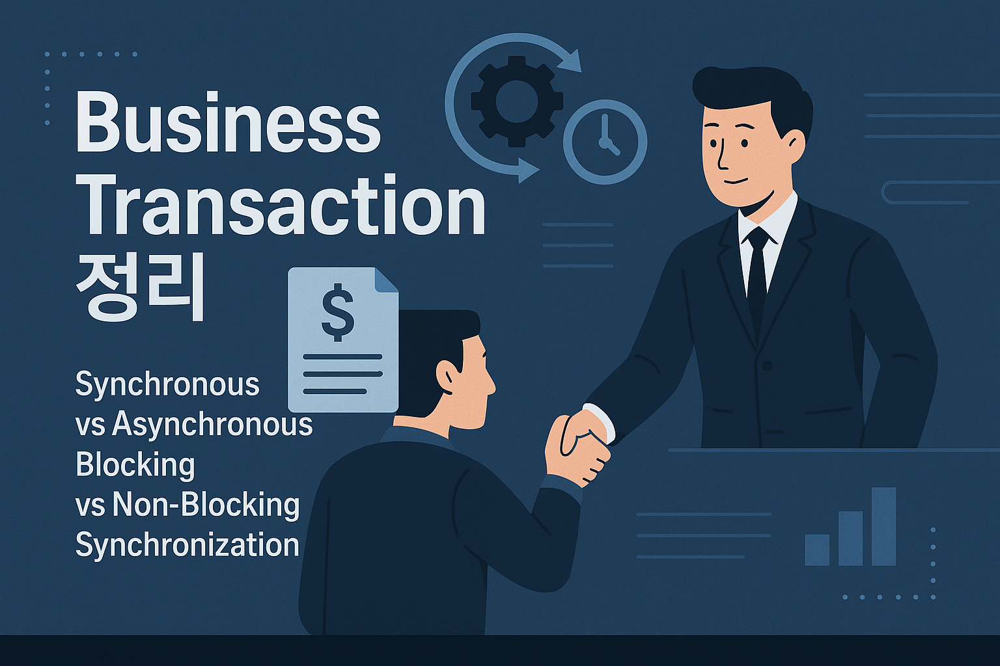

비즈니스 트랜잭션은 시스템 트랜잭션과 다르다. 마틴 파울러의 [POEAA](https://iol-lshh.github.io/%ED%9A%8C%EA%B3%A0/EAA/EAA_%EC%A0%95%EB%A6%AC/)는 이 둘을 다음으로 설명한다.

- 시스템 트랜잭션: 애플리케이션에서 데이터베이스로 수행
- 비즈니스 트랜잭션: 사용자에게서 애플리케이션으로 수행

시스템 트랜잭션은 트랜잭션하면 바로 떠오르는 그거다. 동기적으로 ACID로 처리되어야 하는 것. 비즈니스 트랜잭션은 조금 다르다. **최종적 일관성**을 갖고 비동기적으로 처리될 수도 있다. 중요한 것은 **사용자로부터 요청을 일관된 유스케이스 로직으로 처리**한다는 것이다.

비즈니스 트랜잭션을 설명하기 위해 다음 내용들을 정리할 것이다.

- 동기(Synchronous)와 비동기(Asynchronous)
- 블로킹(Blocking)과 논블로킹(Non-Blocking)
- 동기화(Synchronization)

---

## 동기(Synchronous) vs 비동기(Asynchronous)

애플리케이션 단에서 동기와 비동기를 각각 한문장으로 정리하면 다음과 같다.

- **동기**(Synchronous): 요청하면 처리하고 알려줌.
	- 요청 → 처리 → 결과가 확정되기 전까지 다음 단계 X
- **비동기**(Asynchronous): 요청하면 처리하겠다고 알려주고, 처리함.
	- 요청 → 바로 응답 → 실제 처리와 결과 확정은 나중에

뭔가 이렇게 봤을때 동기와 비동기에 대해 이렇게 정의해 볼 수 있을 것 같다.

- **동기**는 로직의 **흐름 자체가 차례로 이어지는 구조**
- **비동기**는 로직의 **흐름을 기다리지 않고 갈라지는 구조**

**동기는 ‘흐름의 질서’이고, 비동기는 ‘흐름의 독립’이다.** (데이터 일관성에서의 독립이 아니다!)

또한 동기와 비동기는 블로킹/논블로킹과 같이 이야기 되어야 한다.

---

## 블로킹(Blocking) vs 논블로킹(Non-Blocking)

먼저 동기/비동기와 블로킹/논블로킹을 간단히 비교하면 다음과 같다.

- **동기/비동기**는 호출에 대해 **응답하는 방식**이다. 
- **블로킹/논블로킹**은 루틴의 처리에서 **대기 상황에 대한 대응 방식**이다. 

**대기**란 **결과를 기다리는 동안 아무것도 못하고 멈추는 상태**를 의미한다.

- I/O 대기. 데이터 올 때까지 멈춤 (디스크 읽기, 네트워크 응답, 파일 쓰기 등)
- 다른 쓰레드가 끝날 때까지 대기 (`Thread.join()`)
- 락 획득, 다른 작업 단위가 잡고 있으면 대기
- 조건 만족될 때까지 대기 (`sleep(5)` 호출)

I/O건 CPU건, 쓰레드건 상관없다. 중요한건 그것을 대기 상태라고 정의했는가 이다. 그리고 이런 대기 방식에 대해 블로킹/논블로킹이 적용된다.

- **블로킹**(Blocking): 루틴이 끝나서 결과 나올 때까지 기다린다. 그동안 다른 일을 하지 않는다.
- **논블로킹**(Non-Blocking): 루틴이 대기를 만나는 시점에 바로 반환한다. 결과가 없으면 “아직 없어!” 하고 끝난다.

동기/비동기와 블로킹/논블로킹을 조합해보면 다음과 같다.

|         | 블로킹                                                  | 논블로킹                                                                                |
| ------- | ---------------------------------------------------- | ----------------------------------------------------------------------------------- |
| **동기**  | 대기할 것 다 기다려가며, **순차적으로 실행**한다.                       | 논블로킹의 대기는 결과 처리가 없으면 없다고 바로 반환하는데, 결과가 필요하므로, 결과를 받을때까지 **반복해서 요청**(polling)하는 경우다. |
| **비동기** | 작업은 독립적으로 처리한다. 결과가 필요한 시점(async - await)이 생기면 기다린다. | 요청 접수 응답을 받고, 작업은 독립적으로 처리한다. 결과는 **콜백, 이벤트 등으로 나중에 전달** 받는다.                       |

비동기가 조금 헷갈리는데, JavaScript async-await을 떠올려보면 된다.

- async의 전체 흐름은 비동기다. (비동기 + 논블로킹)
- 하지만 await 관점에서는 **일시적으로 동기처럼 멈추는 구간**이다. (비동기 + 블로킹)
- async - await은 "**대기를 만나면, 나는 이 친구 기다려서 독립적으로 실행할꺼야! 알아서 할일들 해**" 하는 선언이다.

---

동기/비동기, 블로킹/논블로킹은 실행 흐름의 스타일을 설명하는 개념이다.

 이런 흐름은 내부적으로는 동기화(Synchronization)라는 타이밍 제어로 구현된다. 동기화는 순서를 맞추고, 충돌을 방지하며, 동작의 일관성을 만든다.

## 동기화(Synchronization)

동기화는 동시성 시스템에서의 타이밍 조율이다. 이는 **일관성을 위한 흐름 제어**를 목적으로 한다.

> 동기화(Synchronization)란 **시스템이 조화를 이루어 작동하도록 이벤트를 조율하는 것**을 말합니다. 예를 들어, 오케스트라의 지휘자(conductor)는 오케스트라가 동기화(synchronized)되거나 **일정한 시간(in time)에 맞춰 연주하도록 조율**합니다. 모든 부분이 동시에 작동하는 시스템은 동기적(synchronous) 또는 "동기화된(in sync)" 상태라고 하며, 그렇지 않은 경우를 [비동기](https://en.wikipedia.org/wiki/Asynchronous_system "비동기 시스템")적(asynchronous)이라고 합니다. - [동기화](https://en.wikipedia.org/wiki/Synchronization)

컴퓨터 과학 관점에서 조금더 세부적으로 정의를 찾아보면 다음과 같다.

> 동기화는 합의에 도달하거나 특정 일련의 동작을 수행하기 위해 여러 프로세스(multiple process)가 특정 지점에서 결합(join up)하거나 핸드셰이크(handsake) 하도록 조정(coordinating)하는 작업입니다. - [동기화(컴퓨터 과학)](https://en.wikipedia.org/wiki/Synchronization_(computer_science))

동기화란 **동시성(Concurrency) 시스템**에서 여러 실행 단위(프로세스/스레드)가 **의도한 올바른 순서로 작업을 수행**하게 만드는 기술이다.

- “**이 루틴 끝날 때까지 기다릴까?**” → 동기/비동기
- “**여러 작업이 수행 되는데, 누가 먼저?**” → 동기화

그렇다면 동기화는 어디에 필요할까?

### 동기화가 필요한 곳

동기화는 결국 **동작 시점**에 대한 이야기다. 실행 순서를 정렬한다거나, 자원 획득을 기다리게 한다거나 하는 것이 목적이다. 크게 분류해보면 같다.

- 포크 - 조인 (Forks - Joins)
- 생산자 - 소비자 (Producer - Consumer)
- 배타적 자원 (Exclusive use resources)

#### [포크 - 조인](https://en.wikipedia.org/wiki/Fork%E2%80%93join_model "포크-조인 모델") (Forks - Joins)

로직이 포크(Fork)와 조인(Join)의 형태를 갖춘다면 동기화가 필요하다. 

- **포크**(Fork): 하나의 작업을 다수의 하위 작업으로 분할하는 것
- **조인**(Join): 다수의 작업을 하나의 작업으로 합치는 것

작업이 **포크**된다는 것은 **다수의 하위 작업으로 분할한다는 것**이다. 모든 하위 작업이 끝날때까지 대기하여, 작업의 결과를 전부 조인하고, 이후 로직을 실행해야 할 것이다. 이때, 포크 이후의 **하위 작업들을 동시에 작업할 수도 있을 것**인데, 조인 이후의 처리를 위해서는 하위 작업들이 전부 처리될 때까지 **타이밍을 기다려야 할 것**이다.

#### [생산자 - 소비자:](https://en.wikipedia.org/wiki/Producer%E2%80%93consumer_problem "생산자-소비자 문제") (Producer - Consumer)

로직이 생산자와 소비자로 분리되어 처리된다면 동기화가 필요하다,.

- **생산자**(Producer): 데이터를 만드는 주체
- **소비자**(Consumer): 데이터를 소비하는 주체

생산자-소비자 관계에서 소비자 프로세스는 필요한 데이터가 생성될 때까지 생산자 프로세스에 종속된다. **두 주체가 동시에 작업할 수도 있을 것**인데, 생산자가 데이터 생성할 때까지, 소비자는 **타이밍을 기다려야 할 것**이다.

#### 배타적 자원 (Exclusive use resources)

흔히 동기화에 대해 이야기할 때, 동시성 이슈와 관련된 대표적인 동기화가 필요한 곳이다. 여러 실행 단위들이 특정 리소스에 의존하고 **해당 리소스에 접근할 경우**, 한 시점에 단 하나의 실행 단위 만이 해당 리소스에 접근해야 한다. 이때 **실행 단위들은 동시에 작업할 수도 있을 것** 인데, 자신의 차례가 올 때까지 **타이밍을 기다려야 할 것**이다.

세 가지 경우를 모두 분석해보았을 때, 각 작업들 자체를 직렬적인 작업으로 수행할 수도 있다. 하지만 운영체제와 시스템에 있어, 동시성을 사용하지 않는다는 것은 매우 비효율적이다. 운영체제는 가상화를 통해 한정적인 CPU를 무한하게 보이도록 설계되었다. 한번에 여러 작업을 동시에 수행하는 것 처럼 보이도록 설계되어, 작업의 효율성을 높였다. 이런 주어진 자원을 사용하지 않을 이유가 없다. **동시성을 사용하되, 동기화를 통해 시스템의 일관성을 달성하는 것이 소프트웨어 엔지니어링의 목표**일 것이다.

이런 동기화 개념은 단일 시스템 안에서는 락이나 세마포어 같은 저수준 기술로 구현되지만, 비즈니스 트랜잭션처럼 복잡한 서비스 간 흐름에서는 보다 고수준의 흐름 제어 방식이 필요하다.

지금까지 정리한 동기화, 동기/비동기, 블로킹/논블로킹 모든 개념을 가지고, 그 복잡한 흐름의 실체인 비즈니스 트랜잭션을 살펴보자.

---

## 비즈니스 트랜잭션

**비즈니스 트랜잭션**은 사용자 요청을 받아 여러 단계를 거쳐 처리되는 **논리적 트랜잭션 흐름**을 의미한다. 하나의 요청이 여러 마이크로서비스, 데이터베이스, 외부 시스템을 통과할 수 있으며, 이 복잡한 흐름 속에서도 **사용자 관점에서 ‘동기 + 블로킹’처럼 느껴지는 예측 가능한 흐름**이 필요하다. 실제 구현은 대부분 **비동기 + 논블로킹**으로 처리 되더라도, 다음 목표를 달성해야 한다.

- 결과는 정해진 **순서**대로 도달해야 한다.
- 결과는 **중복되지 않아야** 한다.
- 결과를 **되돌릴 수 있어야**한다.

시스템 트랜잭션은 락으로 동기화를 해결하지만, 비즈니스 트랜잭션에서는 한계가 있다. 단일 데이터베이스가 아닌 여러 서비스와 외부 시스템을 아우르는 복잡한 흐름을 다루기 때문이다. 여기서의 동기화는 **단순히 타이밍 조절과 일관성을 넘어, 서비스 간 독립성도 유지해야 한다**. 기존 락 기반 접근으로는 이를 충족하기 어렵기에, 새로운 방안이 제안된다. 바로 사가(Saga)다.

### 사가 (Saga)

사가(Saga)는 **각 단계가 독립적이면서 전체적으로 일관성을 달성하는 트랜잭션 설계 방식**이다. 동기화 개념을 비즈니스 트랜잭션에서 실현하는 것인데, **트랜잭션을 작은 단위의 지역 트랜잭션으로 분리하고**, 각 단계의 성공/실패 여부에 따라 **다음 단계를 진행하거나 보상 처리**한다.

또한 사가는 비동기 + 논블로킹 구조와 잘 어울린다.

비동기 이점

- 서비스 간 **느슨한 연결(loose coupling)** 가능.  
- 장애 시에도 전체 플로우가 **멈추지 않음**.
- 사가의 핵심 개념 중 하나인 **보상 트랜잭션**도 이벤트 기반으로 처리 가능.

논블로킹 이점

- 서비스는 **“결과가 나올 때까지 아무것도 못하는 상황”이 없음**.  
- 동시성(concurrency)과 처리량(throughput)이 올라감.  
- 타임아웃 지옥이나 동기적 장애 전파를 피할 수 있음.

그렇다면 이 비동기 + 논블로킹 구조를 어떻게 전체 시스템에 걸쳐 구현할까?

- 서비스 구성: 이벤트 수신자와 로컬 트랜잭션
- 사가 코디네이터 - 오케스트레이터 vs 코레오그래피
- 메시지 브로커 구축
- 추적 시스템

이때 서비스는 다음 두 가지로 구성된다.

- **이벤트 수신자**: 특정 이벤트를 구독하고 반응하는 리스너로 메시지 브로커와 연결된다. 메시지를 받아 **논블로킹 방식으로 처리 시작**한다.
- **로컬 트랜잭션**: 자기 책임에 해당하는 비즈니스 로직 실행한다. 서비스는 결과를 리턴하지 않고, 이벤트로 알린다.
	- 처리 완료되면 → **다음 단계로 이어지는 이벤트 발행**
	- 실패하면 → **보상 이벤트 발행**

사가는 메시지 브로커와 이벤트를 수행하는 구조를 통해 이벤트 드리븐 아키텍처(Event Driven Architecture, EDA)를 구성하고, 이를 통해 비즈니스 트랜잭션에서의 동기화를 구현한다.

(이 글에서는 사가를 아주 간략하게 비즈니스 트랜잭션 관점에서 살펴봤다. 조만간 크리스 리처드슨의 MSA 저서를 읽고 정리한 글에서 더 자세히 정리할 것이다.)

---

**비즈니스 트랜잭션**은 사용자 요청을 받아 여러 단계를 거쳐 처리되는 논리적 트랜잭션이다. 시스템 트랜잭션처럼 단일 DB 안에서 끝나지 않고, 여러 서브 시스템, 메시지 큐, 외부 API, 데이터 저장 등을 포함하는 **복잡하고 긴 처리 흐름**을 가질 수 있다. 

이런 비즈니스 트랜잭션의 흐름에서는 **동기/비동기**, **블로킹/논블로킹** 구조를 상황에 맞게 조합하고, 각 단계 간의 적절한 **동기화**(synchronization) 설계로 **신뢰성과 성능을 동시에 확보**해야 한다. 이 때 서비스간 로직이 심화된다면, 사가의 도입을 고려해 볼 만 하다.

중요한 것은 **사용자 관점에서 모든 흐름이 순차적이며 동기적인 인터페이스**로 느껴져야 한다. 바로 이것이 **최종적 일관성(eventual consistency)을 달성하는 핵심 전략**이며, 비즈니스 트랜잭션의 본질이다.
