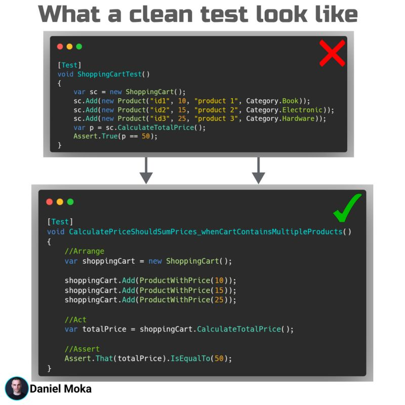

- 클린 코드 팁: 깨끗한 테스트 없이는 깨끗한 코드를 가질 수 없다
- 테스트는 코드 품질의 핵심입니다. **깨끗한 테스트**는 다음과 같은 특징을 가져야 합니다

## **깨끗한 테스트의 특징**

1. **단순함 (Simple)**
    - 테스트 자체에 복잡한 로직이 없어야 합니다.
    - 테스트는 실행 흐름을 쉽게 이해할 수 있어야 합니다.

2. **불필요한 데이터 숨기기 (Hides Irrelevant Data)**
    - 테스트의 핵심 목적과 관련 없는 데이터는 숨기거나 단순화해야 합니다.

3. **AAA 구조 준수 (Follows the AAA Structure)**
    - **Arrange**: 테스트 준비(데이터와 상태 설정).
    - **Act**: 테스트 대상 코드 실행.
    - **Assert**: 실행 결과 검증.

4. **테스트 간 독립성 유지 (Isolated)**
    - 각 테스트는 다른 테스트와 완전히 독립적이어야 합니다.
    - 외부 상태나 공유 리소스에 의존하지 않아야 합니다.
  
5. **설명적인 이름 (Descriptive Test Name)**
    - 테스트 이름만 보고도 테스트의 목적과 동작을 명확히 알 수 있어야 합니다.

6. **의미 있는 검증 (Meaningful Assertions)**
    - 검증은 테스트의 핵심 목적과 직결되어야 하며, 불필요한 검증을 피해야 합니다.

7. **F.I.R.S.T. 원칙 준수 (F.I.R.S.T. Principle)**
    - **Fast**: 테스트는 빠르게 실행되어야 합니다.
    - **Independent**: 다른 테스트와 독립적이어야 합니다.
    - **Repeatable**: 어디서 실행하든 항상 같은 결과를 반환해야 합니다.
    - **Self-validating**: 테스트 결과는 성공 또는 실패로 명확히 나타나야 합니다.
    - **Timely**: 테스트는 코드를 작성하기 전에 설계되어야 합니다(TDD).

8. **현실적이고 대표적인 데이터 사용 (Uses Realistic and Representative Data)**
    - 실제 환경과 유사한 데이터를 사용하여 테스트 신뢰성을 높입니다.
  
---

- 테스트를 **일급 시민**으로 다루세요.  
- 테스트는 코드의 품질을 지탱하는 중요한 자산입니다.  
- 클린 테스트는 코드 변경 시 문제를 쉽게 발견하고, 자신감 있게 리팩터링할 수 있도록 도와줍니다.