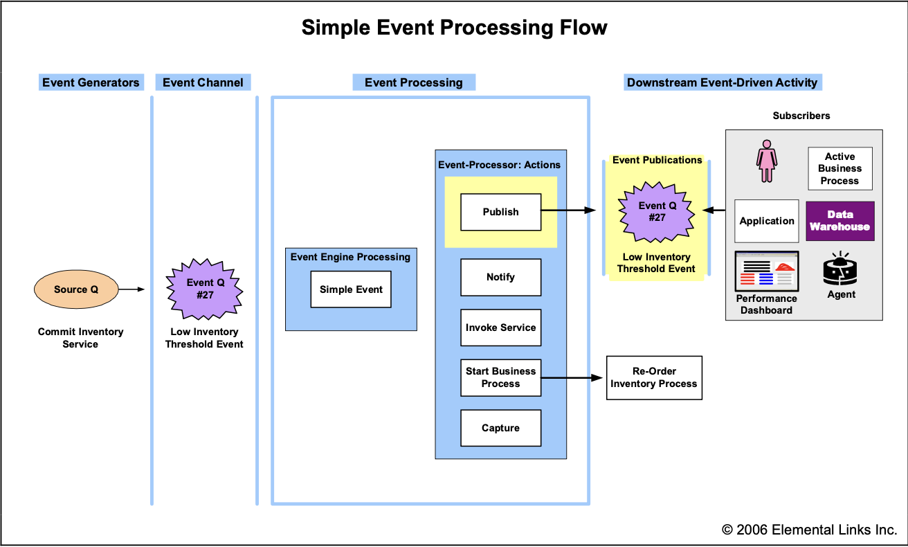
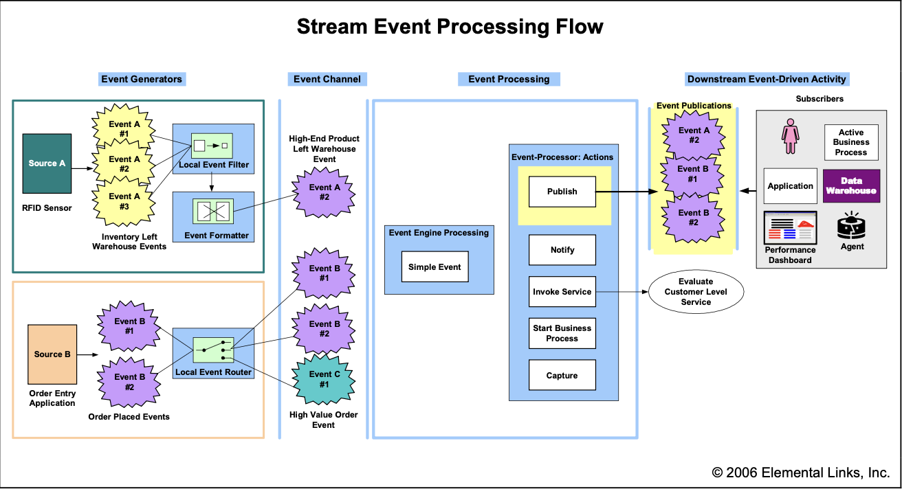
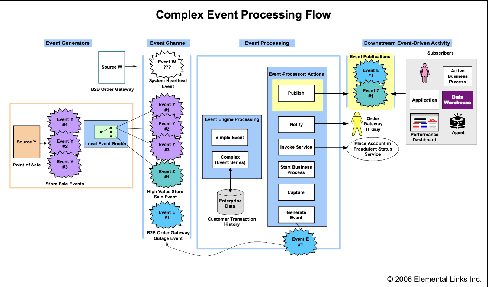
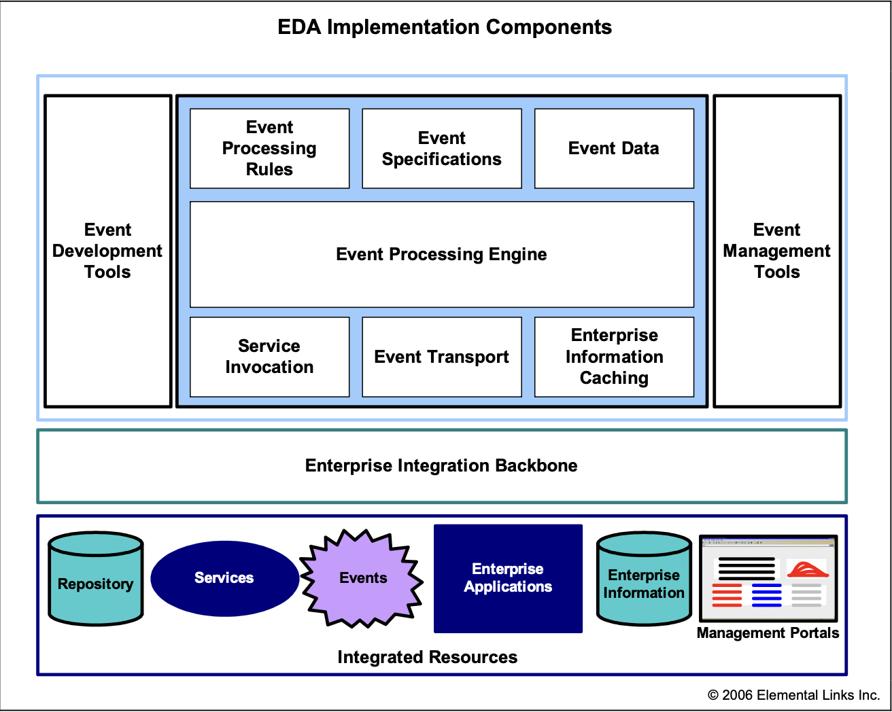

- Brenda M. Michelson
- 원본: [Event-Driven Architecture Overview (Brenda M. Michelson, 2006)](https://complexevents.com/wp-content/uploads/2006/07/OMG-EDA-bda2-2-06cc.pdf)

> 이벤트 중심의 SOA는 EDA의 일부일 뿐이다

### SOA와 EDA

지난 1년 동안, 우리가 서비스 지향 아키텍처(SOA)에 대해 글을 쓰거나 말할 때마다, 우리는 SOA와 이벤트 기반 아키텍처(EDA) 간의 상호작용을 빼놓을 수 없었다¹. 우리는 이 둘 사이에 **서로 다른 두 가지 상호작용**이 존재한다고 보고, 그렇게 이야기해왔다.

- ¹ 서비스 지향(Service orientation)은 서비스(정의된 역할을 가진 추상적 자원)와 그 제공자(그 역할을 실제로 수행하는 물리적 자산) 간의 느슨한 결합(loose coupling)을 의미하는 아키텍처 개념이다. 요청자는 서비스가 어떤 일을 하는지와 그것을 어떻게 요청하는지만 알 뿐, 그 구현 방식은 오직 서비스만이 알고 있다.    SOA는 이러한 서비스 지향 개념에 기반한 IT 아키텍처 전략으로, 비즈니스 솔루션(및 인프라 솔루션)의 제공을 목표로 한다.

첫 번째 상호작용에서는, **이벤트**(비즈니스 내부 또는 외부에서 발생한 주목할 만한 일)가 하나 이상의 **서비스 호출을 유발**할 수 있다. 이때 호출된 서비스는 **간단한 기능**을 수행할 수도 있고, **전체 비즈니스 프로세스**를 실행할 수도 있다. 이러한 **이벤트와 서비스 간의 상호작용**은 일반적으로 **이벤트 기반 SOA**(event-driven SOA)라고 불리며, 우리는 이것을 **SOA의 한 스타일**로 설명한다².

- ² 비즈니스 솔루션 개발에서 사용되는 SOA의 두 가지 주요 스타일은 **컴포지트 애플리케이션(composite application) 개발**과 **플로우(flow)** 방식이다.
  - **컴포지트 애플리케이션**에서는 **사용자와의 상호작용이 하나 이상의 서비스 요청을 유도**하며, 대부분의 서비스 호출은 **동기적**(synchronous)이다. 이러한 애플리케이션은 보통 **하나의 비즈니스 도메인**을 대상으로 하며, **포털에 제공**하는 경우가 많다.
  - **플로우(flow) 방식**에서는 **비즈니스 프로세스** 또는 **이벤트**가 서비스 호출을 유도한다. 이때의 서비스 호출은 **비동기**(asynchronous)와 **동기**(synchronous) 방식이 혼합되어 있지만, 전체적인 흐름은 보통 **장기 실행**(long running)되며 **비동기적**이다. 플로우는 일반적으로 **여러 비즈니스 도메인을 가로질러**(crosscut) 있으며, 종종 **기업 외부까지 확장**되기도 한다.   
      
  자세한 내용은 "[Service-Oriented World Cheat Sheet](http://dx.doi.org/10.1571/bda6-2-05cc)"(June 2, 2005)

두 번째 상호작용에서는, **서비스가 이벤트를 생성**할 수 있다. 이 이벤트는 문제나 임박한 문제, 기회, 임계치 도달, 혹은 편차 등을 나타낼 수 있다. 이벤트가 생성되면, 이는 즉시 관련된 **모든 이해관계자(사람이든 자동화된 시스템이든)에게 전파**된다. 이해관계자들은 해당 이벤트를 평가하고, 필요에 따라 행동을 취할 수 있다. 이러한 이벤트 기반의 행동에는 서비스 호출, 비즈니스 프로세스 트리거, 또는 추가적인 정보 게시나 배포가 포함될 수 있다. 이 상호작용에서는, 서비스는 보다 넓은 이벤트 기반 아키텍처 안에서 다수의 이벤트 소스 중 하나일 뿐이다.

최근 몇 달 동안 우리는 기업과 벤더 커뮤니티 모두에서 SOA와 EDA의 연결성에 대한 관심이 높아지고 있는 것을 목격해왔다. 엔터프라이즈 아키텍트들과 IT 전략가들은 IT와 비즈니스의 민첩성을 실현할 수 있는 환경을 어떻게 구축(또는 발전)시킬 수 있을지를 고민하고 있다. 주요 SOA를 다루는 리더들과 통합 벤더들은 SOA, 통합, 이벤트 처리에 대한 비전과 제품 전략을 통합해 나가고 있다. 이러한 흐름은 매우 긍정적이다.

그러나 우리는 독자들에게 전하고 싶은 우려와 주의점이 하나 있다. 많은 SOA를 이야기하는 사람들은 이벤트 기반 아키텍처에 대해 이야기할 때, 이벤트 기반 SOA라는 한 측면만을 강조하고 있다는 것이다. 우리는 이것이 단편적인 이벤트 아키텍처 구현으로 이어질 수 있다고 우려한다. 그렇게 되면 기업들은 실시간 정보 흐름과 분석, 그리고 복합 이벤트 처리 같은 기회를 놓치게 될 수 있다.

전체적인 시각으로 사고하는 아키텍처 독자들을 위해, 우리는 이번 개요 보고서를 통해 이벤트 기반 아키텍처에 대해 정리했다. 이 보고서에서는 주요 이벤트 개념을 설명하고, 이벤트 처리 흐름을 따라가며, 이벤트 기반 아키텍처의 주요 구현 구성 요소들을 살펴본다.

---

## EVENT-DRIVEN ARCHITECTURE 기초

### 이벤트 기초

#### 이벤트란 무엇인가?

이벤트란 비즈니스 내외부에서 발생하는 주목할 만한 일이다. 이벤트(비즈니스 또는 시스템 이벤트)는 임박한 문제, 기회, 임계치 도달, 혹은 편차를 나타낼 수 있다.

##### 명세와 발생

‘이벤트’라는 용어는 종종 이벤트의 명세(정의)와 각 개별 발생(인스턴스)을 모두 지칭하는 데에 혼용된다.

##### 비즈니스 용어로 정의하라

이벤트가 이후 단계의 구독자들(사람이든 자동화된 시스템이든)에게 의미 있게 전달되려면, 이벤트의 이름과 본문이 반드시 **데이터나 애플리케이션 용어가 아닌 비즈니스 용어로 명세**되어야 한다.

#### 이벤트에는 무엇이 들어 있는가?

각 이벤트 발생은 **이벤트 헤더**와 **이벤트 본문**을 가진다. 이벤트 헤더에는 이벤트 명세 ID, 이벤트 유형, 이벤트 이름, 이벤트 발생 시각, 이벤트 발생 번호, 이벤트 생성자 등 이벤트 발생을 설명하는 요소들이 들어 있다. 이 요소들은 이벤트 명세 간에 일관되게 유지된다.

##### 이벤트 본문

이벤트 본문은 실제로 **무슨 일이 일어났는지를 설명**한다. 예를 들어, 어떤 소매업체가 재고 부족 임계치 이벤트를 정의했다면, 이벤트 본문에는 **어떤 상품이 허용 가능한 임계치 이하로 떨어졌는지**에 대한 정보가 포함될 것이다.

이벤트 본문은 어떤 이해당사자라도 **원본 시스템에 다시 접근하지 않고도** 정보를 사용할 수 있을 정도로 충분히 상세히 기술되어야 한다. 재고 부족 이벤트의 경우, 이벤트 본문에는 **상품 식별자뿐만 아니라, 상품 설명, 당시 재고 수치와 임계치 수치**도 함께 포함되어야 한다.

모든 소비자들이 이벤트를 제대로 이해할 수 있도록, 명확한 **비즈니스 용어 체계**(lexicon)나 **온톨로지**(ontology)를 사용하는 것이 바람직하다.

#### 이벤트 기반 아키텍처(Event-Driven Architecture)란 무엇인가?

이벤트 기반 아키텍처에서는 비즈니스 내부 또는 외부에서 주목할 만한 일이 발생하면, 해당 이벤트가 관련된 모든 이해당사자(사람이든 자동화 시스템이든)에게 **즉시 전파**된다. 이해당사자들은 이 이벤트를 평가하고, 필요에 따라 행동을 취한다. 이러한 이벤트 기반의 행동은 서비스 호출, 비즈니스 프로세스의 트리거, 추가적인 정보 게시 또는 배포 등을 포함할 수 있다.

##### 극도의 느슨한 결합(Extreme Loose Coupling)

이벤트 기반 아키텍처는 그 특성상 **극도로 느슨하게 결합**되어 있으며, **고도로 분산된 구조**를 갖는다. 이벤트의 생성자(소스)는 오직 이벤트가 발생했다는 사실만을 알고 있을 뿐이다. 생성자는 그 이후에 이벤트가 어떻게 처리되는지, 누가 그것에 관심을 가지는지에 대해 전혀 알지 못한다. 이벤트가 **동적인 다중 경로 이벤트 네트워크**를 통해 어떻게 전파되고 처리되는지를 추적하는 일은 어렵다. 따라서 이벤트 기반 아키텍처는 **비동기적인 작업 흐름과 정보 흐름**에 가장 적합하다.

### 이벤트 처리 스타일

이벤트 처리에는 일반적으로 **세 가지 스타일**이 있다: **단순(Simple)**, **스트림(Stream)**, 그리고 **복합(Complex)** 이벤트 처리. 성숙한 이벤트 기반 아키텍처에서는 이 세 가지 스타일이 종종 함께 사용된다.

#### 단순 이벤트 처리(Simple Event Processing)

단순 이벤트 처리에서는 어떤 주목할 만한 이벤트가 발생하고, 이것이 이후 단계의 행동을 유도한다. 단순 이벤트 처리는 **업무의 실시간 흐름을 촉진**하여, 지연 시간과 비용을 줄이는 데 흔히 사용된다.

#### 스트림 이벤트 처리(Stream Event Processing)

스트림 이벤트 처리에서는 주목할 만한 이벤트뿐만 아니라 **일반적인 이벤트**(예: 주문, RFID 전송 등)도 함께 발생한다. 이러한 일반 이벤트들은 **주목할 만한지 여부를 판별**하면서 동시에 **정보 구독자들에게 스트리밍**된다. 스트림 이벤트 처리는 기업 내부 및 주변의 **실시간 정보 흐름을 이끌어내는 데** 자주 사용되며, **적시(in-time) 의사결정**을 가능하게 한다.

#### 복합 이벤트 처리(Complex Event Processing, CEP)

복합 이벤트 처리(CEP)는 여러 이벤트의 **복합적인 상관관계를 평가**하고 그에 따라 **행동을 취하는 방식**이다. 이때 이벤트는 주목할 만한 것일 수도, 일반적인 것일 수도 있으며, **이벤트 유형을 넘나들거나 오랜 시간에 걸쳐 발생**할 수 있다. 이벤트 간의 상관관계는 **인과적(causal)**, **시간적(temporal)**, 또는 **공간적**(spatial)일 수 있다. CEP는 정교한 이벤트 해석기, 이벤트 패턴 정의 및 매칭, 상관관계 분석 기법 등을 필요로 한다. CEP는 보통 **비즈니스 이상 징후, 위협, 기회 등을 감지하고 대응**하는 데 사용된다.

---

## EVENT PROCESSING

이 섹션에서는 각 이벤트 처리 스타일에 대한 **예시 이벤트 흐름**을 제시한다. 이 흐름들은 **논리적으로 표현**되며, **네 개의 계층**으로 나뉜다. 이벤트 흐름을 살펴보기 전에, 먼저 이 **논리 계층**들에 대해 설명한다.

### 이벤트 흐름 계층(Event Flow Layers)

이벤트 흐름은 **이벤트가 생성되는 시점**에서 시작되어, 이후 단계의 **이벤트 기반 활동이 실행되는 지점**에서 마무리된다. **논리적**인 네 가지 계층은 다음과 같다:

1. 이벤트 생성자(Event Generators)
2. 이벤트 채널(Event Channel)
3. 이벤트 처리(Event Processing)
4. 이벤트 이후 활동(Downstream Event-Driven Activity)

#### 1. 이벤트 생성자(Event Generators)

모든 이벤트는 어떤 **소스**로부터 생성된다. 이 소스는 애플리케이션, 데이터 저장소, 서비스, 비즈니스 프로세스, 송신기, 센서, 혹은 협업 도구(IM, 이메일 등)일 수 있다. 일반적인 이벤트는 이벤트 전처리기(라우터, 필터 등)에 의해 **주목할 만한지 평가**되며, 이로 인해 새로운 주목 이벤트가 생성될 수도 있다.

이벤트 생성자는 매우 다양하기 때문에, 모든 이벤트가 이벤트 처리에 **필요한 형식으로 생성되는 것은 아니다**. 이런 경우에는 이벤트가 이벤트 채널에 전달되기 전에 **필요한(기업 표준의) 형식으로 변환**되어야 한다.³

- ³ 현재까지 **비즈니스 이벤트 정의나 표기법에 대한 산업 표준은 존재하지 않는다**. IBM은 **시스템 이벤트**에 대해 공통 기반 이벤트(Common Base Event)를 정의해왔으며, 이는 **Web Services Distributed Management(WSDM)** 명세에 포함되어 있다. 공통 기반 이벤트 형식은 IBM의 **Tivoli(시스템 관리)** 제품군에서 발전된 것이다. 자세한 내용은 다음 자료를 참고하라: <http://xml.coverpages.org/IBMCommonBaseEventV111.pdf>

#### 2. 이벤트 채널(Event Channel)

이벤트 채널은 일반적으로 **메시징 백본**이며, **표준 형식의 이벤트**를 이벤트 생성자, 이벤트 처리 엔진, 그리고 이후 구독자들 사이에서 전송하는 역할을 한다.

#### 3. 이벤트 처리(Event Processing)

이벤트 처리 계층에서는, 수신된 이벤트가 **이벤트 처리 규칙**에 따라 평가되고, 이에 따라 **행동이 개시**된다. 이 이벤트 처리 규칙과 행동은 이벤트 생성자가 아니라, **이해당사자의 요구에 따라 정의**된다.

이벤트 처리 행동에는 서비스 호출, 비즈니스 프로세스 개시, 이벤트를 구독 허브에 게시, 사람이나 시스템에 직접 알림, 새로운 이벤트 생성, 이벤트의 이력 저장 등이 포함된다.

이벤트는 **엔진**에 의해 처리된다. **단순 엔진**은 각각의 이벤트 발생을 독립적으로 처리하고, **복합 엔진**은 이전/이후 이벤트의 맥락 속에서 새로운 이벤트 발생을 처리한다.

#### 4. 이후 이벤트 기반 활동(Downstream Event-Driven Activity)

하나의 이벤트 또는 이벤트 간 상관관계는 여러 개의 이후 활동을 **유발**할 수 있다. 이 활동은 이벤트 처리 엔진이 **직접 푸시(push)** 할 수도 있고(서비스 호출, 프로세스 개시, 알림 등), 이벤트 게시를 구독한 **구독자에 의해 풀(pull)** 될 수도 있다.

구독자는 사람, 애플리케이션, 활성 비즈니스 프로세스, 데이터 웨어하우스, 성과 대시보드, 자동화된 에이전트 등이 될 수 있다. 이벤트는 **표준 이벤트 형식**으로 게시되어야 하며, **구독자별 형식**으로의 변환은 보통 **기업 통합 백본**에서 수행된다.⁴

- ⁴ 사람이 이벤트 구독자인 경우, 우리는 RSS(Really Simple Syndication)의 사용을 권장한다.

### 예시 이벤트 흐름 (Example Event Flows)

우리는 이벤트 기반 아키텍처의 개념과 기능을 설명하기 위해 **간단한 예시**들을 제시한다. 각 계층마다 어떤 이벤트가 생성되고, 어떻게 처리되며, 누가 이를 수신하는지는 **상황에 따라 매우 유연하게 구성**될 수 있으며, 이러한 유연성이 바로 이벤트 아키텍처의 진정한 강점이다.  
예시를 검토하면서, 여러분의 비즈니스에 적용할 수 있는 **업무 흐름과 정보 전달을 간소화할 수 있는 잠재적 이벤트 흐름**을 떠올려보길 바란다.

참고로, **완전성을 위해** 이벤트 흐름 일러스트(그림 1~3)에는 본문 예시보다 더 많은 **처리 계층의 행동**과 **구독자 유형**이 포함되어 있다. 각 흐름은 **왼쪽에서 오른쪽 방향**으로 전개되며, 이벤트 생성자로부터 시작된다.

#### 단순 이벤트 처리 (Simple Event Processing)

다음 그림에서는, 한 **온라인 서점의 재고 최적화 흐름**에 대한 단순 이벤트 처리 흐름을 보여준다.  

고객이 책을 주문하면, 서점은 즉시 **재고 할당 서비스**(commit inventory service)를 호출한다. 이 서비스는 재고를 ‘사용 가능’ 상태에서 ‘예약됨’ 상태로 변경하고, 남은 사용 가능 재고가 **최적 재고 임계치**를 넘는지를 확인한다. 재고가 임계치 아래로 떨어질 경우, 이 서비스는 **Low Inventory Threshold 이벤트**를 생성한다. 이 이벤트는 그림 1에서 **Event Q, 발생 번호 27**로 표시되어 있다.

Low Inventory Threshold 이벤트는 **이벤트 채널에 저장**되고, 이후 **단순 이벤트 처리 엔진**이 이를 수신한다. 이 이벤트 유형에 대한 처리 규칙에 따라 두 가지 행동이 실행된다.

- **재고 재주문 프로세스**가 시작되고,  
- 이 이벤트가 **구독용으로 게시**된다.

구독자는 **재고 구매 담당자**와 **재고 관리자용 성과 대시보드**이다. 이 재주문 프로세스는 전자동(straight-through)으로 진행될 수도 있고, 사람이 검토하고 승인해야 할 수도 있다.

#### 스트림 이벤트 처리 (Stream Event Processing)

다음 그림에서는, **다채널 소비자 전자제품 소매업체**의 세 가지 스트림 이벤트 처리 흐름을 보여준다.

첫 번째 흐름(그림 2의 좌측 상단)에서는, **RFID 센서**가 제품이 창고를 나갈 때마다 이벤트를 발생시킨다. 소매업체는 **고가 제품**이 창고를 나갈 때 이를 파악하고자 한다. 이를 위해, 현지 이벤트 필터에는 **$4,000 미만 품목에 대한 이벤트를 필터링**하는 규칙이 설정되어 있다.

그중 하나인 **Event A, 발생 번호 2**는 **$5,000짜리 플라즈마 TV**에 대한 이벤트다. 이 이벤트는 **표준 이벤트 형식으로 변환**된 후, 이벤트 채널에 등록된다.⁵

- ⁵ **로컬 이벤트 필터가 RFID의 고유 형식을 인식할지**, 아니면 **모든 RFID 이벤트를 표준 형식으로 변환한 뒤**(event formatter) 로컬 이벤트 필터가 이를 평가할지 여부는 **아키텍처 설계 결정 사항**이다.

단순 이벤트 처리 엔진이 이 이벤트를 수신하고, **‘고가 제품 출고’에 대한 규칙**에 따라 이벤트를 게시한다. 이 이벤트는 **재고 관리자용 성과 대시보드**에서 구독되고 있다.

두 번째와 세 번째 흐름은 **그림 2의 좌측 하단**에 표시된 **주문 입력 애플리케이션**(order entry application)에서 시작된다. 고객 주문이 들어올 때마다, 일반적인 **Order Placed 이벤트**가 생성된다. 생성된 모든 일반 Order Placed 이벤트는 **이벤트 채널과 단순 이벤트 엔진의 게시(publish) 동작을 통해 데이터 웨어하우스로 스트리밍**된다. 이 이벤트들은 **그림 2에서 Event B, 발생 번호 1번과 2번**으로 표시되어 있다.

**고액 주문**, 즉 **총액이 $1,500를 초과하는 주문**의 경우, 소비자 전자제품 소매업체는 고객에게 **즉시 등급 승급 혜택**을 부여하길 원한다. 이 요구사항을 만족시키기 위해, **로컬 이벤트 라우터**(local event router)는 각 일반 Order Placed 이벤트의 주문 총액을 평가하고, $1,500 조건을 충족할 경우 새로운 주목 이벤트인 **High Value Order 이벤트**를 생성한다. 이 이벤트는 **그림 2에서 Event C, 발생 번호 1번**으로 표시되어 있다.

**이벤트 라우팅 또는 재분배의 책임은 이벤트 처리 시스템에 있으며**, 이는 소스 애플리케이션의 역할이 아니다. 이벤트의 소스는 단 한 번만 “**이 일이 일어났음**”을 말하면 되며, 그 이벤트가 이후에 기업 내에서 어떻게 활용되는지는 몰라도 된다.

High Value Order 이벤트가 생성되면, 이는 **이벤트 채널에 저장**되고, 이후 **단순 이벤트 처리 엔진**에 의해 처리된다. 이 이벤트 유형에 대한 처리 규칙에 따라 실행되는 동작은 **Evaluate Customer Level 서비스의 호출**이다.  
이 흐름은 **이벤트 기반 SOA**의 예시이기도 하다.

### 복합 이벤트 처리 (Complex Event Processing)

다음 그림에서는 동일한 다채널 소비자 전자제품 소매업체를 위한 세 가지 복합 이벤트 처리 흐름을 보여준다.

첫 번째 흐름은 그림 3의 좌측 상단에 위치해 있다. 여기서 **B2B 주문 게이트웨이**는 15분마다 **System Heartbeat** 이벤트를 발생시키도록 설정되어 있다. 이 Heartbeat 이벤트는 게이트웨이가 정상적으로 작동 중임을 IT 운영팀에 알리는 역할을 한다. Heartbeat 이벤트가 수신되지 않는다는 것은 시스템에 장애가 발생했음을 의미한다. 만약 **이 주문 게이트웨이가 다운되면, 비즈니스 고객들은 경쟁 업체에 주문을 넣을 가능성이 있다**.

복합 이벤트 처리 엔진은 마지막으로 수신된 System Heartbeat 이벤트의 타임스탬프를 추적한다. 만약 **15분이 경과**하면, 이벤트 **미도착(non-arrival)에 대한 이벤트 처리 동작**이 시작된다. 이 경우, 주문 게이트웨이를 담당하는 IT 담당자에게 즉시 알림(호출)이 전송되고, 새로운 B2B Order Gateway Failure 이벤트가 생성된다.

이 새로 생성된 B2B Order Gateway 이벤트는 이벤트 채널에 저장된다. 이후 단순 이벤트 처리 엔진이 해당 이벤트를 수신하면, 게시 동작이 실행된다. 이 이벤트는 기업의 문제 해결 추적 시스템이 구독하고 있어, 문제 해결 과정을 추적할 수 있게 된다.

두 번째와 세 번째 흐름은 **사기 탐지**(fraud detection)의 두 가지 변형을 보여준다. 두 흐름 모두 그림 3의 좌측 하단에 위치한 POS(Point-of-Sale) 애플리케이션에서 시작된다. 앞서 나온 고객 주문 예시와 마찬가지로, 매장에서 판매가 이루어질 때마다 일반적인 Store Sale 이벤트가 생성된다(Event Y, 발생 1~3번). 이러한 이벤트들은 로컬 이벤트 라우터에 의해 평가되며, 거래 금액이 $1,500을 초과하는 경우 High Value Store Sale 이벤트(Event Z, 발생 1번)가 생성된다. 모든 Store Sale 이벤트, 즉 일반 이벤트와 주목 이벤트(고액 거래)는 이벤트 채널에 저장된다.

첫 번째 사기 탐지 흐름에서는, 복합 이벤트 엔진이 다음과 같은 조건을 만족하는지를 검사한다. **동일한 고객(신용카드)에 의해 짧은 시간(10분) 안에, 서로 멀리 떨어진 위치(20마일 거리)에서 여러 건의 거래가 발생했는지를 확인**한다. 이 조건이 충족되면, **해당 계정을 사기 상태로 전환하는 서비스가 호출**된다.

두 번째 사기 탐지 흐름에서는, High Value Store Sale 이벤트가 수신되면, 복합 이벤트 엔진이 해당 고객의 과거 구매 내역을 조회해 이번 거래가 의심스러운지 판단한다.⁶ 만약 현재 구매 금액이 과거 최대 구매 금액보다 50% 이상 차이 난다면, 해당 이벤트(Event Z, 발생 1번)는 의심 거래로 게시된다. 고객 보호팀이 이 이벤트를 구독하고 있으며, 등록된 카드 소지자에게 직접 전화를 건다.

- ⁶ **기업 데이터베이스 조회(예: 고객 주문 이력)**를 원활하게 수행하기 위해, 복합 이벤트 처리 시스템은 관련된 **기업 정보를 캐싱**할 수 있는 기능을 갖추고 있다.

우리가 제시한 예시들에서 알 수 있듯이, 이벤트 기반 아키텍처의 가능성은 거의 무한하다. 우리는 이벤트와 서비스 및 비즈니스 프로세스를 결합하는 방식이 특히 강력하다고 생각한다. 서비스와 비즈니스 프로세스는 이벤트의 생성자일 수도 있고, 이벤트에 의해 유도되는 동작일 수도 있으며, 혹은 이 둘의 역할을 모두 수행할 수도 있다.

---

## EDA 구현체 컴포넌트

**이벤트의 기초** 및 **이벤트 처리** 섹션에서 우리는 이벤트 기반 아키텍처에 필요한 다양한 **구현 구성 요소들**을 살펴보았다. **그림 4**는 이러한 구성 요소들을 **계층형 아키텍처 구조**로 보여준다. 이 구성 요소들은 **다섯 가지 범주**로 나눌 수 있다.

- 이벤트 메타데이터(Event Metadata)
- 이벤트 처리(Event Processing)
- 이벤트 도구(Event Tooling)
- 엔터프라이즈 통합(Enterprise Integration)
- 소스와 타겟(Sources and Targets)

### 이벤트 메타데이터 (Event Metadata)

잘 설계된 이벤트 기반 아키텍처는 **강력한 메타데이터 아키텍처**를 갖추고 있어야 한다. 이벤트 메타데이터에는 **이벤트 명세**(event specifications)와 **이벤트 처리 규칙**(event processing rules)이 포함된다. 이벤트 명세는 **이벤트 생성자, 이벤트 형식 변환기, 이벤트 처리 엔진, 구독자** 모두로부터 접근 가능해야 한다. 현재까지 이벤트 정의나 처리 표기법에 대한 **표준은 존재하지 않지만**, 이는 **시간 문제일 뿐**이다.

### 이벤트 처리 (Event Processing)

이벤트 처리의 핵심은 **이벤트 엔진**과 **이벤트 발생 데이터**이다. 단순 이벤트 엔진은 종종 내부에서 자체 개발되며, 복합 이벤트 엔진은 **전문 CEP 엔진 제공업체로부터 도입**하는 것이 바람직하다.⁷ 이벤트 발생 데이터는 일반적으로 **감사**(audit) 및 **트렌드 분석**을 위해 **영구 저장**된다.

- ⁷ 이벤트 처리 엔진을 제공하는 주요 업체로는 **AptSoft**, **IBM**, **KnowNow**, **Progress Software**(Sonic의 모회사), **StreamBase**, **Tibco** 등이 있다.

### 이벤트 도구 (Event Tooling)

이벤트 개발 도구는 **이벤트 명세와 처리 규칙을 정의**하고, **구독을 관리**하는 데 필요하다. 이벤트 관리 도구는 **이벤트 처리 인프라의 관리 및 모니터링**, 이벤트 흐름에 대한 **감시**, 이벤트 생성 및 처리 통계에 대한 **가시성**을 제공한다.

### 엔터프라이즈 통합 (Enterprise Integration)

**엔터프라이즈 통합 백본**⁸은 이벤트 기반 아키텍처에서 **중추적인 역할**을 한다. 여기에는 다음과 같은 통합 서비스들이 포함된다: 이벤트 전처리(필터링, 라우팅, 변환), 이벤트 채널 전송, 서비스 호출, 비즈니스 프로세스 호출, 이벤트 게시 및 구독, 그리고 기업 정보 접근 등.

- ⁸ 엔터프라이즈 통합 백본을 구축하는 방법에 대한 자세한 내용은 다음의 _Networked Integration Environment_ 보고서를 참고하라: <http://dx.doi.org/10.1571/bda3-31-05cc>, <http://dx.doi.org/10.1571/bda4-14-05cc>, 또는 _ESB Evaluation Framework_ 보고서: <http://dx.doi.org/10.1571/fw7-28-05cc>

### 소스와 타겟 (Sources and Targets)

이는 기업 내의 다양한 자원들을 의미하며, **이벤트를 생성하거나 이벤트 기반 행동을 수행하는** **애플리케이션, 서비스, 비즈니스 프로세스, 데이터 저장소, 사람, 자동화된 에이전트** 등을 포함한다.

이러한 구성 요소들의 **토폴로지(topology) 구성**은 기업마다 다를 수 있으며, 이는 **이벤트 흐름**, **이벤트 발생량**, **엔터프라이즈 통합 백본**, 그리고 **소스 및 타겟의 위치나 분산 정도**에 따라 달라진다.

---

이번 이벤트 기반 아키텍처 개요 보고서에서는, **서비스 지향 아키텍처**(SOA)와 결합했을 때의 **이벤트 기반 아키텍처의 강력함**, 그리고 **보다 확장된 아키텍처 전략**으로서의 가능성을 보여주었다. 우리가 앞서 _Business-Driven Architecture_ 시리즈에서 공유한 바와 같이, 가장 실용적이고 민첩한 아키텍처는 **서비스 지향 아키텍처**, **이벤트 기반 아키텍처**, **프로세스 기반 아키텍처**, **연합형 정보**(federated information), **엔터프라이즈 통합**, **오픈 소스 채택** 등 **여러 전략이 혼합된 형태**가 될 것이다.  **가장 좋은 선택은 비즈니스에 맞는 아키텍처**다.

앞으로도 우리는 이벤트 기반 아키텍처 분야에서의 발전을 계속 주시할 것이다. 여기에는 표준화 진행 상황, 신제품 출시, 이벤트와 이벤트 처리의 혁신적인 활용 사례 등이 포함된다. 주목할 만한 내용이 있다면, 정식 리서치 페이퍼나 블로그, 대화 등을 통해 공유할 예정이다.

보다 가까운 시점에는, 우리의 _Enterprise Service Bus RidesSM_ 시리즈에서 **단순 이벤트 처리 흐름에 대한 테스트**가 포함될 예정이다.

---

ESB RESEARCH REFERENCE LIST

• [**“Creating A Blended Architectural Portfolio:** Candidate Strategies for Your Blended Architecture"](http://dx.doi.org/10.1571/bda10-14-04cc)

• [**“Design a Fluid Enterprise Using an Adaptive, Customer Centric IT Architecture:**  Creating a Blended IT Architectural Portfolio to Support Your Customer-Centric Business,"](http://dx.doi.org/10.1571/bda12-9-04cc)

• [**“The Evolution of Service-Oriented Architecture:** From Integration to Business Scenario Development,”](http://dx.doi.org/10.1571/soa1-6-05cc)

• [**“Integration Scenarios and the Networked Integration Environment:** _Pillars of Your IT Integration Strategy for Customer Experience,”](http://dx.doi.org/10.1571/bda4-14-05cc)

• [**“A New Service-Oriented Architecture Maturity Model:** SOA MM from Sonic Software, Systinet, AmberPoint, and BearingPoint Now Public,”](http://dx.doi.org/10.1571/psgp11-3-05cc)
