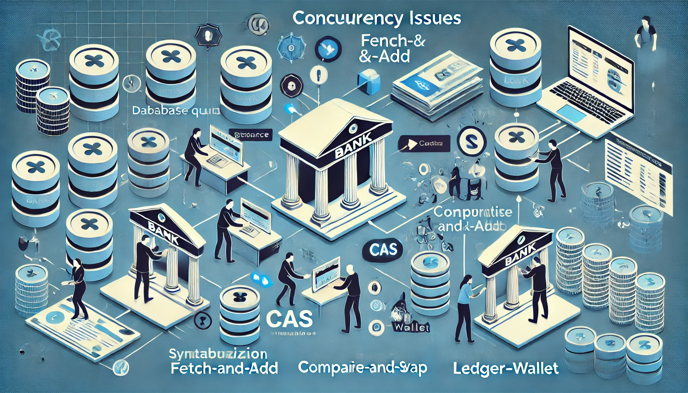
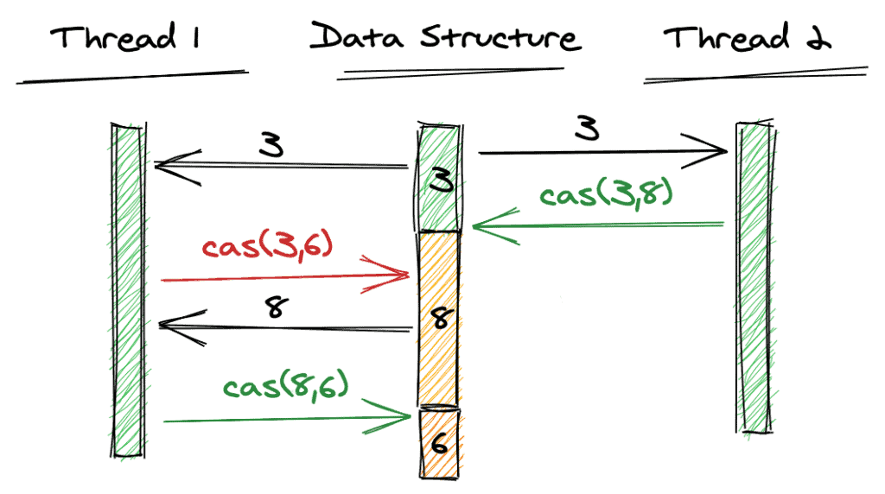
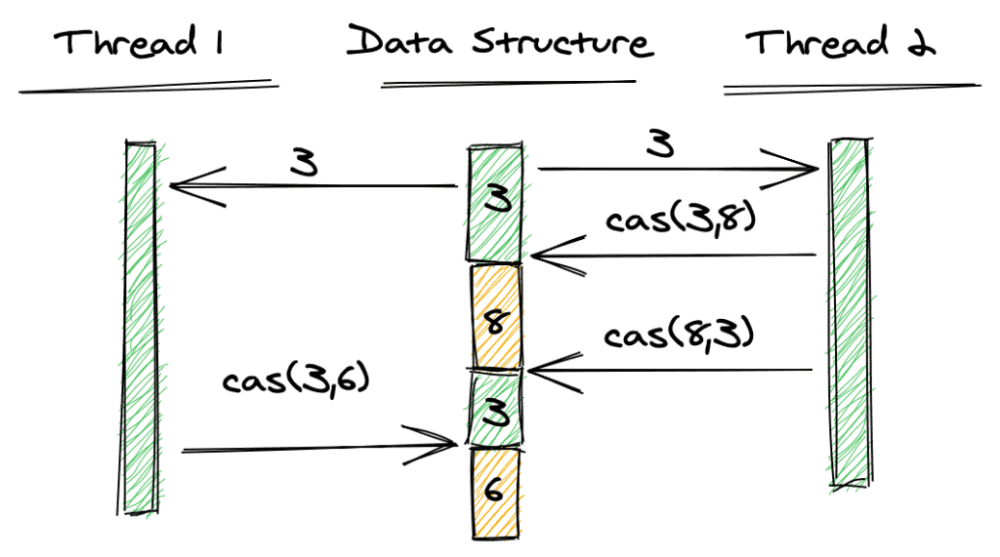

송금 시스템은 뭘까? 여러 사용자가 하나의 계좌에 입출금하는 것이 결국 송금 시스템이라고 볼 수 있지 않을까?

- 입금: DB에 금액을 조회하고, 조회된 금액을 더하고, DB에 저장한다.
- 출금: DB에 금액을 조회하고, 빼려는 금액보다 큰지 확인하고, 금액을 뺀 후 DB에 저장한다.

여러 사용자가 동시에 계좌를 조작하는 금융 시스템에서 동시성 문제를 해결하는 것은 필수적이다. 단일 스레드에서는 문제가 없지만, 멀티 스레드에서는 문제가 발생한다. 바로 동시성 문제 - race condition이다.

## 동시성 문제 - race condition

입금, 출금 모두 문제가 생긴다.

두 스레드가 동시에 계좌를 조회하면, 둘 다 같은 금액을 조회할 수 있다.
두 스레드는 같은 금액을 조회하고, 더하거나 빼고 DB에 저장한다면, 둘 중 마지막에 저장한 금액만 반영된다.

이런 자원의 경합 상태를 race condition이라고 한다.
결국 race condition을 해결하려면, 동시에 접근하지 않도록 해야 한다.
한번에 하나의 스레드만 일하게 해야한다는 것이다.

이를 해결하기 위해서는 동기화(synchronization)가 필요하다. 대표적인 방법으로 lock이 있다.

## Lock

자원에 lock을 걸어서, 다른 스레드가 자원에 접근하게 하지 못한다. 이 자원을 로직의 race condition을 발생시키는 임계영역에 둔다면, 스레드는 자원을 얻기 위해, lock의 구현 방식에 따라 대기하거나, 어떤 동시성 처리를 하게 된다.

비관적 락, 낙관적 락 등의 방법이 있다.

lock을 걸면 문제는 해결된다. 하지만 lock으로 인해 시스템은 성능 저하를 겪게 된다. 또한 비관적 락의 경우는 데드락 문제를 일으킬 수 있다.

### 데드락 문제

비관적 락은 자원을 사용하기 전에 미리 lock을 걸어두는 방식이다. lock이 걸린 자원은 스레드가 얻을 수 없다. 두 개 이상의 스레드가 동시에 자원을 사용할 수 없는 것이다. 자원을 사용하고자 하는 스레드는 lock이 풀릴때까지 기다려야 한다.

이를 배타적 자원(Exclusive Resources)이라고 하는데, 이런 자원을 사용하는 방식을 비관적 락(Pessmistic Lock)이라고 한다.

데드락은 두 개 이상의 스레드가 서로 상대방의 lock을 기다리는 상태로, 무한 대기 상태에 빠지는 것을 말한다. 이런 교착 상태에는 네 가지 조건, 상호 배제, 점유와 대기, 비선점, 순환 대기가 갖춰졌을 때 발생한다. Deadlock을 방지하기 위해 예방(Prevention), 회피(Avoidance), 검출(Detection) 전략으로 타임아웃 설정, 락 순서 정의, 데드락 감지 알고리즘 등의 기법을 활용할 수 있다. 이는 본 글의 주제와는 거리가 있으므로 자세히 다루지는 않겠다.

데드락 외에도 동기화에는 기아 상태(Starvation), 우선 순위 역전(Priority Inversion), 바쁜 대기(Busy Waiting) 등의 문제가 있다.

그럼 lock 없이 동시성 문제를 해결할 수 있는 방법은 무엇일까?
송금 시스템에 중요한 것은 무엇일까?

트랜잭션의 황금 전략에는 ACID가 있다. 원자성(Atomicity), 일관성(Consistency), 격리성(Isolation), 지속성(Durability)이다. 데이터 중심 애플리케이션 설계(Kleppmann, 2017)에서는 데이터베이스는 AID를 보장해준다고 했다. 일관성은 애플리케이션에서 보장해야 한다고 했다. (애플리케이션이 일관성을 달성하기 위해, 데이터베이스의 원자성과 격리성에 기댈 수 있다고는 했다.)

우리는 애플리케이션에서 트랜잭션의 일관성만 달성해주면 된다.

## 방안 1. fetch-and-add 연산

- AtomicInteger.incrementAndGet()
- AtomicInteger.addAndGet()

AtomicInteger 클래스는 fetch-and-add 연산을 제공한다. 이 연산은 변수에 값을 더하고, 그 값을 반환하는 연산이다. 이 연산은 원자적으로 실행된다.

```java
AtomicInteger balance = new AtomicInteger(100);
int deposit = 100;
int newBalance = balance.addAndGet(deposit);
```

일관성을 보장하기 위해 원자성에 의존한 방법이다.
애플리케이션 뿐만 아니라 DB에서도 이런 방법을 사용할 수 있다.
update를 select와 같이 하나의 쿼리로 원자적으로 처리한다.

```sql
UPDATE
    master
SET
    master.status = cust.status
FROM
    master m
INNER JOIN
    customer c
ON 
    m.id = c.id;
```

하지만 이 방법은 fetch-and-add 연산을 지원하는 변수에만 적용할 수 있다.
Fetch-and-Add는 개별 연산이 원자적이지만, 여러 필드를 함께 수정해야 하는 경우에는 적용할 수 없다.

## 방안 2. Compare-And-Swap 연산

CAS(Compare-And-Swap) 연산은 변수의 값을 비교하고, 값이 일치하면 새로운 값을 설정하는 연산이다. 이 연산은 원자적으로 실행된다. 이 원자성을 이용해 일관성을 보장한다.

```java
AtomicInteger balance = new AtomicInteger(100);
int deposit = 100;
int expected = balance.get();
int newBalance = expected + deposit;
while (!balance.compareAndSet(expected, newBalance)) {
    expected = balance.get();
    newBalance = expected + deposit;
} // 기아 상태에 주의
```



하지만 이 경우 ABA 문제가 발생할 수 있다.

### ABA 문제

ABA 문제란, 변수의 값이 A에서 B로 바뀌었다가 다시 A로 바뀌는 문제이다.
이 문제는 변수의 값이 바뀌었는지 확인하는 것이 아니라, 변수의 값이 A인지 확인하는 것이기 때문에 발생한다.



ABA 문제로 인해 기존 값이 예상한 값과 동일하지만, 사실상 의미가 다를 수 있다. 예를 들어, 잔액이 100 → 50 → 100으로 변한 경우에도 CAS 연산은 성공할 수 있다는 뜻이다. 이런 문제를 해결하기 위해 AtomicStampedReference 클래스를 사용할 수 있다. 이는 버전(stamp)이 적용된 사례이다.

### 버전(stamp)을 적용한 CAS

AtomicStampedReference 클래스는 변수의 값과 버전(stamp)을 저장한다. 이를 이용해 변수의 값이 바뀌었는지 확인할 수 있다.

```java
AtomicStampedReference<Integer> balance = new AtomicStampedReference<>(100, 0);
int deposit = 100;
int[] stampHolder = new int[1];
int expected = balance.get(stampHolder);
int newBalance = expected + deposit;
while (!balance.compareAndSet(expected, newBalance, stampHolder[0], stampHolder[0] + 1)) {
    expected = balance.get(stampHolder);
    newBalance = expected + deposit;
}
```

다만, 경쟁이 심한 환경에서는 CAS가 반복적으로 실패하여 성능이 저하될 수 있다.
경쟁이 심한 경우 CAS 연산이 반복적으로 실패할 수 있으며, 이 경우에는 Synchronized, StampedLock, 또는 Database에서의 Lock을 활용하는 것이 더 적절할 수도 있다.

## 방안 3. Ledger-Wallet 패턴

Ledger-Wallet 패턴은 멱등성을 보장하는 패턴이다. 멱등성(Idempotency)은 동일한 연산을 여러 번 적용해도 결과가 같다는 것이다.

AWS의 Quantum Ledger Database (QLDB)는 Wallet - Ledger 패턴 구조를 구현한다. Wallet은 사용자의 잔액을 저장하고, Ledger는 거래 내역을 저장한다. 거래 내역은 Wallet의 잔액을 변경하는 것이다. 이런 구조는 멱등성을 보장한다. 거래 내역을 여러 번 적용해도, Wallet의 잔액은 같다.

이 패턴은 멱등성을 보장하는 연산에 적합하다. 송금 시스템에서는 입금, 출금 연산이 멱등성을 보장한다. 입금, 출금 연산은 동일한 금액을 여러 번 적용해도, 동일한 결과를 보장하는 것이다.

```sql
INSERT INTO ledger (transaction_id, amount, type) 
VALUES ('tx_12345', 100, 'deposit') 
ON CONFLICT (transaction_id) DO NOTHING;
```

## 결론

| 접근법 | 장점 | 단점 | 사용 예시 |
|--------|------|------|----------|
| Fetch-and-Add | 간단한 원자적 연산 | 여러 필드 동시 수정 불가 | 단순한 카운터 증가 |
| CAS | Lock-Free, 성능 우수 | 경쟁 환경에서 실패 가능 | 낮은 경쟁 환경에서 계좌 잔액 업데이트 |
| Ledger-Wallet | 멱등성 보장, 트랜잭션 안정적 | 구현 복잡도 증가 | 금융 거래 기록 관리 |

Lock 없이 동시성을 보장하는 방법은 다양하다. fetch-and-add, CAS, 멱등성 패턴 등이 있다. 어떤 방법이 가장 적합한지는 상황에 따라 다르다.  fetch-and-add는 간략한 구현에 적합하다. CAS는 경쟁이 적은 환경에서 적합하다. 멱등성 패턴은 멱등성을 보장하는 연산이 필요하다.
