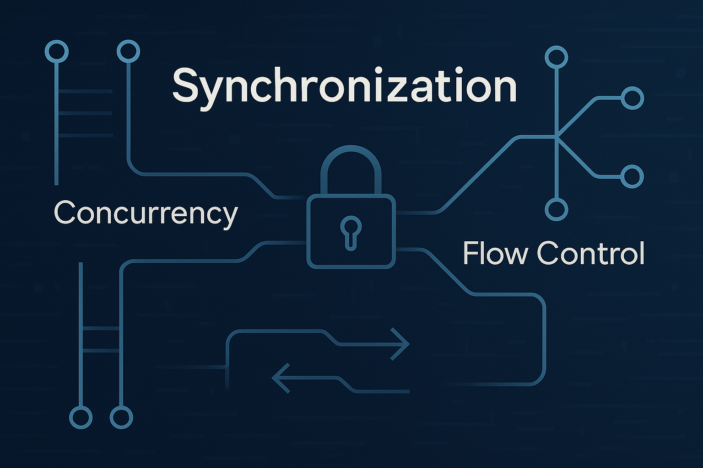
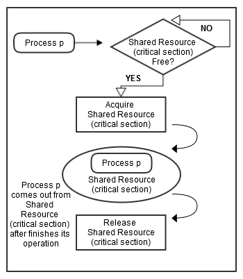
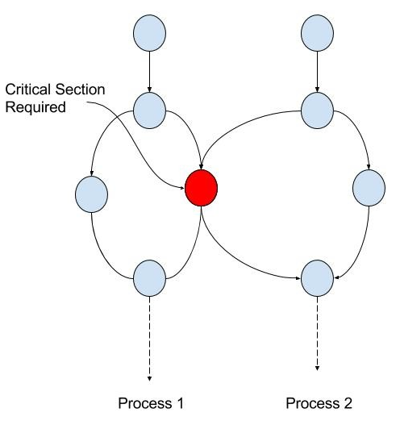
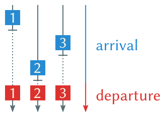
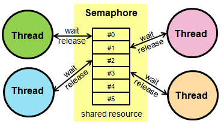
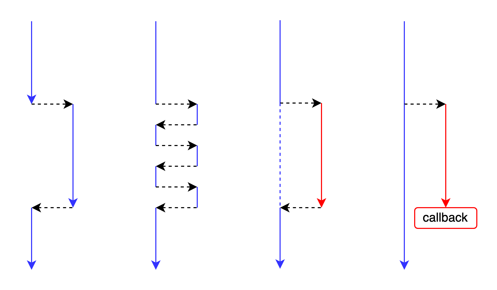

컴퓨터 과학에서 동시성(병행성, Concurrency)은 굉장히 중요하다. 병렬(Parallelism)하든 가상화(Virtualization)하든 작업 단위는 동시에 실행되는 것으로 보여야 성능의 이점을 누릴 수 있다. 하지만 그냥 동시에 처리하기만 하는 것이 사용자가 원하는 작업을 컴퓨터가 제대로 처리한다는 의미일까? 오케스트라를 생각해보자. 오케스트라는 여러 악기들이 동시에 연주한다. 하지만 지휘자 없이 그저 동시에 연주한다는 것이 음악일까? 동시성을 위해서 동기화가 필요하다. 동기화란 오케스트라의 지휘자와 같다. 동기화가 있어야 비로소 음악이 되고, 사용자의 기대대로 동작하는 소프트웨어가 된다.

다음을 차례대로 정리해보겠다.

- 동기화(Synchronization)
- 어셈블리어 레벨의 동기화
- 단일 시스템 레벨의 동기화
- 동기(Synchronous) vs 비동기(Asynchronous)
- 블로킹(Blocking) vs 논블로킹(Non-Blocking)
  
---

## 1. 동기화(Synchronization)

동기화는 **동시성(Concurrency) 환경에서의 실행 단위들의 타이밍 조율**이다.

> 동기화(Synchronization)란 **시스템이 조화를 이루어 작동하도록 이벤트를 조율하는 것**을 말합니다. 예를 들어, 오케스트라의 지휘자(conductor)는 오케스트라가 동기화(synchronized)되거나 **일정한 시간(in time)에 맞춰 연주하도록 조율**합니다. 모든 부분이 동기화되어 작동하는 시스템은 동기적(synchronous) 또는 "동기화된(in sync)" 상태라고 하며, 그렇지 않은 경우를 [비동기](https://en.wikipedia.org/wiki/Asynchronous_system "비동기 시스템")적(asynchronous)이라고 합니다. - [동기화](https://en.wikipedia.org/wiki/Synchronization)

컴퓨터 과학 관점에서 조금더 세부적으로 정의를 찾아보면 다음과 같다.

> 동기화는 합의에 도달하거나 특정 일련의 동작을 수행하기 위해 **여러 프로세스**(multiple process)가 특정 지점에서 결합(join up)하거나 핸드셰이크(handsake) 하도록 조정(coordinating)하는 작업입니다. - [동기화(컴퓨터 과학)](https://en.wikipedia.org/wiki/Synchronization_(computer_science))

다시 말해, 동기화란 **여러 실행 단위**(프로세스/스레드)가 **의도한 올바른 순서로 작업을 수행**하게 만드는 개념이다. 그렇다면 동기화는 어디에 필요할까? 먼저 동시성(Concurrency)이 무엇인지 알아야 한다. 

### 1.1. 동시성(Concurrency)

> 동시성은 시스템이 동시 실행 또는 시간 공유(time-sharing, 컨텍스트 전환(context switching)), 리소스 공유 및 상호 작용 관리를 통해 **여러 작업을 실행할 수 있는 능력**을 의미합니다. - [동시성(컴퓨터 과학)](https://en.wikipedia.org/wiki/Concurrency_(computer_science))

운영체제를 깊이 들여다보면, **가상화**(Virtualization)라는 중요한 개념이 등장한다. 실행 단위(프로세스 또는 스레드)는 결국 **CPU 코어 위에서 처리**되는데, 이 CPU 코어의 수는 **물리적으로 제한**되어 있다. 그런데 운영체제는 마치 **훨씬 더 많은 작업이 동시에 실행되고 있는 것처럼** 보이게 만든다. 이를 가능하게 하는 기술이 바로 **컨텍스트 전환**(Context Switching)이며, **스케줄링 알고리즘**을 통해 각 실행 단위에 CPU 사용 시간을 짧게 나눠주는 방식이다. 이 덕분에 단일 코어에서도 여러 작업이 동시에 실행되는 것처럼 보이고, 멀티코어 환경에서는 실제로 **여러 작업이 물리적으로 동시에 실행**되기도 한다. 진짜 중요한 점은, 운영체제는 단일 코어든 멀티코어든 **사용자 입장에서 ‘동시성’을 느끼게 한다는 것**이다.

이게 왜 동기화가 필요한 것일까? 여러 작업이 동시에 실행되면 어떤 일이 벌어질 수 있을까? **경합 상태**(Race Condition)을 일으킬 수 있다. 작업에 대해 믿고 기대한 결과가 망가진다. 일관성이 오염되는 것이다. 하드웨어 레벨로 보면 전기 신호가 오염되는 것이고, 운영체제 레벨로 보면 자원이 오염되는 것이고, 애플리케이션 레벨로 보면 비즈니스 로직과 데이터가 오염되는 것이다. 이런 문제를 방지하기 위해, 실행 흐름을 제어하는 동기화가 필요하다.

### 1.2. 동기화가 필요한 곳

동기화는 결국 동시성 환경에서 실행 단위들의 **동작 시점**(타이밍)에 대한 이야기다. 실행의 순서(**흐름**)를 정렬한다거나, 자원 획득을 기다리게 한다거나 하는 곳에 쓰이게 된다. 크게 분류해보면 같다.

- **흐름**의 동기화
  - 포크 - 조인 (Forks - Joins)
  - 생산자 - 소비자 (Producer - Consumer)
- **자원 획득**의 동기화
  - 배타적 자원 (Exclusive use resources)

#### 1.2.1. [포크 - 조인](https://en.wikipedia.org/wiki/Fork%E2%80%93join_model "포크-조인 모델") (Forks - Joins)

로직이 포크(Fork)와 조인(Join)의 형태를 갖춘다면 동기화가 필요하다. 

- **포크**(Fork): 하나의 작업을 다수의 하위 작업으로 분할하는 것
- **조인**(Join): 다수의 작업을 하나의 작업으로 합치는 것

작업이 **포크**된다는 것은 **다수의 하위 작업으로 분할한다는 것**이다. 모든 하위 작업이 끝날때까지 대기하여, 작업의 결과를 전부 조인하고, 이후 로직을 실행해야 할 것이다. 이때, 포크 이후의 **하위 작업들을 동시에 작업할 수도 있을 것**인데, 조인 이후의 처리를 위해서는 하위 작업들이 전부 처리될 때까지 **타이밍을 기다려야 할 것**이다.

#### 1.2.2. [생산자 - 소비자:](https://en.wikipedia.org/wiki/Producer%E2%80%93consumer_problem "생산자-소비자 문제") (Producer - Consumer)

로직이 생산자와 소비자로 분리되어 처리된다면 동기화가 필요하다,.

- **생산자**(Producer): 데이터를 만드는 주체
- **소비자**(Consumer): 데이터를 소비하는 주체

생산자-소비자 관계에서 소비자 프로세스는 필요한 데이터가 생성될 때까지 생산자 프로세스에 종속된다. **두 주체가 동시에 작업할 수도 있을 것**인데, 생산자가 데이터 생성할 때까지, 소비자는 **타이밍을 기다려야 할 것**이다.

#### 1.2.3. 배타적 자원 (Exclusive use resources)

흔히 동기화에 대해 이야기할 때, 동시성 이슈와 관련된 대표적인 동기화가 필요한 곳이다. 여러 실행 단위들이 특정 리소스에 의존하고 **해당 리소스에 접근할 경우**, 한 시점에 단 하나의 실행 단위 만이 해당 리소스에 접근해야 한다. 이때 **실행 단위들은 동시에 작업할 수도 있을 것** 인데, 자신의 차례가 올 때까지 **타이밍을 기다려야 할 것**이다.

세 가지 경우를 모두 분석해보았을 때, 각 작업들 자체를 직렬적인 작업으로 수행할 수도 있다. 하지만 운영체제와 시스템에 있어, 동시성을 사용하지 않는다는 것은 매우 비효율적이다. 운영체제는 가상화를 통해 한정적인 CPU를 무한하게 보이도록 설계되었다. 한번에 여러 작업을 동시에 수행하는 것 처럼 보이도록 설계되어, 작업의 효율성을 높였다. 이런 주어진 자원을 사용하지 않을 이유가 없다. **동시성을 사용하되, 동기화를 통해 시스템의 일관성을 달성하는 것이 소프트웨어 엔지니어링의 목표**일 것이다.

---

## 2. 어셈블리어 레벨의 동기화

어셈블리어 레벨에서 동기화는 **원자적 연산**(Atomic Operation)으로 구현한다. 이를 CAS라고 한다.

- **CAS** (Compare-And-Swap): 데이터 변경 시점에 데이터 비교를 확인하여, 일치하면 교체한다.

CAS는 일종의 **낙관적 동시성 제어(optimistic concurrency control)** 방식으로 다음과 같이 동작된다.

1. **메모리 주소 A에 저장된 값(oldValue)** 을 읽는다.
2. 해당 값이 기대하는 값(expectedValue)인지 확인한다.
3. 일치하면 새로운 값(newValue)으로 **원자적으로 교체**한다.
4. 결과적으로 성공 여부를 반환한다 (`true` / `false`). 필요에 따라 반복 처리한다.

아키텍처에 따라 구현 방법이 달라지는데,

- **x86**: `CMPXCHG`
- **ARM**: `LDREX` / `STREX` 조합

x86의 `CMPXCHG`은 단일 명령어로 CAS로 동작된다. ARM은 단일 명령어가 없다. 여러 명령어 조합을 통해 CAS를 구현한다. (ARMv8-A 부터는 `CAS`가 생기긴 했다.)

### 2.1. `LDREX` / `STREX` 조합

```assembly
loop:
    LDREX   r1, [addr]     ; addr의 값을 읽고 r1에 저장, exclusive로 마크
    ...                    ; 값 수정 로직 수행 (예: r1 = r1 + 1)
    STREX   r2, r1, [addr] ; addr에 r1 값을 쓰기 시도, 결과를 r2에 저장
    CMP     r2, #0         ; r2 == 0 이면 성공
    BNE     loop           ; 실패하면 다시 시도
```

#### 2.1.1. `LDREX` (Load Exclusive)

- 메모리의 값을 **읽어오며**, 해당 주소를 **exclusive monitor**에 등록
- exclusive 상태는 이후 `STREX` 명령어가 쓰기 시도할 때 **다른 프로세서가 그 주소를 건드리지 않았는지 확인**하는 데 사용한다.

#### 2.1.2. `STREX` (Store Exclusive)

- 지정된 주소에 값을 **쓰기 시도**
- exclusive monitor에 등록된 정보와 비교하고, 그 사이 다른 실행 단위가 그 메모리를 변경했다면 실패한다.
- 인터럽트나 컨텍스트 스위치가 일어나면 exclusive monitor가 리셋될 수 있기 때문에, 반드시 `STREX` 결과를 체크하고, 실패 시 재시도 루프가 필요하다.

---

## 3. 단일 시스템 레벨의 동기화

시스템 레벨에서의 동기화 또한 실행 단위들이 **특정 지점**에서 **일관성** 있는 실행 흐름을 유지하도록 제어하는 것으로 구현된다. 이는 두 가지 방식으로 이루어진다.

- 작업 단위 간의 실행 시점을 맞춤 (sync point)
- 공유 자원에 대한 접근을 조정 (critical section)

공유 자원 보호가 필요한 경우, 이 보호 영역을 **임계 영역**이라고 한다. 임계 영역은 한 번에 두 개 이상의 실행 단위(프로세스나 스레드)가 들어갈 수 없으며, 다른 실행 단위는 선행 실행 단위가 임계 영역을 벗어날 때까지 대기한다.



이런 동기화 지점은 다음과 같은 방법으로 구현된다.

1. **스핀락(Spinlock)** – 임계 영역 보호를 위한 락 기반 메커니즘
2. **배리어(Barrier)** – 실행 단위 간의 타이밍 동기화를 위한 동기화 지점
3. **세마포어(Semaphore)** – 공유 자원 접근 수 제어 또는 동기 조건 조율

#### 3.1. 스핀락(Spinlock)

실행 단위가 락을 획득 가능할 때까지 루프("스핀")에서 대기하며 반복적으로 확인한다. 일반적으로 **활성 상태를 유지**하기 때문에, **일종의 바쁜 대기**(busy waiting)에 해당한다. 대신, 스핀락은 **운영 체제의 프로세스 재스케줄링이나 컨텍스트 전환으로 인한 오버헤드를 피할 수 있다.** 스레드가 짧은 시간 동안만 차단될 때 효율적이다.



#### 3.2. 배리어(Barrier)

모든 실행 단위들이 이 동기화 지점에서 중지되며, 모든 실행 단위들이 이 지점에 도달할 때까지 대기시킨다. 예로 **래치**(latch, 걸쇠)가 있다. **대기에 대한 플래그**를 래치라고 하며 상승(raised, 막힘)/하강(lowered, 열림) 두 상태가 있다. Count-down Latch로 자주 쓰이며, 0 값이 되었을 때 래치는 하강 상태가 된다.



#### 3.3. 세마포어(Semaphore)

**자원 접근 가능 개수나 동기 조건을 제어하는 동기화 도구**로, 진입 가능한 한도를 정의하고, 진입 가능 여부를 획득되거나 반환한다. 필요한 경우 진입이 가능해질 때까지 기다린다.



---

## 4. 동기/비동기, 블로킹/논블로킹

프로그램을 설계하다보면 동기/비동기와 블로킹/논블로킹에 대해 고려하게 된다. 이런 동작 방식은 하위 루틴 호출과 처리 흐름의 시간적 제어에 적절한 동기화 적용으로 구현된다. (동기화의 본질은 '**동시성 환경에서 실행 흐름 제어**'이며, 단지 `Lock` 사용만을 이야기하지 않는다.)

- “여러 작업이 수행 되는데, 어떻게 지휘할까?” → 동기화
- “**호출**한 하위 루틴, 내 루틴과 **같이** 처리할까 **독립**적으로 처리할까?” → 동기/비동기
- “루틴 진행중에 '**대기**'를 만났는데, 대기를 **기다릴까** **반환할까**?” → 블로킹/논블로킹

### 4.1. 동기(Synchronous) vs 비동기(Asynchronous)

**애플리케이션 레벨**에서 동기와 비동기를 각각 한문장으로 정리하면 다음과 같다.

- **동기**(Synchronous): 요청하면 처리하고 알려줌.
	- 요청 → 처리 → 결과가 확정되기 전까지 다음 단계 X
- **비동기**(Asynchronous): 요청하면 처리하겠다고 알려주고, 처리함.
	- 요청 → 바로 응답 → 실제 처리와 결과 확정은 나중에
	- “ok, 알았어 이건 내가 알아서 할게”

뭔가 이렇게 봤을때 동기와 비동기에 대해 이렇게 정의해 볼 수 있을 것 같다.

- **동기**는 로직의 **흐름 자체가 차례로 이어지는 구조**
- **비동기**는 로직의 **흐름을 기다리지 않고 갈라지는 구조**

**동기는 ‘단일된 흐름’이고, 비동기는 ‘독립된 흐름’이다.** (데이터 일관성에서의 독립이 아니다!)

또한 동기와 비동기는 블로킹/논블로킹과 같이 이야기 되어야 한다.

### 4.2. 블로킹(Blocking) vs 논블로킹(Non-Blocking)

먼저 동기/비동기와 블로킹/논블로킹을 간단히 비교하면 다음과 같다.

- **동기/비동기**는 호출에 대해 **응답하는 방식**이다. 
- **블로킹/논블로킹**은 루틴의 처리에서 **대기 상황에 대한 대응 방식**이다. 

**대기**란 **결과를 기다리는 동안 작업 단위가 아무것도 못하고 멈추는 상태**를 의미한다. 다음의 경우를 보통 대기라고 본다.

- I/O 대기. 데이터 올 때까지 멈춤 (디스크 읽기, 네트워크 응답, 파일 쓰기 등)
- 다른 쓰레드가 끝날 때까지 대기 (`Thread.join()`)
- 락 획득, 다른 작업 단위가 잡고 있으면 대기
- 조건 만족될 때까지 대기 (`sleep(5)` 호출)

I/O건 CPU건, 쓰레드건 상관없다. 중요한건 그것을 대기 상태라고 정의했는가 이다. 그리고 이런 대기 방식에 대해 블로킹/논블로킹이 적용된다.

- **블로킹**(Blocking): 루틴이 끝나서 결과 나올 때까지 기다린다. 그동안 작업 단위는 다른 일을 하지 않는다.
- **논블로킹**(Non-Blocking): 루틴이 대기를 만나는 시점에 바로 반환한다. 작업 단위는 반환되어 다른 일을 한다.

### 4.3. 조합

동기/비동기와 블로킹/논블로킹을 조합해보면 다음과 같다.

- 동기(Synchronous) + 블로킹(Blocking)
	- 호출한 함수의 결과를 기다리며, 그 동안 다른 작업을 수행하지 않는다.
- 동기(Synchronous) + 논블로킹(Non-Blocking)
	- 호출한 함수의 결과가 준비되지 않았다면 즉시 반환하고, 호출자가 반복적으로 상태를 확인하며 기다린다. (polling)
- 비동기(Asynchronous) + 블로킹(Blocking)
	- 작업을 비동기로 시작하지만, 결과를 얻기 위해 호출자가 대기한다.
	- ex. Java에서 `CompletableFuture.get()`을 호출하면, 결과가 준비될 때까지 현재 스레드를 블로킹한다.
- 비동기(Asynchronous) + 논블로킹(Non-Blocking)
	- 작업을 비동기로 시작하고, 결과를 기다리지 않으며, 완료 시 콜백 등을 통해 결과를 처리한다. 
	- ex. JavaScript의 `fetch()` 함수는 데이터를 요청한 후, Promise를 반환하고, `then()`을 사용하여 결과를 처리한다.



---

동기화는 **동시성이 적용되는 소프트웨어**가 효율성과 일관성을 모두 달성하기 위해 반드시 고려해야 할 과제다. 이 개념은 어셈블리, 운영체제, 애플리케이션까지 **전 계층을 관통**하며 나타난다. 동기화는 **일관성, 성능, 사용자 경험** 사이의 균형에 대한 고민이다.

단일 시스템 뿐만 아니라, 다중 시스템으로 이루어진 **분산 시스템과 MSA도 동시성 환경**이다. 마찬가지로 여기서도 동기화를 필요로 한다. 특히 마이크로서비스 아키텍처는 네트워크 지연, 서비스 장애, 데이터 정합성 문제 등을 다루기 위해 **서비스 간 동기화**, 즉 **분산 트랜잭션**을 고민하게 된다. 이를 해결하기 위한 대표적인 접근이 **사가(Saga) 패턴**이다. 이 부분은 차후 **마이크로서비스** 아키텍처에 대한 전반적인 정리를 통해 다루겠다.
