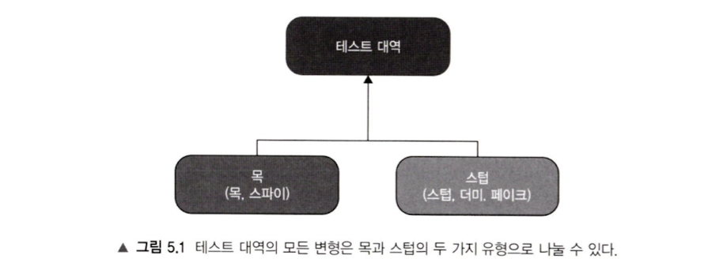
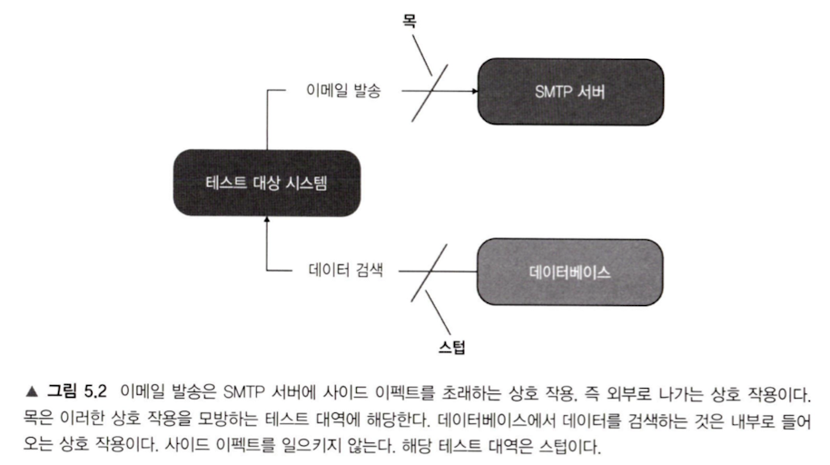
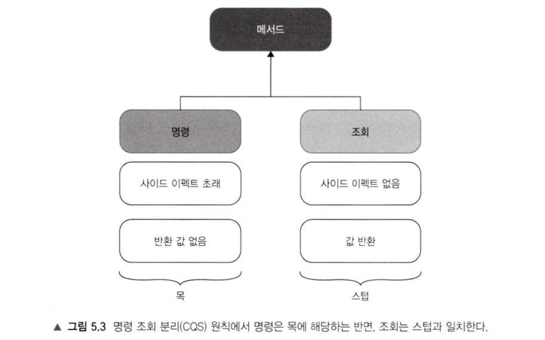

테스트가 중요하다는 것은 이제 누구나 아는 사실일 것이다. 테스트 작성에 있어서 빼놓을 수 없는 것이 **테스트 더블**(Test double)이다.

> 테스트 더블은 소프트웨어 테스트 자동화에 사용되는 소프트웨어로, 테스트가 운영 코드에 의존하지 않도록 종속성을 충족합니다 . 테스트 더블은 테스트 대상 소프트웨어가 운영 코드와 구분할 수 없는 인터페이스를 통해 기능을 제공합니다. 프로그래머는 일반적으로 테스트 더블을 사용하여 소비 코드의 동작을 나머지 코드베이스에서 분리합니다. 테스트 더블은 일반적으로 프로덕션 코드의 단순화된 버전이며 테스트에 특화된 기능을 포함할 수 있습니다. 테스트 더블은 테스트 하네스를 만드는데 사용됩니다. - [테스트 더블](https://en.wikipedia.org/wiki/Test_double)

테스트 더블은 **의존성에 대한 대역**으로써, 테스트의 범위를 좁히고 경량화하는 것을 목적으로 한다. 다양한 언어에서 테스트 작성을 도와주는 여러 테스트 더블 프레임워크들이 있다. 이들은 객체를 모킹해준다. 이때 어떤 기능을 제공하는지, 테스트 더블에 대한 정리를 통해 자세히 알아보겠다.

---

> 제라드 메스자로스(Gerard Meszaros)에 따르면, 테스트 대역에는 더미(dummy), 스텁(stub), 스파이(spy), 목(mock), 페이크(fake)라는 다섯 가지가 있다. 여러 가지 유형에 겁먹을 수 있지만, 실제로는 목과 스텁의 두 가지 유형으로 나눌 수 있다. - 단위 테스트(블라디미르 코리코프, 2020)



코리코프는 테스트 더블은 결국 두 가지로 나눈다고 했다. 왜 목과 스텁 두 가지일까? 

## Mock vs Stub

단위 테스트(블라디미르 코리코프, 2020)에서 코리코프는 목과 스텁에 대해 이렇게 설명한다.

> - 목은 외부로 **나가는 상호 작용**을 모방하고 검사하는 데 도움이 된다. 이러한 상호 작용은 SUT(테스트 대상 시스템)가 **상태를 변경하기 위한 의존성을 호출**하는 것에 해당한다.
> - 스텁은 내부로 **들어오는 상호 작용**을 모방하는 데 도움이 된다. 이러한 상호 작용은 SUT가 **입력 데이터를 얻기 위한 의존성을 호출**하는 것에 해당한다.



- 목과 스텁 모두 **상호 작용하는 의존성에 대한 대역**이 된다는 것이 공통점이라면, 
- 목은 **검증**을 목표로 하고, 
- 스텁은 **모방**하는데 목표를 둔다는 차이점을 갖는다. 

이제 제라드 메스자로스가 분류한 테스트 더블에 대해서 살펴보겠다.

---

## 테스트 더블의 분류

각각의 목표는 다음과 같다.

- 스텁: **모방**이 목적
	- **더미**(dummy): SUT에 대한 **인터페이스 요구사항을 만족**시키기 위한 모방이 목표
	- **스텁**(stub): 상호작용에 대해 **정적인 값 제공**하는 모방이 목표
	- **페이크**(fake): **테스트에 적합한 일반적인 구현체 역할** 모방이 목표
- 목: **검증**이 목적
	- **목**(mock): 상호작용에서 **기대하는 동작의 수행 검증**이 목표
	- **스파이**(spy): 상호작용에서 **메서드 호출과 전달되는 인자 값 검증**이 목표

### 더미 (dummy)

더미는 테스트하는 **인터페이스의 요구사항만 만족**시키기 위한 대역이다. 즉, 테스트 로직에서 사용하지 않지만, 테스트하는 인터페이스의 매개변수로 **형식상** 채워넣어야 할 때 사용한다. 때문에 검증도 행동도 아무것도 구현하지 않아도 된다.

```java
new Service().execute(new DummyUser()); // User는 필요하지만 테스트와 무관
```

### 스텁 (stub)

테스트 로직에서 대역의 메서드가 호출됐을 때, **미리 정해진 값을 반환**해준다. **예측 가능한 결과를 제공**해 테스트를 안정화하는 것을 목적으로 한다.

```java
when(api.call()).thenReturn("stubbed-result");
```

### 페이크 (fake)

실제 구현을 대체할 수 있을 정도로 작동하지만, **테스트에 더 적합한** 구현체이다. 실제 사용에 가까운 환경에서 **전체 흐름을 테스트**할 때 유용하다. (ex. 데이터베이스 서버 대신 인메모리 데이터베이스나 테스트 컨테이너)

```java
// 실제 DB 대신 테스트용 H2를 사용
DataSource ds = new H2InMemoryDataSource();
```

### 목 (mock)

**기대되는 동작(Expectation)을 정의하고, 그 동작을 검증**해준다. 특정 메서드가 반드시 몇 번 호출되었는지 확인하는 등의 동작의 검증이 필요할 때 사용한다.

```java
verify(service, times(1)).sendNotification();
```

### 스파이 (spy)

**메서드 호출과 전달된 인자 값을 검증**해준다. 보통 실 구현에 가깝고, **행동 + 기록**에 초점을 둔다.

```java
verify(service).sendEmail("test@example.com");
```

Mockito는 `@Spy`를 사용하거나 `spy()`로 래핑하여 실 객체 감시한다.

---

## 안티 패턴

스텁과 목은 오용해선 안된다. (여기서 말하는 목이란, Mockist의 Mock 클래스를 의미하지 않는다)

> 테스트에서 거짓 양성을 피하고 리팩터링 내성을 향상시키는 방법은 구현 세부 사항이 아니라 최종 결과(이상적으로 비개발자들에게 의미가 있어야 함)를 검증하는 것 뿐이다.

테스트 스위트의 목적이 최종 결과적으로 검증을 목적으로 사용한다면 목을 사용하는 것이 옳다. 하지만 스텁의 호출을 검증하는 것은 전혀 결과가 아니다. 깨지기 쉬운 테스트를 만들게 된다.

```java
@Test
void 사용자_수를_포함하는_리포트를_생성한다() {
	UserRepository stub = mock(UserRepository.class);
	// stub 구현
	when(stub.getNumberOfUsers()).thenReturn(10);  
	ReportService sut = new ReportService(stub);

	Report report = sut.createReport();

	assertEquals(10, report.getNumberOfUsers());
	// stub을 mock으로써 상호 작용을 검증하는 행위
	verify(stub, times(1)).getNumberOfUsers(); 
}
```

이런 형태를 **과잉 명세**(overspecification)라고 한다. 테스트가 구현이 아닌 스텁을 검증하는 것이다. 이런 테스트는 구현이 테스트에 종속되게 만든다.

그렇다면 목과 스텁은 같이 사용하면 안되는 것일까? 목과 스텁은 함께 써도 된다. 여기서 CQS의 필요성이 나타난다.

### CQS

> 목과 스텁의 개념은 명령 조회 분리(CQS, Command Query Seperation) 원칙과 관련이 있다. CQS 원칙에 따르면 **모든 메서드는 명령이거나 조회여야 하며, 이 둘을 혼용해서는 안 된다.**



테스트 대역이 메서드 호출에 대해 조회와 명령을 분리한다.

- 테스트의 조회는 가져오는 데이터의 안정성(기대)이 목적이다. -> 스텁을 이용해 모방한다.
- 테스트의 명령은 상태의 변경이 목적이다. -> 목을 이용해 검증한다.

```java
@Test
void 재고가_부족하면_구매에_실패하고_재고_제거를_수행하지_않는다() {
	Store storeMock = mock(Store.class);
	// 스텁은 조회를 목적으로 한다.
	when(storeMock.hasEnoughInventory(Product.SHAMPOO, 5)).thenReturn(false);
	Customer sut = new Customer();

	boolean success = sut.purchase(storeMock, Product.SHAMPOO, 5);

	assertFalse(success);
	// 스텁을 검증하는 것이 아니다. 명령을 검증한다.
	verify(storeMock, never()).removeInventory(Product.SHAMPOO, 5);
}
```

CQS 원칙에 따라, 메서드가 사이드 이펙트를 일으키면 해당 메서드의 반환 타입이 void여야 한다. 만약 메서드가 값을 반환하면 사이드 이펙트가 없어야 한다. 멱등성이 지켜져야 한다.

---

테스트 더블의 기본 개념부터 각 유형의 목적, 그리고 사용 시 주의할 점까지 정리했다. 테스트 더블은 의도를 유려하게 표현할 수 있도록 도와주는 중요한 도구다. 테스트 더블 없이는 의존성 분리에 많은 에너지를 쏟아야 하고, 그렇다고 의도를 벗어난 오용은 테스트 코드의 본질을 잃게 한다. 

정리한 것을 항상 리마인드하자, 나중에 내가 짠 테스트 코드를 내가 욕하지 않는다면 성공일 것이다.

[전반적인 테스트](https://iol-lshh.github.io/회고/test/테스트_정리/)에 이어 테스트 더블에 대해 정리해봤으니, 다음은 테스트 작성 장인들이 소개한 멋진 테스트 패턴들을 정리해볼 예정이다. 재밌겠다.
