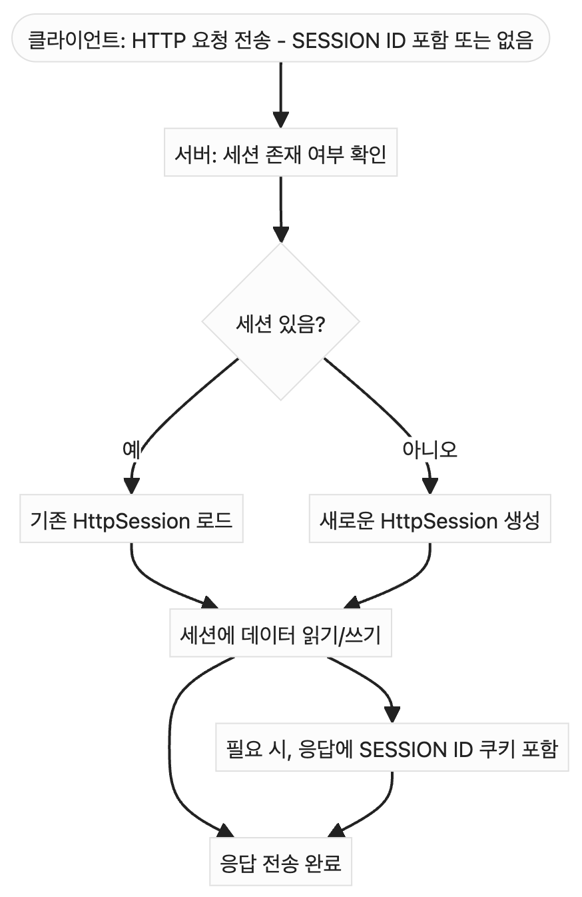
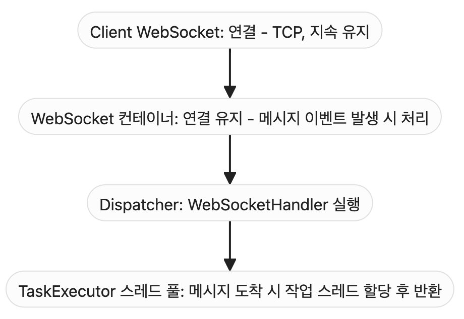
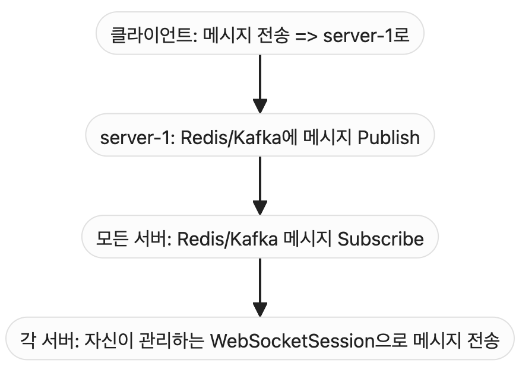

웹 소켓 구현은 꽤나 챌린지가 필요한 부분이다. 구현하고 나서도 오래되면 까먹기도 하고, 헷갈리기 쉽다. 그래서 웹 소켓을 구현하기 위해 알아야 할 것들에 대해 정리해보고, 분산 환경에서 웹소켓은 어떻게 구현해야 하는지에 대해 정리했다.

## WebSocket

WebSocket은 내부적으로 TCP 소켓을 사용한다. 클라이언트가 WebSocket 연결을 맺으면 **서버는 새로운 소켓 하나를 열고, 이 소켓에 파일디스크립터를 하나 할당한다.**

- **파일 디스크립터(File Descriptor, FD)**: 운영체제가 열려 있는 "파일, 소켓, 파이프 등 리소스"를 식별하기 위해 부여하는 번호(ID). FD는 커널 공간에서 관리된다.

| 메모리 영역              | 설명                   |
| ------------------- | -------------------- |
| 사용자 공간(User Space)  | 일반 애플리케이션이 사용하는 공간   |
| 커널 공간(Kernel Space) | 운영체제가 사용하는 특권 메모리 공간 |

FD가 사용되는 곳을 살펴보면 다음과 같다.

| 리소스 종류     | 예시                              |
| ---------- | ------------------------------- |
| 일반 파일      | 로그 파일, 설정 파일, 데이터 파일 등          |
| 디렉토리       | `/etc/`, `/usr/local/bin` 등     |
| 소켓(Socket) | **TCP 연결** (예: WebSocket, HTTP) |
| 파이프(pipe)  | 프로세스 간 통신                       |
| 터미널        | stdin, stdout, stderr           |

TCP하면 HTTP를 빼놓을 수 없다.

- **HTTP**: 기본적으로 Stateless(무상태) 프로토콜

HTTP로 제공되는 서비스는 클라이언트 상태에 대해 연속성을 요구하기도 한다. 그것을 세션이라고 한다.

- **세션**(Session): 클라이언트와 서버 간의 상태를 유지하기 위한 서버 측 저장 공간

| 개념          | 설명                           |
| ----------- | ---------------------------- |
| 세션 ID       | 클라이언트를 구분하기 위한 고유 키          |
| 세션 스토리지     | 서버가 세션 ID에 대응되는 데이터를 저장하는 공간 |
| 클라이언트 상태 저장 | 로그인 여부, 장바구니, 임시 정보 등 저장 가능  |

---

HTTP 세션과 웹소켓은 비슷하면서도 다르다. 스프링의 `WebSocketSession`, `HttpSession` 두 개의 세부 구현의 비교를 통해, 웹소켓의 동작 방식에 대해 이해해보자.

## `WebSocketSession` vs `HttpSession`

두 가지 모두 상태를 유지한다는 점에서 동일하다. 하지만 실제 동작에는 차이가 있다. HTTP 세션은 상태를 유지할 뿐이다. 웹소켓 세션은 상태를 유지할 뿐만 아니라, 논리적 연결을 유지하기까지 한다.

### `HttpSession`

HTTP 요청 기반으로 동작. 요청(request)마다 세션 ID가 쿠키(JSESSIONID 등)를 통해 전달되고, 세션 저장소에서 데이터를 읽고 쓰며, 기본적으로는 서버에 캐시처럼 보관한다.

HTTP는 **무상태(stateless)** 프로토콜이기 때문에 클라이언트와 서버 간의 연결 상태를 유지하지 않는다. 요청이 들어오면 다음과 같이 동작된다.

- HttpSession 객체를 서버 측 세션 저장소에 유지하며, 클라이언트가 요청할 때 전달된 세션 ID(`JSESSIONID`)를 통해 해당 세션 객체를 로드할 수 있다.
- HttpSession은 특정 요청(request)이 들어왔을 때만 스레드에 연결한다.
- 요청 처리가 끝나면 HttpSession은 더 이상 스레드에 연결되지 않고, 세션 저장소에 다시 캐싱(보관)된 상태로 유지한다.

### `WebSocketSession`

WebSocket은 HTTP 프로토콜과는 별개로 동작하며, TCP 커넥션 기반으로 **논리적 연결**을 유지한다. WebSocket은 HTTP 프로토콜을 통해 초기 핸드쉐이크를 수행한 후, TCP 기반의 양방향 통신으로 전환된다.

스프링의 `WebSocketSession`은, 연결된 동안 서버와 클라이언트가 지속적으로 **논리적 연결**이 유지된다. 다만, 이 연결은 스레드를 계속 점유하진 않는다. TCP 소켓(FD)만 유지된 채, 스레드를 반환한다. (플럭스도 비슷하다.)

Spring WebSocket은 연결된 소켓에 메시지가 도착하면, 컨테이너에서 관리하는 스레드 풀에서 사용 가능한 스레드를 할당해 메시지를 처리한다.

| 항목                 | 유지 방법         | 자원 소모                   | 풀 사용 여부       |
| ------------------ | ------------- | ----------------------- | ------------- |
| WebSocket 연결 (TCP) | 클라이언트별 유지     | 파일 디스크립터(FD), 메모리 (소량)  | 별도 풀 없음       |
| 작업 스레드             | 요청 시에만 풀에서 할당 | CPU, 메모리 (작업 처리에 따라 다름) | 스레드 풀 사용      |
| 커넥션 풀              | 재사용 목적의 연결 관리 | DB, HTTP 클라이언트에서 사용     | WebSocket과 무관 |

---

HTTP 세션을 분산환경에서 구현하는 방법에 대해 기억해보면, 레디스를 도입하거나 별도 서비스를 구현하거나 해야한다. **서버 간 상태 동기화**가 필요한 것이다.

HttpSession은 서버 인스턴스(톰캣 등)에 종속된다. 때문에 Sticky Session이 필요하다.

- **Sticky Session**(Session Affinity): 클라이언트의 모든 요청을 항상 동일한 서버 인스턴스로 보내도록 로드밸런서가 고정시키는 전략

하지만 여기서 본래 HttpSession을 대신하여 "**클라이언트의 상태를 유지하면서, 서버 간 상태를 동기화한다**"라는 본래 의도에 집중하면 다음처럼 구현이 가능하다.

- **중앙 세션 저장소** (Centralized Session Store): 세션 정보를 Redis 같은 외부 저장소에 저장해서, 모든 서버가 세션을 공유
- **토큰 기반 인증** (Token-Based Authentication) + Stateless 세션: 세션을 서버에 저장하지 않고, **사용자에게 상태를 담은 토큰(JWT 등)을 발급**해서 클라이언트가 들고 다님

이런 구현은 일부 서버가 정지되더라도 클라이언트 상태가 전체 시스템 상에서 유지되도록 한다.

하지만 웹 소켓은 이런 방법들과 유사하면서도 다르게 해결해야한다. 웹 소켓은 서버 인스턴스에서 클라이언트와 연결을 유지하고 있는데, 그것의 본질은 TCP 소켓이고, FD이다. 이것은 서버의 커널 공간에서 관리되기 때문이다.

## 분산 환경에서의 WebSocket

웹 소켓을 분산환경에서 사용하기 위해선 웹소켓 세션이 만들어진 서버를 찾아가야 한다. 이를 위한 방안은 크게 세 가지가 있다.

- 세션 고정 (Sticky Session)
- 세션 정보 공유
- 메세지 브로커 사용

### 세션 고정

LB나 WebSocket Gateway / Message Router 같은 API Gateway를 이용한다. 요청 시점에 웹 소켓 세션이 있는 서버로 라우팅하는 것이다.

### 세션 정보 공유

단순히 세션 정보를 제공한다. 세션 정보는 세션이 붙어있는 서버 정보를 보여준다. 이때 세션 정보 테이블을 각 서버가 실시간으로 공유해야 한다. 그 방법이 영속성을 조회한다던지(레디스든 디비든), 서비스로 운영한다던지, 어떤 방법이든 상관 없다.

### 메세지 브로커 사용

메시지를 분산 서비스가 볼 수 있는 곳으로 발행한다. 발행된 메시지는 모든 서버가 바라보고 있으며, 메시지가 자신이 관리하는 세션이라면, 이를 받아와 WebSocketSession을 이용해 스레드가 일하게 하고 메시지를 발송하게 된다. 

(카프카를 메시지 브로커로 활용하더라도 카프카는 유량 조절과 비동기적 실시간 전달에 유리하므로 활용하고, 데이터 자체는 디비에 넣도록 한다.)

세가지 방안 모두 결론적으로, 웹소켓 세션이 만들어진 서버를 찾아가야 한다. 다만, 실제 구현에서는 찾아가는 부담을 줄여야하며, 아예 없어보이는 방향으로 설계하는 것이 바람직할 것이다.

참고로, 서버가 죽거나 어쨌든 웹소켓이 끊긴 것을 클라이언트가 알게 된다면, 클라이언트에서 다시 웹소켓을 연결해야한다. WebSocketSession은 복원 불가해도, 사용자 상태는 복원 가능하니깐 문제없다. 물론 재연결 후 사용자 경험을 이어가기 위해서는 추가 설계가 필요할 것이다.

추가적으로 여기에 이벤트 소싱을 같이 생각해 볼 수도 있겠다. (채팅 서비스라던지..?)

---

## ❗️FD 이슈

TCP 소켓은 FD를 할당받는다. 웹소켓은 유지된다. 만약 하나의 서버에 웹소켓으로 구현된 채팅이 어마어마한 수가 연결되고 유지된다면 어떻게 할까?

- 각 WebSocket 연결 = 하나의 TCP 소켓 = 하나의 FD 소모
- 예를 들어, 1만 명의 유저가 접속하면 **최소 1만 개의 FD가 소모**됨
- 여기에 로그 파일, 데이터베이스 연결 등도 FD를 추가로 차지

FD가 꽉 차면

- 새로운 클라이언트 연결을 수락할 수 없음 (→ WebSocket handshake 실패)
- 파일이나 소켓을 열 수 없어서 서비스 전체에 장애 발생 가능
- `java.io.IOException: Too many open files`

이를 해결하기 위한 방안은 다음과 같다.

- OS 레벨에서 FD 수 늘린다.
- 한 서버에 모든 연결을 몰지 않고, **서버 인스턴스를 여러 대로 분산**하여 각 서버가 일부만 처리하게 한다.
- 웹소켓의 커넥션 유지 시간 조절, 타임아웃 적용한다.
- FD 모니터링도 추가하면 좋다.
