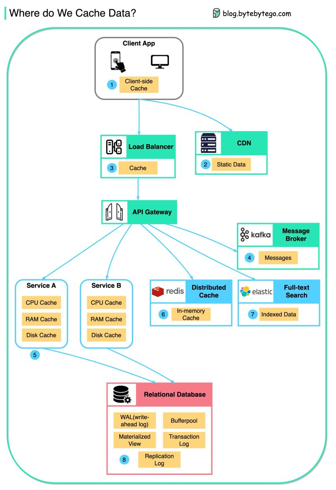

- 이 다이어그램은 일반적인 아키텍처에서 데이터가 캐싱되는 위치를 설명합니다. 데이터는 **여러 계층**에 걸쳐 캐싱됩니다.

---

## 1. **클라이언트 애플리케이션**

- HTTP 응답은 브라우저에서 캐싱될 수 있습니다.
- **흐름**:
  1. 처음 데이터 요청 시, HTTP를 통해 데이터를 요청.
  2. HTTP 헤더에 만료 정책과 함께 데이터가 반환.
  3. 이후 요청은 브라우저 캐시에서 데이터를 먼저 검색.

## 2. **CDN**

- CDN은 정적 웹 리소스를 캐싱합니다.
- 클라이언트는 가까운 CDN 노드에서 데이터를 가져올 수 있습니다.

## 3. **로드 밸런서**

- 로드 밸런서도 리소스를 캐싱하여 성능을 향상시킬 수 있습니다.

## 4. **Messaging Infrastructure**

- 메시지 브로커(예: Kafka)는 메시지를 디스크에 저장한 후 소비자가 필요에 따라 데이터를 검색할 수 있습니다.
- **보존 정책**: Kafka 클러스터에 데이터가 일정 기간 동안 캐싱됩니다.

## 5. **서비스**

- 서비스에는 **다중 캐시 계층**이 존재합니다:
  - **CPU 캐시**: 먼저 CPU 캐시에서 데이터를 검색.
  - **메모리 캐시**: CPU 캐시에 없으면 메모리에서 데이터 검색.
  - **2차 캐시**: 데이터를 디스크에 저장하여 추가 캐싱.

## 6. **분산 캐시 (Distributed Cache)**

- **Redis**와 같은 분산 캐시는 키-값 쌍을 메모리에 저장합니다.
- 장점:
  - 데이터베이스보다 훨씬 빠른 읽기/쓰기 성능 제공.
  - 여러 서비스에서 공유 가능.

## 7. **Full-text Search**

- **검색 엔진**: **ElasticSearch**와 같은 도구가 데이터를 복사해 인덱싱합니다.
- 사용 사례:
  - 문서 검색.
  - 로그 검색.

## 8. **데이터베이스**

- 데이터베이스도 여러 가지 캐싱 계층을 가지고 있습니다:
  - **WAL (Write-ahead Log)**: B-트리 인덱스를 생성하기 전에 데이터를 WAL에 기록.
  - **버퍼풀 (Bufferpool)**: 쿼리 결과를 캐싱하기 위한 메모리 영역.
  - **물리화 뷰 (Materialized View)**: 쿼리 결과를 미리 계산하여 테이블로 저장, 더 빠른 쿼리 제공.
  - **트랜잭션 로그 (Transaction Log)**: 모든 트랜잭션과 데이터베이스 업데이트 기록.
  - **복제 로그 (Replication Log)**: 데이터베이스 클러스터에서 복제 상태를 기록.
