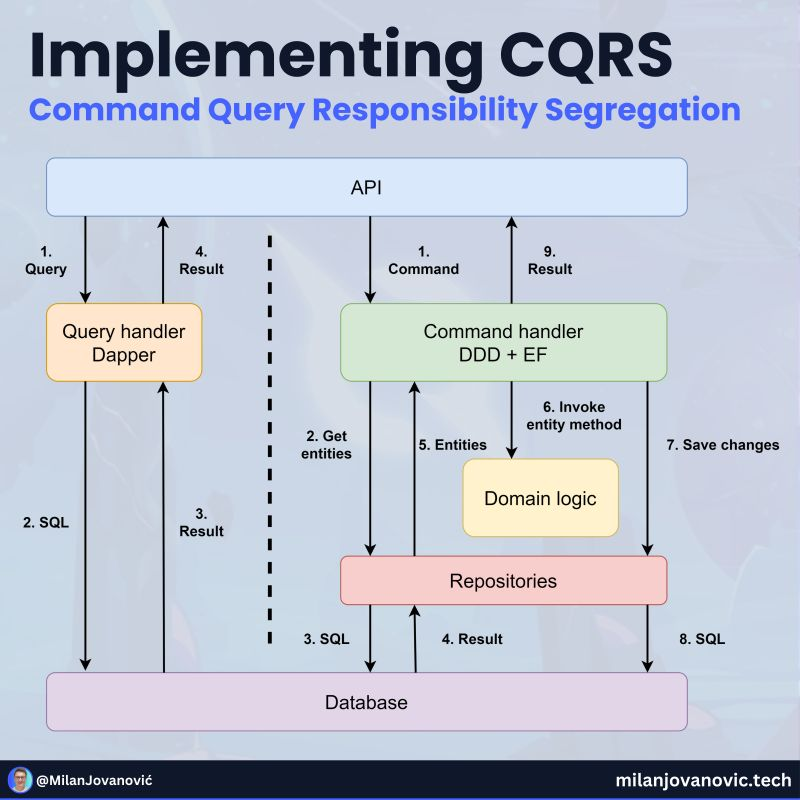

유스 케이스는 애플리케이션의 기능을 나타냅니다:

- **현재 사용자 정보 가져오기**  
- **쇼핑 카트에 아이템 추가하기**  
- **주문 결제 환불하기**

저는 하나의 유스 케이스(기능)를 중심으로 코드를 구조화합니다.

---

### CQRS와 함께하는 유스 케이스

- **Command** → 비즈니스 로직, 데이터베이스 작업, 부수 효과 발생 (도메인 모델)
- **Query** → UI에 필요한 데이터 표현 반환  (트랜잭션 스크립트)

