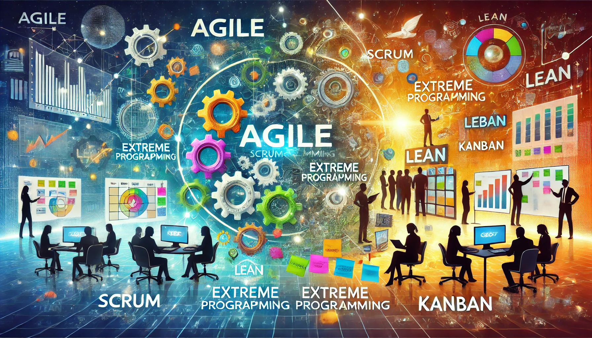

마음가짐과 경험이 중요하다!

### 애자일 소프트웨어 개발 선언

- <https://agilemanifesto.org/iso/ko/manifesto.html>

### 애자일 선언 이면의 원칙

### 반복(iteration)

- 요구사항 변경을 적극적으로 받아들이고, 짧은 주기마다 작동하는 소프트웨어를 제공
- Timeboxed: 시간을 정한다.
- 사용자에게 작동하는 소프트웨어를 제공하는 것이 목표
- 점진적 상세화(progressive elaboration)
  - 이전 단계를 개선하면서 얻은 지식을 바탕으로 다음 단계 산출물(계획 등)을 만드는 일

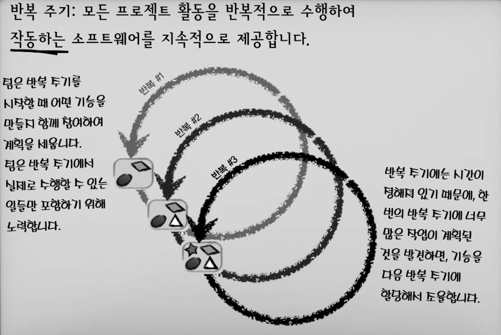

### 백로그(backlog)

- 팀이 반복에서 작업할 것들을 나열한 **피처 목록**
  - 팀이 각 반복 주기를 계획할 때마다, 팀은 피처를 백로그에서 빼내 가져옵니다.
- 변화하는 요구사항을 환영(백로그를 업데이트. 변경사항을 일찍 알면 재작업을 방지한다.)
  - 개발 후반부일지라도 요구사항 변경을 환영한다. 고객의 경쟁력에 도움이 되는 소프트웨어를 만들기 위해
  - 소프트웨어는 사용자, 고객, 이해관계자가 원하는 일을 할 때 가치를 갖는다.(비즈니스 가치)
  - 사용자가 원하는 것을 먼저 만들어라.(백로그 우선순위)
  - 비즈니스 쪽 사람들과 매일 함께 일을 한다.
  - 문서는 도움이 되지만, 정보 전달의 가장 효과적인 방법은 **면대면 대화**이다.

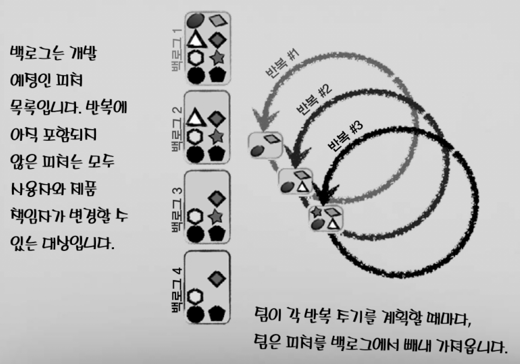

---

## 스크럼 (Scrum)

- **스크럼 구성원**
  - Product Owner
  - Scrum Master
  - Development Team
- **스크럼 산출물**
  - 제품 백로그
  - 스프린트 백로그
  - 제품 증분 (increment)
- **스크럼 이벤트**
  - 스프린트
  - 계획 수립 세션 ➡️ 일일 스크럼 ➡️ 스프린트 리뷰 ➡️ 스프린트 회고
- **스크럼의 가치**
  - 개방, 존중, 용기, 집중, 몰입

### 스크럼 구성원

- **Product Owner**
  - 백로그 관리
    - 백로그 아이템을 작성, 관리, 우선순위를 정하고, 팀에게 전달
    - 백로그 아이템을 작게 분할하고, 팀이 이해할 수 있도록 설명
    - 반복적으로 백로그를 정제(refine)
      - 제거, 재평가, 추가, 우선 순위 재조정
  - 팀이 최대화된 가치를 가진 제품을 만들게 해주는 역할
  - 팀이 훌륭한 일을 해냈음에도 프로젝트가 실패하는 일이 발생하지 않도록,
    - 회사의 나머지 사람들과 함께 일하고, 비즈니스 니즈를 이해하고, 어떤 피처를 만들지 결정해야한다.
    - 그리고 그 피처를 팀이 이해하도록 도와야한다.
  - 회사는 어떤 피처를 개발할지 결정할 권한을 가질 **전담 Project Owner를 팀에 배정**해야하며, 완료된 피처를 수용하면 된다.
    - 예컨데 **회사가 완전히 신뢰할 수 있는**, 오랜 경력의 수석 관리자 등으로 사용자, 광고주, 비평가 등의 이해관계자와 만나는 사람.
  - 팀에 무엇을 개발할지 결정할 수 없는 진정한 제품 책임자가 없을 때, 팀은 스크럼을 '**맞춤화**'하려고 한다.
- **Scrum Master**
  - 스크럼 프로세스를 이해하고, 팀이 스크럼을 제대로 수행할 수 있도록 가이드
  - 섬기는 리더(servant leader)
  - 제품 책임자가 백로그를 효과적으로 관리하는 방법을 찾을 수 있도록 도와준다.
  - 개발팀에게 스크럼 프로세스를 이해시키고, 필요에 따라 분위기를 조성
  - 조직 내 다른 사람들이 스크럼을 이해하고, 팀과 함께 일하도록 지원한다.
    - **회사가 스프린트를 방해하면, 스크럼 마스터는 회사에게서 스프린트를 보호해야 한다.** 스크럼 마스터의 역할 중 가장 중요한 부분이다.
    - 팀 뿐 아니라, **모든 사람들이 스크럼을 이해하게 돕는다, 여기에는 상위 관리자와 회사 전체가 포함된다.**
    - **만약 중대한 버그가 생겨서 당장 해결해야한다면, Product Owner가 스크럼 백로그에 우선순위 높게 해당 내용을 추가해서 해결하도록 한다.**
- **Development Team**
  - 역할과 직책은 다르다.
    - 팀 리드 또한 스크럼에서는 단지 개발팀의 일원이다.
    - 팀 리드는 팀 내에서 중요하고 독자적인 역할을 수행하지만,
    - 스크럼에서는 특정 관련 이벤트나 산출물에 대한 정의가 없다.

### 스크럼 산출물

- **제품 백로그**

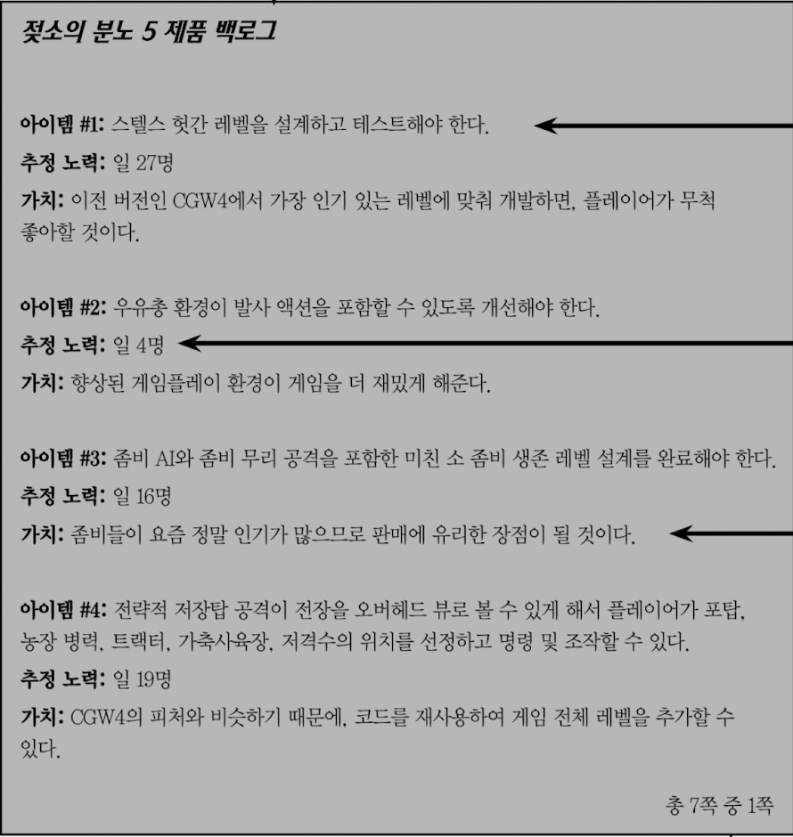

- **스프린트 백로그**

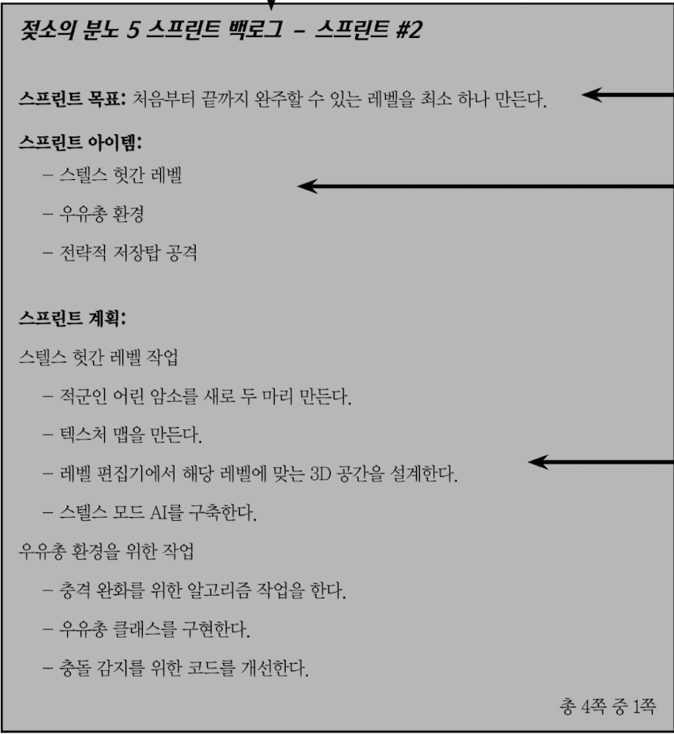

- **증분**: 스프린트 마지막에 실제로 개발이 끝나 전달되는 모든 백로그 아이템의 총합
  - 각 증분은 하나의 스프린트에서 완료된 결과(제품의 일부분)

### 스크럼 이벤트

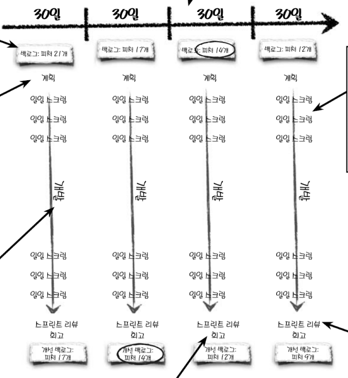

#### 스크럼 스프린트

- 시간이 정해진 반복 주기
- 30일 또는 2주
- 정해진 제한일이 지나면, 스프린트는 완료(종료)

#### 스프린트 계획 수립

- 계획 수립 세션 8시간 또는 4시간 (스프린트 비율에 따라 시간이 정해진다.)
- 전반부: 무엇을 할 것인가
  - 스프린트 목표
  - 스프린트 백로그
- 후반부: 어떻게 할 것인가
  - 스프린트 백로그의 아이템을 작게 분할
  - 하루 이하 시간동안 끝낼 수 있게 테스크를 작성
  - 스프린트 초반에 수행할 작업을 분할하는데 집중

#### 일일 스크럼

- 매일 15분 한정된 시간
  - 모든 팀원은 자신의 업데이트 내용에 집중해서 요점만 이야기한다.
  - 스크럼 마스터의 역할
    - 누군가가 말하기를 주저한다면, 개방이라는 스크럼의 가치를 수용시키고, 투명성을 유지하기 위해 팀원을 격려한다.
    - 누군가가 시간을 많이 소요한다면, 어떤 말이 필요한 말인지 아닌지 알려주며, 일일 스크럼 시간을 더 잘 관리하도록 도와준다.
    - 누군가가 세 가지 질문 이상의 논의 문제를 제기할 경우, 이를 중단시키고, 이후에 논의하도록 도와준다.
- Done
  - 내가 **어제 한 일** 중 스프린트 목표를 달성하는데 도움이 된 일이 무엇인가
- Do
  - 스프린트 목표에 부응하기 위해 **오늘 할 일**은 무엇인가
- Block
  - 스프린트 목표에 도달하는 데 방해가 되는 **장애물**이 있는가

#### 스프린트 리뷰

- 제품 책임자가 도메인 전문가 또는 주요 사용자들을 초대
- 스프린트를 시연하고 피드백
- 제품 백로그를 논의
- 30일의 경우 4시간

#### 스프린트 회고

- 잘한점, 개선점 파악
- 30일의 경우 3시간

### 스크럼의 가치

- **개방**
  - 팀원은 어떤 작업을 하는지 항상 서로 알고 있다. 편하게. 투명하게.
  - 모든 문제는 공유되어 팀 전체가 해결한다.
  - block을 공유하는 것은 좀 불편하고 창피할 수 있지만, 프로젝트를 위해서 중요하다.
- **존중**
  - 서로를 신뢰한다.
  - 동의하지 않는다면 서로의 아이디어를 이해하기 위한 노력을 기울인다.
    - 효과적인 스크럼 팀은 서로가 동의하지 않은 접근법에 대해서도 경청하고,
    - 동의하지 않은 접근법을 택해도, 선택을 존중하고 신뢰한다.
  - 비난하지 않는다.
- **용기**
  - 스크럼 팀은 도전을 받아들일 용기가 있고, 팀원 개개인은 프로젝트를 사수할 용기를 갖는다.
  - 불가능한 목표에 맞서, 불가능하다고 말하는 용기를 갖는다.
- **집중**
  - 스크럼 팀은 목표를 달성하기 위해 노력한다.
  - 팀원 개개인은 스프린트의 목표를 달성하기 위해 노력한다.
  - 스프린트가 완료될 때까지, 한 번에 하나의 작업만을 수행한다.
- **몰입**
  - 팀원들은 자기가 가장 가치 있는 제품을 개발할 수 있을 때 몰입한다.
  - 스프린트 목표에 부응하기 위해 계획하는 작업이 가장 중요한 작업이다.
  - 팀원 각자의 개인적인 성공이 프로젝트의 성공과 연결된다.
  - 아이템이 증분 속에 있기 때문에 몰입한다.
  - 집단 몰입(collective commitment)
  - 회사에는 중요해도, 프로젝트와 관련 없는 일이 나타나면?
    - 스크럼이 방해받지 않도록 프로젝트를 보호해야 한다.
    - 스프린트를 위한 집단 몰입을 존중하고, 스크럼 규칙을 지킨다.
    - 회사 또한 프로젝트가 스크럼으로 하는데 몰입해야 한다.
      - 그래선 안되지만, 만약 **회사가 몰입을 방해하면, 스크럼 마스터는 회사에게 스프린트를 보호해야 한다.**
        - 스크럼 마스터의 역할 중 중요한 부분이다. **모든 사람들이 스크럼을 이해하게 돕는다, 여기에는 상위 관리자와 회사 전체가 포함된다.**
      - 팀에게 어떤 피처를 어느 스프린트에서 개발할지 **결정할 권한**을 주고, 팀이 가장 가치 있는 소프트웨어를 개발하는 것을 신뢰해야 한다.
      - 회사는 어떤 피처를 개발할지 결정할 권한을 가질 **전담 Project Owner를 팀에 배정**해야하며, 완료된 피처를 수용하면 된다.
        - 예컨데 회사가 완전히 신뢰할 수 있는, 오랜 경력의 수석 관리자 등으로 사용자, 광고주, 비평가 등의 이해관계자와 만나는 사람.

  > 돼지와 닭의 이야기. 어느 날 닭이 돼지에게 말했습니다. "같이 레스트랑 하자! 이름은 베이컨과 달걀 어때?" 돼지는 생각하다가 말했습니다. "나는 안할래. 왜냐하면 너는 그냥 **참여**(involved)하지만, 나는 **몰빵**(committed)해야 하니까."

  - 어떤 팀은 해당 프로젝트에 관심만 있고 몰입하지 않는다. => 닭
  - 어떤 팀은 해당 프로젝트에 몰입한다. => 돼지
  - 스크럼의 가치는 돼지와 닭의 차이를 이해하는 것이다. 스크럼 팀은 돼지가 되어서 몰입해야 한다.
  - **제품 책임자가 어떤 피처를 만들지 결정할 권한이 없다면, 회사는 스크럼으로 프로젝트를 하는데 제대로 몰입하지 않은 것이다.**

- 작업은 '완료'될 때까지 완료된 것이 아니다.
  - 팀은 완료에 대해 명확히 정의해야한다.
- 스크럼팀은 세가지 특징을 갖는다.
  - **투명성**(transparency): 모든 것이 공개되어 있다.
  - **점검**(inspect): 팀은 일일 스크럼에서 아이템을 점검한다.
  - **적응**(adapt): 변경사항이 발견되면, 그 내용을 반영하고 적응한다. (장애물을 백로그 아이템으로 추가하거나 제거)
- 일일 스크럼에서 **주기를 다시 시작한다.**

### GASP (Generally Accepted Scrum Practices)

- 일반적으로 수용되는 스크럼 프랙티스

- 사용자 스토리와 스토리 포인트
  - 사용자 스토리(user story): 사용자가 소프트웨어에서 필요로 하는것
    - 나는 ~로서, ~를 통해서 ~를 원한다. => who how what
    - INVEST
      - Independent: 다른 스토리와 독립적으로 설명 가능해야 한다.
      - Negotiable: 변경 가능, 협상의 산물이다.
      - Valuable: 가치 있어야 한다. 가치없는 것에 시간을 낭비할 이유는 없다.
      - Estimable: 추정 가능, 노력을 숫자로 표현할 수 있어야 한다.
      - Small: 작은, 단일로 개발 가능한 독립적인 형태로 표현해야 한다.
      - Testable: 테스트 가능, 완료 조건이 명확해야 한다. 피드백으로 이어져야 한다.
    - 3C
      - Card: 사용자 스토리를 작성한 카드
      - Conversation: 사용자 스토리에 대한 대화
      - Confirmation: 사용자 스토리가 완료되었을 때 어떻게 확인할지
    - <http://xp123.com/articles/invest-in-good-stories-and-smart-tasks/>
  - 스토리 포인트(story point): 사용자 스토리를 구축하는데 필요한 노력을 측정하는 단위
    - 완료된 스토리 포인트의 합은 프로젝트 진척도(velocity)를 측정하는데 사용된다.
    - 피보나치 수열

| XS | S | M | L | XL | XXL |
| -- | -- | -- | -- | -- | -- |
| 1 | 2 | 3 | 5 | 8 | 13 |

- 태스크 보드(task board)
  - 팀의 진행 상황을 시각적으로 표현
  - Kanban

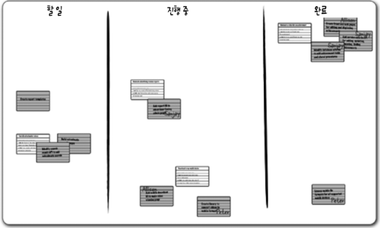

- 계획 수립 포커(planning poker)
  - 팀원들이 각 스토리가 얼마나 큰지 어떻게 개발할지 생각
  - 각자 스토리 포인트를 측정하기
- 번다운 차트(burndown chart)
  - 스프린트 기간 동안 남은 작업을 시각적으로 표현
  - 스프린트 기간 동안 남은 작업을 시각적으로 표현

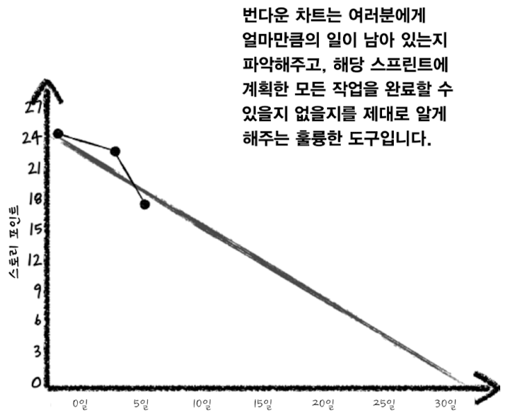

#### 제품 백로그 정제 (Product Backlog Refinement)

- 전체 스프린트 시간의 10% 정도를 할애
- 백본(backbone): 핵심 패처
- 살아있는 스켈레톤(walking skeleton): 백본의 가장 중요한 사용자 스토리. 피처

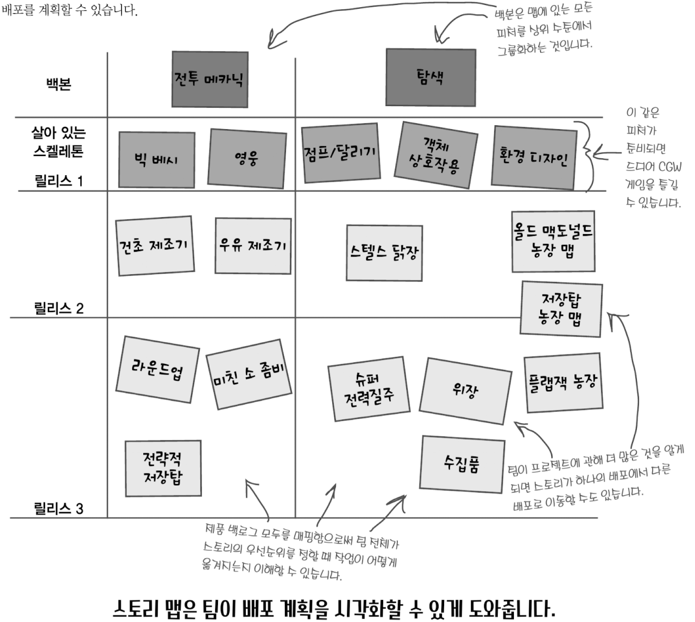

#### 페르소나 (Persona)

- 사용자를 대표하는 가상의 인물

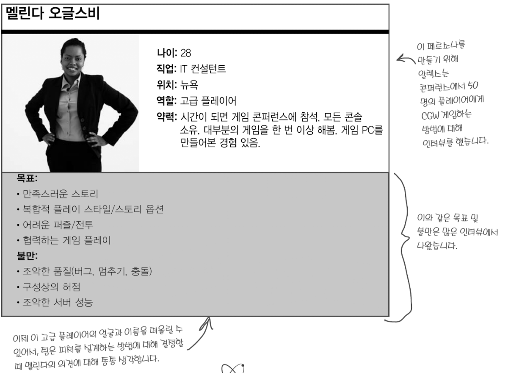

### 회고

- **무대 설정**
  - check-in
    - 팀원들이 자신의 감정을 공유
  - ESVP
    - 네 개의 역할 중 하나로 생각하며 회고에 참여하는 것
    - Explorer: 탐험가. 새로운 아이디어를 찾는 사람
    - Shopper: 쇼핑하는 사람. 개선할 점을 찾는데 주력하는 역할
    - Vacationer: 휴가자. 회의동안 일로부터 멀어진다는 역할
    - Prisoner: 무언가 다른 것을 하면 좋겠다고 생각하며, 회고에 억지로 끌려왔다는 역할
- **데이터 수집 도구**
  - 타입라인(time line)
    - 팀원들이 스프린트 동안 경험한 일을 시간 순서대로 나열
  - 컬러 코드 스티커(color code dots)
    - 팀원들이 스프린트 동안 경험한 일을 색깔로 표현 (긍정 => 초록, 부정 => 노랑)
- **통찰력 도구**
  - 생성뼈(fishbone)
    - 원인과 결과 다이어그램
    - 문제의 원인을 찾기 위해 사용
  - 스티커로 우선순위 정하기(prioritize with dots)
    - 팀원들이 가장 중요하다고 생각하는 것에 점을 찍어 우선순위를 정함 (각자 10개씩)
- **행동 계획 도구**
  - 짧은 주제
    - 팀원들이 스프린트 동안 개선할 점을 짧게 적음
    - 그만하기/시작하기/계속하기

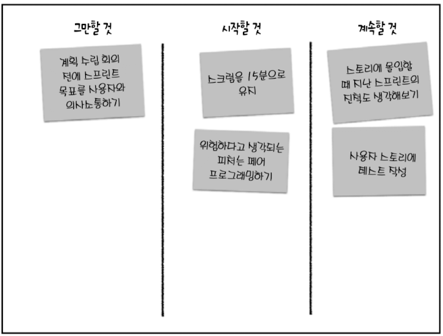

---

## 익스트림 프로그래밍 (XP)

- 소프트웨어 팀은 훌륭한 코드를 만들 때 성공했다고 합니다.
- XP는 팀이 훌륭한 코드를 만들 수 있도록 도와줍니다.
- 변경에 대한 태도, 마음가짐을 바꾼다.

> "필요할 거라고 예상될 때가 아니라, 항상 정말로 필요할 때 구현하라." - Ron Jeffries, XP의 창시자

