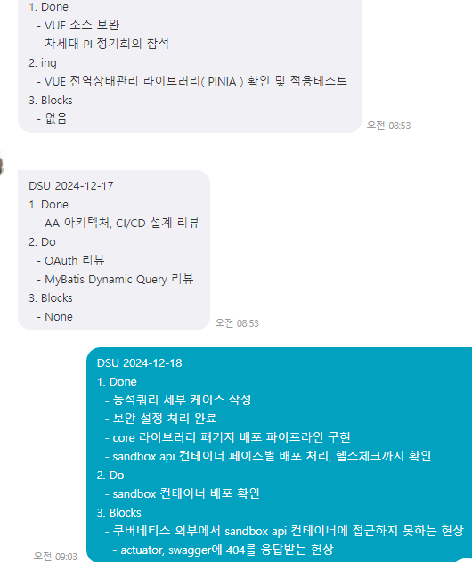
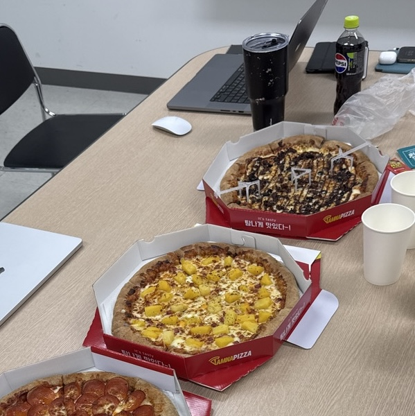
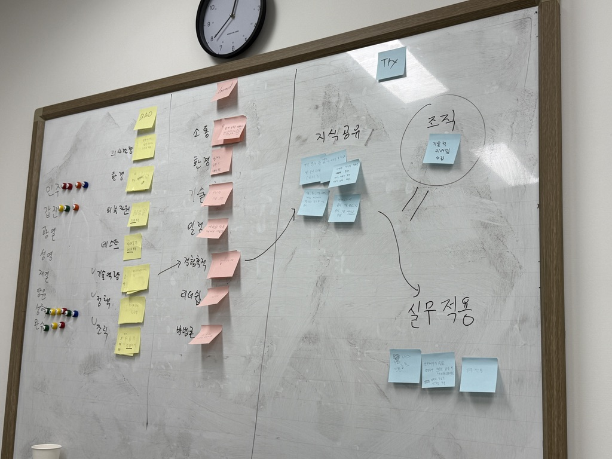

나는 단 3주 만에 3년 치의 경험을 했다. 애자일은 단순한 개발 프로세스가 아니라, **개발 방식과 협업 문화를 혁신하는 철학이자 실천 방식이었다**.

나는 2024년 12월 30일부터 2025년 1월 17일까지 스크럼 팀에 속해 있었다. 그 시간은 마치 폭풍과 같았다. 회사에서 차세대 시스템 구축을 위해 IBM의 컨설팅을 받았고, PI(Process Innovation) 단계가 끝난 후 공통 플랫폼(프레임워크) 구축을 위한 스크럼 팀이 구성되었다. 나는 운 좋게도 그 팀에 합류할 수 있었다.

팀원들은 모두 경험이 풍부한 개발자들이었지만, 스크럼은 처음이었다. XP, Lean, Kanban에 대해서도 제대로 알고 있는 사람이 없었다. 프로젝트 오너이자 스크럼 마스터 역할을 IBM 실장님이 겸임하셨고, 우리는 3주간 스크럼 팀으로 활동했다. 당시에는 몰랐지만, 그 시간이야말로 베스트 프랙티스 Agile을 경험하는 순간이었다.

3주 후, 회사의 사정으로 인해 프로젝트가 중단되었다. 하지만 그 경험은 나의 인식을 완전히 바꾸어 놓았다. 그동안 내가 알고 있던 애자일은 단지 이름뿐인 경우가 많았다. 진정한 애자일은 강력한 효율과 효과를 갖고 있었다. 나는 3년 동안 쌓아온 경험보다 더 많은 것을 3주 동안 배웠다. 하지만 전혀 힘들지 않았고, 즐거웠다.

바로 회고를 하고 싶었지만, 애자일에 대해 제대로 알지 못하고 있었다는 사실을 깨달았다. 그래서 한 달 동안 애자일 관련 서적을 읽으며 이해를 넓혔다.

- 스텔만, 앤드류, & 그린, 제니퍼. (2019). Head First Agile: 개념부터 시험 대비까지, 가장 애자일다운 안내서 (박현철, 역). 한빛미디어. (원저는 2017년에 출판)
- 슈와버, 켄, & 비들, 마이크. (2008). 스크럼 (박일 & 김기웅, 역). 인사이트. (원저는 2002년에 출판)
- 벡, 켄트. (2006). 익스트림 프로그래밍: 변화에 대응하는 개발 방법론 (신시아 안드레스 공저, 김창준 & 정지호, 역). 인사이트. (원저는 2004년에 출판)
- 앤더슨, 데이비드 J. (2014). 칸반: 지속적 개선을 추구하는 소프트웨어 개발 (조승빈, 역). 인사이트. (원저는 2010년에 출판)

이제야 조금은 애자일을 이해할 수 있게 되었고, 본격적인 회고를 시작하고자 한다.

## 애자일 선언문(Agile Manifesto)

2001년, 미국 유타 스노우버드 스키 리조트에서 17명의 소프트웨어 개발 전문가들이 모여 새로운 소프트웨어 개발 방법론을 논의했다. 그리고 애자일 소프트웨어 개발 선언(Agile Manifesto) 을 발표했다.

- <https://agilemanifesto.org/iso/ko/manifesto.html>

애자일(Agile)은 14세기 프랑스어에서 유래했으며, 라틴어 agilis에서 파생되었다. 이는 '행동하다(act)'라는 의미를 포함하며, 단순한 속도가 아닌 **적응력과 유연성**을 강조하는, 이상적인 소프트웨어 개발의 본질과 맞닿아 있다.

2000년대 초반, 대부분의 소프트웨어 개발은 워터폴(Waterfall) 방식을 따랐다. 하지만 워터폴 방식은 변화하는 요구사항을 반영하기 어려운 한계를 지니고 있었다. 소프트웨어 개발은 현실이고, 현실은 불확실성과 혼돈이 가득한 영역이다. 소프트웨어 개발은 불확실성으로 가득차있고, 요구사항은 매순간 변경된다.

애자일은 이러한 불확실성과 요구사항의 변화에 대응하기 위해 탄생한 것이다.
요구사항을 모두 수집하고, 모든 기능을 평가하기전에 소프트웨어를 개발을 시작한다.
소프트웨어를 개발하면서 요구사항이 변경된다면, 그것을 환영한다. 그것은 소프트웨어가 사용자에게 가치를 주기 위한 것이기 때문이다.

경영진들은 초기에 이를 받아들이지 않았다. 하지만 소프트웨어의 기능이 점점 복잡해지고, 생산성이 저하되자, 미친척 반영해보았고 그게 잘 동작하는 것을 보고 깜짝 놀랐다. 애자일과 TDD의 성공은 이후 십년 동안 소프트웨어 개발 방식을 바꿔놓았다.

문제는 그 후 일어났다.

## 애자일(Agile)에 대한 오해

> Agile 은 죽었다. (Agility여 영원하라) - 'Agile' 이라는 단어는 사실상 의미가 없는 지경까지 전복(subvert) 되었고, 애자일 커뮤니티의 경우 대체로 컨설턴트와 벤더들이 서비스와 제품을 판매하는 장소가 되어버렸습니다. Manifest가 대중화 되면서 Agile 이라는 단어는 지지할 것이 있거나, 청구할 시간 이나 판매할 제품이 있는 모든 것들을 끌어들이는 자석이 되어버려서, 마케팅 용어가 되었습니다. 그래서 'Agile' 이라는 말은 이제 은퇴시켜야할 때라고 생각합니다. - Dave Thomas(애자일 선언문 서명자, 실용주의 프로그래밍 공동 창시자), 2014년 8월 7일

> 개발자는 Agile을 포기해야 합니다. - 'Agile' 아이디어가 제대로 적용되지 않으면, 개발자에게 더 많은 간섭을 하고, 작업시간을 더 적게 주고, 높은 압력을 주고, '더 빠르게 진행' 하는 것을 요구하게 됩니다. 이건 개발자들에게 좋지 않으며, 궁극적으로는 회사에도 좋지 않습니다. 'Agile'을 제대로 수행하지 않으면 실제 달성할 수 있는 것보다 훨씬 더 많은 결함과 더 느린 진행이 자주 발생하기 때문입니다. 종종 우수한 개발자가 그런 회사를 떠나게 되면서, 결과적으로는 "Agile"을 도입하기 전보다 효율성이 떨어지는 기업이 됩니다. - Ron Jeffries(애자일 선언문 서명자, XP 공동 창시자), 2018년 1월 15일

많은 경영진은 애자일을 '더 빨리, 더 많이' 개발하기 위한 도구로 오해한다. 반면, 개발자들은 애자일이 '끝없는 간섭과 일정 압박을 위한 통제 수단'으로 변질되었다고 느낀다. **자율성과 협업이 사라지고**, 속도만 강조된 비효율적인 관리 도구로 전락해버린다. 그 결과, 팀은 단기 목표에 쫓기며 과부하에 시달리고, 장기적인 품질과 생산성은 오히려 악화되는 것이다.

애자일은 본질적으로 구성원의 행복을 위한 것이다.

## 애자일(Agile)에 대한 이해

### ❌ 잘못된 애자일

- "더 빨리, 더 많이"를 강요
- 불필요한 회의 증가
- 구성원의 통제 도구로 변질

### ✅ 진짜 애자일

- 구성원의 자율성과 책임 강화
- 가치 중심의 피드백 루프
- 지속 가능한 개발 환경 조성

애자일을 이해하기 위해서는 애자일의 가치와 원칙을 이해해야 한다.
애자일은 개인과 상호작용, 작동하는 소프트웨어, 고객과의 협력, 변화에 대한 대응을 가치로 하는 방법론이다.

요구사항 변경을 적극적으로 받아들이고, **짧은 주기마다 작동하는 제품을 제공**하는 것이 목표이다.

**점진적 상세화**(progressive elaboration)를 통해 이전 단계를 개선하면서 얻은 지식을 바탕으로 다음 단계 산출물(계획 등)을 만드는 일이다.

애자일은 **마지막 순간까지 요구사항 변경을 수용**하며, 이것이 **고객의 경쟁력**을 높이고 **제품의 가치를 최대화**하는 것임을 안다.

애자일은 크게 세 가지 대표적인 프레임워크가 있다.

- 스크럼(Scrum)
- 익스트림 프로그래밍(XP)
- 칸반(Kanban)

이 세가지 구현체는 모두 애자일의 핵심 원칙을 따르지만, 적용 방식과 특징이 다르다. 스크럼은 프로젝트 관리 방법론이며, 익스트림 프로그래밍은 개발 방법론이며, 칸반은 작업 관리 방법론이다. 각각의 방법론을 들여다보자.

---

## 1. **스크럼(Scrum)**

스크럼은 가장 널리 사용되는 애자일 프레임워크로, 일정한 주기(스프린트) 동안 목표를 설정하고 팀이 협업하여 실행하는 방식이다.

- **고정된 반복 주기(Sprint, 일반적으로 1~4주)**
- **역할(Role)**
  - 이 역할은 직무와는 별개이다. 직무와 관계없이 가장 적합한 사람에게 역할이 주어져야 한다.
  - **스크럼 마스터**: 프로세스 조율 및 장애물 제거
    - 스크럼 마스터는 팀이 스크럼을 올바르게 수행하도록 도와주는 역할을 한다. 팀의 **코치** 역할인 것이다.
    - 외부 요인으로 인해 스크럼이 방해받을 때, 스크럼 마스터는 이를 해결할 수 있어야 한다. 심지어 **상사와 회사의 방해로부터 스크럼을 보호해야 한다.**  만약 스크럼 마스터가 이를 지켜내지 못하면, 스크럼은 결국 회사의 요구에 **맞춤화**되며 본래의 목적을 잃어버리게 된다. **맞춤화된 스크럼(Customized Scrum)은 창의성과 자율성을 상실하게 되며, 결국 더 이상 스크럼이 아닌 형식적인 프로세스로 전락하고 만다.** 이런 방식으로 운영된 프로젝트는 대부분 실패하거나, 애자일이 의도한 효과를 발휘하지 못한다.
  - **프로덕트 오너(PO)**: 요구사항 정의 및 우선순위 관리
    - 프로덕트 오너는 제품의 비전을 이해하고, 제품 백로그를 관리하며, 제품의 가치를 최대화하는 역할을 한다.
    - 고객, 이해 관계자들과 가장 친밀하며, 소통 가능해야 한다.
    - 회사는 도출될 제품에 대해 **완전히 신뢰 가능한 사람**을 지정해야 한다. PO는 제품에 대해 **누구보다 잘 알며** 그 **가치를 최대화 할 방법을 알아야 한다.** 때문에 제품에 대한 **최종 결정권**을 가지고 있으며, 회사는 이런 사람을 지정했기 때문에, 스크럼의 결과물을 수용하면 된다.
  - **개발팀(Development Team)**: 자율적으로 일하는 크로스펑셔널 팀
    - 제품을 개발하는 팀으로, 프로젝트에 필요한 모든 역할을 수행한다.
    - 각각 **스스로 조직**하고, **스스로 관리**하며, **스스로 일**할 수 있어야 한다.
    - 팀은 **서로를 비판하되 비난해선 안되며**, 모든 정보와 업무를 공유한다. 서로를 **존중**하고 **신뢰**하고 협력해야 한다.
- **미팅**
  - **스프린트 계획 회의**: 목표 설정 및 백로그 선택
  - **데일리 스크럼**: 매일 짧은 회의(15분)로 진행 상황 공유
  - **스프린트 리뷰**: 결과물 데모 및 피드백 반영
  - **스프린트 회고**: 프로세스 개선 논의
- **백로그(Product Backlog & Sprint Backlog)**
  - 우선순위가 높은 작업부터 수행
- **번다운 차트(Burn-down Chart)**
  - 스프린트 진행 상황을 시각적으로 확인

## 2. **익스트림 프로그래밍(XP, eXtreme Programming)**

**소프트웨어 품질과 개발 속도 향상**에 중점을 둔 방법론으로, **개발 프로세스의 실천 방식**을 강조한다. (다만, 모든 개발자가 페어 프로그래밍이나 TDD를 원활하게 수행할 수 있어야 한다.)

- **테스트 중심 개발(TDD, Test-Driven Development)**
  - 테스트 코드를 먼저 작성하고 이를 통과하도록 개발
- **리팩토링(Refactoring)**
  - 지속적인 코드 개선을 통해 유지보수성을 높임
- **페어 프로그래밍(Pair Programming)**
  - 두 명이 한 컴퓨터에서 코드를 함께 작성하며 품질 향상
- **단순 설계(Simple Design)**
  - 필요 이상으로 복잡한 설계를 피하고 단순함 유지
- **고객과의 긴밀한 협업(Continuous Feedback)**
  - 고객과 지속적인 대화를 통해 요구사항을 반영
- **짧은 배포 주기(Small Releases)**
  - 빠르게 배포하고 자주 업데이트하여 고객 피드백 반영
- **지속적 통합(Continuous Integration, CI)**
  - 코드 변경 사항을 자주 병합하여 충돌을 최소화

## 3. **칸반(Kanban)**

소프트웨어 개발뿐만 아니라 다양한 업무 관리에 적용되는 방법론으로, **작업 흐름을 시각화**하고 **WIP(Work In Progress, 진행 중인 작업)의 제한**을 통해 효율성을 극대화하는 방식이다.  

- **작업 흐름(Workflow) 시각화**
  - 칸반 보드를 활용해 진행 중인 작업을 한눈에 볼 수 있도록 함
- **WIP 제한(Work In Progress Limit)**
  - 한 번에 수행할 수 있는 작업 개수를 제한하여 과부하 방지
- **리드 타임(Lead Time) 단축**
  - 작업이 시작된 후 완료되기까지 걸리는 시간을 줄임
- **지속적인 개선(Continuous Improvement)**
  - 병목 현상을 분석하고 프로세스를 최적화함

## 비교

| 항목 | **스크럼(Scrum)** | **XP(eXtreme Programming)** | **칸반(Kanban)** |
|------|-----------------|-------------------------|-----------------|
| **주요 목표** | 프로젝트 관리 및 협업 | 소프트웨어 품질 및 개발 속도 향상 | 작업 흐름 최적화 |
| **주기(Timebox)** | 1~4주 스프린트 | 짧은 배포 주기(수일~1주) | 제한 없음(연속 흐름) |
| **역할(Role)** | PO, 스크럼 마스터, 개발팀 | 개발팀 중심 | 역할 제한 없음 |
| **작업 단위** | 백로그 항목(User Story) | 기능 단위 작업(Task) | WIP 제한 기반 업무 |
| **작업 흐름** | 스프린트 단위 | 지속적 통합, 지속적 배포 | 지속적 흐름 관리 |
| **유연성** | 상대적으로 제한적 | 유연하지만 실천 방식이 많음 | 매우 유연함 |
| **피드백 루프** | 스프린트 회고(주기적) | 지속적 코드 리뷰 및 테스트 | 지속적 업무 최적화 |

- **스크럼**: 프로젝트 관리와 협업 강화 (대형 프로젝트에 유리)
- **XP**: 개발자의 기술 역량 향상과 품질 중심 개발 목표 (기술적으로 복잡한 프로젝트에 유리)
- **칸반**: 지속적인 흐름을 유지하고 유연한 업무 관리 (운영/유지보수에 유리)

---

## 실제 진행

공통 차세대 플랫폼 프로젝트는 스크럼 방식을 주로 활용했다.

Back Log를 Story Board로 관리했다. 모두가 볼 수 있도록, 스크럼 보드를 사용했다. 이를 통해, 모두가 현재 진행 상황을 파악할 수 있었다.

DSU(데일리 스크럼 미팅)는 매일 아침 9시에 진행했으며, 30초씩만 발언할 수 있었고, 이 시간을 넘어가면 스크럼 마스터(IBM 실장님)가 중단시켰다. 때문에 전체 회의는 5분이 넘어가지 않았다. 이 과정을 통해 모든 업무가 투명하게 공유되었다. 이 방식은 처음에는 낯설었지만, 결과적으로 팀의 생산성과 협업을 극대화했다.

초기 백로그는 PO가 작성했지만, **매일 DSU에서 팀원들과 논의하며 우선순위를 조정하고 불필요한 항목을 리하는 과정을 반복했다.**. 처음 계획했던 기능도 개발 도중 필요성이 낮아지면 과감히 제외했고, 반대로 중요한 요구사항이 새롭게 등장하면 빠르게 반영했다. 이렇게 유연한 백로그 관리를 통해, **가장 가치있고 진짜 필요한 기능에 집중**할 수 있었다.

매주 스프린트 리뷰를 통해, 다른 개발팀들과 DBA들(이해관계자)에게 공통 플랫폼을 소개하고, 피드백을 받았다.

매주 Pizza Day를 가졌다. 이날은 팀원들이 원하는 피자를 시켜 먹었다. 이날은 팀원들이 편하게 대화를 나눌 수 있는 시간이었다. 이 시간에 또한 스프린트 회고를 같이 했다.

또한 프로젝트의 개발은 XP 방식으로 진행되었다.

깃랩 이슈 보드를 통해 작업을 관리했고, 기능 개발이 완료될 때마다 MR을 생성하고 코드 리뷰를 수행했다.

CI/CD를 통해, 코드를 자동으로 빌드하고, 테스트를 수행했다.

하루 이틀 단위로 기능을 완성하고, DSU에서 Do, Done, Block을 공유하고, 백로그가 점진적으로 추가됐다.

팀원은 매일 서로가 무엇을 하고 있는지 투명하게 공유했고, 서로 간의 피드백이 자유로웠다.

비록 3주간의 짧은 프로젝트였지만, 많은 것을 배웠다. 애자일은 무엇인가? 무엇을 위한 것인가? 어떻게 적용해야 하는가? 이 모든 것을 베스트프렉티스로 배웠다. 앞으로 나는 단순히 '애자일을 한다'는 것이 아니라, 애자일의 본질을 이해하고 **팀과 조직이 함께 성장할 수 있는 환경을 만드는 개발자**가 되고 싶다. 애자일은 그저 방법론이 아니라, **지속적인 개선과 협업을 통해 더 나은 개발 문화를 구축하는 철학이자 실천 방식**이다."

**애자일은 마음가짐이다!**

---

끝으로 켄트 벡의 Extreme Programming(kent, beck, 2004)에서의 일화를 가져왔다.

> 나는 처음으로 운전하는 법을 배운 날을 생생하게 기억한다. 어머니와 나는 캘리포니아 치코 근처의 5번 고속도로를 달리고 있었는데, 이 도로는 평탄한 땅에 직선 도로가 지평선까지 쭉 곧게 뻗어나간다. 어머니는 조수석에 앉은 내게 손을 뻗어 운전대를 잡아 보도록 하셨다. 그리고 운전대를 돌리는 것이 자동차의 방향에 어떻게 영향을 미치는지 내가 느끼게 해주셨다. 그런 다음 내게 "이렇게 해보렴. 차가 길의 정중앙에 놓이도록 해서 그 방향으로 쭉 뻗어나가면 저 지평선에 바로 맞닿을 수 있게 해라."라고 말씀하셨다.   
> 나는 도로를 흘끗흘끗 내다보며 조심스럽게 방향을 잡았다. 나는 차가 정확히 길 한가운데에서 차선 중앙으로만 가도록 했다. 꽤 잘 하고 있었다. 그러다가 아주 잠깐 정신을 딴 데 팔았더니...   
> 차가 길 옆 자갈을 스치는 소리에 나는 번쩍 제정신이 들었다. 어머니는 부드럽게 차를 다시 길에 돌려놓으셨다 (지금 생각해 보니 그때 당신의 용기는 정말 놀랍다.) 내 심장은 두근거렸다. 어머니는 이런 경험을 하게 만든 다음에야 진짜 운전법을 가르쳐 주셨다. **"운전은 차를 똑바른 방향으로 가도록 맞추어 놓고 그대로 두는 게 아니야. 운전은 계속 신경을 쓰면서 이번에는 이쪽으로 조금, 다음에는 저쪽으로 조금씩 방향을 고치면서 가능거지."** (2)
