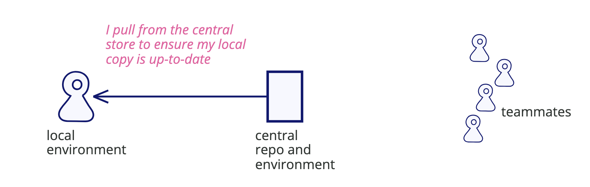
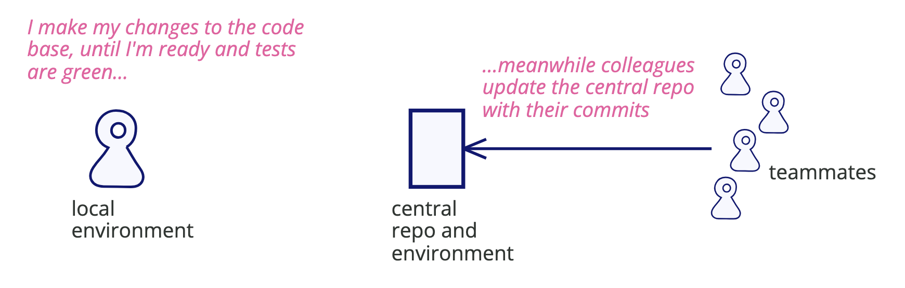
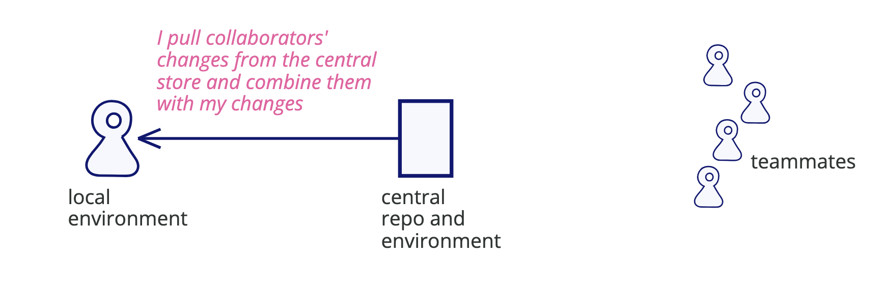
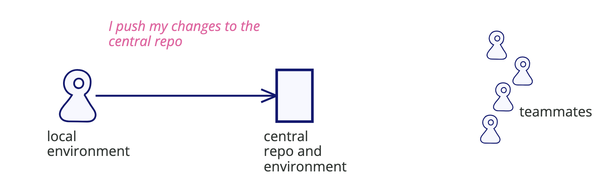
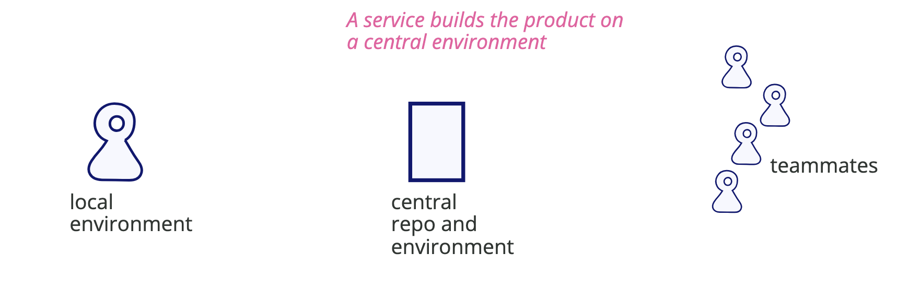
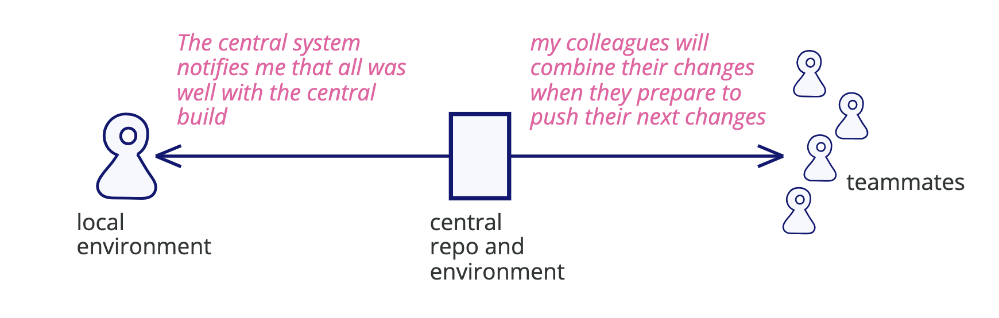
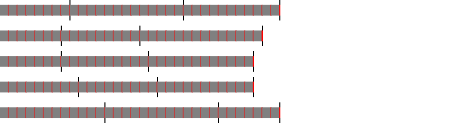

- 원본: [Continuous Integration (Martin Fowler, 2024)](https://martinfowler.com/articles/continuousIntegration.html)

지속적 통합(Continuous Integration)은 소프트웨어 개발 관행으로, 팀의 각 구성원이 자신의 변경 사항을 동료들의 변경 사항과 함께 코드베이스에 **하루에 최소 한 번 이상 병합하는 것**을 의미한다. 이러한 각 통합은 **자동화된 빌드**(테스트 포함)를 통해 검증되어, 통합 오류를 가능한 한 빠르게 발견할 수 있도록 한다. 많은 팀들은 이 방식이 **배포 지연의 위험을 줄이고**, **통합에 드는 노력을 줄이며**, **새로운 기능을 빠르게 확장할 수 있는 건강한 코드베이스를 유지하는 실천을 가능하게 한다**는 점을 발견하게 된다.

---

나는 대형 소프트웨어 프로젝트를 처음 본 경험을 아직도 생생하게 기억한다. 당시 나는 영국의 한 대형 전자회사에서 여름 인턴십을 하고 있었고, 내 매니저는 QA 부서 소속이었다. 그는 나를 데리고 현장을 안내해주었고, 우리는 커다랗고 우울한, 창문도 없는 창고 같은 공간에 들어섰다. 그곳에는 칸막이 책상 안에서 일하는 사람들이 가득했다. 그는 이 프로그래머들이 몇 년 동안 특정 소프트웨어를 위한 코드를 작성해왔고, 지금은 프로그래밍은 끝난 상태이며, 각자 작성한 단위들을 통합하고 있는 중이라고 말했다. 그리고 이 통합 작업이 이미 몇 달째 계속되고 있다고 했다. 가이드에 따르면, **이 통합 작업이 언제 끝날지 아무도 정확히 알 수 없다고 했다.** 이 경험을 통해 나는 소프트웨어 프로젝트에서 흔히 벌어지는 한 가지 사실을 배웠다: **여러 개발자의 작업을 통합하는 일은 오래 걸리고 예측하기 어려운 과정이라는 것.**

요즘은 이렇게 오랜 기간 통합에 갇혀 있는 팀 이야기를 들은 적은 거의 없지만, 그렇다고 해서 **통합이 아무런 고통 없이 이루어지는 과정이라는 뜻은 아니다.**  예를 들어, 한 개발자가 며칠간 새로운 기능을 작업하면서 공용 메인 브랜치로부터 변경 사항을 주기적으로 자신의 기능 브랜치에 반영해왔다고 하자. 그녀가 이제 곧 자신의 변경 사항을 푸시하려는 찰나, 메인 브랜치에 **큰 규모의 변경이 들어오고**, 그 변경은 **그녀가 사용하던 코드 일부를 수정한 상태**다. 그녀는 이제 기능 마무리를 하려던 계획을 접고, **자신의 작업을 그 변경과 어떻게 통합할지 고민하는 일**로 전환해야 한다. 이 변경은 동료에게는 좋은 변화일 수 있지만, 그녀에게는 그렇지 않을 수 있다. 운이 좋다면 그 변경의 복잡성은 **단순히 소스 코드를 병합하는 데서 끝나겠지만**, 운이 나쁘다면 그 변화는 **응용 프로그램을 실행해야만 드러나는 미묘한 오류**를 야기할 수도 있고, 그녀는 익숙하지 않은 코드를 디버깅하느라 시간을 써야 할지도 모른다.

적어도 위의 시나리오에서는, 그녀가 **풀 리퀘스트를 제출하기 전에** 문제를 발견할 수 있다는 점이 위안이 된다. 풀 리퀘스트 자체도 충분히 부담스러운 일이다 — 변경 사항을 검토해줄 누군가를 기다리는 동안 말이다. 리뷰는 시간이 걸릴 수 있고, 그동안 그녀는 **다음 기능 작업으로 맥락을 전환(context-switch)** 해야 한다. 그 시점에 복잡한 통합 문제가 생긴다면, 그것은 매우 불안한 경험이 될 수 있으며, **리뷰 과정을 더욱 지연**시키게 된다. 그리고 그게 끝이 아닐 수도 있다. **통합 테스트는 종종 풀 리퀘스트가 머지된 이후에야 실행되기 때문**이다.

시간이 지나면서, 이 팀은 **핵심 코드에 중요한 변경을 가하는 것이 이런 문제를 유발한다는 사실을 깨닫게 될 수도 있다.**  그리고 그래서 그런 변경을 아예 하지 않게 될 수도 있다.  하지만 그렇게 되면, **정기적인 리팩터링이 이루어지지 않게 되고**,  결국 코드베이스 전체에 **쌓여가는 불순물(cruft)**을 방치하게 된다. 이후에 이런 **지저분한 코드베이스를 마주한 사람들**은  "도대체 코드가 왜 이렇게 되어버린 걸까?"라고 의문을 갖게 되지만,  그에 대한 답은 종종 이렇게 나온다:  **통합 과정이 너무 고통스럽고 마찰이 커서, 사람들이 그 불순물을 치울 의욕조차 잃어버렸기 때문**이다.

하지만 반드시 그렇게 될 필요는 없다. 내 동료들이 ThoughtWorks에서 진행한 대부분의 프로젝트들, 그리고 전 세계의 많은 다른 팀들은 **통합을 별일 아닌 것으로 여긴다.** 개별 개발자의 작업은 **공용 프로젝트 상태와 몇 시간밖에 차이 나지 않으며**, 그 작업은 **수 분 안에 다시 통합**될 수 있다. 통합 과정에서 발생하는 오류는 **빠르게 발견되고**, 또한 **빠르게 수정될 수 있다.**

이러한 차이는 **비싸고 복잡한 도구**에서 비롯된 것이 아니다. 그 핵심은 **팀의 모든 사람이, 최소 하루에 한 번 이상, 관리되는 소스 코드 저장소에 자주 통합하는 단순한 실천**에 있다. 이러한 실천을 **"지속적 통합(Continuous Integration, CI)"**이라고 하며, 어떤 사람들은 이를 **"트렁크 기반 개발(Trunk-Based Development)"**이라고 부르기도 한다.

이 글에서 나는 **지속적 통합이 무엇인지, 그리고 그것을 잘 실천하려면 어떻게 해야 하는지**를 설명한다. 이 글을 쓰는 데는 두 가지 이유가 있다. 첫째, 항상 새로운 사람들이 이 직업에 들어오고 있으며, **그들에게 그 우울한 창고 같은 상황을 어떻게 피할 수 있는지를 보여주고 싶기 때문**이다. 둘째, 이 주제는 **명확하게 설명될 필요가 있다**, 왜냐하면 **지속적 통합은 매우 많이 오해받고 있는 개념**이기 때문이다. 많은 사람들이 자신들이 CI를 하고 있다고 말하지만, 그들의 작업 흐름을 자세히 들어보면 **중요한 요소들이 빠져 있는 경우가 많다.** **지속적 통합을 명확히 이해하는 것**은 서로의 커뮤니케이션에 도움이 된다. 우리가 일하는 방식을 설명할 때, 상대방이 무엇을 기대해야 할지 알 수 있기 때문이다. 또한, 사람들이 **자신의 개발 경험을 더욱 향상시킬 수 있는 여지가 있다는 사실을 깨닫는 데도 도움이 된다.**

나는 이 글을 **처음에는 2001년에 작성**했고, **2006년에 한 차례 업데이트**했다. 그 이후로 소프트웨어 개발 팀의 일반적인 기대치는 크게 변화했다. 내가 1980년대에 보았던 **몇 개월씩 이어지던 통합 과정은 이제는 아득한 과거의 기억**이 되었고, 버전 관리나 빌드 스크립트 같은 기술들도 이제는 보편화되었다. 그래서 나는 **20년의 경험을 바탕으로, 지속적 통합의 가치를 다시 확인하며**, 2023년에 이 글을 **지금의 개발 팀들을 위해 다시 썼다.**

---

## Building a Feature with Continuous Integration

지속적 통합이 무엇이고 어떻게 작동하는지를 가장 쉽게 설명하는 방법은, **작은 기능 하나를 개발하는 과정을 예로 들어 보여주는 것**이다. 나는 현재 마법 물약을 제조하는 대형 업체와 함께 일하고 있으며, 그들의 제품 품질 시스템을 확장하여 물약의 효과가 얼마나 오래 지속되는지를 계산하는 기능을 개발 중이다. 이미 시스템에는 12종류의 물약이 등록되어 있고, 우리는 여기에 비행 물약(flying potions)을 위한 로직을 추가하려고 한다. (너무 일찍 효과가 사라지면 고객 유지율이 심각하게 떨어진다는 사실을 배웠기 때문이다.) 비행 물약은 몇 가지 새로운 변수를 도입하는데, 그 중 하나는 2차 혼합 시점의 moon phase이다.

나는 먼저 **가장 최신의 제품 소스 코드를 내 로컬 개발 환경으로 가져온다.**  이를 위해 중앙 저장소에서 현재 메인라인을 `git pull` 명령으로 받아온다.

소스 코드를 내 환경에 가져온 후, **제품을 빌드하는 명령어를 실행한다.** 이 명령은 내 개발 환경이 올바르게 설정되어 있는지를 확인하고, 소스를 컴파일하여 실행 가능한 제품으로 만들고, 제품을 시작한 뒤 **포괄적인 테스트 스위트 전체를 실행**한다. 이 작업은 **몇 분밖에 걸리지 않으며**, 그동안 나는 **어떻게 새로운 기능을 추가할지 코드를 탐색**하기 시작한다. 이 빌드는 거의 실패하지 않지만, 그래도 혹시 모르니 항상 해본다. **만약 빌드가 실패한다면, 변경을 시작하기 전에 그 사실을 알고 싶은** 것이다. **실패한 빌드 위에 작업을 얹으면, 그 실패가 내 변경 때문인 줄 알고 혼란스러울 수 있기 때문이다.**

그다음에는 내 작업 사본을 기반으로, 달의 위상을 처리하기 위한 **변경 작업을 시작**한다. 이 작업에는 제품 코드를 수정하는 것뿐 아니라, **자동화 테스트를 추가하거나 수정하는 일도 포함된다.** 작업하는 동안 나는 **자주 자동화된 빌드와 테스트를 실행**한다. 약 한 시간 정도가 지나면, 달 위상을 처리하는 **로직이 코드에 반영되고, 테스트도 업데이트**되어 있다.

이제 내 변경 사항을 중앙 저장소에 다시 통합할 준비가 되었다. 이를 위한 첫 번째 단계는 다시 한 번 pull 하는 것이다. **내가 작업하는 동안 동료들이 메인라인에 변경 사항을 푸시했을 가능성이 크기 때문**이다. 실제로 몇 가지 변경이 있었고, 나는 그것들을 내 작업 사본에 pull 해온다. 그 위에 내 변경 사항을 병합하고, 다시 빌드를 실행한다. 보통은 이 과정이 **의례적**으로 느껴지지만, 이번에는 **테스트 하나가 실패**한다. 그 테스트는 **무슨 일이 잘못됐는지에 대한 힌트**를 제공해 주지만, 나는 **방금 pull 한 커밋들을 살펴보는 것이 더 도움이 된다.** 확인해보니 누군가가 **어떤 함수의 로직 일부를 해당 함수의 호출자로 옮겨서 조정한 것**이었다. 그들은 메인라인 코드에 존재하던 호출자들은 모두 수정했지만, 나는 내 변경 사항 안에서 **새로운 호출을 추가했기 때문에** 그들은 그것을 볼 수 없었던 것이다. 나는 같은 방식으로 내 코드도 조정하고, 다시 빌드를 실행한다. 이번에는 빌드가 **성공적으로 통과**된다.

몇 분 동안 그 문제를 정리하고 있었기 때문에, 나는 다시 한 번 pull 한다. 그리고 역시나 또 새로운 커밋이 하나 있었다. 하지만 이번에는 빌드에 아무 문제가 없어서, 나는 **`git push`로 내 변경 사항을 중앙 저장소에 푸시할 수 있었다.**

그렇다고 해서 푸시했다고 끝난 것은 아니다. **내가 메인라인에 푸시하면, 지속적 통합(CI) 서비스가 내 커밋을 감지하고, 변경된 코드를 CI 에이전트에 체크아웃한 뒤, 거기서 빌드를 수행**한다. 내 환경에서는 빌드가 잘 됐기 때문에 CI에서도 실패할 거라 예상하지는 않지만, **"내 컴퓨터에선 잘 되는데요?"라는 말이 개발자들 사이에서 유명한 이유**는 분명히 있다. CI 빌드가 실패하는 경우는 드물지만, **드물다는 것과 절대 없다는 건 다르다.**

CI 머신의 빌드는 오래 걸리진 않지만, **열정적인 개발자라면 벌써 다음 단계인 비행 시간 계산을 생각하기 시작할 수 있는 시간**이다. 하지만 나는 이제 나이도 좀 있어서, 그 시간을 **가볍게 스트레칭도 하고 이메일도 읽으며 보낸다.** 곧 CI 서비스에서 모든 것이 잘됐다는 알림을 받고, 나는 다시 다음 단계 작업을 시작한다.

---

## Practices of Continuous Integration

위에서 이야기한 사례는 지속적 통합(Continuous Integration, CI)이 실제로 어떤 느낌인지, 그리고 **평범한 개발자가 CI 환경에서 어떻게 일하는지를 보여주기 위한 예시**였다. 이런 흐름을 통해 CI가 어떤 것인지 감을 잡으셨기를 바란다. 하지만 어떤 일이든 그렇듯, 실제 일상적인 업무에서 이를 제대로 실천하려면 정리하고 다듬어야 할 요소들이 많다. 그래서 이제부터는 **지속적 통합을 잘 하기 위해 우리가 실천해야 할 핵심적인 관행들**을 하나씩 살펴보려 한다.

### 모든 것은 메인라인에서 버전관리 되어야 한다

오늘날 거의 모든 소프트웨어 팀은 소스 코드를 버전 관리 시스템에 보관하고 있다. 이를 통해 모든 개발자가 제품의 현재 상태뿐만 아니라, 지금까지 이루어진 모든 변경 사항을 쉽게 확인할 수 있다. 버전 관리 도구는 시스템을 개발 과정의 어느 지점으로든 되돌릴 수 있게 해주며, 시스템의 변경 이력을 이해하고 버그를 찾기 위해 Diff Debugging을 사용할 때 매우 유용하다. 이 글을 쓰는 시점에서 가장 널리 쓰이는 버전 관리 시스템은 git이다.

하지만 버전 관리가 일반화되어 있음에도 불구하고, 어떤 팀들은 버전 관리의 이점을 충분히 활용하지 못하고 있다. 내가 생각하는 ‘완전한 버전 관리’에 대한 테스트는 이렇다: 내가 매우 최소한의 환경이 갖춰진 시스템, 예를 들어 아무것도 설치되지 않은 기본 운영체제만 깔린 노트북을 가지고 와서 저장소를 클론한 다음, 제품을 쉽게 빌드하고 실행할 수 있어야 한다는 것이다.

이는 저장소가 제품의 소스 코드뿐 아니라 테스트, 데이터베이스 스키마, 테스트 데이터, 구성 파일, IDE 설정, 설치 스크립트, 서드파티 라이브러리, 소프트웨어 빌드에 필요한 도구 등 모든 것이 신뢰할 수 있게 담겨 있어야 한다는 것을 의미한다.

내가 “저장소는 이러한 요소들을 **반환할 수 있어야 한다**”라고 말한 것을 눈치챘을지도 모른다. 이것은 곧 **그 요소들을 저장소에 직접 저장해야 한다는 의미는 아니다.** 예를 들어 컴파일러를 저장소 안에 직접 저장할 필요는 없지만, **적절한 컴파일러에 접근할 수는 있어야** 한다. 작년 제품의 소스 코드를 체크아웃했다면, 나는 그 코드를 **작년에 사용했던 컴파일러로 빌드할 수 있어야 할 수도 있고**, 지금 사용하고 있는 컴파일러 버전으로는 안 될 수도 있다.

저장소는 이러한 상황에 대응하기 위해 **변경 불가능한 자산 저장소(immutable asset storage)**에 대한 링크를 저장할 수 있다. 여기서 “변경 불가능하다”는 의미는, 어떤 자산이 특정 ID와 함께 저장되었을 경우, 그 자산을 다시 요청하면 항상 **정확히 같은 결과물이 반환**된다는 뜻이다. 라이브러리 코드도 마찬가지 방식으로 다룰 수 있는데, 이는 **자산 저장소를 신뢰할 수 있고**, 또한 항상 **특정한 버전**을 참조할 경우에만 가능하다. **“최신 버전” 같은 것을 참조해서는 안 된다.**

이와 유사한 자산 저장 방식은 **동영상처럼 너무 커서 저장소에 직접 담기 어려운 것들**에도 사용할 수 있다. 저장소를 클론하면 보통은 전체 내용을 가져오게 되는데, 꼭 필요한 것이 아니더라도 모두 내려받는 문제가 생길 수 있다. **자산 저장소에 대한 참조를 사용하면**, 빌드 스크립트가 **필요한 자산만 선택적으로 다운로드**할 수 있게 된다.

일반적으로, 우리는 **무언가를 빌드하는 데 필요한 모든 것은 소스 컨트롤에 포함시키되**, **직접 빌드한 결과물은 소스 컨트롤에 포함시키지 말아야 한다.** 일부 사람들은 빌드 결과물을 소스 컨트롤에 넣기도 하지만, 나는 이것을 일종의 **악취**(smell)로 본다. 이는 보통 **빌드를 안정적으로 재현할 수 없는 더 근본적인 문제가 존재한다는 신호**다. 빌드 결과물을 캐싱하는 것이 도움이 될 때도 있지만, **그것들은 항상 일회용(disposable)으로 취급되어야** 하며, **사람들이 그것을 의존하게 되는 일을 막기 위해 신속히 제거되는 것이 좋다.**

이 원칙의 두 번째 요소는, **어떤 작업에 대한 소스 코드를 쉽게 찾을 수 있어야 한다는 점**이다. 이를 위해서는 저장소 내부는 물론 조직 전체에 걸쳐 **명확한 이름 규칙과 URL 체계**가 있어야 하며, 또한 버전 관리 시스템 내에서 **어떤 브랜치를 사용해야 할지를 고민하는 데 시간을 낭비하지 않아야** 한다.  
지속적 통합은 **명확한 메인라인**이 존재해야 가능하다 — 즉, **제품의 현재 상태를 나타내는 하나의 공유된 브랜치**가 있어야 하며, 이는 **다음 번 프로덕션 배포에 사용될 버전**이기도 하다.

Git을 사용하는 팀들은 대부분 메인라인 브랜치를 “main”이라고 부르지만, 때로는 “trunk”나 예전 기본 브랜치 이름인 “master”를 사용하는 경우도 있다. 메인라인은 중앙 저장소에 존재하는 브랜치이므로, 내가 `main`이라는 메인라인에 커밋을 추가하고 싶다면, 먼저 내 로컬의 `main` 브랜치에 커밋한 후, 그 커밋을 중앙 서버로 푸시해야 한다. **트래킹 브랜치**(`origin/main` 같은 이름)는 로컬에 있는 메인라인의 복사본이지만, 이는 **최신 상태가 아닐 수 있다.** 지속적 통합 환경에서는 하루에도 여러 번 커밋이 메인라인으로 푸시되기 때문이다.

가능한 한 우리는 제품과 그 환경을 **텍스트 파일로 정의**해야 한다. 그 이유는, 버전 관리 시스템이 비텍스트 파일도 저장하고 추적할 수는 있지만, **두 버전 간의 차이를 쉽게 볼 수 있는 기능은 거의 제공하지 않기** 때문이다. 이로 인해 **무슨 변경이 일어났는지를 이해하기 어려워진다.**  
앞으로는 더 많은 저장 형식들이 의미 있는 diff를 제공할 수 있게 될지도 모르지만, **지금 이 순간에는 명확한 diff가 가능한 형식은 거의 대부분 텍스트 기반**이다. 그리고 텍스트라 하더라도, **사람이 이해할 수 있는 diff를 생성할 수 있는 포맷이어야** 한다.

### 빌드를 자동화하기

소스 코드를 실행 가능한 시스템으로 변환하는 과정은 종종 복잡하다. 컴파일, 파일 이동, 데이터베이스에 스키마 로딩 등 여러 작업이 포함될 수 있다. 하지만 소프트웨어 개발의 이 영역에 속한 대부분의 작업과 마찬가지로, 이러한 과정 역시 **자동화할 수 있으며**, 그렇기 때문에 **반드시 자동화해야 한다.** 사람에게 낯선 명령어를 입력하게 하거나, 여러 대화 상자를 클릭하게 만드는 것은 **시간 낭비이며, 실수의 원인**이 된다.

> 컴퓨터는 **단순하고 반복적인 작업을 수행하도록 설계된 존재**입니다. 그런데 그런 반복 작업을 **사람이 대신하고 있다면**, 밤이 되었을 때 모든 컴퓨터들이 모여서 당신을 비웃을겁니다. - 닐 포드

대부분의 현대적인 프로그래밍 환경은 **빌드를 자동화하기 위한 도구를 포함**하고 있으며, 이러한 도구들은 **꽤 오래전부터 존재해 왔다.** 내가 처음 그런 도구를 접한 것은 **초기 유닉스 도구 중 하나인 [make](https://en.wikipedia.org/wiki/Make_(software))를 통해서였다.**

빌드를 위한 모든 지시 사항은 **저장소 안에 보관되어야** 하며, 실제로는 이를 위해 **텍스트 기반 표현**을 사용해야 한다. 그렇게 해야 빌드가 어떻게 작동하는지를 쉽게 살펴볼 수 있고, 무엇보다 중요한 점은, 변경되었을 때 **diff를 확인할 수 있다는 것**이다. 그래서 **지속적 통합을 실천하는 팀들은, UI를 클릭하면서 빌드를 수행하거나 환경을 설정하는 도구는 피하는 경향이 있다.**

빌드를 자동화할 때는 일반적인 프로그래밍 언어를 사용할 수도 있다. 실제로 간단한 빌드는 **셸 스크립트**로 구현되는 경우가 많다. 하지만 빌드가 점점 복잡해지면, **빌드 자동화를 염두에 두고 설계된 도구를 사용하는 것이 더 낫다.** 이유 중 하나는 그러한 도구들이 **자주 사용되는 빌드 작업을 위한 내장 기능들을 제공**한다는 점이다. 그러나 **보다 근본적인 이유는**, 빌드 도구는 **자신만의 로직 구성 방식**, 즉 내가 **의존성 네트워크**(Dependency Network)라고 부르는 **다른 계산 모델**에 최적화되어 있기 때문이다. 의존성 네트워크는 로직을 **작업 단위**(task)로 나누고, 이 작업들 간의 관계를 **의존성 그래프 형태로 구조화**한다.

예를 들어 아주 간단한 의존성 네트워크는 `test` 작업이 `compile` 작업에 **의존한다**고 명시할 수 있다. 내가 `test` 작업을 실행하면, 이 네트워크는 먼저 `compile` 작업이 실행되어야 하는지를 확인하고, 필요하다면 그것부터 먼저 수행한다. 만약 `compile` 작업도 다른 작업에 의존하고 있다면, 네트워크는 **의존성 체인을 따라 역방향으로 거슬러 올라가며** 필요한 작업을 순차적으로 실행하게 된다.
이러한 의존성 네트워크는 빌드 스크립트에서 매우 유용한데, 그 이유는 **많은 작업들이 실행 시간이 길고, 불필요할 경우 낭비되기 때문**이다. 예를 들어, 내가 마지막으로 테스트를 실행한 이후 소스 파일에 아무런 변경이 없었다면, 굳이 오래 걸리는 컴파일을 다시 할 필요는 없는 것이다.

특정 작업을 실행해야 할지 판단하는 가장 흔하고 직관적인 방법은, **파일의 수정 시간**(modification time)을 확인하는 것이다. 컴파일 작업의 입력 파일 중 하나라도 출력보다 나중에 수정되었다면, 그 작업이 호출되었을 때 **컴파일을 실행해야 한다는 신호**가 된다.

흔히 저지르는 실수 중 하나는, **모든 것을 자동화된 빌드에 포함하지 않는 것**이다. 빌드는 **저장소에서 데이터베이스 스키마를 가져오고, 그것을 실행 환경에서 기동시키는 과정까지 포함**해야 한다. 앞서 말한 경험적 기준을 조금 더 구체화해 보자면 이렇다: **누구든지 새로운 컴퓨터를 가져와, 저장소에서 소스 코드를 체크아웃하고, 명령어 하나만 입력하면 자신의 환경에서 시스템이 실행되어야 한다.**

간단한 프로그램은 스크립트 한두 줄이면 빌드가 끝날 수도 있지만, 복잡한 시스템은 종종 **큰 규모의 의존성 그래프**를 갖고 있으며, 이 그래프는 **빌드 시간을 최소화하도록 정교하게 조율**되어 있다. 예를 들어 이 웹사이트만 해도 **수천 개의 웹 페이지**를 포함하고 있다. 내 빌드 시스템은, 내가 이 페이지의 소스를 변경하면 **해당 페이지만 빌드하면 되고**, 출판 툴체인의 핵심 파일을 변경하면 **모든 페이지를 다시 빌드해야 한다는 사실을 알고 있다.** 어느 쪽이든 나는 **편집기에서 동일한 명령어를 실행하고**, 빌드 시스템이 **무엇을 얼마나 빌드해야 할지를 판단한다.**

필요에 따라 우리는 **서로 다른 종류의 빌드 결과물**을 원할 수도 있다. 예를 들어 테스트 코드를 포함한 버전이나, 특정 테스트만 포함하는 버전을 빌드할 수 있어야 한다. 또 어떤 컴포넌트는 **독립적으로 빌드될 수도** 있다. 빌드 스크립트는 이러한 다양한 상황에 맞춰 **서로 다른 타깃을 선택적으로 빌드할 수 있어야 한다.**

### 빌드는 자체 테스트 가능해야 한다

전통적으로 빌드란, 프로그램을 실행 가능한 상태로 만들기 위해 **컴파일, 링킹, 기타 필요한 작업을 수행하는 과정**을 의미했다. 하지만 프로그램이 실행된다고 해서 **제대로 작동한다는 의미는 아니다.** 현대의 정적 타입 언어들은 많은 버그를 잡아낼 수 있지만, 그물망을 빠져나가는 버그는 훨씬 더 많다.

이 문제는 지속적 통합(Continuous Integration)이 요구하는 수준으로 **자주 통합하려고 할 때** 더욱 치명적이다. 버그가 제품 안으로 유입되면, 우리는 **빠르게 변화하는 코드베이스 위에서 버그 수정이라는 벅찬 작업**을 감당해야 한다. 수동 테스트는 이러한 빈번한 변화 속도를 따라가기엔 **너무 느리다.**

이 상황에 직면했을 때, 우리는 **애초에 버그가 제품 안으로 들어오지 않도록 보장해야 한다.** 이를 위한 주요한 기술은 **포괄적인 테스트 스위트**이며, 이 테스트 스위트는 **각 통합 이전에 실행되어 최대한 많은 버그를 걸러낼 수 있어야** 한다. 물론 테스트가 완벽하진 않지만, **충분히 많은 버그를 잡아내기에 실용적**이다. 내가 예전에 사용하던 초기 컴퓨터들은 부팅 시 **눈에 보이는 메모리 자가 테스트**를 실행했는데, 그 기억 때문에 나는 이 개념을 **Self Testing Code**(자가 테스트 코드)라고 부른다.

자가 테스트 코드를 작성하는 것은 **개발자의 작업 흐름에 영향을 미친다.** 프로그래밍 작업이란 단순히 프로그램의 기능을 수정하는 것만이 아니라, **변경된 동작을 검증하기 위한 테스트 스위트를 함께 보완하는 작업이기도** 하다. 개발자의 작업은 단순히 기능이 작동하는 데서 끝나는 것이 아니라, **그 기능이 작동한다는 것을 자동화된 테스트로 증명할 수 있을 때 비로소 마무리된다.**

이 글의 첫 버전이 쓰인 이후로 20년 동안, 나는 프로그래밍 환경이 점점 더 **이런 테스트 스위트를 작성하기 위한 도구 제공의 필요성**을 받아들이게 되는 모습을 보아왔다. 그 변화의 가장 큰 촉진제는 **JUnit**이었다. 이 도구는 Kent Beck과 Erich Gamma가 처음 작성했으며, 1990년대 후반 **Java 커뮤니티에 커다란 영향을 미쳤다.** 그리고 이는 이후 다양한 언어들에 **XUnit 계열의 테스트 프레임워크**들을 탄생시켰다. 이러한 도구들은 **가볍고 개발자 친화적인 방식**을 강조했으며, 제품 코드와 나란히 테스트를 쉽게 작성할 수 있도록 도와주었다.

이런 도구들에는 종종 테스트 결과에 따라 상태를 시각적으로 보여주는 그래픽 바(progress bar)가 포함되어 있었고, 테스트가 통과하면 초록색, 실패하면 빨간색으로 바뀌는 기능이 있었다. 이로 인해 사람들은 “그린 빌드”, 혹은 “레드 바(red-bar)” 같은 표현을 쓰게 되었다.

그러한 테스트 스위트의 진짜 시험은, **모든 테스트가 초록색으로 통과하면 제품에 심각한 버그는 없다고 확신할 수 있어야 한다는 점**이다. 나는 가끔 상상한다 — **말썽꾸러기 요정**이 제품 코드에 간단한 수정을 가할 수 있다고 치자. 예를 들어 주석을 달거나 조건문을 반대로 바꾸는 등의 짓을 할 수 있지만, **테스트 코드는 수정할 수 없는 존재**다. **건실한 테스트 스위트라면**, 그 요정이 그런 장난을 칠 경우 반드시 테스트 중 하나를 실패하게 만들어야 한다. 그리고 테스트가 **단 하나라도 실패하면 빌드는 실패한 것이다** — 테스트가 99.9% 초록색이라고 해도, 여전히 그것은 **빨간색**이다.

**자가 테스트 코드는 지속적 통합에서 너무나 중요하기 때문에, 필수 전제 조건**이라고 할 수 있다. 실제로 **지속적 통합을 도입하는 데 가장 큰 장애물**은 종종 **테스트에 대한 기술 부족**이다.

자가 테스트 코드와 지속적 통합이 이렇게 밀접하게 연결되어 있다는 사실은 놀라운 일이 아니다. 지속적 통합은 원래 익스트림 프로그래밍(Extreme Programming, XP)의 일부로 개발되었고, **테스트는 XP의 핵심 실천 중 하나**였다. 이러한 테스트는 흔히 테스트 주도 개발(Test Driven Development, TDD)의 형태로 진행되며, TDD는 우리가 방금 작성한 테스트를 통과시키기 위한 코드 외에는 새 코드를 작성하지 않도록 요구한다. TDD는 지속적 통합에 **필수적이진 않다**. 테스트가 반드시 제품 코드 이전에 작성되어야 하는 것은 아니고, **통합 이전에만 작성되어 있다면** 괜찮다. 하지만 내 경험상, 대부분의 경우 **TDD가 자가 테스트 코드를 작성하는 데 가장 좋은 방법**이었다.

테스트는 코드베이스의 상태를 자동으로 점검하는 역할을 하며, 이러한 자동 검증의 핵심 요소는 테스트지만, 많은 프로그래밍 환경은 **이 외에도 다양한 검증 도구들을 제공**한다. 예를 들어 린터(linter)는 나쁜 코딩 습관을 감지하고, 팀의 스타일 가이드를 준수하게 도와주며, **보안 취약점 스캐너**는 보안상의 약점을 찾아낼 수 있다. 이러한 도구들을 검토해서, **테스트 외의 검증 흐름에도 포함하는 것**이 좋다.

물론, **테스트가 모든 것을 잡아낼 수 있다고 기대할 수는 없다.** 자주 인용되는 말처럼, 테스트는 **버그가 없다는 것을 증명해 주지 않는다.** 그러나 **완벽함이 아니더라도, 자가 테스트 가능한 빌드로부터 얻을 수 있는 이점은 충분하다.** 불완전한 테스트라도 **자주 실행되면**, **한 번도 작성되지 않은 완벽한 테스트보다 훨씬 낫다.**

### 모든 사람은 매일 메인라인에 커밋을 푸시해야 한다

통합은 본질적으로 **커뮤니케이션에 관한 일**이다. 통합을 통해 개발자는 자신이 한 변경 사항을 다른 개발자들에게 알릴 수 있고, 변경이 이루어질 때마다 자주 소통하면 **팀원 모두가 빠르게 그 내용을 파악할 수 있다.**

개발자가 메인라인에 커밋하기 위한 단 하나의 전제 조건은, **자신의 코드가 올바르게 빌드된다는 것**이다. 물론 여기에는 **빌드 테스트를 통과하는 것**도 포함된다. 모든 커밋 사이클에서와 마찬가지로, 개발자는 먼저 자신의 작업 사본을 메인라인과 일치하도록 업데이트하고, 필요한 경우 충돌을 해결한 다음, **로컬에서 빌드를 실행**한다. 빌드가 통과되면, **메인라인에 푸시할 수 있는 준비가 된 것**이다.

모든 사람이 자주 메인라인에 푸시하면, 개발자들 사이에 충돌이 있을 경우 **그 사실이 빠르게 드러난다.** 문제를 빠르게 해결하기 위해서는 **무엇보다 빠르게 발견하는 것**이 핵심이다. 개발자가 **몇 시간마다 커밋한다면**, 충돌이 발생한 지 **몇 시간 이내에 감지**할 수 있고, 그 시점에서는 코드 변경이 많지 않아 **해결도 훨씬 간단하다.** 반대로 충돌이 **몇 주 동안 발견되지 않고 방치되면**, **해결하는 데 큰 어려움이 생길 수 있다.**

- **세미 통합(Semi-Integration) — 이것은 지속적 통합이 아니다**
  “통합(integration)”이라는 용어에 대해 흔히 발생하는 혼란이 있다. 많은 사람들이 기능 브랜치나 개인 개발 브랜치에서 작업하면서, **정기적으로 메인라인의 변경 사항을 pull**해 오고, 그로 인해 작업이 깨지지 않았는지 **빌드와 테스트로 확인**한다. 어떤 경우에는 **CI 서비스를 활용해**, 메인라인의 변경 사항이 자신의 브랜치를 깨뜨리지 않는지도 점검한다. 하지만 이것은 **완전한 통합 과정이 아니다.** **진정한 메인라인 통합**이란, **자신의 작업을 메인라인에 다시 push하는 것까지** 포함되어야 한다. 푸시하지 않는다면, 다른 팀원들은 그 작업을 **볼 수도 없고**, 충돌이 있는지 확인할 수도 없다.
  이러한 **세미 통합 방식**은 브랜치 간의 **분기(divergence)**를 막지 못하고, 충돌이 **오래 방치되어 곪아가는 문제**, 그리고 **통합 주기가 느릴 때 발생하는 모든 문제들**을 그대로 남겨두게 된다.
  지속적 통합(Continuous Integration)은 **완전한 메인라인 통합**을 요구하며, **어떠한 코드도 브랜치에 몇 시간 이상 머물러선 안 되며**, **그 이전에 반드시 메인라인으로 푸시되어야 한다.**

코드베이스에서 발생하는 충돌에는 여러 형태가 있다. 가장 찾기 쉽고 해결하기 쉬운 충돌은 흔히 **병합 충돌**(merge conflict)이라고 불리는 **텍스트 충돌**이다. 두 명의 개발자가 동일한 코드 조각을 서로 다르게 수정할 경우 발생하며, 두 번째 개발자가 업데이트된 메인라인을 자신의 작업 사본에 가져오는 순간, 버전 관리 도구가 이를 쉽게 감지해준다.

더 까다로운 문제는 **의미론적 충돌**(semantic conflict)이다. 예를 들어, 내 동료가 함수 이름을 바꿨고,  
내가 그 함수를 호출하는 새로운 코드를 작성했다면, 버전 관리 시스템은 이 충돌을 감지해줄 수 없다. 정적 타입 언어에서는 이런 상황이 **컴파일 오류로 드러나기 때문에 쉽게 발견되지만**, 동적 언어에서는 **이런 보호장치가 없다.** 게다가, 정적 타입 언어라고 해도 **동료가 함수의 본문을 미묘하게 수정해 동작을 바꾸었다면**, 컴파일러도 이를 잡아내지 못한다. **이런 이유 때문에 자가 테스트 코드(self-testing code)가 매우 중요하다.**

테스트 실패는 **변경 간 충돌이 있다는 신호**를 준다. 하지만 그 신호가 주어졌다고 해서, **어떤 충돌이 왜 발생했는지를 자동으로 알 수 있는 것은 아니다.** 우리는 여전히 **문제가 무엇이고, 어떻게 해결해야 할지를 직접 찾아야 한다.** 다만, 커밋 간의 간격이 몇 시간 정도로 짧다면, 문제가 숨어 있을 가능성이 있는 위치도 제한되므로 **찾기가 훨씬 수월하다.** 또한 변경 범위가 적기 때문에 **Diff 디버깅을 활용하는 데도 유리하다.**

내가 경험적으로 따르는 기준은, **모든 개발자는 매일 한 번은 메인라인에 커밋해야 한다는 것**이다. 실제로 **지속적 통합에 익숙한 사람들은 이보다 더 자주 통합**하곤 한다. **통합을 자주 할수록**, 충돌이 발생할 수 있는 범위가 작아지고, **충돌을 더 빠르게 찾아서 해결할 수 있게 된다.**

**자주 커밋하는 습관은**, 개발자들이 자신의 작업을 **몇 시간 단위의 작은 작업 단위**로 쪼개도록 유도한다. 이것은 작업 진척 상황을 추적하기 쉽게 만들고, 스스로도 **진행 중이라는 실감**을 가질 수 있게 해준다. 처음에는 많은 사람들이 “몇 시간 안에 의미 있는 작업을 할 수 있을까?”라고 의심하지만, 멘토링과 반복적인 연습을 통해 우리는 **그 능력을 점차 배워나가게 된다.**

### 메인라인에 푸시될 때마다 빌드를 실행해야 한다

팀의 모든 구성원이 최소 하루에 한 번씩 통합한다면, 이론적으로는 메인라인이 항상 **건강한 상태로 유지되어야 한다.** 하지만 현실에서는 여전히 **문제가 발생**한다. 이는 주로 **업데이트 및 빌드 없이 푸시하는 습관 부족**, 혹은 **개발자 환경 간의 차이**로 인해 생긴다.

그래서 우리는 **모든 커밋이 참조 환경에서 검증되도록 보장해야 한다.** 이를 위해 일반적으로 사용하는 방식이 바로 **지속적 통합 서비스**(CI Service)다. (CI 도구로는 Jenkins, GitHub Actions, CircleCI 등이 있다.) 메인라인에 커밋이 들어오면, CI 서비스는 그 시점의 **최신 커밋을 체크아웃**한 뒤, **통합 환경에서 전체 빌드를 수행**한다. **이 통합 빌드가 초록불(성공)이 되어야 비로소 해당 통합이 완료되었다고 간주**할 수 있다. 매 푸시마다 빌드를 실행하면, 어떤 실패가 발생했을 때 **문제가 그 최신 푸시에서 생겼다는 사실을 명확히 알 수 있고**, 그로 인해 **디버깅 범위를 좁힐 수 있게 된다.**

여기서 강조하고 싶은 점은, **CI 서비스를 사용하는 경우에도 오직 메인라인만 대상으로 삼아야 한다는 것**이다. 메인 브랜치(버전 관리 시스템의 참조 인스턴스 기준)를 감시해야 하며, 여러 브랜치를 감시하고 빌드하는 식으로 CI를 사용하는 팀들도 있지만, **통합(integration)의 핵심은 모든 커밋이 단일 브랜치에 함께 존재하는 것**이다. 다른 브랜치에서 자동 빌드를 실행하는 것이 실용적일 수는 있지만, **그것은 지속적 통합이 아니다.** **진정한 CI를 실천하는 팀은 제품의 단일 브랜치만 감시하도록 CI 서비스를 설정**한다.

오늘날 거의 모든 팀이 CI 서비스를 사용하고 있지만, **CI 서비스를 사용하지 않고도 지속적 통합을 실천하는 것은 가능하다.** 팀원들이 수동으로 메인라인의 최신 커밋을 통합 머신에 체크아웃하고, 직접 빌드를 실행해 통합 여부를 검증할 수 있다. 하지만 **자동화가 이토록 쉽게 가능한 시대에, 굳이 수작업을 고수할 이유는 거의 없다.** (이 시점에서 언급하자면, 나의 동료들이 있는 ThoughtWorks는 **지속적 통합을 위한 오픈소스 도구 개발에 많은 기여**를 해왔으며, 특히 **Cruise Control**은 최초의 CI 서비스로 잘 알려져 있다.)

### 빌드가 깨졌다면 즉시 고쳐야 한다

지속적 통합(Continuous Integration)은 **메인라인이 항상 건강한 상태로 유지될 때만 제대로 작동할 수 있다.** 통합 빌드가 실패했다면, **즉시 고쳐야 한다.** 켄트 벡(Kent Beck)의 말처럼, **“빌드를 고치는 것보다 우선순위가 높은 일은 없다.”** 이 말은 팀의 모든 사람이 당장 하던 일을 멈추고 빌드를 고쳐야 한다는 뜻은 아니다. 보통은 **한두 명만 나서도 문제를 해결할 수 있다.** 하지만 이 말이 의미하는 바는, **빌드 복구를 의식적으로 ‘긴급하고 높은 우선순위의 작업’으로 다뤄야 한다는 것**이다.

보통 **빌드를 고치는 가장 좋은 방법은, 메인라인에서 가장 최근 커밋을 되돌려서 시스템을 마지막으로 빌드가 성공했던 상태로 되돌리는 것**이다. 문제의 원인이 **즉시 명확한 경우라면**, 새로운 커밋으로 직접 수정해도 되지만, 그렇지 않다면 **메인라인을 되돌려 두고**, 몇몇 사람이 **별도의 개발 환경에서 문제를 파악하는 편이 낫다.** 이렇게 하면 **다른 팀원들은 메인라인을 계속 사용하며 작업을 이어갈 수 있다.**

일부 팀은 **Pending Head**라는 방식을 사용해, **메인라인이 깨지는 위험 자체를 원천적으로 차단하려 하기도 한다.** 이 방식은 **Pre-tested Commit**, **Delayed Commit**, 또는 **Gated Commit**이라고도 불린다. 이를 구현하려면 **CI 서비스가 커밋을 메인라인에 바로 반영하지 않고**, **빌드가 완료될 때까지 별도의 브랜치에 대기시키도록 구성되어야 한다.** 빌드가 초록불(성공)일 때만 해당 커밋이 메인라인으로 이동된다.

이 기술은 **메인라인이 깨질 위험을 없앤다는 점에서 분명한 장점이 있지만**, **효과적인 팀이라면 메인라인이 깨지는 일 자체가 드물어야 하며**, 가끔 발생하는 실패가 **오히려 잘 보이기 때문에**, **사람들이 그것을 피하는 방법을 배우는 데 도움이 되기도 한다.**

### 빌드를 빠르게 유지하라

지속적 통합(Continuous Integration)의 핵심 목적은 **빠른 피드백을 제공하는 것**이다. 그런데 빌드 시간이 오래 걸린다면, **CI의 생명력을 빨아들이는 최악의 요소**가 된다. 이 부분에 대해선 솔직히 말해서, 나는 다소 **잔소리 많은 노인의 유쾌한 불만**을 가지고 있다. 요즘 내 동료들 대부분은 **한 시간이나 걸리는 빌드는 말도 안 된다**고 생각한다. 나는 한때 팀들이 그 정도로 빨라지기를 꿈꾸던 시절을 기억한다 — 그리고 지금도 때때로, 그 속도조차 **달성하기 어려운 빌드 상황**을 만나기도 한다.

하지만 대부분의 프로젝트에서는, **XP에서 제시하는 10분 빌드**라는 기준이 충분히 현실적이다. 우리의 최신 프로젝트들 대부분이 이 기준을 만족하고 있고, 이 목표를 달성하기 위해 **집중적인 노력을 기울일 가치가 충분히 있다.** 빌드 시간을 1분이라도 줄이면, **개발자가 커밋할 때마다 1분을 아끼는 셈**이기 때문이다. 지속적 통합은 **빈번한 커밋**을 요구하므로, 이 절약된 시간은 **곧바로 팀 전체의 생산성 향상**으로 이어진다.

물론, 빌드 시간이 한 시간씩 걸리는 프로젝트 앞에서는 “이걸 어떻게 빠르게 만들 수 있을까?” 하는 생각에 **막막함**을 느낄 수도 있다. 혹은 새로운 프로젝트를 시작하면서 “이 속도를 어떻게 유지할까?”를 고민하게 되기도 한다. 적어도 **엔터프라이즈 애플리케이션**의 경우, 우리가 겪은 바에 따르면 **빌드 속도를 저해하는 주된 병목은 테스트**, 특히 **데이터베이스 같은 외부 서비스가 관여하는 테스트**였다.

아마도 이 문제를 해결하기 위한 **가장 핵심적인 단계는, 배포 파이프라인(Deployment Pipeline)을 구축하기 시작하는 것**일 것이다. 배포 파이프라인(빌드 파이프라인 또는 단계별 빌드라고도 불리는)의 핵심 아이디어는,  
**사실 빌드는 한 번이 아니라 여러 단계로 나누어 순차적으로 수행된다는 점**에 있다. 메인라인에 커밋이 들어오면 **첫 번째 빌드**, 즉 내가 **커밋 빌드(commit build)**라고 부르는 것이 트리거된다. 커밋 빌드는 누군가가 메인라인에 커밋을 푸시할 때 반드시 실행되어야 하는 빌드이며, **무엇보다 빠르게 완료되는 것이 중요하다.** 그래서 이 빌드는 **버그 탐지 능력을 일부 희생하는 대신**, 몇 가지 **지름길을 선택**하게 된다. 중요한 것은, **속도와 품질(버그 탐지 능력) 사이의 균형을 맞추는 것**이다. 좋은 커밋 빌드는, 다른 사람들이 계속 안정적으로 작업할 수 있도록 **충분히 신뢰할 수 있을 만큼의 안정성**을 갖고 있어야 한다.

커밋 빌드가 성공적으로 통과하면, **다른 사람들도 자신 있게 그 코드를 바탕으로 작업을 계속할 수 있게 된다.** 하지만 그 이후에도 더 느리지만 **추가적인 테스트를 실행할 수 있다.** **추가적인 머신**을 활용해 시간이 더 오래 걸리는 **테스트 루틴들을 빌드에 대해 실행**할 수 있다.

가장 단순한 예는 **2단계 배포 파이프라인**이다. 첫 번째 단계에서는 컴파일을 수행하고, 느린 외부 서비스를 **인메모리 데이터베이스나 외부 서비스의 스텁처럼 Test Double로 대체**한 상태에서 **보다 국소적인 단위 테스트들**을 실행한다. 이러한 테스트는 매우 빠르게 실행되기 때문에, **10분 빌드 기준을 충족할 수 있다.** 하지만 **실제 데이터베이스나 대규모 상호작용이 필요한 버그**는 이 단계에서는 발견되지 않는다.

두 번째 단계 빌드는, **실제 데이터베이스를 사용하고 보다 종단 간(end-to-end)의 동작을 포함하는 다른 테스트 스위트**를 실행한다. 이 테스트는 **몇 시간이 걸릴 수도 있다.** 이 시나리오에서는 **첫 번째 단계를 커밋 빌드로 사용하고**, 이를 팀의 **주된 CI 사이클**로 삼는다. **두 번째 빌드가 실패하더라도**, 첫 번째 빌드만큼 **“모두 멈춰!”라고 외칠 정도의 즉각성은 없을 수 있다.** 하지만 팀은 **이런 버그도 가능한 한 빠르게 수정하려고 노력**한다. 두 번째 빌드가 느릴 수 있기 때문에, **매 커밋마다 실행되지는 않을 수 있고**, 그 대신 **첫 번째 빌드 중 가장 마지막으로 성공한 버전을 바탕으로 주기적으로 실행된다.**

만약 두 번째 빌드에서 버그가 발견된다면, **커밋 빌드에 그 버그를 잡을 수 있는 새로운 테스트를 추가할 수 있는지를 검토**해야 한다. 이렇게 하면 **한 번 통과한 버그가 다시는 커밋 빌드를 통과하지 않도록 방지**할 수 있다. 즉, **후속 단계의 실패는 커밋 빌드를 강화할 기회**가 되는 셈이다. 물론 어떤 경우에는 **빠르게 실행 가능한 테스트로 해당 버그를 재현할 수 없는 상황도 있다.** 그럴 때는 그 조건에 대한 테스트를 **두 번째 빌드에만 남겨두기로 결정할 수도 있다.** 하지만 대부분의 경우, **적절한 테스트를 커밋 빌드에 추가할 수 있다.**

빌드를 더 빠르게 만드는 또 다른 방법은 **병렬 처리와 여러 대의 머신을 사용하는 것**이다. 특히 **클라우드 환경**에서는, **빌드를 위해 서버 여러 대를 쉽게 띄울 수 있기** 때문에 유용하다. 테스트들이 서로 간섭 없이 실행될 수 있다면, (그리고 잘 작성된 테스트는 대부분 그렇다) **이런 병렬 빌드는 매우 빠른 빌드 시간**을 가능하게 만든다. 이러한 병렬 클라우드 빌드는 **개발자의 사전 통합용 빌드(pre-integration build)**에도 유용할 수 있다.

빌드 프로세스를 더 넓게 고려하면서, 또 하나 언급할 만한 자동화 범주는 **의존성과의 상호작용**이다. 대부분의 소프트웨어는 **다양한 외부 조직이 만든 수많은 의존성에 의존**한다. 이 의존성들에 변경이 생기면 제품이 깨질 수 있다. 따라서 팀은 **의존성의 새로운 버전이 있는지 자동으로 확인하고**, 마치 **의존성도 또 다른 팀원인 것처럼** 그 변경을 빌드에 통합해야 한다. 이 작업은 **가능하면 매일**, 의존성 변경 주기에 따라 적절한 주기로 수행되어야 한다. **계약 테스트(Contract Test)를 실행하는 경우도 마찬가지 접근이 필요하다.** 이러한 의존성과의 통합 검사에서 실패가 발생해도, 일반적인 빌드 실패처럼 **즉각적인 “작업 중단” 사태**로 간주되진 않지만, **팀이 신속하게 문제를 파악하고 대응해야 할 사안**임에는 틀림없다.

### 진행 중인 작업은 숨겨라

지속적 통합(Continuous Integration)은 **약간의 진전이 생기고 빌드가 건강한 상태이면 곧바로 통합하는 것**을 의미한다. 이는 종종, **사용자에게 보이는 기능이 완전히 구현되기 전**, 즉 **릴리스 준비가 되기 전 단계에서 코드가 메인라인에 통합되는 경우**를 의미한다. 따라서 우리는 **“잠복 코드(latent code)”**, 즉 **완성되지 않은 기능의 일부가 실제 릴리스에 포함되어 있는 상태**를 어떻게 다룰지를 고민해야 한다.

어떤 사람들은 잠복 코드에 대해 우려한다. 그 이유는, **아직 프로덕션 품질이 아닌 코드를 실행 파일에 포함시키는 것이기** 때문이다. 하지만 지속적 통합을 실천하는 팀들은, **메인라인에 보내는 모든 코드가 프로덕션 품질임을 보장하며**, 그 코드에 대한 **검증 테스트도 함께 제공**한다. 잠복 코드는 실제 운영 환경에서 실행되지 않을 수 있지만, **테스트에서는 얼마든지 실행될 수 있다.**

이러한 코드를 운영 환경에서 실행되지 않도록 막는 한 가지 방법은 **Keystone Interface**를 사용하는 것이다 — 즉, **새 기능에 접근할 수 있는 인터페이스는 가장 마지막에 추가**하는 방식이다. 이렇게 하면, 테스트는 해당 코드 전체를 (최종 인터페이스만 제외하고) 모든 수준에서 검증할 수 있으며, **인터페이스가 잘 설계된 시스템에서는 이와 같은 엔트리 포인트가 단순하고 짧은 코드로 충분히 구현 가능**하다.

**Dark Launching**이라는 기법을 사용하면, 변경사항을 **사용자에게는 보이지 않도록 숨긴 상태로 운영 환경에서 테스트**해볼 수 있다. 이 기법은 특히 **성능에 미치는 영향을 사전에 파악할 때 유용**하다.

Keystone Interface는 대부분의 잠복 코드 사례에 대응할 수 있지만, 그 방식이 불가능한 경우에는 **Feature Flag**를 사용한다. Feature Flag는 **잠복 코드를 실행하기 직전에 체크되는 조건 플래그**이며, **환경 설정 파일 등에서 설정될 수 있는 값**이다. 이런 방식으로 우리는 **테스트 환경에서는 플래그를 활성화**, 운영 환경에서는 비활성화하여 **기능은 살아 있지만 사용자에게 노출되지 않도록** 만들 수 있다. 이 플래그는 단순히 지속적 통합을 위한 수단일 뿐 아니라, **런타임에서 A/B 테스트나 카나리 릴리스 같은 전략을 구현할 때도 유용**하다. 하지만 기능이 정식으로 릴리스된 후에는, **플래그 관련 로직을 빠르게 제거**해서 코드베이스가 지저분해지지 않도록 해야 한다.

**Branch by Abstraction**은 **잠복 코드를 관리하는 또 다른 기술**로, 특히 **코드베이스 전반에 걸친 대규모 인프라 변경**이 있을 때 유용하다. 핵심 아이디어는 **변경 대상 모듈을 감싸는 내부 인터페이스를 생성하고**, 그 인터페이스를 통해 **기존 로직과 새로운 로직 사이의 경로를 점진적으로 전환**하는 것이다. 우리는 이 기법을 사용해, 예컨대 **퍼시스턴스 플랫폼을 변경하는 것과 같은 깊이 있는 변경도 점진적으로 수행하는 사례**를 보아왔다.

새로운 기능을 도입할 때는, **문제가 발생했을 때 되돌릴 수 있어야** 한다. 이를 위해 사용할 수 있는 접근 방식이 바로 **Parallel Change** 혹은 **expand-contract** 패턴이다. 예를 들어 데이터베이스 필드 이름을 바꾸려면, 먼저 **새 이름의 필드를 생성하고**, 그 다음 **기존 필드와 새로운 필드 모두에 데이터를 기록**한 뒤, **기존 필드의 데이터를 복사하고**, 그 다음 **새 필드에서 데이터를 읽게 만든 후**, 마지막으로 **기존 필드를 제거**하는 식이다. 이 과정을 단계별로 나누면 **각 단계는 되돌릴 수 있지만**, 만약 이 작업을 한 번에 처리했다면 **되돌릴 수 없었을 것**이다. 지속적 통합을 실천하는 팀들은 **이처럼 변경을 작고 되돌리기 쉬운 단위로 나누는 방법을 자주 선택**한다.

### 운영 환경과 동일한 환경에서 테스트하라

**테스트의 목적은 운영 환경에서 발생할 수 있는 문제를, 통제된 조건 아래에서 미리 드러나게 하는 데 있다.** 그중에서도 중요한 요소 중 하나는 **운영 환경 자체**다. 테스트 환경이 운영 환경과 다르다면, **그 차이 하나하나가 테스트에서 잡히지 않는 문제를 유발할 가능성**이 된다.

그래서 우리는 **테스트 환경을 운영 환경과 최대한 정확히 동일하게 구성**해야 한다. 동일한 버전의 데이터베이스 소프트웨어를 사용하고, 운영 환경과 같은 버전의 운영체제를 사용하며, 시스템이 실제로 사용하지 않더라도 **운영 환경에 포함된 라이브러리들을 모두 포함**시킨다. **같은 IP 주소와 포트를 사용하고, 동일한 하드웨어 위에서 실행하는 것까지** 맞춰야 한다.

예전과 달리 **가상화 환경 덕분에 이러한 구성을 훨씬 수월하게 할 수 있게 되었다.** 우리는 운영 환경에서 컨테이너로 소프트웨어를 실행하고, 테스트 환경에서도 **정확히 동일한 컨테이너를 재현 가능하게 빌드**할 수 있다. 이러한 환경을 만드는 데 드는 **노력과 비용은**, **환경 불일치로 인해 발생한 단 하나의 버그를 추적하는 비용보다 훨씬 적다.**

일부 소프트웨어는 다양한 운영체제나 플랫폼 버전처럼, **다양한 환경에서 실행되도록 설계되어 있기도 하다.**  
이 경우 배포 파이프라인은 **이 모든 환경에 대해 병렬로 테스트를 실행할 수 있도록 구성되어야** 한다.

주의할 점은, **운영 환경이 개발 환경보다 열악할 수 있다는 사실**이다. 예를 들어 운영 환경이 **스마트폰처럼 신호가 불안정한 무선 네트워크**에 연결되어 있다면, 테스트 환경도 **열악한 네트워크 조건을 흉내 낼 수 있어야 한다.**

### 모두가 현재 상황을 볼 수 있어야 한다

지속적 통합은 **커뮤니케이션 중심의 실천 방식**이다. 따라서 우리는 **누구나 시스템의 상태와 변경 내역을 쉽게 볼 수 있게 만들어야 한다.**

가장 중요한 정보 중 하나는 **메인라인 빌드의 상태**이다. CI 서비스들은 **현재 실행 중인 빌드 상태를 모두가 볼 수 있는 대시보드**를 제공한다. 이 정보는 Slack 같은 사내 협업 툴과 연동되기도 하고, 많은 IDE도 빌드 상태를 바로 알림으로 받아볼 수 있게 한다. 일부 팀들은 **실패한 빌드에만 알림을 보내기도** 하지만, 나는 **성공한 빌드도 함께 알려주는 것이 좋다고 생각한다.** 이렇게 하면 팀원들은 **자연스럽게 빌드 주기에 익숙해지고**, 빌드 시간이 어느 정도 되는지도 체감할 수 있다. 무엇보다, 매일 한 번쯤은 “잘했어!”라는 메시지를 받는 것도 나쁘지 않다 — 비록 그것이 CI 서버일지라도.

물리적으로 함께 일하는 팀은 종종 **항상 켜져 있는 물리적 디스플레이**를 통해 빌드 상태를 보여준다. 보통은 대형 화면에 **간단한 형태의 빌드 대시보드**를 띄워 놓고, 메인라인 커밋 빌드가 깨졌을 때는 **녹색에서 빨간색으로 바뀌는 시각적 경고**로 모두에게 알려준다.

- 예전 물리 디스플레이 중에서 내가 꽤 좋아했던 건 **빨간색과 초록색 라바 램프**였다. 라바 램프는 켜두고 일정 시간이 지나면 거품이 올라오기 시작하는데, **빨간 램프가 켜졌을 때, 그게 거품이 생기기 전에 빌드를 고쳐야 한다는 신호**였다. 이처럼 **디스플레이에 약간의 유쾌한 감성을 더하는 방식은 팀의 공간에 재미를 더해준다.** 나는 예전에 어떤 팀이 사용했던 **춤추는 토끼 인형**을 지금도 기억한다.

이러한 디스플레이는 **현재 빌드 상태뿐 아니라 최근의 빌드 이력**도 보여줄 수 있고, 이는 **프로젝트의 건강 상태를 시각적으로 전달하는 데 유용하다.** 2000년대 초반, 나는 빌드 안정성을 거의 확보하지 못했던 팀과 일한 적이 있다. 그 팀에서는 **하루에 한 칸씩 있는 1년치 달력**을 벽에 붙여두고, 매일 QA팀이 커밋 테스트를 통과한 안정적인 빌드를 한 번이라도 받았으면 **초록색 스티커**, 그렇지 않으면 **빨간색 스티커**를 붙였다. 그렇게 채워진 달력은 시간이 지나면서 **점점 초록색으로 바뀌었고**, 마침내 초록색이 너무 많아져서 **달력을 떼버릴 정도가 되었을 때**, 그 도구는 본래의 목적을 완수한 셈이었다.

---

### 배포 자동화하기

지속적 통합을 제대로 수행하려면 **여러 환경**이 필요하다. 커밋 테스트를 수행할 환경이 있고, 그 외에도 배포 파이프라인의 다른 단계를 수행할 환경들이 있다. 우리는 하루에도 여러 번, 이러한 환경 간에 **실행 파일을 반복적으로 옮겨야 하므로**, 이 작업은 반드시 **자동화되어야 한다.** 따라서, **어떤 환경이든 손쉽게 애플리케이션을 배포할 수 있도록 하는 스크립트나 도구**를 갖추는 것이 중요하다.

**현대적인 가상화, 컨테이너화, 서버리스 도구들을 활용하면, 우리는 훨씬 더 나아갈 수 있다.** 단지 제품을 배포하는 스크립트를 갖추는 것에서 멈추지 않고, **제품을 실행하는 데 필요한 환경 자체를 처음부터 자동으로 구성하는 스크립트까지 만들 수 있다.** 이 방식에서는, 기본적으로 제공되는 **최소한의 베어 환경**에서 출발하여, 제품이 실행되는 데 필요한 환경을 만들고, 제품을 설치하고, 실행하는 **모든 과정이 완전 자동화된다.**

우리가 **Feature Flag**를 사용해 진행 중인 기능을 숨기고 있다면, 이런 환경은 **모든 플래그가 활성화된 상태로 구성**될 수 있다. 덕분에 **모든 예정된 기능들과의 상호작용까지 포함해서 테스트**할 수 있다. 이러한 구조의 자연스러운 결과는, **이 스크립트들을 이용해 운영 환경에도 동일한 방식으로 배포할 수 있다는 점**이다. 많은 팀이 이러한 자동화 덕분에 **하루에도 여러 번 운영 환경에 새 코드를 배포**하고 있으며, 배포 주기를 덜 빈번하게 선택하더라도,  
자동화된 배포는 **배포 속도를 높이고, 실수를 줄여준다.** 그리고 이 자동화는 사실상 테스트 환경에 배포할 때 사용하는 **동일한 기능을 재활용하는 것**이기 때문에, **비용도 거의 들지 않는다.**

운영 환경에 자동으로 배포할 수 있다면, **자동 롤백 기능**을 함께 갖추는 것이 매우 유용하다. 가끔은 일이 잘못될 수 있기 때문에, **문제가 발생했을 때 즉시 마지막으로 안정적인 상태로 되돌릴 수 있는 능력**은 큰 도움이 된다. 자동 롤백이 가능하면, 배포에 대한 부담감이 줄어들고, **더 자주 배포하려는 동기를 팀에 부여하며**, 결국 **새로운 기능이 사용자에게 더 빠르게 전달될 수 있다.** **Blue-Green Deployment**는 이를 실현하는 방식 중 하나다. 새 버전을 빠르게 활성화할 수 있고, 필요할 경우 **트래픽을 기존 버전으로 다시 전환하여 빠르게 롤백**할 수 있다.

또한 자동화된 배포는 **카나리 릴리스(Canary Release)**를 설정하는 데도 도움이 된다. 이는 **전체 사용자에게 배포하기 전에, 특정 사용자 집단에게만 새로운 버전을 배포**하여 문제를 사전에 걸러낼 수 있는 방법이다.

**모바일 애플리케이션**은 특히 테스트 환경에 자동 배포하는 것이 필수적인 대표적인 예다. 이 경우, **실제 디바이스에 자동으로 새 버전을 설치해서 테스트**해볼 수 있어야 하며, 앱스토어라는 검열자에게 제출하기 전에 충분히 탐색해볼 수 있어야 한다. 사실 **모든 디바이스 기반 소프트웨어**는 새 버전을 테스트 디바이스에 쉽게 올릴 수 있는 방법을 필요로 한다.

이처럼 소프트웨어를 자동으로 배포할 때는, **버전 정보가 항상 명확하게 드러나야 한다는 점**도 잊지 말아야 한다. 예를 들어, "About" 화면에는 **버전 관리 시스템의 커밋 ID와 연결되는 빌드 ID**가 있어야 하고, 로그에는 어떤 버전의 소프트웨어가 실행 중인지 **쉽게 확인할 수 있는 정보**가 포함되어야 하며, **버전 정보를 반환하는 API 엔드포인트**도 제공되는 것이 좋다.

---

## 통합 방식의 유형

지금까지 나는 통합을 접근하는 하나의 방식을 설명해왔다. 하지만 그 방식이 **보편적이지 않다면**, 당연히 **다른 방식들**도 존재할 것이다. 언제나 그렇듯, 내가 제시하는 분류에는 **경계가 모호한 면**이 있긴 하지만, 나는 통합을 다음 **세 가지 스타일**로 나누어 생각해보는 것이 유용하다고 느낀다: **사전 릴리스 통합(Pre-Release Integration)**, **기능 브랜치(Feature Branches)**, 그리고 **지속적 통합(Continuous Integration)**.

가장 오래된 방식은 내가 1980년대 창고에서 봤던 **사전 릴리스 통합(Pre-Release Integration)**이다. 이 방식은 **통합을 프로젝트의 하나의 단계로 간주**하며, 이는 자연스럽게 **폭포수 모델(Waterfall Process)**의 일부분으로 받아들여진다. 이런 프로젝트에서는 작업이 여러 개의 단위로 나뉘며, 이 단위들은 **개인이나 소규모 팀 단위로 수행**된다. 각 단위는 소프트웨어의 일부 기능을 담당하며, 다른 단위들과의 상호작용은 최소화되어 있다. 각 단위는 **개별적으로 빌드되고 테스트**되며, (“단위 테스트(unit test)”라는 용어가 처음 사용된 배경이기도 하다.) 모든 단위가 준비되었을 때, **하나로 통합하는 작업이 이루어진다.** 이 통합은 **한 번에** 수행되며, 그 뒤에는 통합 테스트를 거쳐, 최종 릴리스로 이어진다. 즉, 이런 방식에서의 작업 흐름은 **두 개의 단계**로 나뉜다. 먼저 **모두가 병렬로 기능 개발을 진행하는 단계**, 그 다음은 **통합이라는 단일한 작업 흐름의 단계**가 이어지는 것이다.

이 방식(사전 릴리스 통합)에서는 **통합의 빈도가 릴리스의 빈도와 맞물려 있다.** 즉, 소프트웨어의 **주요 버전이 릴리스되는 주기**에 따라 통합이 이루어지며, 이 주기는 보통 **몇 달, 혹은 몇 년 단위**로 측정된다. 이러한 팀들은 **긴급한 버그 수정**에 대해서는 별도의 프로세스를 사용하여, 정규 통합 일정과는 **별도로 개별 릴리스**를 하기도 한다.

오늘날 가장 널리 쓰이는 통합 방식 중 하나는 **기능 브랜치(Feature Branches)**를 사용하는 것이다. 이 스타일에서는 기능들이 **개인이나 소규모 팀에 할당**되며, 이 점은 이전의 유닛 기반 방식과 유사하다. 하지만 모든 유닛이 끝날 때까지 기다렸다가 통합하는 대신, **기능이 완성되면 바로 메인라인에 통합**한다. 어떤 팀들은 **각 기능이 통합될 때마다 프로덕션에 배포**하고, 다른 팀들은 **여러 기능을 모아서 한 번에 배포**하기도 한다.

기능 브랜치를 사용하는 팀들은 일반적으로 **모든 개발자가 정기적으로 메인라인을 pull**해 오기를 기대하지만, 이는 **세미-통합(semi-integration)**에 불과하다. 예를 들어, 내가 레베카와 각각 다른 기능을 작업하고 있다고 하자. 우리는 둘 다 매일 메인라인을 pull하고 있을지라도, **서로의 변경 사항은 직접 보지 못한다.** 그러다 둘 중 하나가 기능을 완성하고 메인라인에 푸시하면, **다른 사람은 다음 pull 시점에서야 그 코드를 보게 된다.** 그리고 자신의 기능 브랜치에 **그 변경을 통합하는 작업**을 해야 한다.

즉, **기능 하나가 메인라인에 푸시될 때마다**, 다른 모든 개발자는 자신의 브랜치에 그 변경 사항을 반영해야 하고, **그 자체가 또 하나의 통합 작업이 되는** 셈이다.

이 방식은 **세미-통합(semi-integration)**에 불과하다. 그 이유는, **각 개발자가 메인라인의 변경을 자신의 로컬 브랜치에 통합할 뿐**, **자신의 변경 사항은 아직 메인라인에 반영되지 않았기 때문**이다. **누군가가 자신의 변경을 메인라인에 푸시해야만**, 비로소 또 다른 세미-통합이 시작된다. 그러니까, 내가 레베카와 함께 작업하면서 우리 둘 다 **메인라인에서 같은 변경 사항을 pull**해 왔다고 해도, **그건 메인라인과 통합한 것이지, 서로의 브랜치와 통합한 건 아니다.**

**지속적 통합(Continuous Integration)**에서는, **우리 모두가 매일 메인라인에 자신의 변경을 푸시**하고, **다른 사람들의 변경을 pull하여 자신의 작업에 반영**한다. 이 방식은 **통합 작업이 더 자주 발생**하게 만들지만, **각 통합 작업은 훨씬 더 작고 단순하다.** **몇 시간 동안 작업한 코드를 병합하는 일은**, **며칠 동안 작업한 코드를 병합하는 일보다 훨씬 수월하다.** 이것이 바로 지속적 통합이 가진 **작고 잦은 통합의 힘**이다.

---

## 지속적 통합(Continuous Integration)의 이점

통합 방식 세 가지의 상대적 장단점을 논의할 때, 대부분의 논의는 사실상 '통합의 빈도(frequency)'에 관한 것이다. 사전 릴리스 통합(Pre-Release Integration)과 기능 브랜칭(Feature Branching) 모두 서로 다른 빈도로 운영될 수 있으며, 통합 방식 자체를 바꾸지 않고도 통합 빈도를 조절하는 것이 가능하다. 예를 들어 사전 릴리스 통합을 사용할 경우, 월별 릴리스와 연간 릴리스는 큰 차이가 있다. 기능 브랜칭은 일반적으로 더 높은 빈도로 동작하는데, 이는 각 기능이 완료되면 메인라인에 개별적으로 통합되기 때문이다. 반면, 유닛들을 묶어서 한 번에 통합하는 사전 릴리스와는 다르다. 만약 한 팀이 기능 브랜칭을 사용하면서, 모든 기능이 하루 이내에 개발 가능한 크기라면, 그 팀은 사실상 지속적 통합을 수행하고 있는 셈이다. 그러나 지속적 통합은 처음부터 '고빈도 통합'이라는 개념으로 정의되며, 기능 완료나 릴리스 빈도에 얽매이지 않고 통합 자체의 빈도를 하나의 목표로 삼는다.

따라서 아래에 설명할 여러 가지 요소들은, 통합 방식은 그대로 두고 빈도만 높이더라도 충분히 개선될 수 있다. 예를 들어, 두 달짜리 기능을 2주짜리로 줄이는 것만으로도 상당한 이점이 있다. 지속적 통합은 '고빈도 통합'을 기준선으로 삼고, 그것이 지속 가능하도록 습관과 실천을 정착시킨다는 점에서 장점이 있다.

### 납기 지연 리스크 감소

복잡한 통합 작업이 얼마나 걸릴지 예측하는 것은 매우 어렵다. 때로는 Git 병합이 힘들어 보여도 금방 해결되기도 하고, 반대로 병합은 쉬웠는데 은근한 통합 버그를 며칠간 찾아야 하는 경우도 있다. 통합 간의 간격이 길수록 통합해야 할 코드도 많아지고, 시간도 오래 걸리며, 더 나쁜 것은 예측 불가능성이 커진다는 점이다.

이 모든 요소는 사전 릴리스 통합을 악몽으로 만든다. 통합이 릴리스 직전에 발생하는 마지막 단계 중 하나이기 때문에, 시간은 이미 부족하고 압박감도 크다. 예측하기 어려운 단계를 마지막에 두는 것은, 회피하기 어려운 심각한 위험 요소를 만든다. 이것이 내가 80년대의 기억을 생생히 갖고 있는 이유이며, 실제로도 통합 지옥에 빠진 프로젝트들을 많이 보았다. 통합 버그 하나를 고치면 두 개가 새로 생기는 상황 말이다.

통합 빈도를 높이는 모든 시도는 이러한 위험을 줄여준다. 통합할 양이 적어질수록, 릴리스 전까지 남은 미지의 시간도 줄어든다. 기능 브랜치는 통합 작업을 각 기능 단위로 분산시켜서, 외부 간섭이 없다면 기능이 완료되는 즉시 메인라인에 푸시할 수 있도록 돕는다.

그러나 이 '외부 간섭이 없다면'이라는 전제가 중요하다. 다른 누군가가 메인라인에 푸시한다면, 기능이 끝나기도 전에 통합 작업이 발생하게 된다. 브랜치가 고립되어 있기 때문에, 한 브랜치에서 작업하는 개발자는 다른 브랜치에서 어떤 기능이 언제 통합될지 알기 어렵고, 얼마나 통합 작업이 필요할지도 모른다. 이로 인해 높은 우선순위의 기능이 통합 지연을 겪을 수도 있지만, 낮은 우선순위의 기능 푸시를 제한하는 방식으로 이를 관리할 수 있다.

지속적 통합은 이러한 납기 위험을 실질적으로 제거한다. 각 통합 단위가 작기 때문에 대부분 별문제 없이 지나간다. 몇 분 이상 걸리는 통합이라면 오히려 예외적이다. 최악의 경우 누군가가 작업을 처음부터 다시 해야 하는 상황이라 하더라도, 잃는 양은 하루치 작업 정도일 뿐이며, 이는 의사결정자들이 걱정할 수준은 아니다. 게다가 우리는 소프트웨어를 개발하는 동안 계속 통합하고 있기 때문에, 문제를 더 빨리 인식하고 해결할 수 있는 시간도 많고, 통합 문제 해결 능력도 키울 수 있다.

팀이 자주 릴리스를 하지 않더라도, 지속적 통합은 중요하다. 그 이유는 누구나 제품의 현재 상태를 정확히 볼 수 있게 되기 때문이다. 릴리스 전에 숨겨진 통합 작업이 존재하지 않으며, 통합을 위한 노력은 이미 메인라인에 녹아 있다.

### 통합에 낭비되는 시간 감소

통합에 소요되는 시간이 통합의 크기와 어떤 관계가 있는지를 측정한 본격적인 연구는 본 적이 없다. 하지만 내 경험상, 이 관계는 결코 선형(linear)이 아니다. 통합할 코드가 두 배로 많다면, 통합에 걸리는 시간은 네 배가 될 수도 있다. 이는 마치 세 개의 노드를 완전히 연결하려면 세 개의 선이 필요하고, 네 개를 연결하려면 여섯 개가 필요한 것과 같다. 통합은 결국 연결을 다루는 작업이므로, 통합 규모가 커질수록 복잡도는 비선형적으로 증가한다는 점은 내 동료들의 경험에서도 드러난다.

기능 브랜치를 사용하는 조직에서는, 이 시간 낭비가 주로 개인에게 직접적으로 느껴진다. 메인라인에 대규모 변경이 있었을 때, 이를 리베이스하느라 몇 시간을 허비하는 것은 꽤 고통스럽다. 이미 완료된 PR이 코드 리뷰를 기다리는 중, 메인라인에 또 다른 큰 변경이 들어오면 그 기다림은 더 고통스럽다. 2주 전에 끝낸 기능의 통합 테스트에서 문제가 발견되어, 새로운 기능 작업을 멈추고 디버깅을 해야 한다면 생산성은 크게 떨어진다.

반면 지속적 통합에서는 통합이 거의 '이벤트가 아닌 일상'에 가깝다. 나는 메인라인을 pull하고, 빌드를 돌린 다음, 푸시한다. 충돌이 있다면 내가 작성한 코드가 워낙 최근 것이기 때문에 원인을 파악하기도 쉽다. 이 워크플로우는 반복적이어서 익숙하고, 우리는 가능한 한 이를 자동화하려는 동기도 충분하다.

이러한 비선형적 효과들처럼, 통합도 잘못된 교훈을 낳기 쉬운 함정이 된다. 통합이 너무 고통스러우면, 팀은 '통합을 덜 자주 해야겠다'고 결론을 내리게 되는데, 이는 미래의 문제를 더 키우는 결과로 이어진다.

여기서 벌어지는 일은 결국 팀 구성원 간의 협업이 더욱 밀접해지는 것이다. 두 명의 개발자가 서로 충돌하는 결정을 내린 경우, 우리는 통합할 때 그것을 알게 된다. 통합 주기가 짧을수록, 충돌을 빠르게 발견하고, 커지기 전에 해결할 수 있다. 고빈도 통합을 하면, 소스 컨트롤 시스템은 단순한 버전 관리 도구를 넘어서 **비언어적 협업 채널**로 기능하게 된다.

### 버그 감소

버그는 신뢰를 무너뜨리고, 일정과 평판을 망치며, 배포된 소프트웨어에서 발견되면 사용자들을 분노하게 만든다. 개발 중에 등장하는 버그들도 진행을 방해하며, 나머지 소프트웨어가 제대로 작동하는 걸 어렵게 만든다.

지속적 통합이 버그 자체를 없애는 것은 아니지만, 버그를 **훨씬 더 쉽게 찾아내고 제거할 수 있게 해준다.** 이는 고빈도 통합 그 자체보다, **셀프 테스팅 코드(self-testing code)의 도입** 덕분이 더 크다. 테스트가 충실하지 않으면 건강한 메인라인을 유지할 수 없기 때문에, 지속적 통합은 **셀프 테스팅을 전제로 한 통합 방식**이다. 지속적 통합은 자연스럽게 테스트를 일상화하는 구조를 만든다. 테스트가 부족하다면, 팀은 곧 이를 체감하게 되고 조치를 취하게 된다. 의미론적 충돌(semantic conflict)로 인한 버그가 생기더라도, 통합 대상 코드가 작기 때문에 발견이 훨씬 수월하다. 자주 통합하면 **Diff Debugging**도 효과적으로 작동하기 때문에, 몇 주 뒤에 발견된 버그라도 추적 범위가 좁아진다.

또한 버그는 누적된다. 버그가 많아질수록, 각 버그를 제거하기가 점점 더 어려워진다. 이는 다중 결함이 상호작용하여 나타나는 복합적인 실패 때문이기도 하고, **심리적인 피로감** 때문이기도 하다. 버그가 많을수록 사람들은 문제를 찾고 고치는 데에 더 적은 에너지를 쓴다. 따라서 **셀프 테스팅 코드와 지속적 통합이 결합되면**, 결함으로 인한 문제를 **지수적으로 줄이는 효과**까지 얻을 수 있다.

이 주제는 많은 사람들에게 직관에 반하는 통찰을 던져준다. 변경을 하면 할수록 버그가 생기니, 릴리스 속도를 늦춰야 품질이 향상된다고 믿는 경우가 많다. 하지만 **Nicole Forsgren이 주도한 DORA 연구**는 이를 명확히 반박했다. 이 연구는 **우수한 팀일수록 릴리스를 더 자주, 더 빠르게 수행하며, 그로 인해 실패율도 오히려 낮다**는 결과를 보여줬다. 또한 이 연구는, **세 개 이하의 활성 브랜치**를 유지하고, **하루에 최소 한 번은 메인라인에 머지하며**, **코드 프리즈나 통합 단계가 없는 팀**이 더 높은 성과를 낸다는 사실도 발견했다.

### 지속적인 생산성을 위한 리팩토링 지원

대부분의 팀은 시간이 지남에 따라 코드베이스가 점점 낡고 망가진다는 것을 체감한다. 초기에 내렸던 결정은 당시에는 괜찮았지만, 6개월이 지난 지금은 더 이상 최선이 아니다. 팀이 지난 기간 동안 얻은 교훈을 코드에 반영하려면, 기존 코드의 깊숙한 부분에 손을 대야 하고, 이는 **시간도 오래 걸리고 충돌 위험도 높은 병합 작업**을 야기한다. 누구나 '미래를 위한 좋은 변경'이 다른 사람의 작업을 며칠간 망가뜨렸던 기억이 있다. 이런 경험이 있기에, 아무리 모두가 기존 구조가 불편하다고 느껴도, 아무도 그것을 고치려 들지 않게 된다. 결국 새로운 기능 개발 속도까지 느려지는 결과를 낳는다.

리팩토링은 이런 **코드베이스의 부패를 완화하고 역전시키기 위한 핵심 기술**이다. 정기적으로 리팩토링을 수행하는 팀은, **동작을 유지하면서 구조만 바꾸는 작은 변화**를 반복하는 훈련된 방식으로 코드를 개선한다. 이러한 변화는 버그를 유발할 가능성이 매우 낮고, 특히 **셀프 테스팅 코드**가 기반이 되어 있다면 빠르게 수행할 수 있다. 리팩토링을 기회 있을 때마다 적용하면, 기존 시스템의 구조가 점점 개선되고, 새로운 기능을 추가하는 속도와 효율도 향상된다.

그러나 이 이상적인 시나리오는 **통합의 문제로 무너질 수 있다.** 2주간 리팩토링을 잘 해놓아도, 다른 사람들이 그 2주 동안 예전 구조를 기준으로 작업한 탓에, 병합이 오래 걸리고 충돌이 많아진다. 그 결과, 리팩토링의 비용이 너무 커져버린다. **자주 통합하면 이런 딜레마를 피할 수 있다.** 리팩토링하는 사람도, 다른 팀원들도 **지속적으로 작업을 동기화**하기 때문이다. 지속적 통합을 하면, 누군가 내가 사용하는 핵심 라이브러리를 변경하더라도, 나는 고작 몇 시간 분량의 코드를 해당 변경에 맞춰 조정하면 된다. 만약 그 변경이 내가 진행 중인 방향과 충돌한다면, 나는 즉시 그것을 인지하고, 상대와 대화하여 더 나은 방식을 함께 찾아낼 수 있다.

이 글에서 나는 고빈도 통합의 장점에 대해 직관을 거스르는 주장들을 해왔다: **자주 통합할수록 통합 시간이 줄어든다**, **자주 통합할수록 버그가 줄어든다**, 그리고 이제 가장 핵심적인 반직관적 주장 하나를 더하겠다: **코드베이스의 건강을 유지하기 위해 시간과 노력을 들이는 팀이, 결국 기능을 더 빠르고 저렴하게 제공한다.** 테스트 작성과 리팩토링에 들인 시간은, **전달 속도와 품질이라는 측면에서 매우 큰 수익률**을 안겨준다. 그리고 **지속적 통합은 팀 단위로 이러한 효과를 가능하게 하는 핵심 토대**다.

### 프로덕션 배포는 비즈니스의 판단이다

우리가 이제 막 완성된 기능을 이해관계자에게 시연하고 있다고 가정하자. 그녀가 말하길, "정말 멋진 기능이네요. 비즈니스적으로도 큰 효과가 있을 것 같아요. 언제쯤 실제 서비스에 반영할 수 있죠?" 만약 이 기능이 통합되지 않은 브랜치 위에 있다면, 그 답은 몇 주 혹은 몇 달이 될 수도 있다. 특히 배포 자동화가 미비하다면 더욱 그렇다. 지속적 통합은 **항상 릴리스 가능한 메인라인(Release-Ready Mainline)**을 유지하게 해준다. 덕분에 최신 버전을 프로덕션에 릴리스할지 여부는 **순전히 비즈니스의 판단**만으로 결정할 수 있다. 이해관계자가 "지금 배포하자"고 하면, 우리는 자동화된 파이프라인을 몇 분 안에 실행함으로써 실제로 그렇게 할 수 있다. 이로 인해 소프트웨어의 고객들은 **기능 릴리스 시점에 대한 더 큰 통제권**을 가지게 되고, **개발팀과의 협업도 더욱 밀접**해진다.

지속적 통합과 릴리스 가능한 메인라인은 **빈번한 배포를 가로막는 가장 큰 장애물 중 하나를 제거**한다. 빈번한 배포는 매우 가치 있다. 사용자들은 새로운 기능을 더 빠르게 사용할 수 있고, 피드백도 더 빠르게 줄 수 있으며, 결과적으로 전체 개발 주기에 더 적극적으로 참여하게 된다. 이로 인해 고객과 개발자 간의 장벽이 무너지고, 나는 이러한 장벽이야말로 **성공적인 소프트웨어 개발의 가장 큰 장애물**이라고 믿는다.

---

## 언제 지속적 통합을 사용하지 말아야 하는가

위에서 말한 이점들은 매우 매력적으로 들린다. 하지만 나처럼 경험 많고 (혹은 냉소적인) 사람들은, 이점만 나열된 이야기를 쉽게 믿지 않는다. 어떤 결정이든 대가가 따르고, 아키텍처와 프로세스에 관한 결정은 대부분 트레이드오프의 문제다.

하지만 고백하자면, **지속적 통합은 헌신적이고 유능한 팀에게는 드물게 단점이 거의 없는 접근 방식**이다. 산발적인 통합에서 발생하는 비용은 매우 크기 때문에, **대부분의 팀은 통합 빈도를 높이는 것만으로도 큰 이익을 얻을 수 있다.** 물론 이득이 끝나는 시점은 있겠지만, 그 지점은 ‘며칠 단위’가 아니라 ‘몇 시간 단위’이며, 이는 지속적 통합이 지향하는 바로 그 영역이다. **셀프 테스팅 코드, 지속적 통합, 리팩토링**은 서로 매우 강하게 연결되어 있다. 우리 Thoughtworks는 지난 20년간 이 방식을 사용해 왔고, 우리가 고민하는 유일한 질문은 '이걸 더 잘할 방법'이지, '이 방식이 맞는가'는 아니다. 핵심적인 접근 자체는 이미 입증되었다.

그러나 그렇다고 해서 **지속적 통합이 모든 팀에게 적합한 것은 아니다.** 내가 "헌신적이고 유능한 팀에게는 단점이 거의 없다"고 말한 것을 눈여겨보라. 이 두 형용사는 **지속적 통합이 적절하지 않은 맥락**을 가리킨다.

먼저 "헌신적(committed)"이라는 것은, **제품에 전념하며 풀타임으로 일하는 팀**을 의미한다. 반례로는 전통적인 오픈소스 프로젝트가 있다. 이런 프로젝트는 한두 명의 메인테이너가 있고, 외부 기여자는 많지만 각자 기여 시간은 적다. 메인테이너조차 일주일에 몇 시간밖에 프로젝트에 투자하지 못하고, 기여자들과 친분도 없으며, 그들이 언제 어떤 기준으로 기여할지 예측할 수 없다. 이런 환경에서 **기능 브랜치와 풀 리퀘스트 기반의 워크플로우**가 등장했다. 이 같은 상황에서는 **지속적 통합은 현실적으로 불가능**하며, 다만 통합 빈도를 높이려는 시도는 여전히 가치가 있다.

지속적 통합은 **풀타임으로 한 제품에 집중하는 팀**, 즉 대부분의 상용 소프트웨어 팀에 적합하다. 하지만 전통적인 오픈소스와 상용 팀 사이에는 **수많은 중간 스펙트럼의 팀**이 존재한다. 이런 팀들에게는, 자신들의 헌신 수준에 맞는 통합 정책을 **현실적으로 판단해** 적용해야 한다.

두 번째 형용사인 "유능한(skillful)"은, **지속적 통합이 요구하는 실천을 팀이 수행할 수 있는 능력**을 말한다. 강력한 테스트 스위트 없이 지속적 통합을 시도하면, 버그를 걸러낼 메커니즘이 없기 때문에 온갖 문제가 생긴다. 자동화하지 않으면 통합 시간이 길어져 개발 흐름을 방해하고, **빌드가 깨진 상태로 메인라인에 푸시하는 일이 반복되면**, 메인라인은 늘 망가져 있게 되며, 팀 전체의 작업을 가로막게 된다.

따라서 **지속적 통합을 도입하려는 팀은 반드시 필요한 역량을 염두에 두어야 한다.** 셀프 테스팅 코드 없이 지속적 통합을 시도하는 것은, 실패할 뿐 아니라 이 접근 방식의 진정한 모습을 왜곡하게 된다.

그렇다고 해서 이 기술적 실천들이 어렵다는 말은 아니다. **로큰롤 개발자(rock-star developers)**가 필요한 건 아니다. (사실 자기를 그렇게 생각하는 사람일수록 팀에 해롭다. 왜냐하면 그런 사람들은 보통 ‘규율’이 없기 때문이다.) 필요한 기술은 **배우기 어렵지 않으며**, 대개는 좋은 스승과 **규칙적인 습관 형성**이 핵심이다. 팀이 이 흐름을 익히고 나면, 그 프로세스는 **자연스럽고, 매끄럽고, 빠르게 느껴진다.**

---

## 지속적 통합 도입하기

지속적 통합과 같은 실천을 어떻게 도입할지를 설명하는 데 있어 어려운 점은, **출발점이 어디냐에 따라 경로가 매우 달라진다**는 것이다. 이 글을 쓰는 시점에서 나는 당신이 어떤 종류의 코드를 다루고 있는지, 팀이 어떤 기술과 습관을 가지고 있는지, 조직의 맥락이 어떤지 전혀 알지 못한다. 그러므로 내가 할 수 있는 최선은 **일반적인 이정표들을 제시**하는 것이며, 그것이 당신의 길을 찾는 데 도움이 되기를 바란다.

새로운 실천을 도입할 때는 **왜 그것을 하려는지 명확히 하는 것이 중요**하다. 앞서 언급한 이점들은 가장 일반적인 동기들이지만, 실제 맥락에 따라 각각의 중요도는 다르다. 그리고 어떤 이점은 체감하기 쉬운 반면, 어떤 이점은 인식하기 어려울 수도 있다. 예를 들어, 통합 낭비를 줄이는 것은 **금세 성과가 보이고 직관적으로 느껴지는** 부분이다. 하지만 시스템의 품질 저하를 방지하고, 생산성을 높이기 위해 리팩토링을 가능하게 한다는 점은 **효과를 체감하기까지 시간이 걸리고, 대조군도 없어서 비교하기 어려운** 측면이 있다. 그러나 **이것이야말로 지속적 통합의 가장 가치 있는 효과일 가능성이 높다.**

앞서 설명한 실천들은 지속적 통합을 제대로 수행하기 위해 팀이 익혀야 할 기술들을 나타낸다. 그중 일부는 **아직 고빈도 통합에 도달하지 않은 상태에서도 충분히 가치를 제공**할 수 있다. 예를 들어 **셀프 테스팅 코드**는, 커밋 빈도가 낮더라도 시스템에 안정성을 더해준다.

**실천 목표 중 하나는 통합 빈도를 두 배로 늘리는 것**이 될 수 있다. 기능 브랜치가 보통 열흘 정도 이어진다면, 그것을 5일로 줄일 방법을 고민해보라. 이는 빌드와 테스트 자동화를 개선하거나, 큰 작업을 **작고 독립적으로 통합 가능한 작업 단위로 쪼개는 창의적 사고**가 필요할 수 있다. 사전 코드 리뷰(pre-integration reviews)를 활용하고 있다면, 리뷰 절차에 테스트 커버리지 확인이나 작은 커밋을 유도하는 항목을 명시적으로 포함시킬 수도 있다.

**새로운 프로젝트를 시작하는 경우**, 처음부터 지속적 통합을 적용하는 것이 이상적이다. 이 경우에는 **빌드 시간에 지속적으로 주의를 기울이고, 10분 룰(ten minute rule)을 초과하기 시작하면 즉시 조치**를 취해야 한다. 이렇게 하면 코드베이스가 너무 커지기 전에 필요한 구조 변경을 수행할 수 있다.

무엇보다도 중요한 것은 **도움을 구하는 것이다.** 이전에 지속적 통합을 성공적으로 해본 사람에게 도움을 요청하라. 새로운 기법을 도입할 때는 **그 기법이 제대로 구현되었을 때의 모습을 상상하기 어렵기 때문**이다. 물론 이런 도움은 비용이 들 수도 있지만, 그렇지 않으면 **잃어버린 시간과 생산성으로 그보다 더 큰 비용을 치르게 될** 가능성이 높다. (광고 겸 고백: Thoughtworks는 이 분야에서 컨설팅을 하고 있다. 우리가 지금까지 이 방식에서 범할 수 있는 대부분의 실수를 이미 겪어봤기 때문이다.)

---

## 자주 묻는 질문

### Q: 지속적 통합은 어디서 시작되었는가?

지속적 통합은 1990년대 **익스트림 프로그래밍(Extreme Programming)**의 일부로 **켄트 벡(Kent Beck)**에 의해 개발된 실천이다. 당시에는 사전 릴리스 통합이 일반적이었고, 릴리스 주기는 몇 년 단위인 경우도 흔했다. 반복적 개발(iterative development)과 더 빠른 릴리스 주기를 향한 흐름은 존재했지만, 릴리스를 '몇 주' 단위로 고려하는 팀은 거의 없었다. 켄트 벡은 지속적 통합이라는 실천을 정의하고, 자신이 참여한 프로젝트에서 이를 발전시키며, 다른 핵심 실천들과의 상호작용까지 정립했다.

- 마이크로소프트는 매일 밤마다 빌드를 수행하는 것으로 알려져 있었지만, 테스트 체계나 결함 수정에 대한 집중은 부족했고, 이는 지속적 통합에서 핵심적인 요소들이다.

- 일부 사람들은 **그레이디 부치(Grady Booch)**가 이 용어를 만든 사람이라고 말하지만, 그는 단지 객체지향 설계 서적에서 이 용어를 한 문장에 가볍게 언급했을 뿐이며, 명확한 실천으로서 다루지 않았고 색인에도 포함되어 있지 않았다.

### Q: 지속적 통합과 트렁크 기반 개발(Trunk-Based Development)은 무엇이 다른가?

CI 서비스가 널리 퍼지면서 많은 사람들이 **기능 브랜치에 대해 정기적인 빌드만 수행하면서 이를 CI라고 착각**하게 되었다. 실제로는 지속적 통합과 전혀 다른 방식인데도, 많은 팀들이 자신들이 CI를 하고 있다고 믿고 말하는 일이 생겼고, 이는 큰 혼란을 낳았다.

이러한 **의미의 확산(Semantic Diffusion)**을 막기 위해, 일부 사람들은 '지속적 통합' 대신 **트렁크 기반 개발**이라는 새로운 용어를 만들었다. 개인적으로는 두 용어가 동의어라고 생각하며, 적어도 "우리 기능 브랜치에 젠킨스 돌리고 있어요" 같은 오해를 피하는 데는 효과가 있다. 일부는 이 둘 사이에 미묘한 차이를 만들기도 하지만, 나는 그런 시도들이 일관되거나 설득력 있다고 보지는 않는다.

나는 **트렁크 기반 개발이라는 용어를 사용하지 않는다.** 새로운 이름을 붙이는 방식이 의미 확산 문제의 해결책이라고 생각하지 않으며, 무엇보다도 이 실천을 정의하고 발전시킨 켄트 벡과 같은 사람들의 공로를 지우는 행위라고 느껴지기 때문이다.

그럼에도 불구하고, 트렁크 기반 개발이라는 이름 아래 **훌륭한 자료들이 많이 있다.** 특히 **Paul Hammant**는 자신의 웹사이트에서 아주 훌륭한 글들을 많이 썼다.

### Q: 기능 브랜치에서 CI 서비스를 돌려도 되나요?

간단한 대답은 **"네, 하지만 그것은 CI가 아닙니다."** 핵심 원칙은 "**모든 사람이 매일 메인라인에 커밋해야 한다**"는 것이다. 기능 브랜치에서 자동 빌드를 수행하는 것은 유용하지만, 이는 **세미-통합(semi-integration)**에 불과하다.

많은 사람들이 CI 서비스를 그렇게 사용하는 것이 CI라고 믿는 이유는, 해당 도구들의 이름이 **"CI 서비스"**이기 때문이다. 사실 더 적절한 이름은 **"지속 빌드 서비스(Continuous Build Service)"**일 것이다. CI 서비스는 CI를 잘 수행하기 위한 좋은 도구이지만, **도구와 실천을 혼동해서는 안 된다.**

### Q: 기능 브랜치와 지속적 통합을 동시에 할 수 있나요?

일반적으로, **기능 브랜칭과 지속적 통합은 양립할 수 없는 접근**이다. 대부분 자신이 둘 다 하고 있다고 생각하는 팀은, **기능 브랜치에 대해 CI 서비스를 돌리는 중**인데, 앞서 설명했듯이 그것은 CI가 아니다.

단 한 가지 예외가 있다면, **기능이 하루 이내에 완성 가능한 수준으로 작고**, 그래서 브랜치가 메인라인과 거의 동기화 상태일 경우다. 그러나 이런 경우는 매우 드물며, 대부분의 사람들은 그냥 그걸 CI라고 부른다.

또 하나 언급할 점은, **개인 작업 공간에서 별도 브랜치로 작업한 후, 메인과 병합하여 푸시하는 것**은 전혀 문제가 없다는 것이다. 예를 들어 IDE에서 실수로 로컬 main을 깨뜨리고 푸시할까 봐 별도 브랜치에서 안전하게 작업하고자 할 수 있다. **중요한 것은 내가 연속적으로 통합하고 있는가이지, 내 작업 공간을 어떻게 관리하느냐가 아니다.**

### Q: 지속적 통합(Continuous Integration)과 지속적 전달(Continuous Delivery)의 차이는 무엇인가요?

초기 지속적 통합에 대한 설명은, 팀 개발 환경에서 **개발자가 메인라인에 통합하는 주기**에 중점을 뒀다. 이러한 설명은 **메인라인 통합 이후 프로덕션 릴리스까지의 여정**에 대해 거의 다루지 않았지만, 그렇다고 해서 그것이 염두에 없었던 것은 아니다. "자동 배포"나 "프로덕션 환경 복제본에서 테스트하기" 같은 실천들은 분명히 **프로덕션까지의 경로**를 인식하고 있었음을 보여준다.

어떤 상황에서는 메인라인 통합 이후에 별다른 단계가 없기도 했다. 90년대 말, 켄트 벡이 스위스에서 작업 중인 시스템을 보여주었는데, 그들은 매일 자동으로 프로덕션에 배포하고 있었다. 다만 그것은 Smalltalk 시스템이었고, 배포 과정이 단순했기 때문에 가능했다. 반면 2000년대 초반 Thoughtworks 프로젝트들에서는, **프로덕션까지의 경로가 매우 복잡**한 경우가 많았다. 그래서 **지속적 통합 이후의 활동**을 따로 정의할 필요가 생겼고, 그 활동이 바로 **지속적 전달(Continuous Delivery)**로 불리게 되었다.

지속적 전달의 목적은, **항상 최신 빌드가 배포 가능한 상태**가 되도록 유지하는 것이다. 즉, **배포 여부가 순전히 비즈니스의 판단에 의해 결정될 수 있도록 하는 것**이다.

오늘날 많은 사람들은 지속적 통합을 **개발 환경에서 메인라인으로 코드 통합하는 과정**, 지속적 전달을 **배포 파이프라인을 통해 프로덕션으로 향하는 나머지 과정**으로 본다. 어떤 사람은 지속적 전달이 지속적 통합을 포함한다고 보고, 또 어떤 사람은 둘을 긴밀한 파트너로 본다(CI/CD라는 표현처럼). 일부는 두 개념이 실질적으로 동일하다고 보기도 한다.

### Q: 그럼 지속적 배포(Continuous Deployment)는 어디에 해당하나요?

지속적 통합은 모든 사람이 매일 최소한 한 번은 메인라인에 코드를 통합하는 것을 보장한다. 지속적 전달은 이 빌드가 언제든 **프로덕션에 릴리스 가능하도록 하는 모든 단계를 자동화**한다. 그리고 **지속적 배포는**, 이 파이프라인의 모든 자동화 테스트를 통과하면 **곧바로 프로덕션에 배포**되는 것을 뜻한다.

즉, 지속적 배포 하에서는 메인라인에 커밋이 푸시될 때마다, **파이프라인의 모든 검증이 통과되면 자동으로 프로덕션에 배포**된다. 지속적 전달은 이러한 자동 배포가 가능하도록 만드는 기반이며, **지속적 배포의 전제 조건**이다.

### Q: 풀 리퀘스트(Pull Request)와 코드 리뷰는 어떻게 해야 하나요?

풀 리퀘스트는 GitHub의 산물로 시작되었지만, 이제는 많은 소프트웨어 프로젝트에서 널리 사용된다. 본질적으로 이는 메인라인에 푸시하기 전에 어떤 절차를 추가하는 방식이며, 주로 **사전 통합(pre-integration) 코드 리뷰**를 요구하고, 다른 개발자의 승인을 받은 후에야 푸시가 가능하다. 이 방식은 오픈소스 프로젝트의 **기능 브랜치 기반 문화** 속에서 발전했으며, 유지보수자가 기여 코드를 스타일이나 방향성과 맞는지 검토할 수 있도록 돕는다.

하지만 이러한 사전 리뷰는 **지속적 통합에는 마찰을 일으키는 요소**가 될 수 있다. 자동화된 절차는 몇 분 내에 끝날 수 있지만, 사람의 리뷰는 누군가를 찾아 요청하고, 시간을 잡고, 피드백을 기다려야 하므로 **몇 시간, 심지어 며칠이 걸릴 수도 있다.** 이는 지속적 통합이 요구하는 빠른 통합 주기를 깨뜨린다.

지속적 통합을 실천하는 팀은 **코드 리뷰의 위치를 재구성**하여 이 문제를 해결한다. 예를 들어 **페어 프로그래밍**은 코드가 작성되는 순간부터 실시간 리뷰를 제공하며, 피드백 루프를 대폭 줄여준다. **Ship / Show / Ask** 같은 프로세스는 **차단형 리뷰(blocking review)는 꼭 필요할 때만 수행하고**, 가능한 경우에는 **통합 이후(post-integration) 리뷰**로 전환하도록 권장한다. 또한 많은 팀은 리팩토링을 유지하기 위해 **정제 코드 리뷰(Refinement Code Review)**가 중요하다고 보는데, 이는 지속적 통합이 잘 수행되고 있을 때 가장 효과적이다.

우리는 사전 리뷰가 **약한 연결을 가진 기여자들이 무작위로 코드를 올리는 오픈소스 환경**에서 출발했다는 사실을 기억해야 한다. 반면에 상용 소프트웨어 팀은 **긴밀하게 협업하는 풀타임 인력**이므로, 그에 맞는 방식으로 리뷰 프로세스를 재고해야 한다.

### Q: 데이터베이스는 어떻게 다루어야 하나요?

데이터베이스는 통합 빈도가 높아질수록 특별한 과제를 제시한다. **스키마 정의나 테스트 데이터 로드 스크립트는 버전 관리 시스템에 포함**하기 쉽지만, **운영 데이터**처럼 버전 관리 밖에 있는 데이터는 문제가 된다. 데이터베이스 스키마를 변경한다면, **기존 데이터를 어떻게 처리할지** 반드시 고려해야 한다.

전통적인 사전 릴리스 통합에서는, 데이터 마이그레이션이 매우 큰 문제였고, 종종 **전담 마이그레이션 팀**이 구성되기도 했다. 이러한 점을 고려하면, 고빈도 통합을 시도하는 것은 **과도한 마이그레이션 부담**을 초래하는 것처럼 보일 수도 있다.

하지만 관점을 전환하면 이 문제는 해결된다. Thoughtworks는 초기 CI 프로젝트에서 이 문제를 맞닥뜨렸고, **진화적 데이터베이스 설계(Evolutionary Database Design)**라는 접근으로 해결했다. 이는 Pramod Sadalage가 개발한 방식으로, **데이터베이스 스키마와 데이터를 일련의 마이그레이션 스크립트로 정의**하는 것이다. 각 마이그레이션은 작고 단순하며, 테스트와 이해가 용이하다. 이러한 마이그레이션들은 연속적으로 실행 가능하며, 수백 개가 쌓여도 전체 구조 변화와 데이터 이동을 자연스럽게 수행할 수 있다.

이 스크립트들은 버전 관리 시스템에 **애플리케이션의 데이터 접근 코드와 함께 저장**되며, 특정 버전의 소프트웨어와 그에 맞는 스키마/데이터 구조를 함께 재현할 수 있게 해준다. 이 마이그레이션은 **테스트 데이터에도 적용할 수 있고, 실제 운영 데이터베이스에도 사용할 수 있다.**

---

## 마지막 생각들 (Final Thoughts)

대부분의 소프트웨어 개발은 기존 코드를 변경하는 일이다. 새로운 기능을 코드베이스에 추가하는 데 드는 비용과 반응 속도는 **해당 코드베이스의 상태**에 크게 좌우된다. 코드가 누더기(crufty)처럼 변해 있을수록 유지보수는 더 어렵고, 비용도 더 많이 든다. 이러한 누더기를 최소화하려면, 팀은 코드의 구조를 **지속적으로 리팩토링**하며, 제품에 대한 이해와 요구의 변화를 반영해야 한다.

지속적 통합은 **이러한 진화적 설계 생태계에서 핵심 역할을 수행**하기 때문에 건강한 제품을 유지하는 데 필수적이다. **자기-테스트 코드(self-testing code)**의 지원을 받으며, 지속적 통합은 리팩토링의 기반이 된다. 이와 같은 기술적 실천들은 **익스트림 프로그래밍(Extreme Programming)**에서 함께 태어났으며, 변화하는 요구와 기술적 기회를 활용하여 제품을 지속적으로 개선해 나가는 팀의 능력을 뒷받침해 준다.
