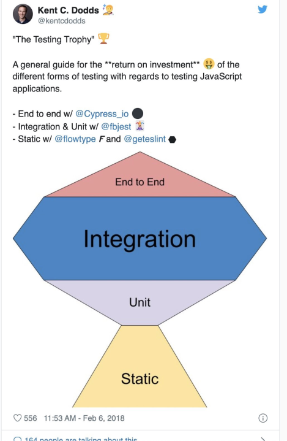
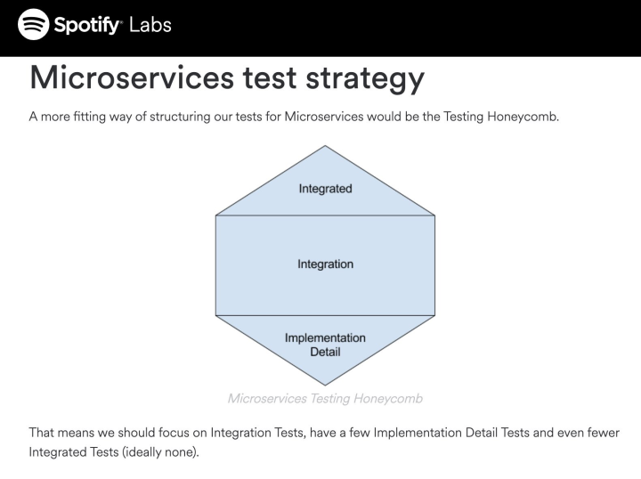
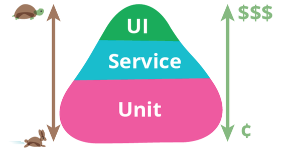
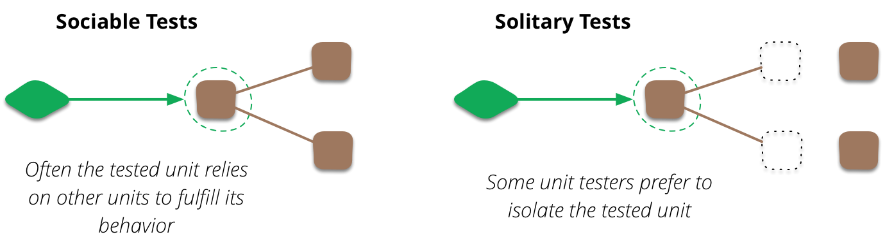

- 원본: [# On the Diverse And Fantastical Shapes of Testing(Martin Fowler, 2021.06.02)](https://martinfowler.com/articles/2021-test-shapes.html)

최근 트위터 등에서 팀이 테스트 노력을 어떻게 분배해야 하는지에 대한 논의가 다시 활발해졌습니다. 특히 팀 브레이는 자동화된 테스팅을 진지하게 받아들여야 한다고 설득력 있게 주장합니다. 제 글에 익숙한 분이라면 제가 그에게 전적으로 동의한다는 것을 아실 것입니다.

그의 게시물에서 그가 제기한 요점 중 하나는 다음 두 이미지와 관련이 있습니다:

이 두 "기형적인 덩어리"(misshapen blobs)는 기존의 테스트 피라미드 이미지에 대한 반응입니다: 

이 이미지들의 요점은 다양한 유형의 테스트, 특히 단위 테스트와 더 광범위한 테스트 사이의 균형에 우리가 기울여야 할 노력의 양을 나타내는 것입니다. 피라미드는 대부분의 테스트를 단위 테스트로 수행해야 한다고 주장하는 반면, 벌집과 트로피는 단위 테스트의 양을 상대적으로 적게 하고 주로 통합 테스트에 집중해야 한다고 말합니다.

이 논의에서 제가 가진 두 번째로 큰 문제는 사람들이 단위 테스트와 통합 테스트의 차이를 무엇으로 보는지 명확하지 않아 논의가 불투명해진다는 것입니다.

"단위 테스트"와 "통합 테스트"라는 용어는 대부분의 소프트웨어 용어의 모호한 기준에 비추어 볼 때도 항상 다소 불분명했습니다. 제가 원래 이해했던 바에 따르면, 이들은 주로 조직적인 문제였습니다. 대규모 폭포수 소프트웨어 프로젝트 시절로 돌아가 봅시다. 저는 몇 달 동안 코드 덩어리를 작업하고 있습니다. 혼자 작업할 수도 있고, 소규모 팀에서 작업할 수도 있습니다. 어느 쪽이든 저는 이 코드 덩어리를 이웃 부분과 상대적으로 분리되어 작업할 수 있는 개념적 단위로 생각합니다. 코딩을 마친 후에는 단위 테스트 팀에 넘겨줄 수 있으며, 그 팀은 그 단위를 단독으로 테스트합니다. 이 테스트가 작동하도록 한두 달이 지난 후에, 우리는 그것을 이웃 부분과 통합하고 시스템의 더 큰 부분, 또는 실제로 전체 시스템에 대해 통합 테스트를 수행할 수 있습니다. 핵심적인 차이점은 단위 테스트는 나/우리의 코드를 **격리하여** 테스트하는 반면, 통합 테스트는 우리의 코드가 **별도로 개발된 코드와 어떻게 작동하는지** 테스트한다는 것입니다.

오늘날 많은 사람들은 [익스트림 프로그래밍](https://martinfowler.com/bliki/ExtremeProgramming.html)(Extreme Programming)의 일환으로 켄트 벡(Kent Beck)이 개척한 Xunit 계열의 테스팅 도구를 통해 단위 테스트를 접하게 되었습니다. 켄트는 "단위 테스트"라는 용어를 개발자가 일상 업무의 일환으로 작성하는 테스트를 지칭하는 데 사용했습니다. 

> 프로그래머는 프로그램의 작동에 대한 자신감이 프로그램 자체의 일부가 될 수 있도록 단위 테스트를 작성합니다. 고객은 프로그램의 작동에 대한 자신감이 프로그램의 일부가 될 수 있도록 기능 테스트를 작성합니다.   
> - 켄트 벡 (익스트림 프로그래밍 해설, 1판)

켄트의 원래 구상에서 "단위 테스트"는 별도의 테스트 팀이 아닌 프로그래머가 작성한 모든 것을 의미한다는 점에 주목하세요. [C3](https://martinfowler.com/bliki/C3.html)에서 우리가 단위 테스트를 작성할 때, 우리는 보통 단일 클래스의 동작에 초점을 맞추곤 했습니다. 하지만 우리는 필요한 모든 의존성을 가지고 해당 객체를 생성하여 메서드를 실행할 수 있도록 테스트 픽스처를 설정했습니다. 다른 객체들도 실행되긴 했지만, 우리는 이 테스트에서는 다른 모든 코드가 올바르게 작동하고 있다고 가정했습니다 (그리고 보통 다른 코드들도 자체 테스트를 가지고 있었습니다).

저는 "단위 테스트"라는 용어의 사용에 대해 상당한 논의가 있었던 것을 기억합니다. 한 테스트 전문가는 켄트의 이러한 용어 사용을 맹렬히 비난했습니다. 우리는 그에게 단위 테스트를 어떻게 정의할 것인지 물었고, 그의 대답은 "제 교육 과정 첫날 오전에 단위 테스트의 24가지 다른 정의를 다룹니다"와 같았습니다. 

(XP에서 영감을 받은 단위 테스트의 초기부터 "단위 테스트"라는 용어를 싫어하고 대신 "마이크로 테스트" 또는 "프로그래머 테스트"와 같은 이름을 사용할 것을 제안하는 사람들이 있었습니다.)

많은 사람들에게 이 문제에서 가장 큰 쟁점은 이러한 의존적인 객체들이었습니다. 만약 제가 주문 객체를 테스트하는데, 이 객체가 고객 객체와 협력한다면, 고객 객체의 버그로 인해 주문 객체 테스트가 실패할 수 있습니다. 이는 협력하는 객체를 모의 객체(mock), 스텁(stub) 또는 다른 종류의 [테스트 더블](https://martinfowler.com/bliki/TestDouble.html)(Test Double)로 대체하는 다른 스타일의 단위 테스트 작성으로 이어졌습니다. 저는 이후 이러한 [단위 테스트](https://martinfowler.com/bliki/UnitTest.html) 스타일을 **사회적**(sociable)이고 **고립적**(solitary)이라고 설명하는 것이 유용하다는 것을 알게 되었습니다.

(제이 필즈(Jay Fields)가 "고립적(solitary)"과 "사회적(sociable)"이라는 용어를 고안했습니다.)

이러한 구분과 얽혀 XP 단위 테스트 관행의 두 가지 학파가 성장했는데, 저는 이를 [**클래식**(classic)과 **모키스트**(mockist)](https://martinfowler.com/articles/mocksArentStubs.html)라고 부릅니다. 클래식 XP 단위 테스트는 우리가 원래 사용했던 사회적 접근 방식을 따르는 반면, 모키스트 스타일은 고립적 테스트를 선호합니다.

그러므로 피라미드(pyramids)와 벌집(honeycombs) 논쟁으로 돌아가서, 벌집과 유사한 형태를 옹호하는 사람들의 글을 읽을 때, 저는 보통 그들이 모의 객체(mocks)의 과도한 사용을 비판하고 그것이 야기하는 다양한 문제에 대해 이야기하는 것을 듣습니다. 이로부터 저는 그들의 "단위 테스트" 정의가 제가 **고립적 단위 테스트**(solitary unit test)라고 부르는 것에 특정적으로 해당한다고 추론합니다. 마찬가지로 그들의 통합 테스트 개념은 제가 **사회적 단위 테스트**(sociable unit test)라고 부르는 것과 매우 흡사하게 들립니다. 이는 제가 들어본 테스트 피라미드에 대한 어떤 설명도 단위 테스트를 사회적이거나 고립적인 것으로 간주하기 때문에, 피라미드 대 벌집 논쟁을 무의미하게 만듭니다.

"단위 테스트"가 엄격하게 정의된 것처럼 보이게 만드는 [통합 테스트](https://martinfowler.com/bliki/IntegrationTest.html)의 정의 때문에 이러한 의미론적 그림은 더욱 혼란스러워집니다. 여기서 얻을 수 있는 교훈은 누군가가 다양한 테스트 범주에 대해 이야기하기 시작할 때, 그들이 사용하는 단어의 의미를 더 깊이 파고들어야 한다는 것입니다. 왜냐하면 당신이 읽었던 것과 똑같은 의미로 그 단어들을 사용하지 않을 것이기 때문입니다.

만약 제 글에 주의를 기울이셨다면, 제가 이전에 단위 테스트와 통합 테스트에 대한 명확성 부족이 벌집/피라미드 논의에서 제가 가진 두 번째로 큰 문제라고 언급했음을 눈치채셨을 것입니다. 제 가장 큰 문제는 다음 인용문으로 잘 요약됩니다.

> 사람들은 어떤 유형의 테스트를 몇 퍼센트 작성해야 하는지에 대해 논쟁하는 것을 좋아하지만, 그것은 주의를 분산시키는 일입니다. 경계를 명확히 설정하고, 빠르고 안정적으로 실행되며, 유용한 이유로만 실패하는 표현력 있는 테스트를 작성하는 팀은 거의 없습니다. 대신 여기에 집중하세요. -- 저스틴 설스(Justin Searls)
