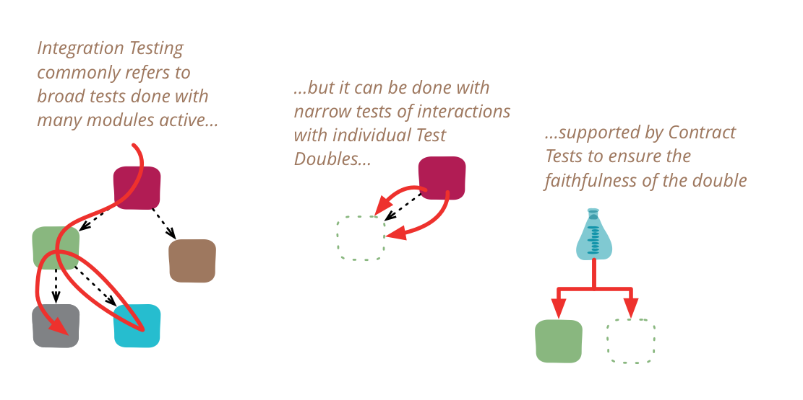

- 원본: [Integration Test(Martin Fowler, 2018.01.16)](https://martinfowler.com/bliki/IntegrationTest.html)

통합 테스트는 독립적으로 개발된 소프트웨어 단위가 서로 연결되었을 때 올바르게 작동하는지 확인합니다. 이 용어는 소프트웨어 산업의 광범위한 기준에 비추어 볼 때도 모호해져서, 제가 글을 쓸 때 사용을 꺼려왔습니다. 특히, 많은 사람들은 통합 테스트가 필연적으로 광범위하다고 가정하지만, 더 좁은 범위로 수행될 때 더 효과적일 수 있습니다.

이런 경우들이 종종 그렇듯이, 역사를 조금 살펴보는 것이 가장 좋습니다. 제가 통합 테스트에 대해 처음 배웠을 때, 1980년대였고 폭포수 모델이 소프트웨어 개발 사고의 지배적인 영향을 미치고 있었습니다. 대규모 프로젝트에서는 시스템의 다양한 모듈의 인터페이스와 동작을 명세하는 설계 단계가 있었습니다. 모듈은 개발자들이 프로그래밍하도록 할당되었습니다. 한 프로그래머가 단일 모듈을 담당하는 것이 드물지 않았지만, 이 모듈은 몇 달이 걸릴 정도로 충분히 컸습니다. 이 모든 작업은 독립적으로 이루어졌고, 프로그래머가 작업이 완료되었다고 믿으면 QA에 넘겨 테스트를 진행했습니다.

테스트의 첫 부분은 단위 테스트로, 설계 단계에서 만들어진 명세에 따라 해당 모듈 자체를 테스트하는 것이었습니다. 일단 이 작업이 완료되면, 통합 테스트로 넘어가 다양한 모듈을 전체 시스템 또는 중요한 서브시스템으로 결합했습니다.

이름이 시사하듯이, 통합 테스트의 요점은 **여러 개별적으로 개발된 모듈이 예상대로 함께 작동하는지 테스트하는 것**입니다. 이는 많은 모듈을 활성화하고 그 모든 모듈에 대해 더 높은 수준의 테스트를 실행하여 함께 작동하는지 확인하는 방식으로 수행되었습니다. 이러한 모듈은 단일 실행 파일의 일부일 수도 있고, 독립적일 수도 있습니다.

2010년대의 관점에서 보면, 이것들은 두 가지 다른 것을 혼동했습니다:

• 개별적으로 개발된 모듈이 제대로 함께 작동하는지 테스트하는 것

• 여러 모듈로 구성된 시스템이 예상대로 작동하는지 테스트하는 것

이 두 가지는 혼동하기 쉬웠습니다. 결국, 쇼핑 카트와 카탈로그 모듈을 모두 단일 환경에서 활성화하고 두 모듈을 모두 사용하는 테스트를 실행하지 않고는 어떻게 테스트할 수 있었겠습니까?

2010년대의 관점은 1980년대에는 거의 고려되지 않았던 또 다른 대안을 제시합니다. 이 대안에서는 쇼핑 카트와 카탈로그 모듈의 통합을 쇼핑 카트 코드 중 카탈로그와 상호작용하는 부분을 **카탈로그의 [테스트 더블](https://martinfowler.com/bliki/TestDouble.html)(TestDouble)에 대해 실행**함으로써 테스트합니다. 테스트 더블이 카탈로그의 충실한 복제본이라면, 전체 카탈로그 인스턴스를 활성화하지 않고도 카탈로그의 모든 상호작용 동작을 테스트할 수 있습니다. 이것은 모놀리식 애플리케이션의 별도 모듈인 경우에는 큰 문제가 아니지만, 카탈로그가 자체 빌드 도구, 환경 및 네트워크 연결을 필요로 하는 별도 서비스인 경우에는 큰 문제가 됩니다. 서비스의 경우, 이러한 테스트는 인-프로세스 테스트 더블에 대해 실행되거나, Mountebank와 같은 것을 사용하여 와이어를 통한 더블에 대해 실행될 수 있습니다.

더블에 대해 통합 테스트를 수행할 때의 명백한 문제는 그 더블이 진정으로 충실한가 하는 것입니다. 그러나 이는 [계약 테스트](https://martinfowler.com/bliki/ContractTest.html)(ContractTests)를 사용하여 별도로 테스트할 수 있습니다.

좁은 범위의 통합 테스트와 계약 테스트를 이 조합으로 사용하면, 실제 서비스 인스턴스에 대해 테스트를 실행하지 않고도 외부 서비스와의 통합에 확신을 가질 수 있으며, 이는 빌드 프로세스를 크게 용이하게 합니다. 이렇게 하는 팀은 여전히 모든 실제 서비스를 사용하는 일종의 엔드투엔드 시스템 테스트를 수행할 수 있지만, 그렇더라도 매우 제한된 경로만 테스트하는 최종 스모크 테스트에 불과합니다. 또한 [프로덕션 환경에서의 성숙한 QA 역량](https://martinfowler.com/articles/qa-in-production.html)을 갖추는 것도 도움이 되며, QA 역량이 충분히 성숙하다면 엔드투엔드 시스템 테스트가 전혀 수행되지 않을 수도 있습니다.

문제는 우리가 (최소한) 통합 테스트를 구성하는 두 가지 다른 개념을 가지고 있다는 것입니다. 

좁은 통합 테스트(narrow integration tests)

• 내 서비스에서 별도 서비스와 통신하는 코드 부분만 실행합니다.
• 해당 서비스의 테스트 더블을 사용합니다 (인-프로세스 또는 원격).
• 따라서 단위 테스트보다 범위가 크지 않은 (일반적으로 단위 테스트와 동일한 테스트 프레임워크로 실행되는) 많은 좁은 범위의 테스트로 구성됩니다.

넓은 통합 테스트(broad integration tests)

• 모든 서비스의 라이브 버전을 필요로 하며, 상당한 테스트 환경과 네트워크 접근이 필요합니다.
• 상호작용을 담당하는 코드뿐만 아니라 모든 서비스를 통과하는 코드 경로를 실행합니다.

그리고 "통합 테스트"가 "넓은 통합 테스트"만을 의미한다고 생각하는 상당수의 소프트웨어 개발자들이 있으며, 이로 인해 좁은 방식을 사용하는 사람들과 마주쳤을 때 많은 혼란을 야기합니다.

만약 유일한 통합 테스트가 넓은 범위의 테스트라면, 좁은 스타일을 탐구하는 것을 고려해야 합니다. 이는 테스트 속도, 사용 편의성 및 복원력을 크게 향상시킬 가능성이 높기 때문입니다. 좁은 통합 테스트는 범위가 제한적이므로 매우 빠르게 실행되는 경우가 많아, [배포 파이프라인](https://martinfowler.com/bliki/DeploymentPipeline.html)(DeploymentPipeline)의 초기 단계에서 실행될 수 있으며, 문제가 발생했을 때 더 빠른 피드백을 제공합니다.

이러한 용어 혼란만으로도 충분하지 않은데, 2010년대 후반에 또 다른 "통합 테스트" 용법이 생겨나면서 상황이 악화되었습니다. 이는 단위 테스트의 의미가 분기되면서 발생했습니다. 어떤 사람들은 단위 테스트를 제가 '고립된 단위 테스트(solitary unit test)'라고 부르는 방식으로 정의하는데, 이는 테스트 대상 이외의 모든 프로그램 요소가 테스트 더블로 대체되는 것을 의미합니다. 이러한 좁은 정의를 기반으로 일부 저자들은 "통합 테스트"를 '사교적인 단위 테스트(sociable unit tests)'를 의미한다고 정의합니다.

이 모든 것이 제가 "통합 테스트"란 단어의 사용을 경계하는 이유입니다. 제가 이 용어를 읽을 때, 저자가 실제로 어떤 종류를 의미하는지 알기 위해 더 많은 문맥을 찾습니다. 제가 넓은 통합 테스트에 대해 이야기할 때는 "시스템 테스트" 또는 "E2E 테스트"라는 용어를 선호합니다. 좁은 통합 테스트에 대해서는 더 나은 이름이 없으므로 그 용어를 사용합니다.("좁은"이라는 단어를 붙여서 독자에게 그 특성을 이해시키려고합니다.) 저는 두 가지 종류의 "단위 테스트"는 구분이 필요할 때만 '고립된/사교적인'이라는 용어를 사용합니다.
