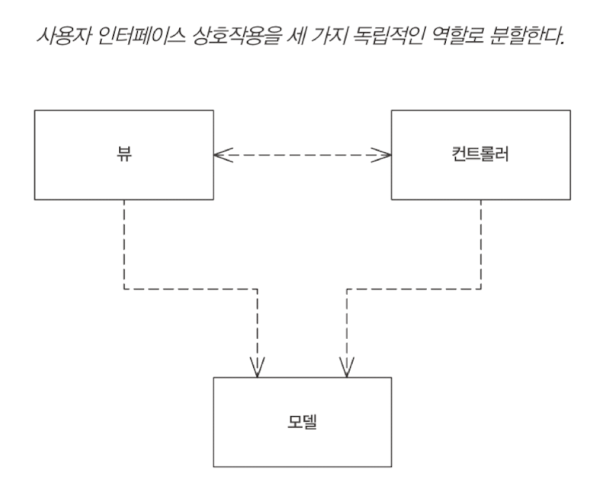
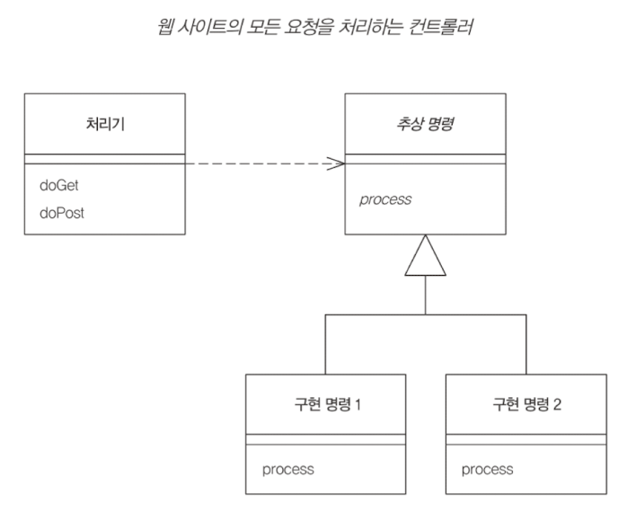
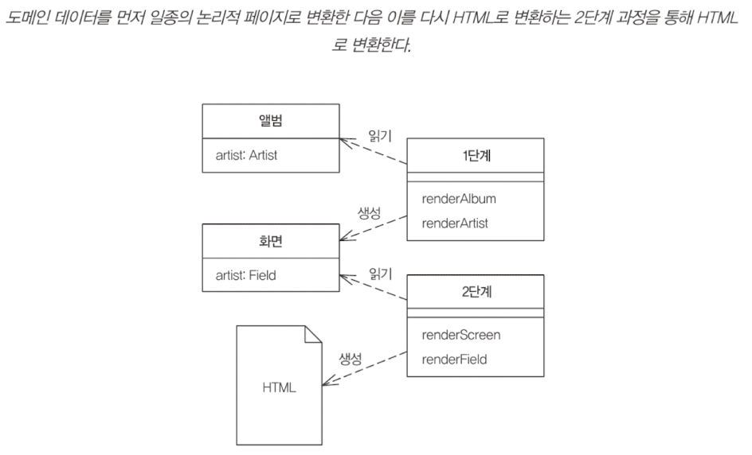
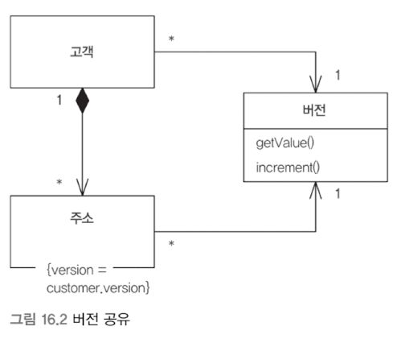

애플리케이션 아키텍처는 회사마다 세부적으로는 다르지만, 비슷한 양상을 띈다. 

- 프레젠테이션 계층
- 비즈니스 로직 계층
- 데이터 액세스 계층

마틴 파울러는 **엔터프라이즈 애플리케이션 아키텍처 패턴**(Patterns of Enterprise Application Architecture, P of EAA)을 체계적으로 정리하고 개념화 했다.

- Fowler, M. (2002). _Patterns of enterprise application architecture_. Addison-Wesley.

마틴 파울러가 EAA를 정립한 이후, 다양한 엔지니어들의 실무 경험과 기술 발전을 거쳐 현재의 일반적인 아키텍처 패턴으로 정착되었다. 이 글에서는 다음과 같은 이야기를 해볼 것이다.

- layered architecture
- context - session, transaction
- concurrency
- distributed environment
- etc..

---

## 계층화 (layering)

> 계층화(layering)는 소프트웨어 설계자가 복잡한 소프트웨어 시스템을 분할하는 데 사용하는 일반적인 기법이다. (1)

계층(layer)과 티어(tier)는 다르다. 티어는 일반적으로 물리적 분리를 함축한다. 일반적인 티어는 다음과 같을 것이다.

- 클라이언트 티어
- 서버 애플리케이션 티어
- 데이터베이스 티어

마틴 파울러는 계층을 다른 시스템에서 실행할 필요가 없음을 강조하는 의미로서 사용한다. 다음은 그가 이야기하는 세 계층이다.

| 계층           | 역할                                                                            |
| ------------ | ----------------------------------------------------------------------------- |
| presentation | 서비스 제공, 정보 표시(창 또는 HTML), 사용자 요청(마우스 클릭, 키 누름), HTTP 요청, 명령줄 호출, 일괄 작업 API 처리 |
| domain       | 시스템의 핵심이 되는 논리. 비즈니스 논리(business logic)                                       |
| data source  | 데이터베이스, 메시징 시스템, 트랜잭션 관리자 및 다른 패키지와의 통신                                       |

---

### 도메인 계층

비즈니스 논리라고도 하는 도메인 논리(domain logic)을 담는 계층이다. 이 논리는 애플리케이션이 수행해야 하는 도메인과 관련된 작업이다. 입력과 저장된 데이터를 바탕으로 계산, 프레젠테이션에서 받은 데이터의 유효성 검사, 프레젠테이션에서 받은 명령을 기준으로 작업 대상이 될 데이터 원본 논리를 결정하는 등의 작업을 한다.

#### 도메인 논리

도메인 논리는 다음과 같은 유형을 띈다.

- **트랜잭션 스크립트**
- **도메인 모델**
- **테이블 모듈**

##### 트랜잭션 스크립트

도메인 논리를 구현하는 **가장 간단**한 방식이다. 그저 **절차적으로 비즈니스 로직을 작성**한다. 프레젠테이션에서 입력을 받고, 유효성 검사와 계산을 통해 입력을 처리하고, 데이터베이스에 데이터를 저장하고, 다른 시스템에 작업을 호출하는 프로시저 형식이다. 필요에 따라 응답을 구성하고 서식을 지정하는 계산을 더 수행한 뒤, 프레젠테이션에 응답할 것이다.

이 패턴은 작업 또는 비즈니스 트랜잭션마다 스크립트 하나를 만드는 패턴으로 볼 수 있다.

모든 코드가 인라인 프로시저일 필요는 없다. 코드를 **서브 루틴**으로 분리하고 **다른 트랜잭션 스크립트와 공유**할 수 있다.

행 데이터 게이트웨이나 테이블 데이터 게이트웨이를 적용해 데이터 원본 계층과 함께 사용하기에 적합하다.

- **데이터 게이트웨이**: SQL 접근을 도메인 논리로부터 분리한 개별 클래스
  - **행 데이터 게이트웨이**: 쿼리가 반환하는 각 행에 대한 각각의 인스턴스
  - **테이블 데이터 게이트웨이**: 데이터베이스 테이블의 구조를 바탕으로 구성한 클래스. 데이터베이스를 쿼리하고 레코드 집합을 반환하는 메서드를 제공해준다.

다만, 도메인 논리가 늘어나면, **복잡도가 기하급수적으로 상승한다**.
또한 여러 트랜잭션이 비슷한 작업을 수행해야 하므로, **코드의 중복이 많아진다**. 공통 서브루틴으로 뽑아내서 이런 문제를 해결할 수 있지만, 코드의 **복잡성은 더 커지고 만다**.


이런 문제를 해결하기 위한 대안이 객체지향적 방법인 도메인 모델이다.

##### 도메인 모델

도메인의 유비쿼터스 언어를 이용하여 모델을 구축한다. 모델의 속성과 메서드가 도메인의 실제 비즈니스 로직과 동일한 언어로 작성한다.

객체는 트랜잭션의 모든 작업 논리를 처리하지 않는다. 각 객체는 관련된 일부 논리만을 담당한다. 도메인 모델(업무 로직)에 익숙하지 않다면, 여러 객체 사이에서 상당한 어려움을 겪을 것이다.


도메인 모델에 익숙해지면, 복잡한 논리를 체계적으로 관리할 수 있는 다양한 기법의 활용이 가능해진다. 예컨데 정책에 대한 다형성을 형성할 수 있다. 트랜잭션 스크립트는 매 정책에 대해 중복 로직과 복잡한 분기를 형성해야 할 것이다.

도메인 모델이 풍성해질수록 객체지향 모델과 관계형 데이터베이스 간의 불일치 문제(O/R impedance mismatch)로 인해 매핑 복잡성이 증가한다. ORM을 사용하면 객체-관계 임피던스 불일치 문제를 완화할 수 있지만, 성능 최적화, Lazy Loading, 캐싱과 같은 추가적인 고려가 필요하다. 대신 정교한 데이터 원본 계층은 거의 고정 비용이므로, 상당한 비용이나 시간을 들여 한번만 제대로 만들면 유지보수성을 크게 높일 수 있다.

##### 테이블 모듈

언뜻 보기에 도메인 모델과 비슷해 보인다. 테이블 모듈은 객체 모델을 기반으로 하지 않고 테이블 단위의 데이터를 관리하는 방식이다. 도메인 모델이 각 레코드마다 객체를 갖는다면, 테이블 모듈은 하나의 인스턴스가 테이블 전체를 다룬다.


테이블 모듈은 레코드 집합과 함께 사용된다. 먼저 쿼리를 수행해 레코드 집합을 얻고, 이 레코드 집합을 이용해 다시 새로운 테이블 모듈을 만든다.

테이블 모듈은 트랜잭션 스크립트와 도메인 모델의 중간적인 성격을 띤다. 프로시저로만 작업하지 않고 테이블 기준으로 도메인 논리를 구성하기 때문에 구조 형성과 중복 제거가 수월하다. 하지만 도메인 모델처럼 객체지향 패턴을 이용한 논리 구조를 만들 수 없다.


세 가지 패턴에는 트레이드 오프가 있다. 도메인 논리의 복잡도를 예측하고 방안을 구성해봐야 할 것이다.


개발 팀이 도메인 모델에 익숙하다면, 도메인 모델에 대한 초기 비용을 낮출 수 있다. (물론 그럼에도 다른 패턴보다 어렵다.) 대체적으로 개발 팀의 수준이 높으면 도메인 모델을 선호할 것이다.

#### 서비스 계층

유스케이스 컨트롤러(use-case controller, MVC의 애플리케이션 컨트롤러와는 다르다)

도메인 논리를 처리하는 일반적인 방법은 도메인 계층을 둘로 나누는 것이다. 이 경우 서비스 계층을 기반이 되는 도메인 모델이나 테이블 모듈 위에 배치한다.

서비스 계층은 애플리케이션의 API 역할을 하게 되며, 프레젠테이션 계층과 단독으로 상호작용한다.


서비스 계층은 비즈니스 로직을 캡슐화하여 명확한 API를 제공하며, 유스케이스를 조정하고 실행 흐름을 관리하는 역할을 한다. 서비스 계층을 파사드로 만들고 모든 실제 동작을 기반 객체에 넣은 다음, 서비스 계층이 파사드에 대한 호출을 하위 객체로 전달하게 하는 것이다.

서비스 계층에 얼마나 많은 동작을 넣을지 결정하는 것인 중요하다. 
다음과 같은 역할을 선택할 수 있다.

-  트랜잭션 래퍼와 보안 검사를 추가한다.
- 비즈니스 논리를 트랜잭션 스크립트 형태로 서비스에 넣는다.

도메인 모델을 사용하기로 결정했다면, 서비스 객체에 비즈니스 논리를 넣지 않는 것이 좋다. 트랜잭션 스크립트와 마찬가지로 코드 중복을 많이 유발하게 된다. 마틴 파울러는 굳이 이 계층을 고정적인 계층으로 만들 이유는 없다고 했다.

#### 데이터 매핑

마틴 파울러는 ORM의 정립에도 많은 기여를 했다.

1부 3장, 2부 11장, 12장, 13장이 그것인데
이는 조영호 연사님의 JPA 사실과 오해 강의에 대한 정리와 회고글에서 같이 정리하겠다.

#### 리포지토리 Repository

도메인 모델이 포함된 시스템은 도메인 객체를 데이터베이스에 접근하는 코드와 관심사 분리하여 격리하기 위해 데이터 매퍼가 제공하는 것과 같은 추상 계층을 활용하게 된다.

도메인과 데이터 매핑 계층 사이를 중재하여, 인메모리 도메인 객체 컬렉션과 비슷하게 동작한다.


---

### 프레젠테이션 계층

입력 컨트롤러(input controller, MVC의 컨트롤러와는 다르다)

- 서버 페이지
- 스크립트 스타일

입력 컨트롤러는 요청을 받고 요청에서 정보를 꺼낸다. 그 다음 비즈니스 논리를 적절한 모델 객체로 전달한다. 모델 객체는 데이터 원본 객체와 통신하고 요청에 명시된 모든 작업을 수행한 다음 응답에 필요한 정보를 수집한다. 작업이 완료되면 입력 컨트롤러로 제어를 반환한다. 입력 컨트롤러는 결과를 조사하고 응답을 표시하는 데 필요한 뷰를 결정한다. 입력 컨트롤러는 응답 데이터와 함께 제어를 뷰로 전달한다.


MVC를 적용하는 가장 중요한 이유는, 모델을 웹 프레젠테이션으로부터 완전히 분리하기 위해서다. 프레젠테이션 객체를 도메인 객체로부터 분리하기 위해 애플리케이션 컨트롤러(MVC의 컨트롤러)라는 중간 계층을 사용한다.

애플리케이션 컨트롤러는 애플리케이션의 흐름을 처리하고 어떤 화면을 어떤 순서로 표시할지 결정하는 역할을 한다. 이 계층은 프레젠테이션 계층의 일부로 볼 수도 있지만 도메인 계층을 조정하는 별도 계층이라고 생각할 수도 있다.

#### 뷰

뷰를 이야기하면, MVC를 빼놓을 수 없다.

##### MVC, Model View Controller

1970년대 후반 Trygve Reenskaug가 스몰토크 플랫폼용 프레임워크로 처음 개발했다. 이 패턴은 모든 UI 프레임워크와 UI 설계에 중요한 역할을 했다.



- **모델**(model): 도메인에 대한 정보를 나타내며, UI에 직접 사용되지 않는 모든 데이터와 동작을 포함하는 비시각적인 객체. 객체지향에서 모델은 도메인 모델 안에 위치하는 객체에 해당한다.
  - UI 관련 기능을 포함하지 않는 트랜잭션 스크립트도 모델이라고 할 수 있다.
- **뷰**(view): UI에서 모델을 표시하는 역할. 예컨데, 모델이 고객 객체라면 뷰는 UI 컴포넌트가 포함된 웹 페이지 프레임이나 모델의 정보를 표시하는 HTML 페이지일 수 있다. 뷰는 정보 표시하는 역할만 한다.
- **컨트롤러**(controller): 정보의 모든 변경 사항을 처리. 사용자로부터 입력을 받고, 모델을 조작하고, 뷰를 적절하게 업데이트하는 역할을 한다.

뷰의 컨트롤러에는 다음 두 가지가 있다.

- 페이지 컨트롤러
- 프런트 컨트롤러

(두 가지 패턴은 요즘의 프런트엔드-백엔드 분리 패턴에서 프런트엔드에서 대체되었지만, 그 아이디어는 프런트엔드 곳곳에 스며들어있다.)

##### 페이지 컨트롤러

특정 페이지나 동작에 대한 요청 처리. 각 논리적 페이지마다 입력 컨트롤러를 하나 이상이 있어야 한다.


##### 프런트 컨트롤러

요청과 동작의 파편화를 막기 위해, 모든 요청을 **단일 처리기** 객체로 집중한다. 처리기는 **명령 객체**로 페이지 작업을 처리한다.




뷰의 렌더링에는 세 가지 패턴이 있다.

- 변환 뷰
- 템플릿 뷰
- 2단계 뷰

(이 또한.. 프런트엔드로...)

##### 템플릿 뷰

동적 웹 페이지를 생성하기 위해 표시자를 추가하는 패턴
(굳이 비교하면, Vue.js 가 흡사할 것이다.)


##### 변환 뷰

도메인 데이터를 받아, HTML로 변환하는 프로그램을 작성하는 것

템플릿 뷰와의 차이는 뷰가 구성되는 방법에 있다. 템플릿 뷰는 출력을 기준으로 구성된다. 반면 변환 뷰는 입력 요소의 각 유형별 변환을 기준으로 구성된다. (HTML의 모습이 많이 달라질 수 있다는 것)


##### 2단계 뷰

템플릿 뷰에도, 변환 뷰에도 같이 쓰일 수 있는 방법이다.

전체 사이트의 외형과 구조는 일관성을 원하는 경우가 많다. 페이지의 모양이 다르면 사이트 이용자는 혼란을 느낄 것이다. 여러 페이지의 중복되는 과정과 일괄적 변경을 용이하게 하기 위한 방안이다.

변환을 두 단계로 나눈다. 

1. 데이터를 특정한 형식 지정 없이 논리적 프레젠테이션으로 모델링한다.
2. 논리적 프레젠테이션에 실제 필요한 형식으로 변환한다.




단점은 다음과 같다.

- 디자인이 프레젠테이션 기반 구조에 제한을 받는다.
- 별도의 툴을 사용해야 한다. 렌더러와 컨트롤러 객체를 필요로 한다.

##### 애플리케이션 컨트롤러

모델을 대상으로 실행할 명령과 애플리케이션의 상태에 따라 사용할 올바른 뷰에 대한 정보를 제공한다.


---

애플리케이션에는 프레임워크적인 계층 외에도 컨텍스트도 고려할 부분이 있다.

> **컨텍스트는** 작업에서 사용하는 최소 데이터 세트로, 작업을 중단하고 나중에 동일한 지점에서 계속할 수 있도록 저장해야 합니다. 컨텍스트 개념은 중단 가능한 작업의 경우에 중요하며, 중단되면 프로세서가 컨텍스트를 저장하고 인터럽트 서비스 루틴을 제공합니다 . 따라서 컨텍스트가 작을수록 대기 시간이 짧아집니다. - 컨텍스트(컴퓨팅) wiki

## 컨텍스트 (context)

실행 컨텍스트의 종류는 다음과 같다.

- 외부
  - 요청 (request)
  - 세션 (session)
- 운영체제
  - 프로세스 (process)
  - 스레드 (thread)
- 데이터베이스
  - 트랜잭션 (transaction)

### 세션 (session)

외부 세계와 상호작용하는 관점에서 중요한 두 가지 컨텍스트가 있다. 요청과 세션이다.

- **요청**(request): 소프트웨어가 작업하고 선택적으로 응답을 보내야 하는 외부 세계로부터의 단일 호출
- **세션**(session): 클라이언트와 서버 간에 오랫동안 실행되는 상호작용. 세션은 하나의 요청만 포함할 수도 있지만, 하나 이상의 비즈니스 트랜잭션을 수행하는 다양한 작업의 논리적 흐름의 일련의 요청으로 이루어짐

세션은 다음 종류가 있다

- **클라이언트 세션**: 세션 상태를 클라이언트에 저장한다. URL 매개변수, 숨겨진 필드, 쿠키 세가지 방법이 있다.
- **서버 세션**: 세션 상태를 직렬화된 형식으로 서버 시스템에 저장한다. 애플리케이션 서버의 메모리에 세션 객체를 저장하는 것이다.
- **데이터베이스 세션**: 세션 데이터를 데이터베이스에 커밋된 데이터로 저장한다.

### 트랜잭션 (transaction)

- 시스템 트랜잭션: 애플리케이션에서 데이터베이스로 수행
- 비즈니스 트랜잭션: 사용자에게서 애플리케이션으로 수행

트랜잭션 격리성

| 격리 수준            | Dirty Read | Not Repeatable Read | Phantom Read |
| ---------------- | ---------- | ------------------- | ------------ |
| READ UNCOMMITTED | o          | o                   | o            |
| READ COMMITTED   | x          | o                   | o            |
| REPEATABLE READ  | x          | x                   | o            |
| SERIALIZABLE     | x          | x                   | x            |

---

## 동시성 (concurrency)

애플리케이션의 동시성은 크게 두가지가 있다.

- **오프라인 동시성**(offline concurrency): 여러 데이터베이스 트랜잭션에 걸쳐 조작되는 데이터에 대한 동시성 제어
- 다중 스레드를 지원하는 애플리케이션 서버 시스템의 동시성 (다만 여기서 발생하는 문제는 대처하기가 수월하다.)

**경합**(race condition)이 발생하면 다음과 같은 동시성 문제가 나타날 수 있다.

- **손실된 업데이트**(lost update): 하나의 스레드가 읽고 수정하는 사이의, 다른 스레드의 수정은 손실된다.
- **일관성 없는 읽기**(inconsistent read): 하나의 스레드가 여러 데이터를 읽는 사이, 다른 스레드의 수정이, 읽는 정보를 오염시킨다.

동시성 문제를 해결하기 위해서는 정합성(consistency)과 활동성(liveness) 두가지를 모두 생각해야 한다.

### 동시성 해결 방안

- **격리** (isolation)
- **불변성** (immutable)

격리할 수 없는 변경 가능한 데이터는 어떻게 처리해야 할까?

#### 잠금 (lock)

- 낙관적 락 (optimistic locking)
- 비관적 락 (pessimistic locking)

##### 낙관적 오프라인 잠금

한 세션에서 커밋하려는 변경 내용이 다른 세션의 변경 내용과 충돌하지 않는지 확인하는 방법이다. 성공적인 커밋 전 유효성 검사는 레코드 데이터에 대한 변경을 진행해도 좋다는 의미의 잠금을 얻는 것이다. 유효성 검사와 업데이트가 단일 시스템 트랜잭션 내에서 수행될 때 트랜잭션은 일관성을 유지한다.

충돌 가능성이 낮다고 간주할때 사용한다. 때문에 여러 사용자가 동시에 동일한 데이터를 가지고 작업하도록 허용할 수 있다.

구현하는 가장 일반적인 방법은 시스템의 각 레코드에 버전 번호를 붙이는 것이다. 레코드가 로드되면 이 번호는 다른 모든 세션 상태와 함께 세션에 의해 유지된다. 낙관적 오프라인 잠금을 얻는다는 것은 세션 데이터에 저장된 버전을 레코드 데이터의 버전과 비교하는 것을 의미한다. 버전 증가는 이전 버전을 가진 세션이 잠금을 얻지 못하게 함으로써 레코드 데이터의 일관성을 보호한다.


다른 구현 방식으로 UPDATE 문의 where 절에 행의 모든 필드를 포함하는 방법이 있다. 이 방식은 버전 필드를 추가할 수 없을 때 유용하다. 단, where 절이 커질 수 있으며, 인덱스 사용하는 방법에 따라 성능에 영향을 줄 수 있다.


사용자가 작업을 완료하고 커밋할 때가 돼서야 작업이 실패했다고 알리는 것은 사용자 친화적인 방식이 아니다. 충돌 가능성이 높거나 충돌의 결과를 받아들일 수 없는 경우 비관적 오프라인 잠금을 사용하는 것이 바람직하다.

##### 비관적 오프라인 잠금

> 오프라인 동시성을 관리한다는 것은 여러 요청에 걸쳐 수행되는 비즈니스 트랜잭션의 데이터를 관리하는 것을 의미하므로 가장 간단한 방법은 비즈니스 트랜잭션이 수행되는 동안 시스템 트랜잭션을 개방하는 것이다. 아쉽게도 트랜잭션 시스템은 장기 실행 트랜잭션에 맞게 설계되지 않았기 때문에 이 방법을 항상 적용할 수는 없다. 따라서 여러 시스템 트랜잭션을 사용해야 하며, 데이터에 대한 동시 접근을 관리하는 책임은 여러분이 직접 맡아야 한다.

비관적 오프라인 잠금은 충돌을 미연에 방지한다. 작업이 시작될 때 대상 데이터에 대한 잠금을 획득함으로써 비즈니스 트랜잭션을 시작하면, 동시성 제어 문제 때문에 작업이 실패하는 경우가 거의 없음을 확신할 수 있다.


잠금 유형에는 여러 옵션이 있다.

- **배타적 쓰기 잠금**(exclusive write lock): 세션 데이터를 편집하는 경우 비즈니스 트랜잭션이 잠금을 얻도록 요구하는 것. 동시에 두 비즈니스 트랜잭션이 동일한 레코드를 변경하지 못하게 막는다. 데이터 읽기 관련된 문제는 무시된다.
- **배타적 읽기 잠금**(exclusive read lock): 비즈니스 트랜잭션의 편집 여부와 관계없이 항상 최신 데이터를 읽어야 하는 경우. 비즈니스 트랜잭션이 단지 레코드를 로드할때도 잠금을 얻어야 한다. 시스템의 동시성을 심각하게 제한할 수 있으므로 대부분의 엔터프라이즈 시스템에서는 사용하지 않는다.
- **읽기/쓰기 잠금**(read/write lock): 두 잠금 유형을 결합해 향상된 동시성을 제공하는 방식. 읽기 잠금과 쓰기 잠금은 상호배타적이다. 다른 비즈니스 트랜잭션이 읽기 잠금을 보유한 레코드에 대해서 쓰기 잠금을 얻을 수 없다. **동시 읽기 잠금은 허용**된다. 읽기 잠금을 보유한 레코드에 대해서 읽기 잠금을 얻을수는 있지만, 쓰기 잠금을 보유한 레코드에 대해서는 어떤 잠금도 얻을 수 없다. 다수의 읽기 잠금이 허용되므로 동시성이 향상된다.

올바른 잠금 유형을 선택할 때 고려 사항은 시스템의 동시성 극대화, 비즈니스 요건 충족, 코드의 복잡성 최소화다. 잠금은 단순히 기술적 문제가 아니다. 잘못된 잠금 전략을 올바른 기술 구현으로 해결할 수 없다.

잠금 대상은 **잠금 시기**에 의해 결정된다. 잠금은 비즈니스 트랜잭션이 **데이터를 로드하기 전에 잠금을 획득해야 한다**. 잠근 데이터의 **최신 버전을 얻는다는 보장이 없다면, 잠금을 획득할 필요가 없다**.

잠그는 **대상**을 고려해보자. 객체나 레코드를 잠그지 않는다. 실제로는 **식별자**(ID나 기본 키)를 잠근다. 이렇게 해야 로드하기 전에 잠금을 획득할 수 있다.

잠금 **해제**에 대한 간단한 규칙은 비즈니스 트랜잭션이 완료되면 잠금을 해제하는 것이다. 완료 이전에 잠금을 해제하려는 것은 잠금 유형과 트랜잭션 내에서 객체를 다시 사용하려는 의도에 따라서 허용할 것이다. 그러나 명확한 이유가 아니면, 트랜잭션이 완료됐을 때 해제하자.

가능하면 사용자가 작업을 시작하기 전에 모든 필요한 잠금을 획득하게 하는 것이 좋다.

잠금 관리의 직렬 특성은 성능 병목현상을 유발한다. 여기서 생각해볼 수 있는 것이 **잠금 세분성**(lock granularity)이다. 잠금의 수를 줄일수록 병목현상이 적게 발생하므로, 굵은 입자 잠금으로 잠금 테이블 경합을 완화할 수 있다.

잠금을 기다리는 것은 현명한 일이 아니다. 교착상태를 일으킬 수도 있다. 잠금을 사용할 수 없으면 곧바로 예외를 발생시킨다면, 시스템의 복잡성을 덜 수 있다.

손실된 세션에 대한 잠금 시간 제한도 고려한다. 클라이언트 시스템이 트랜잭션 중간에 강제 종료된 경우 이 트랜잭션은 완료될 수 없다. 때문에 시간제한을 애플리케이션 서버에서 관리하는 시간 제한 메커니즘을 사용하는 것이 좋다. HTTP 세션이 무효화되면 모든 잠금을 해제하는 유틸리티 객체를 등록하는 방법으로 시간 제한을 구현할 수 있다. 다른 방법은 각 잠금에 타임스탬프를 두고 특정 기간보다 오래된 잠금은 무효화하는 것이다.

비관적 잠금은 교착상태 가능성이 항상 있기 때문에 반드시 낙관적 잠금을 보완하는 방법임을 기억하고, 필요할때만 써야 한다.

또한 비관적 오프라인 잠금을 사용 대신 **장기 트랜잭션**(long transaction)도 고려해야 한다. 장기 트랜잭션은 절대 바람직하지 않지만 경우에 따라 비관적 오프라인 잠금도 이보다 나을 것이 없을 수 있으며, 프로그래밍하기는 훨씬 쉽다. 대신 부하 테스트를 해보는 것이 좋겠다.

##### 굵은 입자 잠금 (Coarse-Grained Lock)

여러 객체가 하나의 그룹으로 편집될 경우가 있을 것이다.(애그리거트) 이 경우 이런 항목 중 하나를 잠글 때, 연관된 항목 모두 잠그는 것이 이치에 맞다. 개별 객체에 일일히 잠금을 유지하려면 관리 포인트가 너무 많다. 프레임워크에서 잠금 획득을 관리하려면 어떻게 해야할까?

굵은 입자 잠금은 여러 객체를 다룰 수 있는 단일 잠금이다. 그룹을 잠그기 위해 모든 멤버를 로드할 필요도 없고, 잠금 동작 자체를 간소화한다.


그룹을 잠그기 위한 단일 경합 지점을 만드는 것이다. 이를 통해 단 하나의 잠금으로 전체 그룹을 잠글 수 있다. 그리고 이 단일 잠금 지점에 대한 최단 경로를 제공하면 된다.

**공유된 낙관적 오프라인 잠금**의 경우 단일 경합 지점을 통해 버전을 관리한다. **공유 락**(shared lock)으로 그룹 전체가 잠긴다. 




**공유된 비관적 오프라인 잠금**의 경우 **잠금 가능 토큰**(lockable token)을 공유한다.

혹은 DDD에서는 집합체(aggregate)와 경계(boundary)에 대한 접근 지점을 루트(root)라고 한다. 이 부근에 잠금을 부여하면 된다. 이를 **루트 잠금**(root lock)이라 한다.


##### 암시적 잠금 (Implicit Lock)

잠금 획득 코드 한줄 깜박하면, 전체 오프라인 잠금 체계가 무력화될 수 있다. 제대로 읽기 잠금을 얻으려 하지 않거나, 버전 카운트를 제대로 하지 않거나 할 수 있다. 잠금을 제대로 해제하지 않으면 생산성이 떨어진다. 또한 오프라인 동시성 관리는 테스트가 까다로워 테스트에서 감지되지 않을 확률이 높다.

이런 실수를 아예 할 수 없게, 애플리케이션이 암시적으로 처리하는 것이 암시적 잠금이다. 프레임워크, 계층 상위 형식, 코드 생성의 조합을 활용하여 암시적 잠금을 구현한다.


---

## 분산 환경 (distributed environment)

### 원격 파사드 (Remote Facade)

애플리케이션에서는 **가는 입자**(fine grained) 단위가 유용하다. 분산된 상황에서는 다르다. 네트워크를 포함하여 여러가지 변인을 생각해 보았을 때, **굵은 입자**(coarse grained) 단위가 유리할 것이다.

- **grain**은 **곡식을 낱알로 만드는 작업**을 의미한다. 이 작업을 듬성듬성 할지, 곱게 할지에 따라서 coarse와 fine이라고 표현한다.
- **fine grained**: 가는 입자 (작업)의, **다수의 호출**로 하나의 호출과 같은 결과를 이루어냄
- **coarse grained**:  굵은 입자 (작업)의, 덩어리 (작업)의, **하나의 호출**로 다수의 호출과 같은 결과를 이루어냄
- 예컨데 A -> B 라는 세세히 분리된 로직과 AB 라는 덩어리로 한번에 처리되는 로직이 있을 때, A->B가 fine grained, AB가 coarse grained이다.

원격 파사드는 네트워크 비용을 줄이기 위해 가는 입자 객체 대신 굵은 입자 단위의 원격 호출을 제공하는 패턴이다. 가는 입자 객체는 원격 인터페이스를 포함하지 않으며, 원격 파사드는 도메인 논리를 포함하지 않는다.


원격 파사드는 굵은 입자로서의 역할 뿐만 아니라, 보안처리, 트랜잭션 처리 등의 도메인 외의 작업을 하기에도 최적의 장소다.

원격 파사드에 도메인 로직을 절대로 넣지 말자!

서비스 계층과 비교해볼 수 있다. 서비스 계층은 원격과 관련이 없으므로, 아무 문제없이 실제 도메인 객체를 클라이언트로 반환할 수 도 있다고 한다.

원격 파사드에 비동기 패턴 적용도 좋을 것이라고 이야기했다.

#### 데이터 전송 객체 (DTO, Data Transfer Object)

원격 파사드 같은 원격 인터페이스는 호출 비용이 부담스럽다. 호출 비용을 줄이기 위해, 더 많은 데이터를 한번에 전송해야한다.

다수의 매개변수를 사용하는 것은 부담스러우니 데이터 전송 객체를 만들어 보낸다. DTO는 직렬화가 가능해야 한다.


DTO는 다수의 필드와 필드들의 getter/setter를 갖는데, 이때문에 캡슐화 원칙이 지켜지지 못하니 바람직한 객체는 아니다. 목적인 '**한번의 호출로 더 많은 정보를 전송하기**'에 집중한 객체인 것이다.

도메인 모델은 객체로 전송하지 않는다. 직렬화가 매우 어렵거나, 복잡한 관계를 구성하고 있을 것이며, 일반적으로 클라이언트에서는 도메인 객체 클래스를 원하지도 않을 것이다. 대신 단순한 형식과 간단한 그래프 구조의 데이터를 전송해야 한다.

데이터 전송 객체는 특정 클라이언트의 필요성에 맞게 설계하는 것이 이치에 맞다. 각 웹페이지나 GUI 화면에 대응되는 경우가 많다.

마틴 파울러는 대체적으로 변경 불가능한 읽기 전용 DTO보단, 데이터를 변경 가능한 DTO를 선호한다. 값 객체와 별개로 생각한다.

직렬화는 텍스트 또는 이진 직렬화 형식 중 하나를 선택해야한다. 텍스트 직렬화는 읽고 통신 내용을 확인하기 쉽다. 이진 직렬화는 구조를 조금만 변경해도 역직렬화 오류가 발생하여 통신 내용이 손실될 수 있다. xml 방식으로 내결함성을 높인 이진 방식이 있다.


---

## 그 외에 재미난 기초 패턴들

- 값 객체 (Value Object)
- 금액 (Money)
- 특수 사례 Special Case
- Record Set (Data Set)
- Layer Supertype (ex. Base Entity)
- 분리 인터페이스 (feat. DIP)
- 레지스트리 (Registry)
- 플러그인
- 서비스 스텁 for Test
- 게이트웨이 Gateway
- 매퍼 Mapper

### 값 객체 (Value Object)

동등성 개념을 식별자에 두지 않는(동일성을 갖지 않는) 작고 간단한 객체

참조 객체와 구분된다. 순수 객체지향이 아닌 여러 언어에서 제공되는 기본타입(primitive type)과 비슷하다.

값 객체는 **별칭 버그**(aliasing bug)를 방지하기 위해, 읽기 전용으로 만드는 것이 좋다. 생성한 뒤에는 필드를 변경할 수 없게 하는 것이다. 

별칭 버그는 두 객체가 동일한 값 객체를 공유할 때 객체 하나의 값을 변경하는 것을 의미한다. 마틴의 생일이 4/9이고 루카의 생일이 마틴의 생일과 같다고 할 수 있다. 이때 마틴이 생일 값을 3/9로 수정했을 때, 루카의 생일까지 같이 변경된다. 이런 개념이 올바른지 여부와 관계없이 사람들이 원하는 결과는 아니다. 때문에 기존 날짜 객체를 새 날짜 객체로 변경하는 것이 일반적이다. 값 객체는 이런 일반적인 개념에 따른 것이다.

(J2EE 커뮤니티에서 DTO의 의미로 값 객체(VO)를 사용하여 업계에 혼란을 일으켰었다.)

### 금액 (Money)

값 객체의 대표적이고 일반적으로 많이 쓰이는 객체로 돈을 다룬다. 파울러는 이것이 프로그래밍 언어의 기본 데이터 형식이 아니라는 것을 의아하게 생각했다고 한다.


Money 객체의 가장 큰 문제는 통화(currency)이다. 통화의 환전에 주의해야하며, 반올림/내림 문제가 있다.

Money 클래스는 기본적으로 액수(amount)와 통화(currency) 필드를 포함한다. 필요한 계산 작업에 따라 정수, 고정 소수점 수를 사용할 수 있다. 반올림/내림 오류를 유발할 수 있는 부동 소수점을 사용해선 안된다.

```java
double val = 0.00
for(int i = 0; i < 10; i++) val += 0.10;
System.out.println(val == 1.00); //false
```

**값 객체는 통화와 액수를 기준으로 동등성을 수행해야 하므로, equal, hash 연산을 override 해야 한다.**

산술 연산도 중요하다. 다른 통화간 적절한 계산이 가능해야하는데, **다른 통화간 계산시 오류로 처리**해버리거나, 정교한 처리를 위해 **워드 커닝햄의 돈가방** 아이디어를 적용할 수 있다.

**Ward Cunningham's money bag**: 한 객체가 여러 통화의 금액을 포함한다. 이 객체를 통해 여러 통화의 연산을 수행한다.

### 특수 사례 Special Case

null이나 다른 이상한 값을 반환하는 대신 호출자가 예상하는 것과 동일한 인터페이스를 갖는 특수 사례(Special Case)를 반환.

null의 경우 flyweight 패턴을 활용해 특수 사례를 구현하는 경우가 많다. (항상 가능한건 아니다.)

null의 의미가 여러가지일 수도 있다. 단순히 없을 수도 있지만(누락), 아직 무엇인지 모를 수도 있다. (undefined) 이를 분리하는 것도 고려해야 한다.


IEEE 754는 양의 무한, 음의 무한, NaN 특수 사례 반환으로 처리했다.

### Record Set

DataSet


### Layer Supertype

계층의 모든 객체에 대해 부모 타입 역할을 하는 타입

한 계층의 모든 객체에 적용되는 공통적인 기능이 있을 때 계층 상위 타입을 사용한다. 예컨데 다음 도메인 객체는 식별자 처리를 위해 공통적인 상위 클래스를 가질 수 있다.

```Java
class DomainObject<ID> {
  private ID id;
  
  public ID getId() {
    return id;
  }

  protected void setId(ID id) {
    Assert.notNull("Cannot set a null Id", id);
    this.id = id;
  }

  public DomainObject(ID id) {
    this.id = id;
  }

  public DomianObject() {
  }
}
```

### 분리 인터페이스 (Seperated Interface)

시스템을 구성하는 부분 간의 결합도를 낮추면 시스템의 설계를 개선할 수 있다. 클래스를 패키지로 그룹화하고 이들 간의 의존성을 제어하는 것은 좋은 방법이다.


분리 인터페이스를 사용해 한 패키지에 인터페이스를 정의하고 다른 곳에서 구현한다. 인터페이스에 대한 의존성이 필요한 클라이언트는 이 방식을 통해 구현을 전혀 의식하지 않고 작업을 수행할 수 있다. Dependency Inversion Principle, DIP이 적용된 것.

### 레지스트리 Registry

전역이거나, 스코프 하에 전역으로 동작하여 상태를 저장 해주는 객체.

가장 먼저 생각할 부분은 인터페이스이며, 레지스트리의 경우 마틴 파울러가 가장 선호하는 인터페이스는 static 메서드라고 한다. 다만 데이터까지 static 필드로 넣어야 하는 것은 아니다.


또한 데이터 범위(scope)에 대해서도 고려해야한다. 레지스트리의 실행 컨텍스트별로 다르게 할 수 있다. 프로세스, 스레드, 세션 등.

**프로세스 범위의 레지스트리**는 일반적으로 **싱글톤** 형태이다. 다중 스레드 애플리케이션에서는 싱글톤을 권장하지 않는다. 동기화를 고려해야하기 때문이다. 읽기 전용의 경우 충돌 문제가 없어 괜찮다.

**스레드 범위의 레지스트리** 데이터는 가장 일반적이다. 데이터베이스 연결이 이에 해당한다. 또한 자바의 **스레드 로컬** 처럼 스레드별 저장소를 제공하는 환경이 많이 있다.

딕셔너리 조회 방안도 있다. 스코프의 컨텍스트(스레드나 세션, 요청 등)에 대해 식별자를 지정하고 값에 데이터 객체를 넣는다. 

레지스트리는 전역 데이터에 해당하므로 문제를 일어날 가능성이 적지 않다. 가급적 정상적 객체 간 참조를 통해 접근하며, 레지스트리는 최후의 수단으로 사용해야할 것이다.

### 플러그인

플러그인을 통해 중앙 집중식 런타임 구성이 가능하다.


### 서비스 스텁 for Test

테스트를 쉽게 할 수 있도록 의존성을 모킹하는 패턴.


### 게이트웨이 Gateway

외부 시스템을 간단한 메서드 호출로 가능하게 해주는 인터페이스. 다른 객체는 이 게이트웨이를 통해 외부 시스템의 자원에 쉽게 접근할 수 있다. 간단한 래퍼 패턴.

서비스 스텁을 적용하는 지점에 사용한다. 테스트시 서비스 스텁을 활용해 쉽게 시스템을 테스트하고, 운영시 실제 외부 API 자원을 활용하게 하는 것이다.

게이트웨이는 가급적 단순하게 만든다. 외부 서비스와 연결하고 스텁 적용 지점을 제공하는 것이 핵심 목표. 복잡한 논리는 게이트웨이의 클라이언트에 포함돼야 한다.


다른 방안으로 하위 시스템을 분리하는 매퍼가 있다. 매퍼는 게이트웨이보다 복잡하여, 마틴 파울러는 게이트웨이를 더 선호한다고 한다.

> 솔직히 말해 이러한 패턴을 파사드나 어댑터[Gang of Four] 같은 기존 패턴의 맥락으로 설명할지 아니면 새로운 패턴으로 소개할지를 놓고 고민을 많이 했는데, 차이점을 명확하게 구분했을 때 얻을 수 있는 장점이 많다고 결정을 내렸다.

- 파사드(Facade)는 좀 더 복잡한 API를 간소화할 수 있으며, 일반적인 용도를 위해 서비스 제작자가 제작하는 경우가 많다. 반면 게이트웨이는 클라이언트가 특정 용도를 위해 제작한다. 또한 파사드는 지원하는 대상에 대해 거의 항상 다른 인터페이스가 있는 반면, 게이트웨이는 래핑되는 파사드 전체를 복사해 대체하거나 테스트 용도로 사용할 수 있다.
- 어댑터(Adapter)는 구현의 인터페이스를 다른 인터페이스에 맞게 변환한다. 게이트웨이를 사용할 때는 기존 인터페이스가 없는 경우가 많지만, 어댑터를 사용해 구현을 게이트웨이 인터페이스에 매핑할 수 있다. 이 경우 어댑터는 게이트웨이 구현의 일부가 된다.
- 중재자(Mediator)는 일반적으로 여러 객체를 분리해 서로를 인식할 필요 없이 중재자만 인식하게 한다. 게이트웨이의 경우 일반적으로 두 객체가 포함되며 래핑되는 자원은 게이트웨이를 인식하지 못한다.

### 매퍼 Mapper

하위 시스템 간에 서로 인식할 필요 없이 통신할 수 있는 방법이 있다면 유용한 경우가 많다. 

- 하위 시스템을 수정할 수 없다. 
- 두 하위 시스템 간에 의존성을 만들지 않고 싶다.
- 하위시스템과 격리 요소 간에 의존성을 만들고 싶지 않다.

매퍼를 통해 하위 시스템이 서로 인식할 필요 없이 통신할 수 있도록 세부사항을 처리한다.

매퍼는 호출하는 방법이 어렵다. 매퍼가 매핑하는 두 하위 시스템이 매퍼를 직접 호출할 수 없기 때문이다.

- 다른 세 번째 하위 시스템이 매핑을 주도하고 매퍼를 호출한다.
- 매퍼를 두 하위 시스템 중 하나의 관찰자[Gang of Four]로 만든다. 두 하위 시스템 중 하나의 이벤트를 수신하는 방법으로 매퍼를 호출할 수 있다.

대표적인 매핑 계층의 예시가 데이터 매퍼이다.


한 시스템에서 다른 부분 간의 결합을 분리할 때는 매퍼와 게이트웨이 중 하나를 선택할 수 있다. 게이트웨이가 코드 작성과 사용이 쉽다. 매퍼는 두 하위 시스템간 상호작용에 있어서 의존성이 없어야 하는 경우에만 사용하도록 한다. (상호작용이 복잡하고 관심사 - 용도에 거리가 있을 때)

매퍼는 중재자[Gang of Four]와 비슷하다. 다만 중재자를 사용하는 객체는 상대 객체를 인식하지 못하지만 중재자는 인식한다. 매퍼의 경우, 양쪽 객체 모두 상대 객체도 매퍼도 인식할 수 없다.

---

마틴 파울러의 _Enterprise Application Architecture_ 패턴은 단순히 몇 가지 설계 원칙을 정리한 것이 아니라, 애플리케이션이 구성 방식을 명확하게 이해할 수 있게 도와주었다. 오늘날 스프링 프레임워크에는 EAA 패턴이 곳곳에 스며 들어있다. 이때 스프링의 기능들을 그냥 쓸 것이 아니라, 그 구현 패턴을 이해하고, 그 패턴이 갖는 트레이드 오프를 알고 적절하게 사용하는 것이 중요하다고 생각한다.

본 글에서는 데이터 액세스 부분에 대한 내용을 넘어갔다. 조만간 조영호님의 JPA의 사실과 오해, DDD, EAA에서 배운 내용들을 바탕으로 회고 및 정리 글을 작성하여 여기에 이 부분을 같이 정리하도록 하겠다.
