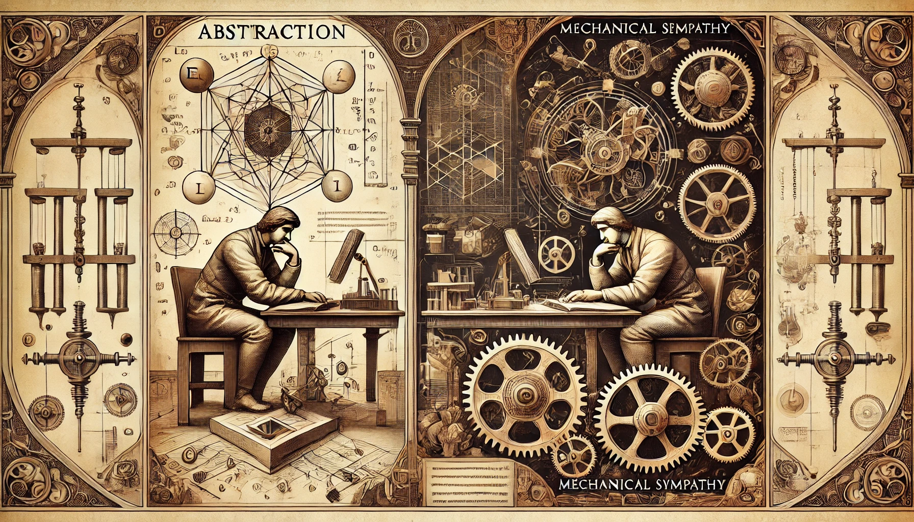

나는 Fine Engineer가 되기 위해서 필수적인 요소 중 하나가 기계 공감이라고 생각한다.

- **기계공감**: 도구나 시스템을 사용할 때 그것이 어떻게 가장 잘 작동하는지 이해하고 사용하는 것

정의를 보면 당연한거다. 그런게 기계공감이면 당연히 중요하지 생각할 수 있다. 여기에 더해서, 나는 이 기계공감이야 말로 세상을 바라보는 가장 중요한 관점 중 하나라고 생각한다.

---

나는 무언가를 처음 공부할때, 베스트 프렉티스부터 찾는다. 일단 가장 올바른 방법으로 해보는 거다. 그러면 그 아름다운 광경을 심상에 새길 수 있다.

그리고 그 근본을 찾는다. 완전 최초보단, 가장 처음 정립되어 모두에게 알려진 고전을 찾아가는 것이다. 이런 고전은 오랫동안 올바르다고 여겨져온 것이며, 과학적 접근으로 봤을때 믿고 따를만 하다. 그렇게 고전을 통해 이전에 새겨놓은 심상에 대한 순차적인 분석이 이뤄진다. 

고전은 보통 서적의 형태로 이루어져있는데, 나는 이런 지식 서적을 읽을 때에도 특이한 패턴을 가진다. 

우선 표지부터 한장 한장 모든것을 신중하게 읽는다. (다만 감사의 글은 넘기는 편이다.) 표지 구성, 저자 이력, 머릿말, 추천사.. 꼼꼼히 차례대로 읽는 이런 행위는, 대략 목차에서 1-2장 까지 이어진다. 거기까지 읽고나면, 내 맘대로 읽기 시작한다. 순서 없이 뒤죽박죽 읽기 시작하는 것인데, 스택 구조를 갖고 깊이 우선 탐색 방식으로 읽어들인다.

그렇게 고전을 다 읽고 나면, 그 고전을 뿌리삼아 뒤죽박죽 디깅을 하기 시작한다. 그러다 또 다른 아름다운 광경(베스트 프렉티스)을 마주치면, 이런 학습을 다시 시작한다.

왜 이렇게 하는걸까?

## 나의 언어로 파싱한다

책의 목차 순서나 어떤 커리큘럼은 매우 중요하다.
다만 그것은 나의 언어가 아닌 그들의 언어로 파싱된 것이다. **언어는 정의, 뉘앙스, 의도로 이루어져있다고 생각**하는데, 지식의 습득에 있어서는 **의도**가 매우 중요하다고 생각한다. 그들의 순차에서 이 **의도는 연속성을 갖추며 맥락(context)를 형성**한다고 생각한다.

다만 이 컨택스트란 놈은 매우 섬세한 불변식이라, 환경과 상태에 크게 영향을 받는다고 생각한다. 마틴 파울러와 켄트 벡, 그리고 그의 딸이 쓴 “[숲과 사막]( https://martinfowler.com/bliki/ForestAndDesert.html)”이란 글에서 이를 완전히 공감 가능하다.

> 두 소프트웨어 개발자 커뮤니티가 서로 매우 다른 맥락에서 살기 때문에 서로 소통하는 데 큰 어려움을 겪고 있으며, 한 커뮤니티에 적용되는 조언이 다른 커뮤니티에는 말도 안 되는 것처럼 들린다고 가정합니다. 사막은 소프트웨어 개발의 일반적인 세계로, 버그가 많고, 기술이 배양되지 않았으며, 사용자와의 소통이 어렵습니다. 숲은 Extreme Programming(XP)과 같은 것을 사용하는 잘 운영되는 팀의 세계로 , 개발자가 신속하게 프로덕션에 변경 사항을 적용하고, 테스트로 보호하고, 코드를 투자하여 건강을 유지하고, 고객과 정기적으로 접촉합니다. - Martin Folwer

즉 나의 환경과 상황이 저자와 유사한 형태가 아니라면, 컨택스트는 완전히 틀어져 머릿속에서 완전히 길을 잃어버리고 미아가 되버릴 것이다.

지식 전달 서적의 대부분은 1, 2장까지 책 전체 내용을 요약 한다. 머릿글과 추천사, 심지어 저자의 이력과 표지는내가 그의 컨택스트를 조금이나마 엿볼 기회를 준다. 그렇게 그의 맥락을 이해한 뒤, 전체 목차를 보고 나의 언어로 지식을 파싱해나가기 시작한다. 이 과정을 통해 지식은 나의 맥락으로 재구성된다. 지식 맵이 형성되는 것이다.

이것은 그림을 그리는 루틴과도 유사하다고 본다. 

> 전체 스케치 > 관찰 > 세부 묘사

또, 이것은 애자일과도 유사한 맥락을 갖추고 있다.

> 전체 백로그를 나열하고 > 우선순위를 설정하고 > 우선 순위부터 구현한다

나의 이러한 일련의 과정은 두가지 핵심 아이디어로부터 파생되었다.

- 추상화
- 기계공감

---

## 추상화

> 추상화의 본질은 주어진 맥락에서 관련 있는 정보를 보존하고, 그 맥락에서 관련 없는 정보는 잊는 것입니다. - John Guttag

추상화는 구현 세부사항을 캡슐화하여 더 고수준의 논리를 다룰 수 있게 도와준다.

과학혁명 구조를 떠올려보면, 쿤은 패러다임이 정상과학이 이전까지는 상상하기도 힘들었던 연구를 가능케 했다고 말한다. 인간의 상상력은 무한하다. 패러다임은 인간의 상상의 범위를 제한하지만, 인간은 다시 그 제한 안에서 극도의 상상력을 발휘하게 된다. 이것은 추상화에서 똑같이 작용하게 된다.

추상화는 세부 구현에 대한 상상의 범위를 극도로 피상적으로 제한시켜 관심사 범위를 고정시킨다. 해당 범위 안에 제한된 극도의 상상력은 창발적 사고를 일어나게 하며, 이것은 고도로 아름다운 패턴을 만들어 낸다.

다만 때론 이런 추상화가 고도로 아름다운 똥덩어리를 만들게 하기도 한다. 그러한 것을 보통 망상이라고 부른다. 왤까? 현실성이 결여되었기 때문이다. 올바른 추상화적 사고를 위해서는 기계공감을 필요로 한다.

---

## [기계공감](https://wa.aws.amazon.com/wellarchitected/2020-07-02T19-33-23/wat.concept.mechanical-sympathy.en.html)

> 레이싱 드라이버가 되려면 엔지니어가 될 필요는 없지만, 기계적 공감 능력은 있어야 합니다. - Jackie Stewart

추상화된 동작을 이해하고 나면, 호기심 많은 엔지니어들은 그 세부사항을 들여다보기 시작하게 된다. 이때 엔지니어의 두 눈은, 가시선을 보던 것이 마치 엑스선(X-ray)을 보는 것 처럼 바뀌는데, 그것이 예측일 뿐이라는 점을 간과하면 안된다.

때문에 **분해** 해봐야 한다. 이것이 실천적 엔지니어링의 본질 중 하나라고 본다. 분해하여 얻어낸 지식을 통해, 점점 더 진실에 가까운, 엑스선을 보는 눈알로 내 눈알을 바꿔나가야 한다.

어떻게 분해해야 할까? 블랙 박스 방식과 화이트 박스 방식이 있다. 이 두 방식은 같이 이뤄져야하다고 생각하는데, 0과 1로 이루어진 바이너리 코드적 상상에서부터 시작하여 부울 대수 연산, 컴퓨터 구조, 운영체제, 가상 머신, 컴파일러 같이 고수준으로 컴퓨터적 사고와 인간적 사고를 모두 한번에 할 수 있다면, 화이트 박스 방식만 써도 된다.

범부인 이상, **어느 시점에 멈춰 추상화를 이용하여 아래로는 블랙박스, 위로는 화이트 박스를 통해 과학적 사고를 해야할 것**이다. 이 때 우리가 볼 것에 대해 **세밀한 입자의 변인 통제로 살펴보려는 것에 바이스를 잘 설치한다면**, 결정적인 인과를 살펴볼 수 있으리라 믿는다. 물론 해결이 안된다면 아래로 내려가봄직도 좋다. 다만 부디 양자 터널 효과를 분석해야 하는 상황에 처하진 않기를 바란다.

---

추상화가 횡적 관심사라면, 기계공감은 수직적 관심사라고 볼 수 있다. 이것은 마치 기능 추가 모자와 리펙토링 모자를 번갈아 가며 쓰듯이, 컨텍스트 스위칭을 일으켜야 한다. 두 관점은 혼용되면 문제 해결은 영영 멀어질 것은 당연하다.

다시 처음 내용으로 돌아가 나의 파싱 방식 두 가지 사례를 보자.

- 베스트 프렉티스를 만나고 고전을 읽은 뒤에, 뒤죽박죽 디깅하는 것
- 서적의 표지부터 초반부를 꼼꼼히 읽은 뒤에, 뒤죽박죽 세부 사항을 채워 나가는 것

이것은 다시말해 **추상화와 기계공감 과정**이다. 이것이 내가 세상의 본질을 바라보기 위해 노력하는 두 가지 관점이다. 보지 못하는 것은 무력하다. **보는 것은 힘**이다. 나는 어디까지 보고 있는가. 파인 엔지니어가 되는 길은 멀다. 어렵다.