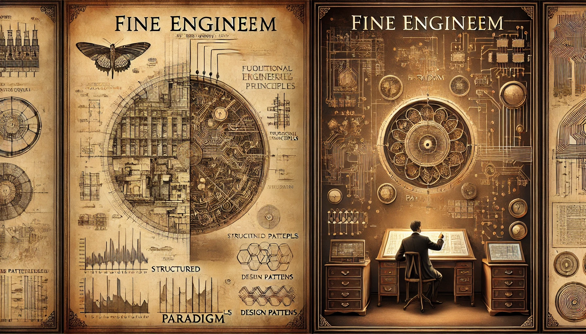

나는 **fine**한 엔지니어가 되길 희망한다. 무엇이 fine 엔지니어의 기준일까? 여러가지 요소들이 있겠지만, 그 중 하나가 올바른 **엔지니어링 신념, 철학**을 가졌는가 라고 생각한다. 이번 글에서는 그 점에 대한 내 생각을 풀어보고자 한다.

엔지니어링 신념? 철학? 너무 모호한 말이다. 위키백과에서는 신념과 철학에 대해 이렇게 말하고 있다.

> _신념 논리_(Doxastoc logic)는 이성과 믿음에 관한 논리의 한 형태

> _철학_(哲學, 고대 그리스어: φιλοσοφία)은 세상의 옳고 그름이 무엇인지를 탐구, 판별하는 것이다.

만약 옳고 그름을 누군가 혹은 일부 소수가 임의로 판단한다면, 그것은 독재나 망상, 혹은 카르텔에 불과하다.
(과학 업계에서는 이러한 행태를 의사과학(pseudo science), 변두리 과학(fringe science), 쓰레기과학(junk science) 등으로 부른다. 리처드 파인만은, 진짜 과학인 줄 착각하게 만드는 잘못된 믿음을 화물 숭배 과학(cargo cult science)이라 표현하기도 했다.)

그렇다면 무엇으로 옳고 그름을 판단할까? 칸트가 말한 **선험적 경험**을 근거로 삼아야 할까? 현실세계의 엔지니어링에 선험적 경험을 적용한다는 것은 너무나도 이상적이며, 자칫 화물 숭배 엔지니어링의 길로 빠질 우려가 있다. 다행히도 앞선 fine 엔지니어들이 **패러다임**을 제시해두었다. (여기서의 패러다임은 프로그래밍 패러다임이 아닌, 토마스 S. 쿤이 제시한 패러다임이다.)

- 감마, 에릭, 헬름, 리차드, 존슨, 랄프, & 블라시데스, 존. (2015). _GoF의 디자인 패턴: 재사용성을 지닌 객체지향 소프트웨어의 핵심요소_ (김정아, 역). 프로텍미디어.
  - Gamma, E., Helm, R., Johnson, R., & Vlissides, J. (1994). _Design patterns: Elements of reusable object-oriented software_. Addison-Wesley.
- 마틴, 로버트 C. (2013). _클린 코드: 애자일 소프트웨어 장인 정신_ (박재호 & 이해영, 역). 인사이트. (원저는 2008년에 출판)
  - Martin, R. C. (2008). _Clean code: A handbook of agile software craftsmanship_. Prentice Hall.
- 마틴, 로버트 C. (2019). _클린 아키텍처: 소프트웨어 구조와 설계의 원칙_ (송준이, 역). 인사이트. (원저는 2017년에 출판)
  - Martin, R. C. (2017). _Clean architecture: A craftsman's guide to software structure and design_. Prentice Hall.
- 벡, 켄트. (2014). _테스트 주도 개발_ (김창준 & 강규영, 역). 인사이트.
  - Beck, K. (2003). _Test-driven development: By example_. Addison-Wesley.
- 파울러, 마틴. (2015). _엔터프라이즈 애플리케이션 아키텍처 패턴: 엔터프라이즈 애플리케이션 구축을 위한 객체지향 설계의 원리와 기법_ (최민석, 역). 위키북스.
  - Fowler, M. (2002). _Patterns of enterprise application architecture_. Addison-Wesley.
- 에반스, 에릭. (2011). _도메인 주도 설계: 소프트웨어의 복잡성을 다루는 지혜_ (이대엽, 역). 위키북스.
  - Evans, E. (2004). _Domain-driven design: Tackling complexity in the heart of software_. Addison-Wesley.
- 리처드슨, 크리스. (2020). _마이크로서비스 패턴_. 길벗.
  - Richardson, C. (2018). _Microservices patterns: With examples in Java_. Manning Publications.

이처럼 선행 엔지니어들의 진지한 고뇌와 오랜 경험을 토대로, 선험적 판단과 경험적 판단을 종합해 ‘패러다임’을 제시 받았다. (조금은 객체지향에 편향된 예시들일 수 있지만, 모두 각자의 패러다임을 제시한 책들이다.) 진정한 fine 엔지니어가 되길 원한다면, 본인이 신적인 존재라 모든 선험적 판단이 순식간에 이뤄질 수 있더라도, 이 책들은 반드시 읽어봐야 한다고 생각한다. 왜냐면 **패러다임이기 때문**이다.

패러다임이 뭔데? 위키백과에서는 패러다임에 대해 이렇게 말하고 있다.

> **패러다임**(paradigm)은 어떤 한 시대 사람들의 견해나 사고를 근본적으로 규정하고 있는 테두리로서의 인식의 체계, 또는 사물에 대한 이론적인 틀이나 체계를 의미하는 개념이다.

 어떤 한 시대 사람들의 견해나 사고를 근본적으로 규정하고 있는 프레임이라는 것. 그런데 왜 패러다임을 알아야 하는게 중요하지? 왜 패러다임 창안자의 저술을 읽어봐야 할까? 대체, 패러다임이 어떤 기능을 하길래?

지금 사용되는 ‘패러다임’이라는 단어는 『과학혁명의 구조』(Kuhn, 1962)에서 토마스 S. 쿤으로부터 탄생했다고 볼 수 있다. 본래 패러다임이란 단어는 그저 문법적 범례를 의미했다. 토마스 쿤은 패러다임을 특정 시대에 과학 분야를 정의하는 **질문, 개념, 실례의 집합**이라고 정의했다. 이것이 현대에서 패러다임이 가지는 일반적인 의미다.

쿤은 패러다임의 특성을 두가지로 정리했다. (정확히는 "이 두 가지 특성을 띠는 성취를 이제부터 '패러다임'이라고 부르기로 한다."라고 했다.)

1. "끈질긴 옹호자들의 집단을 떼어내어 유인할 만큼 충분한 전례가 없어야 하며"
2. "재편된 연구자들의 집단이 해결하도록" 수많은 문제를 던져줄 수 있어야 한다.

이를 이해하기 위해서 쿤은 정상 과학(normal science)과 더불어 설명한다. 쿤은 normal science를 **과학적 성취**(과학자 **공동체가 인정한 것**)에 기반을 둔 활동(법칙, 이론, 응용, 도구의 조작 등을 모두 포함한 과학 활동)이라고 정의했다. (!정상 과학 ⊃ 유사 과학)

> 정상 과학(normal science)은 과거에 있었던 하나 이상의 **과학적 성취**에 확고히 기반을 둔 연구 활동 (2)

> 성취는 더 나아간 실천의 토대를 제공하는 것으로 특정 **과학자 공동체가 한동한 인정한 것** (2)

쿤은 패러다임이 이 정상 과학이 원활하게 동작되도록 만든다고 보았다.

>패러다임에 대한 공부는 과학도가 훗날 과학 **활동을 수행할 특정 과학자 공동체의 구성원이 될 수 있도록 준비시키는 것**이다. 이런 공부를 통해서 과학도는 바로 그 확고한 모델로부터 그들 분야의 기초를 익혔던 사람들과 만나게 되므로, 이후에 계속되는 그의 활동에서 **기본 개념에 대한 노골적인 의견 충돌이 빚어지는 일은 드물 것이다.** 공유된 패러다임에 근거하여 연구하는 사람들은 과학 활동에 대한 **동일한 규칙과 표준에 헌신하게 된다.** 그러한 헌신과 그것이 만들어내는 분명한 합의는 정상 과학, 즉 특정한 연구 전통의 출현과 지속에 필수 불가결한 요소가 된다. (2)

> 정상과학의 목적은 새로운 종류의 현상을 불러내려는 것이 아니다. 과학자들은 새로운 이론의 창안을 목적으로 하지 않으며, 다른 과학자들에 의해서 창안된 이론을 잘 받아들이지도 못한다. 정상과학 연구는 패러다임이 이미 제공한 현상과 이론을 명료화하는 것을 지향한다. (3)

또한 쿤은 유비(analogy)에 대해서도 이야기했다. 기존 패러다임을 통해 의미 있는 사실을 결정하고, 사실과 이론이 일치하는지, 이론을 더 정확하게 명료화하는 정상 과학을 하게 한다. 패러다임은 적용될 수 있는 범위와 정확성을 증진시킨다. 제한된 패러다임이, 정상과학의 결과를 예측하게 하고, 확인하는 과정만을 필요하게 만든 것이다. (단, 기존 규칙의 실패(예측 결과의 실패)는 새로운 규칙의 탐사를 하게 만든다.)

> 과학자 개인이 하나의 패러다임을 당연하다고 받아들일 수 있게 되면, 그는 자신의 주요 연구에서 제1원리들로부터 출발하고 도입된 개념의 용도를 정당화하는 것 같은, 자신의 분야를 처음부터 다시 정립하기 위해서 애쓰지 않아도 된다. 그것은 교과서 저자에게 맡길 수 있기 때문이다. 창의적인 과학자는 교과서가 끝나는 시점부터 연구를 시작할 수 있으며, 공동체의 가장 미묘하고 해득하기 어려운 부분에 전적으로 집중할 수 있다. (2)

> 패러다임에 대한 확신으로부터 파생되는 이러한 제한은 과학의 발전에서 불가결하다. 상당히 심오한 문제의 작은 영역에 주의를 집중함으로써, 패러다임은 과학자들로 하여금 자연의 어느 부분을 상세하고 깊게 탐구하도록 만드는데, 이는 그렇지 않았더라면 상상조차 하지 못했을 것이다. ...(중략)...
> 패러다임이 잘 들어맞는 얼마 동안, 전문 분야는 패러다임에 의존하지 않고서는 구성원들이 상상조차 하지 못하고 도저히 손댈 수 없던 문제들을 잘 풀어낼 것이다. ...(중략)...
> 몇몇 과학자들은 무슨 신기한 새로운 발견을 해서가 아니라, 이미 알려진 종류의 사실을 재정립하는 데에 필요한 매우 정밀하고, 신뢰도가 크며, 적용 범위가 넓은 방법을 찾아내서 대단한 명성을 얻었다. (3)

지금까지 패러다임에 대해 알아보았다. 그렇다면 이제 엔지니어링에 유비를 해보자.

정상과학에 대응해 **정상 엔지니어링**(normal engineering)이라는 말을 써보자. 즉, 정상 엔지니어링이란 **엔지니어링 공동체가 오랜 경험과 패턴을 바탕으로 구축한, 검증된 원칙과 방법론에 기반한 실천**이라고 정의해 볼 수 있다. 이때 패러다임은 정상 엔지니어링이 원활하게 동작되도록 할 것이다. 패러다임에 대한 공부를 통해 예비 엔지니어가 엔지니어 공동체의 구성원이 될 수 있도록 준비시키고, 이후 그의 엔지니어링 활동에서 의견 충돌을 줄여주고, 동일한 규칙과 표준적인 엔지니어링을 통해 비즈니스의 완성에 전념할 수 있도록 도울 것이다.

나는 여기서 엔지니어링 유비(Engineering Analogy)에 대해서도 이야기하고 싶다. 정상 엔지니어링을 패턴화 하고 이를 정의한다. 이것은 패러다임의 변화가 아닌, 정상 엔지니어링의 모든 활동들을 통해, 그 패러다임 안의 내부 구성들은 점차 세밀해지고 발전하게 되는 것을 의미한다. “패러다임이 전환한다”기보다 “발전한다”고 불러야 할 것이다.

- OOP →  디자인 패턴, SOLID 원칙이 정립 됨
- 마이크로서비스 아키텍처 → Event-Driven Architecture, Saga 패턴 등의 기법이 추가 됨

이처럼 패러다임의 뿌리가 단단해야 새로운 기법들이 자연스럽게 추가·확장되고, 실제 개발 현장에서 안정적으로 자리 잡는다.

다행히도, 소프트웨어 엔지니어 세계는 fine 엔지니어들이 새로운 패러다임을 정립할 때, 단순 논문만 남기는게 아니라, 모두가 쉽게 접근할 수 있도록 앞서 나열한 것과 같은 친절한 저서들을 제공하고, 지속되는 커뮤니티 소통과, 유튜브 영상을 통한 설명까지 제공해준다!
(물론 과학에서의 패러다임과 엔지니어링에서의 패러다임이 완전히 동일한 방식으로 작동하지 않을 수도 있다. 엔지니어링은 보다 실천적인 요소가 강하기 때문이다. 하지만 엔지니어링에서도 쿤의 논의를 유비해볼 수 있다는 것에 집중해보자.)

패러다임에 대한 궁금증이 해결되었다. 이제 새로운 궁금증이 생긴다. 그렇다면 새로운 패러다임에 대한 기준은 어떻게 잡아야할까? 어떻게 해야 화물숭배 엔지니어링이 아닌, 새로운 패러다임이 될까? 아직 『과학혁명의 구조』의 이야기는 끝나지 않았다.

쿤은, 패러다임은 공동체가 해결하는 퍼즐과 문제들을 정당화한다고 했다. 하지만 패러다임이 어떤 **변칙(anomaly) 현상**들로 쌓여서 문제를 해결할 수 없게 되면, 정상 과학이 느슨해지며 기존 패러다임의 위기를 부른다고 했다. 비정상 과학(extraordinary research)이라는 새로운 아이디어, 새로운 방법, 그리고 최종적으로 새로운 이론이라는 **새로운 성취**들이 등장하고, 새로운 패러다임을 만들어낸다고 했다. 이것이 "**패러다임의 전환**"이다. 이러한 **"변칙현상 > 위기 > 새로운 패러다임"이라는 패턴**이 존재하지 않는다면, 모든 공동체가 쉽게 받아들일 수 없다는 것이라는 것은 어떻게 보면 당연한 것이다.

> 정상과학은 연구를 이끄는 패러다임이 효과적으로 작동하지 못하는 경우에는 언제든지 연구를 구속하던 제한을 느슨하게 하는 메커니즘을 내재하고 있다. 이 시점에 이르면, 과학자들은 저마다 다르게 행동하기 시작하며, 그들의 연구 문제의 성격도 바뀌게 된다. (3)

> 무엇을 예측해야 할지를 매우 정확히 알면서 무엇인가 잘못되었음을 깨달을 수 있는 사람에게만 새로움은 그 모습을 드러낸다. 변칙현상은 패러다임에 의해서 제공되는 배경을 거스르면서 나타난다. (6)

> 하나의 패러다임이 제공하는 도구들이 패러다임이 정의하는 문제들을 풀 수 있다고 증명되는 한, 과학은 최고의 속도로 발전하며 그 도구들을 확신 있게 적용시킴으로써 가장 심도 있게 탐구한다. 생산 활동에서처럼 과학에서도 도구를 새로 만드는 일도 그것을 요구하는 경우를 위해서만 예비된 일종의 사치이다. 위기의 중요성은 도구를 바꾸어야할 적기에 도달했음을 가리키는 지표가 된다. (7)

엔지니어링 세계 또한 변칙 현상들이 쌓여서 문제가 쉽게 해결되지 못하고, 새로운 성취들이 등장하는 과정을 통해 새로운 패러다임을 만들어야 할 것이다. 단순히 베스트 프랙티스를 만들고 따라가는 것이 아니라, 배경과 변칙현상을 반드시 고려해야 한다. 패러다임 전환이 필요한 순간이란, 기존 방식으로는 해결할 수 없는 변칙의 상황에서, 더 이상 정상 엔지니어링 또는 비즈니스가 유지될 수 없는 순간이다. 그런 엔지니어링의 패러다임의 전환에는 어떤 것이 있을까?

- **모놀리식 아키텍처 → 마이크로서비스 아키텍처(MSA)** : 대규모 시스템에서 모놀리식 방식의 한계를 극복하기 위해 등장
- **객체지향 → 함수형 프로그래밍의 확산** : OOP의 유지보수성과 상태 관리 문제를 해결하기 위한 대안으로 FP가 주목받음
- **클래식 데이터베이스 → Event Sourcing, CQRS 패턴** : 전통적인 CRUD 방식의 문제를 해결하려는 시도
- **프론트엔드 패러다임의 변천 (JQuery → SPA (React, Vue) → 서버 사이드 렌더링(SSR), Static Site Generation(SSG))**
- **클라우드 패러다임의 변천 (온프레미스 → 클라우드 → 서버리스)**

이처럼 소프트웨어 엔지니어링 세계에도 새로운 성취와 패러다임이 계속해 등장하고, 기존 패러다임과 경쟁·공존하며 진화한다. 단순히 유행이나 트렌드가 아니라, 공동체가 변칙 상황을 해결하기 위해 끊임없이 진화하는 필연적인 과정인 것이다.

정리하자면, **패러다임은 단순한 방법론이 아니라, 엔지니어링 공동체가 문제를 해결하는 방식을 규정하는 기본 원칙(fundamental principle)과 사고 방식(mindset)이다.** 이를 깊이 이해하는 것은 올바른 엔지니어링 신념과 철학을 형성하는 데 큰 도움이 되며, 결국 fine 엔지니어가 되기 위한 핵심 조건이다. 한 번 읽고 지나가는 것만으로는 부족하므로, 필독서를 반복적으로 탐독하고, 직접 프로젝트에 적용하며, 끊임없이 공부하고 고민해야겠다고 다시 한 번 다짐한다.

다음 글에서는 fine 엔지니어가 되기 위해 필요한 또 다른 필수 조건인 **기계 공감**(Mechanical Sympathy)에 대해서 이야기할까한다. 엔지니어링 철학을 넘어, 기술적 구현 능력부터 러닝 커브, 기술 부채까지 고민을 담고자 한다.