애플리케이션의 품질을 판단하는 지표에는 여러 가지가 있다. 기능적 요구사항뿐 아니라, 비기능적인 요소인 디자인 패턴, 개발 철학, 도메인 주도 설계, 그리고 **성능**은 품질을 결정짓는 핵심 요소다.그리고 이 성능을 결정하는 핵심 요소는 **동시성**이다.

이 글에서는 성능 요소를 향상시키기 위한 접근법을 살펴보고, 그 핵심 개념인 **동시성**을 소개한다. 이후 동시성이 하드웨어와 운영체제 계층에서 어떻게 구현되는지 확인하고, 이런 지식을 통해 애플리케이션 계층에서 동시성을 고려한 작업을 위해서 고려해야할 지점들을 특정짓는다. 이 글은 애플리케이션에서 운영체제와 하드웨어까지 동시성 동작을 꿰뚫어 볼 수 있는 휴리스틱을 갖는 초석이 될 것이다.

---

## 성능 해부

애플리케이션이 작업을 수행할 때에는 고려해야 할 두 가지 속성이 있다.

- **지연 시간**(latency): 애플리케이션이 작업을 수행하는 시간
- **처리율**(throughput): 애플리케이션이 단위 시간당 처리 가능한 작업량

지연 시간과 처리율.. 같은 말이 아니냐고? 다음 그림은 '그로킹 동시성'(Kiril Bobrov, 2024)에서 이 두 개념을 아주 직관적으로 설명한 예시다.

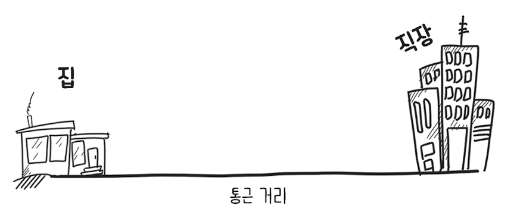

집에서 직장까지의 통근 거리는 고정된다. 이 거리를 지나가기 위해서는 어느정도 시간을 소모하게 된다. 이는 **지연 시간**에 해당한다. 

이때 통근 수단이 달라질 수 있다. 오토바이는 좌석이 하나뿐이라 한 번에 1명만을 이동할 수 있다. 반면 버스는 50명을 동시에 태울 수 있다. 이는 **처리율**에 비유할 수 있겠다.

애플리케이션의 성능을 개선할 때는 이 두 속성을 기준으로 접근할 수 있다. 

- **지연 시간 줄이기**: 작업을 **더 빨리 처리**하도록 개선
- **처리율 높이기**: 같은 시간 동안 **더 많은 작업**을 처리하도록 개선

이 두 방향은 각각 **확장성**(scalability)이라는 주제로 이어진다.

- **수직 확장성** (scaling up): 기존 프로세서를 더 성능 좋은 것으로 교체
- **수평 확장성** (scaling out): 자원을 늘려 부하를 분산

이를 위해서는 **느슨한 결합**의 설계가 필요하며, 문제의 복잡성을 단순화하기 위해 **할 일과 수행 시점의 분리**가 필요하다.

### 작업(Task)

애플리케이션은 **작업**(task)을 수행한다. 여기서 **작업**(task)이란 실행 단위를 추상적(abstraction)으로 표현한 개념이라 할 수 있다. 작업을 수행하는 가장 단순한 방식은 **순차 실행**(serial execution)이다.

- 순차적(sequential) 연산의 명령(instruction) 처리
- 각 단계는 이어지는 단계의 실행을 블록(block)한다.

이런 순차적 작업은 구조는 두 가지 개념으로 분석할 수 있다.

- **분해**(decomposition): 더 작은 독립된 작업으로 분리
- **동기화**(synchronize): 의존적인 작업을 위해, 잠시 작업을 블록(blocking)하고 대기

작업을 적절히 분해하면, 일부 단위는 **서로 독립적**이어서 동시에 실행될 수 있다. 이처럼 병렬로 처리 가능한 작업 단위를 도출해내는 것이 성능 향상의 핵심이다.

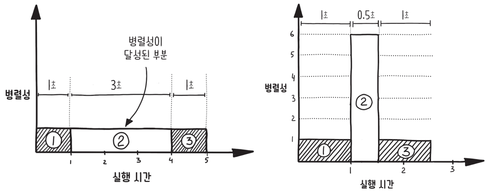

하지만 모든 작업이 병렬적으로 실행될 수 있는 것은 아니다. 일부는 여전히 순차적으로 처리되어야 하며, 이런 한계를 분석한 것이 바로 **암달의 법칙**(Amdahl's Law)이다.

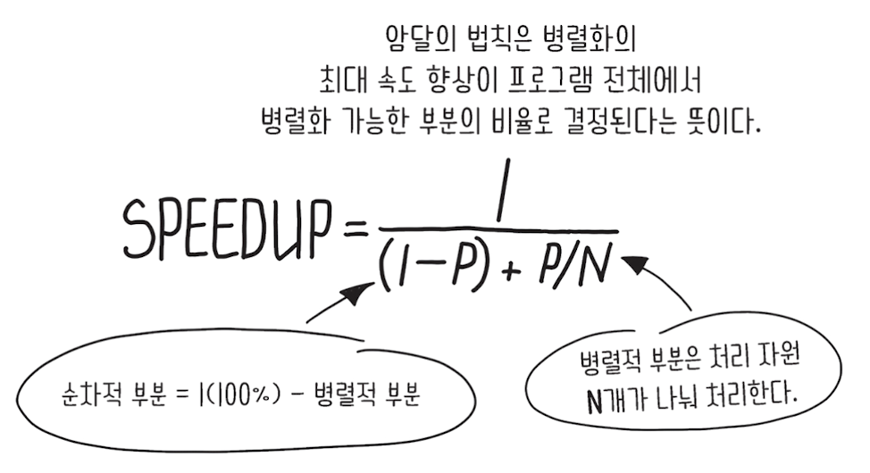

암달은 전체 작업 중 **병렬화가 불가능한 부분이 존재하는 이상**, 성능 향상에는 본질적인 한계가 있다는 사실을 수식으로 정리했다. 그럼에도 불구하고 병렬화 비율을 높이는 것만으로도 **상당한 수준의 성능 개선**이 가능하다.

이러한 배경에서 **동시성(concurrency)** 개념이 등장하게 되며, 이는 현대 컴퓨팅 시스템 전반에서 중요한 역할을 한다. 동시성은 단순히 병렬로 작업을 처리하는 것 이상으로, 다양한 계층에서 시스템의 효율성을 끌어올리는 핵심 전략이다. 그리고 모든 계층에서 동시성에 대해 염두해 둬야 한다.

### 동시성의 세 가지 계층

동시성은 다음과 같은 **세 가지 계층**에 걸쳐 있다

- **하드웨어 계층**: 명령어 처리, 멀티코어 CPU, 메모리 계층 구조 등
- **런타임/운영체제 계층**: 멀티태스킹, 스레드 스케줄링, 시스템 콜, 장치 드라이버 등
- **애플리케이션 계층**: 비즈니스 로직 수준에서의 알고리즘, 동기화, 비동기 처리 등

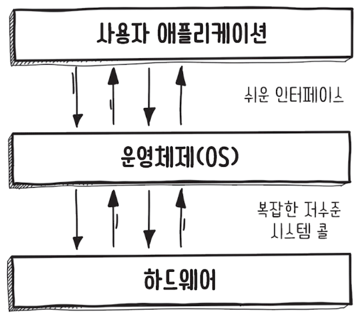

바텀 업 방식으로 하드웨어 부터 하나씩 살펴보겠다.

---

## 하드웨어 계층

동시성의 가장 하위 계층은 하드웨어다. 애플리케이션의 성능은 결국 이를 뒷받침하는 **물리적 자원**에 의존할 수밖에 없다. 하드웨어 계층의 동시성을 이해하기 위해선, 우선 연산을 수행하는 CPU의 구조를 알아야 한다.

### CPU

중앙처리장치(Central Processing Unit, CPU)는 다음과 같은 구성 요소로 이루어져 있다

- **제어 장치(Control Unit, CU)**: *기계어를 해석*하고 제어 신호를 발생시킨다
- **산술 논리 장치(Arithmetic Logic Unit, ALU)**: 산술 연산 및 비트 단위 연산(논리)을 수행한다
- **캐시 메모리(Cache)**: CPU 내부에 존재하며, 메모리보다 빠른 접근 속도를 제공한다
    
그리고 시스템의 주 메모리인 **RAM**(Random Access Memory)으로 이루어진다. RAM은 CPU가 직접 접근하기에는 상대적으로 느린 장치이기 때문에, 캐시를 사이에 둔다.

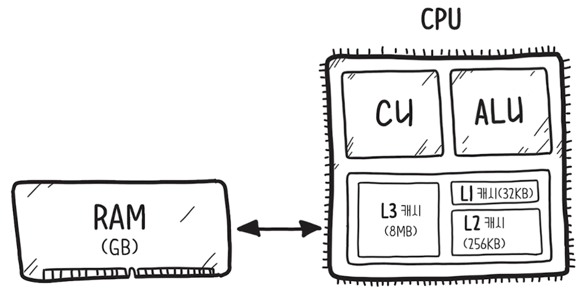

다음 표는 CPU의 관점에서 각 자원에 접근하는 데 걸리는 지연 시간을 상대적으로 표현한 것이다.

| 시스템 이벤트               | 지연 시간       | CPU 사이클을 1초로 봤을 때 |
| --------------------- | ----------- | ----------------- |
| 1 CPU 사이클             | 0.4 ns      | 1 s               |
| L1 캐시 접근              | 0.9 ns      | 2 s               |
| L2 캐시 접근              | 2.8 ns      | 7 s               |
| L3 캐시 접근              | 28 ns       | 1 m               |
| RAM 접근                | ~ 100 ns    | 4 m               |
| 고속 SSD I/O            | < 10 µs     | 7 h               |
| SSD I/O               | 50 ~ 150 µs | 1.5 ~ 4 일         |
| HDD I/O               | 1 ~ 10 ms   | 1 ~ 9 **개월**      |
| 네트워크 지연 (샌프란시스코 ~ 뉴욕) | 65ms        | 5 년               |

이처럼 CPU는 매우 빠르게 동작하지만, 외부 자원에 접근할 때는 상대적으로 **엄청난 시간 지연**이 발생한다.

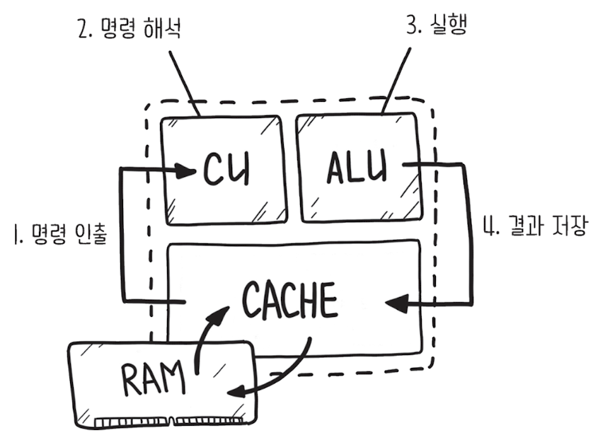

그런 CPU는 기본적으로 아래의 4단계 사이클을 반복하며 동작한다

1. **명령 인출**(fetch): 프로세서가 명령을 읽는다. 
	1. CU가 메모리나 캐시에서 명령을 읽어와 CPU에 복사한다.
2. **명령 해석**(decode): 프로세서가 명령을 해석한다.
	1. 읽어온 명령을 처리할 수 있도록 해석한다.
3. **실행**(execute): 프로세서가 명령을 실행한다.
	1. 명령이 ALU로 전달돼 실행된다.
4. **결과 저장**: 프로세서가 명령의 결과를 저장한다.

### 하드웨어 동시성

작업 성능을 위해서 하드웨어에서 병렬로 대체 가능한 부분은 어디일까?

#### 1. ALU를 여러 개 둔다

먼저 **CPU를 여러 ALU로 구성**한다. 이는 **명령어 수준 병렬성**(instruction-level parallelism)을 활용하는 방식으로, 복잡한 연산을 여러 부분으로 나누어 각 회로에서 동시에 처리한다.

#### 2. 프로세서를 여러 개 둔다.

**멀티 프로세서**(multi-processor) 구조는 하나의 컴퓨터에 **두 개 이상의 프로세서**를 탑재해 작업을 병렬로 수행하는 방식이다. 더 나아가, 하나의 칩에 여러 프로세서를 붙인 **멀티코어 프로세서**(multicore processor)가 있다.

대표적인 예가 **대칭형 다중 처리 구조**(Symmetric Multi-Processing, SMP)이다. SMP는 복수의 동일한 프로세서들이 하나의 공유 메모리 공간에 접근하며, 단일 운영체제의 제어를 받는다.

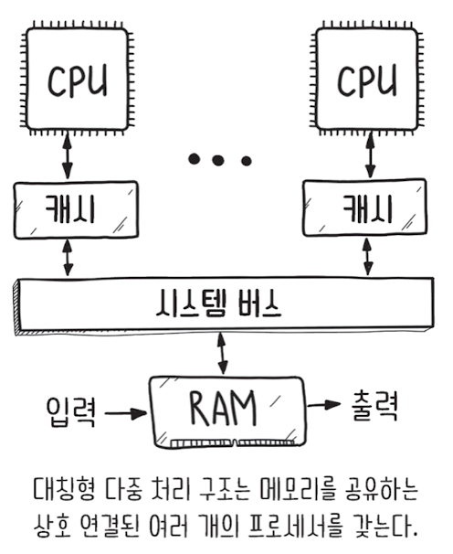

SMP는 사용자에게 **투명한 병렬 처리 환경**을 제공하지만, 프로세서 수가 늘어날수록 **시스템 버스의 병목**(bottle neck)이 발생한다. 또한 각 프로세서는 MESI 프로토콜 같은 방식으로 **L1 캐시 간의 일관성**(cache coherence)을 유지해야 하므로, 병목이 심화된다.

SMP와 같은 방식으로 구현되는 멀티프로세서는 '플린 분류'(Flynn's taxonomy)에 따라 네 가지 아키텍처로 분류된다. 이는 **명령어**(instruction)와 **데이터 흐름**(data flow)을 기준으로 한다.

- **단일 명령-단일 데이터**(Single Instruction Single Data, SISD)
- **다중 명령-단일 데이터**(Multiple Instruction Single Data, MISD)
	- 하나 또는 여러 명령이 하나의 데이터 블록만을 다룬다. 이 두 부류는 병렬성이 결여돼 있다.
- **단일 명령-다중 데이터**(SIMD): 코어 여러 개로 이루어진 제어 장치를 가짐. 모든 처리 자원으로 동시에 한가지 명령만 실행한다. (etg. GPU)
- **다중 명령-다중 데이터**(MIMD): 처리 자원마다 독립적인 제어 장치. 서로 다른 데이터 블록에서 다른 연산을 독립적으로 수행 가능하다. (etg. 다중 코어, 다중 CPU, 다중 머신 등)

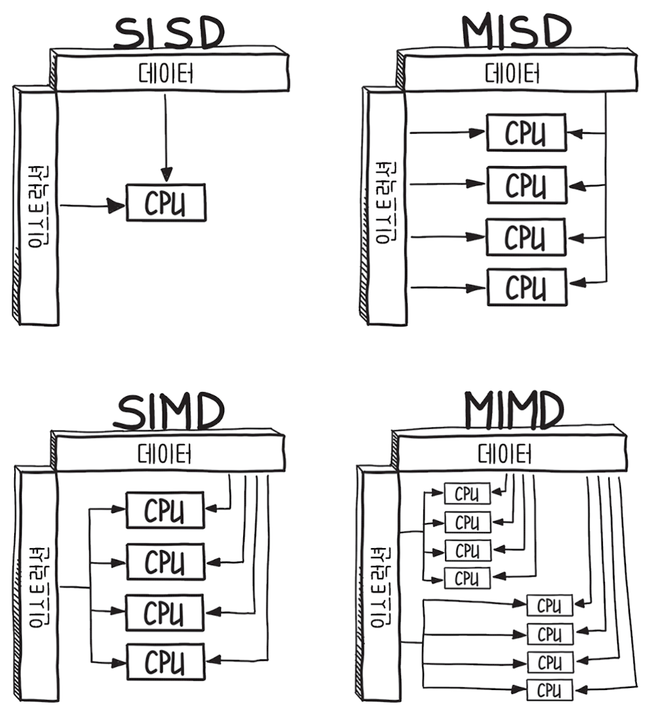

#### 3. 복수의 컴퓨터를 클러스터(cluster)로 연결한다

여러 대의 컴퓨터를 네트워크로 연결한다. 이 방식은 각 노드가 분산 메모리를 통해 메모리가 공유하며, 느슨한 결합(loosely coupled)의 구조다. 이런 구조는 **연결된 컴퓨터 간 통신 비용**이 높은 대신, 병렬 처리 능력과 **확장성**(Scaling Out)에 유리하다.

프로세서 간에 잦은 데이터 교환이 필요 없는 **대규모 병렬 연산**에 적합하지만, 강한 결합(tightly coupled)을 필요로 하는 연산에는 불리하다.

---

하드웨어 계층에서 살펴본 CPU, 멀티프로세서, 클러스터 등의 병렬 구조는 성능을 극대화하지만, 이를 효과적으로 활용하려면 하드웨어 자원을 관리하고 애플리케이션에 제공하는 계층이 필요하다. 이 역할을 수행하는 것이 바로 운영체제 계층이다.

## 운영체제 계층

이 계층은 **커널 공간**(kernel space)이라고 불린다. 커널 공간은 **하드웨어 자원들을 관리**하고 이를 이용하려는 사용자 공간에 추상화된 형태로 **런타임 시스템**(runtime system)을 제공한다. 런타임 시스템의 가장 대표적인 것이 **운영체제**(Operating System, OS)이다. 운영체제는 드라이버를 통해 자원 제어하며, 애플리케이션에 시스템 콜을 제공한다.

- **시스템 콜**(system call): 컴퓨터 시스템의 하드웨어 구성 요소와 애플리케이션 사이를 이어주는 저수준 시스템 인터페이스. 사용자 애플리케이션에 서비스와 유틸리티를 제공한다.
- **드라이버**(driver): 프로세서와 RAM, 주변 기기(프린터, 카드리더기, 하드디스크, 모니터 등의 입출력 기기)를 다루거나 통신하기 위해 컨트롤러

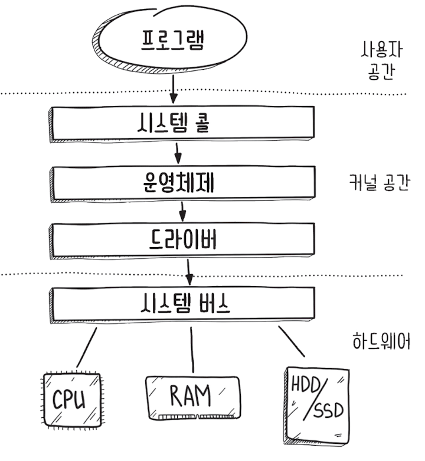

운영체제는 하드웨어의 병렬성을 활용해 동시성을 극대화한다. 하지만 이를 추상화하여, 사용자 공간에 노출시키지 않는다. 이런 구조는 애플리케이션이 시스템 영역에 접근하지 않고도, 하드웨어 자원을 사용할 수 있게 한다. 다만 운영체제가 하드웨어의 병렬성을 애플리케이션에 제공하려면, 동시성을 관리하는 추상화된 단위(abstractions)가 필요하다. 그것이 **프로세스**(process)와 **스레드**(thread)다.

### 프로세스

> 운영체제로 프로그램을 실행하는 첫 단계는 실행 파일과 정적 데이터(초기 변수 등)를 메모리로 읽어 들이는 것이다. 그다음 **시작점** - `main()` 부터 프로그램을 실행한다. 운영체제가 `main()`으로 넘어가면 프로세서의 제어권이 프로그램으로 이전된다. 이때부터는 운영체제의 보호 아래 프로그램이 실행된다. - Grokking Concurrency(Kiril Bobrov, 2024)

**프로세스**(process)란 '실행 중인 프로그램'을 나타내기 위해, **운영체제가 제공**하는 추상체다. 작업을 하드웨어 자원의 실제 동작과 분리하기 위한 개념으로, 프로세스들이 공유하는 하드웨어 자원은 운영체제의 관리를 받는다.

각 프로세스는 독립적인 주소 공간과 파일 테이블을 가지며, 운영체제 속에서 처리 자원을 할당받는 주체의 단위가 된다. 또한 프로세스는 실행이 독립적이며, 시스템의 나머지 부분과 완전히 격리된다. 이런 점은 외부의 전역 객체가 프로세스에 개입할 수 없으며, 프로그램의 오류가 다른 프로그램에 영향을 주지 않게 되지만, 프로세스 간의 통신이 필요할 경우 난해하다.

프로세스는 **실행 컨텍스트**(execution context)라는 캡슐화된 구조로 구현된다. 다음은 실행 컨텍스트를 이루는 구성이다.

- 프로세스 식별자(process ID, PID)
- 프로세스가 읽고 쓰기 위해 할당 받은 메모리 공간
- 프로세스를 구성하는 기계어 명령이 포함된 실행 파일
- 프로세스가 접근하는 디스크, 네트워크 자원, 서드파티 장치 등의 정보

프로세스는 '생성(created) - 준비(ready) - 실행(running) - 종료(quit)'의 라이프 사이클을 가진다.

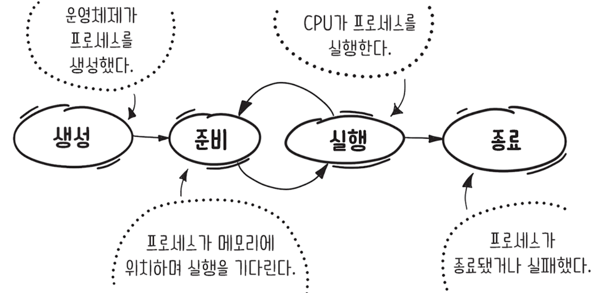

또한 자식 프로세스를 fork-swam으로 생성할 수 있다. 하지만 프로세스는 프로세스간에 통신이 쉽지 않다. 이런 점을 위해 있는 것이 스레드다.

### 스레드

**스레드**(thread)는 운영체제가 실행을 제어하는 명령어의 독립적인 스트림이다. 스레드는 부모 프로세스와 스레드끼리 자원을 공유한다. 프로세스가 실행중인 프로그램에 필요한 자원(주소 공간, 파일, 네트워크 연결 등)들을 캡슐화 한 것이라면, 스레드는 프로세스 안에 포함된 동적인 부분(이 안에서 실행되는 명령어들의 연속)에 해당한다. 운영체제 관점에서 프로세스는 **자원을 할당 받는 단위**, 스레드는 **실행하는 단위**다.

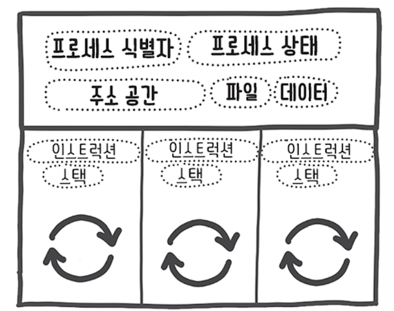

스레드에서 잠깐 살펴볼 패턴이 있다.

#### 스레드 풀(thread pool)

**스레드 풀**은 스레드를 미리 만들고 재사용하는 패턴이다. 스레드풀은 스래드를 생성하고 종료하는 오버헤드를 줄이고, 스레드 생성에서의 예외 상황을 줄일 수 있다. 생성보다 수행 시간이 짧다면 스레드 재사용의 효과가 커진다.지정 수의 스레드와 작업을 의뢰받는 메시지 큐로 구성된다. 주 스레드는 풀에 작업을 의뢰하고, 작업이 완료될 때까지 대기한다.

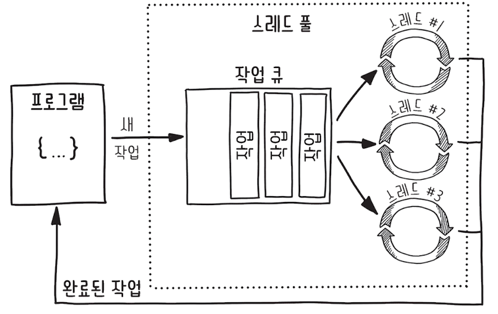

여기까지 이야기했으니, 이제 운영체제 계층의 동시성에 대해 이야기할 준비가 되었다. 운영체제 계층에서의 동시성이란, 하드웨어 계층의 병렬성과 조금 다르다.

### 동시와 병렬

병렬성은 동시성 구현의 속성(implemnetation property)이다. 작업을 물리적으로 동시 실행하는 것을 의미하는 것으로 하드웨어 계층의 개념이라 볼 수 있다. 반면 동시성이란 동시에 작업되는 것을 의미한다. 동시성 그 자체는 병렬성을 담보하지 않으며, 병렬성 또한 동시성을 담보하지 않는다.

- 파이프라이닝 처리 기법
- 단일 명령-다중 데이터(SIMD) 연산
- 분할 정복(divide and conquer)

이런 처리들은 병렬성이라 할 수 있다. 하지만 동시성이라 할 순 없다.

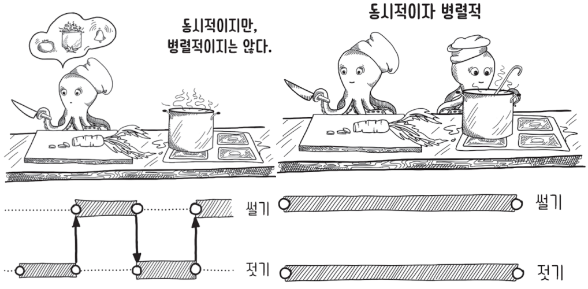

운영체제는 앞서 살펴본 프로세스와 스레드의 스케줄링을 통해 동시성을 제공하여, 실제 병렬적인지와 관계 없이, 작업의 처리량을 늘려준다.

#### 멀티태스킹(multitasking)

> 멀티태스킹: 여러 작업을 동시에 수행하여 여러 작업을 수행하는 개념

병렬 실행하려면, 병렬 실행을 지원하는 하드웨어가 필요하다. 하지만 그렇지 않고서도 멀티태스킹을 달성할 수 있는 방법이 있다.

##### 선점형 멀티태스킹(preemtive multitasking)

운영체제가 관리하는 자원 중 가장 비싸고 중요한 자원은 CPU다. 선점형 멀티태스킹은 '타임 슬라이스'(time slice)라는 일정 시간 단위로 작업을 쪼갠다. (타임 셰어링(time sharing) 스케줄링 정책)

타임 슬라이스에 해당하는 실행이 끝나면, 스케줄러가 작업을 **인터럽트**하고 대기상태로 만든다. 그리고 다른 작업을 인터럽트하여 타임 슬라이스 만큼 작업을 실행한다. 작업의 CPU 할당이 뒤바뀌는 것을 **컨텍스트 스위칭**(context switching)이라고 한다.

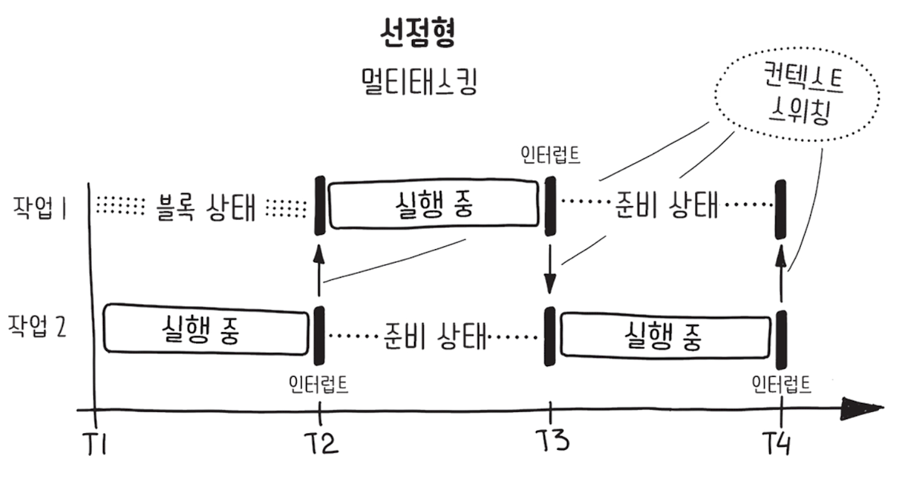

컨텍스트 스위칭에는 인스트럭션이 실행되지 않기 때문에, 오버헤드는 프로그램 성능에 부정적인 영향을 끼칠수도 있다. (대부분 한 번의 스위칭에 800 ~ 1300ns가 소요된다. ([LMBench](https://lmbench.sourceforge.net/)) 1ns 당 코어 하나에서 인스트럭션 12개 정도가 실행되므로, 컨텍스트 스위칭의 비용은 9000 ~ 15000 인스트럭션의 소모와 같다.)

하드웨어와 운영체제의 동시성 구현은 시스템의 한정된 자원의 시스템을 최대한 끌어올린다. 하지만 애플리케이션이 따라주지 않으면 무소용이다.

> **멀티코어 위기**(Multicore Crisis)   
> CPU 성능 향상을 위해 과거에는 클럭 속도를 높이는 방식이 주를 이뤘다. 하지만 발열, 전력 소비, 물리적 한계 등으로 인해 더 이상 클럭을 무작정 올릴 수 없게 되었고, 그 대안으로 **멀티코어** 구조가 등장했다. 하지만 멀티코어 시스템에서 성능을 최대한 활용하려면 **애플리케이션이 병렬성과 동시성을 잘 활용해야** 한다. 이를 제대로 하지 못하면 추가된 코어는 무용지물이 된다.

---

## 애플리케이션 계층

비즈니스에 맞는 애플리케이션을 납품하는 것은 개발자의 몫이다. 이때 성능을 위해서는 하드웨어와 운영체제에 구현된 동시성을 활용할줄 알아야한다. 그렇다면 어떻게 해야 하위 계층에서 구현된 동시성 기능을 활용할까?

글의 앞에서 성능 해부를 했던 과정을 떠올리자. 먼저 작업에서 병목이 일어나는 부분을 파악해보자.

### 병목

성능 관점에서 봤을 때 작업의 병목은 다음 두 가지로 나눌 수 있다.

- CPU 연산
- 입출력 연산(Input-Output operation, I/O operation)

##### CPU 중심(CPU-bound)

cpu에서의 병목은 사칙연산과 행렬 연산 같은 수학적 연산에서 온다. 다음과 같은 연산이 이에 해당한다.

- 암호화/복호화 알고리즘
- 이미지와 동영상 처리
- 이진 탐색이나 이진 정렬 같은 알고리즘

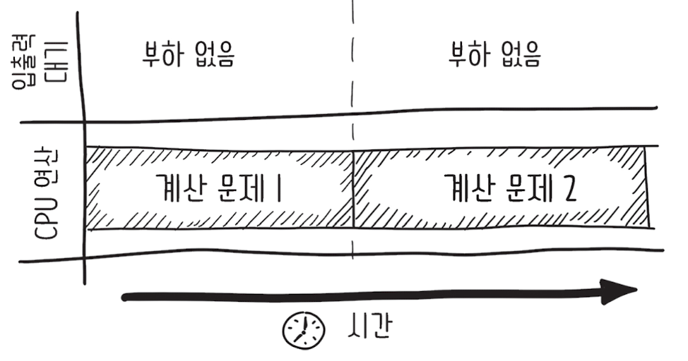

##### 입출력 중심(I/O-bound)

입출력의 병목은 하드웨어나 네트워크 I/O에서 오는 병목, GUI 입출력에서 오는 병목에서 온다.

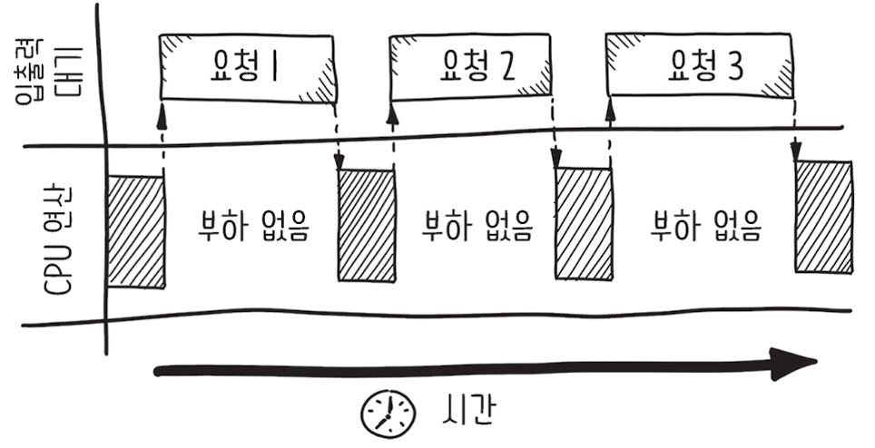

애플리케이션의 성능 향상을 위해선 병목 지점을 판단하는 것이 중요하다. 병목 지점에 필요한 자원은 애플리케이션에 따라 다르기 때문이다. IO가 문제라면 CPU의 성능을 아무리 올려도 해결할 수 없다. CPU 중심의 부하라면, 스케일 아웃을 통해 문제가 해결될 것이다.

이런 두 가지 관점에서 생각했을때, 애플리케이션 계층에서의 분해는 두 가지로 정리된다.

- 작업 분해(task decomposition)
- 데이터 분해(task decomposition)

### 작업 분해

동시에 실행할 수 있는 기능으로 문제를 분해한다.

> 폭설이 내린 날을 상상해보자. 집 주변의 눈을 삽으로 치우고 그 자리에 염화칼슘을 뿌리려 한다. 고맙게도 친구가 일을 도우러 왔다. 하지만 삽이 하나뿐이다. 한 사람이 삽을 쓰고 있으면 다른 사람은 삽을 쓸 수 있을 때까지 기다려야 한다. 처리 자원(삽)이 하나뿐이면 일의 속도가 빨라질 수 없다. 오히려 느려진다. **컨텍스트 스위칭에서 발생하는 오버헤드가 지속적으로 삽질 속도를 떨어뜨리기 때문**이다.   
> 여러분은 똑같이 집 주변을 범위로 하되, 친구에게 삽질 대신 염화칼슘 뿌리기를 부탁했다. 그 결과 삽을 쓸 수 있을때까지 기다리는 시간이 사라지고, 일을 효율적으로 진행하게 됐다. - 7.2

작업의 분해는 기능을 독립적인 작업으로 나누는 것이다. 작업이 분해되면, 동시성의 활용을 활용가능하고 처리량이 증가한다.

#### 파이프라인 패턴(pipeline processing)

작업 분해의 가장 대표적인 패턴이다. 파이프라인 패턴의 핵심은 작업을 **독립적인 작업의 단계**로 분해하는 것이 핵심이다.

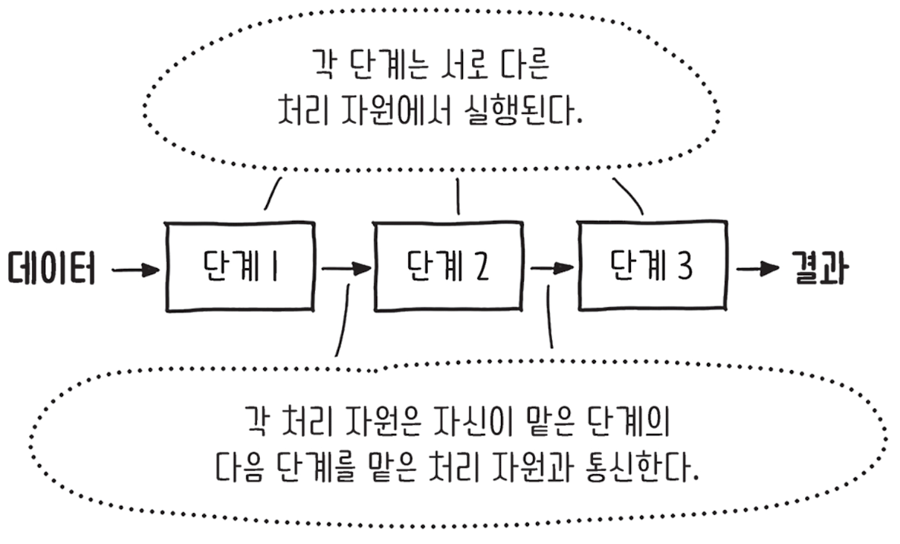

어디서 본 그림 같지 않은가? 하드웨어에서 CPU가 가졌던 작업의 분해. 운영체제가 멀티태스킹을 위해 컨텍스트를 타임 슬라이스로 나누었던 것. 작업의 **분해**는 전 계층을 관통하여 동시성을 구현하는 핵심이다.

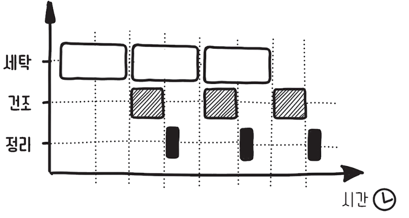

### 데이터 분해

데이터 분해의 핵심 아이디어는 **청크**(chunk)다. 서로 독립적인 작업을 수행하기 위해 데이터의 범위를 분해한다.

> 삽이 두개라면, 각자 눈 치울 범위를 정하고 각자 병렬로 치우면 된다. - 7.4

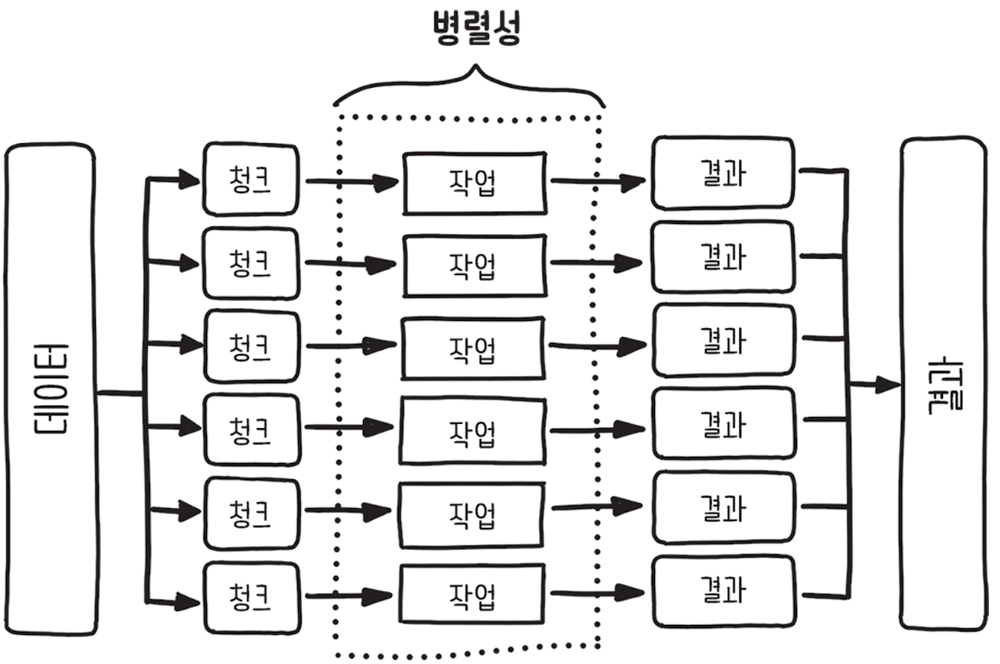

데이터 분해는 분산 시스템 방식으로 해결하기 쉬우며, 한 컴퓨터의 여러 코어에 데이터를 나눠주어 처리하기에도 좋다. 또한 입력 데이터의 양과 상관없이 Scaling-Out이 가능한 구조다. 또한 이 구조는 SIMD의 구조와 비슷하다. 이런 부류의 작업에는 SIMD 구조가 가장 적합하다고 한다.

##### 반복문 수준의 병렬성

데이터 분해는 모든 유형의 반복문(for, while, for-each)에 적용하기에 매우 좋다. 반복문은 각 작업이 독립적으로 순차적으로 반복되어 수행된다. 이런 반복문의 대상에 대해 데이터를 청킹하여 여러 스레드로 분리한다면 동시성을 활용할 수 있다.

##### 맵 패턴 (map)

특정 집합의 여러 요소에 **동일한 연산을 적용**(mapping)할 때 쓰이는 패턴으로, 함수형 프로그래밍 언어에서 쓰이는 개념을 기초로 한다. 각 작업은 독립적으로 처리되며 부수 효과가 발생하지 않는다.

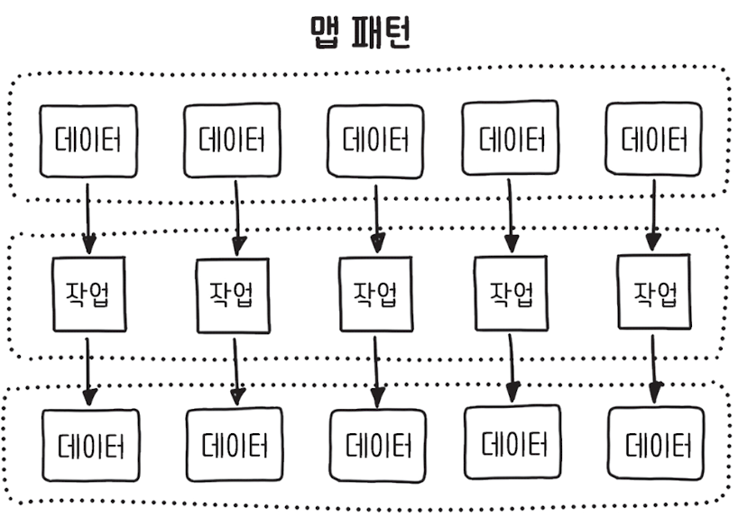

##### 포크 - 조인 패턴 (fork - join)

암달의 법칙을 기억하는가. 애플리케이션에서도 대부분의 작업은 순차적인 부분(작업의 단계가 서로 의존적)과 동시적인 부분이 섞여있다. 이런 부분에 대해서는 동기화 지점이 필요하다.

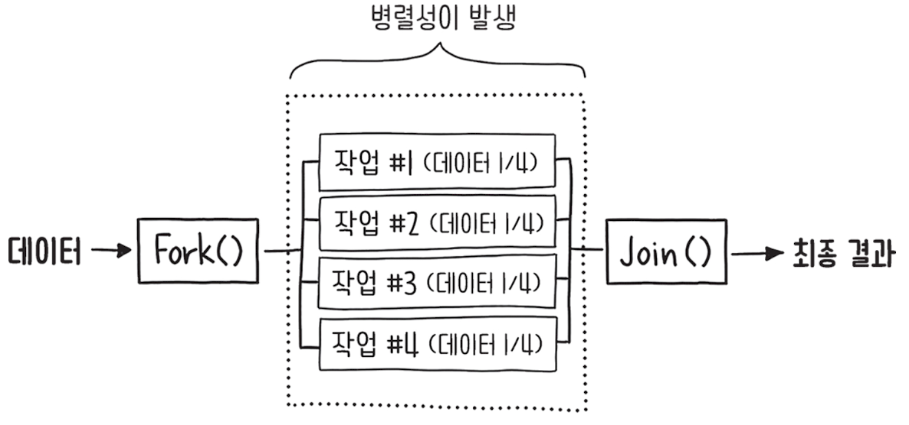

데이터의 흐름을 분해(fork)하고 동시성을 활용한 뒤, 데이터의 흐름을 블록하여 동기화(join)한다. 이 패턴은 전 계층에서 동시성을 구현하는 가장 기본적인 패턴이기도 하다.

##### 맵 - 리듀스 패턴 (map-reduce)

이 패턴은 포크 - 조인 패턴과 매우 비슷하다. 데이터에 대해 맵 단계에서 데이터에 대한 연산을 수행하고, 중간 결과를 리듀스 단계에서 데이터를 종합한다. (ex - 맵: 2 곱하기, 리듀스: 투표수 집계하기, 최솟값 구하기 등등)

이 방식은 동시성의 활용도를 극한으로 끌어올린다. 맵과 리듀스의 처리 작업은 완전히 독립적이고 병렬적이다. 맵-리듀스 패턴은 단일 컴퓨터의 경계를 넘어 여러대의 컴퓨터를 동원해 처리하는 형태로 확장할 수 있다. 구글이 개발한 맵리듀스 프레임워크, 야후의 아파치 하둡, 아파치 스파크 등은 이 패턴을 통해 빅 데이터를 다룬다.

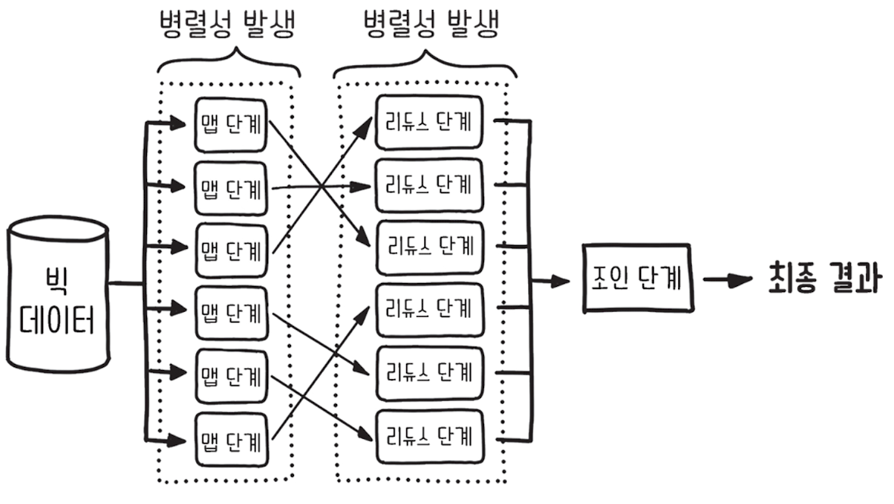

### 분해의 밀함 정도 (granularity)

동시성을 활용하기 위한 여러 패턴들을 살펴 봤다. 동시성을 활용하기 위해서는 문제를 분해하는 것이 매우 중요하다는 것을 알았다. 하지만 주의할 사항도 있다. 작업 분해에서 사용한 눈치우기 예제를 기억하는가. 만약 삽이 하나라면, 일을 도우러 온 친구가 단 한명이라면, 동시성을 활용할 수 없다. 즉, 문제를 해결하는데 주어진 **자원** 또한 중요하다.

주어진 자원이 많지 않은데, 문제를 매우 잘게 분해하고, 동시적으로 처리한다면, 어떻게 될까?

애플리케이션을 실행했을 때 모든 처리 자원을 독점적으로 사용할 수 있다면, 문제를 매우 잘게 분해하여 동시성을 극한으로 활용하면 좋을 것이다. 하지만 현실세계에서는 시스템에 내 애플리케이션 외에도 다른 애플리케이션이나 시스템에서 사용하는 처리 자원이 있을 수 있다.

문제의 세밀함 정도에 대한 판단이 필요하다. 굵은 입자성(coarse-grained), 세밀한 입자성(fine-grained)이라고 하는데, 이는 엔터프라이즈 애플리케이션 아키텍처 패턴 관점에서 매우 중요하다. 작업을 적절히 쪼개어, 런타임 시스템에 놀고 있는 코어가 없도록 하는 것. 그러면서도 너무 잘게 쪼개어 정보 교환이 증가하고 오버헤드의 증가로 인한 부하가 시스템에 주는 성능 저하. 이 두 가지 지점 사이에서 적절한 선택이 중요하다.

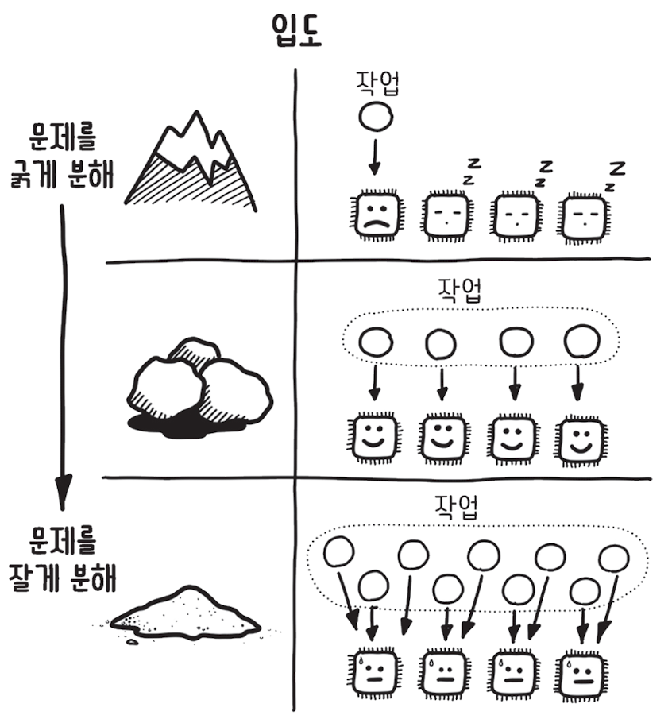

---

동시성에 대해서 알아보고, 세 계층 하드웨어 - 운영체제 - 애플리케이션에서 성능 향상을 위해 동시성이 적용되는 부분들에 대해 살펴봤다. 동시성은 시스템의 성능을 결정짓는 중요한 포인트이기에 반드시 정리되어야 할 주제였다. 특히 세밀한 동시성의 활용을 위해서는 내가 작성한 애플리케이션 계층의 행위가, 운영체제에서 그리고 하드웨어에서 어떻게 동작할지 꿰뚫는 휴리스틱을 가질 수 있어야 한다. 그리고 이런 적절한 동시성 활용은 한정된 자원에서 시스템의 성능 품질 향상을 위해 필수 요소다.

본래 동기화에 대한 이야기까지 하려 했으나, 지면이 길어져 해당 내용은 다음글에서 작성하려고 한다. 추가로 그로킹 동시성이란 책 너무 좋다. 운영체제와 동시성, 그리고 성능에 대한 휴리스틱을 갖기에 아주 도움을 준다. 이 글은 내 관점에서 책에서 중요하다고 본 부분들을 정리한 것이니, 저자의 본래 관점을 읽어보는 것을 추천한다.
