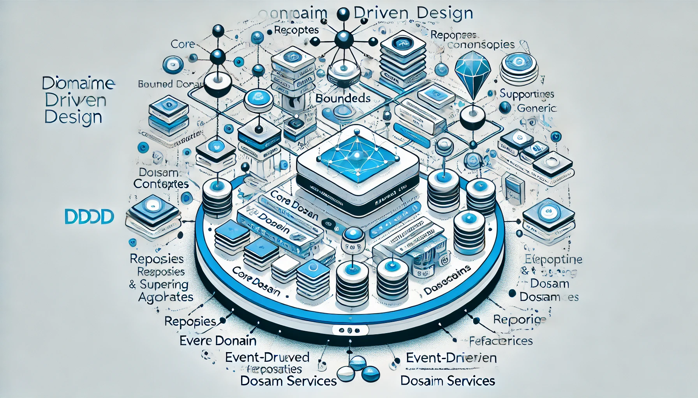
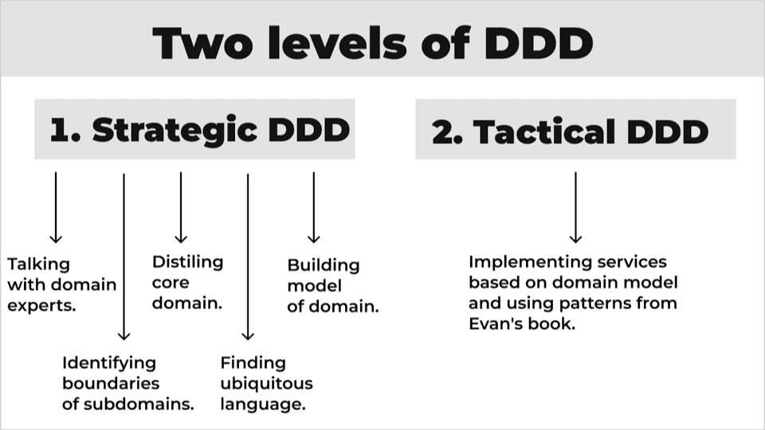
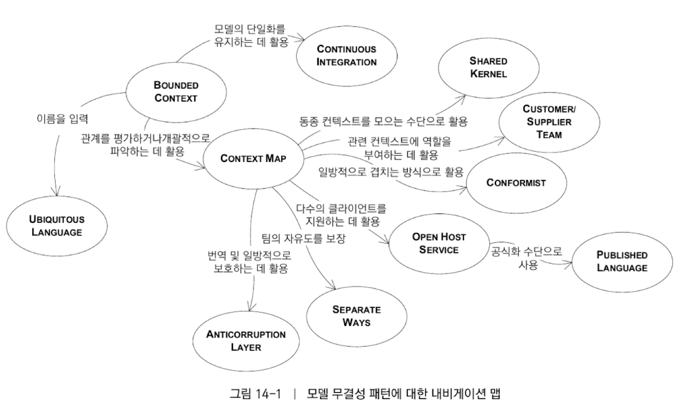
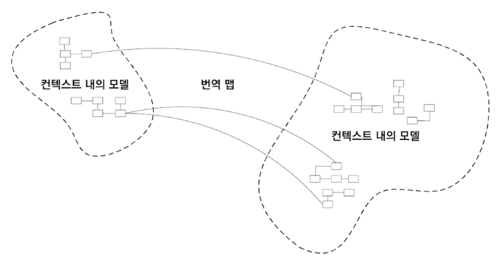
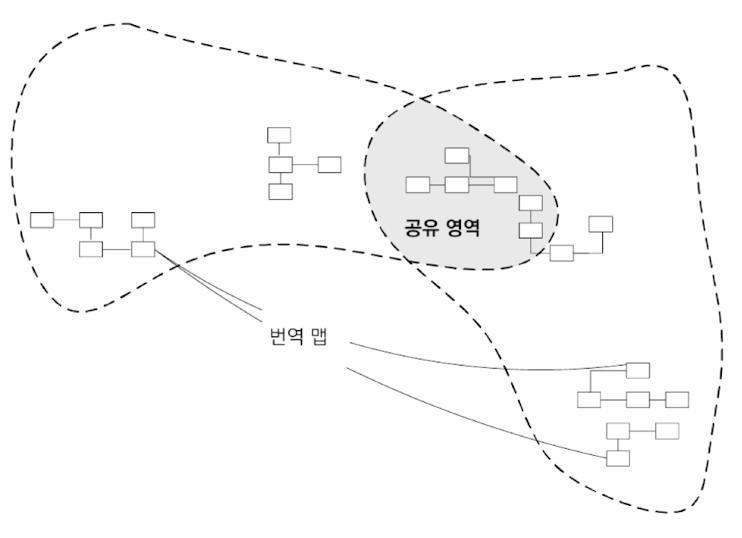
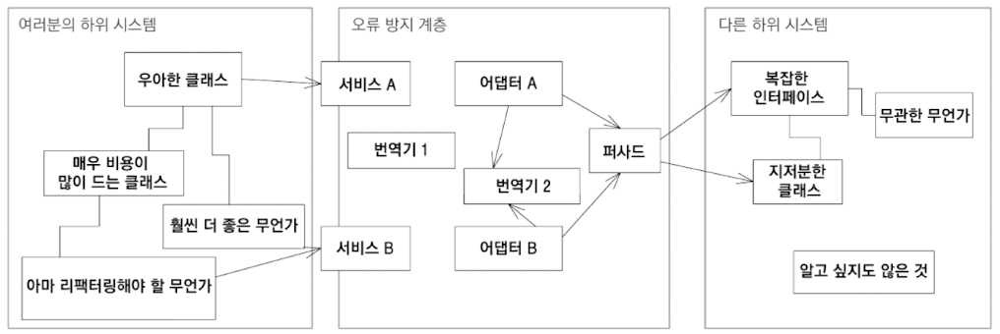
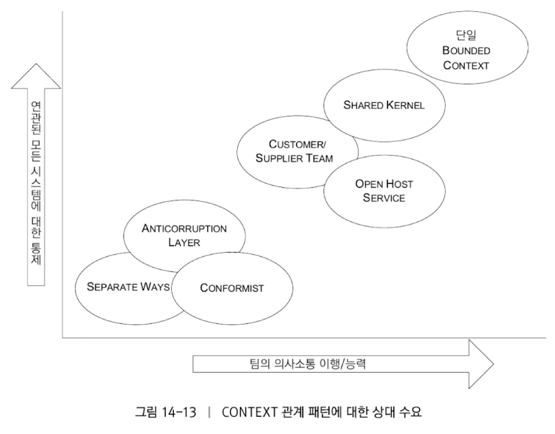
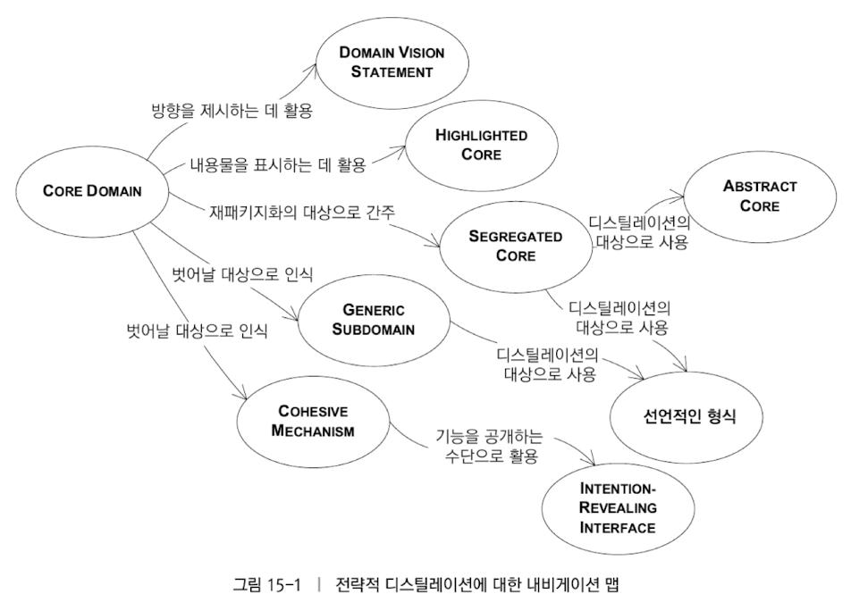

> **도메인**: 사용자가 프로그램을 사용하는 주제 영역.   
> 소프트웨어의 본질은, 사용자를 위해 **도메인에 관련된 문제를 해결**하는 능력에 있다.

2025년 2월 16일과 23일, 이틀에 걸쳐 조영호님의 ‘DDD의 사실과 오해’ 강의를 들었다. DDD는 늘 어렵게 느껴졌지만, 이번 강의를 통해 조금은 이해할 수 있게 되었다.

다음 책의 내용들을 추가 참조하여 내용을 정리했다.

- 에반스, 에릭. (2011). _도메인 주도 설계: 소프트웨어의 복잡성을 다루는 지혜_ (이대엽, 역). 위키북스. (원저는 2004년에 출판)
- 버논, 반. (2017). _도메인 주도 설계 핵심: 핵심을 간추린 비즈니스 중심의 설계로 소프트웨어 개발 프로젝트 성공하기_ (박현철 & 전장호, 역). 에이콘출판사. (원저는 2016년에 출판)
- 버논, 반. (2016). _도메인 주도 설계 구현_ (윤창석 & 황예진, 역). 에이콘출판사. (원저는 2013년에 출판)

도메인 주도 설계에서 구현은 매우 중요하다. 다만 구현 하나하나가 매우 많은 지면을 차지할 것이므로, 본 글은 DDD에 대한 진짜 의미 전달을 목적으로 내용을 정리했다.

---

## DDD란?

도메인 주도 설계(Domain Driven Design, DDD)는 에릭 에반스가 2003년 출판한 동명의 책으로 부터 시작되었다.

DDD란 뭘까? 위키백과로 DDD를 찾아봤다.

> **DDD** ( **도메인 주도 설계**)는 해당 도메인과 일치하도록 소프트웨어를 모델링하는 데 중점을 둔 소프트웨어 설계 접근 방식이다.

여기서 중요한 단어가 두 개 나온다.

- **도메인**: 주요 소프트웨어 설계 접근 방식 중 하나로, 해당 도메인의 전문가로부터 받은 입력을 바탕으로 도메인에 맞게 소프트웨어를 모델링하는 데 중점을 둔다.
- **모델**: 객체, 사람 또는 시스템을 **정보적으로 표현한 것**으로, 원본을 대신하는 역할을 한다.

> DDD는 단일 통합 모델을 사용하는 개념에 반대하며, 대신 대규모 시스템을 **경계 컨텍스트**(Bounded Context)로 나누고, 각 컨텍스트가 자체적인 모델을 갖도록 한다. 도메인 주도 설계에서는 **소프트웨어 코드의 구조와 언어(클래스 이름, 메서드, 변수 등)가 비즈니스 도메인과 일치해야 한다.**

**도메인 모델**(Domain Model)이란, 사용자가 프로그램을 사용하는 주제 영역 안에서

- 당면한 문제를 해결하는 것과 **관련된 측면을 추상화**하고
- 중요하지 않은 세부사항은 생략하는 것

DDD는 비즈니스 도메인을 분석하여 정리한 도메인 모델을 그대로 코드로 구현하는 접근 방식이다. 즉, "**도메인 모델 = 코드**"가 되어야 하며, 코드 구조가 비즈니스 로직과 일치해야 한다. 다시말해, **동작하는 도메인 모델**을 만들어내는 과정인 것이다. 때문에 **변화에 유연한 구조**를 유지해야하며, 다음 원칙을 따라야 한다.

- 코드를 최대한 도메인 모델을 **표현하기 좋게** 만들어야 한다.
- 도메인 모델은 코드로 **구현하기 쉬운** 모델이어야 한다.

그렇지 못하다면, 올바르게 만들어진 모델이 아니다. 다음은 DDD에 대한 핵심 고려사항이다.

### 유비쿼터스 언어(Ubiquitous Language)

**이해 관계자들이 모두 이해 가능한 개념**이 쓰여야 한다. 이를 유비쿼터스 언어라고 한다.

> **유비쿼터스 언어(Ubiquitous Language)**: 모든 팀 구성원들이 사용하는 언어

- 개발 용어
- 사업 용어
- 회사 내부 용어

이 중에서 서로 소통해야할 용어들을 공유하여 유비쿼터스 용어로 사용한다. 유비쿼터스 언어는 도메인 모델 뿐만 아니라 코드에서도 동일하게 사용 되어야 한다. 이를 통해 개발자와 비즈니스 전문가 간의 소통이 수월해진다.

### 관심사 분리

**DDD는 모델에 기술적 요소가 들어가서는 안된다.**

에릭 에반스의 DDD는 당시의 OOP와 Agile의 영향을 많이 받았다. 때문에 DDD 자체는 특정 프로그래밍 패러다임이나 소프트웨어 개발 방법론을 강요하지는 않지만, 구현 가이드라인으로써 OOP와 Agile의 관점에서 보고 있다.

당시 엔터프라이즈 자바 빈즈(분산 객체)가 유행했는데, 이때문에 소프트웨어가 인프라스트럭처에 종속적이었고, 도메인과 기술적 요소가 혼재되어있었다.

마틴 파울러가 엔터프라이즈 애플리케이션 아키텍처 패턴을 제시하여, 인프라스트럭처와 퍼시스턴스 레이어를 도메인과 관심사 분리하는 패턴을 제시했으며, 이 철학을 바탕으로 Java 진영에 나온 두 가지 프레임워크, 스프링과 JPA는 인프라스트럭처와 퍼시스턴스 레이어가 비즈니스와 관심사 분리하도록 도와주게 된다.

### 불변식

도메인은 **불변식**(Invariant)을 기준으로 설계되어야 한다.

> **불변식**(Invariant): 시스템이 항상 유지해야 하는 핵심 규칙

도메인은 비즈니스 로직을 불변식으로 설계해야 한다.

일관성에는 두가지가 있다.

- Transactional Consistency (강력한 일관성)
- Eventual Consistency (최종적 일관성)

도메인은 Aggregate를 갖게되는데, 도메인은 이 Aggregate 내부에서는 Transactional Consistency를 갖춰야만 한다.

### 모델 주도 설계

또한 DDD는 **모델 주도 설계**(Model Driven Design)가 이루어져야 하며, 이때문에 **XP**(eXtreme Programming)가 동반되어야 한다.

도메인 모델 = 설계 = 코드

- 도메인 모델의 변경은 코드의 변경을 필요로 한다.
- 코드의 변경은 도메인 모델의 변경을 필요로 한다.

**코드와 모델이 함께 진화**해야 하므로, 변경이 있을 때마다 **코드와 모델을 함께 업데이트하는 프로세스가 필요**하다. 요구사항이나, 코드와 설계의 변경이 있을 때 점진적으로 설계와 소프트웨어의 배포가 즉시 반영되어야 한다. 즉각적인 리팩터링이 필요한 것이다. 반복적인 리팩터링은 도메인 모델을 **심층 모델**(Deep Model)과 **유연한 설계**(Supple Design)으로 **도약**(Breakthrough)하도록 돕는다.

이에 대한 실천 방법론이 XP(애자일의 소프트웨어 개발 방법론 프레임워크)이다.

(XP의 지속적인 통합(Continuous Integration)과 리팩터링 원칙을 적용하면, 도메인 모델과 코드 간의 싱크를 유지하는 데 큰 도움이 될 것이다.)

---

앞 부분이 DDD에 대한 기초 개념이었다면, DDD 핵심 내용은 도메인 주도 설계를 구현하는 패턴들에 대한 가이드이다. (OOP와 Agile의 관점에서 본)

크게 두가지 패턴으로 분류된다.



- **전략적 패턴**(Strategic Pattern): 소프트웨어 시스템의 고수준 설계 패턴
- **전술적 패턴**(Tactical Pattern): 각 경계 컨텍스트(Bounded Context) 내의 구현 패턴

---

## 전략적 패턴

- 비즈니스 도메인을 이해하기 쉽게 정의(Ubiquitous Language)
- 경계 컨텍스트(Bounded Context)를 정의
- 컨텍스트 간의 관계를 매핑
- 비즈니스의 핵심 요구사항을 중심으로 작업을 조직 및 구성

### 경계 컨텍스트 Bounded Context

각 모델의 적용가능성의 범위 정의. 같은 BC 안에서는 도메인 모델의 내적 일관성을 단일화(unification)해야 한다.

Bounded Context는 물리적이라기 보단, 논리적 분리이다.

- 쓰이는 목적 - 컨텍스트가 다른데, 같이 쓰면 문제가 생긴다!
- 경계 컨텍스트는 정합성을 신경 쓰지 않는다. 컨텍스트를 분리하면 정합성을 맞출 필요도 없다.
- 조직과 영속성 레이어까지 분리하는게 Bounded Context를 더 직관적이게 만들어준다.

BC 사이에 관계도 중요하다. 조직적인 협업 관계를 논의해야 한다.



> 모델이 적용되는 컨텍스트를 명시적으로 정의하라. 컨텍스트의 경계를 팀 조직, 애플리케이션의 특정 부분에서의 사용법, 코드 기반이나 데이터베이스 스키마와 같은 물리적인 형태의 관점에서 명시적으로 설정하라. 이 경계 내에서는 모델을 엄격하게 일관된 상태로 유지하고 경계 바깥의 이슈 때문에 초점이 흐려지거나 혼란스러워져서는 안 된다. (14) - 도메인 주도 설계(에반스, 2004)

### Context Map

서로 다른 컨텍스트 간의 관계를 정의하고 프로젝트상의 모든 모델 컨텍스트를 아우르는 전체적인 뷰 (어그리거트와는 다르다.)

- 프로젝트의 컨텍스트와 각 컨텍스트 간의 관계의 전체적인 개관을 제공



예컨데, 온라인 쇼핑몰에서 주문 관리 시스템과 결제 시스템은 별도의 Bounded Context로 나뉘며, 주문 시스템은 결제 시스템과 고객-공급자 관계(Customer-Supplier)를 맺는다.

매핑의 종류는 다음과 같이 나타난다.

- **Partnership**: 두 BC가 성공과 실패를 같이 한다면, 협업 관계가 나타나야 한다. 개발과 integration의 공동 관리를 위한 조정된 기획 과정이 필요하며, 공통 인터페이스를 만든다. 상호의존적 기능을 일정을 세워 같은 릴리스에 완성하도록 한다.
- **Shared Kernel**: 모델과 공유된 부분이 상호의존성을 형성한다. 명시적 공유를 하게 된다. 커널은 최대한 작게 유지하는 것이 좋다. 이 공유 영역은 반드시 상의를 통해 변경한다.



- **Customer-Supplier**: 두 팀이 UpStream과 DownStream의 관계를 갖는다. 업스트림은 다운스트림의 요구를 수용한다. 업스트림의 계획은 다운스트림의 우선순위에 영향을 준다.
- **Conformist**: 업스트림이 다운스트림의 요구사항을 제공해줄 동기가 없다. 다운스트림은 업스트림의 모델을 준수해야한다.
- **Anticorruption Layer, AL**: 변환 계층이 방어적 성격을 띈다. 다운스트림이 업스트림 기능을 보유 도메인 모델의 컨텍스트에 맞게 변환한다.



- **Open Host Service, OHS**: 업스트림은 프로토콜을 정의하고 이를 제공한다.
- **Public Language**: 문서화된 공유 언어를 제공하며, 필요에 맞춰 변환을 수행한다. OHS와 같이 쓰이기도 한다.
- **Separate Ways**: 요구사항 정의는 무자비하다. 두 기능성 집합 사이에 유의미한 관계가 없다면, 두 컨텍스트를 완전히 분리한다.



### 서브 도메인(SubDomain)과 증류(Distillation)

- **서브도메인**(SubDomain): 전체 비즈니스 도메인의 하위 부분. 하나의 논리적 도메인 모델을 나타낸다. 바운디드 컨텍스트 안에는 다양한 서브도메인이 존재할 수 있다. 되도록 하나의 바운디드 컨텍스트에 하나의 서브도메인이 존재하게 한다.
- **증류**(Distillation): 구성 요소를 분리하여 핵심 가치를 추출하는 과정.

서브 도메인들의 유형은 다음과 같다.

- **핵심 도메인**(Core Domain): 사업의 성공을 결정하는 핵심 도메인
  - 사업적으로 경쟁사를 압도하기 위함. 최고의 실력자를 배정
- **일반 도메인**(Generic Subdomain): 비즈니스에 경쟁 우위를 제공하지 않고 타사의 여러 애플리케이션에 공통으로 존재하는 도메인
  - 기성 솔루션, 공표된 설계나 모델, 외주제작된 구현, 사내 구현(교육이 필요한 개발자)

> "도용하라. 도용하라. 누구의 업적도 여러분의 눈을 피해가지 못하게 하라. 그저 항상 연구 중이라고 말하기만 하면 된다." (Tom Lehrer) 이것은 도메인 모델링에 대해서도 훌륭한 충고이자 Generic Subdomain을 공략할 때는 특히 그렇다.(15) - 도메인 주도 설계(에반스, 2004)

- **지원 도메인**(Supporting Subdomain): 비즈니스에 경쟁 우위를 제공하지 않지만 비즈니스의 일부로 코어 도메인을 지원하는 도메인
  - 외주로 해결하거나 개발자들의 성장을 위한 기회로 활용



---

## 전술적 패턴

개별 구성 요소를 **설계하고 구축하는 방식**에 초점을 맞춘다.
크게 두가지로 나뉜다.

- 도메인을 표현
  - Entity
  - 값 객체(Value Object)
  - Service
  - Association
  - Module
  - Event

- 생명주기를 관리
  - 애그리게이트(Aggregate)
  - Repository
  - Factory

### 애그리거트(Aggregate)

엔티티들과 VO들의 묶음. 엔티티 중 하나를 애그리거트 루트라고 한다.

애그리거트에는 다음 네가지가 중요하다.

1. 비즈니스 **불변식**(Invariant)
2. 단순하고 작은 애그리거트 설계
3. 애그리거트 간 식별자를 통한 참조
4. **결과적 일관성**을 통한 애그리거트 간의 갱신

애그리거트에서 가장 중요한 것은 **트랜잭션 일관성**(Transactional Consistency)일 것이다. 애그리거트는 캡슐화되어 **불변식**을 보호해야 한다. 애그리거트는 일관성있는 트랜잭션 경계를 형성하며, 트랜잭션 제어가 끝날때, 애그리거트 내부의 모든 구성 요소는 비즈니스 규칙(**불변식**)에 따라 일관성 있게 처리되어야 한다.

- 책임 주도 설계(Responsibility Driven Desgin) - 기능 요구사항
- 계약에 의한 설계(Design By Contract) - 불변식

다른 애그리거트와 상호작용시, **ID 참조**를 통해 작용해야 한다. (애그리게이트 간 참조를 ID 기반으로 하면 결합도가 낮아진다.) 그리고 **최종적 일관성**(Eventual Consistency)을 이용해 다른 애그리거트를 갱신한다.

애그리거트는 엔티티와 값 객체로 구성된다.

#### 엔티티(Entity)

- **동일성**(identical)
  - **식별성**(identity)을 가진다.
  - **연속성**(continuity)을 갖는다.
    - 상태와 상태의 변경, **가변성**(variable)

```java
public abstract class DomainEntity<T extends DomainEntity<T, ID>, ID> {  
    public boolean equals(T other) {  
       if(other == null) {return false;}  
       if(getId() == null) {return false;}  
       if(other.getClass().equals(getClass())) {
          // 엔티티는 고유한 ID로 동일성을 보장
          return getId().equals(other.getId());  
       }  
       return super.equals(other);  
    }
    
    @Override  
    public boolean equals(Object obj) {  
       if(obj == null) {return false;}  
       if(getClass().equals(obj.getClass())) {  
          return equals((T) obj);  
       }  
       return super.equals(obj);  
    }
    
    @Override  
    public int hashCode() {  
       if(getId() == null) {return 0;}  
       return getId().hashCode();  
    }
    
    abstract public ID getId();  
}
```

#### 값 객체(Value Object)

- **불변성**(Immutable)을 가지는 모델
  - 복잡성을 줄이기 위한 목적
  - 작은 개념으로 설계
- **동등성**(equal)
  - 속성에만 관심이 있음
  - 고유한 식별성이 없으며, 값 형태로 캡슐화된 속성을 비교함으로써 동일함을 결정.

```java
  
public abstract class ValueObject<T extends ValueObject<T>> {
    @Override  
    public boolean equals(Object other) {  
       if (this == other) {return true;}  
       if (other == null || getClass() != other.getClass()) {return false;}  
       T that = (T) other;  
       return this.sameValueAs(that);  
    }
    
    public boolean sameValueAs(T other) {  
       if(other == null) {return false;}  
       // 속성의 값들의 비교로 동등성 판단
       return Arrays.equals(this.getEqualityFields(), other.getEqualityFields());  
    }
    
    @Override  
    public int hashCode() {  
       return Arrays.hashCode(getEqualityFields());  
    }
    
    protected Object[] getEqualityFields() {  
       return Arrays.stream(getClass().getDeclaredFields())  
          .map(field -> {  
             try {  
                field.setAccessible(true);  
                return field.get(this);  
             } catch (IllegalAccessException e) {  
                throw new RuntimeException(e);  
             }  
          })  
          .toArray();  
    }  
}
```

하나의 속성 또는 한 줄이더라도, 명확하게 뜯어내는 것이 코드를 명료한 도메인 개념화를 만들어준다!

- 하나의 속성 => 하나의 VO
- 한줄의 기술적 로직 => 추상화된 의미를 나타내는 메서드

### Factory

애그리거트를 대신 생성해주는 역할.

- 복잡한 생성 불변식을 캡슐화

애그리게이트 생성 시 여러 개의 도메인 객체가 함께 초기화되어야 하는 경우, Factory를 사용하면 객체 생성을 캡슐화하고 생성 로직을 깔끔하게 유지할 수 있다.

Factory는 반드시 stand alone일 필요는 없으나 (다른 애그리거트가 논리적인 Factory 역할을 맡아도 된다. 예: 장바구니 - 주문의 관계), 의존성 문제가 커지면 stand alone factory로 다룬다.

### Repository

애그리거트의 라이프사이클에서 중간에 영속화해주는 역할.

- 애그리거트 단위의 repository 추가
- 루트에 대해서만 repository 제공

영속화 시점에서 연관관계에 대해 생각해보지 않을 수 없다.

### 연관관계(Assosication)

어떤 객체에 대해, 탐색 가능(trabersable)한 관계. 단순화되어야 한다. 도메인 관점 논리적 단방향으로 잡을 것

- 탐색 방향 부여
- 한정자(qualifier)를 추가하여 효과적으로 다중성 줄이기
- 중요하지 않은 연관 관계 제거하기
- 제 3의 객체(repository)를 통해, 연관관계를 끊어버릴 수 있다.
  - 도메인 로직은 **상태 변경**이 목적이다!
  - 데이터 조회는 별개로 생각해야만 한다!
- 복잡성 감소를 위해 ID를 이용해 참조.
  - 애그리거트 외부는 리포지토리를 통해 탐색.
- 내부는 양방향 객체 참조를 통해 탐색한다.

JPA 엔티티는 매핑 그 이상도 이하도 아니다. **DDD 엔티티는 행위다**. 같을 수도 있고, 분리해서 쓸 수도 있다. 중요한 것은, 엔지니어링은 실용적이어야 한다.

### Service

도메인 서비스 (애플리케이션 서비스와 다르다.)

특정 애그리게이트(Aggregate)나 엔티티(Entity)에 속하지 않는, **도메인 로직을 캡슐화하는 서비스 객체**. 어떤 애그리거트에 로직을 넘기기 애매할때, 서비스에 넣는다.

- 도메인 로직 누수 => 도메인 서비스 추출
  - 여러 개의 애그리게이트에 걸친 도메인 로직
  - 엔티티가 책임지기 어려운 복잡한 연산

때문에 다음과 같은 특징을 갖는다.

- **순수한 도메인 로직**으로 구성 - 비즈니스 규칙과 정책을 구현하며, 데이터베이스 접근이나 외부 시스템 호출 같은 인프라 로직은 포함하지 않는다. (cf. 애플리케이션 서비스)
- **Stateless** 객체 - 상태를 가지는 경우, 해당 상태는 애그리게이트에 있어야 하므로 도메인 서비스보다는 엔티티로 설계하는 것이 바람직함.

### Event

도메인 이벤트

도메인 모델의 **상태 변화를 알리는 객체**. **비즈니스 로직을 더 느슨하게 결합하고, 확장 가능하게 설계**하기 위함.

- 여러 애그리게이트 간의 결합도를 낮추기 위함
  - 한 애그리게이트에서 발생한 변화가 다른 애그리게이트의 동작을 필요로 할 때, 직접 호출하면 강한 결합이 발생한다.
  - 도메인 이벤트를 사용하면 **애그리게이트 간 직접적인 의존성을 줄이고, 독립적으로 동작**할 수 있다.

세련된 방법이지만, 그만한 가치를 갖고 있어야 한다.

비즈니스 로직상에 여러 애그리거트를 트랜잭션 하나에 묶더라도, 애그리거트들을 확실하게 나누는 것이 중요하다.

---

DDD는 **비즈니스 도메인에 대한 깊은 이해**와 이를 소프트웨어에 **정확하게 반영하는 과정**이다. 이 과정에서 도메인 모델을 코드로 **그대로 구현**하고, 변화에 유연한 구조를 유지하는 것이 핵심이다.

이번 강의를 통해, DDD가 단순히 복잡한 개념이 아니라 **도메인의 본질을 명확하게 정의**하고, **유지보수성과 확장성을 높이는 방법론**임을 깨달았다. 특히 **경계 컨텍스트**(Bounded Context)를 통한 분리, **애그리게이트**(Aggregate)를 이용한 트랜잭션 일관성 유지, 엔티티와 값 객체 사례 비교 등, 실무에서 고려해야 할 중요한 원칙들을 배울 수 있었다.

물론 DDD는 만능이 아니다. DDD를 도입하려면 비즈니스 도메인의 복잡성을 고려하고, 필요에 따라 전술적 패턴과 전략적 패턴을 조합해야 한다. 실무에서는 DDD의 모든 요소를 적용하는 것이 아니라, **팀과 조직의 상황에 맞게 유연하게 접근**하는 것이 중요할 것이다. **엔지니어링이란 실용적이고 실천적인 것**이 무엇보다 중요니까! (XP도 그렇고 DDD도 그렇고, 결국 실용적이고 실천적인 패턴들의 모음집이라는 사실!)

이번 강의를 통해 배운 패턴들을 실무에 적용해보며, 도메인 모델을 더욱 깊이 고민하고 발전시켜 나가야겠다. DDD는 여전히 쉽지 않지만, 그 어려움은 단순한 복잡함이 아니라, **도메인을 올바르게 이해하고 표현하는 과정**이니까!
