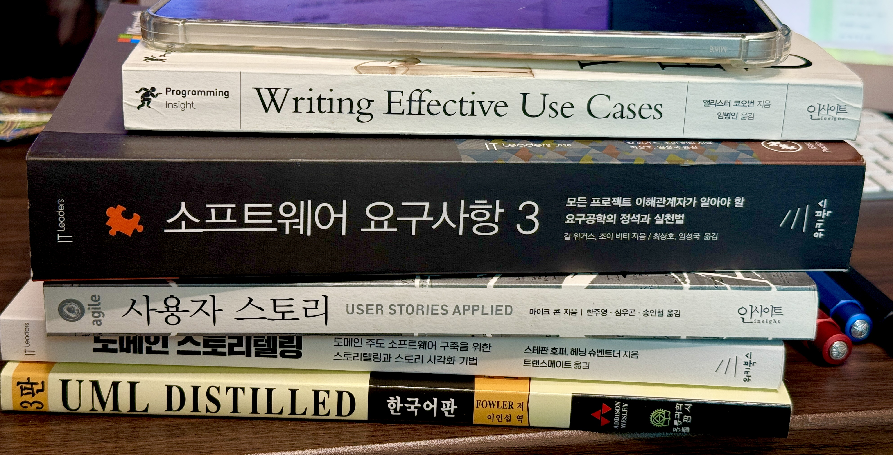
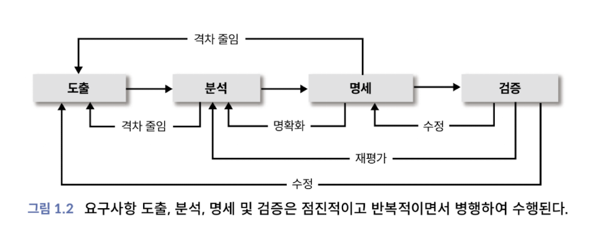
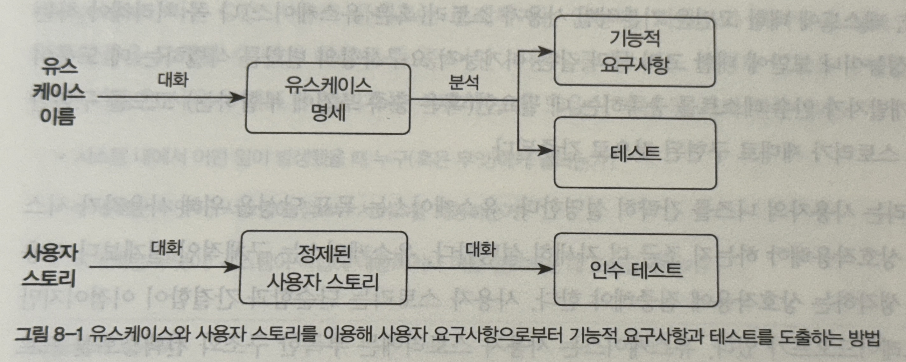
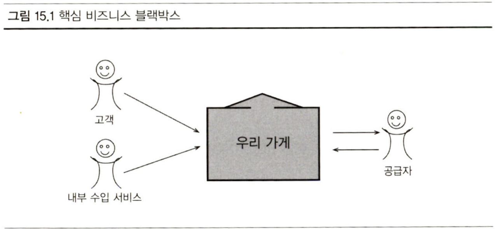
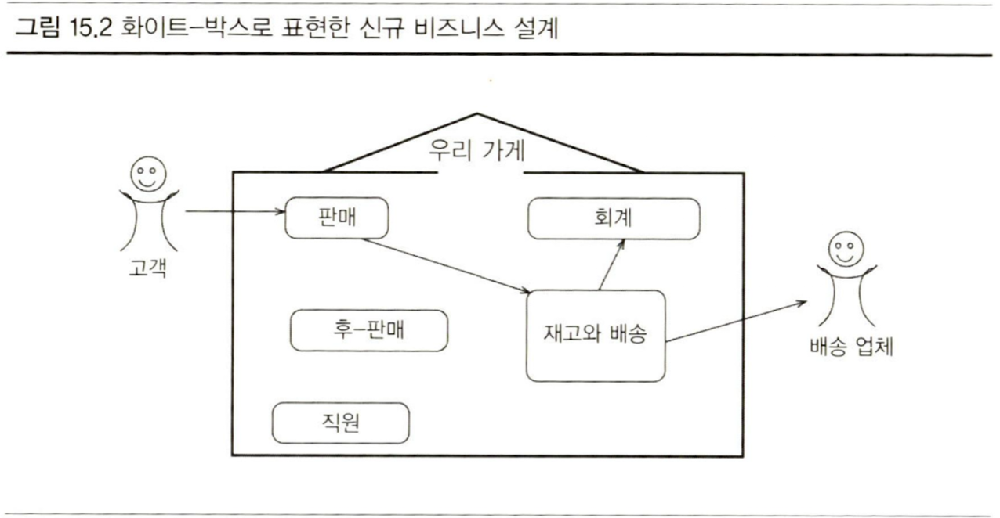
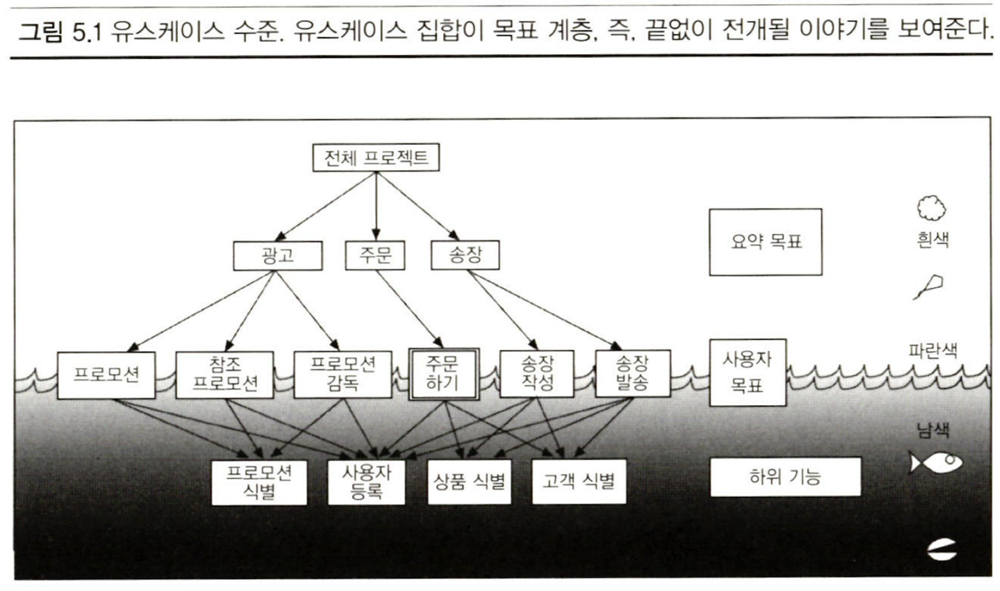

이 글은 요구사항 공학에 대한 기초적인 정리를 목표로 작성했다. 본격적으로 요구사항에 대해 이야기 하기 전에, 소프트웨어 엔지니어 관점에서 왜 요구사항이 필요한지 알아보자.

흔히들, 소프트웨어 개발자들은 무작정 코드를 치는 것에 앞서 반드시 분석과 설계가 앞서야 하며, 숙달된 고급 개발자일 수록 코딩 시간보다 설계 시간이 길어진다고 한다. 더구나 AI Assistant의 성능이 좋아진 지금, 인간이 일 할 수 있는 위치는 단순 코딩보다는 문제 해결을 위한 설계가 중요해졌다.

그렇다면, '설계'란 무엇일까? 다음은 위키백과에서 찾은 결과이다.

> [**설계**(設計)](https://ko.wikipedia.org/wiki/%EC%84%A4%EA%B3%84)는 공학, 특히 토목, 건축, 기계, 전기, 전자 분야에서 목적물을 만들거나 변경, 해체하는 일에 대한 계획을 세우는 일로 도면이나 각종 계산서, 산출내역서, 시방서 따위를 합쳐서 부르는 말이다. 일반적으로 계획을 세우는 일을 통틀어서 설계라고 부르기도 한다.

원하는 뉘앙스의 정의로는 조금 부족한 것 같다. 영어로 찾아보자.

> [**Design**](https://en.wikipedia.org/wiki/Design)은 사물, 프로세스 또는 시스템에 대한 개념이나 제안입니다 . _디자인_ 이라는 단어는 사고하는 주체가 의도적으로 만든 무언가를 가리키며 때로는 무언가의 내재적 특성인 디자인을 가리키는 데 사용됩니다. _디자인이라는_ 동사 는 디자인을 개발하는 과정을 표현합니다. 어떤 경우에는 명확한 사전 계획 없이 사물을 직접 구성하는 것도 디자인으로 간주될 수 있습니다(예: 예술 및 공예).디자인은 **특정 맥락 내에서 목적**을 가져야 하며, 일반적으로 **미적(Aesthetics), 기능적(functional), 경험적(experiential) 고려 사항을 고려하면서 특정 목표와 제약을 충족**하는 것을 목표로 합니다 .디자인의 전통적인 예로는 건축 및 엔지니어링 도면, 회로도, 재봉 패턴, 비즈니스 프로세스 모델 과 같은 덜 구체적인 아티팩트가 있습니다.

요약하자면, 설계란 _"특정 **맥락 내**에서 미적, 기능적, 경험적 고려 사항을 기반으로 목표와 제약에 대한 **계획 구성**"_ 이라 해야할까?

> [**소프트웨어 설계는**](https://en.wikipedia.org/wiki/Software_design) 소프트웨어 시스템이 구현되거나 수정되기 전에 어떻게 작동할지 개념화하는 프로세스입니다 . 소프트웨어 설계는 또한 설계 프로세스의 직접적인 결과, 즉 설계 문서와 문서화되지 않은 개념으로 구성된 소프트웨어 작동 방식에 대한 개념을 의미합니다. 소프트웨어 설계는 일반적으로 결과 시스템에 대한 목표에 따라 이루어지며 , 문제 해결과 계획이 포함됩니다. 여기에는 고수준 [소프트웨어 아키텍처](https://en.wikipedia.org/wiki/Software_architecture)와 저수준 구성 요소 및 알고리즘 설계가 모두 포함됩니다. 폭포수 개발 프로세스의 관점에서 소프트웨어 설계는 코딩에 앞서 **[요구사항(Software_requirements)](https://en.wikipedia.org/wiki/Software_requirements)을 따르는 활동**입니다.

소프트웨어의 설계를 위해선, 여러 아키텍처나 저수준의 단계에 앞서 요구사항의 작성이 우선시 되어야 한다. 요구사항이란 설계에 앞서 설계의 방향성을 잡기 위한 도구임을 유추할 수 있다.

---

## 요구사항

> 요구사항은 구현해야 할 것에 대한 사양이다. 시스템이 어떻게 **작동**해야 하는지 또는 시스템 **속성**에 대해 기술한 것이며, 시스템 개발 프로세스에 대한 **제약** 사항이 될 수 있다. - Requirements Engineering(Ian Sommerville 외, 1997)

요구사항은 단순히 소프트웨어에 대한 기술 뿐만 아니라 여러 유형의 정보를 담고있어야 한다는 점을 이야기하고 있다. 그렇다면 요구사항은 어떤 항목들이 있을까? 다음 그림은 '소프트웨어 요구사항의 정수'(Software Requirement Essentials, Karl Wiegers)에서 가져온, 간단한 **요구사항 명세**(Software Requirements Specification, SRS) 템플릿이다. (cf. IEEE 830)

```text
1. 개요
	1.1. 문서 목적
	1.2. 문서 규약
	1.3. 프로젝트 범위
	1.4. 참고 자료
2. 전반적인 설명
	2.1. 제품 관점
	2.2. 사용자 부류와 특성
	2.3. 운영 환경
	2.4. 설계 및 구현 제약 조건
	2.5. 추정 및 의존성
3. 시스템 기능
	3.x. 시스템 기능 X
		3.x.1. 설명
		3.x.2. 기능적 요구사항
4. 데이터 요구사항
	4.1. 논리 데이터 모델
	4.2. 데이터 사전
	4.3. 보고서
	4.4. 데이터 무결성, 백업, 폐기
5. 외부 인터페이스 요구사항
	5.1. 사용자 인터페이스
	5.2. 소프트웨어 인터페이스
	5.3. 하드웨어 인터페이스
	5.4. 통신 인터페이스
6. 품질 속성
	6.1. 가용성
	6.2. 성능
	6.3. 보안
	6.4. 안전
	6.x. [기타]
7. 국제화 및 현지화 요구사항
8. 기타 요구사항
9. 용어집
10. 분석 모델
```

칼 위거스는 이 책에서 명세 템플릿과 함께, 요구사항에 들어가야할 정보 유형들에 대해 정의한다.

- **비즈니스 요구사항**: 조직이 프로젝트를 수행하는 이유를 설명하고, 비즈니스 목표를 설정하고, 제품 비전을 정의하고, 기타 방향 설정 정보를 포함한다.
- **비즈니스 규칙**: 조직을 운영하는 작업에서 수행하는 행동을 정의하거나 제한한다.
- **제약**: 설계나 구현 활동에서의 제한 사항
- **데이터 요구사항**: 시스템이 조작해야 하는 데이터 개체 또는 요소, 구성, 속성, 관계, 입출력 형식
- **외부 인터페이스 요구사항**: 솔루션이 다른 소프트웨어 시스템이나 주변 요소 간의 인터페이스
- **기능적 요구사항**: 특정 상황에서 제품이 보여주는 **동작**에 대한 설명
- **비기능적 요구사항**: 일반적으로 **품질** 속성 요구사항이라고도 한다.
- **해결책 요구사항**: 특정 사용자 요구사항을 충족하고 프로젝트의 비즈니스 목표를 달성하기 위해 제작 중인 제품의 기능 및 특성 요구사항
- **시스템 요구사항**: 여러 하위 시스템으로 구성된 복잡한 시스템의 최상위 기능 또는 특성에 대한 설명, 하드웨어와 소프트웨어 요소를 모두 포함.
- **사용자 요구사항**: 사용자가 해결책을 통해 달성하고자 하는 작업과 목표.

이런 요구사항들을 통해 위 템플릿에 내용을 채워넣게 된다. 이런 요구사항 설계는 개발과 관리 단계로 나뉜다. 그렇다면 베스트 프렉티스 요구사항 개발은 어떻게 이루어져야할까? 

다음 네 단계로 이루어진다:

- **도출**(Elicitation): 요구사항을 수집, 발견, 만들기
- **분석**(Analysis): 요구사항의 **세부 사항, 가치, 상호 연결, 실행 가능성 및 기타 속성**에 관한 요구사항을 **평가**하여 낮은 위험으로 요구사항을 구현할 수 있을 만큼 파악.
- **명세**(Specification): 요구사항 지식을 다른 사람에게 **전달 가능한 형태**로 **표현**.
- **검증**(Validation): 요구사항이 이해 당사자의 요구를 어느 정도 충족시킬 수 있는지 **평가**.



이 때, 솔루션은 **사용**에 초점을 두어야 한다. 즉, **사용자 관점**에서 **기능 요구사항 도출**을 위한 노력을 하게 되고, 어떤 비즈니스 활동을 수행 할지 **시나리오**(scenario)를 작성한다. 

이런 시나리오 작성 방안은 두 가지가 있다.

- User Story
- Usecase



두 가지 모두, 주요 성공 시나리오(행복 경로)와 대안(alternative) 시나리오, 예외(Exceptions)와 조건을 표현하는 방법을 서술한다. 각각에 대해서 알아보자.

---

## User Story

> <**사용자 유형**>으로서, <**어떤 목표를 달성**>하기 위해 <**어떤 작업을 수행**>하고 싶다.

User Story는 애자일과 함께 등장했다. 마이크 콘은 사용자 스토리를 세 측면의 구성으로 설명한다.

- **서술**(written description): 스토리는 서술 형태로 기록되며, 계획하거나 기억하기 위한 단서로 사용된다.
- **대화**(conversation): 스토리는 대화를 통해 세부사항을 구체화한다.
- **테스트**(test): 확인(Confirmation) 과정. 스토리는 테스트를 통해 세부사항을 문서화하고 전달하며, 스토리의 완료 여부를 판단한다.

사용자 스토리는 작은 카드(Card)에 한 문장으로 작성된다.

> 카드는 고객의 요구사항을 '문서화'하기보다는 '표현'하기 위한 것 - Rachel Davie, 2001

또한 User Story는 **사용자에게 가치를 평가 받을 수 있도록** 작성되어야 한다.

- 프로그램은 커넥션풀을 통해 데이터베이스에 연결한다. (x)
- 사용자는 자신의 이력서를 웹 사이트에 게시할 수 있다. (o)

만약, API 개발 같은 이유로 사용자가 개발자라면, 전자의 예시도 올바른 User Story라고 할 수 있을 것이다. 핵심은 **고객에게** 가치를 평가 받을 수 있어야 한다는 것이다.

스토리가 너무 크다면, 이를 나눌 수 있다.

- 사용자는 채용 정보를 검색할 수 있다.
- 기업은 채용 정보를 게시할 수 있다.

이 두 가지만으로 설계, 개발을 하기는 힘들다. 이런 단위에 대해서 마이클 콘은 '**에픽**(epic)'이라고 한다. 에픽은 세개의 User Story로 나눌 수 있다.

- 사용자는 위치, 급여 수준, 직업 명, 회사명, 게시 날짜 등의 속성값으로 채용 정보를 검색할 수 있다.
- 사용자는 검색 조건과 일치하는 채용 정보를 볼 수 있다.
- 사용자는 채용 정보를 게시한 기업에 대한 세부 정보를 볼 수 있다.

이 단계보다 더 세부적으로 나눌 필요는 없다. 이러한 세부사항은 스토리 작성보다는 사용자와의 논의를 통해 밝혀나간다. 세부사항은 그저 주석으로 남겨둔다.

```card
- 사용자는 채용 정보를 게시한 기업에 대한 세부 정보를 볼 수 있다.
	// ooo은 설명, 급여, 위치 정보를 보여주어야 한다고 했음
```

그리고 이렇게 작성된 스토리는 **인수 테스트**(acceptance test) 작성을 통해 완료된다.

### INVEST

좋은 User Story는 다음 여섯가지를 만족한다.

- **독립적**이다 (Independent): 스토리 간의 의존성은 지양한다.
- **협상** 가능하다 (Negotiable): 스토리는 계약서와 같이 반드시 구현해야하는 목록이 아니다. 스토리는 짧은 설명일 뿐, 세부사항은 고객과 개발자의 대화를 통해 이루어진다.
- 사용자 및 **고객**에게 가치가 있다 (Valuable)
- **추정** 가능하다 (Estimatable): 스토리는 개발자가 작업에 드는 작업 소요시간이 추측하기 쉬운 단위여야 하다. 스토리가 추측 불가하다면 세가지 이유 중 하나다.
	1. 해당 분야의 도메인 지식이 부족하다.
	2. 기술적 지식이 부족하다.
	3. 스토리가 너무 크다.
- **작다** (small): 스토리가 크거나, 너무 작으면 계획 단계에서 사용하기에 부적합하다. 적절한 작은 크기란 어떤 것인가? 이 문제는 개발 팀의 역량과 사용하는 기술에 따라 결정된다.
- **테스트** 가능하다(Testable): 테스트가 통과해야 스토리가 성공적으로 완수되었다고 말한다. 테스트할 수 없는 스토리는, 종료 시점이 불분명하고 적합하지 못하다. 또한 이런 이유로 비기능적 요구사항은 스토리로 작성되어선 안된다.

스토리의 생명주기는, **사용자 또는 고객으로부터 시작되어 테스트 작성으로 완료된다.** INVEST는 이런 본질에 대한 주요한 포인트들을 짚은 것이다.

### 예시

```card
- 유저는 상품을 좋아요 등록할 수 있다.
// 좋아요 등록 시, 해당 상품의 좋아요 수가 증가한다.
// 중복된 좋아요 등록 요청은 멱등적으로 처리된다.
// 존재하지 않는 유저가 좋아요 등록을 시도하면 실패한다.
// 존재하지 않는 상품에 대해 좋아요 등록을 시도하면 실패한다.
```

### 스토리의 한계

유저 스토리는 분명히 사용자의 기능 요구사항을 도출하고 애자일한 작업을 위한 최적의 도구다. 이것이 스토리의 한계이기도 하다. 유저 스토리는 작업과 생명주기를 같이 한다. 스크럼이나 XP 와 같은 애자일에서 백로그로써 사용하기 위한 것이지, 관리 및 유지 보수용 문서화를 목적으로 하지 않는다.

유저 스토리는 좀 더 작은 팀, 고객과 개발자가 소통 가능한 단위에서 큰 힘을 발휘한다. 멀리 떨어진 채로, 또는 시간이 흘러 코드에 변화를 일으켜야할 때, 참조하기에 적합한 형태가 아니다.

이런 점들을 보완할 수 있는 방식이 유스케이스다.

---

## Usecase

> 도출 참가자가 '<**무엇을 하는 것**>을 원한다'고 말할때, 그것이 유스케이스일 가능성이 높다.

유스케이스는 유저 스토리보다 좀 더 상세한 시나리오를 서술한다. 일반적으로 적절한 유스케이스는 그것만으로도 이해관계자가 시나리오에 대한 적절한 설계를 할 수 있도록 돕는 것을 목적으로 한다.

유스케이스는 다음으로 이루어져있다.

- **ID**와 **이름**
- **일차 액터**: 유스케이스를 시작하는 사용자
- **이해관계자**와 **이해관계**: 유스케이스 수행에 **참여**하는 다른 **사용자** 또는 **시스템**과 그 관계
- **선행 조건**(precondition): 유스케이스를 시작하기 전의 필수 조건
- **보증**
	- **최소 보증**(minimal guarantee): 일차 액터가 목표 달성에 실패했을 때를 대비하여, 시스템이 이해관계자와 맺는 최소한의 약속 (ex. 시스템은 작업이 진행된 곳까지 로그를 남겼다.)
	- **성공 보증**(success guarantee): 유스케이스가 성공적으로 종료된 뒤에 어떤 이해관계가 충족되었는지를 서술하는 것 (ex. 시스템은 고객의 주문 처리를 시작하고, 지불 정보를 받았으며, 주문 요청을 기록했다.)
- **주요 성공 시나리오**: 시스템이 목표를 달성하거나 포기하는 수행 행동 단계(action step)의 순차적(sequence) 서술
	- 두 액터 간의 상호 작용 (ex. 고객이 주소를 입력한다)
	- 이해관계자의 이해관계를 보호하기 위한 검증 단계 (ex. 시스템이 비밀번호를 검증한다)
	- 이해관계자의 이해관계를 충족시키기 위한 내부 변경 (ex. 시스템이 잔고에서 일정액을 차감한다)
- **확장**(Extension): 주요 성공 시나리오에서의 분기점 서술이며, 가능한 모든 실패와 대안 흐름을 서술한다.
	- 대안 성공 경로 (사원이 단축 코드를 이용한다)
	- 일차 액터의 부적절한 행동 또는 행동 없음 (잘못된 비밀번호, 비밀번호 입력을 기다리는 시간 종료)
	- 검증 실패 처리를 위한 확장의 존재 암시 (유효하지 않은 계좌번호: )
	- 이해관계자의 부적절한 반응 또는 반응 없음 (응답을 기다리는 시간 종료)
	- 비정상적인 시스템의 내부 오류, 장애 (손상된 거래 기록, 응답이 5초안에 이루어지지 않음)

이런 양식의 유스케이스를 작성할 때 처음부터 마지막까지 신경써야할 가장 중요한 세가지가 있다.

- **범위**(scope): 무엇이 진짜 **목표** 시스템인가? 우리가 설계해야 할 영역.
- **일차 액터**(primary actor): **누구**의 목표인가?
- **수준**(level): 목표 수준이 어느정도의 높이인가?

### 유스케이스 스코프

**범위**(scope)는 내부(in)와 외부(out)으로 나눌 수 있다. 우리의 작업 범위인가를 특정해야한다. 이미 존재하거나, 다른 사람이 설계하는 영역인가.

기능 범위를 나열하고, 내부/외부를 지정한뒤, 우선순위를 지정한다. 범위화된 기능들은 하나하나가 설계의 경계선이 되고, 유스케이스 작성의 대상이 된다.

이런 설계 범위는 크게 세가지 분류로 나뉜다고 한다.

- **비즈니스**: 일차 액터의 목표를 달성하는 데 필요한 전체 조직 또는 회사의 행위 유스케이스
- **시스템**: 개발하게 될 하드웨어나 소프트웨어 부분에 대한 유스케이스. 시스템과 인터페이스 요소인 하드웨어, 소프트웨어, 사람으로 구성된다.
- **하위 시스템**: 메인 시스템의 사용 시작 부터의, 각 동작에 대한 유스케이스.

그리고 이런 범위는 블랙 박스, 화이트 박스 속성을 갖는다.

- 비즈니스 유스케이스가 조직의 부서와 **구성원의 상호 작용**에 대한 이야기까지 다룬다면 화이트 박스이며, 내부 상호작용을 감추고 액터와의 상호 작용에 대해서만 다룬다면 블랙박스일 것이다.





### 유스케이스 레벨

- **요약**(summary): 구름, 연, 흰색으로 표시한다.
- **사용자 목표**: 해수면, 파란색으로 표시한다.
- **하위 수준**: 심해, 조개, 남색으로 표시한다.



### 예시

다음은 이런 구성 요소들을 적용하여 직접 작성해본 유스케이스다.

```usecase
상품 좋아요 등록
- 일차 액터: 유저
- 선조건:
    - 유저는 로그인 상태다.
    - 유저는 상품을 특정할 수 있다.
    - 상품은 좋아요가 등록되지 않은 상태다.
- 최소 보증: 클라이언트는 실패 상태 메시지를 받으며, 상태가 바뀌지 않는다.
- 성공 보증: 유저는 상품에 좋아요를 등록하면, 상품의 좋아요 수가 증가한다.
- 주요 성공 시나리오
    1.유저는 상품에 좋아요를 누른다.
    2.클라이언트는 유저의 식별자와 상품의 식별자로 서버에 좋아요 등록 요청을 보낸다.
    3.서버는 유저가 존재하는지 확인한다.
    4.서버는 상품이 존재하는지 확인한다.
    5.서버는 상품에 좋아요가 등록되지 않은 상태인지 확인한다.
    6.서버는 상품에 좋아요를 등록한다.
    7.서버는 성공 상태를 반환한다.
    8.클라이언트는 상품에 좋아요를 등록하고, 상품의 좋아요 수를 증가시킨 것을 보여준다.
- 확장
    1a.유저가 이미 좋아요를 누른 상태라면, 좋아요를 취소한다.
    3a.유저가 존재하지 않는다면, NOT_FOUND 상태 코드를 반환한다.
    4a.상품이 존재하지 않는다면, NOT_FOUND 상태 코드를 반환한다.
    5a.이미 상품에 좋아요 등록이 되어있다면, CONFLICT 상태 코드를 반환한다.
```

유스케이스는 사용자 목표 레벨이며, 블랙박스 방식으로 액터와 시스템의 상호작용 시나리오를 보여주고 있다.

### 청바지가 더 낫다

> 이상하게 들릴지 모르지만, 일반적으로 지나치게 많이 작성하는 것보다는 지나치게 적게 작성하는 것으로 인한 손해가 덜하다. - 22장, Writing Effective UseCases (Alistair Cockburn, 2001)

짧고 읽기 쉬운 문서를 작성하면, 사람들은 그것을 읽는 데 더 신경을 쓰고, 질문을 한다는 것인데, 일련의 과정이 정보의 누락을 쉽게 보여준다는 것이다.

반대로, 백 개 정도의 유스케이스와 매우 낮은 레벨의 유스케이스를 상세하게 작성하게 된다면, 사람들은 아무도 신경을 써서 읽으려 하지 않을 것이며, 의사소통을 막게 된다고 한다. (특히 프로그래머가 이런 실수를 많이 하게 된다고 한다) 어떻게 해야 심플하면서도 적절하게 작성할지 고민해봐야 하겠다.

---

지금까지 설계를 위해 필요할 **요구사항 공학**과 개인적으로 그 중 가장 중요하다고 생각하는 **사용자 시나리오 도출**에 대한 두 가지 방법, **유저 스토리**와 **유스케이스**에 대해서 정리해봤다.

이런 설계 방식에 대한 이해는 내가 비즈니스에 대한 이해도를 높이고, 빠른 도메인 파악과 도메인 전문가와 기획자와의 소통에 큰 도움을 줄 것이다. 아직 요구사항 템플릿을 구성하는 모든 요소들에 대해 깊이 탐구하지 못했다. 이것은 내가 요구사항 공학에 대한 이해도가 낮기 때문이다. 때문에 글의 내용 또한 참조들의 내용을 정리하는 수준이었다. 이 글을 시작으로 요구사항 공학에 대해 좀 더 세밀하게 관련 내용을 파악하고, 정제된 나만의 이야기로 다시 돌아오겠다.

### 참조

- Software Requirement Essentials (Karl Wiegers 외, 2023)
- Software Requirements 3(Karl Wiegers 외, 2013)
- User Stories Applied(Mike Cohn, 2004)
- Writing Effective UseCases (Alistair Cockburn, 2001)
- wiki
	- https://ko.wikipedia.org/wiki/%EC%84%A4%EA%B3%84
	- https://en.wikipedia.org/wiki/Design
	- https://en.wikipedia.org/wiki/Software_design
