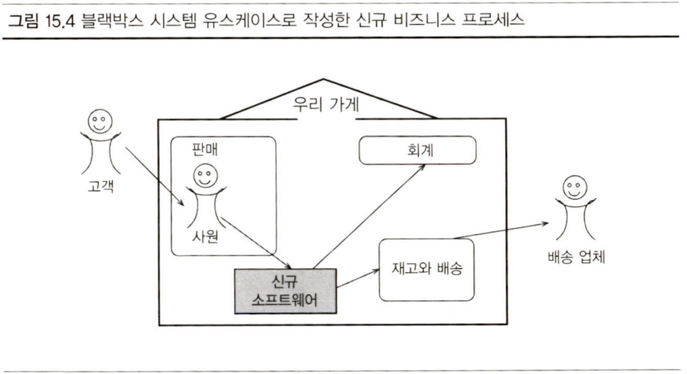

흔히들, 소프트웨어 개발자들은 무작정 코드를 치는 것에 앞서 반드시 분석과 설계가 앞서야 하며, 숙달된 고급 개발자일 수록 코딩 시간보다 설계 시간이 길어진다고 말한다. 특히 AI의 성능이 좋아진 지금, 사람이 할 수 있는 업무는 단순 코딩보다는 설계와 문제 해결이 되었다고 단언해도 좋을 것이다.

그런데 이런 소프트웨어 설계는 "**결과 시스템에 대한 목표에 따라 이루어지는 것**"이며, "**요구사항을 따르는 활동**"이다([위키백과](https://en.wikipedia.org/wiki/Software_design)). 좋은 설계는 명확한 목표, 즉 구체적인 요구사항이 있어야 가능하다. 그러나 소프트웨어 엔지니어들이 흔히 간과하는 것이 바로 이 ‘요구사항’이다. (나도 그랬다.)

그래서 이번 기회에 요구사항이란 무엇인지 기초를 정리하고, 그 요구사항을 도출해내는 방법을 찾아봤다.

---

## 요구사항

> 요구사항은 구현해야 할 것에 대한 사양이다. 시스템이 어떻게 **작동**해야 하는지 또는 시스템 **속성**에 대해 기술한 것이며, 시스템 개발 프로세스에 대한 **제약** 사항이 될 수 있다. - Requirements Engineering(Ian Sommerville 외, 1997)

이 정의는 요구사항은 단순히 기능에 대한 설명을 넘어서 시스템의 작동 방식, 품질 속성, 개발 과정의 제약사항까지 포괄하는 종합적인 명세서임을 말하고 있다. 그렇다면 요구사항 문서는 구체적으로 어떤 내용들을 담을까? 칼 위거스는 '소프트웨어 요구사항의 정수'(Software Requirement Essentials, Karl Wiegers)에서 요구사항에 들어가야할 정보 유형들에 대해 정의한다.

- **비즈니스 요구사항**: 조직이 프로젝트를 수행하는 이유, 비즈니스 목표, 제품 비전 정의, 기타 방향 설정 정보
- **비즈니스 규칙**: 조직의 운영에 대한 정의와 제한 사항
- **제약**: 설계나 구현 활동에서의 제한 사항
- **데이터 요구사항**: 시스템이 조작해야 하는 데이터 개체 또는 요소, 구성, 속성, 관계, 입출력 형식
- **외부 인터페이스 요구사항**: 솔루션이 다른 소프트웨어 시스템이나 주변 요소 간의 인터페이스
- **기능적 요구사항**: 특정 상황에서 제품이 보여주는 **동작**에 대한 요구사항
- **비기능적 요구사항**: **품질** 속성 요구사항
- **해결책 요구사항**: **제품**의 기능 및 특성 요구사항
- **시스템 요구사항**: 전체 시스템의 기능 또는 특성에 대한 요구사항 (하드웨어와 소프트웨어 요소를 모두 포함한다)
- **사용자 요구사항**: 사용자가 해결책을 통해 달성하고자 하는 작업과 목표

이런 일련의 정의들은 **요구사항 명세**(Software Requirements Specification, SRS) 템플릿으로 작성된다. 다음은 칼 위거스가 제시한 간단한 SRS 템플릿이다. (IEEE 830와는 약간 생김새가 다르다.)

```text
1. 개요
	1.1. 문서 목적
	1.2. 문서 규약
	1.3. 프로젝트 범위
	1.4. 참고 자료
2. 전반적인 설명
	2.1. 제품 관점
	2.2. 사용자 부류와 특성
	2.3. 운영 환경
	2.4. 설계 및 구현 제약 조건
	2.5. 추정 및 의존성
3. 시스템 기능
	3.x. 시스템 기능 X
		3.x.1. 설명
		3.x.2. 기능적 요구사항
4. 데이터 요구사항
	4.1. 논리 데이터 모델
	4.2. 데이터 사전
	4.3. 보고서
	4.4. 데이터 무결성, 백업, 폐기
5. 외부 인터페이스 요구사항
	5.1. 사용자 인터페이스
	5.2. 소프트웨어 인터페이스
	5.3. 하드웨어 인터페이스
	5.4. 통신 인터페이스
6. 품질 속성
	6.1. 가용성
	6.2. 성능
	6.3. 보안
	6.4. 안전
	6.x. [기타]
7. 국제화 및 현지화 요구사항
8. 기타 요구사항
9. 용어집
10. 분석 모델
```

요구사항의 유형과 문서 구조를 살펴보니, 요구사항 문서에는 정말 많은 내용이 들어간다는 것을 알 수 있다. 비즈니스 요구사항부터 시작해서 기능적 요구사항, 비기능적 요구사항, 제약사항까지... 

그렇다면 이런 방대한 내용들을 어떻게 도출되고 만들어내는 것일까? 고객이나 사용자가 "이런 시스템이 필요해요"라고 말한다고 해서 바로 문서가 바로 나오는 건 아닐 텐데 말이다.

### 요구사항 개발

이 복잡한 요구사항을 효과적으로 수집하고 정리하기 위해서, 칼 위거스는 다음과 같은 개발 프로세스를 제시한다.

1. **도출**(Elicitation): 요구사항을 수집, 발견, 만든다.
2. **분석**(Analysis): 요구사항의 **세부 사항, 가치, 상호 연결, 실행 가능성 및 기타 속성**에 관한 요구사항을 **평가**하여 낮은 위험으로 요구사항을 구현할 수 있을 만큼 파악한다.
3. **명세**(Specification): 요구사항 지식을 다른 사람에게 **전달 가능한 형태**로 **표현**한다.
4. **검증**(Validation): 요구사항이 이해 당사자의 요구를 어느 정도 충족시킬 수 있는지 **평가**한다.


이러한 요구사항 개발 과정에서 가장 중요한 원칙은 **사용자** 또는 **고객**에 초점을 두는 것이다. **사용자 관점**에서 **기능 요구사항을 도출**하려면, 사용자와 실제 업무 흐름에 대한 이해가 필요하다. 

그런데 여기서 문제가 생긴다. 사용자에게 "어떤 기능이 필요하세요?"라고 물어보면 대부분 추상적이거나 막연한 답변을 한다. "편리한 시스템", "빠른 처리", "사용하기 쉬운 인터페이스" 같은 식으로 말이다.

이런 추상적인 요구를 구체적인 기능 명세로 바꾸려면 어떻게 해야 할까? 가장 효과적인 방법은 사용자가 **실제로 어떤 상황에서, 어떤 순서로, 무엇을 하려고 하는지** 구체적인 **시나리오**(scenario)를 그려보는 것이다. "로그인한다"가 아니라 "회사 업무를 시작하기 위해 아침 9시에 사무실에서 컴퓨터를 켜고, 아이디와 비밀번호를 입력해서 시스템에 접속한다"처럼 구체적인 상황과 행동을 서술하는 것이다.

다음은 시나리오 작성에 대한 두 가지 대표적인 방식이다.

- User Story
- Usecase


두 가지 모두, 주요 성공 시나리오(행복 경로)와 대안(alternative) 시나리오, 예외(Exceptions)와 조건(condition)을 서술한다. 다만, 그 상세함과 활용 목적에 차이가 있다. 각각을 좀 더 자세히 살펴보자.

---

## User Story

> <**사용자 유형**>으로서, <**어떤 목표를 달성**>하기 위해 <**어떤 작업을 수행**>하고 싶다.

User Story는 애자일과 함께 등장했다. 마이크 콘은 User Stories Applied에서 사용자 스토리를 세 측면의 구성으로 설명한다.

- **서술**(written description): 서술 형태로 기록되며, 계획하거나 기억하기 위한 단서
- **대화**(conversation): 대화를 통해 세부사항을 구체화
- **테스트**(test): 확인(Confirmation) 과정. 세부사항을 문서화하고 전달하며, 스토리를 완료시킴

여기서 마이크 콘이 유저 스토리에서 가장 중요하게 주장한 점은, 유저 스토리는 **사용자에게 가치를 평가 받을 수 있도록** 작성되어야 한다는 것이다.

- 프로그램은 커넥션풀을 통해 데이터베이스에 연결한다. (x)
- 사용자는 자신의 이력서를 웹 사이트에 게시할 수 있다. (o)

만약, API 개발 같은 이유로 사용자가 개발자라면, 전자의 예시도 올바른 User Story라고 할 수 있을 것이다. 핵심은 **고객에게** 가치를 평가 받을 수 있어야 한다는 것이다. 마이크 콘은 좋은 User Story가 되기 위한 여섯 가지 규칙을 이야기한다.

### INVEST

- **독립적**이다 (Independent): 스토리 간의 의존성은 지양한다.
- **협상** 가능하다 (Negotiable): 스토리는 계약서와 같이 반드시 구현해야하는 목록이 아니다. 스토리는 짧은 설명일 뿐, 세부사항은 고객과 개발자의 대화를 통해 이루어진다.
- 사용자 및 **고객**에게 가치가 있다 (Valuable)
- **추정** 가능하다 (Estimatable): 스토리는 개발자가 작업에 드는 작업 소요시간이 추측하기 쉬운 단위여야 하다. 스토리가 추측 불가하다면 세가지 이유 중 하나다.
	- 해당 분야의 도메인 지식이 부족하다.
	- 기술적 지식이 부족하다.
	- 스토리가 너무 크다.
- **작다** (small): 스토리가 크거나, 너무 작으면 계획 단계에서 사용하기에 부적합하다. 적절한 작은 크기란 어떤 것인가? 이 문제는 개발 팀의 역량과 사용하는 기술에 따라 결정된다.
- **테스트** 가능하다(Testable): 테스트가 통과해야 스토리가 성공적으로 완수되었다고 말한다. 테스트할 수 없는 스토리는, 종료 시점이 불분명하고 적합하지 못하다. 또한 이런 이유로 비기능적 요구사항은 스토리로 작성되어선 안된다.

사항들을 봤을 때, 스토리는 **고객**이 바라는 **기능을 서술**해야하며, 그 **크기는 적절**해야한다고 요약 가능하다. 그런데 고객으로부터 도출된 스토리의 크기가 너무 크다면 어떻게 해야 할까? 그저 개발팀의 역량에 맡겨야할까? 커다란 유저 스토리는 작업 단위의 크기로 나눌 수 있다. 다음과 같은 스토리가 도출되었다고 가정하자.

- 사용자는 채용 정보를 검색할 수 있다.
- 기업은 채용 정보를 게시할 수 있다.

이 두 가지만으로 설계, 개발을 하기는 힘들다. 이런 커다란 크기의 유저 스토리에 대해서 마이크 콘은 '**에픽**(epic)'이라고 정의했다. 이 에픽은 세개의 User Story로 나눌 수 있다.

- 사용자는 위치, 급여 수준, 직업 명, 회사명, 게시 날짜 등의 속성값으로 채용 정보를 검색할 수 있다.
- 사용자는 검색 조건과 일치하는 채용 정보를 볼 수 있다.
- 사용자는 채용 정보를 게시한 기업에 대한 세부 정보를 볼 수 있다.

세 개로 나뉘어진 스토리는 상위 스토리 아래, 고객이 이해 가능한 스토리로 구성된다. 유저 스토리가 작업 단위가 되었다면, 더 세부적으로 나누지 않는다. 그러한 세부사항은 스토리 작성보다는 사용자와의 논의를 통해 밝혀나간다. 만약 스토리 도출 과정에서 세부사항이 나타났다면 주석으로 남겨둔다.

```card
- 사용자는 채용 정보를 게시한 기업에 대한 세부 정보를 볼 수 있다.
	// ooo은 설명, 급여, 위치 정보를 보여주어야 한다고 했음
```

### 실습

'상품에 대한 좋아요 기능'이라는 에픽이 주어졌다고 가정해보자. 이를 INVEST 원칙에 맞게 작은 사용자 스토리들로 나누어보면 어떨까?

```card
- 유저는 상품을 좋아요 등록할 수 있다. 
- 유저는 좋아요한 상품 목록을 볼 수 있다. 
- 유저는 좋아요를 취소할 수 있다.
```

그리고 이 중 '유저는 상품을 좋아요 등록할 수 있다.' 에 대한 카드를 작성하면 다음과 같을 것이다.

```card
- 유저는 상품을 좋아요 등록할 수 있다.
// 좋아요 등록 시, 해당 상품의 좋아요 수가 증가한다.
// 중복된 좋아요 등록 요청은 멱등적으로 처리된다.
// 존재하지 않는 유저가 좋아요 등록을 시도하면 실패한다.
// 존재하지 않는 상품에 대해 좋아요 등록을 시도하면 실패한다.
```

주의할 점은 앞서 이야기한 것과 같이, 유저 스토리는 카드에 적힌 문구 자체보다도, 사용자 또는 고객과의 **커뮤니케이션**이 핵심이다. 유저 스토리는 단순히 해야 할 일을 표현하고, 논의의 출발점 역할을 하는 도구다. 다만, 이런 점은 유저 스토리의 한계로 이어지기도 한다.

### 유저 스토리의 한계

유저 스토리는 사용자의 기능 요구사항을 도출하고 애자일하게 작업을 수행하기 위한 최적의 도구다. 특히 작은 팀, 고객과 개발자가 긴밀히 소통 가능한 환경에서 효과적이다.

다만 유저 스토리는 작업과 생명주기를 함께하기 때문에, 주로 스크럼이나 XP와 같은 애자일 프로세스에서 백로그로써는 알맞지만, 장기적인 관리나 유지보수를 위한 문서화에는 적합하지 않다.

특히, 물리적으로 떨어져 있거나, 시간이 오래 지나 코드에 변화를 줄 필요가 있을 때, 또는 조직 규모가 아주 클 경우에는 유저 스토리만으로 참조하거나 의사소통하기 어렵다.

이러한 유저 스토리의 한계를 보완하기 위한 방법 중 하나가 바로 ‘유스케이스’다. 유스케이스는 시나리오를 보다 명확히 문서화하여 장기적인 유지보수나 큰 규모의 조직에서도 유용하게 활용할 수 있다.

---

## Usecase

> 도출 참가자가 '<**무엇을 하는 것**>을 원한다'고 말할때, 그것이 유스케이스일 가능성이 높다.

유스케이스는 유저 스토리보다 좀 더 상세한 시나리오를 서술한다. 일반적으로 적절한 유스케이스는 그것만으로도 이해관계자가 시나리오에 대한 적절한 설계를 할 수 있도록 돕는 것을 목적으로 한다.

유스케이스는 다음으로 이루어져있다.

- **ID**와 **이름**
- **일차 액터**: 유스케이스를 시작하는 사용자
- **이해관계자**와 **이해관계**: 유스케이스 수행에 **참여**하는 다른 **사용자** 또는 **시스템**과 그 관계
- **선행 조건**(precondition): 유스케이스를 시작하기 전의 필수 조건
- **보증**
	- **최소 보증**(minimal guarantee): 일차 액터가 목표 달성에 실패했을 때를 대비하여, 시스템이 이해관계자와 맺는 최소한의 약속 (ex. 시스템은 작업이 진행된 곳까지 로그를 남겼다.)
	- **성공 보증**(success guarantee): 유스케이스가 성공적으로 종료된 뒤에 어떤 이해관계가 충족되었는지를 서술하는 것 (ex. 시스템은 고객의 주문 처리를 시작하고, 지불 정보를 받았으며, 주문 요청을 기록했다.)
- **주요 성공 시나리오**: 시스템이 목표를 달성하거나 포기하는 수행 행동 단계(action step)의 순차적(sequence) 서술
	- 두 액터 간의 상호 작용 (ex. 고객이 주소를 입력한다)
	- 이해관계자의 이해관계를 보호하기 위한 검증 단계 (ex. 시스템이 비밀번호를 검증한다)
	- 이해관계자의 이해관계를 충족시키기 위한 내부 변경 (ex. 시스템이 잔고에서 일정액을 차감한다)
- **확장**(Extension): 주요 성공 시나리오에서의 분기점 서술이며, 가능한 모든 실패와 대안 흐름을 서술한다.
	- 대안 성공 경로 (사원이 단축 코드를 이용한다)
	- 일차 액터의 부적절한 행동 또는 행동 없음 (잘못된 비밀번호, 비밀번호 입력을 기다리는 시간 종료)
	- 검증 실패 처리를 위한 확장의 존재 암시 (유효하지 않은 계좌번호: )
	- 이해관계자의 부적절한 반응 또는 반응 없음 (응답을 기다리는 시간 종료)
	- 비정상적인 시스템의 내부 오류, 장애 (손상된 거래 기록, 응답이 5초안에 이루어지지 않음)

이런 양식의 유스케이스를 작성할 때 처음부터 마지막까지 신경써야할 가장 중요한 세가지가 있다.

- **범위**(scope): 무엇이 진짜 **목표** 시스템인가? 우리가 설계해야 할 영역.
- **일차 액터**(primary actor): **누구**의 목표인가?
- **수준**(level): 목표 수준이 어느정도의 높이인가?

일차 액터는 기능을 원하고, 시작하는 사용자를 의미한다. 범위(Scope)와 수준(Level)은 무엇일까? 유스케이스를 작성하다보면 둘 사이에 차이가 없다고 느껴진다. 하지만 둘은 명확히 다르며, 반드시 유스케이스를 작성하는 내내 모든 구성 요소에서 각각 고려되어야 한다.

### 유스케이스 스코프

**범위**(scope)는 내부(in)와 외부(out)으로 나눌 수 있다. 우리의 작업 범위인가를 특정해야한다. 이미 존재하거나, 다른 사람이 설계하는 영역인가를 분석한다. 기능 범위를 나열하고, 내부/외부를 지정한뒤, 우선순위를 지정한다. 이런 과정을 통해 범위화된 기능들은 하나하나가 설계의 경계선이 되고, 유스케이스 작성의 대상이 된다.

이런 스코프는 세가지로 나뉜다.

- **비즈니스**: 일차 액터의 목표를 달성하는 데 필요한 전체 조직 또는 회사의 행위 유스케이스
- **시스템**: 개발하게 될 하드웨어나 소프트웨어 부분에 대한 유스케이스. 시스템과 인터페이스 요소인 하드웨어, 소프트웨어, 사람으로 구성된다.
- **하위 시스템**: 메인 시스템의 사용 시작 부터의, 각 동작에 대한 유스케이스.

또한 스코프는 블랙 박스, 화이트 박스 속성을 갖는다. 비즈니스 유스케이스가 조직의 부서와 **구성원의 상호 작용**에 대한 이야기까지 다룬다면 **화이트 박스**, 내부 상호작용을 감추고 액터와의 상호 작용에 대해서만 다룬다면 **블랙박스**다.




### 유스케이스 레벨

유스케이스 레벨은 스코프와는 조금 다르다. 스코프가 유스케이스가 이야기 할 것에 대해 이야기했다면, 레벨은 프로세스의 세밀함 정도에 대해 이야기한다. (coarse-grained, fine-grained)

코오번은 유스케이스의 레벨을 세 단계에서 좀 더 세밀하게 다섯 단계까지 나눴다.

- **요약**(summary): 구름, 연 (흰색)으로 표시한다.
- **사용자 목표**: 해수면 (파란색)으로 표시한다.
- **하위 수준**: 심해, 조개 (남색)으로 표시한다.


### 실습

다음은 직접 '상품 종아요 등록'이라는 사용자의 기능 요구사항에 대해 작성한 유스케이스이다. 사용자 목표 레벨이며, 블랙박스 방식으로 액터와 시스템의 상호작용 시나리오를 보여주고 있다.

```usecase
상품 좋아요 등록
- 일차 액터: 유저
- 선조건:
    - 유저는 로그인 상태다.
    - 유저는 상품을 특정할 수 있다.
    - 상품은 좋아요가 등록되지 않은 상태다.
- 최소 보증: 클라이언트는 실패 상태 메시지를 받으며, 상태가 바뀌지 않는다.
- 성공 보증: 유저는 상품에 좋아요를 등록하면, 상품의 좋아요 수가 증가한다.
- 주요 성공 시나리오
    1.유저는 상품에 좋아요를 누른다.
    2.클라이언트는 유저의 식별자와 상품의 식별자로 서버에 좋아요 등록 요청을 보낸다.
    3.서버는 유저가 존재하는지 확인한다.
    4.서버는 상품이 존재하는지 확인한다.
    5.서버는 상품에 좋아요가 등록되지 않은 상태인지 확인한다.
    6.서버는 상품에 좋아요를 등록한다.
    7.서버는 성공 상태를 반환한다.
    8.클라이언트는 상품에 좋아요를 등록하고, 상품의 좋아요 수를 증가시킨 것을 보여준다.
- 확장
    1a.유저가 이미 좋아요를 누른 상태라면, 좋아요를 취소한다.
    3a.유저가 존재하지 않는다면, NOT_FOUND 상태 코드를 반환한다.
    4a.상품이 존재하지 않는다면, NOT_FOUND 상태 코드를 반환한다.
    5a.이미 상품에 좋아요 등록이 되어있다면, CONFLICT 상태 코드를 반환한다.
```

### 청바지가 더 낫다

앞서 살펴본 UseCase 실습에서 알 수 있듯이, UseCase는 매우 상세하고 체계적인 문서가 될 수 있다. 여기서 주의해야 할 점이 있다.

> 이상하게 들릴지 모르지만, 일반적으로 지나치게 많이 작성하는 것보다는 지나치게 적게 작성하는 것으로 인한 손해가 덜하다. - 22장, Writing Effective UseCases (Alistair Cockburn, 2001)

짧고 읽기 쉬운 문서를 작성하면, 사람들은 그것을 읽는 데 더 신경을 쓰고, 질문을 한다는 것인데, 일련의 과정이 정보의 누락을 쉽게 보여준다는 것이다.

반대로, 백 개 정도의 유스케이스와 매우 낮은 레벨의 유스케이스를 상세하게 작성하게 된다면, 사람들은 아무도 신경을 써서 읽으려 하지 않을 것이며, 의사소통을 막게 된다고 한다. (특히 프로그래머가 이런 실수를 많이 하게 된다고 한다) 어떻게 해야 심플하면서도 적절하게 작성할지 고민해봐야 하겠다.

---

지금까지 설계를 위해 필요할 **요구사항 공학**과 개인적으로 그 중 가장 중요하다고 생각하는 **사용자 시나리오 도출**에 대한 두 가지 방법, **유저 스토리**와 **유스케이스**에 대해서 정리해봤다. 이런 설계 방식에 대한 이해는 빠른 도메인 파악과 도메인 전문가와 기획자와의 소통에 큰 도움을 줄 것이다.

아직 요구사항 공학의 모든 요소를 깊이 탐구하진 못했다. 이것은 나의 현재 이해도가 부족하기 때문이다. 때문에 이 글의 내용 또한 참조들의 내용을 정리하는 수준이었다고 생각한다. 이 글을 시작으로 요구사항 공학에 대해 좀 더 세밀하게 관련 내용을 파악하고, 정제된 나만의 이야기로 다시 정리해보려 한다.

### 참조

- Software Requirement Essentials (Karl Wiegers 외, 2023)
- Software Requirements 3(Karl Wiegers 외, 2013)
- User Stories Applied(Mike Cohn, 2004)
- Writing Effective UseCases (Alistair Cockburn, 2001)
- https://en.wikipedia.org/wiki/Software_design
