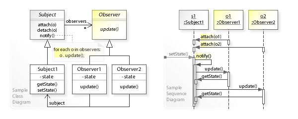
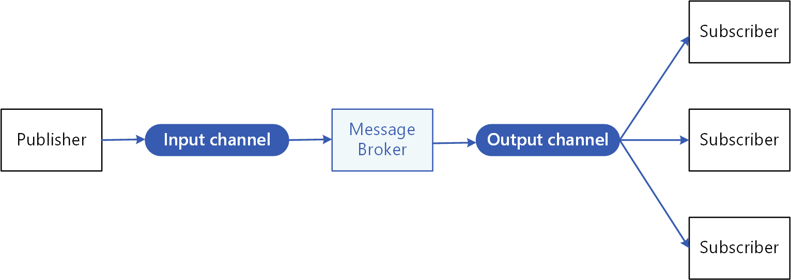
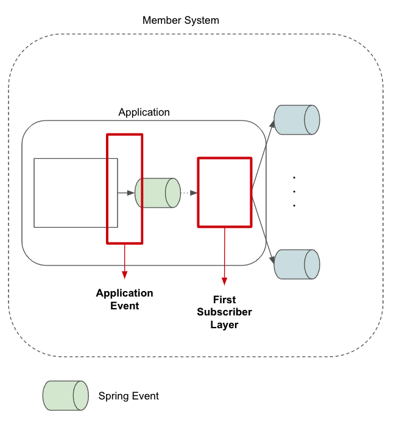
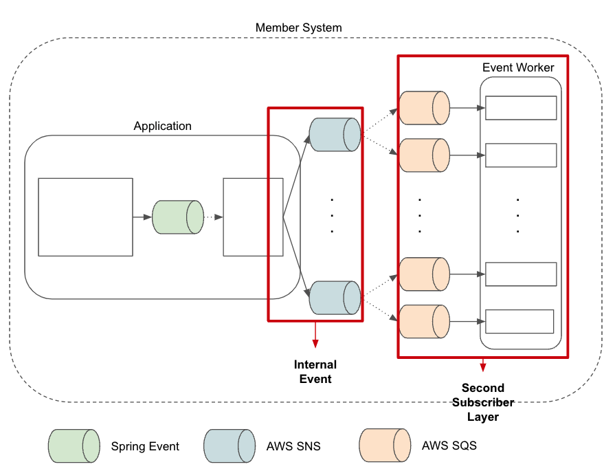

이 글은 애플리케이션 이벤트에 대한 분석 정리글이다. 사실 동기화와 락 없는 동기화 기법에 대한 글을 작성했지만, 너무 볼륨이 커져, 우선은 애플리케이션 이벤트에 대한 이야기로 간략히 정리했다.

이벤트만큼 흥미로운 주제가 있을까? 이벤트 발행자는 그저 이벤트를 발행할 뿐이다. 이벤트를 필요로 하는 소비자가 알아서 이벤트를 가져간다. 이런 구조는 유연성을 극대화한다. 하지만 트레이드 오프는 존재한다. 이제부터 이벤트에 대해서 정리해보겠다.

---

## 이벤트란?

이벤트란 '**일어난 일에 대한 결과**'다. 이런 이벤트는 레이어드 아키텍처 관점에 따라 도메인 이벤트와 애플리케이션 이벤트 두 가지로 나눌 수 있다.

- **애플리케이션 이벤트**: 애플리케이션 기능으로써 발생되는 이벤트
- **도메인 이벤트**: 도메인 모델의 상태 변화로써 발생되는 이벤트

애플리케이션 레이어는 유스케이스-기능 흐름을 표현한다. 도메인 레이어는 도메인 모델에 대한 상태 변경과 그 행동 로직을 표현한다. 각 이벤트는 이런 레이어의 관점을 반영한다.

애플리케이션 이벤트는 단순히 도메인 로직에 한정되지 않는다. 유스케이스 - 기능 동작에 대한 이벤트를 발행하게 된다. 하지만 그 댓가로 요구사항의 변화에 취약해질 우려가 있다.

반면 도메인 이벤트는 조금 다르다. 도메인 로직에 한정되지만, 의존성이 오로지 애그리거트 내부에 있다. 때문에 이벤트 객체의 변화가 비교적 적다. 다만 오로지 해당 도메인 모델의 불변식에만 관심을 가지는 이벤트가 될 것이다.

---

## 구현체

이벤트를 구현하는 디자인 패턴은 두 가지다. 둘 모두 GoF에서 처음 소개되었다.

- **Observer 패턴**: Subject가 관찰자 리스트를 직접 들고 직접 호출
	- Subject => Observer
	- 동기, 프로세스 내부
- **Pub-Sub 패턴**: 중간 브로커를 통해 간접 전달
	- Publisher => Broker => Subscriber
	- 비동기, 프로세스/서비스

스프링은 ApplicationEvent 기능을 제공한다. 이 API는 Pub-Sub처럼 보이지만, 실제 기본 동작은 프로세스 내 동기 - 옵저버의 동작으로 이루어진다. `@Async`나 외부 브로커를 써야 진짜 Pub-Sub이 된다.

이 글의 주제는 '애플리케이션 이벤트'다. 좀 더 구체적으로 말하면 **애플리케이션 티어에서 발행되고 소비되는 이벤트**에 대한 이야기다. 이런 이벤트는 '로컬 이벤트'라 할 수 있겠다.

애플리케이션 이벤트와 대비되는 '글로벌 이벤트'가 있겠다. 글로벌 이벤트는 Message Queue, 카프카 등의 외부 브로커를 통해 간접적으로 전달한다. Pub-Sub 패턴인 것.

---

## 이벤트의 형태

이벤트는 두 가지 형태를 띌 수 있겠다.

- zero-payload
- payload

이 구조는 두 가지 관점에서 고려해야한다.

- 소비 대상
- 소비 시점

일단 발행자의 관점은 생각하지 않았다. 도메인 관점으로 봤을 때는 발행자의 관점에서 보는게 맞다. 발행자의 관점에서 소비자가 뭘 좋아할지 모르니 최대한 많은 도메인 정보를 담아 보낸다. payload의 방식이다.

반면 zero-payload는 이벤트 발행에 대한 식별자만 제공하고, 재조회를 통해 필요한 데이터를 확인하도록 한다.

두 방식을 비교했을때, payload는 이벤트 발생 당시에 대한 정보를 생생하게 담고 있다. 하지만 이벤트가 소비되는 시점에서, 현재 시점과의 데이터 차이가 있을 수 있다. 실시간성이 부족하다는 뜻이다.

그렇다면, zero-payload가 좋을까? zero-payload는 이벤트가 발생된 시점의 정보를 담고 있지 않다. 때문에, 정보 조회 시점의 데이터는 이벤트 발행자가 의도한 바가 아닐 수 있다.

어떻게 사용해야할까? zero-payload는 그 특성상 트랜잭션 내부에서 사용했을 때 강력하다고 생각한다. 더구나 JPA와 같은 영속성 컨텍스트나 캐싱을 제공하는 애플리케이션 구조라면 더욱 그렇다. 트랜잭션 내부는 ACID를 보장한다. zero-payload는 발행 시점 데이터와 동일할 가능성이 높다. 다만, 이벤트가 발행 되고, 또 다른 변경이 일어나는 로직이 있을 경우, 중간 상태는 소실되고 말 것이다.

반면 네트워크와 같은 외부 연결, 또는 강력한 일관성이 보장되지 않는 상황에서는 payload가 유리할 것이다. 최종적 일관성이 자연스러운 상황이기 때문이다. payload에 의한 약간의 실시간성 누락은, 이벤트 소싱을 통해 그 히스토리 추적과 복구를 제공함으로써 위험도를 줄여야하지 않을까 싶다.

---

이벤트에 대한 트레이드 오프는 명확하다.

이벤트에 의한 메시지 전달은 단방향이다. 이벤트를 발행함으로써 반환값을 받는다? 물론 이런 구조가 불가능한 것은 아니다. 하지만, 스프링 MVC 와 같은 구조에서는 바람직하지 않다. 

또한 이벤트는 암묵적인 흐름으로 동작되고, 흐름이 점프되며, 비동기적이기도 하다. 그러므로 유지보수가 단순한 호출-응답 구조에 비해 난이도를 갖고 있다.

하지만 이런 위의 이유들은 이벤트가 의존성을 끊는다는 의미이기도 하다. 이벤트에 의한 기능의 구현 흐름은 인과를 갖추고 있다. 이런 인과 흐름을 관찰하기에 어렵긴 하지만, 기능의 변화에 대해 자유로워진다.
