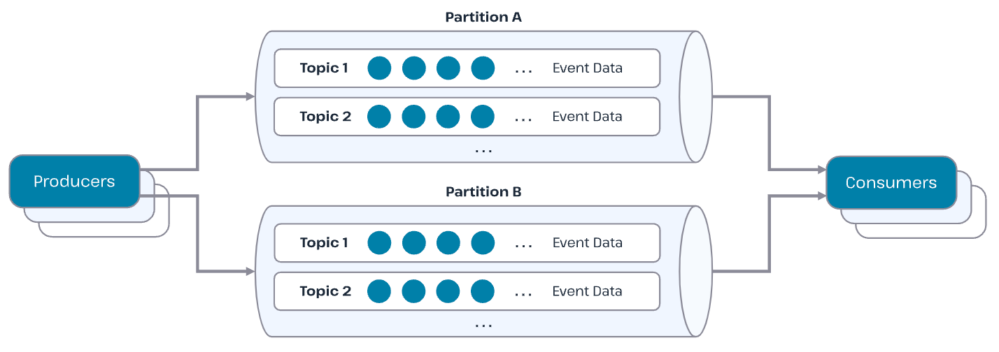
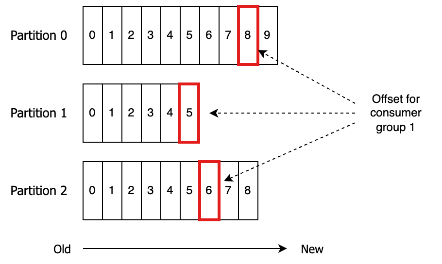
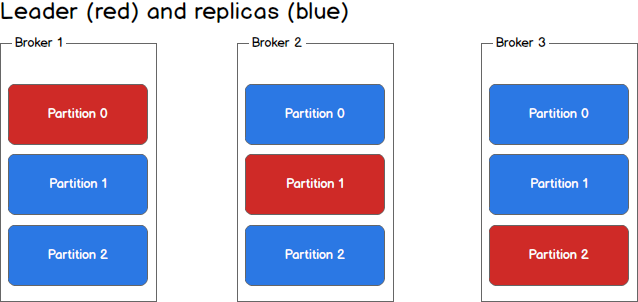

카프카를 어떻게 써야하나. 나는 내가 짠 코드를 신뢰하지 않는다. 

> 예술은 완성될 수 없다, 그저 버려질 뿐이다.. (Art is never finished, only abandoned.) - 레오나르도 다빈치

심지어 예술은 예쁘기라도 하지, 코드는 분석해야하는... 그저 부채다. 그런 코드로 쌓아올린 애플리케이션은 믿을 수 없다. 때문에 테스트를 작성해야한다.

8주차 루퍼스 과정은 지난 주차 애플리케이션 이벤트에 이어, 카프카에 대한 이야기다. 카프카는 분산 로그 저장소이지만, 이벤트 드리븐 아키텍처에서 메세지 브로커로 인기를 얻고있다. 가용성과 속도 측면에서 우수하기 때문이다.

하지만 그래서 고민이 시작된다. 내 애플리케이션을 테스트하는데, 다른 애플리케이션에서 발행하는 이벤트에 대한 테스트는 어떻게 작성 해야할까? 카프카가 아무리 고가용성이라지만, 네트워크는 믿을 수 없고, 내가 작성하는 코드도 동작하는지 확신할 수 없다. 자동화된 테스트 코드를 통해 안전을 보장받아야 마음이 놓인다. 방법을 찾아야 한다.

이 글은 백엔드 개발자 관점에서 **테스트 우선적인 사고**로 **카프카를 이용한 서비스**를 개발하려는 시도에 대한 이야기다.

---

## 분해

그냥 무작정 '카프카를 사용하는 서비스를 테스트하자!' 하면 막막하다. 막막할땐 분해하는게 좋다. 나폴레옹 전법, Devide & Conquer를 적용해보자.

어떤 부분을 테스트 할 것인가? 비즈니스 로직을 테스트하는 것인가, 인터페이스를 테스트하는 것인가.
'카프카를 이용하는 부분'을 테스트한다는 것은 '인터페이스'에 대한 이야기라고 생각한다. 카프카를 이용하는 부분은 브로커로부터 이벤트를 컨슘하여 애플리케이션 내부로 전달하는 **핸들링 인터페이스**이기 때문이다.

카프카를 테스트한다는 것은 애플리케이션의 유스케이스에서 조금 벗어나있다. 내가 테스트하고 싶은 것은, 카프카의 구성 설정에 대한 이야기다. 전체 플로우의 이벤트 발행자(Publisher)에 해당하는 카프카의 프로듀서(Producer) 부분에는 별로 관심이 없다. 알아서 잘 발행하겠지...

문제는 브로커(Broker)와 구독자(Subscriber)에 해당하는 카프카의 컨슈머(Consumer)다. 분해 대상을 좀 더 특정하기 위해, 먼저 카프카의 구조를 분석해보자.

---

## 카프카 구조

브로커는 토픽과 파티션으로 구성된다.

- **토픽**(Topic): 논리적 리스트 저장소 단위
- **파티션**(Partition): 물리적 리스트 저장소 단위

이벤트를 발행하는 발행자(Publisher)를 **프로듀서**(Producer)라고 하고, 구독자(Subscriber)를 **컨슈머**(Consumer)라고 한다. 이런 구성원들을 그림으로 그려보면 다음과 같다.



또한 카프카는 **컨슈머 그룹**을 둔다. 각 컨슈머 그룹은 각각의 컨슈머가 파티션에 대해 딱 한번만 호출하고자다. 컨슈머가 메시지를 읽다가 실패해도, 메시지는 유실되지 않는다. 그리고 다른 컨슈머 그룹에 의해 별도로 읽힐 수 있다.


컨슈머는 **오프셋**(Offset)으로부터 다음 메세지를 컨슘하는데, 컨슈머 그룹마다 오프셋을 다르게 가지기 때문이다.



파티션과 컨슈머는 여러개가 가능하고, 또 바람직하다. 병렬적인 처리를 통해 처리량을 높일 수 있기 때문. 여기에 토픽과 컨슈머들 갯수에 주의사항이 있다.

1. 파티션과 컨슈머는 1:1 일때, 병목이 없다. 


파티션은 하나의 물리적인 빨대와 같다. 

2. 소스(프로듀서)로 부터 파티션이란 빨대를 컨슈머가 물고있는데, 다른 파티션도 이 컨슈머가 담당한다면, 번갈아가며 빨대를 물어야 한다. 병목이 된다.


3. 컨슈머가 파티션의 갯수보다 많으면, 남는 컨슈머는 논다. 하지만, **리밸런싱**(Rebalancing)에 대비하여 오버헤드를 줄일 수 있게 도와준다.


리밸런싱에 대비하여 오버헤드를 줄일 수 있게 도와준다는 게 무슨 의미일까? 

만약 컨슈머 중 하나가 죽으면, 그룹 코디네이터(Group Coordinator)가 **리밸런싱**(Rebalancing)을 트리거한다. 리밸런싱이란 특정 **컨슈머나 파티션 구성에 이슈**가 생겨 **일부 메세지들의 컨슘이 안될 때**, **정상적인 컨슈머가 처리되지 않고 있는 파티션들을 담당하도록 조정**하는 작업을 의미한다.

이때 카프카는 STW(Stop The World)가 일어나고, 전체 시스템의 단일 장애지점(SPOF, Single Point of Failure)으로 발전한다. 때문에 컨슈머를 파티션보다 갯수가 많게한다. 컨슈머 몇개가 놀 순 있겠지만, 컨슈머가 죽으면, 놀던(Idle) 컨슈머가 일하기 시작하면서, 이런 오버헤드를 줄인다. Lag(컨슈머가 메시지 프로듀서보다 얼마나 뒤처져 있는지를 나타내는 지표)가 쌓이는 것을 최소화할 수 있다.

이런 리밸런싱에 대한 부분은 분명히 중요하다. 하지만 이것은 애플리케이션의 레벨이 아니다. 마이크로 서비스의 영역이라고 본다. RDBMS로 치면, 인덱스를 설계하는 것과 같다. 애플리케이션의 읽기 속도를 향상하기 위해서는, 비즈니스를 이해하고 애플리케이션을 개발하는 개발자가 쿼리를 작성한다. 그러면서 그 쿼리의 향상을 위해 인덱스를 설계한다. 이를 카프카에 유비해본다면, 카프카의 설정을 잡는 것은 RDBMS의 인덱스를 설계하는 것과 비슷한 단계의 고민이다. 애플리케이션의 레벨은 아니지만, 서비스의 **성능**에 연관 있다.

하지만 성능이 과연 애플리케이션의 테스트 코드 작성에 유의미할까? 물론 아예 없진 않을 것이다. 하지만 이것은 좀 더 **성능 측정 영역이지, 기능 확인 - 회귀 방지와 인수 목적의 테스트 영역이 아니다.**

프로듀서, 브로커, 퍼블리셔의 구조를 살펴봤다. 이제 우리가 테스트 해볼 영역이 보이기 시작한다. 우리가 테스트 할 것은 구조 이전에, 이벤트를 전달하는 **방법에 대한 설계**다.

---

## 이벤트 전달 방법 설계

이벤트 전달 **구조**에 대한 설계가 아니라, **방법**에 대한 테스트가 필요하다. 카프카의 프로듀서와 컨슈머는 단지 메세지를 브로커에 적재하고, 소비하는 도구다. 적재와 소비 방식에는 여러가지가 있다. 이런 적재와 소비 방식을 내 비즈니스에 맞게 적절한 설계를 해야한다. 그럼으로써 이벤트 전달 방법을 구현해야한다.

그렇다면 테스트의 대상은 두 가지가 된다.

- 프로듀서는 이벤트를 어떻게 브로커에 올릴 것인가
- 컨슈머는 이벤트를 어떻게 브로커로 부터 소비할 것인가

### 프로듀서 설계

프로듀서는 무엇을 설계해야할까? 프로듀서는 메세지를 보내는 역할을 한다. 메세지를 브로커에 ‘제대로’ 보냈는지가 중요하다.

- 클러스터링 된 모든 노드에 보냈는가
- 트랜잭션과 메세지 발행이 ACID를 가지는가
- 메세지 발행 실패에 어떻게 대비하는가

카프카(브로커)는 클러스터로 만들어지기 마련인데, 카프카는 물리적으로 분리된 각 노드에 파티션을 마스터와 레플리카로 나누어 구성한다.

#### ack



프로듀서가 메세지를 쓸 때, ack 설정을 할 수 있다. Ack는 메세지를 브로커에 쓰는 것을 요청할 때, 응답의 성질을 결정한다.

##### acks=0
    
- 프로듀서가 브로커의 응답을 기다리지 않음
- 전송 즉시 성공으로 간주 → 가장 빠름
- 하지만 브로커 장애, 네트워크 오류 시 데이터 유실 위험 높음

##### acks=1

- 리더 파티션(Leader Partition)의 쓰기를 확인하면 성공으로 간주
- 팔로워(Replica)로의 복제가 되기 전이라도 성공 처리
- 성능은 비교적 빠르지만, 리더가 복제 전에 장애 나면 데이터 유실 가능성 있음

##### acks=all (또는 -1)

- 리더뿐 아니라 ISR(In-Sync Replica) 전체에 기록이 반영될 때까지 대기
- 데이터 내구성이 가장 강력한 설정
- 지연(latency)이 증가할 수 있지만, 장애 상황에서도 메시지 손실을 최소화

#### outbox 패턴

아웃박스(Outbox)는 본래 우편함을 의미한다. 편지를 우편함에 넣으면, 배달원이 알아서 가져간다. Outbox 패턴은 여기서 착안한다. 메세지를 트랜잭션 안에서 특정 outbox용 테이블에 넣는다. 그리고 트랜잭션 종료 시점에 outbox의 메세지를 브로커로 보낸다. (또는 스케줄러나 Changed Data Capture, CDC를 이용한다.)

이 패턴을 통해 메세지 발행을 트랜잭션의 ACID와 동기화할 수 있다. 떠한 메세지 유실을 방지할 수 있다.

##### DLQ와 후처리

DLQ(Dead Letter Queue)에 대한 처리도 중요하다.

- **회복 전략**: 이벤트의 멱등성(중복 방지) 처리가 충분히 되어있다면, 이벤트 재발행을 고려할 수 있다. 다만 이때, 비즈니스의 플로우를 반드시 고려해야할 것이라고 생각한다.
- **보상 전략**: 이벤트의 취소처리를 위해, 보상 트랜잭션 실행을 고려할 수 있다.
- **잊는다**: 그닥 중요하지 않다. 이후 이벤트가 유실된 이벤트의 컨텍스트를 담고 있어서, 잃어도 문제 없는 설계 할 수도 있겠다.

하지만 위 두가지는 모두 재실패의 위험을 갖고 있다. 때문에 배치를 통한 사후 처리는 고려되어야 한다고 생각한다.

- **대사 배치(정산 배치) 전략**: 배치를 통해 실패된 리스트들을 한번에 처리한다.

#### 멱등성(idempotence)

보내는 메세지에 이벤트 키를 지정하면, 동일 파티션으로 쓰게 한다.

여기에 `enable.idempotence=true`옵션을 통해 프로듀서 ID와 메세지의 시퀀스 넘버를 통해, 중복 전송된 레코드가 브로커에 쓰지 않게 막는다.

이런 설정들을 통해 Exactly-Once에 가까운 멱등성을 구현할 수 있다.

또한 공통된 이벤트 포멧을 두어 추적 가능성을 높인다.

```java
public record GlobalMessage (
    String eventId,
    String invokedAt,
    Object payload
)
```

### 컨슈머 설계

프로듀서가 메세지를 ‘제대로’ 보내는데 집중했다면, 컨슈머는 메세지를 ‘제대로’ 받는데 집중해야한다. 앞서 구조에서 이야기한 것과 같이, 컨슈머는 오프셋을 기준으로 메세지를 읽는다.

#### 오프셋(Offset)

새로운 컨슈머 그룹이 토픽을 구독하거나, 기존 그룹에 없던 파티션을 할당받는 경우 초기 오프셋 위치를 정하는 auto.offset.reset 설정에 따라 읽기 시작 지점이 결정된다.

- **earliest**: 만약 컨슈머 그룹에 해당 파티션의 커밋된 오프셋이 없다면, **가장 처음**(offset=0)부터 읽기 시작한다. 즉 토픽에 적재된 과거의 모든 메시지를 처음부터 끝까지 소비한다 . 이 설정은 새로운 컨슈머 그룹이 과거 이벤트까지 모두 처리해야 할 필요가 있을 때 유용하다. 다만 토픽에 오래된 대용량 데이터가 있다면 처음 구동 시 대기 시간이 길어지고 중복 처리(이전에 처리된 데이터를 재처리) 가능성도 있으므로 주의를 요한다.
- **latest**: 새로운 컨슈머 그룹에 커밋된 오프셋이 없을 경우 가장 최신의 메시지 바로 다음 오프셋부터 읽기 시작한다. 즉 토픽의 과거 메시지는 건너뛰고, 새로 들어오는 이벤트만 소비한다. 실시간 처리에만 관심이 있고 과거 데이터는 필요 없거나 별도 처리되었을 때 이 옵션을 사용한다.

또한 이런 오프셋에 대한 수신 완료 커밋에 대한 설정도 할 수 있다. 오프셋 커밋 모드를 **자동 커밋**(auto commit)을 사용할지 수동으로 커밋할지도 설계의 일부다.

자동 커밋은 편리하지만 일부 메시지 중복 처리가 발생할 수 있고 , 수동 커밋은 구현 부담이 있지만 신중한 커밋 제어를 통해 재처리 여부를 조절할 수 있다. 우리 시나리오에 적합한 방식을 선택해야 한다.

#### 배치 리스너(Batch Listener)

컨슈머에서 배치(batch) 단위로 이벤트를 처리하는 것은 성능 향상을 위한 중요한 전략이다. 기본적으로 카프카 컨슈머는 poll() 호출 시 여러 개의 레코드를 한 번에 가져올 수 있는데, 이를 하나씩 처리하지 않고 묶음으로 처리하면 호출 오버헤드를 줄이고 처리량을 높일 수 있다.

```java
@Component
class DemoConsumer {

    @KafkaListener(
        topics = "demo.topic",
        containerFactory = KafkaConfig.BATCH_LISTENER
    )
    public void listen(
        List<ConsumerRecord<String, Object>> records,
        Acknowledgment ack
    ) {
        // 배치 단위 처리
        for (var r : records) {
            // r.key(), r.value(), r.partition(), r.offset() 등 사용 가능
        }
        ack.acknowledge(); // 배치 전체 커밋
    }
}
```

#### 멱등적 처리

카프카는 기본적으로 최소 한 번(at-least once) 전달을 보장하므로, 중간 실패가 있으면 같은 메시지가 중복 전달될 수 있다. 또한 컨슈머 재시작이나 리밸런싱 과정에서 중복 소비나 순서 변경이 발생할 수 있다. 따라서 컨슈머의 이벤트 처리 로직은 동일한 메시지를 여러 번 받아도 한 번 처리한 것과 같은 결과가 나오도록 설계되어야 한다. 멱등적으로 중복을 감지하고 방지를 하는 로직을 작성해야 한다.

---

## 카프카 테스트 작성 도구

이제 테스트 도구들을 살펴보자. 카프카의 파티션과 컨슈머에 따른 동작을 확인해보고 싶다. 카프카가 필요하다. 스프링 애플리케이션에는 두 가지 방안이 있다.

- 임베디드 카프카 (`@EmbededKafka`)
- 카프카 테스트 컨테이너

둘 모두 카프카를 테스트 환경에 제공한다. 하지만 둘은 조금 다르다.

#### 임베디드 카프카 (`@EmbededKafka`)

임베디드 카프카는 JVM 안에서 Java 코드 레벨에서 시뮬레이션 한다. 속도가 빠르고, CI 파이프라인에도 부담이 적다. 하지만 실제 Kafka 환경과는 조금 다르다.

```java
@SpringBootTest
@EmbeddedKafka(partitions = 3,
        brokerProperties = {
            "listeners=PLAINTEXT://localhost:0",
            "auto.create.topics.enable=true"
        })
```

#### Kafka Testcontainers

실제 카프카를 도커 컨테이너로 띄운다. 초기화 비용은 크지만, 실제 운영 환경과 유사한 통합 테스트를 수행시킬 수 있다. 실제 카프카를 띄우는 것이기 때문에, 신뢰성이 매우 높다. 브로커 장애, 리밸런싱, 네트워크 지연을 설정하여 시뮬레이션이 가능하다.

---

카프카에는 커넥터라던가 스트림이라던가 KsqlDB라던가 CDC라던가 하는 다양한 구현들이 존재한다. 하지만 그 기반은 모두 프로듀서-브로커-컨슈머의 구조로 구현된다.

코드는 예술이 아니다. 예술은 미완으로 버려져도 되지만, 코드는 검증되지 않으면 부채가 된다.

이번 8주차 루퍼스에서 나는 “카프카를 어떻게 쓰는가”를 기능보다 방법의 관점에서 고민했다. 프로듀서의 acks/outbox/멱등성, 컨슈머의 오프셋·배치·수동 커밋, 그리고 리밸런싱은 애플리케이션 레벨의 테스트와 마이크로서비스/인프라 레벨의 실험으로 구분해 다뤘다.

성능은 매우 중요하다. 하지만 성능에 앞서 기능적 결함이 있어서는 안된다. 기능에 테스트를 작성해야한다. 신뢰는 테스트에서 나오고, 성능은 신뢰 위에서만 의미를 가지니까..

### 참조

- https://docs.spring.io/spring-kafka/reference/testing.html
- https://techblog.gccompany.co.kr/카프카-컨슈머-그룹-리밸런싱-kafka-consumer-group-rebalancing-5d3e3b916c9e
