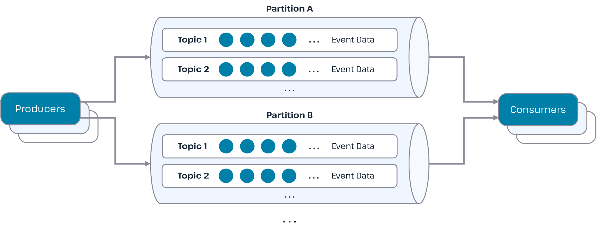
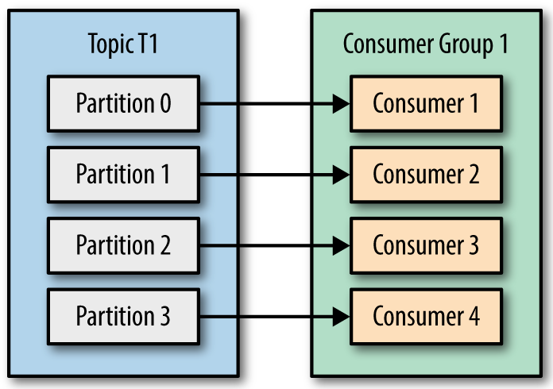
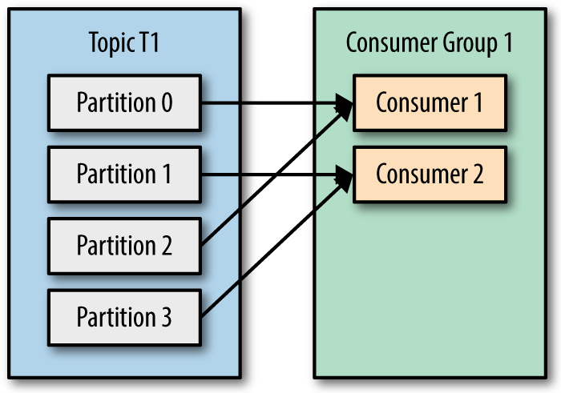
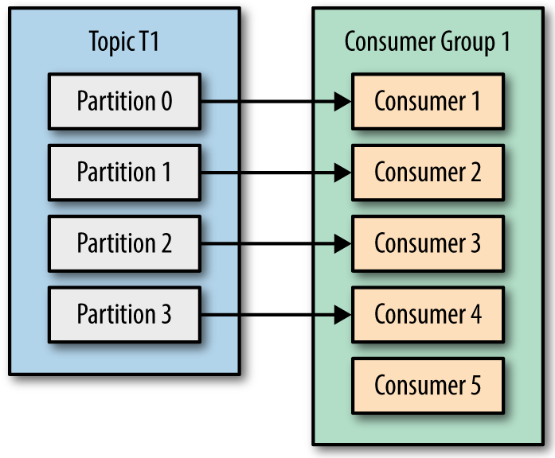
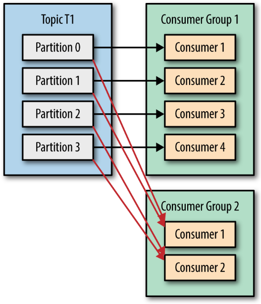

카프카를 어떻게 써야하나. 나는 내가 짠 코드를 신뢰하지 않는다. 

> 예술은 완성될 수 없다, 그저 버려질 뿐이다.. (Art is never finished, only abandoned.) - 레오나르도 다빈치

심지어 예술은 예쁘기라도 하지, 코드는 분석해야하는... 그저 부채다. 그런 코드로 쌓아올린 애플리케이션은 믿을 수 없다. 때문에 테스트를 작성해야한다.

8주차 루퍼스 과정은 지난 주차 애플리케이션 이벤트에 이어, 카프카에 대한 이야기다. 카프카는 분산 로그 저장소이지만, 이벤트 드리븐 아키텍처에서 메세지 브로커로 인기를 얻고있다. 가용성과 속도 측면에서 우수하기 때문이다.

하지만 그래서 고민이 시작된다. 내 애플리케이션을 테스트하는데, 다른 애플리케이션에서 발행하는 이벤트에 대한 테스트는 어떻게 작성 해야할까?

카프카가 아무리 고가용성이라지만, 네트워크는 믿을 수 없고, 내가 작성하는 코드도 동작하는지 확신할 수 없다. 자동화된 테스트 코드를 통해 안전을 보장받아야 마음이 놓인다. 방법을 찾아야 한다.

---

## 분해

어떤 부분을 테스트 할 것인가? 비즈니스 로직을 테스트하는 것인가, api를 테스트하는 것인가.
'카프카를 이용하는 부분'을 테스트한다는 것은 '인터페이스'에 대한 이야기라고 생각한다. 카프카는 브로커로부터 이벤트를 컨슘하여 애플리케이션 내부로 전달하는 **핸들링 인터페이스**이기 때문이다.

카프카를 테스트한다는 것은 애플리케이션의 유스케이스에서 조금 벗어나있다. 내가 테스트하고 싶은 것은, 카프카의 구성 설정에 대한 이야기다. 전체 플로우의 이벤트 발행자(Publisher)에 해당하는 카프카의 프로듀서(Producer) 부분에는 별로 관심이 없다. 알아서 잘 발행하겠지...

문제는 브로커와 플로우의 이벤트 구독자(Subscriber)에 해당하는 카프카의 컨슈머(Consumer)다.

---

## 카프카 구조

브로커는 토픽과 파티션으로 구성된다.

- 토픽: 논리적 경로
- 파티션: 물리적 경로



1. 파티션과 컨슈머는 1:1 일때, 병목이 없다. 



파티션은 하나의 물리적인 빨대와 같다. 

2. 소스(프로듀서)로 부터 파티션이란 빨대를 컨슈머가 물고있는데, 다른 파티션도 이 컨슈머가 담당한다면, 번갈아가며 빨대를 물어야 한다. 병목이 된다.



3. 컨슈머가 파티션의 갯수보다 많으면, 남는 컨슈머는 논다. 하지만, 리밸런싱에 대비하여 오버헤드를 줄일 수 있게 도와준다.



리밸런싱에 대비하여 오버헤드를 줄일 수 있게 도와준다는 게 무슨 의미일까? 

만약 컨슈머 중 하나가 죽으면, 그룹 코디네이터(Group Coordinator)가 리밸런싱을 트리거한다. 이때 카프카는 STW(Stop The World)가 일어나고, 전체 시스템의 단일 장애지점으로 발전한다. 때문에 컨슈머를 파티션보다 갯수가 많게한다. 컨슈머 몇개가 놀 순 있겠지만, 컨슈머가 죽으면, 놀던(Idle) 컨슈머가 일하기 시작하면서, 이런 오버헤드를 줄인다. Lag가 쌓이는 것을 최소화할 수 있다.

카프카는 컨슈머 그룹을 둔다. 각 컨슈머 그룹은 각각의 컨슈머가 파티션에 대해 딱 한번만 호출하고자다. 컨슈머가 메시지를 읽다가 실패해도, 메시지는 유실되지 않고 새로운 컨슈머 그룹이 토픽에 붙는다.



이런 리밸런싱에 대한 부분은 분명히 중요하다. 하지만 이것은 애플리케이션의 레벨이 아닌 것은 맞다. 마이크로 서비스의 영역이라고 본다. RDBMS로 치면, 인덱스를 설계하는 것과 같다. 애플리케이션의 읽기 속도를 향상하기 위해서는, 비즈니스를 이해하고 애플리케이션을 개발하는 개발자가 쿼리를 작성한다. 그러면서 그 쿼리의 향상을 위해 인덱스를 설계한다. 이를 카프카에 유비해본다면, 카프카의 설정을 잡는 것은 RDBMS의 인덱스를 설계하는 것과 비슷한 단계의 고민이다. 애플리케이션의 레벨은 아니지만, 서비스의 성능에 연관 있다.

하지만 성능이 과연 애플리케이션의 테스트 코드 작성에 유의미할까? 물론 아예 없진 않을 것이다. 하지만 그것은 좀 더 성능 측정 영역이지, 기능 확인 - 회귀 방지와 인수 목적의 테스트 영역이 아니다.

그렇다면 무엇을 테스트해야하나?

---

## 이벤트 전달 방법 설계

이벤트 전달 **구조**에 대한 설계가 아니라, **방법**에 대한 테스트가 필요하다. 카프카의 프로듀서와 컨슈머는 단지 메세지를 브로커에 적재하고, 소비하는 도구다. 적재와 소비 방식에는 여러가지가 있는다. 이런 적재와 소비 방식을 내 비즈니스에 맞게 적절한 설계를 해야한다. 그럼으로써 이벤트 전달 방법을 구현해야한다.

그렇다면 테스트의 대상은 두 가지가 된다.

- 프로듀서는 이벤트를 어떻게 브로커에 올릴 것인가
- 컨슈머는 이벤트를 어떻게 브로커로 부터 소비할 것인가

### 프로듀서 설계


### 컨슈머 설계


---

## 테스트 작성 도구

이제 테스트 도구들을 살펴보자. 카프카의 파티션과 컨슈머에 따른 동작을 확인해보고 싶다. 카프카가 필요하다. 스프링 애플리케이션에는 두 가지 방안이 있다.

- 임베디드 카프카 (`@EmbededKafka`)
- 카프카 테스트 컨테이너

둘 모두 카프카를 테스트 환경에 제공한다. 하지만 둘은 조금 다르다.

#### 임베디드 카프카 (`@EmbededKafka`)

임베디드 카프카는 JVM 안에서 Java 코드 레벨에서 시뮬레이션 한다. 속도가 빠르고, CI 파이프라인에도 부담이 적다. 하지만 실제 Kafka 환경과는 조금 다르다.

```java
@SpringBootTest
@EmbeddedKafka(partitions = 3,
        brokerProperties = {
            "listeners=PLAINTEXT://localhost:0",
            "auto.create.topics.enable=true"
        })
```

#### Kafka Testcontainers

실제 카프카를 도커 컨테이너로 띄운다. 초기화 비용은 크지만, 실제 운영 환경과 유사한 통합 테스트를 수행시킬 수 있다. 실제 카프카를 띄우는 것이기 때문에, 신뢰성이 매우 높다. 브로커 장애, 리밸런싱, 네트워크 지연을 설정하여 시뮬레이션이 가능하다.

---

카프카에는 커넥터라던가 스트림이라던가 KsqlDB라던가 CDC라던가 하는 다양한 구현들이 존재한다. 하지만 그 기반은 모두 프로듀서-브로커-컨슈머의 구조로 구현된다.

### 참조

- https://docs.spring.io/spring-kafka/reference/testing.html
