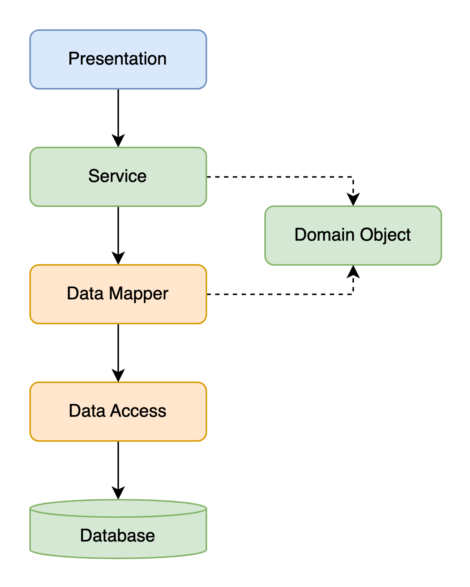

나는 헥사고날 아키텍처에 대해서 잘 알지 못한다. 그것이 좋은지도 의구심이 든다. 고수준의 의존성이나 외부 공개 언어(Public Language)로 제공하는 API 인터페이스 부분과 같은 **변경이 적은 경계나 외부 환경에 대한 경계**가 아닌, 동일 하위 도메인 단위 내의 애플리케이션 레이어 유스케이스 단위에서 경계를 굳이 인터페이스와 구현으로 분리할 필요가 있을까? 호출 시그니처가 바뀌거나, 유스케이스 로직이 바뀐다는 것은 곧 새로운 유스케이스가 된다는 의미가 아닐까?

다만 레이어드 아키텍처에 대해서는 중요하게 생각한다. [POEAA](https://iol-lshh.github.io/회고/EAA/EAA_정리/)에서 마틴 파울러는 비즈니스 로직을 구현하는 방식 세 가지를 소개한다. 그 중 두 가지가 바로 **트랜잭션 스크립트**, **도메인 모델** 패턴이다. 이 두 가지 방식을 구현하는 방법이 단순 레이어드 아키텍처이든 헥사고날이든, 적절한 레이어드의 구성은 필수인 것은 누구도 부정하기 힘들 것이다. 

과거 레이어드 아키텍처와 객체지향, MVC 같은 개념 사이에서 많은 혼동이 있었다. 오랜 시간이 지나서야 정리된 개념을 예제와 함께 총정리했다. 이 과정에서 배움의 과정에서의 잘못된 생각과 그것이 바로 잡힌 과정을 예제들과 같이 회고한다.

순서는 다음과 같다.

- 1. MVC (Model - View - Controller)
- 2. 멀티 티어 아키텍처 (Multitier Architecture)
- 3. 서비스
- 4. 객체 지향 설계

역사적 초기 모델인 MVC로 시작하여, 물리적에서 논리적으로, 그리고 더 추상화하고 복잡한 논리를 단순하게 처리할 수 있는 방향으로 글을 전개했다.

---

## 1. MVC

생뚱맞게 갑자기 MVC로 이야기를 시작해보려고 한다. 왜 MVC를 이야기하려는 것일까? MVC와 Layered Architecture의 차이가 무엇인지 부터 알아야한다고 생각한다. MVC는 Model - View - Controller 세 단어의 앞글자를 딴 약자이다.

지금은 사장되었지만, 아주 오래전 스몰토크라는 객체지향의 시초라 볼 수 있는 프로그래밍 언어가 있었다. 1970년대 후반 Trygve Reenskaug는 이 스몰토크로 프레임워크를 만들면서 MVC를 제시한다. 아시다시피 WWW(World Wide Web)은 1990년대에 들어서야 대중화되었다. 즉 MVC는 본래 웹 애플리케이션이 목적이 아니라, **로컬 소프트웨어 개발을 목표로 만들어진 UI 아키텍처**이다.


그런고로, MVC는 각각 다음과 같은 역할을 담당했다.

- **Model**: 비시각적인 애플리케이션이나 도메인의 상태를 갖는 역할
- **View**: 스크린에 모델을 보여주는 역할
- **Controller**: 인터페이스를 통해 사용자의 입력에 반응하여 모델을 조작하고 뷰를 업데이트하는 역할

사용자 이름을 입력받아 출력하는 MVC 구조의 단순 CLI 애플리케이션을 작성해보자.

```shell
/mvc
 ├── Main.java          // 애플리케이션 시작점
 ├── model/
 │    └── User.java     // Model
 ├── view/
 │    └── UserView.java // View
 └── controller/
      └── UserController.java // Controller
```

##### `Main.java` - Application

```java
import model.User;
import view.UserView;
import controller.UserController;

import java.util.Scanner;

public class Main {
    public static void main(String[] args) {
        User model = new User();
        UserView view = new UserView();
        UserController controller = new UserController(model, view);

        Scanner scanner = new Scanner(System.in);
        System.out.print("Enter your name: ");
        String input = scanner.nextLine();

        controller.setUserName(input);
        controller.updateView();
    }
}
```

##### `User.java` - Model

```java
package model;

public class User {
    private String name;

    public String getName() {
        return name;
    }

    public void setName(String name) {
        this.name = name;
    }    
}
```

##### `UserView.java` – View

```java
package view;

public class UserView {
    public void printUserDetails(String name) {
        System.out.println("User name is: " + name);
    }
}
```

##### `UserController.java` – Controller

```java
package controller;

import model.User;
import view.UserView;

public class UserController {
    private final User user;
    private final UserView view;

    public UserController(User user, UserView view) {
        this.user = user;
        this.view = view;
    }

    public void setUserName(String name) {
        user.setName(name);
    }

    public void updateView() {
        view.printUserDetails(user.getName());
    }
}
```

이 방식이 차후 웹 애플리케이션에 적용되어, 서버에서 사이트의 View를 제공해주는 초기 형태의 SSR(Server Side Rendering)이 된다.

---

## 2. 멀티 티어 아키텍처 (Multi Tier Architecture)

점차 애플리케이션이 점차 복잡해짐에 따라, 물리적인 단위에 따라 Presentation, Logic, Data를 [여러 Tier](https://en.wikipedia.org/wiki/Multitier_architecture#Three-tier_architecture)로 구분하게 된다.

- **Presentation Tier** - 사용자의 접근 제어
- **Logic Tier** - 애플리케이션 기능 제어
- **Data Tier** - 영속성 제어


개발 환경의 변화에 따라서, 과거 로컬 애플리케이션의 MVC는 웹 환경이 되면서 영속성과 서버, 클라이언트가 분리된 3-Tier로 세분화되었다. 그리고 더 나아가 Front End, Back End, Data 처리 등으로 티어는 더 세분화된다.

여기서 주의할 점은 Tier와 Layer의 차이다. 해당 단어에 대해 단체들이 어떻게 정의하느냐에 따라 다를 수 있다. 한국어로 번역하면 둘다 계층이다. 마틴 파울러는 [해당 글](https://martinfowler.com/bliki/PresentationDomainDataLayering.html)에서 "These layers are logical layers not physical tiers."라고 이야기하고 있다. 즉 Layer라는 것은 한가지 관심사에 대해 책임을 지는 논리적 계층을 의미하며, 이는 물리적 계층을 의미하는 Tier와는 다르다.

### 2.1. 레이어드 아키텍처 (Layered Architecture)

일반적으로 엔터프라이즈의 실제 운영 환경, 또는 부트 캠프에서 처음 배우는 레이어드 아키텍처는 다음과 같을 것이다.

- **Presentation Layer** - UI 제어
- **Domain Layer** - 도메인 로직(비즈니스 로직) 제어
- **Infrastructure Layer** - 데이터베이스나 외부 서비스와 연동하여 영속성 또는 상태 제어


레이어는 이 세 가지보다 더 많을 수도 있고, 다른 이름으로 불리거나, 상황에 맞게 다른 방식으로 구성되기도 한다. 레이어드 아키텍처의 핵심은 **각 레이어가 그 이름에 걸맞은 관심사만을 적절하게 담당하고 있는가**이다. 애플리케이션이란 결국 **상태를 제어하는 소프트웨어 제품**이다. 그리고 이 상태 제어는 **UI와 표현**(Presentation), **비즈니스 처리**(Domain), **영속성 혹은 외부 연동**(Infrastructure)의 세 가지 관심사에서 발생하기 때문에, 이 기준에 따라 레이어를 분리하게 된다.

스프링을 쓰면, `@Controller`(`@RestController`), `@Service`로 프레젠테이션과 도메인 레이어를 구성하게 된다. Controller는 앞서 MVC에서 인터페이스를 통해 사용자의 입력에 반응하는 것임을 알았다. 그렇다면 Service는 무엇일까?

---

## 3. 서비스

서비스란 기능을 수행하는 단위이다.

> 기술적인 측면에서 서비스(service)란 단어는 **비즈니스 태스크(task)를 수행**하거나, **파일에 접근**하거나, 승인 및 로깅 같은 일반적인 기능을 수행하는 **소프트웨어 기능**에 사용돼왔다. 서비스는 이를 위해 자동화된 워크플로우 엔진이나 도메인 모델[POEAA]에 속한 객체, 상용 소프트웨어 패키지, 레거시 애플리케이션의 API, 메시지 지향 미들웨어(MOM, Message-Oriented Middleware), 데이터베이스 등을 사용할 수 있다.   
> - Service Design Patterns (Robert Daigneau, 2011)

서비스란 단순히 뚱뚱한 모습(Fat Service)으로 하나의 메서드 안에서, 로직을 처리하고, 데이터를 적재할 수 있다. 이런 구현 방식을 트랜잭션 스크립트 패턴의 서비스라고 한다. 

좀 더 복잡해질 수 있는 비즈니스 요구사항을 처리하기 위해서, Layered Architecture의 이념에 맞게 각 관심사에 따라 Service를 다르게 분리하여 사용하기도 한다. 때문에 관점에 따라서 어떤 레이어에서든 Service는 존재할 수 있다. 일반적으로 애플리케이션, 도메인, 인프라스트럭처 또는 기술 레이어에서 서비스를 사용한다고 한다.

Service Design Pattern(Robert Daigneau, 2011)에서는 서비스 구현 패턴에 대해 소개하고 있다.
서비스를 구현하는데 중요한 세가지 고려사항을 먼저 이야기한다.

1. **원자성**(Atomicity): 서비스는 모든 태스크를 성공적으로 완료하거나, 그렇지 못하다면 전부 무효로 해야한다. 서비스 자신이나 하위 수준 계층에서 트랜잭션을 관리해야 한다.
2. **상태 관리**: **stateful** vs **stateless** 구현에 대해 고려한다. stateful은 **세션** 변수를 활용함으로써 **데이터베이스 부하**를 줄일 수 있으나, 서버의 부하가 증가하면 stateful 서비스를 지원하기 위한 **메모리 사용량**이 커질 수 있으며, 큰 메모리 사용을 위해 데이터를 디스크로 스왑(swap)할 수 있으나 서버 성능을 저하시키고 최악의 경우 서버 장애로 발전할 수 있다.
3. **서비스 컴포지션**: 서비스는 외부와 낮은 의존성을 가질 때 더 일관적이고 신뢰성 있는 결과를 가진다. 외부 서비스를 호출해야 할 필요가 있을 수 있으나, 이로 인한 여러 문제점을 고려해야한다. 네트워크 지연 시간, 외부 서비스 서버의 오류에 대한 대처 등 수많은 문제가 있다.

이런 고려사항들을 바탕으로 다음과 같은 구현 패턴을 제안한다.

- **트랜잭션 스크립트**(Transaction Script): 빠른 구현 목적. 데이터베이스 접근이나 파일 조작을 비롯한 기타 사용자 지정 로직을 웹 서비스 메소드 내부에 직접 작성한다.
- **데이터소스 어댑터**(Datasource Adapter): 데이터소스 제공 목적. 데이터소스 메타데이터와 컨트롤러를 통해 요청 처리 규칙을 캡슐화하고 해석하며, 데이터소스 제공자와 메시지 포매터 동작을 관리하기도 한다.
- **오퍼레이션 스크립트**(Operation Script): 중복 코드 없이 공통 도메인 로직 재사용 목적. 도메인 모델을 캡슐화 하는데 주로 사용한다.
- **커맨드 호출자**(Command Invoker): GOF의 커멘드 패턴을 이용하여 공통 로직 처리.
- **워크플로우 커넥터**(Workflow Connector): 복잡하거나 처리에 시간이 걸리는 비즈니스 프로세스 목적.

이 중, 온전히 애플리케이션 레이어 서비스에 해당하는 트랜잭션 스크립트, 오퍼레이션 스크립트에 대해 정리했다. 다른 서비스 패턴에 대해서는 다른 주제와 함께 다음 기회에 서술하겠다.

### 3.1. 트랜잭션 스크립트 (Transaction Script)

트랜잭션 스크립트를 설명하기 앞서 절차 지향 프로그래밍(Procedural Programming) 또는 구조적 프로그래밍(Structured Programming)이라 하는 것에 대해 먼저 생각해보자.

엉클 밥은 [클린 아키텍처](https://iol-lshh.github.io/회고/clean_architecture/clean_architecture_정리/)를 설명하기 위해 프로그래밍 패러다임 세 가지에 대해 설명한다. 그 중 첫 번째로 나오는 것이 구조적 프로그래밍이다. **순차**sequence, **분기**selection, **반복**iteration만을 이용한 루틴을 이용한 프로그래밍 방법을 의미한다. 제어흐름의 **직접적인 전환**에 대한 규칙을 의미한다.

트랜잭션 스크립트는 구조적 프로그래밍 요소를 이용하여 로직을 빠르게 구현한다.


서비스는 유효성 검사 로직과 계산, 조건문을 비롯해 기능을 구현하는 로직들을 모두 포함한다. 때문에 메소드가 길어지며, 코드 중복의 가능성이 높아진다. 트랜잭션 스크립트는 대개 점차 복잡해지며 유지 보수가 어려워진다.

또한 내부 리소스(파일 시스템, 파일 타입, 데이터베이스, 애플리케이션 API 등)에 결합도가 높다. 내부 리소스의 변경시, 서비스 코드 또한 변경을 필요하게 된다.

```java
@Service
public class TransferService {

    private final AccountRepository accountRepository;

	public TransferService(AccountRepository accountRepository) {
		this.accountRepository = accountRepository;
	}

    @Transactional
    public void transfer(Long fromAccountId, Long toAccountId, Long amount) {
        // 1. 조회
        Account from = accountRepository.findById(fromAccountId)
                .orElseThrow(() -> new IllegalArgumentException("출금 계좌 없음"));
        Account to = accountRepository.findById(toAccountId)
                .orElseThrow(() -> new IllegalArgumentException("입금 계좌 없음"));

        // 2. 비즈니스 로직 (계좌 이체)
        if (from.getBalance() < amount) {
            throw new IllegalStateException("잔액 부족");
        }
        from.decrease(amount);
        to.increase(amount);

        // 3. 저장
        accountRepository.save(from);
        accountRepository.save(to);

        // 4. 로깅, 알림 등
        log.info("Transferred {} from {} to {}", amount, fromAccountId, toAccountId);
    }
}
```

예제의 트랜잭션 스크립트 서비스는 트랜잭션의 관리, 데이터의 조회와 저장, 비즈니스 로직, 데이터의 상태 수정까지 모든 애플리케이션이 동작해야할 요구사항들을 처리하고 있다. 이런 서비스를 Fat Service라고 부르기도 한다. 애플리케이션의 모든 동작이 한눈에 들어온다.

### 3.2. 오퍼레이션 스크립트 패턴 (Operation Script)

트랜잭션 스크립트로 작성된 서비스는 구현이 간단하다. 하지만 비즈니스 로직에 **여러 조건과 분기가 늘어나면** 코드도 더 복잡해지고, 길어지며, 시간이 지날수록 유지 보수가 힘들어지고 일부 코드 조각은 다른 서비스에 그대로 복사되어 사용된다. **중복된 코드**는 동기화가 어렵고 불일치가 발생할 가능성이 커진다.

이런 문제를 해결하기 위해, 일부 코드 조각을 **작은 메소드로 추출**한다. 분리된 코드 조각은 일반적으로 **관심사를 분리하여 별도의 계층으로** 집어넣고, 서비스를 최대한 얇게 만드는 방법이 올바를 것이다.


오퍼레이션 스크립트 서비스는 조건과 반복, 명령문 등의 절차지향적 로직을 여전히 포함하고 있다. 하지만 대부분의 로직은 하위 계층으로 관심사가 분리되게 된다. 대표적인 사례가 도메인 모델을 사용하는 경우다.

#### 3.2.1. 도메인 모델

도메인의 **유비쿼터스 언어**를 이용하여 모델을 구축한다. **모델의 속성과 메서드가 도메인의 실제 비즈니스 로직과 동일한 언어**로 작성한다. 이것이 도메인 모델이다.

서비스는 도메인 모델과 데이터 매퍼를 다룬다. 이 때, 오퍼레이션 스크립트로써의 서비스는 도메인 모델에 비즈니스 로직을 위임한다. 서비스는 단지 애플리케이션이 가져야할 로직을 유스케이스로써 보여주게된다.



이전 예제는 비즈니스 로직의 조건문을 서비스에서 처리하고, 객체의 상태를 직접 변경하고 관리했다.(`if`, `decrease`, `increase`)

다음 예제는 비즈니스 로직을 도메인 객체 - 엔티티(Account)에 위임하고 있다. 서비스가 한 일은, 대상을 Repository로 찾아와 **일을 시키고**(`transferTo`) 저장한 것이다.

##### `TransferService` - Operation Script Service

```java
@Service
public class TransferService {

    private final AccountRepository accountRepository;

	public TransferService(AccountRepository accountRepository) {
		this.accountRepository = accountRepository;
	}
	
    @Transactional
    public void transfer(Long fromId, Long toId, Long amount) {
        Account from = accountRepository.findById(fromId)
                .orElseThrow(() -> new IllegalArgumentException("출금 계좌 없음"));
        Account to = accountRepository.findById(toId)
                .orElseThrow(() -> new IllegalArgumentException("입금 계좌 없음"));

        // 도메인 메서드 사용
        from.transferTo(to, amount);

        // 리포지토리에 저장 (도메인 이벤트 - 변경 감지 기반일 경우 생략 가능)
        accountRepository.save(from);
        accountRepository.save(to);
    }
}
```

##### `Account` - Entity

```java
@Entity
public class Account {

    @Id
    private Long id;
    private Long balance;

    public void transferTo(Account target, Long amount) {
        if (this.balance < amount) {
            throw new IllegalStateException("잔액 부족");
        }
        this.balance -= amount;
        target.balance += amount;
    }
}
```

도메인 모델에 대한 이야기는 할 것이 너무 많다. 도메인 모델에 대한 더 자세한 설명은 [EAA 정리](https://iol-lshh.github.io/회고/EAA/EAA_정리/)와 [DDD 정리](https://iol-lshh.github.io/회고/ddd/DDD_정리/)에서 확인할 수 있다.

#### 3.2.2. 서브 트랜잭션 스크립트

다음 코드는 서비스가 하위 서비스를 부르고 있다.

코드의 중복을 없애기 위한 방법으로 서비스가 서비스를 부르게 작성하는 상황에서 생기는 순환성을 방지하기 위한 목적에서 `@Service`어노테이션을 재정의하고 `level`이란 속성을 추가했다. `level`의 값이 높을수록 상위 계층이며, 좀 더 파사드 서비스다. `level` 값이 낮은 서비스는 높은 값의 서비스를 참조하지 못한다.

```java
@Service(level = 2)
public class OrderOrchestratorService2 {

	private final ItemService1 itemService;
    private final OrderService orderService;
    private final UserService userService;

	...
}
```

```java
@Service(level = 1)
public class ItemService1 {

    final ItemRepository itemRepository;
    final PointService pointService;
    final ProductService productService;

	...
}
```

```java
@Service
public class ItemService {

    final ItemRepository itemRepository;

	...
}
```

```java
@Service
public class OrderService {

    private final OrderRepository orderRepository;

	...
}
```

위 코드는 내가 경력 초창기에 짰던 코드이다. 얼핏 보기에 깔끔해보이고, 순환성 방지도 좋을 것 같다. 지금 다시 봤을 때, 이 코드는 안티패턴이라고 생각한다. 무엇이 문제일까?

문제에 앞서, 레이어드 아키텍처가 무엇인지 다시 떠올려볼 필요가 있다. **각 레이어가 그 이름에 걸맞은 관심사만을 적절하게 담당하고 있는가**? 단순히 서비스가 서비스를 호출하는 구조는 레이어의 관심사를 명확하게 분리한 것이 아니다. 애초에 왜 파사드 서비스를 작성하는가. 트랜잭션 스크립트 방식의 한계가 온 것이 아닌지, 파사드 서비스가 **레이어로써의 책임을 명백하게 정의**하지 못한다면, 그 구조가 기술부채이고 응급처치가 아니었는지 되돌아볼 필요가 있다.

때문에 위 방식은 안티 패턴이다. 비즈니스 복잡도가 더 올라가면, 서비스 레벨을 정하는 규칙은유지보수의 난이도만 더 올릴 뿐이다.

적절한 시점에 도메인 모델 설계와 커맨드 호출자, 워크플로우 커넥터 등의 서비스 구현 방법으로 리팩터링하여 기술 부채를 해소해야한다.

---

레이어드 아키텍처는 단순히 계층을 나누는 기술적 구조가 아니라, **복잡한 애플리케이션의 관심사를 구분하고 유지보수성을 높이기 위한 사고 방식**이다. 그저 Controller, Service, Repository를 나누는 데에서 멈춘다면, 그것은 패턴이 아니라 형식에 불과하다. 중요한 건 **각 계층이 어떤 책임을 가지며, 그것을 어떻게 지켜내는가**이다.

트랜잭션 스크립트로 시작된 서비스 로직이 점차 오퍼레이션 스크립트로 발전하고, 결국 도메인 모델과 그 철학으로 녹아드는 과정은 필수다.

"레이어드"가 중요한 게 아니라, **왜 레이어링했는지가 중요하다**.
