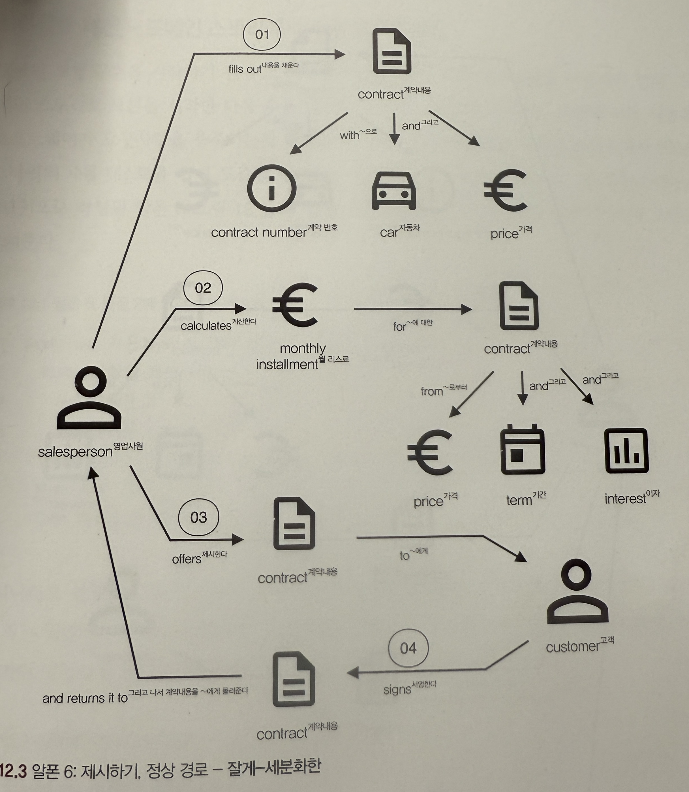

객체 지향 프로그래밍(Object Oriented Programming, OOP)은 IT 업계 종사자라면 누구나 알 것이다. 객체지향의 특징 네 가지? 캡슐화, 추상화, 상속, 다형성 아마 달달 외울 것이다.

그래서 그런 널리 퍼진 이야기 말고, 객체 설계의 역사를 따라 올라가 객체 특징의 기원을 살펴보겠다. 그리곤 그 원형을 가지고 엔터프라이즈 애플리케이션으로 가져와 도메인 모델을 설계해보겠다.

---

## 객체(Object)의 기원

**1966년**, 노르웨이 컴퓨팅 센터(Norsk Regnesentral(NR))에서 두 프로그래머는 어떤 현상에 의문을 갖게 된다. 알골(ALGOL) 언어의 **함수 호출 스택 프레임(stack frame)을 힙(heap)으로 옮겼을 때**, 함수 호출이 반환된 이후에도 함수에서 선언된 지역 변수가 오랫동안 유지될 수 있다는 사실을 알게된다. 이런 함수의 형태는 훗날 **클래스와 생성자**라고 불리게 된다. 그렇게 객체 지향(OO) 프로그래밍의 초기 아이디어가 세상에 알려진다. (Ole Johan Dahl & Kristen Nygaard, 1966) 

(**다익스트라**(Edsger Wybe Dijkstra)가 점프(goto)를 쓰지 말자고 주장하기보다도 2년 전이다. ([Go To Statement Considered Harmful](https://dl.acm.org/doi/pdf/10.1145/362929.362947), Edsger Wybe Dijkstra, 1968))

그들은 객체지향을 이용해서 시뮬레이션 전용 언어인 Simula를 만들었다.([Simula](https://en.wikipedia.org/wiki/Simula), 1968)  아래는 Simula로 작성된 간단한 객체의 모습이다.

```simula
Begin
   Class Glyph;
      Virtual: Procedure print Is Procedure print;;
   Begin
   End;
   
   Glyph Class Char (c);
      Character c;
   Begin
      Procedure print;
        OutChar(c);
   End;
   
   Glyph Class Line (elements);
      Ref (Glyph) Array elements;
   Begin
      Procedure print;
      Begin
         Integer i;
         For i:= 1 Step 1 Until UpperBound (elements, 1) Do
            elements (i).print;
         OutImage;
      End;
   End;
   
   Ref (Glyph) rg;
   Ref (Glyph) Array rgs (1 : 4);
   
   _! Main program;_
   rgs (1):- New Char ('A');
   rgs (2):- New Char ('b');
   rgs (3):- New Char ('b');
   rgs (4):- New Char ('a');
   rg:- New Line (rgs);
   rg.print;
End;
```

Simula는 [객체](https://en.wikipedia.org/wiki/Object_(computer_science) "객체(컴퓨터 과학)"),  [클래스](https://en.wikipedia.org/wiki/Class_(computer_programming) "수업(컴퓨터 프로그래밍)"), [상속](https://en.wikipedia.org/wiki/Inheritance_(object-oriented_programming) "상속(객체 지향 프로그래밍)"), [코루틴](https://en.wikipedia.org/wiki/Coroutine "코루틴") 등등의 특징을 갖고 있었다. 하지만 Simula는 범용 컴퓨터 언어가 아닌 시뮬레이션 전용의 언어였으며, 현대의 객체 지향에 대한 이론이라고 보기엔 거리가 멀었다. 그렇게 10년이 흘러 Smaltalk가 등장한다.

### 객체 지향 (Object Oriented)

1970년대, 본래 **분자생물학** 학사(수학 복수)에서 컴퓨터과학 박사로 전공을 옮겨간 앨런 케이(Alan Kay)는 Simula에 영향을 받은 범용 프로그래머 언어이며, 객체지향적 언어인 스몰토크(Smalltalk)를 세상에 내놓는다. 앨런 케이는 스몰토크를 세상에 내놓으면서 세상에 지금과 같은 객체지향 이론을 이야기했다.

그런 앨런 케이에게 객체 지향에 대해서 물어본다면 무엇이라 할까? 다음은 그 질문에 대한 답변이다.

> 저에게 OOP는 오직 **메시징**, **상태-프로세스**의 **지역적 보존 및 보호와 숨김**, 그리고 모든 것의 극단적인 **지연 바인딩**(late-binding)만을 의미합니다. - [Dr. Alan Kay  on the Meaning of “Object-Oriented Programming”](http://userpage.fu-berlin.de/~ram/pub/pub_jf47ht81Ht/doc_kay_oop_en) (Alan Kay, 2003)

앨런 케이는 OOP를 

- **메시징** - 객체 사이의 **관계** 
- 객체의 **상태**와 **프로세스** - 상태(state)와 행위(behavior)
- 지역적 보존, 보호, 숨김 - **캡슐화**(encapsulation)
- 극단적 지연 바인딩 - 클래스와 인스턴스

이 네 가지에 집중한다. 그는 이것이 객체 "**지향**" 이라고 이야기한다.

객체 지향의 다른 핵심 개념인 상속(inheritance)이나 다형성(polymorphism) 개념은 Simula에도 있었지만, 그것이 현대적인 의미로 체계화 된 것은 좀 더 이후의 일이었다. ([On Understanding Types, Data Abstraction, and Polymorphism](http://lucacardelli.name/Papers/OnUnderstanding.A4.pdf)(Luca Cardelli & Wegner, Peter, 1985))

이런 역사적 관점에서 봤을 때에도, 상속이나 다형성도 물론 중요하지만, 더 우선적인 것은 "객체의 **책임**(**역할**)과 **관계**"이다. 그리고 이런 관점은 도메인 모델 설계로 이어진다.

---

## 도메인 주도 설계

도메인 모델은 "**유비쿼터스 언어**로 표현된 도메인의 핵심 **개념**과 **관계**를 구조화한 설계도"이다. 무언가 기시감이 느껴진다. "객체의 **책임**(**역할**)과 **관계**"와 유비(analogous)되지 않는가? 이것은 단순한 우연이 아니다. 도메인 모델과 객체 지향 프로그래밍의 설계 철학은 본질적으로 같은 곳을 바라보고 있다.

다만 도메인 모델이란 것은 복잡한 엔터프라이즈 시스템이란 이름의 생태계에서 살아간다. 이런 비즈니스 복잡성을 다루기 위해서는 체계적인 접근을 필요로 한다. 여기서 도메인 주도 설계(Domain Driven Design, DDD)와 그 전략적, 전술적 설계 패턴들이 등장한다.

이 글은 거대한 조직의 관계와 흐름보다는, **사용자 관점**에 초점을 맞춰 **스토리를 이야기**하고 **도메인 모델링 - 객체 설계**에 대해 정리하고자 한다.

### 전략 - 도메인 스토리텔링

> UML은 무엇보다도 개발자 간의 소통을 위한 매개체다. 반면 도메인 스토리텔링은 개발자와 도메인 전문가 간의 소통을 위한 매개체다. - Domain Storytelling(Stefan Hofer etc, 2023)

전략 설계의 방법론 중 하나인 도메인 스토리텔링은 도메인 전문가와의 소통을 가장 우선시 하는것으로 시작한다. 간혹 소통이 반드시 필요할까, 그저 내가 보고 설계하면 되지 않을까라고 생각할 수 있다. 하인즈 줄리호벤(Heinz Zullighhoven)은 도메인 전문가와 대화하지 않고 보기만 해서 생길 수 있는 문제점을 비유를 통해 말한다.

> **요리사 관찰하기**   
> 토마토 소스를 휘젓는 요리사를 지켜보고 있다고 상상해 보자. 요리사가 정확히 5분 동안 소스를 젓는 것을 시계를 사용해 측정한다. 이 결과를 보고 여러분은 토마토 소스는 항상 5분 동안 저어야 한다는 결론을 내린다. 그러고 나서 집으로 돌아와서 이 과정을 따라하며 5분 동안 소스를 저어도 소스는 여전히 토마토 스프처럼 묽다. 시간이 중요한 요인이 아니었던 것이다. 여러분은 적절한 농도가 될 때까지 소스를 저었다는 점을 놓친 것이다.

먼저, **도메인 언어**를 배워야한다. 스테판 호퍼는 도메인 언어를 배우기 위해서는 소프트웨어 시스템이나 기술적 전문 용어가 없는 순수한 스토리에 집중하라고 말하고 있다. 기술적인 용어들은 **비즈니스를 *오염*시키고**, 세분성과 범위를 망가뜨리기 때문이다.

언어를 배우기 위해서 **있는-그대로**(As-is)인 도메인 스토리로 출발하여, **있게-될**(To-be) 도메인 스토리로 이동해야 한다. 또한 이 과정에서 **거칠게-세분화**(Coarse-grained)한 도메인 스토리에서 시작하여, **잘게-세분화**(Fine-grained)된 스토리로 나아가라고 하고 있다. 이런 과정에서 도출된 유비쿼터스 언어들을 용어집(glossary)에 작성한다.

#### 도메인 스토리텔링 프로세스

정리하면 다음과 같은 순서로 이루어져야 한다.

1. 거친, 본래 프로세스, 아날로그 구성 (coarse-grained, as-is, analog)
3. 세밀한, 본래 프로세스, 아날로그 구성 (fine-grained, as-is, analog)
4. 세밀한, 목표 프로세스, 아날로그 구성 (fine-grained, to-be, analog)
5. 세밀한, 목표 프로세스, 시스템화된 구성 (fine-grained, to-be, digitalized)

Domain Storytelling에서 보여주는 '자동차 리스'라는 비즈니스에 대한 예제와 함께 보자. (본래 책에서는 1번 과정 이후 바로 디지털화 했을 때, 어떤 오염된 모델이 나오는지 예시를 보여주나, 여기서는 생략했다.)

##### 1. coarse-grained, as-is, analog

전체 비즈니스 과정에 대해 도메인이 이야기하는 바를 그린다. 이때 거칠게 그린다.


##### 2. fine-grained, as-is, analog

위에서 06, 07, 08에 대한 내용을 세분화했다. 조금 더 과정이 세밀하게 보이게 된다.


##### 3. fine-grained, to-be, analog

불필요한 부분을 잘라내어 **업무 효율화**와 **필요하지만 없었던 프로세스**를 추가하고 정리한다.


##### 4. fine-grained, to-be, digitalized

그려낸 to-be 내용에 비로소 디지털화 된 프로세스를 반영한다.


세분화된 도메인 스토리가 나왔다. 이제 개발에 착수해도 될까? 아직 멀다. 조직은 단 한 개로 통합된 범용 도메인 언어를 사용하지 않는다. 같은 단어를 써도 지칭하는 것이 다를 수 있다는 것은 당연하며, 심지어 **같은 것을 바라보고 있어도** 조직에 따라 **의미**와 **기능**이 다르다.

때문에 도메인은 서브 도메인으로 경계가 나누어져야 한다.

#### 서브 도메인

도메인 스토리와 **휴리스틱**(Heuristic, 어림짐작하기)에 맡긴다. 제대로 작성된 도메인 스토리는 **도메인 전문가 관점**에서 활동이 어디에 속하는지 시각적으로 보여준다. 특히 **행위자 관점**에서 보았을 때 서브 도메인이 여러 활동으로 구성되는 것을 볼 수 있다.

경계에는 이런 **지표**(indicator)가 드러난다.

- **Actor 스스로 결과 생성**: Actor는 여러 관련 활동을 독립적으로 완료해 의미 있는 결과를 생성한다. 서브 도메인은 단일 Actor의 행동으로 되어있다.
- **단방향 정보 흐름**: Actor에서 다른 이해관계자로 책임 이양 과정(**데이터의 흐름)이 단방향**이다.
- **다른 촉발점**: 도메인 스토리와 **무관한 지원 활동**: 아래 그림의 10번이 이에 해당한다. 도메인 전문가는 10번 활동이 반드시 필요한 활동이라고 말한다. 하지만 어느 다른 Actor도 관여하지 않는다. 이것은 전혀 다른 하위 도메인일 가능성이 높다.
- **언어의 차이**: 동일한 작업 객체를 Actor간에 다르게 부른다. 또는 같은 이름이 다른 의미로 사용된다.
- **같은 것을 다른 용도로 사용**: 동일한 작업 객체가 완전히 다른 업무에 사용된다. 아래 그림에서 '계약'에 대해 *고객은 '서명'이란 행위*에 사용하고, *위험관리자는 '심사'란 행위*에 사용한다.


#### '서브 도메인'에서 '바운디드 컨텍스트'로

서브 도메인은 **문제 공간**(problem space)에 해당한다. 문제 공간을 분석하고, 분류하고, To-be를 도출했다. 다음은 **해결 공간**(solution space)로 향할 차례다. DDD에서는 이를 **바운디드 컨텍스트**(*Bounded Context*)라고 부른다. 바운디드  컨텍스트는 유비쿼터스 언어를 사용해 명확한 도메인 모델을 구현한다.

DDD 전문가 닉 튠(Nick Tune)은 경계를 설계하기 위한 기준 다섯가지를 말한다. ([Bounded Context Canvas V3: Simplifications and Additions](https://medium.com/nick-tune-tech-strategy-blog/modelling-bounded-contexts-with-the-bounded-context-design-canvas-a-workshop-recipe-1f123e592ab))

- **업무 가치**: 비즈니스 전략에 맞는 설계 결정
- **도메인**: 문제 영역과 경계를 맞추는 설계 결정
- **사회정치적 이슈**: 시스팀을 구축하는 사람들의 요구에 따른 설계 결정
- **기술적 이슈**: 시스템의 기술 요구사항에 영향을 받는 설계 결정 (성능, 보안)
- **사용자 경험**: 사용자가 시스템을 경험하는 방식에 영향을 미치는 설계 결정

이 과정에서 작업에 대한 팀 경계가 정해진다. 이 부분은 조직 측면에서 비즈니스적, 관계적, 여러가지를 봐야하기 때문에 앞서 말한 것과 같이 이야기하지 않겠다.

#### 요구사항 도출

도메인 스토리가 도출되었다. 바로 개발에 들어갈 수도 있지만, 아직 많이 추상화되어있다. 이때 도메인 모델을 **기능 요구사항 명세** - 유저 스토리나 유스케이스로 작성한다. 해당 과정은 [이전 글](https://iol-lshh.github.io/%ED%9A%8C%EA%B3%A0/design/design-usecase/) 에서 작성했다.

### 전술 - 도메인 모델링

오랜 과정 끝에 드디어 개발에 착수한다. 다만 그것이 코드를 작성하는 것을 의미하진 않는다. 도메인에 대한 전술적 설계를 해야한다.

전술적 설계를 통해 드러나는 것을 '**도메인 모델**'이라고 한다. 도메인 모델은 지식의 압축 형태다. 도메인의 구조적 측면, 개념, 행위와 상호 작용을 통해 도메인 지식을 그린다. 그 결과도메인 모델은 '**불변식**'(invariant)를 갖는다. 불변식은 로직에서의 객체의 무결성과 로직의 일관성을 보장하는 **핵심 규칙**을 의미한다.

> **불변식**(Invariant): 시스템이 항상 유지해야 하는 핵심 규칙

 불변식 설계를 위해서는 도메인 스토리에 그려진 **동사**(verb)들을 살펴봐야한다.

- Actor는 목표를 달성하기위해 **무엇**(what)을 하고 있는가?
- Actor는 작업 객체를 **어떻게 처리**하는가? (절차, 전략, 행위 중심) => *고객 정보*를 검증 프로세스를 통해 **검토**하고 **승인**한다.
- Actor는 **어떤 방법**으로 작업 객체를 **다루는가**? (도구, 수단, 방식 중심) => *고객 정보*를 **검증 프로세스를 통해** 검토하고 승인한다.
- Actor는 어떻게 정보를 교환하고 **협력**하는가?

이제 직접 도메인 모델을 만들어보자. 다음은 위에서 그려낸 도메인 스토리의 1, 2, 3, 4, 5 로 이루어진 서브 도메인을 도메인 모델링하는 과정이다.

1. 잘게 세분화된 도메인 스토리에 대한 시나리오를 분석한다.
2. 인수 테스트를 작성한다.
3. 도메인 모델을 만든다.

#### 1. 잘게 세분화된 도메인 스토리에 대한 시나리오를 분석한다.



#### 2. 인수 테스트를 작성한다.

인수 테스트는 **블랙박스 테스트**로써 유스케이스에 대한 구체적인 내용은 몰라도 된다. 기능의 동작을 확인하는데 초점을 두어 input과 output을 명확히 한다.

```text
Scenario: 자동차 리스 계약 계산 (2)
	Given 작성된 계약 내용
		And 가격은 X
		And 기간은 Y
		And 이자는 Z
	When 계약 계산
	Then 리스료는 W유로

Senario: 리스 계약 체결 (3,4)
	Given 제시된 계약 내용
	When 고객이 계약내용에 서명
	Then 서명 날짜는 오늘
```

각 값에 대해 구체적인 값 예시를 생각한다. 값을 경계 값으로 둬도 좋다.

#### 3. 도메인 모델을 만든다

도메인 모델을 만들때 두 가지를 생각한다.

- **작업 객체**: 도메인 모델에서 애그리거트(aggregate), 엔터티(Entity), 값 객체(Value Object)가 되는 후보
- **활동**: 연산(메서드, 함수, 명령)이 될 수 있다. (활동의 결과는 도메인 이벤트로 구현하기도 한다.)

도메인 모델을 그리기 전에 도메인 모델을 구성하는 가장 기본적인 단위인 애그리거트, 엔터티, 값 객체에 대해 간단히 정리했다.

- **애그리거트**: 도메인 객체들이 **경계**를 이루는 집합
- **엔터티**: **동일성**(identity)을 갖는 **객체**이며, 상태의 **연속성**을 갖는다.
	- **애그리거트 루트**(Aggregate Root, Root Entity): 애그리거트를 캡슐화하고, 경계 밖과의 **유일한 영향 흐름** 지점이 되는 객체. 대장 객체.
- **값 객체**: **동등성**(equality)를 갖는 **객체**이며, 불변성을 갖는다.

엔터티와 값 객체는 알겠다. 그런데 애그리거트라는 것은 왜 정의할까?

비즈니스의 흐름은 **불변식**이 되어야한다. 하지만 비즈니스 로직에서 흐름이 여러곳에서 오고간다면, 관리가 힘들다. 때문에 흐름을 조이고, 입출력 방향을 애그리거트를 경계삼아 **단일화**한다. 그 결과 **불변식이 깨지지 않도록** 관리할 포인트가 하나의 엔터티(애그리거트 루트)로 귀결된다. 이렇게 단일한 조임 지점을 갖게 될 경우, 동시성과 같은 복잡한 문제에서 **영향 흐름도가 단순**해지기 때문에 **잠금 지점**을 명확하게 할 수 있다.


또한 불변식에 대해 추론하기 위해, 수명 주기를 상태기계 형태로 가시화하는 것이 도움이 된다.


이런 상태 기계 다이어그램은 **계약에 의한 설계**(Design by Contract, DbC)를 보여주며, **선행조건**(precondition)과 **후행조건**(postcondition)의 시각화를 돕는다.

---

본래 이렇게까지 전술 모델링에 힘줄 생각은 아니었는데, 도메인 스토리텔링을 읽다 보니 깨닫는게 많았다. 에릭 에반스의 도메인 주도 설계를 읽다보면 전술 설계는 어느정도 감이 오더라도, 전략 설계는 감조차 잡기 힘들다. 도메인 스토리텔링은 전략 설계에 대한 실무적인 행동을 제시함으로써 어떤 활동이 이뤄져야 하는지, 서브 도메인과 바운디드 컨텍스트와 요구사항, 개발로 이어지는 전체적인 DDD를 설명한다.

이건 개발자가 할 일이 아니네요? 라고 생각할 수 있다. 내 생각은 조금 다르다. 개발자가 도메인에 대한 지식이 없다면, 요구사항 요청자들의 면밀한 감시가 없다면 서비스가 부실해지기 쉽다. 뿐만 아니라 도메인 모델이 비즈니스에 따라 성숙해지기 어렵다.

개발자가 도메인 스토리텔링에 대해서 잘 안다면 어떻게 될까? 도메인 전문가에게는 **맹점**이 있다. 그들이 시스템을 이용하면서 **불편함을 느끼는 부분을 당연히 그런 것으로 치부**하거나, **아주 단순한** 작업이지만 도메인 스토리에서의 **매우 주요한 스탭**을 요구사항에서 빼먹을 수 있다. 도메인 주도 설계를 아는 개발자는 이런 맹점에 대한 마지막 방파제로 작동한다.

직접적인 수익으로 이어지지도 않을 도메인 설계를 왜 그렇게 열심히 하냐고? 글쎄... 명확한 도메인 설계가 없는 시스템에 구멍이 얼마나 많을까? 그런 구멍은 비즈니스 운영에 있어서 **알게 모르게 많은 지출을 강요하고 있을 것**이다. **원래 나가는 비용으로 착각하고 있을 뿐**...

### 참조

- Object Design Style Guide(Matthias Noback, 2019)
- Domain Storytelling(Stefan Hofer etc, 2023)
- [Dr. Alan Kay  on the Meaning of “Object-Oriented Programming”](http://userpage.fu-berlin.de/~ram/pub/pub_jf47ht81Ht/doc_kay_oop_en)(Alan Kay, 2003)
- [On Understanding Types, Data Abstraction, and Polymorphism](http://lucacardelli.name/Papers/OnUnderstanding.A4.pdf)(Luca Cardelli & Wegner, Peter, 1985)
- [Go To Statement Considered Harmful](https://dl.acm.org/doi/pdf/10.1145/362929.362947)(Edsger Wybe Dijkstra, 1968)
- [Collaborative Process Modelling with EventStorming](https://medium.com/@ziobrando/collaborative-process-modelling-with-eventstorming-17ed363650c0)(alberto brandolini, 2022)
