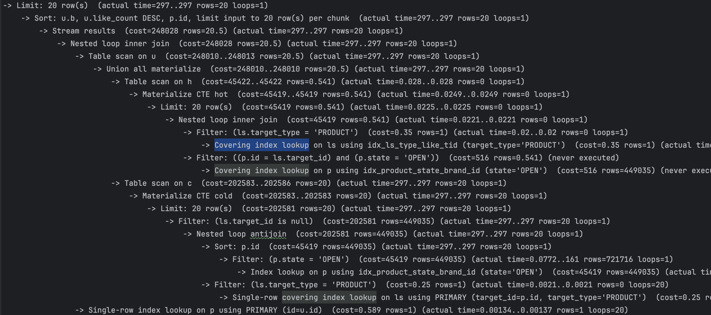

# 성능 과학: 인덱스와 캐시

왜 '컴퓨터 과학'에는 '과학'이란 단어가 붙을 수 있는 것일까? 컴퓨터 과학이란 '컴퓨팅 기기(연산 기계)에 대해 **과학적 방법**을 이용한 학문'이다.

> **과학적 방법**(Scientific Method)은 최소 17세기부터 과학을 수행할 때 참조되어 온 **경험적 지식 획득 방법**입니다. 이 방법은 고대와 중세 시대부터 발전해왔으며, 관찰과 엄격한 회의주의를 바탕으로 합니다. 인지적 가정이 관찰 해석을 왜곡할 수 있기 때문에, 과학적 탐구는 귀납적 추론을 통해 검증 가능한 가설을 만들고, **실험**과 **통계 분석**을 통해 이를 검증하며, 결과에 따라 가설을 조정하거나 폐기합니다. - [위키백과](https://en.wikipedia.org/wiki/Scientific_method)


공학이란 것에는 안전성, 경제성, 보안성 등 **실용적인 관점에서 평가 및 판단**한다는 점에서 과학과 차이가 있다. 하지만 공학적 판단의 근거로 과학적 방법에 의한 데이터가 주어지는 것은 이상적인 방향이다.

이번 글은, 이런 과학적 방법을 통해, 조회 성능 향상에 대한 일반적인 가설을 내가 만든 애플리케이션 예제에 적용해보고, 비교 관측해본 과정에 대해서 설명하려고 한다. (적용 과정은 [이곳](https://github.com/Iol-lshh/loopers_be_practice_byjava/pull/8)에서 확인할 수 있다.) 이를 통해 과학적 방법이 여러 조회 성능 가설에 대해 뾰족한 접근을 제공하는지 내 판단의 근거가 되기를 기대했다.

---

## 관찰

과학적 방법의 첫 번째는 문제 제기다. 루퍼스 과정을 진행하며 작성한 이커머스 예제 애플리케이션은 클린아키텍처를 따르고 있으며, 요구사항에서 이야기하는 모든 기능들을 구현하고 있다. 하지만 *비기능적 요구사항인* **성능 관점**에서도 이를 만족하고 있을까?

애플리케이션이 요구되는 성능이란 무엇일까? 여기엔 여러가지가 있겠지만, 가장 중요한 것은 이 두가지다.

- 지연속도
- 처리량

그리고 컴퓨터의 문제는 이 두 가지로 귀결된다.

- 읽기
- 쓰기

여기서는 우선 쓰기보다 **읽기에 초점**을 맞추어 이야기해보려 한다. 아무튼, 이런 관점에서 봤을 때, 일반적인 엔터프라이즈 애플리케이션이 갖는 문제 계층은 세 가지로 뽑아낼 수 있다.

- 네트워크
- 애플리케이션
- 데이터소스

## 가설

각 계층에서 성능 저하를 일으킬 수 있는 부분이 어딜까? 결국 성능 저하는 자원의 문제이기도 하다. 서비스가 '어느정도의 자원을 할당받았느냐'와 '얼마나 할당받은 자원을 잘 활용하느냐'가 관건이다. 각 계층의 하드웨어 자원의 속도를 봤을때, 데이터소스 계층의 속도가 가장 느릴 것이다. 데이터소스 계층은 영속화를 목표로 하는 계층이며, 이런 이유로 많은 데이터를 영속화하기 위해서 조금은 느려도, 비용 대비 용량이 큰 자원을 활용해야하기 때문이다.

때문에 내 애플리케이션이 느리다면, 영속화가 가장 큰 문제일 것이라 가설을 세웠다. 이커머스 특성상 가장 많은 조회 데이터를 갖는 **상품**에 대해 목록화를 대상으로 성능 개선 실험을 하기로 했다.

이것은 내가 애플리케이션의 성능을 올리기 위한 방안에 대한 가설이다.

1. 데이터소스에 적절한 **인덱스**를 적용하면 조회 성능이 향상된다.
2. 애플리케이션에 적절한 **캐시** 전략을 적용하면 조회 성능이 향상된다.

---

## 실험

과학적 방법의 실험 단계에서 가장 중요한 것이 뭘까? 실험이 예측된 결과를 내어주는 것? 실험이 빠르게 수행되는 것? 실험 단계에서 가장 중요한 것은, 제대로 된 비교군의 설정이다.

### 실험 0 - 변인 통제

제대로 된 비교군을 설정하는 것을 변인 통제라고 한다. 변인 통제는 말 그대로 변수가 되는 인자들을 모두 통제하는 것을 의미한다. 변인 통제는 실험 단계에서 주는 변화가 항상 같은 결과를 내는 것을 유도하는 것을 지원한다. 만약, 하나의 실험 케이스가 여러번 수행할 때마다 결과가 다르다면, 그 실험은 가설의 근거가 될 수 없다. 실험은 일관성 있는 불변식을 만들어내야 한다.

#### 비교군

나는 애플리케이션이 수행될 때마다, 데이터베이스를 모두 비우고 새로 테이블을 만들게 설정했다. 그리고 무작위 특징을 가진 백만개의 상품 데이터를 데이터베이스에 넣어주는 스크립트를 작성했다. 이 상품 데이터는 무작위적인 특징과 패턴을 갖고 있지만, 고정된 백만개의 데이터다. 때문에 조회 성능을 다루는데 있어 변인 통제를 갖춘 비교군을 형성한다.

#### 관측 도구

관측의 대상을 만들었으니, 관측 도구를 설정해야한다. 애플리케이션의 성능을 확인하는데 여러 가지 방안이 있을 것이다. 나는 여기서 '데이터 조회 성능'에 초점을 맞추었으므로, 두 가지 관측 도구를 준비했다.

##### 실행 계획

데이터베이스를 MySQL이라는 관계형 데이터베이스로 구성했다. 관계형 데이터베이스는 SQL(Structured Query Language)이라는 선언형 언어로 만들어진 Query라는 단위로 요청하면, 그 요청에 맞는 데이터를 찾아 제공한다. 이 때 수행하는 과정을 실행계획이라고 한다. 또한 이런 실행계획을 SQL로 작성된 Query를 통해 제공받을 수 있다. 이 실행계획을 통해 요청한 Query의 성능을 확인할 수 있다.


##### API 스모킹 테스트

애플리케이션의 성능을 확인하기 위해서 대표적인 것에 부하 테스트라는 것이 있다. 여기에는 여러가지 종류의 테스트가 있지만, 나는 여기서 스모킹 테스트만을 작성했다. 스모킹 테스트는 애플리케이션에 부하가 없을 정도로 기능 동작을 요청하여, 정상 작동을 확인하는 테스트다. 이런 스모킹 테스트만 하는 이유는, 애플리케이션이 평균적 정상적으로 동작했을 때 어떤 결과를 내는지를 확인하고자 함이다. 다른 부하 테스트 - 예컨데 로드 테스트, 스트레스 테스트, 스파이크 테스트의 경우 애플리케이션의 여러 특수한 상황에 대해 문제가 없음을 확인하는 테스트다. 이런 테스트는 내가 확인하고자 하는 일차적인 목표인 조회 성능의 향상 범위 밖의 변인을 만들 가능성이 농후하다. 때문에 스모킹 테스트에 로드 테스트 성격이 일부 포함된(부하가 적다고 예측된 상황에서의 성능 측정) 테스트만을 수행했다.

```js
// 상품 목록 기본 조회 테스트 설정  
export const options = {  
  stages: [  
    { duration: '10s', target: 1 },  
    { duration: '10s', target: 10 },  
    { duration: '10s', target: 100 },  
    { duration: '10s', target: 0 },  
  ],  
  thresholds: {  
    http_req_duration: ['p(95)<300'],  
    http_req_failed: ['rate<0.05'],    // 에러율 5% 미만  
    checks: ['rate>0.95'],             // 체크 성공률 95% 이상  
  },  
  // InfluxDB 출력 설정  
  ext: {  
    loadimpact: {  
      distribution: {  
        'influxdb': { loadZone: 'amazon:us:ashburn', percent: 100 }  
      }  
    }  
  }  
};  
  
const REQUEST_DURATION = 300; // 동시 요청 고려하여 임계값 증가  
const BASE_URL = __ENV.BASE_URL || 'http://localhost:8080';  
  
// 상품 목록 기본 조회 테스트 시나리오  
export default function () {  
  // 시나리오: 기본 상품 목록 조회 (최신순)  
  const basicResponse = http.get(`${BASE_URL}/api/v1/products?sort=latest`);  
    
  // 응답 시간 상세 로깅  
  console.log(`[VU: ${__VU}] Response time - Total: ${basicResponse.timings.duration}ms, Waiting: ${basicResponse.timings.waiting}ms, Connecting: ${basicResponse.timings.connecting}ms`);  
    
  check(basicResponse, {  
    '기본 상품 목록 조회 성공': (r) => r.status === 200,  
    '기본 상품 목록 응답 시간 체크': (r) => r.timings.duration < REQUEST_DURATION,  
    '기본 상품 목록 응답 크기 체크': (r) => r.body && r.body.length > 0,  
  });  
  
  sleep(1);  
}
```

다음은 그 결과다.


상당히 붉다. 무언가 많이 잘못됐나보다. 당장 인덱스부터 적용해보자. (게이지는 차례대로 평균, p95, p99를 의미하며, 단위는 ms이다.)

### 실험 1- 데이터소스에 적절한 **인덱스**를 적용

```sql
CREATE INDEX idx_product_state_rel_id ON product (state, released_at DESC, id);
```

다음은 인덱스를 적용한 뒤, 실행계획 수행의 결과다. (외에도 여러 인덱스를 추가했다.)


실행계획을 살펴보면, 인덱스 idx_product_state_rel_id를 사용하는 Index lookup이 보인다. 인덱스를 이용함으로써 조회된 데이터가 줄어들었기 때문에, 심지어 위의 hash join은 nested join으로 바뀌었음을 볼 수 있다.

다음은 K6 성능 테스트를 결과다.


인덱스를 적용 후 어마어마한 성능 효과를 볼 수 있었다. (그라파나의 빨간 부분-order by likecount는 특수한 부분이다. 두 배 가까이 성능적 이득을 이뤘으나, 여전히 300ms 안을 도달하지 못하고 있다. 이에 대해서는 잠시 뒤에서 이야기하겠다.)

성능의 문제는 결국 자원의 문제다. 자원을 가진 애플리케이션이 수행하는 **지연율**과 **처리량**의 두 관점에서 봤을 때, 

- cpu: 애플리케이션 로직
    - cpu 수행이 오래 걸리거나
    - cpu 수행에 병목이 있거나
- io: DB 또는 네트워크
	- io 수행이 오래 걸리거나
	- io 수행에 병목이 있거나

이런 경우들이다. 인덱스의 적용은 io의 수행 속도를 향상 시킨 사례다.

사실 가운데 likes_desc는 인덱스를 적용했음에도 불구하고 io 수행에 있어 속도 향상이 쉽지 않았다. 이유는 like_summary 테이블의 like_count(좋아요 수)를 기준으로 정렬되는데, like_summary는 공간 낭비를 방지하기 위해서 좋아요가 생기기 전까지, 로우를 생성하지 않게 했다. 때문에 조인할 like_summary가 별로 없을 경우, 정렬 기준 자체가 null이 되면서 문제가 생겼다.


그런 문제를 해결하고자, hot - like summary가 존재, cold - like summary가 존재하지 않는 대상을 released_at으로 나누어 정렬했다.




Covering index로 많이 줄였다. 297ms가 최선일까? 이를 해결하기 위한 다른 방안이 있을 것이다. 다만 최대한 심플한 해결책을 적용해야 유지보수의 성능을 높이고, 결함 비율을 낮출 수 있다. 그런 방법 중 하나가 캐시라고 생각한다.

### 실험 2 - 애플리케이션에 적절한 **캐시** 전략을 적용

이 좋아요 수 순의 상품 목록에 캐시를 적용했다. 목록 조회에 대해 상품을 JSON으로 넣어두고, 가져오도록 수정했다.

```java
@Transactional(readOnly = true)  
public List<ProductInfo.ProductWithSignal> findWithSignals(ProductStatement statement, Pageable pageable) {
    // 1. 캐시를 먼저 읽어봄
    List <ProductInfo.ProductWithSignal> cached = productCacheRepository.findWithSignal(statement, pageable);  
    if (!cached.isEmpty()) {
	    // 2a. 있으면 결과 반환
        return cached;  
    }
    // 2b1. 없으면 데이터소스 조회
    List<ProductInfo.ProductWithSignal> productWithSignals = productReader.findWithSignals(statement, pageable);
    // 2b2. 캐시 및 결과 반환
    return  productCacheRepository.save(statement, pageable, productWithSignals);  
}
```

다음은 캐시한 애플리케이션에 K6를 테스트한 결과다.


초기 몇 건이 튀는 것을 볼 수 있다. 캐시 미스로 인해, 데이터베이스를 조회하면서 나오는 결과다. 그랬음에도 불구하고, p95까지의 모든 지표가 50ms도 넘지 않음을 확인할 수 있다.

1125건의 요청중 13건이 실패다. p99에서 300ms를 넘는다. 이것까지 커버하려면 어떻게 해야할까?

캐시 설계 전략에는 여러 가지가 있다.

- 쓰기 전략
    - **Write-Through**: **동작 방식**: 애플리케이션이 데이터를 쓸 때 **캐시와 데이터베이스에 동시에 기록**
    - **Write-Back**: 쓰기 시 **캐시에만 기록**하고, 이후 비동기적으로 DB에 반영.
    - **Write Around**: 쓰기 시 **캐시를 건너뛰고 DB에만 기록**, 읽기 요청이 들어올 때만 캐시에 적재.
- 읽기 전략
    - **Read-Through**: 캐시를 통해 읽기를 수행. 캐시에 없으면 캐시가 직접 DB에서 읽어와 저장한 뒤 반환.
    - **Look Aside**: 애플리케이션이 먼저 캐시 조회 → 없으면 DB 조회 후 캐시에 적재
    - **Refresh-Ahead**: 캐시 데이터의 TTL(만료 시간)이 가까워지면 **백그라운드에서 미리 갱신**.
- 수동 삭제
    - **CacheEvict**: 캐시 데이터를 **명시적으로 제거**.

내가 사용한 방식은 Look Aside다. 캐시를 조회하고, 없으면 DB를 조회한다. 이 방식은 캐시 공간의 낭비를 줄인다. 하지만 나의 경우에서 볼 수 있는 것처럼, 캐시 미스의 경우에 느리다. 실제 서비스를 생각해보면, 한번에 많은 트래픽이 몰려와서 서비스의 장애가 될 수 있는 부분이기도 하다. 이런 현상을 **Thudering herd**라고 한다.


해결책은 단순하다. Refresh-Ahead - 미리 캐시해두면 된다. 다만 여기에도 문제가 있다. 캐시의 가장 큰 트레이드오프는 지연시간을 줄여주지만 실시간성을 희생해야 한다는 점이다. 그러므로 비즈니스에 맞는 세밀한 TTL 설계가 필요하다.

실시간성의 목록 보여줌을 매우 중요하게 생각하는 서비스라 하자. 그렇다면 다음과 같은 설계를 필요로 할 것이다.

1. 애플리케이션이 실행될 때 캐시 - TTL을 n초 잡음
2. 스케줄이 캐시 - TTL 되기 n/2초전 (또는 조회 및 캐시를 수행하는데 걸리는 시간 확보)

이런 설계는 거의 준실시간에 가까운 조회와 함께, 빠른 캐시의 성능을 이용할 수 있겠다.

---


이 실험의 결과는 실제 환경과는 좀 다를 수 있다. 아무래도 로컬 환경은 여러 노이즈가 낄 우려도 있고, 여러 스케일링 환경과 부하 테스트들을 고려하지도 않았다. 인덱스와 캐시가 무엇인지는 알고 있었다. 그리고 실무에서도 수정하고, 구현하고 하는 작업도 적지 않았다. 하지만 이렇게 세밀하게 성능을 기록하여 글을 써보는 것은 거의 처음이라 꽤나 시간을 소요했다. 다만 매우 흥미로운 과정이었다. 생각보다 성능의 차이가 더 컸으며, 서비스의 품질 차이에 많은 영향을 준다는 것을 기록한다는 것은 그저 알고, 경험하는 것과 또 다른 배움의 결과를 제공했다.

조회 성능에 대한 실험을 수행하고 결과를 기록했다. 다음 글의 주제는 쓰기 성능과 MV와 같은 것이 목표가 되지 않을까 싶다.