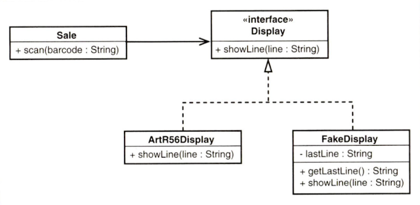

근래 드는 생각이, 나는 좋은 코드, 깔끔한 코드가 무엇인지 모르겠다... 최근 [엔터프라이즈 애플리케이션 아키텍처 패턴](https://iol-lshh.github.io/%ED%9A%8C%EA%B3%A0/EAA/EAA_%EC%A0%95%EB%A6%AC%EC%99%80_%ED%9A%8C%EA%B3%A0/)(Fowler, 2002)도 읽어보고 [DDD](https://iol-lshh.github.io/%ED%9A%8C%EA%B3%A0/ddd/DDD_%EC%A0%95%EB%A6%AC%EC%99%80_%ED%9A%8C%EA%B3%A0/)와 [XP](https://iol-lshh.github.io/%ED%9A%8C%EA%B3%A0/agile/Agile_%ED%9A%8C%EA%B3%A0/) 도 열심히 찾아봤다. 그러면서 느낀 점이 있었다.

## 좋은 코드를 향한 여정

P of EAA에서 파울러는 비즈니스 로직 계층에 대한 패턴으로 **트랜잭션 스크립트**와 **도메인 모델**을 이야기한다. 트랜잭션 스크립트 방식은 유스케이스에 대해 절차적으로 비즈니스 로직을 풀어나가는 방식이고, 도메인 모델은 DDD에서 이야기하는 코드가 도메인 모델이 되는 방식이다.

도메인 모델은 어렵다. 도메인 모델 방식의 시스템을 이해하기 위해서는 도메인에 대한 학습이 필수적이다. 뿐만 아니라 전략 패턴 설계를 위해서는 조직 구조적 차원의 노력이 필수적이다. 개발 조직 간의 컨택스트 맵 설계도 중요하지만, 무엇보다 중요한 것은 도메인 모델 설계에 있어 **도메인 전문가와의 논의를 통해 유비쿼터스 언어로 된 모델 설계 또한 자주 이루어져야 하는 것**이 가장 중요하다. 이는 회사 차원의 지속적인 노력이 없으면 안되는 일이다. 이런 논의 없이 **개발 조직만의 도메인 모델 설계는 진정한 도메인과의 단절로 인해 읽고 이해해야하는 부채만 두 배로 늘어나는 셈**이다. 그 뿐만 아니라 **요구사항의 변경마다 도메인 모델은 변화 되어야만 하는데, 이 또한 비용이 많이 든다.**

그렇다면 트랜잭션 스크립트 방식으로 가야 하는가? 트랜잭션 스크립트 방식은 대부분의 회사가 쓰는 방식이다. 절차적인 비즈니스 로직의 나열이라 코드를 읽기 쉽다. 하지만 단점은 매우 명백하다. 현실 세계는 혼잡하다. 비즈니스 로직이 발전되며 트랜잭션 스크립트 방식은 **많은 분기와 코드 중복을 유발**하게 되고, **기하급수적으로 복잡성이 커지게 된다.** 그리고 시스템은 유지보수의 효율과 생산성이 급락한다.

트랜잭션 스크립트 방식은 확실히 초반에 유리하다. 하지만 생산성의 향상을 위해서는 적절한 시점에 도메인 모델 방식으로 전환되어야 하며, 또한 도메인 모델 방식에서도 도메인 전문가들과 소통하며 도메인 모델이 망가지지 않도록 지속적으로 변화를 관리해야 한다. 어떤 방식이든 시간이 지남에 따라 비즈니스 로직이 쌓이면 **기술 부채**(technical debt)가 생기는 것이다. 그리고 코드를 개선하는 일이 중요한 과제가 된다는 것이다.

이런 일련의 생각들을 거치며 개선에 대한 실천 방법이 궁금해졌다. 그럼 어떻게 개선해야 할까? 두 가지 단어가 바로 떠올랐다.

- **리팩터링**(Refactoring): 소프트웨어의 기존 동작을 변경하지 않으면서, 이해 및 변경이 용이하도록 소프트웨어의 내부 구조를 변경하는 작업
- **회귀 테스트**(Regression Test): 이전에 개발 및 테스트된 소프트웨어가 변경 후에도 예상대로 계속 수행되는지 확인하기 위해 기능적 테스트와 비기능적 테스트를 다시 실행하는 것.

다음은 마이클 C. 페더스의 레거시 코드에 대해 내린 정의이다.

> 내게 **레거시 코드란, 단순히 테스트 루틴이 없는 코드**다.    
> 테스트 루틴이 없는 코드는 나쁜 코드다. 코드가 얼마나 훌륭하게 작성돼 있는지 여부와는 상관없다. 아무리 깔끔하고 객체 지향적이며 캡슐화가 잘돼 있어도 소용없다. 테스트 루틴이 있으면, 코드의 동작을 빠르게 검증하며 수정할 수 있다. 테스트 루틴이 없으면 우리가 작성하고 있는 코드가 좋아지고 있는지, 나빠지고 있는지 제대로 알 수 없다. - Working Effectively with Legacy Code (Feathers, 2004)

Extreme Programming(Beck, 2004)을 이야기하려는 것이 아니다. 처음부터 프로젝트를 XP로 진행했으면 너무 좋다. 하지만 현실과 이상은 괴리가 크다. 페더스는 그런 현실속에서 소프트웨어 바이스(Software Vise)를 만들어 레거시 코드를 개선하는 희망을 제시한다.

> **소프트웨어 바이스**(Software Vise)   
> 바이스(vise)는 목공예나 금속세공에서 공작물을 고정시키는 장치를 말한다. ...(중략)... 변경을 탐지하는 테스트 루틴을 사용하는 것은 곧 코드 주위에 바이스를 두는 것과 같다. 코드의 동작은 그 상태로 고정된다. (2) - Working Effectively with Legacy Code (Feathers, 2004)

조금 더 페더스가 말한 개선 방법을 자세히 보자. 페더스는 먼저 "코드의 변경" 그 자체를 낱낱이 해부했다.

---

## 코드 변경의 본질 - Feathers가 말하는 4가지 이유

페더스는 소프트웨어 코드를 변경하는 이유를 네 가지라고 봤다.

- 새로운 기능의 추가 (new feature)
- 버그 수정 (bug fix)
- 설계 개선 (refactoring)
- 자원 이용의 최적화 (optimizing)

### New Feature vs Bug Fix

새 기능 추가인지, 버그 수정인지는 주관적인 관점이다. 진짜는 **동작에 수정(behavioral change)이 있는지**다.

> 동작(behavior)은 소프트웨어에서 가장 중요한 것이다. 사용자가 원하는 것이 바로 이 동작이기 때문이다. 우리가 동작을 추가하면 사용자는 소프트웨어를 좋아한다. 하지만 사용자가 원하는 동작을 변경하거나 삭제하면, 사용자들은 우리를 더 이상 신뢰하지 않는다. (1) - Working Effectively with Legacy Code (Feathers, 2004)

하지만 동작 수정도 기준이 모호하다. 그래서 페더스는 **코드의 변경이 있을 때, 동작을 변경하는 것**이라 간주하고, 새로운 코드를 추가하고 호출할 뿐이라면 동작 추가라고 간주하자고 했다.

### Refactoring

동작 변경 없이 설계를 개선하는 행위. 변경 관점에서 리팩토링을 할 때 가장 중요한 것은 리팩토링 전후에 **기능상의 변경이 없어야 한다**는 점이다. **의미 보존**(semantic-preserving)이 되어야 한다.

### Optimizing

리팩토링이 기능을 동일하게 유지하며 유지 보수성을 개선하기 위해 프로그램의 구조를 바꾸는 것이라면, 최적화는 프로그램의 시간이나 자원 사용량 등의 정량적 수치의 개선을 위한 것을 의미한다.

|        | New Feature | Bug Patch | Refactoring | Optimizing |
| ------ | ----------- | --------- | ----------- | ---------- |
| 구조     | 수정          | 수정        | 수정          | ❌          |
| 새로운 기능 | 수정          | ❌         | ❌           | ❌          |
| 기능     | ❌           | 수정        | ❌           | ❌          |
| 자원 사용량 | ❌           | ❌         | ❌           | 수정         |

---

## 코드 변경의 두 갈래 - '편집 후 기도하기' vs. '보호 후 수정하기'

페더스는 시스템을 변경하는 방법에는 두 가지가 있다고 정리했다.

- 편집 후 기도하기 Edit and Pray
- 보호 후 수정하기 Cover and Modify

### Edit and Pray

> '편집 후 기도하기' 방식은 겉보기에는 '신중하고' 매우 전문적인 방식처럼 보인다. '신중함'을 가장 전면에 내세우며, 영향이 미치는 범위가 넓은 변경 작업일 경우에는 더욱 세심한 신중함이 요구된다.   
> 그러나 아무리 신중하게 주의를 기울여도 그에 비례해서 안정성이 높아진다는 보장은 없다. 아무리 신중하고 주의 깊은 의사라 할지라도 버터를 바르는 칼로 외과 수술을 한다면, 아무도 그에게 수술을 받으려고 하지 않을 것이다.    
> 효과적인 소프트웨어 변경은 효과적인 수술과 마찬가지로 고도의 기법을 요한다. **주의를 기울여 작업하더라도 적절한 도구와 기법이 없다면 효과를 거두기 어려운 것**이다. (2) - Working Effectively with Legacy Code (Feathers, 2004)

지양하자. 부채에 따라 테스트를 작성하지 않아도 되는 것이 옳은가? 스크립트일 뿐이니까? 고민해보자.

### Cover and Modify

보호 후 수정하기 방식에 대해 **회귀 테스트**(regression test)를 이야기한다. 문제는 이 회귀 테스트를 애플리케이션 수준의 테스트로만 간주하는 경향이 있다는 것인데, 여기에는 이런 문제가 있다.

- **오류 위치**: 테스트 루틴이 **테스트 대상으로부터 멀어질수록, 테스트 실패가 의미하는 바가 모호해진다.** 테스트 실패 위치를 특정하기위해, 테스트 입력 값을 확인하고, 오류 내용을 확인하고, 입력에서 출력까지 경로를 분석해야한다. 이 과정에서 많은 비용이 소모된다.
- **실행 시간**: 테스트 루틴의 길이가 길어질수록 **실행하는 데 오랜 시간이 소모된다.** 테스트 실행 자체를 망설이게 되며, 지나치게 오래 걸리는 테스트는 실행도 하지 않게 된다.
- **커버리지**: 파편화된 코드 조각들을 실행시키는 **연결 관계를 파악하기 어렵다.** 많은 분기와 중복된 코드들, 복잡한 서브 루틴 모음들은 상위 단계의 테스트 루틴을 위해 상당한 양의 선행 작업을 필요로 하게 된다.

가장 큰 문제는 이런 문제들로 인해, 테스트를 **자주 실행하지 않게 된다**는 것이다. 정말 필요로 하다는 것을 알지만, 효용은 낮고 비용은 높기 때문이다. 단위 테스트는 이런 점들을 보완한다.

> 실행에 0.1초가 걸리는 단위 테스트는 속도가 느린 단위 테스트다.

단위 테스트는 실행 속도가 빨라야하며, 오류 위치 파악에 도움이 되도록 **하나의 테스트 하네스(test harness)는 한 가지 의미에 집중**해야 한다. 페더스는 단위 테스트에서 제외되어야 하는 조건들에 대해 정리했다.

- 데이터베이스와 연동한다.
- 네트워크를 통해 통신한다.
- 파일 시스템을 건드린다.
- 테스트 실행을 위해 특별한 작업이 필요하다. (ex. 설정 파일 편집)

물론 이런 기술 테스트, 통합 테스트도 필요하다. 테스트 하네스에 포함시키기도 한다. 하지만 진정한 단위 테스트와 분리할 수 있어야 한다. 시나리오와 상호작용 테스트를 통해 다수 클래스들의 동작을 확인할 수 있으며, 개별 클래스에 대한 테스트 루틴 작성을 돕기도 한다.

---

## 리팩터링 - 도덕이 아닌 경제 논리

**Legacy Code를 개선한다는 것은 여러 코드 변경 행위 중, "리팩터링"한다**는 것을 의미한다고 정리했다. 리팩터링은 동작 변경 없이 설계를 개선하는 **의미 보존**(semantic-preserving)이 이루어져야 한다고 했다.

또한 'Refactoring'(fowler, 2020)에서 파울러는 이렇게 말했다.

> 리팩터링의 궁극적인 목적은 개발 속도를 높여서, 더 적은 노력으로 더 많은 가치를 창출하는 것이다.

그러니깐 리팩터링의 목적은 어디까지나 **작업의 효율화**다. 때문에 파울러는 다음 경우가 리팩터링하지 말아야 할 때라고 하고 있다.

- **외부 API 다루듯 호출해서 쓰는 코드라면 지저분해도 그냥 둔다.** 내부 동작을 이해해야 할 시점에 리팩터링해야 효과를 제대로 볼 수 있다.
- **리팩터링하는 것 보다 처음부터 새로 작성하는 게 쉬울 때도 리팩터링하지 않는다.** 다만 직접 리팩터링하기 전까지는 어느쪽이 쉬울지 확실히 알기 어려우니, 뛰어난 판단력과 경험을 뒷받침 삼아 결정해야한다고 한다..

그 외에는 리팩터링이 지속되어야 한다. 리팩터링은 코드베이스의 건강 상태를 끌어올리고, 생산성을 높인다. **새 기능이 추가**되어야하는데 설계가 적합하지 않다면, 리팩터링하고 기능을 추가하는게 빠르다. **버그 수정**시 소프트웨어 작동 방식을 이해해야 하는데, 이때도 리팩터링을 하는 것이 빠르다. 리팩터링이 개발과 같이 진행되는 것이 코드베이스와 생산성을 같이 올린다고 했다.

 > 내가 볼 때 사람들이 빠지기 쉬운 가장 위험한 오류는 리팩터링을 ‘클린 코드 clean code ’나 ‘바람직한 엔지니어링 습관’처럼 도덕적인 이유로 정당화하는 것이다. 리팩터링의 본질은 코드 베이스를 예쁘게 꾸미는 데 있지 않다. **오로지 경제적인 이유**로 하는 것이다. 리팩터링은 **개발 기간을 단축하고자 하는 것**이다. 기능 추가 시간을 줄이고, 버그 수정 시간을 줄여준다. 스스로 그렇게 인식하는 데 그치지 말고 다른 사람과 대화할 때도 이 점을 명심해야 한다. 리팩터링하도록 이끄는 동력은 어디까지나 경제적인 효과에 있다. 이를 명확히 이해하는 개발자, 관리자, 고객이 많아질수록 앞에서 본 소프트웨어 개발 진행 그래프에서 ‘좋은 설계’ 곡선을 더 많이 볼 수 있다.(2) - Refactoring (Fowler, 2020)

심지어, **기술을 모르는 관리자와 고객이 코드베이스의 건강 상태가 생산성에 미치는 영향을 모른다면, 리팩터링한다고 말하지 않고 리팩터링해야 한다**고 말하고 있다.

> 기술을 모르는 상당수의 관리자와 고객은 코드베이스의 건강 상태가 생산성에 미치는 영향을 모른다. 이런 상황에 있는 이들에게는 “리펙터링한다고 말하지 말라“고 조언하겠다. 하극상일까? 그렇지 않다. 소프트웨어 개발자는 프로다. ...(중략)... 프로 개발자에게 주어진 임무는 새로운 기능을 빠르게 구현하는 것이고, 가장 빠른 방법은 리팩터링이다. (2) - Refactoring (Fowler, 2020)

리팩터링의 중요성을 알았다. 그럼 무엇을 리팩터링 해야할까?

---

## 리팩토링이 필요한 레거시 코드 - 악취

코드가 바람직하지 않을때 **악취**(smell)가 난다고 한다. 어떤 것이 바람직하지 않은 코드인가? 개발자가 설마 일부러 악취를 처음부터 만들진 않을 것이다. 소프트웨어는 유지보수 되면서 요구사항에 의해 변화되고, 그러면서 코드는 풍성해지고 빈약해지고 맥락이 바뀌길 반복한다. 그런 **변화는 코드를 의도와 어긋나게 만든다.** 이것이 악취의 본질인 것이다. 다음은 파울러가 말하는 악취의 패턴들과 해결책이다.

- **기이한 작명**: 이상한 이름은 맥락을 잘 표현하도록 바꿔줘야 한다.
- **코드 중복**: DRY하라. 서브 루틴이나 슈퍼 클래스로 올려라.
- **너무 긴 루틴**: 루틴이 너무 길면 서브 루틴으로 쪼갠다.
- **너무 많은 매개변수**: 매개변수를 객체로 묶어라.
- **전역 데이터** (Global Data): 지양하라.
- **가변 데이터** (Mutual Data): 복잡성이 증가하므로 필요할때에 쓰고 불변 데이터를 지향하라.
- **뒤엉킨 변경** (Divergent Change): 서로 다른 맥락이 하나의 경계 안에서 혼재되어 불분명한 경우. 단일 책임 원칙(SRP)이 제대로 지켜지지 않을 때 나타난다. 맥락을 분리해야 한다.
- **산탄총 수술** (Shotgun Surgery): 하나의 맥락에 변경할 때 여러 개의 클래스를 동시에 수정하고 있다. 뒤엉킨 변경의 정반대. 맥락을 모아야 한다.
- **기능 편애** (Feature Envy): 특정 함수가 모듈내의 다른 함수들보다 다른 모듈들과의 너무 많은 상호작용이 몰려 있는 현상. 역할을 쪼개라.
- **데이터 뭉치**(Data Clumps): 데이터가 뭉쳐 다니는데, 객체 단위로 묶어주지 않은 것. 데이터 클래스를 만든다.
- **기본형 집착**(Primitive Obsession): 추상화하지 않고 기본타입을 너무 좋아하는 것. 추상화된 타입을 만든다.
- **반복되는 switch**(Repeated Switches): 분기문을 최대한 다형성을 이용해 세련되게 바꿔줄 것.
- **반복문** (Loops): 파이프라인을 지향할 것.
- **성의 없는 요소** (Lazy Element): 너무 의미없는 메서드나 클래스는 인라인(제거)하기
- **추측성 일반화** (Speculative Generality): 나중에 필요할 것이란 생각으로 당장 필요없는 특이 케이스 처리 로직으로 결국 이해하거나 관리하기 어려워진 코드. 애그니(YAGNI, You Aren't Going to Need It)를 리마인드 하자. 제거한다.
- **Temporary Field**: 특정 상황에서 값이 들어오는 필드. 객체를 가져오거나 생성할 때 필요한 모든 필드가 채워져 있다고 기대하는 것은 복잡성을 줄여준다. Temporary Field는 이유를 파악하기 위해 노력을 필요로 한다. 이런 필드들은 컨텍스트에 맞게 추출되어야 한다.
- **메시지 체인**: 클라이언트가 하나의 객체가 방금 얻은 또 다른 객체에 요청하는 식으로 작업이 연쇄적으로 이어지는 코드. 클라이언트가 객체 내비게이션 구조에 종속되었음을 의미한다. 내비게이션 중간 단계가 수정되면 클라이언트 코드도 수정되어야 한다. 위임 숨기기로 해결한다.
- **중개자**: 아무것도 안하고 구현을 위임하는 중간 클래스는 제거한다. (cf. 싱크홀 패턴)
- **내부자 거래**: 모듈 사이의 결합도를 낮추고, 상속 구조 간에 적절한 위임을 적용한다.
- **거대한 클래스**: 하나의 클래스가 너무 많은 일을 하여 너무 많은 필드들을 갖고 있을 때, 클래스로 추출하여 필드들을 묶어둔다. 상속 관계나 서브클래스로 가져간다.
- **서로 다른 인터페이스의 대안 클래스들**: 클래스 교체를 위해 다형성을 적용시킨다. 중복 코드에 대해서는 부모 클래스로 추출하는 것도 고려해본다.
- **데이터 클래스**: 적절한 캡슐화를 적용한다. 불변 필드는 굳이 캡슐화할 필요가 없다.
- **상속 포기**(Refuesed Bequest): 서브클래스가 관심있는 상속 요소만 받고 끝내려는 것인데 다음 세가지중 하나로 한다.
  - 상속 요소를 서브클래스로 내리기
  - 서브클래스를 위임으로 바꾸기 (composition)
  - 슈퍼클래스를 위임으로 바꾸기 (composition)
- **주석**: 주석을 남겨야겠다는 생각이 들면, 주석이 필요없는 코드로 리팩터링해야한다는 신호일 수 있다. 좋은 주석은 좋지만, 주석이 장황해진다면 원인이 악취나는 코드일 확률이 높다. (건망증이 있어서, 뭘 할지 모르는 부분에 주석을 달고, 나중에 수정하는 용도로 쓸 수 있다.)

리팩터링(Fowler, 2020)에서는 이런 악취들에 대해 자세한 리팩터링 패턴들을 카탈로그로 제공한다. 내용들은 개략적으로 이런것들이다.

- 작명을 적절히 한다.
- 문맥이 이어지도록 적절히 한다. (슬라이드)
- 변수와 루틴, 클래스를 적절히 추출/인라인 한다.
- 굵은 입자/세밀한 입자를 적절히 다룬다.
- 값, 변수, 루틴, 객체를 적절히 클래스와 객체로 묶고 캡슐화한다.
- 가변/불변 변수를 적절히 선택한다.
- 매직 리터럴이나 상수를 변수나 루틴으로 작명하여 다룬다.
- 분기문을 적절히 다형성으로 변환한다.
- 특이 케이스를 클래스로 객체로 다룬다.
- etc...

카탈로그는 꽤나 길지만 각각 GoF 디자인패턴, 클린 코드, 객체의 특징과 SOLID 원칙들을 적절히 적용한 방법, 문맥을 잘 살리기 위한 방법들로 이루어져있다.

리팩터링 해야할 타겟과 고치는 패턴을 알아봤다. 본격적으로 레거시 코드를 고치는 순서를 알아보자.

---

## 레거시 코드 수술 - 바이스 설치와 의존 관계 끊기

코드 수정 작업에서 가장 중요한 것은 **바이스를 설치**하는 일이다. 변경할 코드 주위에 테스트 루틴을 배치하여 안정성을 높인다. 불행히도 여기에 한가지 딜레마가 있다.

> 코드 변경을 하려면 테스트 코드를 배치해야 한다. 그런데 테스트 코드를 배치하려면 코드 변경이 필요할 때가 많다. (2) - Working Effectively with Legacy Code (Feathers, 2004)

기본 타입 매개변수와 인터페이스 추출이라는 방법을 사용한다. 의존 관계를 제거함으로써 영향도 높은 코드 변경의 안전성을 담보하면서 테스트 루틴을 작성하는 것이다. 정리하면 다음과 같다.

1. 변경 지점을 식별한다.
2. 테스트 루틴을 작성할 위치를 찾는다.
3. 의존 관계를 제거한다.
4. 테스트 루틴을 작성한다.
5. 변경 및 리팩터링을 수행한다.

### 의존 관계 제거하기

 왜 의존관계를 제거하는 걸까? 두 가지 이슈로 인해 의존 관계를 제거한다.

- **감지**(Recognition): 계산된 값에 접근할 수 없다. 값을 대체하기 위해 의존 관계를 제거한다.
- **분리**(Decoupling): 테스트 하네스 안에 넣어서 실행할 수 없다. 코드를 분리하기 위해 의존 관계를 제거한다.

페더스는 인터페이스를 이용해 의존 관계를 떼어내고, 가짜 객체(fake object)를 통해 테스트를 지원하는 방안을 이야기한다.

> **가짜 객체가 진짜 테스트를 지원한다**   
> 어떤 사람들은 가짜 객체를 사용하는 테스트를 가리켜서 "진짜 테스트가 아니다."라고 말하곤 한다. 어쨌든 실제 화면에 정말로 표시되는 내용을 보여주는 것은 아니기 때문이다. 따라서 금전 등록기 디스플레이 소프트웨어의 일부가 잘못 동작해도 우리는 이 테스트를 통해 소프트웨어의 오동작을 알아낼 수 없다. 물론 이것은 사실이지만, 그렇다고 해서 이 테스트가 실제 테스트가 아니라는 뜻은 아니다. 설령 실제 금전 등록기 화면과 정확히 동일한 픽셀로 구성되는 테스트를 설계할 수 있다고 한들, 그것이 모든 하드웨어에서의 동작을 의미할까? 그렇지 않다. 하지만 이것 역시 실제 테스트가 아니라는 의미는 아니다. 우리는 테스트 루틴을 작성할 때 **분할 후 정복(divide and conquer) 접근법**을 취해야 한다. 테스트의 목적은 Sale 객체가 디스플레이에 어떤 영향을 미치는지 알려주는 것에 그치지만, 그렇다고 중요하지 않은 테스트라고는 말할 수 없다. 적어도 버그의 원인이 Sale 클래스에 있는지 여부를 확인할 수는 있기 때문이다. **이러한 테스트를 통해 오류의 원인이 발생한 위치를 좁혀 나가고 디버깅 시간을 크게 절약할 수 있다.**  (3) - Working Effectively with Legacy Code (Feathers, 2004)

뿐만 아니라, 관점에 따라 필요한 로직을 분리하여, 다른 객체의 메서드로 분리한다. 이런 행위를 페더스는 객체 **봉합**(seam)이라고 했다. (전처리 봉합과 링크 봉합에 대한 이야기도 했지만, 이는 생략하도록 하겠다.) 봉합 지점은 코드를 수정하지 않고도 동작을 변경할 수 있는 위치를 말한다.

---

## 영향 분석으로 풀어내는 레거시 코드

코드를 제대로 변경하기 위해서는, 기존 동작에 대한 문서화 테스트(characterization test)를 필요로 한다. 가장 좋은 문서화 테스트는 메서드마다 테스트 코드를 작성하는 것이다. 하지만 레거시 코드는 경계가 뚜렷하지 않을 수 있다. 어떤 위치의 코드를 변경했을 때 다른 위치의 동작이 변경될 수 있다. 때문에 영향을 분석해야 한다.

### 영향

- **영향**: 기능의 변경이 연쇄적인 영향을 미치는 것. 코드가 잘 구조화돼 있다면, 대부분의 메서드의 영향 다이어그램이 간단한 모습을 가질 것이다.

소프트웨어의 품질 평가 기준 중 하나는 **외부 세계의 복잡한 영향들이 코드 내에서 간단한 영향 집합으로 단순화됐는지** 여부다. 품질이 떨어지면 영향 파악이 어려워진다. 이때는 디버깅도 어려워서, 문제로부터 원인까지 역으로 추적해야한다. 레거시 코드를 다룰 때는 이런 질문이 필요하다. "어떤 변경을 수행하면, 그 변경이 프로그램의 나머지 부분에 어떤 영향을 미칠까?" 이를 전방 추론이라고 한다.

- **전방 추론**(resoning forward): **먼저 객체들을 조사**하고 이 객체들이 제대로 동작하지 않을 경우 어떤 영향을 미치게 되는지 추론한다.

전방 추론은 테스트 루틴의 최적 위치를 찾는 기법의 기초다. 전방 추론을 통해 영향 다이어그램의 단순화를 목표로 한다.

코드의 영향 전파는 세 가지 방법으로 이루어진다.

- 호출 코드가 사용하는 반환 값
- 매개변수로 전달된 객체를 변경
- 정적 또는 전역 변수를 변경

이 외의 방법도 있다. 관점 구조는 시스템의 다른 곳에 있는 코드의 동작에 영향을 미친다.

영향을 탐색하는 방법은 다음과 같다.

- 변경 대상 메서드를 식별한다.
- 메서드가 **반환 값**을 가진다면, 이 메서드를 호출하는 코드를 탐색한다.
- 메서드가 **어떤 값을 변경**하는지 여부를 살펴본다. 그 값을 사용하는 메서드와 이 메서드를 사용하는 메서드를 탐색한다.
- 인스턴스 변수 및 메서드 사용자가 될 수 있는 슈퍼클래스와 서브클래스도 확인한다.
- 메서드의 매개변수와 반환값을 확인한다. 매개변수와 반환값이 객체일 경우 코드가 이를 변경하지 않는지 확인한다.
- 식별된 메서드 중에 전역 변수나 정적 변수를 변경하는지 확인한다.

영향을 차단하여 단순화하자. 객체간의 영향을 단순화하는 것을 캡슐화라고 한다. 캡슐화는 영향 받는 경로를 정의하고, 이외의 영향은 차단하게 된다. 객체지향의 **캡슐화**가 **영향을 단순화하고 추론을 도와준다**는 것을 알 수 있다. (cf. 애그리거트)

### 교차 지점

- **교차 지점**:  특정 변경에 의해 영향을 감지할 수 있는 프로그램 내의 위치

자연스러운 봉합부가 거의 없고 결합도가 높은 관계도는 적절한 교차 지점을 찾아내기가 어렵다. 심도 깊은 추론과 다수의 의존 관계 제거를 필요로 한다. 최상의 교차 지점을 판단해서 이 부분에 테스트 루틴을 두어야 코드 수정을 안전하게 할 수 있다. 일반적으로 가장 가까운 교차 지점을 선택한다. 먼저 이런 교차 지점 선택을 통해 상위 수준의 교차 지점을 찾는다.

- **조임 지점**: 영향 스케치 내에서 영향이 집중되는 곳. 소스 메소드에 대응하는 테스트 루틴으로 다수 메소드의 변경을 검출할 수 있는 곳

조임 지점이란 실제로 무엇일까? 조임 지점은 **자연적인 캡슐화의 경계**다. 조임 지점을 찾았다면, 코드의 상당 부분과 관련이 있는 모든 영향이 통과하는 곳을 발견한 것과 같다.

새로운 코드를 위한 단위 테스트를 작성할 때의 핵심은 가급적 독립적 클래스를 테스트하는 것이다. 단위 테스트의 목적은 객체들이 전체적으로 올바르게 동작하는지 확인하는 것이 아니라 하나의 객체가 어떻게 동작하는지 확인하는 것이다.

**기존 코드를 위한 테스트 루틴을 작성할 경우**에는 좀 다르다. 애플리케이션의 일부인 **조임 지점을 추출**해서 그 부분에 대한 테스트 루틴을 작성한다. 그 후 각각의 관련 클래스에 특화된 단위 테스트를 작성한다.

> 조임 지점의 테스트 루틴은 숲에 걸어 들어가서 줄을 그은 다음 '이 구역은 전부 내 것'이라고 말하는 것과 비슷하다. 해당 구역을 완벽히 숙지한 후에 비로소 리팩토링 및 테스트 루틴을 작성함으로써 더욱 발전시킬 수 있는 것이다. 마침내 조임 지점의 테스트 루틴을 삭제하고 각각의 클래스에 대한 단위 테스트를 사용해 개발을 진행할 수 있게 된다. (12) - Working Effectively with Legacy Code (Feathers, 2004)

조임 지점을 찾고 -> 그 조임 지점에 대한 테스트 루틴을 작성하고 -> 영향 스케치를 그려보고 -> 각각의 단위 테스트 루틴으로 만든뒤 -> 조임 테스트 루틴을 제거한다.

---

## 레거시 시스템을 위한 문서화 테스트

과거의 요구 사항 문서와 프로젝트 메모들을 찾아서 테스트 루틴을 작성할 수 있겠지만, 레거시 시스템에 이것은 좋은 접근법은 아닐 것이다. 레거시 시스템에서는 **시스템이 '어떻게 동작해야 하는지'보다 '실제로 어떻게 동작하고 있는지'가 더 중요하다.** 시스템이 해야 하는 일을 바탕으로 테스트 루틴을 작성하는 것은 시스템이 원래 의도한 바가 어떻든간에 버그인 테스트 루틴을 만든 것 밖에 안된다. 버그 찾기가 되어버린 것이다. 버그를 찾아내는 것도 중요하지만, 지금 여기서의 목표는 변경 작업을 하기 위한 테스트 루틴을 정확한 위치를 특정하는 것이다. 페더스는 이를 문서화 테스트라고 한다.

(버그를 발견했고 이것이 명백히 올바르지 않은 동작이라면 테스트 코드에 이를 표시하고 버그가 맞는지, 다른 개발자에게 알려서, 가급적 빨리 조사하고 수정하는 것이 바람직할 것이다.)

### 문서화 테스트

- **문서화 테스트**(characterization test): 코드의 **실제 동작**의 특징을 나타내는 테스트.

다음은 문서화 테스트의 작성 순서이다.

1. 테스트 하네스 내에서 대상 코드를 호출한다.
2. 실패할 것임을 알고 있는 확증문(assertion)을 작성한다.
3. 실패 결과로부터 실제 동작을 확인한다.
4. 코드가 구현할 동작을 기대할 수 있도록 테스트 루틴을 변경한다.
5. 위 과정을 반복한다.

이것은 블랙박스 테스트가 아니다. 문서화 테스트를 작성하며 코드를 조사한다. 테스트 루틴을 전부 감지 가능한지 조사한다. **테스트 루틴을 의사소통의 수단으로 삼는다.**

#### 클래스 문서화

1. 로직이 엉켜 있는 부분을 찾는다. 코드에 이해할 수 없는 부분이 있다면, 감지 변수를 사용해 해당 부분을 문서화할 것을 검토한다. (코드의 특정 부분이 실행되는지 확인하기 위해 감지 변수를 사용한다.)
2. 클래스나 메서드의 책임을 파악했으면, 일단 작업을 멈춘 후 실패를 일으킬 수 있는 것들의 목록을 만든다. 그리고 그러한 실패를 일으키는 테스트 루틴을 작성할 수 있는지 고려한다.
3. 테스트 루틴에 전달되는 입력 값을 검토한다. 극단적인 값이 주어질 경우 어떤 일이 벌어질지 확인해야 한다.
4. 객체의 라이프사이클 동안 항상 참이어야 하는 조건이 있는지 확인한다. 이런 조건을 **불변 조건**이라고 한다. 불변 조건을 검증하기 위한 테스트 루틴을 작성한다. 불변 조건을 발견하기 위해 클래스를 리팩토링해야 할 수도 있다. 리팩토링을 통해 코드의 바람직한 모습에 대한 새로운 지식을 얻게 되기도 한다.

(또한 모든 분기를 확인해야 한다. - 그래서 분기가 악취에 있는 것 같다.)

> 리팩토링 할 때는 일반적으로 두 가지를 확인해야 한다. 리팩토링 후에 **기존 동작이 유지** 되는지와 다**른 코드와의 관계가 올바른지** 여부다.   
> 문서화 테스트는 대체로 '화창한 날' 테스트다. 특별한 조건을 테스트하지 않고, **특정 동작이 유지되는지 검증**할 뿐이다. 문서화 테스트를 통해 코드를 이동하거나 추출한 리팩토링이 기존 동작을 유지한다고 유추할 수 있다. (13) - Working Effectively with Legacy Code (Feathers, 2004)

마지막으로 문서화 테스트에 대한 원칙이다.

- 변경 대상 부분을 위한 테스트 루틴을 작성한다. 코드의 동작을 이해하는 데 필요해 보이는 테스트 케이스를 가급적 많이 작성한다.
- 테스트 루틴을 작성한 후, 변경하려는 구체적인 코드들을 조사하고 이에 관련된 테스트 루틴을 작성한다.
- 기능을 추출하거나 이동할 경우, 기존의 동작이나 동작 간의 관계를 검증하는 테스트를 개별적으로 작성한다. 이를 통해 이동 대상 코드가 실행되는지, 그리고 적절히 관계를 유지하는지 검증한다. 검증이 끝난 후에 코드를 이동한다.

---

> 어떤 것이 잘 작동하면 변경할 필요가 없다.

긁어 부스럼 만들지 말라는 것인데, 이 말이 맞을까?

고무 풍선과 그 고무 풍선에 공기를 지속적으로 주입하는 기계가 있다. 고무 풍선이 터지기 전까지는 **잘 작동**하는 것으로 보인다. 하지만 터지고 나서 고무 풍선을 고치는 것은 매우 난해한 일이다. 커져가는 고무 풍선을 **그저 두는 것은 위험한 일**이다. 그렇다면 고무 풍선이 터지지 않게, 표면에 테이프를 붙이고 **신중하게** 바늘 구멍을 내서 공기를 조금씩 빼내는 것은 어떤가? 감탄스러우나, 넌센스임이 분명하다. 진짜 필요한 것은, **적절한 시기**가 되어 고무 풍선에 공기가 다 찼을 때, 공기를 주입하는 기계로부터 공기가 빠지지 않도록 풍선의 주입구를 잘 붙잡고 빼내는 것이다. 이런 행위가 **리팩터링**이며, 공기가 빠지는 변화를 막기 위해 주입구를 잘 붙잡는 행위가 **테스트**인 것이다. 이것은 너무나도 당연한 이치이다.

코드가 레거시화되는 것은 어느 방법론을 택했든 시간과 요구사항의 누적으로 피하기 어려운 문제다. 하지만 분명한 것은 프로 엔지니어라면, 책임 의식을 갖고 **결함에 대해서 한치의 물러섬 없으면서**도 **기술 부채가 시스템을 장악하지 않도록 적절한 시점에 갚는 꾸준한 리팩터링**할 의무가 있다는 것이다. 말처럼 쉽진 않겠지만 노력해야 하는 것이다.

> 나는 뛰어난 프로그래머가 아닙니다. 단지 뛰어난 습관을 지닌 괜찮은 프로그래머일 뿐입니다. - Kent Beck
