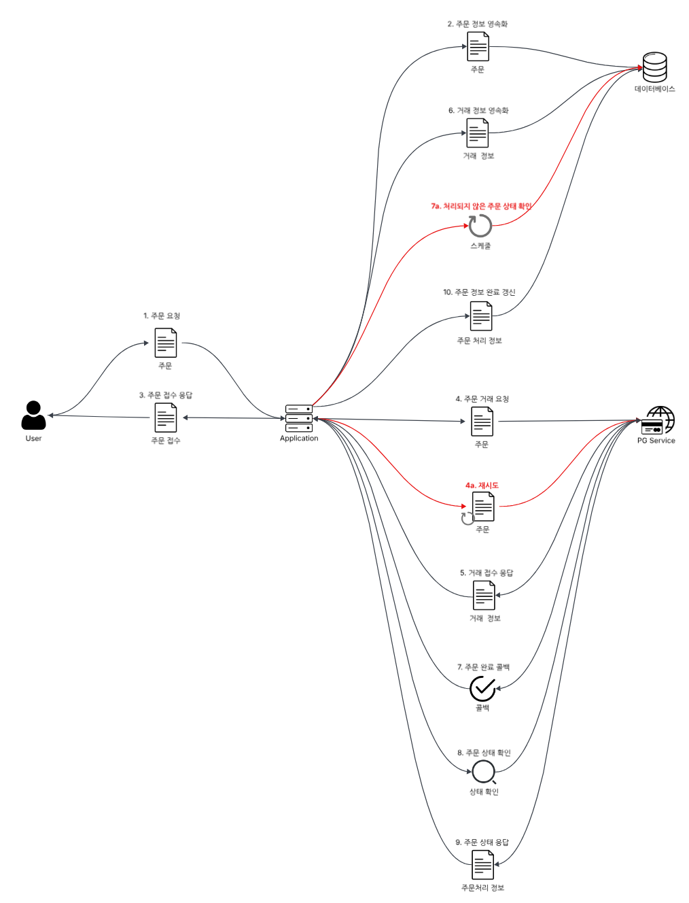

나는 역사 이야기를 선호한다. 과거 이벤트들의 패턴을 알면, 시대의 잘못된 흐름을 경계하고 올바른 미래를 쫓으려는 눈이 생기기 때문이다. 예컨데 중국의 역사와 문화는 장대하고 유구하다. 하지만 그들은 분서갱유와 문화대혁명 같은 역사를 지우려는 장애 상황을 반복했다. 역사의 유실은 인류에게 큰 손실이다. 역사의 흐름에도 장애 방지가 있으면 좋을텐데..

여기 내가 언젠가 알게된 중국 역사서의 한 구절이 있다.

> 질풍지경초 엄상식정목(疾风知劲草, 严霜识贞木) - 송서 열전

모진 바람이 불어야 억센 풀을 알고, 된 서리가 내려야 곧은 나무를 안다. 어려움과 역경 속에서 진정한 가치를 지닌 사람이 드러난다는 의미다.

시스템도 마찬가지다. 엔터프라이즈 애플리케이션은 가용성을 중요시한다. 이런 가용성은 비즈니스 모델에 따라, 서비스의 중단 뿐만 아니라 지연 또한 보상이 필요한 장애로 취급하기도 한다.(Service Level Agreement, SLA) 심지어 [아마존은 100ms의 지연이 1%의 매출 손실을 일으킬 것이라 예측했다.](http://glinden.blogspot.com/2006/11/marissa-mayer-at-web-20.html?m=1) 

예상하지 못한 장애가 일어났을때, 버티는 시스템과 무너지는 시스템이 있다. 이번 글의 주제는 장애에 대처하는 방법, **회복 탄력성**(Resilience)이다.

인프라나 시스템 아키텍처 범위보다는, 애플리케이션 티어 관점에서 *내부 제어에는 결함이 없다는 가정 하*에, **외부 서비스**와의 연동 지연 장애와 서킷브레이커, 타임 아웃, 재시도와 폴백 설계에 대해 배우고 고민한 것을 정리했다. 

---

## 상태 동기화 설계

외부 서비스와의 연동에서 가장 중요한게 뭘까? 연동하는 외부 시스템은 여러 유형이 있을 것이다. 메신저와 같은 알림 에이전트가 있을 수도 있고, PaymentGateway(PG)와 같은 결제 게이트웨이가 있을 수 있다. 이런 유형들은 비즈니스에 따라 쓰임새가 다르겠지만, 가장 중요한 것은 유스케이스 흐름에 따른 적절한 **상태 동기화**이다.

그렇다면 상태 동기화를 어떻게 처리할 것인가하는 질문이 남아있다. 여기엔 해답이 되는 키워드가 있다.

- 동기 vs 비동기
- 블로킹 vs 논블로킹

동기화에 대해서는 [여기](https://iol-lshh.github.io/pattern/synchronization/synchronization_%EC%A0%95%EB%A6%AC/)에 작성해두었다. 그러므로 자세한 설명은 생략한다. 이전에는 이런 외부 시스템에 대해, 단순히 일관성으로 묶인(like 트랜잭션) 동기적인 요청으로 처리했을 수 있다. 하지만 단순한 동기적 시스템 설계는 그 자체로 결함 요소가 많다. 내가 책임지지 않는 유스케이스 구성 요소에 대해서, 낙관적인 설계는 그 자체로 불필요한 비용이 될 수 있다

결국 외부 서비스와의 연동은 비동기적 처리가 자연스럽다. 여기서는 루퍼스 교육과정에서 만난 PG 연동 예제를 통해 설명을 풀어나가보려고 한다.

### 도메인 스토리 관점

우선은 [도메인 스토리 관점](https://iol-lshh.github.io/회고/design/design-usecase/)에서 생각해보자. 애플리케이션의 모든 기능들은 중요하다. 하지만, 그 중 더 중요한 몇몇 서브 도메인들이 있다. 이런 서브 도메인들 중엔 '결제'가 있다. 

왜 결제가 중요한가. 엔터프라이즈 애플리케이션은 '거래'(transaction)라는 비즈니스를 목적으로 한다. 그리고 이런 거래의 마지막은 유저와 어드민간의 계약에 대한 서명 처리, 즉 '결제'다. 때문에 모든 애플리케이션은 결제에 대해서 예민하게, 또한 최대한 처리 가능하도로 설계되어야 한다.

시스템 관점의 도메인 스토리를 그려보면 다음과 같다.


유저와 시스템 간, 시스템과 PG서비스 간의 각 액트는 모두 동기적인 요청으로 이루어져있다. 하지만 전체 과정에서 봤을때, 비동기적으로 분리된 서비스들이 상태를 동기화 하려는 블로킹 지점들을 갖고 있다. 위 도메인 스토리에 확장 요소를 더한 도메인 스토리를 그려보면 다음과 같다.



이 도메인 스토리는 아래의 유스케이스로 작성될 수 있다.

```text
- 일차 액터: 유저  
- 선조건:  
	- 유저는 로그인 상태다.  
    - 유저는 주문을 위한 (상품, 갯수) 리스트를 가진 상태다.  
    - 시스템은 pg 결제 시스템과 연동되어 있다.  
- 최소 보증: 클라이언트는 실패 상태 메시지를 받는다.  
- 성공 보증: 유저는 pg 결제를 승인하면, 주문이 완료된다.  
- 주요 성공 시나리오  
    - 1.유저는 주문 리스트를 통해 주문을 요청한다. 
    - 2.서버는 주문 정보를 영속화한다.
    - 3.유저에게 주문 접수를 응답한다.
    - 4.서버는 주문 거래를 PG 서비스에 요청한다.
    - 5.PG 서비스는 주문 거래를 접수하고, 접수된 정보를 서버에 응답한다.
    - 6.서버는 거래 정보를 영속화한다.
    - 7.PG 서비스는 주문 거래가 완료되어 콜백한다.
    - 8.서버는 PG 서비스에 주문 정보를 요청한다.
    - 9.PG는 주문 정보를 서버에 제공한다.
    - 10.서버는 주문을 완료 처리한다.
- 확장  
    - 4a.pg 결제 시스템으로부터 결제 진행 요청이 실패한다면, **서킷브레이커-리트라이**를 진행한다.  
	    - 4a1.pg 결제 시스템에 주문 식별자로 결제 상태를 확인한다.
	    - 4a2.pg 결제가 진행되지 않았다면, 결제 진행 요청을 재시도 한다.
	    - 4a3.이 진행은 최대 3회까지 재시도 한다.
	    - 4a4.재시도 후에도 결제 진행 요청이 실패한다면, 주문은 결제 실패 상태로 갱신되고, INTERNAL_SERVER_ERROR 상태 코드를 반환한다.
	    - 4a5.7a4는 후순위 pg 시스템이 제공된다면, 서킷브레이커 패턴으로 대체한다.  
    - 4b.pg 결제 시스템으로부터 결제 진행 요청이  timeout 상태에 이르면, **서킷브레이커-리트라이**를 진행한다.  
    - 4c.pg 결제 시스템으로부터 pending 상태가 반환된다면, 주문은 결제 대기중 상태로 유지된다.  
    - 7a.서버는 스케줄을 통해, db에서 주문 중 결제 대기중 상태인 주문 목록을 조회하고 이후 시퀀스를 진행한다.  
	    - 7a1.스케줄은 주문으로 부터 5분 뒤의 결제 대기중 주문에 대해서만 진행한다.  
    - 9a.pg 결제 시스템에서 결제 정보를 조회할 수 없다면, 주문을 결제 실패 상태로 갱신한다.  
    - 9b.pg 결제 시스템의 조회된 결제 상태가 결제 실패 상태라면, 주문을 결제 실패 상태로 갱신한다.  
    - 9c.pg 결제 시스템의 조회된 결제 상태가 결제 대기 상태라면, 주문을 결제 대기 상태를 유지한다.
```

결국 동기 요청을 통한 비동기적 처리 프로세스에서 중요한 것은, 맥락 관점에서 어느 부분을 동기화 부분으로 블로킹 하느냐이다. 이때 '스탭9'은 PG 시스템으로 부터 블로킹되는 동기화 부분이 될 것이며, '스텝10'는 결제 시스템을 데이터 소스로써 취급하여, 상태를 동기화하는 부분이 된다.

이런 비동기 시스템의 처리에서 ’스텝9‘ 이후의 비동기 후처리는 내 시스템의 DB에 쓰는 거래 장부의 마무리 기록 작업이기 때문에 중요하다. 다만 이 부분은 외부 서비스 연동 관점에서, PG라는 데이터 소스에서 ‘**읽기**’를 하는 동작에 불과하다.

데이터 정합의 장애가 발생 가능한 지점은 PG에 쓰기 요청을 보낼때, 즉 '스탭7'이다.

### 비동기 블로킹 쓰기 요청

멀리 떨어져 있는 것은 본질적으로 비동기적으로 동작한다. HTTP를 살펴보면, 이런 비동기적 과정 속에서 데이터를 동기적으로 공유하고자 여러 과정을 수행한다. 전송 계층(TCP)부터 살펴보면 다음과 같다.


HTTP에서 클라이언트는 TCP의 3-Hand-Shake를 통해서 멀리 떨어진 서로가 **연결을 동기화**하고, 데이터를 주고 받는다.

유비해서 바라보면, PG와의 연동 또한 매우 유사한 패턴을 갖추고 있음이 보인다. 아이디어가 똑같기 때문이다. PG라는 비동기적 동작에 대해, 블로킹해서 ACK 스러운 상태 동기화적인 답변을 받는 것이 안전하다. 어쩔수 없다 내 제어 밖의 네트워크를 사이에 두고 있으니까.

다만 이것이 끝이 아니다. 다른 서비스와 **동기화**하는 지점을 갖고있다는 것은, 그 서비스의 장애가 내 서비스의 장애로 넘어올 수 있음을 의미한다. **외부 시스템에 대한 데이터 동기화는 가져가되, 장애의 동기화는 막아야한다**.

---

## 장애 동기화 방지

이런 비동기적인 엔터프라이즈 애플리케이션 간의 데이터 동기화 작업은 비동기적인 시스템 간의 데이터 정합성을 위한 것이다. 이것은 본질적으로 데이터 정합성이라는 동기성을 위해, 동시성이라는 병렬 동작 성능을 희생하는 것이다. 무엇이 희생된걸까? 다음 주의사항이 있다.

- 영속성 자원 고갈
- 스레드 자원 고갈

### 영속성 자원 고갈

스프링 부트 앱은 RDBMS에 기대어, 비즈니스 로직에 ACID를 달성한다. ACID를 달성한 엔터프라이즈 애플리케이션은 안정적이다. 스프링 부트 앱은 빠르고 안정적이게 RDBMS를 사용하기 위해 연결 과정에서 오는 오버헤드를 제거하려고 한다. 그 노력의 일환으로 DB 커넥션 풀을 갖고, 유저의 요청에 대해 커넥션을 제공한다.

특히 애플리케이션 로직에서 트랜잭션이 시작되면, 트랜잭션이 끝날때까지 스레드는 DB 커넥션을 점유한다. 뿐만 아니라 커넥션 중 DB로 요청이 시작되면 DB와 세션이 맺어지며, DB의 자원도 점유한다. 장기 트랜잭션은 트랜잭션이 길어짐에 따라 많은 자원들을 하나의 스레드가 점유하고 있는 것을 의미한다.

CPU는 처리가 매우 빠르다. 하지만 파일 시스템, 네트워크 요청과 응답으로 갈 수록 느려진다. [이 차이가 어느정도일까?](https://iol-lshh.github.io/회고/concurrency/concurrency_layered/) CPU의 한 사이클 처리가 **1초**라고 했을때, 하드 디스크의 I/Osms **1~9개월**이고, 네트워크 지연(샌프란시스코 ~ 뉴욕)은 **5년**에 해당한다.

외부 시스템과의 연동 처리가 일어나는 곳은 반드시 Transaction 범위 바깥이어야 한다.

### 스레드 자원 고갈

외부 시스템으로 인해 영속성 자원이 고갈되는 것은 막았다. 하지만 아직 스레드의 자원이 고갈되고 있다. 어떻게 해야할까?

영속화하는 데이터베이스는 내부에 실제 구현이 어떻게 되어있던지 간에, 데이터의 정합성을 위해서는 **쓰기 작업의 동기화**가 필요하다. 때문에 일종의 단일장애지점(Single Point of Failure, SPOF)이라 볼 수 있다. 애플리케이션의 경우엔 상황이 좀 낫다. 스케일아웃이라는 동시성-병렬적 전략을 이용해 자원을 늘리기 비교적 용이하다. 하지만 외부 시스템으로 인해 우리 자원을 낭비하는게 옳은 선택일까?

-- 작성중 --

1. 재시도
2. 서킷 브레이커 적용
3. 폴백 처리

하지만 신뢰할 수 없다. 상태 확인

그들의 서비스가 우리 서비스의 장애로 번져야하는가?

어떤 설계가 필요할까?
멱등적 처리

결제의 진정한 트랜잭션(거래)은 우리 서비스도, PG도 아니다. VAN과 카드사에서 일어난다.

---

