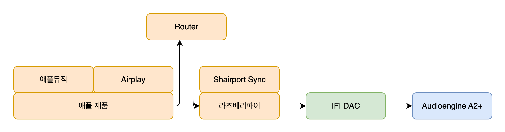

카페에 가면 무엇이 있을까? 맥북으로 열심히 코드 치는 개발자, 고소한 커피 향, 달콤한 디저트, 그리고 공간을 채우는 음악. 나는 노랫소리가 인상적이면 스피커를 둘러보는 습관이 있다.

신식 건물의 카페는 건물 내장 스피커에서 음악이 흘러나오는 경우가 많다. 하지만 오래된 건물이거나 감성을 앞세운 카페는 별도의 스피커를 사용하는 경우가 많다. 흔히 마샬이나 제네바 같은 블루투스 스피커들이다.


감성적인 외관과 그럭저럭 괜찮은 소리. 하지만 진지한 음악 감상을 취미로 삼는 사람들에겐 부족하다. 특히 블루투스로 실내 음악을 듣는다는 건, 본격적인 취미로 보기 어렵다. 물론 나도 음악 애호가는 아니지만, 궁금해서 좀 파봤다.

### 왜 블루투스는 실내 음악 감상으로 적절하지 않은가? 

음악 애호가에게 있어 감상은 단순히 멜로디나 가사를 듣는 것이 아니다. 음원의 섬세한 디테일까지 듣고자 한다.

현실 세계는 연속적(아날로그)이다. 디지털이란 것은 1과 0으로 이루어져있다. 소리라는 자연 현상이 디지털 데이터가 된다는 것은 본질적으로 손실이 생긴다는 의미다. 그렇게 손실된 음원을 다시 블루투스로 보낸다는 것은, 블루투스로 만드는 규격에 맞춰 데이터를 한번 더 손실시킨다는 의미다.

그렇기에 어차피 잘 들리지도 않을 환경에서 편함을 위해 블루투스를 사용하는 것과 달리, 조용한 실내에서 정밀한 감상을 원한다면 블루투스는 부적합하다.

그럼 어떻게 해야 본격적인 음악 감상 취미를 즐길까? 이 글은 두 파트로 구성된다.

- 기본적인 음악 감상 시스템 구성 설명
- 구성한 Airplay 네트워크 플레이어 제작 과정

나는 전공자도 아니고 오디오 전문가도 아니지만, 나름대로 정리해봤다.

---

## 1. 음악 감상을 위한 구성 요소

좋은 음악 감상은 소스 기기부터 소리 출력단까지 **유선**으로 연결되야 한다. 기본 구성은 다음과 같다.


- **소스기기**(Source): 음원 데이터를 디지털 신호로 제공하는 기기를 의미한다. 비트 레이트라던가 하는 샘플링에 따라, 또 포멧에 따라 음질이 달라지는데, 할 이야기가 많아서 이 부분은 이야기하지 않겠다.
- **DAC**(Digital to Analog Converter): 디지털 신호를 아날로그 신호로 변환해주는 역할을 한다. DAC에 따라 아날로그 신호도 다르다. 컴퓨터의 3.5 단자를 통해 소리를 듣게되면 노이즈가 심하다. 컴퓨터 내부는 온갖 전파 흐름으로 가득차 있다. 컴퓨터 내부에는 사운드카드가 있는데, 이것이 DAC의 역할을 한다. 이 사운드카드에 적절한 전파 차폐가 없다면, 노이즈가 생기는 것이다. 때문에 USB 등으로 디지털 신호를 외부로 꺼내어 아날로그 신호로 변환하는 외장 DAC를 사용하기도 한다.
- **프리앰프**(PreAmplifier): 앰프(Amplifier)는 신호를 증폭시키는 역할을 한다. 그럼 볼륨 조절은 어디서 할까? DAC로부터 전달되는 작은 아날로그 신호를 스피커를 울릴 정도의 신호로 바꾸기 전에 한다. 그 역할을 프리앰프가 하게 된다. 그래서 "**Pre**" 앰프다. 그리고 이런 작은 신호를 **라인 레벨** 신호라고 한다.
- **파워앰프**(PowerAmplifier): 앰프의 본질적인 역할은 전기 신호를 **스피커 움직일 수 있을 만큼** 증폭하는 것이다. 파워 앰프야 말로 진정한 앰프다. 라인 레벨의 전기 신호를 증폭하여 스피커를 진동시킬 정도로 만들어준다.
- **스피커**: 아날로그 전기신호를 소리(공기의 진동)로 바꾸는 장치로, 일종의 트랜스듀서(에너지를 한 형태에서 다른 형태로 변환하는 장치)이다. 그러니 얼마나 잘 진동시킬 수 있느냐에 따라 좋은 스피커가 되겠다.

블루투스 스피커의 내부에는 블루투스 신호를 받는 소스기기 부분이 있다. 그리고 이를 아날로그 신호로 바뀌주는 DAC, 아날로그 볼륨을 제공하는 프리앰프, 스피커를 울릴 정도로 전류를 증폭하는 파워앰프가 모두 내장되어있다. 블루투스 스피커는 이 모든 것을 하나의 기기에 통합한 형태다. 그래서 간편하지만 품질은 타협된다.

같은 노래를 들어도 스피커마다 다르게 들리는 이유는 두 가지다.

- 스피커가 아날로그 전기 신호를 공기 중에 진동시킨다.
- DAC, 프리앰프, 파워앰프가 디지털 신호를 적절한 아날로그 신호로 변환 및 증폭한다.

스피커는 클 수록 느린 떨림인 저음을 잘 내어주고, 자연스러운 소리를 낸다. 대신 그만큼 큰 전력의 전기 신호를 필요로 한다. 한편 DAC와 앰프단은 디지털 데이터를 어떤 아날로그 신호로 내어줄지 결정하기 때문에, 음의 톤을 결정짓는다. 때문에 DAC와 앰프단, 스피커는 그 매칭 또한 중요하다.


## 2. 내 Airplay 네트워크 플레이어 구성

다음과 같은 순서로 이야기 해보려고 한다.

1. 하드웨어 구성
2. 라즈베리파이 OS
3. Shairport Sync



## 1. 하드웨어 구성

내 하드웨어 구성이 음악 감상 취미에서 본격적이진 않다. 입문자 수준에 못 미친다고 해야할 것이다.


#### 스피커

내가 쓰는 스피커는 두개다. 둘다 오디오엔진의 것으로 A2+와 S8이다.

먼저 오디오엔진 A2+다. 액티브 스피커이고 2.0채널 북쉘프이다. (21년도 당시에 쿠팡에서 20만원대에 샀다. 지금은 30 후반 ㄷㄷ) A2의 2는 하단 스피커 지름의 크기 2인치를 뜻하는 것 같다. 북쉘프라는 것은 책장에 넣을 수 있는 크기의 스피커를 의미한다. 스테레오로, 두 통이 세트다. 스피커가 위 아래로 두개인 것을 볼 수 있는데, 위는 트위터로 고음의 소리를 내주고, 아래 우퍼는 중 ~ 저음을 낸다. 액티브 스피커라는 것은 앰프가 내장 됐다는 의미다. 블루투스 기능도 있으나, 쓰지 않는다.

오디오엔진 S8은 8인치 크기의 서브우퍼다. 스피커가 아래를 보고 있다. A2+에는 서브우퍼를 위한 3.5단자가 있다. 이를 통해 S8로 라인 레벨 신호를 보내는 것으로 보인다. S8은 A2+가 미처 내주지 못하는 저음을 내준다. S8이 내주는 저음은 공기가 떨리는게 눈에 보이는 것 마냥 울린다. 개인적으로 이 진동이 너무 좋다.

#### DAC

IFI Zen Air DAC를 사용하고 있다. 본래 IFI는 고가의 음향 기기를 판매하는 회사인데, 입문자용 DAC와 앰프를 팔기 시작했고, 그것이 Zen 시리즈라고 한다. Zen Air는 거기서 더 기능을 빼고 가성비 좋게 만든 시리즈다. Zen DAC를 선택한 이유가 있다. IFI는 DAC를 만들때 버브라운이라는 칩을 사용한다. 디지털 신호를 아날로그 신호로 바꿀 때 여러 방식이 존재하는데, 그 방식마다 사용되는 칩도 다르다. 버브라운 칩을 이용해 만든 IFI의 DAC로 만들어진 아날로그 신호는 아주 맛있다. 음의 착색이 꽤 있는데, 내 취향이다. 가성비에 펀 사운드.

#### 소스

블루투스는 편하다. 하지만 손실이다. 그렇다면, 편하면서도 손실이 아닌 방법은 없을까? 핸드폰으로 재생하면서도 손실이 아닌 방법. 애플을 Airplay라는 프로토콜을 제공한다. 이 Airplay는 2.4GHz로 전달된다. (Wifi와 같다.) Airplay는 디지털 데이터의 손실 없는 전달을 지원한다.

이런 기능을 제공하는 기기를 네트워크 플레이어라고 한다. 그런데 네트워크 기능만 제공해주는 기기는 거의 없다. 보통은 DAC와 앰프에 붙어 있거나 하는데, 가격은 최소 50만원이다. 비싼 것도 문제지만, 나는 IFI DAC에서 나오는 버브라운 향이 너무 좋았다. 유선으로 IFI DAC를 맥북에 연결하고 Airplay로 핸드폰으로 재생할 순 있긴 한데, 이러면 차라리 맥 미니 하나 더 사서 구성하지. 근데 그럼 기껏 가성비로 IFI 버브라운 맛을 보려는 의도에서 완전히 벗어난다.

고민하던 중 Shairport-sync 라는 것을 깃헙에서 발견했다. 오호라, 결국 네트워크 기기는 컴퓨터잖아? 라즈베리파이랑 Shairport-sync를 쓰면 되겠군. 학교 다닐 때 소임을 다하고 굴러다니던 라즈베리파이4를 찾았다.

### 2. 라즈베리파이 OS

라즈베리파이 OS 설치하는 방법은 인터넷에 너무 많다. 그런고로 생략한다. 이 섹션은 네트워크 플레이어로써 라즈베리 파이가 OS 단에서 필요한 환경 구성에 대해 설명한다.

일단 Airplay가 되기 위해서는 같은 공유기(Router) 아래 있는 네트워크여야 한다. Wifi든 유선 연결이든 같은 네트워크면 된다. 먼저 세팅을 위해 맥북(클라이언트)에서 SSH로 접근해야하니, 라즈베리파이의 ssh를 오픈하자.

```shell
sudo raspi-config
```

그리고 뜨는 화면에서 `3 Interface Options → P2 SSH → Enable` 순으로 진행하면 된다. 이제 맥북에서 SSH로 접근하자. 맥북은 같은 네트워크 아래 있어야 한다.

```shell
ssh pi@raspberrypi.local
```

pi는 기본 사용자 명이다. 기본 사용자 명이 pi가 아니면 대신 그것을 쓰면 된다.

```shell
ssh [사용자명]@raspberrypi.local
```

raspberrypi.local로 안되면, 호스트 ip를 쓰면 된다.

```shell
ssh [사용자명]@[ip]
```

정상적으로 연결되면 비밀번호를 물어본다.

#### 방화벽

라즈베리파이 OS는 ufw를 사용하는 것이 간편할 것이다. (방화벽 설치않으면 이 파트는 넘겨도 된다.) Shairport Sync를 위한 포트들을 열어야 한다. 설치부터 차근차근 해보자.

```shell
# 설치
sudo apt install ufw

# 방화벽 확인
sudo ufw status

# SSH 열기
sudo ufw allow 22

# 방화벽 활성화
sudo ufw enable
```

참고로 방화벽 비활성화와 특정 포트를 차단하거나 규칙을 삭제하는 방법도 알아두자.

```shell
# 방화벽 비활성화
sudo ufw disable

# 특정 포트 차단
sudo ufw deny 8080

# 모든 포트 넘버링 확인 및 삭제
sudo ufw status numbered
[ 1] 22                         ALLOW IN    Anywhere
[ 2] 80                         ALLOW IN    Anywhere
[ 3] 8080                       DENY IN     Anywhere

sudo ufw delete 3   # 위 출력 기준
```

#### USB DAC

이제 DAC를 라즈베리 파이에 연결한다. 먼저 USB 마운트를 확인하자.

```shell
lsusb
```

USB에서 확인 했다면, ALSA(Advanced Linux Sound Architecture) 플레이에 연결된 디바이스 확인한다.

```shell
aplay -l
```

여러 card 항목중에 `card 3: Audio [iFi (by AMR) HD USB Audio], device 0: USB Audio [USB Audio]` 가 있었다.

정상적으로 DAC를 통해 소리가 나오는지 확인해보자.

```shell
# card 3에 device 0이므로 plughw:3,0을 사용했다.
aplay -D plughw:3,0 /usr/share/sounds/alsa/Front_Center.wav
```

보통 Front_Center.wav 파일이 있으므로 USB DAC와 스피커가 정상적으로 연결되어있으면 소리가 들릴 것이다. 안들린다면, 스피커와 USB DAC의 정상 작동을 먼저 확인하자.

## 3. Shairport Sync

이제 마지막으로 앱을 실행할 때다. [Shairport Sync](https://github.com/mikebrady/shairport-sync)는 Airplay 프로토콜을 통해 음원을 받아 재생해주는 오픈소스 애플리케이션이다.

### 설치 및 설정

먼저 설치한다.

```shell
sudo apt install shairport-sync
```

Shairport-sync는 Airplay를 이용하기 위해 사용하는 포트가 있다. 방화벽을 사용한다면 5353/udp, 5000/tcp, 6001:6003/udp를 각각 열어야 한다.

```shell
# mDNS로 Apple Bonjour 서비스(zeroconf)를 통해 기기 검색에 사용됨
sudo ufw allow 5353/udp
# 제어 및 세션 핸들링용
sudo ufw allow 5000/tcp
# 오디오가 들어오는 포트
sudo ufw allow 6001:6003/udp
```

6001 부터 6003 포트의 역할은 오디오가 들어오는 포트로써 각각 `control_port=6001`, `timing_port=6002`, `audio_port=6003`의 역할을 맡는다.

추가 설정을 해주도록 하자. Shairport-sync가 AirPlay에 보여줄 이름 뿐만 아니라, 소리를 출력할 디바이스에 대한 설정을 명시해줘야 한다.

```shell
sudo nano /etc/shairport-sync.conf
```

```shell
general = {
  name = "원하는 AirPlay 이름";  // AirPlay에서 보일 이름
  interpolation = "soxr";  // 고급 resampling (선택)
  output_backend = "alsa";  // ALSA 백엔드 사용
};
alsa =
{
  output_device = "plughw:3,0";  // ALSA 디바이스 명시
  mixer_control_name = "none";  // 혹은 iFi DAC이 가진 mixer 이름 (없으면 none)
};
```

`mixer_control`에 `none`을 주었다. IFI Zen Air DAC는 고정된 노브를 통해 조절되는 아날로그 볼륨을 갖고 있다. 가성비 모델이라 노브가 디지털 신호에 의해 조정되지는 않거니와, DAC를 컨트롤할 것을 주지 않는다. 때문에 `none` 설정값을 주었다.

볼륨에는 디지털 볼륨과 아날로그 볼륨 두 가지가 있다. 아날로그 볼륨은 프리 앰프가 조절하는 아날로그 신호의 크기 증폭 정도를 의미한다. 디지털 볼륨이란 디지털 신호에서의 볼륨 크기를 의미한다. 디지털 볼륨이 줄어들면 소스의 손실이 생긴다. 때문에 Bluetooth 스피커나 액티브 스피커도, DAC 앰프 일체형 기기에서도 고급 기종일수록 내부에 아날로그 볼륨으로 설계 되어있다. (심지어 어떤 DAC는 소스기기에서 볼륨 크기를 변경시, 디지털 볼륨을 변경하지 못하게 막고, 아날로그 볼륨이 변경 되도록 설계되어있기도 하다.)

### 실행

```shell
# shairport sync 실행 (백그라운드)
shairport-sync -d
```

### 문제 해결

문제가 생겼다면 다음을 통해 실행해서 출력되는 로그를 읽어보자.

```shell
shairport-sync -vv
```

### 샘플레이트 확인

shairport-sync가 아닌 ALSA를 통해 확인할 수 있다. (`비트레이트 = 샘플레이트 × 비트 깊이 × 채널 수`)

```shell
# 현재 ALSA 디바이스 정보 확인
cat /proc/asound/card*/stream0

# `aplay`를 이용한 지원 포맷 확인
aplay -D plughw:3,0 --dump-hw-params /dev/zero

# ALSA 디바이스 실시간 모니터링 (전송 확인) `cat /proc/asound/cardX/pcm0p/sub0/hw_params`
cat /proc/asound/card3/pcm0p/sub0/hw_params
```

---

지금도 이 구성을 통해 Mr. Green Apple의 ‘Coffee’를 들으며 글을 마무리 중이다. 블루투스가 제공할 수 없는 밀도감, 그러면서도 아이폰으로 간편히 조작하는 이 만족감은 직접 구성한 시스템 덕분이다.

> 음악이 없는 삶은 잘못된 삶이며, 피곤한 삶이며, 유배당한 삶이기도 하다.   
> - 우상의 황혼 (프리드리히 니체, 1889)

