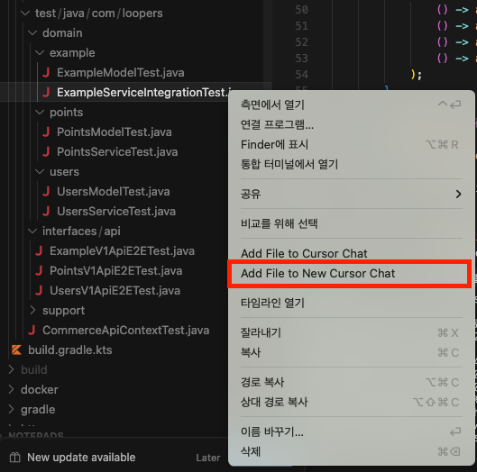
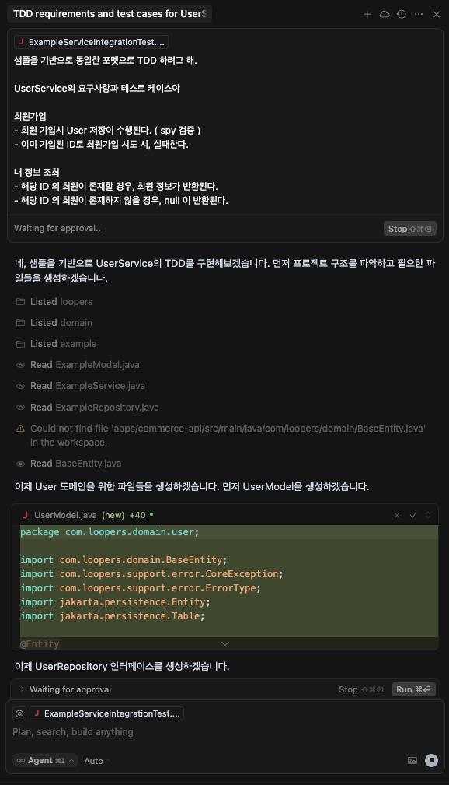
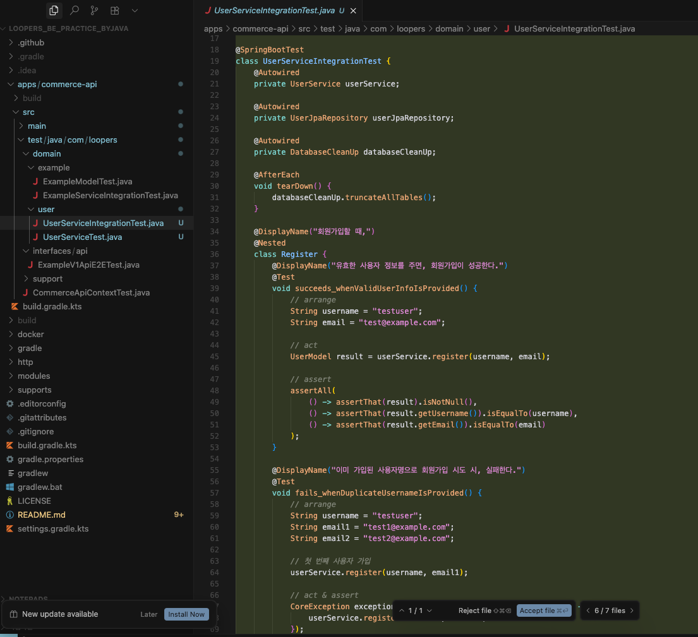
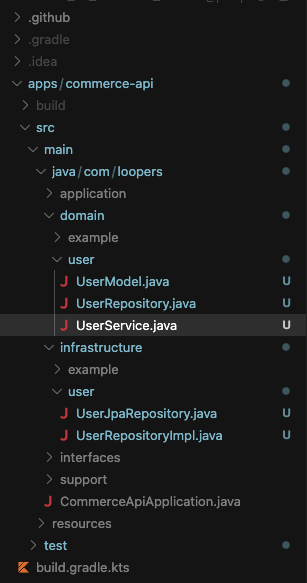

어떤 분이 쓰신 글을 읽었는데, “**시간이 부족해서 테스트 코드 짤 시간이 없어요**”는 이제 변명이 되지 못한다는 것이다. AI의 도입이, '**딸깍**'으로 테스트 코드를 작성해주기 때문이다.

애플리케이션 코드를 AI에 의존해 전적으로 작성하는 건 여전히 불안하다. 비즈니스 로직과 직결되기 때문이다. 하지만 테스트는 비교적 부담이 적다. 결정적인 장애로 이어지지 않고, 설령 품질이 낮더라도 나중에 참고하여 새로 작성할 수 있기 때문이다. 물론 지나치게 의존성이 많고 유지보수가 어려운 '나쁜 테스트'는 피해야 하지만, **테스트는 없는 것보다, 못생긴게 훨씬 낫다**.

> 내게 **레거시 코드란, 단순히 테스트 루틴이 없는 코드**다.    
> 테스트 루틴이 없는 코드는 나쁜 코드다. 코드가 얼마나 훌륭하게 작성돼 있는지 여부와는 상관없다. **아무리 깔끔하고 객체 지향적이며 캡슐화가 잘돼 있어도 소용없다.** 테스트 루틴이 있으면, 코드의 동작을 빠르게 검증하며 수정할 수 있다. 테스트 루틴이 없으면 우리가 작성하고 있는 코드가 좋아지고 있는지, 나빠지고 있는지 제대로 알 수 없다. - Working Effectively with Legacy Code (Feathers, 2004)

테스트 코드가 TDD로만 이루어진 것은 아니다. 테스트 코드의 본질적인 목적은 **회귀 방지**와 **인수**다. 이에 대해서는 개략적으로 [이전 글](https://iol-lshh.github.io/회고/test/테스트_정리/)에서 정리했으므로 넘어간다.

어쨌든, 이번에 루퍼스라는 과정에서 TDD 파트를 공부하게 되었다. 그러면서 바이브 코딩을 통해 TDD 빠르게 작성하는 프로세스를 갖춰보고자 하는 포부를 가져봤다. 이번엔 TDD에 대해 간략히 설명하고, 내가 작성한 방식에 대해 이야기해보려고 한다.

---

## TDD 기초

테스트 코드에 대한 논의는 아주 오래전부터 계속되어왔으나, TDD(Test Driven Development, 테스트 주도 개발)가 실무에서 최초로 쓰인 것은 1997년 켄트 벡이 크라이슬러 종합 보상 시스템을 만들면서 등장했다.

당시 켄트 벡은 XP(Extreme Programming, 극한 개발)라는 것을 처음으로 실무에 도입했다. XP는 개발 생산성을 극한으로 올리고자 등장한 개발 방법론들의 모음으로, 소프트업계 애자일의 시초라고 할 수 있다. 이 XP에 포함된 TDD는 **애플리케이션의 기능을 구현하기 전에, 먼저 구현하려는 기능에 대한 테스트 코드를 작성하고, 테스트를 돌려가며 기능을 완성**하는 개발 방법론이다.

레드, 그린, 리팩토링이라는 세 가지 프로세스를 거치는데, 

- **레드**: 구현하려는 기능에 대한 테스트 코드를 작성한다. 이 때 테스트 코드는 실패한다.
- **그린**: 기능을 구현한다. 테스트 코드는 성공한다.
- **리팩토링**: 애플리케이션의 유지보수가 용이하도록 코드 품질을 높인다.

때문에 TDD의 테스트는 블랙 박스와 같다. 어떤 로직이 만들어질지 아직 상상은 안가지만, 요구사항에 맞는 결과를 미리 짜놓고, 구현하기 시작하니 오버 엔지니어링을 막고, 회귀를 방지하는 큰 효과를 가지고 있다.

이런 관점에서 보면, TDD를 이상적으로 적용하려면 **도메인 설계**와 **요구사항 정의**가 선행되어야 한다. 하지만 현실적으로 도메인 설계가 잘 이뤄지는 회사가 어디 있겠는가. 현실적으로 기능 단위의 요구사항을 먼저 정의하고, 그에 맞는 인터페이스로 TDD를 적용하는 것이 실용적이다. 결국 서비스 계층이나 유스케이스 수준에서 TDD를 수행하는 것이 가장 수월하게 느껴진다.

그렇기에 나는 애플리케이션의 기능 로직 단에서 TDD를 수행한다. 이후 나머지 필요한 테스트들(도메인 모델, E2E, 경계 등)을 추가로 작성했다.

---

## 바이브 TDD 프로세스

본 예제는 루퍼스 학습 과정에서 제공되는 템플릿을 이용했다. 이 템플릿은 컨테이너 디비를 이용하기 쉽게 도와준다. 또한 `tearDown()` 함수가 데이터를 전부 비워주도록 하여, 테스트의 독립성을 보장해준다. 컨테이너 디비가 일종의 페이크 객체 역할을 해주므로, 통합 테스트이지만 공유 자원(영속성이나 외부 자원)이 상당히 독립되게 된다.

### RED

이런 도구들을 이용해 빠르게 애플리케이션의 요구사항 기능을 먼저 테스트로 작성한다. 이것이 TDD의 Red다. 하지만 요구사항만 보고 기능의 테스트를 완성시키기가 좀 막막할 수도 있다. 원래 빈 종이에 첫 선을 그리는게 가장 어렵지 않은가. 이럴 때 AI 조수가 있다면 어떨까?

AI 조수한테 테스트를 어떻게 만들어 달라고 하면 좋을까?

1. 원하는 결과물 샘플을 제공한다.
2. 원하는 요구사항을 제공한다.
3. 결과물을 수정한다.

이런 순서에 따라 테스트 코드를 작성하는데 여러 IDE와 여러 AI 툴들이 있겠지만, 나는 커서를 사용하고 있다.

루퍼스 템플릿에는 테스트 예제가 있다. 이 예제를 결과물 샘플로 제공할 것이다. 그 예제를 기반으로 새로운 채팅을 연다.



그렇게 열린 채팅에 요구사항들을 적으면 된다.



그리고 완성된 코드를 살펴본다.



스파이로 만들라고 했는데, 자기 마음대로 spy를 지워버렸다. 이런 부분을 수정하며 테스트를 완성시킨다. 그리곤 서비스 단위 테스트를 하나 더 만들어놓고는 mock을 덕지덕지 바르고는 verify 하고 있다.

그래도 첫 삽은 떴다. 이 결과물을 AI를 통해 고친다면, 꽤 오래 걸릴 것이다. **이후 코드는 직접 수정**하는 것이 효과적이다.

```java
@Nested
@DisplayName("회원가입")
class register {
	@Test
	@DisplayName("회원 가입시 User 저장이 수행된다. ( spy 검증 )")
	void saveUser_whenUserRegisters() {
		var spyUsersRepository = spy(usersRepository);
		UsersService spyUsersService = new UsersService(spyUsersRepository);

		// act
		UsersModel result = spyUsersService.register("testUser",
				Gender.MALE,
				"1993-04-09",
				"test@gmail.com");

		// verify
		verify(spyUsersRepository).existsByLoginId("testUser");
		verify(spyUsersRepository).save(any(UsersModel.class));
		assertNotNull(result);
		assertEquals("testUser", result.getLoginId());
	}

	@Test
	@DisplayName("이미 가입된 ID로 회원가입 시도 시, 실패한다.")
	void failToRegister_whenLoginIdAlreadyExists() {
		// arrange
		usersService.register("testUser",
				Gender.MALE,
				"1993-04-09",
				"test@gmail.com");

		// act
		CoreException exception = assertThrows(CoreException.class, () -> {
			usersService.register("testUser",
					Gender.FEMALE,
					"1993-04-09",
					"test@naver.com");
		});

		// assert
		assertEquals(exception.getErrorType(), ErrorType.CONFLICT);
	}
}
```

최초의 테스트 작성은 완벽하지 않아도 된다. 테스트의 본질은 요구사항에 대한 **인수**와 리팩터링에 대한 **회귀 방지**다. 두 가지 본질을 가장 우선시하며, 읽기 좋도록 있는 힘을 다해 깔끔하게 작성하면 된다. 그리고 점차 요구사항과 도메인이 뚜렷해지면서 결함을 최대한 없앨 수 있게 테스트를 향상시켜야 할 것이다.

이 때에 적절한 테스트 더블을 사용해야 한다. 위 예제에는 다양한 종류의 테스트 더블을 사용하고 있다. 테스트 더블은 [이 곳](https://iol-lshh.github.io/pattern/testdouble/testdouble_정리/)에 정리했었으므로, 여기서는 자세히 이야기하지 않는다.

### Green

아마 AI가 어느정도 테스트를 작성하며 필요한 파일과 클래스들을 미리 작성해두었을 것이다.
이 파일들을 열어보며 하나씩 제대로 구현한다.



테스트는 내가 직접 보고 원하는대로 작성했으니, 테스트를 통과시키는 회귀 방지와 함께 코드를 고친다.

여기서 느낄 수 있는 주의점이 있다. 유스케이스 테스트는 **블랙박스 테스트** 형태를 지향해야 한다는 것. 블랙박스 테스트와 이와 대비되는 화이트박스 테스트에 대한 정의를 위키백과에서 가져왔다.

- [**블랙박스 테스트**](https://en.wikipedia.org/wiki/Black-box_testing): **블랙박스 테스트는 때때로** **사양 기반 테스트** 라고도 하며 애플리케이션의 내부 구조나 작동 방식을 들여다보지 않고 기능을 검사하는 소프트웨어 테스트 방법
- [**화이트박스 테스트**](https://en.wikipedia.org/wiki/White-box_testing): **화이트박스 테스트 (** **클리어 박스 테스트** , **글래스 박스 테스트** , **투명 박스 테스트** , **구조 테스트** 라고도 함)는 애플리케이션의 기능이 아닌 내부 구조나 작동 방식을 테스트하는 소프트웨어 테스트 방법

**화이트박스 테스트**는 일반적으로 블랙박스 테스트에 비해 회귀 방지에 좋지만, 리팩터링 내성에 취약하며, **블랙박스 테스트**는 이와 반대다. TDD의 목적은 **변화**에 적응하며 요구사항을 빠르고 적절하게 **구현**하는 것이다. 내부가 어떻게 변할지 모른다. 최대한 블랙박스 테스트를 지향하여 작성해야 한다.

--- 

## 유스케이스 TDD 이후

### 도메인 테스트

도메인 모델로 가는 것은 리펙토링에 해당한다고 생각한다. 루퍼스 과제는 요구사항이 기능 구현과 도메인 모델에서 필요한 것이 관심사에 따라 명확하게 제공된다. 하지만 현실세계에서는 요구사항을 줄 때 관심사가 구분되지 않는다.

때문에 이를 반영해서 유스케이스에 대한 블랙박스 테스트 + 통합 테스트로 우선 작성하고, 이후 도메인 모델과 도메인 테스트를 작성했다.

도메인 테스트 작성에는 모든 공유 자원들을 떼어내는 단위 테스트로써 작성했다. (사실 도메인 모델에서는 공유자원이 쓰이지도 않았다.)

### E2E 테스트

유스케이스와 도메인 테스트까지 모두 완성했다는 것은 애플리케이션이 완성되었음을 의미한다.

이 때, 반드시 추가적으로 필요한 테스트가 있다. 애플리케이션의 사용자가 애플리케이션을 사용하기 위해서는 적절한 인터페이스를 제공해야한다. 인터페이스가 적절하지 않는다면, 아무리 잘 만들어진 애플리케이션이라도 무용지물이다. 때문에 이런 인터페이스들에 대한 테스트를 작성해줘야한다.

그 중 E2E 테스트는 서버 애플리케이션과 인프라 사이에 어디서 문제가 발생하는지 명확하게 보여주는 테스트다. 때문에 모든 기능 구현 후, 마지막으로 작성했다.

---

내 애플리케이션 작업 프로세스는 절대적이지 않다. 테스트를 작성하는 방법은 매우 다양하고, 효율적으로 작성하기 위해 어떤 방법을 선택해야하는지도 많은 이들이 지금도 논쟁을 벌이고 있다.

중요한 것은 애플리케이션에 테스트 코드가 있느냐다. 그래서 이 **테스트 코드가 애플리케이션의 회귀 방지와 인수의 역할을 제공하느냐**다. 그렇다면 충분하다. 이제 어떻게 테스트를 효율적이고 빠르게 작성할 수 있을지 고민할 차례다. 내 방법은 그 고민의 초입지에 있다. 유스케이스 테스트 작성을 가장 우선시하고, 이후 도메인 모델의 세부 사항을 구현. 마지막으로 인터페이스를 비롯한, 외부와의 경계가 정상적으로 작동되는지의 테스트의 작성과 구현.

분명히 더 실용적인 방법도 있을 것이며, 케이스마다 베스트 프렉티스가 다를 수도 있다. 이런 프로세스에 대한 고민과 문제 해결은 무가치하지 않다. 개발 생산성을 향상시킴으로써 비즈니스의 생산성으로 연계된다.

테스트는 정답이 없다. 하지만 방향은 분명하다. 테스트 코드를 작성하고, XP하자!
