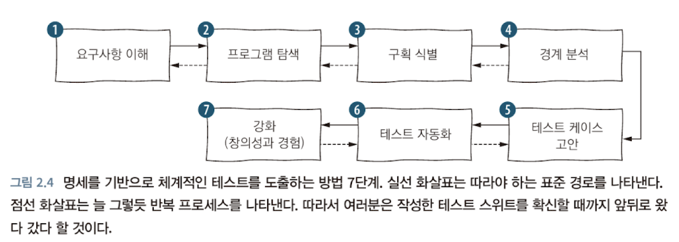
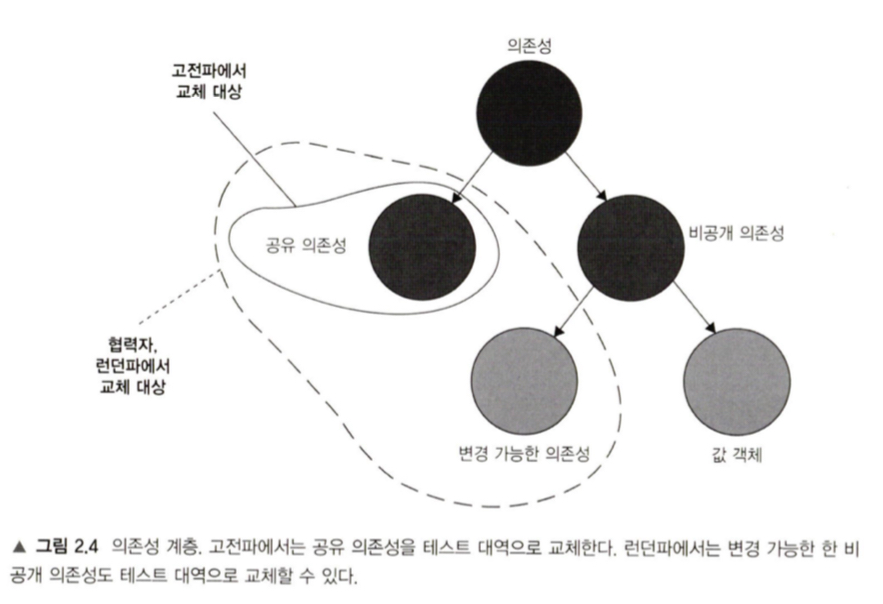

지혜가 압축된 조화롭고 단순한 화두는 아름답다. 천재와 철학자들은 그것을 만들어 우리에게 집어 던진다. 그것을 머리에 맞은 이는 피를 철철 흘리며 중얼거린다. **"맛있다..."** 내가 그렇다는 것은 아니다. 나는 맛있어도 지혈부터 할 것이다. 이런 이야기를 한 이유는 내가 소프트웨어 개발을 시작하며, 소프트웨어 엔지니어링 쪽에 참된 철학자들이 많다고 느꼈다. 책상 앞에서 중얼거리며 자판을 두드리는 모습을 보면 현자가 되지 않을 수 없다고 생각된다. 나의 가장 충격받은 화두 세 가지를 뽑아보면 다음과 같다. 디자인 패턴, 테스트, 애자일이 그것이다.

이 글에서는 세 가지 화두 중 '**테스트**'에 대해서 이야기해보려고 한다. 처음 자동화 테스트를 '**제대로**' 내 손으로 작성했을 때가 생생하게 기억난다. 자바로 된 사이드 프로젝트에서 테스트 코드를 작성해봤다. 애플리케이션 서비스 레이어의 메서드를 테스트하는데, 테스트 코드를 작성해보겠다고 의존성들을 잔뜩 모킹해서 주입하고 테스트를 돌렸다. 테스트는 잘 돌아갔다. 트랜잭션 스크립트 방식의 Fat 서비스를 테스트 했는데, 아주 힘들었다. 밤을 새가며 분기마다 단위테스트를 작성했는데, 메서드 하나에 대해 겨우 완성했다. 테스트 신봉론자들과 TDD는 사기극이라고 생각했다. 어느날, 어떤 멘토분이 TDD 하는 방법을 실시간으로 보여주셨다. 뭔가가 순식간에 지나갔다고 느꼈다. 테스트 관련된 강의를 찾아봤다. 2시간이 조금 넘는 짧고 저렴한 강의였는데, 클린 아키텍처의 의존성 제거와 그런 의존성 제거를 통해 테스트를 쉽게 작성하는 방안에 대한 강의였다. 굉장한 충격을 받았다. 그 후로 나는 크고 작은 프로젝트의 복잡한 로직에 테스트를 작성했다. 하지만 내가 작성한 테스트 패턴에는 설명하기 어려운, 직관적인 불만이 남아 있었다. 원인을 찾아 유명한 책들을 읽어봤다. (켄트벡의 TDD와 XP도 읽었지만, 이 글에서 말하고자 하는 바는 아니라 제외했다.)

- 코리코프, 블라디미르. (2021). _단위 테스트: 생산성과 품질을 위한 단위 테스트 원칙과 패턴_ (임준혁, 역). 에이콘출판사. (원저는 2020년에 출판)​
- 아니시, 마우리시오. (2023). _이펙티브 소프트웨어 테스팅: 사례 중심으로 배우는 실전 소프트웨어 테스트 가이드_ (한용재, 역). 제이펍. (원저는 2022년에 출판)

---

## 테스트의 목적

테스트는 왜 만들까? 소프트웨어에 대해서 알아야 한다. 프로 개발자는 프로그래밍 제품을 만든다. 소프트웨어는 제품으로서 소프트웨어 테스트 기준을 통과해야한다. 이를 인수 테스트라고 한다.

- **인수 테스트**(Acceptance Testing): 제품이 고객 기대에 부응하는지 확인하기 위한 테스트

인수 테스트는 프로젝트의 막바지에 제품의 요구사항이 모두 이루어졌는지, 결함은 없는지 확인하기 위해 이루어진다. 이런 인수 테스트는 제조업으로부터 유래 되었고, 제조업은 체계적이고 신중하게 케이스별 수동 또는 반자동 검사로 이루어진다. 반도체 인수 테스트나 자동차 인수 테스트를 상기한다면, 이것이 얼마나 많은 비용이 드는 작업인지 상상해 볼 수 있다.

**하드**웨어는 제품이 인수 테스트를 거치면, 변화가 없다. 하지만 **소프트**웨어 제품은 굉장히 유연하다. 소프트웨어 제품은 출시 직전까지, 그리고 계약에 따라 출시 이후에도, 현실세계의 변화에 맞춰 바뀌어야 한다. 고객의 요구사항과 시장의 흐름을 반영하여 지속적인 변경이 이루어져야 한다. 때문에 인수 테스트 뿐만 아니라, 회귀 테스트까지 제공되는 것이 옳을 것이다.

- **회귀**(Regression): 이전에 작동했던 기능이 작동을 멈추는 유형의 소프트웨어 버그(결함)
- **회귀 테스트**(Regression Test): 이전에 개발 및 테스트된 소프트웨어가 변경 후에도 예상대로 계속 수행되는지 확인하기 위해 기능적 테스트와 비기능적 테스트를 실행하는 것

테스트 자동화는 인수 테스트와 회귀 테스트에 대한 효율을 위해 앞선 엔지니어들의 고뇌로 발전되어왔다. 테스트 자동화가 세상에 널리 퍼진 것은 켄트벡과 멋진 엔지니어들의 XP와 TDD, 그리고 많은 테스트 기법들을 널리 퍼트리려는 노력이 있었다. 또한 Working_Effectively_with_Legacy_Code(Feathers, 2004) 같은 노력을 통해, [레거시 코드에 테스트 루틴을 적용하는 방법](https://iol-lshh.github.io/%ED%9A%8C%EA%B3%A0/refactoring_legacy/LegacyCode_Refactoring_%EC%A0%95%EB%A6%AC%EC%99%80_%ED%9A%8C%EA%B3%A0/)이 연구되었다.

레거시 코드로부터 테스트 루틴을 적용하고 리팩터링하는 것도 고난스러운 일이지만, 아무것도 없는 백지에 멋진 소프트웨어를 만들어내는 것은 책임감 있는 엔지니어에게 극심한 스트레스를 준다. Software Engineering at Google(Winters 등, 2020)에서 엔지니어라면, 아주 오랫동안 지속가능한 제품을 만드는 것을 지향해야한다고 이야기했다. 어떻게 해야 10년, 100년이 지나도 변화에 유연하며 안정적이고 멋진 **소프트**웨어를 만들어낼까? 그 답안은 여러개로 이루어져있지만, 그 중 하나가 **체계적인 테스트 프로세스**에 있다고 생각한다.

### 개발자를 위한 효율적이고 체계적인 소프트웨어 테스트

다음의 프로세스는 Effective Software Testing(Aniche, 2022)에서 가져왔다.

1. **요구사항**을 받고 분석한다.
2. **TDD**를 이용한 기능 개발을 유도한다. (명세 기반 테스트와 함께 해볼 수 있겠다.)
3. **단위**를 설계한다. 요구사항은 때론 크고 복잡해서, 하나의 메서드나 클래스로 구현 불가능하다. **계약**을 가진 협력하는 객체들을 통해 전체 기능을 구성한다. 이때 테스터블을 항상 고려해야한다.
4. 각 단위를 테스트한다. **도메인 테스트, 경계 테스트, 구조적 테스트**
5. **대규모 테스트**(통합 테스트, 시스템 테스트)가 필요하기도 하다. 도메인 테스트, 경계 테스트, 구조적 테스트 중 필요한 기법을 이용해 소프트웨어 시스템의 큰 부분을 확인한다.
6. **지능형 테스트 도구**를 사용한다. **테스트 케이스 생성, 돌연변이 테스트, 정적 분석**
7. 엄격하고 효율적인 위의 테스트 프로세스를 통해 편안한 마음으로 기능을 배포한다.

아니시는 이 프로세스의 순서에 대해, 워터폴이 아닌 애자일 방식을 이야기한다. TDD를 하다 미진하면, 다시 요구사항 분석을 하라고 한다. 테스트를 통해 소프트웨어와 소통하고 도메인과 소통하라고 한다.

각 단계의 테스트들에 대해서 이야기하기 전에, 어떤 것이 가치있는 테스트인가? 아니시가 말하는 테스트 품질에 대해서 먼저 살펴보자.

### 테스트 품질

QA세계에는 국제 소프트웨어 테스트 자격 위원회(International Software Testing Qualifications Board, ISTQB)가 있다. 거기에는 다음과 같이 테스트에 대한 원칙들 중 눈여겨 봐야할 것들이 있다.

- 완벽한 테스트는 불가능하다.
- 테스트는 그만둘 때가 있다.
- 가변성이 중요하다. (살충제 역설)
- 버그는 많이 발생하는 지점이 있다. (결함 클러스터링)
- 어떤 테스트에도 프로그램은 결코 완벽하거나 충분하지 않다.
- 맥락(context)이 테스트 케이스의 핵심이다.
- 검증(verification)은 유효성 검사(validation)가 아니다. 
  - **검증**: 시스템이 제대로 되어 있는가
  - **검사**: 요구사항을 만족하는가

다음은 테스트 품질에 대해 측정해볼 지표이다. 

- **코드 커버리지**(code coverage): 테스트 스위트가 얼마나 실행하는가 백분율.
  - `코드 커버리지 지표 = 실행 코드 라인 수 / 전체 라인 수`
- **분기 커버리지**(branch coverage)
  - `분기 커버리지 지표 = 통과 분기 / 전체 분기`

다만 커버리지는 가능한 모든 결과를 검증한다고 보증하지는 않는다. 또한 커버리지는 외부 라이브러리의 코드 경로를 고려할 수도 없다. 커버리지 지표는 품질에 대한 목표가 될 수 없다. 

> 병원에 있는 환자를 생각해보자. 체온이 높으면 열이 난다는 것을 의미할 수 있으며, 이는 유용한 관찰이다. 그러나 병원은 환자의 적절한 체온을 목표로 안 된다. 단순히 목표가 되면, 환자 옆에 에어컨을 설치해서 ‘효율적으로’ 빨리 끝낼 수도 있다. 물론 이런 접근은 의미가 없다. (1)

가치있는 테스트란 단순한 지표가 아니라, 다음이 이뤄져야 한다고 볼 수 있다.

- 개발 주기에 통합하기
- 코드베이스의 가장 중요한 부분을 대상으로 하기 (대부분 비즈니스 로직이 있는 부분)
- 최소한의 유지비로 최대한의 가치를 끌어내기

테스트는 없는 것 보단 낫다. 중요한 테스트는 소프트웨어 품질에 결정적인 기여를 한다. 잘못된 테스트는 잘못된 경고와, 회귀 오류 방직에 도움이 되지 않고, 테스트 코드의 유지보수가 어렵고 변화에 적응하기에 느리다. 때문에 고품질 테스트에 집중하는 것이 중요하다. 단순히 테스트가 많은 것은 하나의 기술 부채일 뿐이다.

이를 통해 테스트는 제품에 다음을 제공하도록 지향해야한다.

- 회귀 방지
- 리팩터링 내성
- 빠른 피드백
- 유지 보수성

테스트의 비용은 다음으로 판단되어야 한다.

- 기반 코드를 리팩터링할 때 테스트도 리팩터링한다.
- 각 코드 변경 시 테스트를 실행한다.
- 테스트가 잘못된 경고를 발생시킬 경우 처리되어야 한다.
- 기반 코드의 동작을 이해하기 위해 테스트를 읽는다.

이와 같은 작업 시에, 해당 테스트가 얼마나 비용이 드는지 생각하라. 그것이 그 테스트의 가치이다.

---

본격적으로 각 테스트들에 대해 알아보자. 테스트는 크게 **단위 테스트**와 **통합 테스트**로 나누어 생각해볼 수 있다. 단위 테스트와 통합테스트를 나누는 기준은 무엇일까? 단위 테스트의 정의를 알면 이를 나눠볼 수 있다.

## 단위 테스트

> **단위**를 **격리**해서 **빠르게 수행**하는 자동화된 테스트

해당 문장에서 단위 테스트의 세가지 속성을 알 수 있다.

- 빠르게 수행되어야 한다.
- 작은 코드 조각 단위를 검증한다.
- 격리된 방식으로 처리되어야 한다.

### 1. 빠르게 수행되어야 한다.

> 실행에 0.1초가 걸리는 단위 테스트는 속도가 느린 단위 테스트다. - Working_Effectively_with_Legacy_Code (Feathers, 2004)

단위 테스트는 프로그래밍 작업에 있어서 루틴에서 수시로 실행되어야 한다. 단위 테스트가 느리다는 것은 생산성을 낮춘다는 의미이다. 때문에 단위 테스트는 빠르게 수행되어야한다. 단위테스트가 빠르게 수행 되기 위해서, 그 다음의 두 가지 속성이 논의되게 된다.

### 2. 작은 코드 조각 단위를 검증한다.

작은 코드 조각 단위로 나누는 것은 곧 코드의 단위를 설계하는 작업이다. 이펙티브 소프트웨어 테스팅에서 아니시는 단위 테스트를 다음과 같이 분류한다.

- **도메인 테스트**
- **경계 테스트**
- **구조적 테스트**

이런 분류를 통해 설계된 단위를 입체적으로 테스트한다. 하지만 이를 분류 하기 위해선 단위에 대한 설계가 이루어져야 할 것이다. 때문에 아니시는 명세 기반으로 TDD 기법과 함께 단위에 대한 고민을 하는 것을 소개한다.

- **명세 기반 테스트**(Specification Based Testing): 시스템의 명세를 사용하여 테스트 케이스를 도출하는 **블랙 박스** 테스트 기법이다. 명세는 기능적 또는 비기능적일 수 있으며, 사용자 요구 사항, 시스템 요구 사항, 설계 명세와 같은 다양한 추상화 수준에서 제공될 수 있다.

위를 바탕으로 **도메인**의 애그리거트와 불변식과 그 요소들을 분석하고, **경계**와 영향 흐름을 분석한다. 이런 명세 테스트와 도메인, 경계 테스트 작성 후에는 작성된 코드를 기반으로 **코드 커버리지**와 **분기 커버리지**를 확인할 수 있다. 그 결과 수행되지 않은 부분이 드러나고 이에 대한 테스트 추가 여부를 고민할 수 있다. 이때 작성할 테스트를 **구조 기반 테스트**라고 한다.

- **구조 기반 테스트**(Structure based Testing): **구문(Statement), 조건(Condition), 결정(Decision)** 이 얼마나 확인되었는지 확인하여 테스트 케이스를 도출하는 **화이트 박스** 테스트 기법이다.

(**화이트박스 테스트**는 일반적으로 블랙박스 테스트에 비해 회귀 방지에 좋지만, 리팩터링 내성에 취약하며, **블랙박스 테스트**는 이와 반대다. 코리코브는 **리팩터링 내성은 절대 타협할 수 없다**고 했다. 때문에 화이트박스 대신 블랙박스 테스트가 우선적으로 작성되어야한다고 하였다. 때문에 이와 같은 순서로 테스트 케이스를 고려하는 것은 효과적이다.)

### 3. 격리된 방식으로 처리되어야 한다.

격리란, **의존성을 설계한 단위로부터 분리하는 작업**이다. 객체 그래프(Object graph) 또는 영향 흐름도로 부터 단위를 격리하여 테스트가 필요하다. 이때, 격리에 대한 방법은 두 가지로 나뉜다.

- **런던파**(Mockist, London): 테스트 대상 단위를 협력자(collaborator)에서 격리한다
- **고전파**(Classicist, Detroit): 공유 의존성이 아니라면 격리하지 않는다

#### 런던파(Mockist, London)

런던 스타일은 **목 추종자**라고도 표현된다. 왜 목 추종자라고 하는걸까? 이 격리 방식은 **테스트 대상 단위를 협력자(collaborator)에서 격리해야 한다**고 한다. 즉 단위가 외부에 의존할 때, 이 **모든 의존성을 테스트 대역(test double)로 대체**하는 것이다. 이 방식은 테스트 단위에 대한 정확한 실패 여부에 따른 시스템의 회귀를 발견해주며, 객체 그래프(Object Graph)를 직접적인 의존성 여부나 순환 의존성과 관계없이 온전히 격리가 가능하다.

(다만 이 방식은 **구현이 테스트에 의존성을 갖게 된다**는 비판이 있다. **테스트가 단위를 테스트하는 것이 아니라 목을 테스트한다는 것**이다. 또한 실제 객체와 연결되지 않기 때문에, **실제 객체의 관계에 의한 오류를 검출해내지 못할 수 있다**. 적절한 단위 설계가 필요하다.)

#### 고전파(Classicist, Detroit)

**코드를 격리하지 않는다. 단위 테스트를 격리한다**. 여러 클래스가 모두 메모리에 상주하고 **공유 상태에 도달하지 않는 한, 여러 클래스를 한 번에 테스트한다.** 이 방식은 테스트를 어떤 순서(병렬이나 순차 등)로 실행하든 가장 적합한 방식(객체간 관계를 포함하여)으로 실행될 수 있으며 테스트가 서로 결과에 영향을 미치지 않게 한다.

- **공유 의존성**(shared dependency): 테스트 간에 공유되고 서로의 결과에 영향을 미칠 수 있는 수단을 제공하는 의존성이다. 정적 가변 필드(static mutable field)나, 데이터베이스와 파일시스템 같은 프로세스 외부 의존성이 여기에 포함된다.
- **비공개 의존성**(private dependency): 테스트 간에 공유되지 않는 의존성이다.
- **프로세스 외부 의존성**(out-of-process dependency): 애플리케이션 실행 프로세스 외부에서 실행되는 의존성이며, 메모리에 없는 데이터에 대한 프록시(proxy)이다. 대부분 공유 의존성에 해당하지만, 모두 그런 것은 아니다.
- **휘발성 의존성**(volatile dependency): 개발자 머신에 기본 설치된 환경 외에 런타임 환경의 설정 및 구성을 요구하거나, 비결정적 동작(nondeterministic behavior)을 포함하는 의존성이다.

두 격리 방식에 대해 살펴봤다. 고민해볼 것은, 두 방식 중 하나만을 굳이 고집할 필요가 있는가다. **런던파 방식은 입자성(granularity)이 세밀(fine)하다.** 하나의 동작을 정확하게 파악하기 좋다. 고전파는 코드의 품질을 높여주는데 강제적이며(**단위 테스트할 수 없다는 것은 설계에 문제가 있다는 강한 징후다**) TDD와 결이 맞으며, 그 결과로 테스트 하네스의 유지 보수성과 리팩터링 내성을 높여준다. 또한 접근 방식에 있어 런던파는 **과잉 명세**가 될 우려가 있으며, 테스트는 코드 단위가 아닌 동작 단위로 검증되어야 하는 논점에서 벗어날 우려가 크다. **런던파의 테스트는 버그가 발생하는 부분을 정확히 알려주지만, 그 부분이 버그의 원인이 아닐 수 있다.** 때문에 테스트 격리에 대해 세밀한 고려가 필요하다.

---

시스템에 대한 테스트는 외부 의존성과의 관계 또한 정상적으로 작동되는지 테스트되어야 한다. 이제 통합 테스트에 대해 이야기해보자. 먼저, 통합테스트의 범위에 대해 정의하겠다. 통합 테스트는 런던파와 고전파에 따라 통합테스트의 정의가 달라진다. 코리코프는 고전파의 통합테스트에 대해 이야기하며, 통합테스트와 E2E 테스트를 분리했다. 나는 이 글에서 아니시가 이펙티브 소프트웨어 테스트에서 정리한 분류에 따라 단위 테스트, 통합 테스트, 시스템 테스트, 수동 테스트로 분류했다. 아니시는 고전파 테스트 피라미드와 '구글 엔지니어는 이렇게 일한다'(Winters etc, 2020)의 아이디어를 바탕으로 테스트 피라미드를 구성하고 통합 테스트(대규모 테스트)에 대해 이야기한다.

## 통합 테스트

> 테스트 대상 코드가 시스템의 경계를 넘어 외부 요소 간의 통합을 테스트

통합 테스트의 목적은 시스템의 여러 구성요소를 함께 테스트하는 것이다. 시스템 전체를 테스트하는 대신 **구성요소들의 상호작용**에 초점을 맞춘다.

### 시스템 테스트

> 시스템이 **내부에서 어떻게 동작하는지 관심 없다.** **입력을 주면 원하는 출력이 나오는지**에만 관심을 갖는다.

소프트웨어를 더 실질적인 관점에서 바라보고 더 현실적인 테스트를 수행하려면 시스템이 가진 모든 데이터베이스, 프런트 엔드 앱 및 기타 구성요소를 포함한 전체 소프트웨어 시스템을 실행해야 한다. 시스템의 작은 부분을 격리해서 테스트하지 않고, 시스템 전체를 테스트한다. 시스템 테스트는 **현실적**이다. 다만 불안정한 경향이 있다.

정리해보자. **단위 테스트**는 소프트웨어 시스템의 알고리즘과 단일 비즈니스 로직 단위를 테스트한다. 대부분 엔터프라이즈 비즈니스 시스템은 데이터를 변환하는 데 사용하는데, 비즈니스 로직은 대개 외부 서비스에 의존하지 않기 때문에 단위 테스트로 쉽게 테스트하고 완전히 제어할 수 있다. **비즈니스 규칙과 인프라스트럭처 코드를 명확하게 구분**하고, 단위 테스트는 비즈니스 규칙에 대해 테스트해야하며, 통합 테스트는 두가지를 통합한 코드를 테스트해야 할 것이다. 시스템 테스트는 비용이 많이 든다.(작성하기 어렵고 실행 속도가 느리다.) 때문에 버그가 발생하면 시스템에 위험한, 절대적으로 중요한 부분을 시스템 테스트 수행하도록 한다.

---

**살충제 역설. 단 하나의 기법으로는 모든 버그를 식별하지 못한다.** 고품질 소프트웨어를 제공하고자 하는 엔지니어는 체계적인 테스트 프로세스를 갖출 필요가 있다. 다만 이 애자일이 그렇듯 테스트 체계는 유연하게 작동되어야 한다. 테스트 체계의 프레임에 갇혀 버린다면, 테스트의 진정한 목표를 잃고 말 것이다. 다만 체계적인 프로세스를 정립한뒤, 진정한 의도를 알고 유연하게 다룰줄 안다면, 테스트의 진정한 목표인 고품질 소프트웨어 제공은 나의 큰 무기가 되어줄 것이다.

> 테스트가 있는 코드는 좋은 코드가 아닐 수 도 있다. 테스트가 없는 코드는 나쁜 코드다. 그것이 얼마나 객체지향적이고 캡슐화가 잘 되어있던 간에 말이다. - Clean Code (로버트 C. 마틴, 2008)
