클린 아키텍처. 개발자가 된 초창기에 난 이 책을 읽고 온전히 이해하지 못했다. 아직도 많이 부족하지만, 다양한 경험을 겪고, 많은 책들을 읽고, 공부했다. [애자일과 Extreme Programming](https://iol-lshh.github.io/%ED%9A%8C%EA%B3%A0/agile/Agile_%ED%9A%8C%EA%B3%A0/), [도메인 주도 설계](https://iol-lshh.github.io/%ED%9A%8C%EA%B3%A0/ddd/DDD_%EC%A0%95%EB%A6%AC/), [앤터프라이즈 애플리케이션 아키텍처 패턴](https://iol-lshh.github.io/%ED%9A%8C%EA%B3%A0/EAA/EAA_%EC%A0%95%EB%A6%AC/), [리펙토링](https://iol-lshh.github.io/%ED%9A%8C%EA%B3%A0/refactoring_legacy/LegacyCode_Refactoring_%EC%A0%95%EB%A6%AC%EC%99%80_%ED%9A%8C%EA%B3%A0/), [테스트](https://iol-lshh.github.io/%ED%9A%8C%EA%B3%A0/test/%ED%85%8C%EC%8A%A4%ED%8A%B8_%EC%A0%95%EB%A6%AC/) 등의 주제들에 대해 지속적으로 관심을 갖고 있다. 그리고 다시 클린아키텍처를 이해하기 위해 돌아왔다. 내가 다시 읽어본 클린아키텍처를 통해, 무엇이 중요하다고 느꼈고, 무엇을 이해했는지 서술해보겠다.

---

클린 아키텍처는 소프트웨어의 정의로부터 시작한다.

> '소프트웨어'라는 단어는 '부드러운soft'과 '제품ware'이라는 단어의 합성어다. ...(중략)... 소프트웨어는 '부드러움을 지니도록' 만들어졌다. 소프트웨어를 만든 이유는 기계의 행위를 쉽게 변경할 수 있도록 하기 위해서다. 만약 기계의 행위를 바꾸는 일을 어렵게 만들고자 했다면, 우리는 소프트웨어가 아니라 하드웨어라고 불렀을 것이다. ...(중략)... 이해관계자가 기능에 대한 생각을 바꾸면, 이러한 변경사항을 간단하고 쉽게 적용할 수 있어야 한다. 이러한 **변경사항을 적용하는 데 드는 어려움은 변경되는 범위scope에 비례해야 하며, 변경사항의 형태shape와는 관련이 없어야 한다.** (1)

소프트웨어가 변화에 유연하도록 깨끗한 아키텍처를 만드는 것이 클린 아키텍처의 본질이다. 책에서는 다음 순서로 상향식 접근을 통해 클린 아키텍처로 나아간다.

- 프로그래밍 패러다임 - 클린 코드 규약
- SOLID - 클린 객체 원칙
- 컴포넌트 - 클린 아키텍처를 이루는 구성 요소
- 아키텍처

---

클린 아키텍처는 클린 코드로부터 시작되고, 클린 코드는 프로그래밍 패러다임을 갖는다. 

## 프로그래밍 패러다임

프로그래밍 패러다임에는 다음 세가지가 있다.

- 구조적 프로그래밍
- 객체 지향 프로그래밍
- 함수형 프로그래밍

### 구조적 프로그래밍(Structured)

**순차**sequence, **분기**selection, **반복**iteration만을 이용한 루틴을 이용한 프로그래밍 방법이다. 제어흐름의 **직접적인 전환**에 대한 규칙을 부과한다고 볼 수 있다. 구조적 프로그래밍은 수학적 증명(Mathematical Proof)이 아닌, 과학적 방법(Scientific Method)을 가능하게 하여 프로그램의 가치를 보장한다.

### 객체 지향 프로그래밍(Object Oriented)

함수 호출 스택 프레임을 힙으로 옮기고 **참조**indirection하면서, **클래스-객체 구조**가 만들어지는 것을 발견되었다. (Norwegian Computing Center, Johan Dahl & Kristen Nygrad, 1966) (이후 앨런 케이가 스몰토크라는 순수 객체 지향 언어를 만들면서 객체 지향 프로그래밍을 정립했다.) 제어흐름의 **간접적인 전환**에 대한 규칙을 부과한다고 볼 수 있다. **캡슐화**encapsulation, **상속**inheritance, **다형성**polymorphism을 중요하게 생각한다.

### 함수형 프로그래밍(Functional): 

람다방식으로, 루틴의 **할당문**에 규칙을 부과한다고 볼 수 있다. 불변성을 가져야 한다.

엉클 밥은 세 가지 패러다임에 의해 코드가 제약적으로 프로그래밍 되어야 깔끔한 코드가 이뤄진다고 봤다. 1946년 앨런 튜링 이후 소프트웨어 규칙은 전혀 바뀌지 않았으며, 결국 모든 프로그램은 결국 순차, 분기, 반복, 참조로 구성된다고 봤다.

---

 또한 엉클 밥과 마이클 페더스는 SOLID라는 단어로 클린 아키텍처를 위한 큰 원칙의 틀을 정리한다.

## SOLID

**함수와 데이터 구조를 클래스로 배치**하고, **클래스를 서로 결합**하는 방법에 대한 설명이다. 엉클 밥은 클래스를 단순히 객체지향의 용어가 아니라, 함수와 데이터를 결합한 집합을 의미한다고 했다.

- 단일 책임 원칙 (Single Responsibility Principle, SRP)
- 개방-폐쇄 원칙 (Open-Closed Principle, OCP)
- 리스코프 치환 원칙 (Liscov Substitution Principle, LSP)
- 인터페이스 분리 원칙 (Interface Segregation Principle, ISP)
- 의존성 역전 원칙 (Dependency Inversion Principle, DIP)
 

### 단일 책임 원칙 (Single Responsibility Principle, SRP)

> 조직이 설계하는 시스템 구조는 조직의 커뮤니케이션 구조를 반영한다 - 콘웨이 법칙(Conway's law)

소프트웨어 시스템이 가질 수 있는 최적의 구조는 시스템을 만드는 조직의 사회적 구조에 커다란 영향을 받는다. 하나의 조직은 하나의 소프트웨어 모듈을 책임지며, 각각 **하나의 소프트웨어 모듈의 변경 이유는 단 하나**여야 한다. 하나의 모듈은 단 하나의 사용자나 하나의 이해관계자 집단(Actor)에 대해서만 책임져야 한다.

> 모듈은 단순히 함수와 데이터 구조로 구성된 응집된(cohension) 집합이어야 한다.

### 개방-폐쇄 원칙 (Open-Closed Principle, OCP)

소프트웨어 개체(artifact)는 확장에 열려있고, 변경에 닫혀 있어야 한다. 내부를 캡슐화한다. 화살표가 **열려 있는가(사용 관계 using)? 닫혀 있는가(구현 implement 또는 상속 inheritance 관계)?** 화살표가 향하는 곳을 향해 의존한다고 하며, 변경이 일어나는 부분으로 부터 보호하기 위해서는 의존하지 않아야 한다.

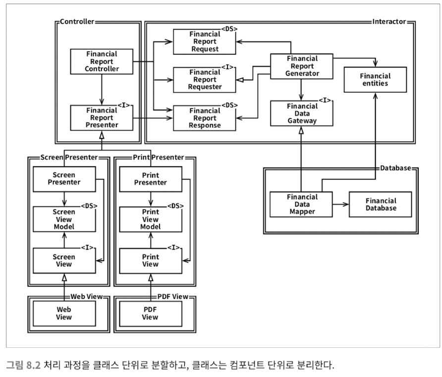

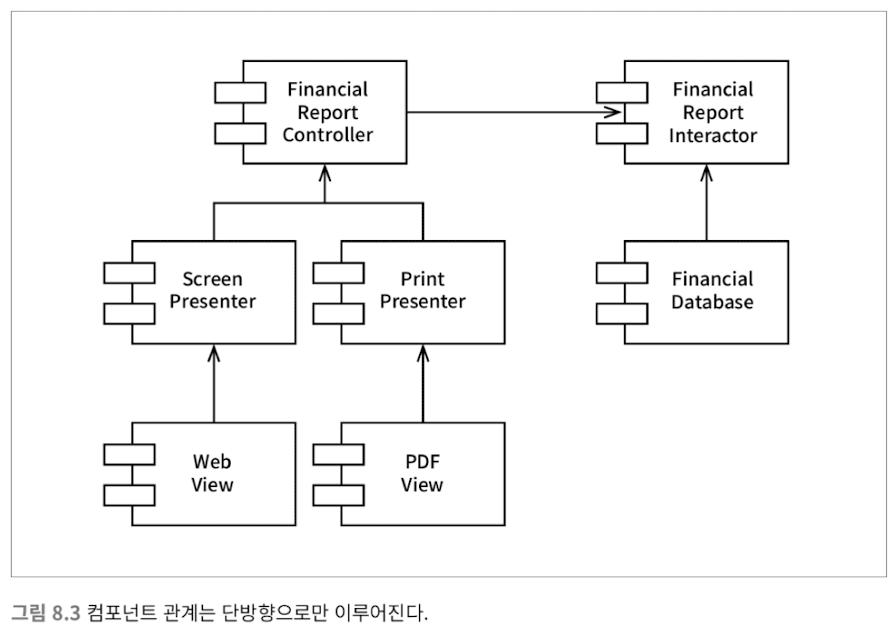

### 리스코프 치환 원칙 (Liskov Substitution Principle, LSP)

> S 타입의 객체 o1 각각에 대응하는 T 타입 객체 o2가 있고, T 타입을 이용해서 정의한 모든 프로그램 P에서 o2의 자리에 o1을 치환하더라도 P의 행위가 변하지 않는다면, S는 T의 하위 타입(subtype)이다. - Babara Liskov, 1988

하위 타입 자리에 상위 타입을 치환하더라도 행위가 변하지 않아야 한다. 치환 가능성이 위배되면, 시스템이 오염되어 많은 보조 메커니즘이 필요해지기 때문이다. LSP는 단순히 상속 관계에서 뿐만 아니라, 인터페이스와 구현체라는 패턴을 가진 모든 구조에 적용된다. 하위 타입에 대한 자연스러운 기대를 바탕으로 만들어진 원칙이기 때문이다.

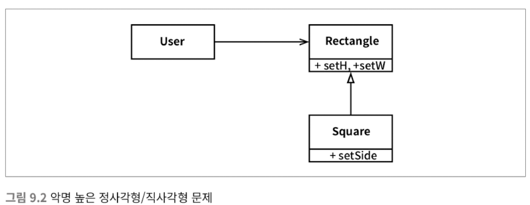

### 인터페이스 분리 원칙 (Interface Segregation Principle, ISP)

기능을 분리한다. 필요 이상의 많은 것을 포함한 모듈은 배포 단위를 복잡하게 만들며, 불필요한 의존 관계를 만들게 되어 복잡한 구조가 되어버리게 한다.

### 의존성 역전 원칙 (Dependency Inversion Principle, DIP)
 
의존성이 추상abstraction에 의존하며 구체concretion에 의존하지 않게 한다.

- 변동성이 큰 구체 클래스를 참조하지 않는다. 대신 추상 인터페이스를 참조한다. 또한 객체 생성 방식도 추상 팩토리를 사용한다.
- 변동성이 큰 구체 클래스에서 파생하지 않는다. 상속은 비용이 크다. 
- 구체 함수를 오버라이드 하지 않는다. 구체 함수는 의존성을 필요로 하게 되는데, 오버라이드 시 의존성 제거가 안된다. 추상 함수로 정의하고 하위 타입에서 구현하는 것이 낫다.

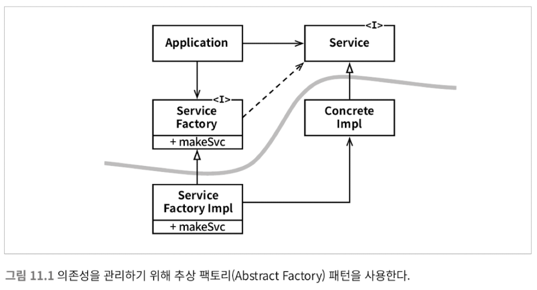

DIP를 사용하여 화살표 방향을 바꿈으로써, 변경에 안전하게 만들었다.

---

클린 아키텍처를 위해 마지막으로 알아볼 것은 컴포넌트다.

## 컴포넌트

먼저 엉클 밥이 말하는 컴포넌트가 무엇인지 알 필요가 있다. 엉클 밥이 말하는 컴포넌트란 **배포 단위**다. DDD에서 말하는 **바운디드 컨텍스트**를 실제 소프트웨어 단위로 구현한 것이라 볼 수 있다. 컴포넌트는 클린 아키텍처를 이루는 하위 요소들이다. 컴포넌트는 **링커를 통해 만들어진 여러 코드 파일들의 묶음의 배포 단위**인 것이다.

이때 컴포넌트를 어떻게 **구성**할지, 컴포넌트 간의 **관계**를 어떻게 가져야 할지가 중요하다.

### 컴포넌트를 구성하는 관점

- 재사용/릴리스 등가 원칙 (Reuse/Release Equivalence Principle, REP)
- 공통 폐쇄 원칙 (Common Closure Principle, CCP)
- 공통 재사용 원칙 (Common Reuse Principle, CRP)

#### 재사용/릴리스 등가 원칙 (Reuse/Release Equivalence Principle, REP)

> **재사용 단위는 릴리스 단위**와 같다.

단일 컴포넌트는 같은 배포 주기안에 들어가야 용이할, 응집성 높은 클래스와 모듈들로 구성되어야 함을 뜻한다.

#### 공통 폐쇄 원칙 (Common Closure Principle, CCP)

> **동일한 이유로 동일한 시점**에 같이 변경되는 클래스들을 같은 컴포넌트로 묶어야 한다. 서로 다른 시점에 다른 이유로 변경되는 것들은 분리되어야 한다.

단일 책임 원칙 (SRP)를 컴포넌트 단위에서 적용한 것이다. SRP를 클래스 단위로 봤을 때, 단일 클래스는 변경의 이유가 여러개 있어서는 안 되었던 것처럼, 단일 컴포넌트 또한 변경의 이유가 하나여야 한다.

#### 공통 재사용 원칙 (Common Reuse Principle, CRP)

> 컴포넌트 사용자들에게 **필요하지 않는 것에 의존하게 하지 않는다.**

같이 재사용되는 경향이 있는 클래스와 모듈들은 같은 컴포넌트에 포함되어야 한다는 의미다. 개별 클래스가 단독으로 재사용되는 경우가 거의 없다. 일반적으로 재사용 가능한 클래스는 재사용 모듈의 일부로써 모듈 내의 다른 클래스와 상호작용한다. 이것이 동일한 컴포넌트에 클래스와 모듈들이 포함되어야 한다는 의미다. CRP는 인터페이스 분리 원칙 (ISP)의 컴포넌트 단위의 관점이다. ISP가 사용하지 않는 메서드가 있는 클래스(인터페이스)에 의존하지 않는 것이라면, CRP는 사용하지 않는 클래스에 컴포넌트가 의존하지 않게 하는 것이다.

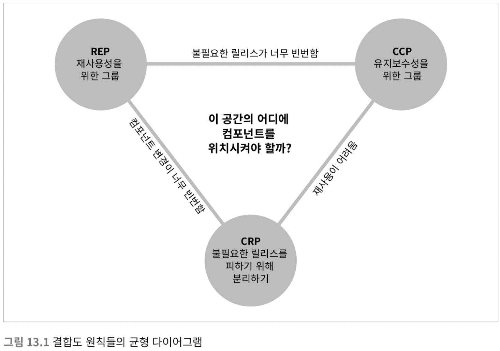

이 응집도의 세 원칙은 서로 상충된다. REP와 CCP는 포함(inclusive) 원칙으로, 컴포넌트를 크게 만든다. 반면 CRP는 배제(exclusive) 원칙으로, 컴포넌트를 작게 만든다. 때문에 위 그림과 같은 균형(tension) 다이어그램을 갖게 된다. 트레이드 오프를 고려하자. REP와 CRP는 **사소한 변경에도 많은 컴포넌트들에 영향**을 주게 되는 경향이 있다. CCP와 REP는 **불필요하고 과도한 릴리스 주기**를 일으킬 경향이 있다. 실용적인 관점으로 바라봤을 때, 개발 초기에는 CCP보다 REP가 더 중요하며, 프로젝트와 조직의 상황에 따라 그래프에서 컴포넌트가 위치해야할 전략이 바뀔 수 있다고 한다.

### 컴포넌트 결합도 관점

**컴포넌트 사이의 관계**는 어떻게 설계되어야 하는가? 기술적이고, 정치적이며, 가변적인 관점에서 개발 가능성과 논리적 설계를 살펴봐야 한다.

- 의존성 비순환 원칙 (Acyclic Dependencies Principle, ADP)
- 안정된 의존성 원칙 (Stable Dependencies Principle, SDP)
- 안정된 추상화 원칙 (Stable Abstractions Principle, SAP)

#### 의존성 비순환 원칙 (Acyclic Dependecies Principle, ADP)

> 컴포넌트 의존성 그래프에 **순환(cycle)이 있어서는 안 된다.**

개발 환경을 릴리스 가능한 컴포넌트 단위로 분리해야한다. 컴포넌트는 개별 개발자나 단일 개발팀이 책임질 단위가 되어야 한다. 담당 개발자는 컴포넌트에 릴리스 번호를 부여하고, 다른 팀에서 사용할 수 있도록 한다. 다른 개발자는 릴리스를 적용할지 결정한다. 각 팀의 통합은 작고 점진적으로 이뤄지게 된다. 다만 이 과정은 컴포넌트 사이의 의존성 구조에 순환이 있어서는 안될 것이다.

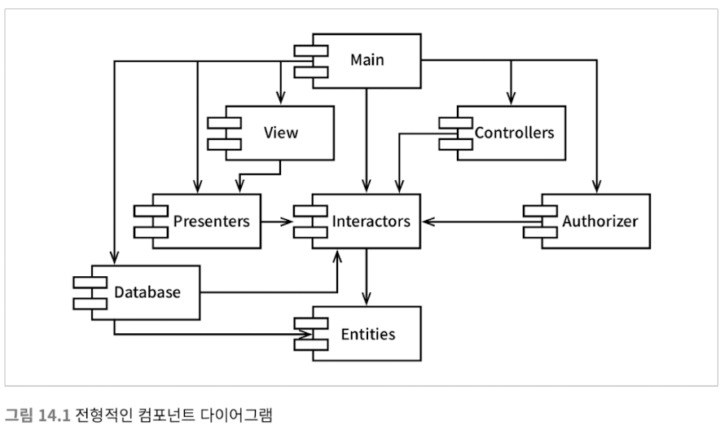

만약 순환 그래프라면, 서로가 의존성을 맞추기 위해, 결함이 쉽게 발생하게 된다.

> 하루 종일 일해서 무언가를 작동하게 만들어 놓고 퇴근했는데, 이튿날 출근해 보면 전혀 돌아가지 않는 경험을 해본 적이 있지 않은가? 왜 작동하지 않게 되었나? 왜냐하면 누군가 당신보다 더 늦게까지 일하면서 당신이 의존하고 있던 무언가를 수정했기 때문이다. 나는 이런 현상을 '숙취 증후군the morning after syndrome'이라고 부른다. (14)

만약 의존성이 생긴다면, 

- **의존성 역전 원칙**이나, 
- **새로운 컴포넌트로 기능들을 분리**하여 

순환 그래프를 끊어야 한다.

#### 안정된 의존성 원칙 (Stable Dependecies Principle, SDP)

> **안정성의 방향으로 의존**하라.

안정성이란 변화가 없다는 것이다.

변경이 쉽지 않은 컴포넌트가 변동이 자주 일어날 것이라 예상되는 컴포넌트에 의존하게 해선 안된다. 정적인 컴포넌트가 의존하게 되면 변동성이 큰 컴포넌트도 변경을 쉽게 할 수 없게된다.

안정된 의존성의 컴포넌트 x는

- **책임**(responsible): 여러 의존하는 컴포넌트를 책임진다. 
- **독립**(independent): 어디에도 의존하지 않으므로, 독립적이다. 

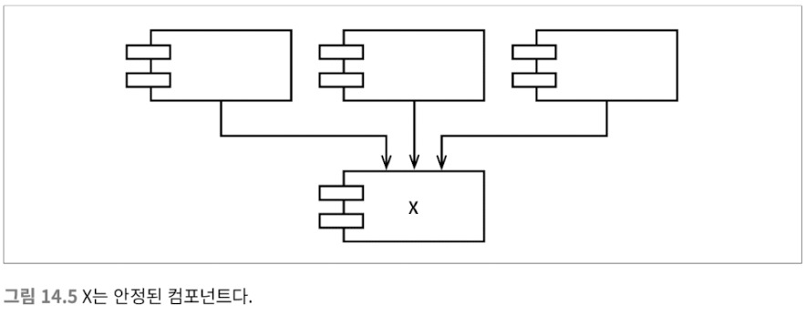

불안정한 컴포넌트 Y는 의존적이다.

- 의존하는 컴포넌트가 없으므로, 책임이 없다.
- 여러 컴포넌트에 의존하므로, **변경이 발생할 수 있는 외부 요인**이 있다.

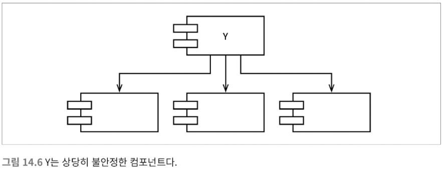

안정된 컴포넌트와 불안정한 컴포넌트를 고려해야 한다. 만약 안정된 컴포넌트가 불안정한 컴포넌트를 의존해야하는 상황에 처하면 어떻게 할까?

#### 안정된 추상화 원칙 (Stable Abstractions Principle, SAP)

> 컴포넌트는 안정된 정도만큼만 추상화되어야 한다.

개방 폐쇄 원칙을 따라 추상 클래스(abstract class)를 도입한다. 클래스를 수정하지 않고도 확장 가능하게 할 수 있다. 

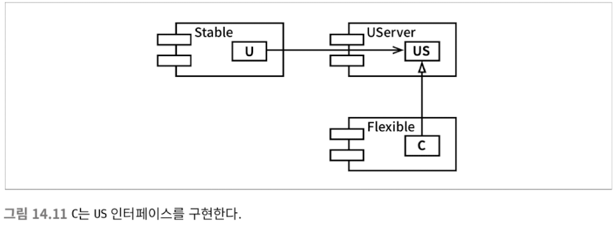

다만, 이때 안정성(stability)과 추상화 정도(abstractness) 사이의 관계를 측정해야한다.

> 추상화 정도 = (컴포넌트의 추상 클래스와 인터페이스의 개수) / (컴포넌트의 클래스 개수)

다음 그래프에서 안정성(I)과 추상화 정도(A)를 보자.

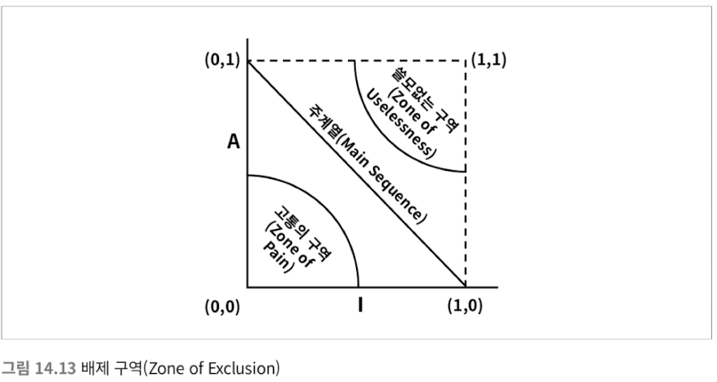

모든 컴포넌트가 안정적인 추상 컴포넌트(0,1)이거나 불안전한 컴포넌트(1,0)에 해당하면 이상적이다. 하지만 현실세계 컴포넌트들의 안정화의 정도는 다양하며, 때문에 배제할 구역을 찾는 방식으로 추론되어야 한다.

- **고통의 구역**: 매우 안정적이며 구체적이다. 추상적이지 않으므로 확장이 힘들고, 안정적이므로 변경도 힘들다. 변동성이 거의 없는 이 구역의 컴포넌트는 해롭지 않다. 하지만 **변동성이 크다면 고통이 커진다.** 데이터베이스 스키마가 예시일 수 있다. 데이터베이스 스키마는 변동성이 높으며, 구체적이고, 많은 컴포넌트가 의존한다. 때문에 애플리케이션과 데이터베이스 사이의 인터페이스는 관리는 굉장히 어렵다.
- **쓸모없는 구역**: 매우 추상적이지만, 누구도 컴포넌트에 의존하지 않는다. 이런 컴포넌트는 쓸모가 없다. 폐기할 필요가 있다.

변동성이 큰 컴포넌트는 두 배제 구역으로 부터 멀리 떨어뜨려, 주계열에 속하도록 해야한다. 다음은 분산 Z로 그래프를 봤을때, 관리 한계(control limit)을 측정해 볼 수 있다. 

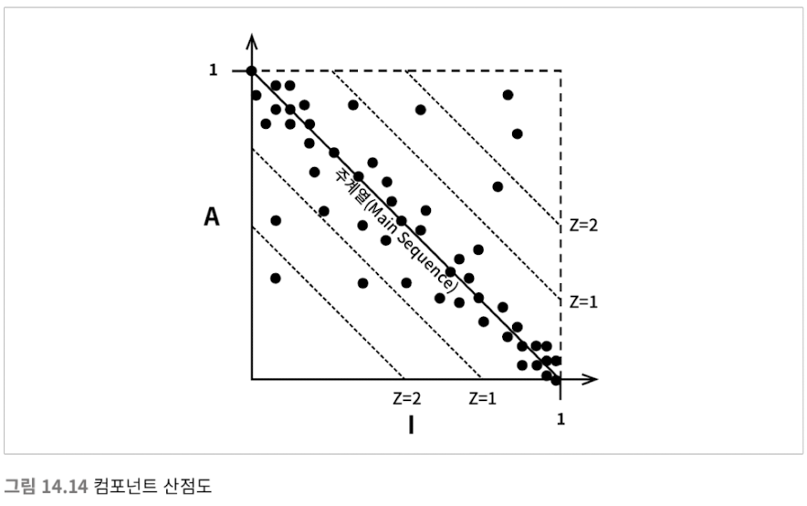

다만, 이런 지표가 문제를 완전히 도출하는 것은 아니며, 측정하여 이슈를 관측하기 위한 참조 도구로 사용하기에 좋다고 한다.

---

## 아키텍처

> 도서관의 아키텍처를 보고 있다고 가정해 보자. 커다란 정문, 체크인과 체크아웃을 담당할 사서를 위한 공간, 독서 공간, 작은 회의실, 도서관의 장서를 모두 보관할 정도의 책장을 배치한 진열실이 차례로 나타날 것이다. 이 아키텍처는 "도서관이야"라고 소리칠 것이다.   
> 자, 여러분의 애플리케이션 아키텍처는 뭐라고 소리치는가? 상위 수준의 디렉터리 구조, 최상위 패키지에 담긴 소스 파일을 볼 때, 이 아키텍처는 "헬스 케어 시스템이야" 또는 "재고 관리 시스템이야"라고 소리치는가? 아니면 "레일스Rails야", "스프링Spring/하이버네이트야Hibernate", 아니면 "ASP야"라고 소리치는가? (21)

좋은 아키텍처는 프레임워크나 도구, 환경에 구애받지 않고 유스케이스를 지원하는 구조여야 한다.

아키텍처는 세부사항을 정책으로부터 신중하게 가르고, 정책이 세부사항과 결합되지 않도록 엄격하게 분리해야 한다. 세부사항에 의존하지 않게 하여, 세부사항에 대한 결정을 가능한 오랫동안 미룰 수 있도록 설계해야 한다.

두 가지 관점(aspect)에 의한 분리가 일어날 수 있다.

- 계층 결합 분리
- 유스케이스 결합 분리

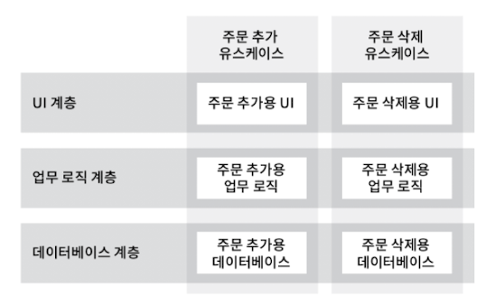

분리 수준을 세부적으로 정리해보면 다음이 될 수 있겠다.

- **소스 수준 분리**: 모놀리식 구조
- **배포 수준 분리**: jar, DLL, 공유 라이브러리 같이 배포 가능한 단위들로 의존성 제어. 이를 통해 한 모듈의 소스 코드가 변해도 다른 모듈을 재빌드하거나 재배포하지 않아도 된다.
- **서비스 수준 분리**: 의존하는 수준을 데이터 구조 단위까지 낮출 수 있게되며, 네트워크 패킷을 통해서만 통신하도록 만들 수 있다. 모든 실행 가능한 단위는 소스와 바이너리 변경에 대해 완전히 독립적이다. (마이크로서비스)

컴포넌트가 서비스화될 가능성이 있다면, 컴포넌트 결합을 분리하되 서비스가 되기 직전에 멈추는 방식을 선호한다고 엉클 밥은 말했다. 좋은 아키텍처는 시스템이 모놀리식 구조로 시작되어 단일 파일로 배포되더라도, 독립적으로 배포 가능한 단위들의 집합으로 성장하여, 분리 수준이 성장 가능하도록 만들어져야 할 것이다.

### 클린 아키텍처

클린 아키텍처의 핵심은 **관심사의 분리(separation of concerns) 이다.** 관심사 분리는 다음으로 이루어진다.

- 프레임워크 독립성
- 테스트 용이성
- UI 독립성
- 데이터베이스 독립성
- 모든 외부 agent에 대한 독립성

이런 분리를 위해선 어떻게 해야할까? 경계를 그어야한다.

### 경계

관심사간에 경계를 긋는다. 경계를 긋기 위해, 그 경계선을 험블 패턴을 이용한다.

- **험블**(humble): 테스트하기 어려운 동작들을 분리하여 모은 객체. 가장 기본적인 본질을 남겨 테스트하기 쉽게 하고, 험블 객체는 스텁을 이용한다.

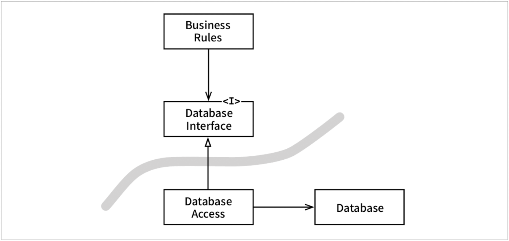

이때 컴포넌트 간에 경계가 형성된다. 이때 컴포넌트의 응집도/결합도 원칙들 또한 살펴봐야 할 것이다.

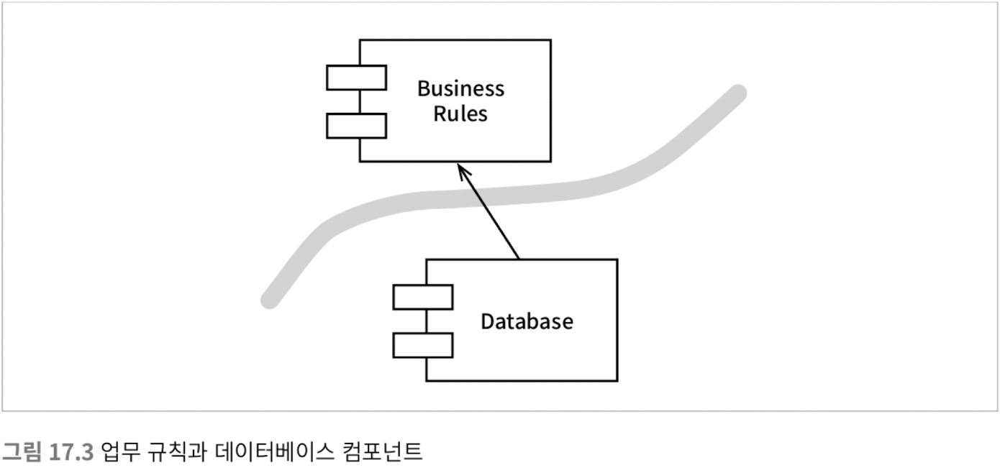

이렇게 경계를 형성하게 되면, 고수준의 정책은 안쪽으로 향하게 된다.

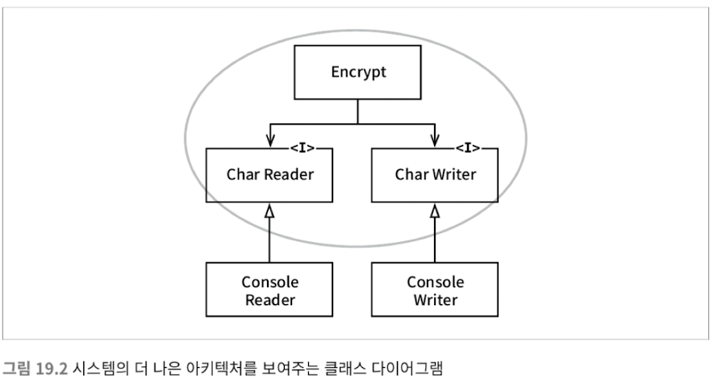

이것이 클린 아키텍처이다.

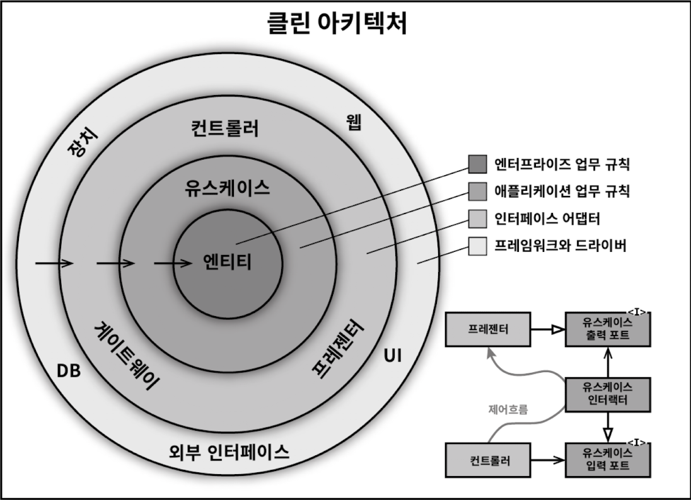

엔터프라이즈 애플리케이션 아키텍처 관점에서 클린 아키텍처를 구성하는 계층들을 살펴보자.

## 계층

먼저 클린 아키텍처를 이루는 일반적인 계층들을 고수준 순으로 정리해보면 다음과 같다.

- 엔티티
- 유스케이스
- 인터페이스 어댑터

#### 엔티티

핵심 **비즈니스 로직**을 캡슐화한다. 엔티티는 메서드를 가지는 객체이거나 일련의 데이터 구조와 함수의 집합일 수도 있다. 기업의 다양한 애플리케이션에서 엔티티를 재사용할 수만 있다면, 비즈니스 로직을 구현하는 형태는 트랜잭션 스크립트든 도메인 모델이든 중요하지 않다.

#### 유스케이스

유스케이스는 **자동화된 시스템이 사용되는 방법**을 설명한다. 유스케이스는 사용자가 제공해야 하는 **입력**, 사용자에게 보여줄 **출력**, 그리고 해당 출력을 생성하기 위한 **처리 단계**를 기술한다. 엔티티 내의 핵심 업무 규칙과는 반대로, 유스케이스는 애플리케이션에 특화된 업무 규칙을 설명한다. 유스케이스는 단일 애플리케이션에 특화되어 있으며, 따라서 해당 시스템의 입력과 출력에 보다 가깝게 위치한다. 엔티티와 유스케이스는 함께 묶여선 안된다. 함께 묶이면 공통 폐쇄 원칙과 단일 책임 원칙을 위배하게 된다.

#### 인터페이스 어댑터 (Interface Adaptor)

프레젠터(presenter), 뷰(view), 컨트롤러(controller) 모두 인터페이스 어댑터 계층에 속한다. 또한 이는 데이터 게이트웨이도 마찬가지다. 원 안에 속한 어떤 코드도 데이터베이스나 웹 같은 외부 에이전시를 알아서는 안된다.

이렇게 계층을 나눴다. 다만 엉클 밥은 다시말하지만 클린 아키텍처의 진정한 의미에 대해서 한번 더 강조한다.

> 원들은 그저 개념을 설명하기 위한 하나의 예시일 뿐이다. 네 개보다 더 많은 원이 필요할 수도 있다. 항상 네 개만 사용해야 한다는 규칙은 없다. 하지만 어떤 경우에도 의존성 규칙이 적용되어야 한다. 소스 코드 의존성은 항상 안쪽을 향한다. 안쪽으로 이동할수록 추상화와 정책의 수준은 높아진다. (22)

마틴 파울러도 이에 대해 [단순히 방향이 데이터소스 레이어로 향하던 고전 레이어드 아키텍처에서, **매퍼**를 사이에 배치하여 도메인이 데이터 소스에 의존하지 않도록 설계하는 방식](https://martinfowler.com/bliki/PresentationDomainDataLayering.html)을 비교해서 이야기했다. 다만 이것이 물리적 계층이 아닌 논리적 계층을 의미한다.

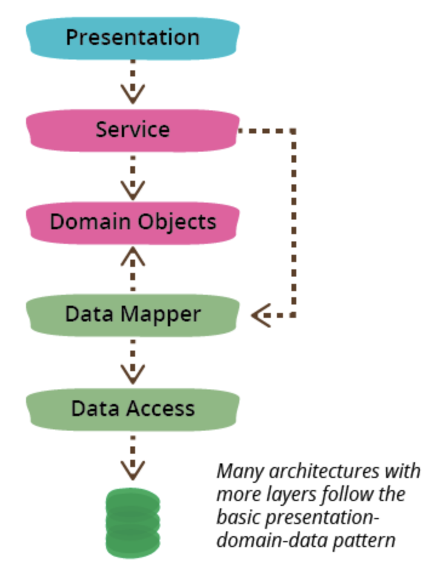

따라서 흐름은 시간순으로 다음과 같을 것이다.

- 컨트롤러 > 유스케이스 > 엔티티 / 데이터 엑세스 > 유스케이스 > 프레젠터 > 뷰

그리고 다음은 그 구조다. (스프링에선 Controller와 Presenter가 하나로 구성된다.)

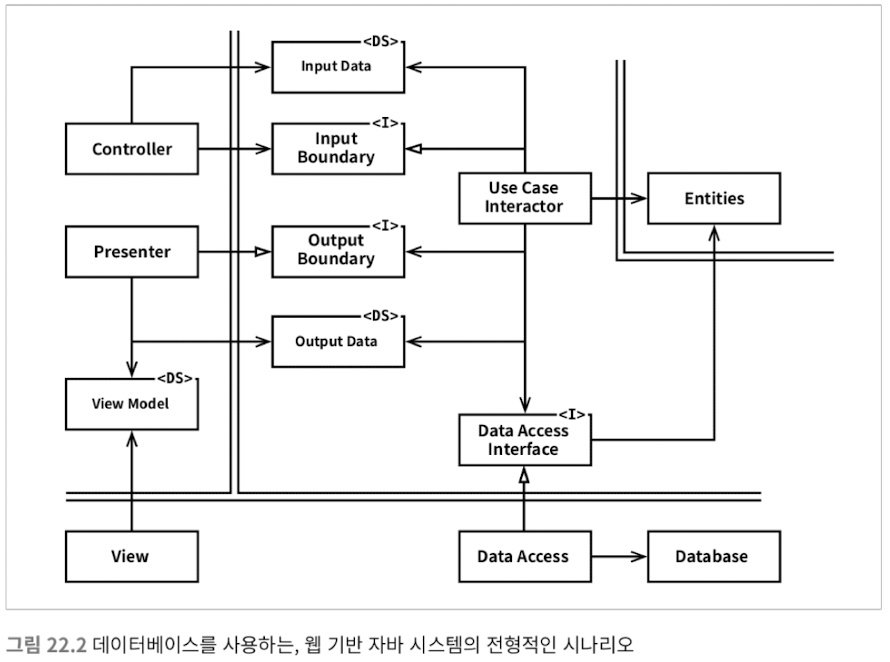

컴포넌트 단위로 설계한다면 다음과 같을 것이다.

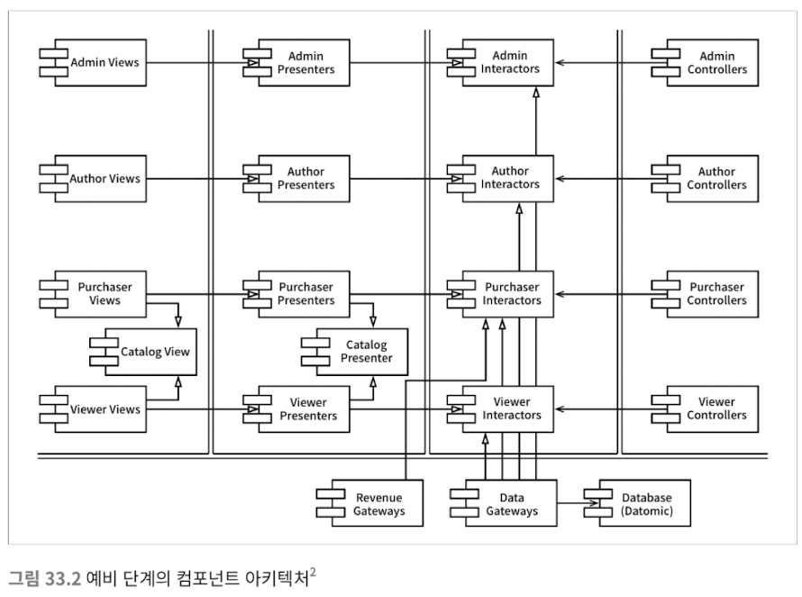

---

클린 아키텍처의 본질은

- 세 가지 프로그래밍 패러다임을 인지하고,
- SOLID를 이해하고,
- 클래스와 컴포넌트 간의 구성에 있어 깔끔한 응집도와 결합도로 관심사를 잘 분리하여,
- 고수준 추상화와 정책을 더 안쪽에 두고 그 안쪽을 향해 의존성을 갖춘

아키텍처를 설계하는 과정이다. 이제 돌아가서 클린 아키텍처를 적용해 볼 차례다.