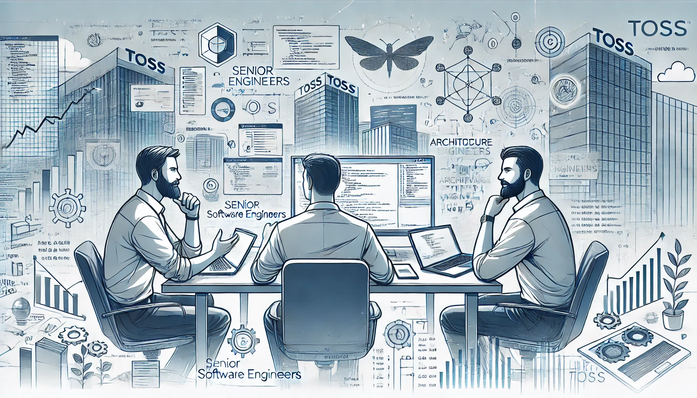

최근 경력이 쌓여가며, 고민에 빠졌다. 최근, 나는 주니어에서 벗어나 미들로 성장해야 하는 시기에 접어들었다. 하지만, 어떤 역할을 해야 할지, 무엇을 준비해야 할지 혼란스러웠다.

중간에 차세대 PI(Process Innovation) 프로젝트에서 맡은 롤로 인해 1년 반 정도는 개발 실무를 하지 않았다. 하지만 경력은 만 4년차이다. 이제 무언가 단순히 기술적인 것 외에, 좀 더 큰 것 또한 알아야 한다고 느꼈다. 그래서 최근 도메인 주도 설계와 XP에 대해 공부하고 있다. 보다 요구사항을 자세히 들여다보고 설계하며, 책임 주도하에 극한으로 개발할 수 있는 방안을 찾는 것이다.

그러던 와중에 토스에서 시니어의 성장 회고에 관한 온라인 세션을 한다고 했다. 비록 나는 시니어가 아니지만, 성장 방향이 필요해 신청했다. 이 글은 어제(2025.02.24) 있었던 토스 시니어 개발자 세 분 세션에 대한 회고이자 정리이다.

---

## 세션 1 - 엔지니어에서 메이커로

- 김현준 연사님

> "이전에 저는 소프트웨어 엔지니어였습니다. 지금은 저를 **프로덕트 메이커**라고 합니다"

프로덕트 메이커란 무엇인가? 소프트웨어 엔지니어와 비교해보았을때 다음과 같다고 한다.

- 주도성에 대한 결핍 제거
- 이미 만들어진 것 vs **만들어내는 여정**
- 중요한 문제를 푸는 것 vs **문제를 발굴하는 것**
- 사용자와의 거리 최소화

단순히 요구사항을 빠르게 완수할 뿐만 아니라, 제품을 사랑하고 함께 만드는 일원으로 행동해야한다. 조직에서 누구보다 유능한 기술 전문가로서, 다른 이들은 보지 못하고 있는 **문제를 외면하지 않는 것**이 시니어의 책임이다.

시니어에게 기술은 단지 스킬의 하나일 뿐이다. 정말 중요한 것은  종합적인 판단 능력과 그 판단을 적용하고 이루어내는 **가치의 총량**이다.

물론, 위의 것들을 모두 달성하기 위해선, 엔지니어링은 기본이다.

시니어는 빠른 기술적 성장을 다룰 수 있어야하는데, **기술 부채를 빌려쓰는 투자 전문가**라 할 수 있다.

- 나와 **팀의 기술 자산 흐름을 파악하고 결정**할수있는 현명한 판단
- 부채가 발목을 잡기 전에 **적절한 시점**에 **무리없이** 갚을 수 있는 자신감과 책임감

> 빨리 만들고 빨리 버린다. 토스의 실천적 엔지니어링 연구 문화. 오래 지속되지 않을 코드에 대해서 많은 리소스를 투자하지 않는다. (당연히 **결함은 결코 타협하지 않는다**. 결함은 절대 트레이드 오프가 아니다!) **모든 스테이지(트래픽 규모 등)에는 적절한 아키텍처가 있다**. 이를 판단하는게 중요하다. 또한 기능은 **추가보다 폐기가 어렵기 때문에, 추가해서 얻고자 하는 것이 명확해야한다**.

빠르고 잦은 배포. 1차적으로 팀의 PO가 결정한다. 설득하거나 수용하고 넘어가지만, 그럴 수 없다면, 논쟁으로 시간을 지지부진하게 끌 시간에 일단 빠르게 만들어보고, 데이터 확인해보고 결정한다. 각자 빠르게 만들어보고 AB 테스트하는 것이다. (만들 수 없다면, 무의미한 주장이겠지!)

---

## 세션2 - 성장하고 싶은 개발자에게는 어떤 환경이 필요한가

- 구태진 연사님

> "저는 단순한 고인물이 아니라, **계속 고민하는 환경**에서, 더 깊고 견고한 형태가 되었습니다."

큰 장애가 발생했다. 어떤 의존성 도입에서 필요한 이벤트 처리를 누락했고, 이로 인해 스핀락이 무한히 발생했다. 이를 해결하기 위해 오랜 시간을 투자하여 문제를 발견하고 해결했다. 비슷한 사례가 다른 곳에서도 발생한 것을 확인했는데, 해외 유명한 기업에서는 이 문제를 버그로 단정지으며, 우회 방안에 대해 소개하더랬다.

두 가지 깨달음이 있었다고 했다.

- 경험이 많다고(시니어라고) 실수하지 않는 것은 아니다. 모두 실수할 수 있다.
  - 전세계적으로 시니어는 완벽하지 않다. 스스로 열심히 공부하는게 중요하다는 것.

- 깊이 고민한 문제 하나가, 몇 년간의 스터디들 보다 더 큰 지식을 남긴다.
  - 스터디는 빨리 휘발되지만, 해결한 문제는 오래, 그리고 깊게 남는다는 것.

고민할 수 있는 환경을 지속적으로 만들어내는 방안은 다음과 같다.

- 단순 반복적인 작업보다, 생각할 여지가 많은 문제를 선택한다.
- 더 깊이 고민할 수 있는 기능을 미리 제안하고, 기능을 개발한다.
- 별거 아닌 것도 조금 더 고민한다.

그리고 이런 고민을 개발 조직 전체로 확장한다.

- 신규 기술에 대한 고민
- 해외 컨퍼런스
- 장애 회고

또한 고민에 대한 최선의 방식을 공유한다면,
회사의 정책으로 발전하기도 하고, 조직 전체의 개선을 일으킬 수 있는 것이다.

추가적으로, 이슈 트래킹은 이렇게 한다고 하신다.

1. 이슈 재연이 가능한지 본다.
2. 이슈 재연이 불가능 하면, 레이어를 나누고 범위를 좁힌다.
3. 범위가 좁아지면, 로그를 남기기 시작한다.

---

## 세션3 - 개발자의 성장, 조직이 아닌 내가 만들어간다

- 이항령 연사님

> "개발을 잘하는 것은 주변 동료이고, 조직장은 대체 뭘 하는 것인지 모르겠었다. 조직장을 닮고 싶진 않았다. 시니어의 성장은 직책에 대한 성장보다, **결과를 만들어 내는 힘의 성장** 이라고 생각한다."

직책을 기반으로 주변 사람들의 일을 챙기는 방식이 있다.

- 같이 오래 일했으니, 계속 같이 일하자
- 많은 회의에 실무자를 불러, 같이 들어가기

이런건 부족하다. 효율이 좋지 못하다. 그럼 어떻게 해야할까? 세가지로 정리했다.

- **지속적인 높은 가치 제공**: 경쟁 상대는 위 뿐만이 아니다. 아래에서도 끊임없이 발전한다. 내가 하는 역할을 아래가 할 수 없어야 한다. 지속적으로 성장하여, 더 높은 가치를 제공해야 한다.
- **결과의 효능감**: 시니어로서, 다른 사람이 문제를 겪고 있을 때 도움이 되어주어야 한다.
  - 장애대응
  - 부탁한 것을 해결
  - 필요로 하는 도움을  제공
- **직접**: 주어진 업무를 수행하는 데 그치지 않고, 직접 사업과 서비스를 성장시키는 방식
  - 단순히 회사의 부품이 아니라, 직접 제안하여 사업을 성장시킴

또한 돌이켜보니, 환경과 사람(동료와 CEO)이 따라줘야 한다.
시니어가 될 수록 몸 담는 회사가 중요해진다. CEO의 의사결정이 중요해지기 때문이다. (조직 구조, 성장 가능성)

회사의 성장이 개인의 성장을 강제적으로 끌어올릴 수 있다.

**DRI, Directly Responsible Individual**: 완전한 위임을 통하여 해당 업무에 대해서 최종적인 의사결정권을 가지는 자. 이때 최종 결정을 한다는 것은 독단적인 판단을 한다는 것이 아니라, 최대한 많은 정보와 의견 속에서 결정한다는 것을 의미한다.

일 잘하는 사람의 결과는 동일하다. 방식이 다를 뿐이다. 그 사람이 만든 결과가 정말 좋은지. 지속적으로 좋아지는지, 노력하는지.

시니어의 기준은, 기술적인 것도 있지만, 신규 서비스에 대해서 누구에게 믿고 맡길 수 있느냐를 기준으로 둔다. 그 사람이 주는 그동안의 퍼포먼스, 역량의 히스토리로 판단하게 된다.

---

여러모로 더 복잡해졌다. 하지만 모르는 것조차 모르던 때보다 낫다. 세 분의 이야기에는 공통적인 것이 있다. 곳곳에 애자일과 도메인에 대한 이야기가 있었다. 기술적인 소양과 더불어 방법론과 요구사항 정의, 도메인 설계 대해서 꾸준히 익히고 실천해야한다고 느꼈다.

그리고, **시니어의 기준**이라는 것이 너무 멋지다. **과정과 관계없이 믿을 수 있는 결과를 만들어내는 사람**. 기술적, 비즈니스적 신뢰를 모두 갖춘 사람이란 뜻일 것이다. 그런 사람이 되기 위해서 나의 과정은 어떻게 만들어 나아가야 할지 고민해보자.
